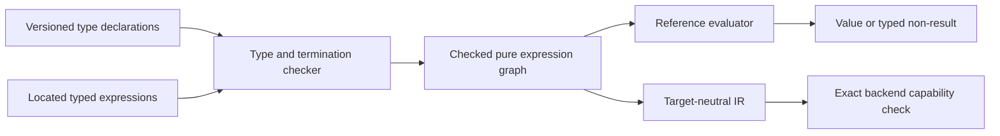

# Complete value, type, expression and collection system

## System Boundary

S2 owns the versioned value/type algebra, pure expressions, functions,
definedness and collection semantics shared by state clauses, temporal atoms,
protocol guards, analyzers and mappings. QSL is the reference checker and
evaluator. The cycle-free contract model may represent these meanings, but no
Rust type, IR encoding or backend limit defines the language.

Complete V1 contains Boolean, mathematical and bounded integers, normalized
rationals, exact decimals, explicit IEEE binary-float profiles, text,
declaration-qualified enumerations, quantities, presence/null, records, tuples,
finite recursive values, object references, sequences, sets, bags and ordered
sets. All conversion is explicit and reports loss or refusal.

## Views

Values are mathematical and profile-selected. Consumers needing finite domains
must obtain explicit bounds; they cannot invent maxima, round exact values or
encode absence as a scalar. Records and tuples use declared structural
equality, while object references use qualified identity. Recursive type
definitions require finite runtime values and bounded traversal.

The immutable `quire.value.complete/v1` definition owns the common value
algebra. A checked package using text, integer division or IEEE operations also
retains the exact applicable definitions below in its ordered profile closure;
their identities, versions and byte digests participate in package identity.
There is no installed-tool or backend default.

| Semantic selection | Closed complete-V1 definition |
| --- | --- |
| Scalar resource accounting | `quire.value.accounting/v1` |
| Derived compound-unit value identity | `quire.value.compound-unit/v1` |
| Normative scalar rule closure | `quire.value.complete.rules/v1` |
| Unicode normalization tables | `quire.value.text.unicode-17.0.0/v1` |
| Integer `div`/`rem` law | exactly one of `quire.value.integer-division.truncating/v1`, `quire.value.integer-division.floor/v1` or `quire.value.integer-division.euclidean/v1` |
| IEEE exceptional-value and flag policy | `quire.value.ieee754-2019-default/v1` |

An absent optional rounding spelling means strict `exact`: a representable
result succeeds without loss and a result requiring discarded information
refuses. For IEEE values, `exact` is a language-level strictness policy rather
than a sixth IEEE rounding direction. The other five spellings select the five
IEEE 754-2019 directions. Every semantic operation returns exactly one of a
completed value (with provenance and any typed loss), undefined, refused or
incomplete; a false Boolean is a completed value and is never a refusal.
Static `ill_typed` is the code carried by a refused type-checking result, not a
fifth semantic outcome. `requires-bound` and `unsupported` are per-item I13
provider-negotiation dispositions and never change package admission or stand in
for an evaluator result.

Pure functions declare parameter and result types, effects=`none`, a
termination obligation and resource limits. Recursion is admitted only after a
well-founded decrease is established. Runtime fuel remains independent:
exhaustion returns incomplete even for a statically terminating function.

Collections share bounded traversal operations while preserving kind-specific
order, uniqueness and multiplicity. `map` and `collect` are one operation;
filter, flatten, fold/reduce, quantifiers and conversions have explicit result
kinds, empty cases, intermediate bounds and deterministic exposure rules.

## Decisions

| Choice | Rejected alternative | Consequence |
| --- | --- | --- |
| One shared typed expression graph | Separate expression languages per family | State, temporal and protocol consumers share exact typing and source correspondence. |
| Mathematical semantics plus explicit finite admission | Machine-width or backend-driven semantics | Finite consumers refuse missing bounds without narrowing the language. |
| Exact decimal and explicit IEEE profiles are distinct | A generic numeric/float type | Decimal equality is coefficient/scale semantic; IEEE exceptional values and rounding remain profile-visible. |
| Checked recursion plus independent runtime limits | Refuse all recursion or trust fuel as termination | V1 admits total recursive functions without claiming that exhaustion is a logical result. |
| Collection kinds retain their algebra | Convert everything to sequences | Order, uniqueness and multiplicity cannot be silently fabricated or lost. |

## Risks

| Risk | Control |
| --- | --- |
| A backend silently approximates unsupported values | Per-node capability negotiation and explicit refusal before artifact emission. |
| Structural and object identity collapse | Distinct types and equality matrices; no cross-domain equality. |
| Float nondeterminism escapes provenance | Width, rounding mode, exceptional-value policy and tool pins enter the package/run identity. |
| Recursive or aggregate work becomes unbounded | Static termination/domain obligations plus separately charged runtime limits. |
| Nominal identities are caller-minted from names or source positions | Enum, unit and dimension handles are issued only from I04 checked semantic-graph node identities. |
