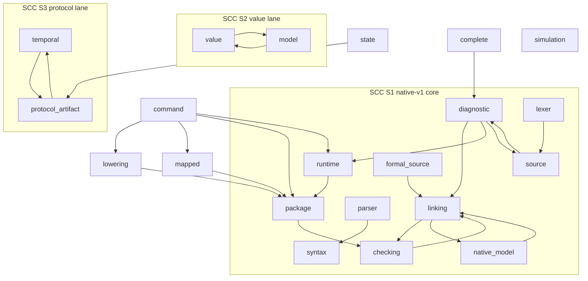
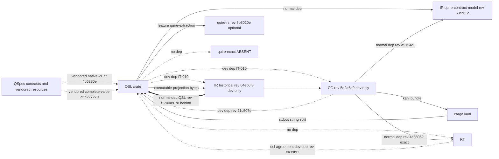

# ADR-010: Observed QSL and backend architecture baseline (ARCH-00)

## Status

Proposed, 2026-09-19. Owning ticket: agent-ix/quire-spec-language#206 (ARCH-00),
epic #205, Layer 0. Acceptance is decided at the baseline authority gate #208.
Supersedes nothing.

## Context

Epic #205 requires an evidence-backed record of the architecture as implemented
before any Layer 1 design ticket (#209, #210, #211) decides the target
architecture. #206 requires every stage, handoff, owner and dependency claim to
carry an evidence path at a named revision, and requires disagreements between
intended and observed architecture to be recorded as findings.

This record describes what exists at the revisions below. Where it names an
intended design (AD-016, the #205 program flow), it names it only as the
reference the observation is compared with. Nothing in this record states that
an intended element exists unless the cited code contains it.

### Revisions inspected

All revisions are `origin/main` on 2026-09-19.

| Repo | Short name | sha |
|---|---|---|
| agent-ix/quire-spec-language | QSL | de627b58a42c5d9f84700609bdced407360c026d |
| agent-ix/quire-contract-ir | IR | 553b6d1527bf3158b0147b21a5061f2b71db2f66 |
| agent-ix/quire-contract-runtime | RT | d97bc0b0186450ad3b7ca885ffe94248d3dca633 |
| agent-ix/quire-contract-codegen | CG | a4b2a733fd341fc108cdb2ea926fdde6225ea4c1 |
| agent-ix/quire-specification | QSpec | 3a79dcedaffb423cfee6b74e4d6b5456ed2f90c7 |
| agent-ix/filament-core-data | FCD | 7dcb2f2c7466a770b2362561e70ed10a8f941c1f |
| agent-ix/quire-integration | QI | 40cff46e81026ffd9236f406f1b5677042ce83c0 |

### Evidence convention

Every evidence cell is `<prefix>:<path>:<line>` at the revision above.

| Prefix | Expands to |
|---|---|
| `QSL:` | `quire-spec-language@de627b5:src/` (paths starting `tests/`, `examples/`, `resources/` or `Cargo.toml` are repo-root relative) |
| `QSpec:` | `quire-specification@3a79dce:` |
| `IR:` | `quire-contract-ir@553b6d1:` |
| `RT:` | `quire-contract-runtime@d97bc0b:` |
| `CG:` | `quire-contract-codegen@a4b2a73:` |
| `FCD:` | `filament-core-data@7dcb2f2:` |
| `QI:` | `quire-integration@40cff46:` |

A `~` before a line number marks an approximate line inside the named function.
Section references (`§`) point inside this record.

### Summary counts

| Measure | Count | What it counts |
|---|---|---|
| Present QSL stages | 28 | Stages with an entry function and output type in `src/`: lane A native-v1 8, lane B composed 10, lane C complete-V1 7, lane D simulation 3 (§2) |
| Absent stages | 7 | Stages AD-016 or the #205 program flow names that have no implementation on QSL main (§2.6) |
| End-to-end CLI lanes | 1 | native-v1: parse → link → check → package → lower or run |
| Proof-and-replay paths | 1, test-only | IT-010 `tests/configversion_backends.rs` (§2.1 A9–A11) |
| Module SCCs with more than one module | 3 | Largest has 11 modules; plus 7 two-cycles (§3.1) |
| Cross-repository repo cycles | 1 | IR root ⇄ QSL (§3.2) |
| Duplicate or ambiguous authorities | 17 | 13 DUPLICATE, 4 AMBIGUOUS (§5, items DA-01…DA-17) |
| Findings | 36 | OBS-001…OBS-036. Primary owner #209: 13, #210: 6, #211: 17 (§9) |
| AD-016 claims checked | 46 | QSL side 14 (§1). Downstream 32 (§6.1) |
| Open QSL issues mapped | 68 | Every open issue in agent-ix/quire-spec-language (§7) |

## Decision

1. This record is the Layer 0 current-state baseline for epic #205. Layer 1
   tickets #209, #210 and #211 use it as their evidence input and do not need a
   second repository census.
2. This record adopts no target design. It authorizes no refactor, crate split,
   new abstraction, feature or compatibility promise.
3. Each Layer 1 decision item in §9 has exactly one owning ticket. That ticket
   decides the item. An item that touches a second ticket names it as a
   secondary input only.
4. Work-in-progress dispositions follow the ARCH-01 classification posted on
   #207 (§8), not any disposition implied by the evidence census.

## 1. AD-016 claims checked against QSL main

AD-016 source: `QSpec:spec/assurance/AD-016-semantic-family-extension-path.md`
(accepted). It is the reference design; the right-hand columns are the observation.

| AD-016 claim | Observed on QSL main | Verdict | Evidence |
|---|---|---|---|
| QSL check → checked-package/v2 | No v2 emitter. QSL has a reader of the v2 identity preimage only. The v2 schema is a QSpec proposal. | DISAGREES | `QSL:value/package_identity.rs:13,15,334` · `QSpec:proposals/checked-package-v2/schema.json` |
| Shared kernel crate `quire-exact` (Owner decision 2) | No `crates/quire-exact` and no Cargo dependency on it. | ABSENT | `QSL:Cargo.toml` (dependency list) |
| `model::intake` | Not on main. PR #200 adds it (2104 lines). | ABSENT on main | `QSL:model/` tree · PR #200 |
| ValueTypeRef / NativeValueType for native refs | PR #200 uses `DeclarationKey{package:"quire/native", node:"ix://quire/native/<Name>"}`. | DISAGREES (PR) | PR #200 `src/model/intake.rs` |
| QSL is sole minter of spans; SourceMap keyed by checked node id | `SourceMap` maps body bytes to document bytes and is not keyed by node id. Value-lane `Location` carries no byte spans. | DISAGREES | `QSL:source_map.rs:30` · `QSL:value/expression/refusal.rs:32` |
| QSL admission "negotiates nothing"; CG `negotiate_*` is the single negotiation point | QSL has `Backend{identity, capabilities, families}` and returns `UnsupportedCapability` / `UnsupportedFamily`. QSL has `negotiate_integer_division` and `negotiate_ieee`; RT has its own copies. CG has only `negotiate_kani_obligations`. | DISAGREES | `QSL:linking/composed/requests.rs:80,282` · `QSL:value/division.rs:223` · `QSL:value/ieee.rs:830,882` · `RT:src/exact/ieee.rs:819` · `RT:src/exact/division.rs:217` · `CG:src/kani_obligations.rs:454` |
| native-v1 `runtime::execute` is not a replay target | IT-010 replays through `runtime::execute`. | DISAGREES (test) | `QSL:tests/configversion_backends.rs:252,259,946` |
| Witness arrives as IR typed witness (`KaniOutcomeKind`, 10 kinds) | IT-010 decodes by splitting stdout on `let concrete_vals: Vec<Vec<u8>> = vec![`. | DISAGREES (test) | `QSL:tests/configversion_backends.rs:843-857` |
| Replay via `value::expression::CheckedPackage::call` | `call` exists, keyed by function name (`&str`). Only tests call it. | PRESENT, unwired | `QSL:value/expression/mod.rs:635` |
| QSL → contract-model normal dependency | `quire-contract-ir = {package="quire-contract-model", rev 53cc03c}` | AGREES | `QSL:Cargo.toml:36` |
| QSL dev-dependency on CG rev 5e2a6a9 | Present | AGREES | `QSL:Cargo.toml:43` |
| QSL dev-dependency on IR historical rev 04eb6f8 | Present as `quire-contract-ir-historical` | AGREES | `QSL:Cargo.toml:44` |
| `Capability` in QSL | 4 variants: FamilyCheck, StateOperation, FiniteReplay, TemporalProjection | AGREES (count) | `QSL:linking/composed/requests.rs:36` |
| Kani launcher sha | `KANI_SHA256 7f143a25…` matches the AD-016 launcher sha | AGREES | `QSL:tests/configversion_backends.rs` constants |

Tally: 5 agree, 1 present but unwired, 8 disagree or absent.

## 2. Stage graph

Columns: entry function → output type, plus refusal type. The input is the
previous row's output unless stated.

### 2.1 Lane A: native-v1 (edition 0-draft). CLI-reachable and the only end-to-end lane.

Orchestrator: `command::compilation::package` (`QSL:command/compilation.rs:~95`)
runs parse → link → check → package in that order.

| # | Stage | Entry | Input | Output | Refusal |
|---|---|---|---|---|---|
| A1 | Source read | `Source::read` `QSL:source.rs:94` (`read_verified` :189) | bytes, path | `Source` | `Box<Diagnostic>` `QSL:diagnostic.rs:306` |
| A2 | Parse | `parser::parse` `QSL:parser.rs:13`, `parse_source` :25 | `Source`, `Limits` | `ParsedUnit` `QSL:syntax.rs:324` (flat arena, `ExprId` `QSL:syntax.rs:57`). No CST. | `Box<Diagnostic>` |
| A3 | Model admission | `model_source::read` `QSL:model_source.rs:248`, `.admit` :225 | model JSON (native-state-model/1,2 · native-rule-model/1,2) | `NativeModel` | `Box<Diagnostic>` |
| A4 | Link | `linking::link` `QSL:linking.rs:295`, `link_native` :319 | `ParsedUnit`, models | `LinkedPackage` `QSL:linking.rs:190` (formal environment native-formal-environment/1, :202) | `Box<Diagnostic>` |
| A5 | Check | `checking::check` `QSL:checking.rs:302` | `LinkedPackage`, bindings | `CheckedPackage<'a>` `QSL:checking.rs:263` | `Box<Diagnostic>`. Definedness is delegated to IR `DeclarationEnvironment::check_expression` (`QSL:checking/proof.rs:660`). |
| A6 | Package | `NativePackage::new` `QSL:package.rs:252` | `CheckedPackage` | `NativePackage` `QSL:package.rs:224`, identity `NativePackageIdentity` :202, format native-checked-clauses/1 (`QSL:package/view.rs:45`) | `PackageError` `QSL:package.rs:141` |
| A7 | Lower | `lowering::lower_for` `QSL:lowering.rs:283` (`lower` :274) | `NativePackage`, target | `NativeProjection` `QSL:lowering.rs:228`; wire `ir::EXECUTABLE_PROJECTION_FORMAT` (`QSL:lowering/wire.rs:51`); targets boolean-oracle/v1, integer-ir/v1, state-scalar-ir/v1 (`QSL:lowering/target.rs:39-46`) | `LoweringError` `QSL:lowering.rs:140` |
| A8 | Execute (native) | `runtime::execute` `QSL:runtime/execution.rs:97` (validate `QSL:runtime/validation.rs:181`, evaluate `QSL:runtime/evaluation.rs:40`) | `NativePackage`, native-state-input/1 | `ExecutionReport` `QSL:runtime/execution.rs:43` / `ExecutionOutcome` :23 {ValidationFailed, Evaluated} | `ExecutionOutcome::ValidationFailed`, `Box<Diagnostic>` |
| A9 | Proof (IR → CG → Kani) | No library or CLI entry. Test-only in IT-010: `backend_ir::BoundPackage::from_json_bytes` `QSL:tests/configversion_backends.rs:543,597,871` → `codegen::generate_kani_bundle` :789 → cargo kani :831, :900-910 | `NativeProjection` bytes | Kani stdout | none typed |
| A10 | Witness decode | No typed decode. Test-only `playback_i64` `QSL:tests/configversion_backends.rs:843-857` | stdout string | `i64` | `Option::None` |
| A11 | Replay | No library entry. Test-only `native_verdict` `QSL:tests/configversion_backends.rs:252` → `runtime::execute` :259, asserted :946 | `i64` | bool verdict | none |

CLI commands: `parse`, `format`, `run`, `compile`, `lower [--target]`
(`QSL:cli.rs:59-126`). Entry points: `command::run` `QSL:command.rs:309`,
`compile` :315, `lower` :321, `lower_for` :326. Exit codes 20/21/22/30
(`RunCause` / `RunError`). `NativePackage::read_verified` recompiles from source
and does not trust a stored package.

Side lane A′ (feature `quire-extraction`): `mapped::compile` `QSL:mapped.rs:138`
→ `MappedPackage` :110; `quire_source::compile` `QSL:quire_source.rs:312`.
Reached through `RunSelection::Extracted`.

### 2.2 Lane B: composed (edition 1-draft). Library, examples and tests only; no CLI.

| # | Stage | Entry | Output | Refusal |
|---|---|---|---|---|
| B1 | Parse | `parse_native` `QSL:parser.rs:43`, `parse_native_source` :55 | `NativeUnit` `QSL:syntax/composed.rs:10` (EDITION "1-draft" :18) | `Box<Diagnostic>` |
| B2 | Namespace admission | `linking::composed::admit_namespace` `QSL:linking/composed.rs:375` | `NamespaceReport` :303 | in report |
| B3 | Bind | `bind` `QSL:linking/composed/binding.rs:180` | `Report` :79 | `Refusal` :16 |
| B4 | Bind models | `bind_models` `QSL:linking/composed/models.rs:278` | bound models | `ImportRefusal` :70 |
| B5 | Request/backend disposition | `requests::report` `QSL:linking/composed/requests.rs:282` | `Disposition` (includes UnsupportedCapability, UnsupportedFamily) | in `Disposition` |
| B6 | Type admission | `checking::composed::admit_types` `QSL:checking/composed.rs:311` | `TypeReport` :266 | in report |
| B7 | Proof discharge | `proofs::discharge` `QSL:checking/composed/proofs.rs:217` | `ProofReport` :157 | in report |
| B8 | Protocol artifact emit | `protocol_artifact::native::admit` `QSL:protocol_artifact/native/mod.rs:82` → `emit` :104; `admit_v2` `QSL:protocol_artifact/native/temporal_v2.rs:170`; `admit_v3` `QSL:protocol_artifact/native/temporal_v3.rs:49` | `EmittedPackage` (quire.compiled-protocol/1,2,3) | `Report<FamilyAdmission>` |
| B9 | Protocol artifact read | `protocol_artifact::read` `QSL:protocol_artifact/intake.rs:520`; `v2::read` `QSL:protocol_artifact/v2/intake.rs:476`; `v3::read` `QSL:protocol_artifact/v3/intake.rs:211` | `AdmittedPackage` `QSL:protocol_artifact/mod.rs:387` | v2 `QSL:protocol_artifact/v2/refusal.rs:141`, v3 `QSL:protocol_artifact/v3/refusal.rs:38` |
| B10 | Evaluate | `state::evaluate` `QSL:state/evaluation.rs:35` / `evaluate_v2` :45 → `EvaluationReport` `QSL:state/input.rs:316`; `temporal::evaluate` `QSL:temporal.rs:58` / `evaluate_v2` :145 | reports | state `Refusal` `QSL:state/input.rs:277`; temporal `Refusal` `QSL:temporal/result.rs:213` |

Lane B has no IR lowering, proof, witness or replay stage (§2.6).

Checked handoffs inside lane B:

| Handoff | Derive / produce | Read / evaluate | Format |
|---|---|---|---|
| checked predicate | `QSL:protocol_artifact/checked_handoff.rs:139` | :156 | quire.checked-predicate/v1 (`QSL:protocol_artifact/checked_handoff.rs:1585`) |
| temporal subject | `QSL:protocol_artifact/checked_handoff.rs:177` | :193 | quire.checked-temporal-subject/v1 (:1586) |
| native temporal v1 | `QSL:protocol_artifact/native_temporal/request.rs:1317` | `QSL:protocol_artifact/native_temporal/result.rs:754` | request/result /v1 (`QSL:protocol_artifact/native_temporal/common.rs:13-14`) |
| native temporal v2 | `QSL:protocol_artifact/native_temporal/v2.rs:397` | :535 | /v2 (`QSL:protocol_artifact/native_temporal/v2.rs:22-24`) |

Callers of B8: only `QSL:examples/protocol-handoff/producer.rs:1200-1566` and
`QSL:tests/compiled_protocol_v2.rs`.

### 2.3 Lane C: complete-V1. Library and tests only; the source path stops before checking.

| # | Stage | Entry | Output | Refusal |
|---|---|---|---|---|
| C1 | Lossless parse | `complete::parse` `QSL:complete/mod.rs:103` | `ParsedSource` with `LosslessCst` `QSL:complete/cst.rs:189` | `Box<CompleteDiagnostic>` `QSL:complete/diagnostic.rs:183` |
| C2 | Resolve package | `resolve_source_package` `QSL:complete/package.rs:861` | `ResolvedSourcePackage` :587 | `PackageRefusal` :847 |
| C3 | Lower source graph | `lower_source_graph` `QSL:complete/package.rs:1340` | `LoweredSourceGraph` :625 ((production, span) pairs only) | none |
| C4 | Check values | `PackageDeclarations::check` `QSL:value/expression/mod.rs:234` | `CheckedPackage` `QSL:value/expression/mod.rs:71` | `Vec<CheckRefusal>` `QSL:value/expression/refusal.rs:363` |
| C5 | Call / evaluate | `CheckedPackage::call` `QSL:value/expression/mod.rs:635`, `evaluate` :659 | `Evaluation` `QSL:value/expression/evaluate.rs:51`; `Outcome<T>` {Completed, Undefined, Refused, Incomplete} `QSL:value/outcome.rs:18` | `InputRefusal` `QSL:value/expression/evaluate.rs:105`; `Refusal` `QSL:value/outcome.rs:103` |
| C6 | Normalize model | `model::normalize` `QSL:model/normalize.rs:2102` | `NormalizeOutcome` :230 | `ModelRefusal` :218 |
| C9 | Library resolve | `resolve_libraries` `QSL:value/library.rs:374` | `LibraryLock` | `LibraryRefusal` :181 |

The only non-test constructor of `value::expression::Expression` is
`model::checked_dispatch_operation` `QSL:model/checked_dispatch.rs:653`
(refusal `DispatchBridgeRefusal` :154). Nothing outside `src/complete` consumes
`LoweredSourceGraph`.

### 2.4 Lane D: simulation. Generic, with no implementer in QSL.

| # | Stage | Entry | Output |
|---|---|---|---|
| D1 | Explore | `explore` `QSL:simulation/explore.rs:97` | outcome :59 |
| D2 | Sample | `sample` `QSL:simulation/sample.rs:95` | none recorded |
| D3 | Replay trace | `replay` `QSL:simulation/trace.rs:97` | none recorded |

`TransitionSystem` has no implementer in QSL (fan-in 0).

### 2.5 Program-flow order compared with lane A

The #205 program flow reads `source → CST → parsed forms → checked graph →
linked/package → backend IR → execution/proof → typed witness → replay`.

| Program-flow element | Observed in lane A |
|---|---|
| CST | Lane A has no CST (arena `ParsedUnit`). A CST exists only in lane C and stops at C3. |
| check before link | Link (A4) runs before check (A5): `QSL:command/compilation.rs:~95` |
| typed witness | None. A10 is a test-only string parse. |
| replay | Test-only, through native-v1 |

### 2.6 Absent stages

| # | Absent stage | Where it would sit | Evidence of absence |
|---|---|---|---|
| X1 | `quire-exact` shared kernel | below `value` and RT `exact` | `QSL:Cargo.toml` (no dependency) |
| X2 | `model::intake` | before C6 | `QSL:model/` tree; `DomainPackage::new` is caller-constructed (`QSL:model/domain_package.rs:441`) |
| X3 | checked-package/v2 emitter | after C4 (C8) | only the preimage reader `project_declarations` `QSL:value/package_identity.rs:334` |
| X4 | source → `value::expression::Expression` producer | C3 → C4 | no consumer of `LoweredSourceGraph` outside `src/complete` (`QSL:complete/package.rs:625`) |
| X5 | composed → IR lowering | after B7 (B11) | no lowering entry in `QSL:linking/composed/` or `QSL:checking/composed/` |
| X6 | typed witness decode and non-native replay | A10, A11, B12 | only `QSL:tests/configversion_backends.rs:843-857,252` |
| X7 | native-run-result/2 | wire output of A8 | `QSL:wire_format.rs` emits native-run-result/1 only |

## 3. Dependency views

### 3.1 In-crate module graph

Method: `use crate::…` edges from `origin/main` sources, including grouped
imports and root re-exports, excluding `#[cfg(test)]` modules and `*tests.rs`.

Strongly connected components with more than one module:

| SCC | Modules | Closing edges (evidence) |
|---|---|---|
| S1 (11) | package, lexer, parser, linking, syntax, runtime, diagnostic, source, formal_source, native_model, checking | diagnostic→linking `QSL:diagnostic.rs:320`; diagnostic→runtime `QSL:diagnostic.rs:324`; source↔diagnostic `QSL:source.rs:3`, `QSL:diagnostic.rs:3`; linking→checking `QSL:linking/composed/models.rs:11`; native_model→linking `QSL:native_model/admission.rs:12` |
| S2 (2) | value, model | value→model ×39 (e.g. `QSL:value/collection.rs:170`); model→value ×27 (e.g. `QSL:model/accounting.rs:5`) |
| S3 (2) | temporal, protocol_artifact | `QSL:temporal.rs:15`; `QSL:protocol_artifact/native_temporal/common.rs:11` |

Two-cycles (7): checking↔linking, diagnostic↔linking, diagnostic↔runtime,
diagnostic↔source, linking↔native_model, model↔value, protocol_artifact↔temporal.

S1 closes because `Diagnostic` embeds `Vec<linking::DeclarationLocation>`,
`Option<Box<runtime::RuntimeLocation>>` and
`Option<Box<quire_contract_ir::Diagnostic>>` (`QSL:diagnostic.rs:306-324`): the
module with the highest fan-in depends on higher-level modules.

| Fan-out (top) | n | Fan-in (top) | n |
|---|---|---|---|
| command | 16 | diagnostic | 20 |
| package | 11 | source | 18 |
| mapped | 10 | syntax | 12 |
| protocol_artifact | 10 | native_model | 10 |
| runtime | 10 | digest | 10 |
| lowering | 9 | formal_source / linking / checking | 9 each |

| Module | Lines | Public items |
|---|---|---|
| protocol_artifact | 22959 (49 files) | 497 |
| value | 19397 (33 files) | 598 |
| model | 9091 | 170 |
| checking | 8650 | not counted |
| linking | 8147 | 237 |
| complete | 6956 | not counted |
| runtime | 5356 | not counted |

Largest files: `QSL:state/evaluation.rs` 3110 · `QSL:value/expression/check.rs`
2209 · `QSL:model/normalize.rs` 2189 · `QSL:value/ieee.rs` 1821 ·
`QSL:protocol_artifact/checked_handoff.rs` 1795.

Islands with no in-crate production consumer: complete, value+model, state,
simulation, the composed pipeline (lane B) and protocol_artifact emission.

### 3.2 Cross-repository dependencies

| From | To | Kind | Rev | Evidence |
|---|---|---|---|---|
| QSL | IR (package quire-contract-model, alias `quire_contract_ir`) | normal | 53cc03c (26 commits behind IR main) | `QSL:Cargo.toml:36` |
| QSL | quire-rs | optional (feature quire-extraction) | 8b8020e | `QSL:Cargo.toml` |
| QSL | CG | dev | 5e2a6a9 | `QSL:Cargo.toml:43` |
| QSL | IR historical (`quire-contract-ir-historical`) | dev | 04eb6f8 | `QSL:Cargo.toml:44` |
| QSL | RT | none | none | `QSL:Cargo.toml` |
| QSL | FCD | none on main (PR #200 adds rev 7dcb2f2) | none | `QSL:Cargo.toml` |
| QSL | quire-exact | none (crate absent) | none | `QSL:Cargo.toml` |
| QSL package view | IR | hard-coded string `ir_revision "690bde7f…"` | 690bde7, not the Cargo pin 53cc03c | `QSL:package/view.rs:39-46` |
| IR root | QSL | normal | f1700a9 (78 behind) | `IR:Cargo.toml:24,38` |
| IR root | IR model | normal | 53cc03c | `IR:Cargo.toml:37` |
| CG | IR model | normal | a5154d3 | `CG:Cargo.toml:17` |
| CG | RT | normal | 4e33052 | `CG:Cargo.toml:18,27` |
| CG | QSL | dev | 21c507e | `CG:Cargo.toml:28` |
| RT qsl-agreement | QSL | dev | ea39f91 | `RT:conformance/qsl-agreement/Cargo.toml:18` |

IR types used inside QSL (use counts): `ValueType` 212 · `SymbolName` 103 ·
`StateObservation` 87 · `RequirementRef` 42 · `ExpressionKind` 39 · `Diagnostic`
31 · `ExecutionPoint` 29 · `SourceSpan` 22 · `DeclarationEnvironment` 20.
Modules using `ir::`: runtime (10 files), checking (8), command (5),
protocol_artifact (5).

Vendored QSpec resources:

| Tree | QSpec commit | Files | Behind QSpec main | Drift from QSpec main |
|---|---|---|---|---|
| `QSL:resources/native-v1/VENDOR.json` | 4d6230e (+ "self" bf9960e) | 69 | 144 commits | not measured |
| `QSL:resources/complete-value/VENDOR.json` | d227270 | 58 | 10 commits | 5 files differ: checked-package-v2 vectors and schema, complete-model-lock, complete-value-lock, native-diagnostics.md |

`native-diagnostics.md` is vendored twice at different sha256
(`QSL:resources/native-v1/VENDOR.json:20` d3a5d54… and
`QSL:resources/complete-value/VENDOR.json:64` e894159…). `edition.md` also
differs between the two trees.

Repository cycle: IR root depends on QSL (`IR:Cargo.toml:24`, normal, rev
f1700a9) and QSL depends on IR's model crate (`QSL:Cargo.toml:36`). The model
crate has no QSL dependency, so there is no crate-level cycle; the repositories
depend on each other.

### 3.3 Wire formats emitted or read by QSL

| Format | Direction | Evidence |
|---|---|---|
| native-run/1, native-compile/1, native-run-result/1 | emit | `QSL:wire_format.rs` |
| native-run-result/2 | absent (AD-014 / FR-352 name /2) | `QSL:wire_format.rs` |
| native-rule-model/1,2 | read | `QSL:wire_format.rs:33-35` |
| native-state-model/1,2 | read | `QSL:native_model.rs:27-28` |
| native-state-input/1 | read | `QSL:wire_format.rs` |
| native-linked-package/1 | emit | `QSL:wire_format.rs` |
| native-formal-environment/1 | internal | `QSL:linking.rs:202` |
| native-checked-clauses/1 | package view | `QSL:package/view.rs:45` |
| quire.contract.executable-projection/v1 | emit (lowering) | `QSL:lowering/wire.rs:51`; listed "unlowered" at `QSL:package/view.rs:395-410` |
| native-reference/1 | projection "available" | `QSL:package/view.rs:395-410` |
| quire.compiled-protocol/1,2,3 (+ schemas /1,2,3) | emit + read | `QSL:protocol_artifact/mod.rs:49`, `QSL:protocol_artifact/v2/mod.rs:19`, `QSL:protocol_artifact/v3/mod.rs:14` |
| quire.protocol.compact-json/1 | encoding | `QSL:protocol_artifact/mod.rs:57` |
| quire.checked-predicate/v1, quire.checked-temporal-subject/v1 | emit + read | `QSL:protocol_artifact/checked_handoff.rs:1585-1586` |
| native temporal request/result /v1, /v2 | emit + read | `QSL:protocol_artifact/native_temporal/common.rs:13-14`, `QSL:protocol_artifact/native_temporal/v2.rs:22-24` |
| quire.checked-package-id/v2, quire.checked-semantic-graph/v2 | read only (preimage) | `QSL:value/package_identity.rs:13,15` |
| quire.checked-semantic-node/v1 | digest domain | `QSL:value/node.rs:18` |
| quire.native.diagnostics/v1 | catalog; revisions "1-draft.3" and "1-draft.1" both claimed | `QSL:complete/diagnostic.rs` · `QSL:linking/composed/definition_source.rs:240` |
| quire.value.accounting/v1 | budget | `QSL:value/accounting.rs` |

## 4. Inventory

### 4.1 Boundary types

| Boundary | Type | Evidence |
|---|---|---|
| source → parse | `Source`, `Span`, `LocatedSpan` | `QSL:source.rs:94` |
| parse → link | `ParsedUnit` / `NativeUnit` | `QSL:syntax.rs:324`, `QSL:syntax/composed.rs:10` |
| link → check | `LinkedPackage` | `QSL:linking.rs:190` |
| check → package | `checking::CheckedPackage<'a>` | `QSL:checking.rs:263` |
| package → lower / run | `NativePackage` | `QSL:package.rs:224` |
| lower → IR | `NativeProjection` (bytes in `ir::EXECUTABLE_PROJECTION_FORMAT`) | `QSL:lowering.rs:228` |
| protocol emit → read | `EmittedPackage` / `AdmittedPackage` | `QSL:protocol_artifact/mod.rs:387` |
| value check → call | `value::expression::CheckedPackage` | `QSL:value/expression/mod.rs:71` |
| complete CST → nothing | `LoweredSourceGraph` (no consumer) | `QSL:complete/package.rs:625` |

### 4.2 Conversions

| From → To | Function | Explicit / total? |
|---|---|---|
| `DeclarationKey` → `NodeKey` | caller-supplied `object_keys: &BTreeMap<DeclarationKey, NodeKey>` in `QSL:model/checked_dispatch.rs` | caller-supplied bridge with no owner |
| any digest → `NodeKey` | `NodeKey::from_bytes` `QSL:value/node.rs:22` | explicit; bypasses the node-id domain |
| `NativePackage` → IR projection | `lower_for` `QSL:lowering.rs:283` | explicit, versioned |
| projection → IR bound package | `backend_ir::BoundPackage::from_json_bytes` `QSL:tests/configversion_backends.rs:543` | test-only |
| Kani stdout → i64 | `playback_i64` `QSL:tests/configversion_backends.rs:843-857` | string split, partial |
| model dispatch → `Expression` | `checked_dispatch_operation` `QSL:model/checked_dispatch.rs:653` | explicit; the only non-test producer |

### 4.3 Dispatch points, including string dispatch

| Site | Dispatch on | Evidence |
|---|---|---|
| Relationship category | string `"allocation"` (PR #200 removes it) | `QSL:model/systems.rs:269` |
| Protocol admission | string `"quire.protocol.finite-global/v1"` | `QSL:protocol_artifact/validate.rs:287,291` |
| State canonical JSON | string `"filament-canonical-json-1"` | `QSL:state/evaluation.rs:2478-2484` |
| State authority adapter | string `"quire.state.authority-adapter"` | `QSL:state/evaluation.rs:2781-2783` |
| Temporal clock role | prefix `"clock:"` (`CLOCK_PREFIX`) | `QSL:temporal.rs` |
| Backend request | `Capability` (4) × `Family` (4) against `Backend{identity:&str}` | `QSL:linking/composed/requests.rs:20,36,80` |
| Value call | function name `&str` | `QSL:value/expression/mod.rs:635` |
| Lowering target | `--target` string → 3 targets | `QSL:lowering/target.rs:39-46` |
| Complete capability id | `CapabilityId(String)` | `QSL:complete/package.rs:690` |

### 4.4 Bypass paths

| Bypass | What it skips | Evidence |
|---|---|---|
| `protocol_artifact::read` admits wire data into the `state` and `temporal` evaluators | source compile and check; the module doc says the reader "does not prove that a source compiler produced them" | `QSL:protocol_artifact/mod.rs:1-8` |
| `DomainPackage::new` is caller-constructed | intake | `QSL:model/domain_package.rs:441` |
| `NodeKey::from_bytes` | node-id digest domain | `QSL:value/node.rs:22` |
| IT-010 witness | typed IR witness decode | `QSL:tests/configversion_backends.rs:843-857` |
| IT-010 replay | value-lane `CheckedPackage::call` | `QSL:tests/configversion_backends.rs:259` |

### 4.5 Coupling hotspots

| Hotspot | Why | Evidence |
|---|---|---|
| `Diagnostic` | fan-in 20; embeds linking, runtime and IR types; closes SCC S1 | `QSL:diagnostic.rs:306-324` |
| `ir::ValueType` | 212 uses; it is the native-v1 type vocabulary and IR owns it | §3.2 usage census |
| IR `DeclarationEnvironment::check_expression` | QSL checking, composed proofs and lowering all call IR for definedness | `QSL:checking/proof.rs:660`, `QSL:checking/composed/proofs/engine.rs:579`, `QSL:lowering.rs:385` |
| `command` | fan-out 16 | §3.1 |
| `protocol_artifact` | 22959 lines, 497 public items, fan-out 10 | §3.1 |
| `model/normalize.rs` | 2189 lines; open PRs #200, #204 and #228 all write it | §8 |

## 5. Ownership table

Flag values: DUPLICATE (two or more owners of one concept), AMBIGUOUS (no single
owner can be named from the code), ABSENT (no owner). Each DUPLICATE or
AMBIGUOUS row is a Layer 1 decision item (DA-nn, §9.3).

| Item | Concept | Owner(s) observed | Evidence | Flag |
|---|---|---|---|---|
| DA-01 | Declaration identity | `linking::DeclarationKey` (enum path under `RequirementRef`) and `model::key::DeclarationKey{package: String, node: String}` | `QSL:linking.rs:69` · `QSL:model/key.rs:72` | DUPLICATE |
| DA-02 | Semantic node identity | `NodeKey([u8;32])` in domain quire.checked-semantic-node/v1, bridged from `DeclarationKey` by a caller map | `QSL:value/node.rs:18,22` · `QSL:model/checked_dispatch.rs` | AMBIGUOUS |
| DA-03 | Package identity | `NativePackageIdentity` (native-v1) and the checked-package-id/v2 preimage reader (value lane) | `QSL:package.rs:202` · `QSL:value/package_identity.rs:13` | DUPLICATE |
| DA-04 | Checked typestate | `checking::CheckedPackage<'a>` and `value::expression::CheckedPackage` | `QSL:checking.rs:263` · `QSL:value/expression/mod.rs:71` | DUPLICATE |
| DA-05 | Types | `ir::ValueType` (212 uses, native-v1), `checking::types::NativeType`, `value::composite::ValueType` | `QSL:value/composite.rs:36` · `QSL:checking/types.rs` | DUPLICATE |
| DA-06 | Values | `value::composite::Value`, `state::input::Value`, `runtime::input::ValueNode` (i64 only) | `QSL:value/composite.rs:132` · `QSL:state/input.rs:207` · `QSL:runtime/input.rs:94` | DUPLICATE |
| DA-07 | Rational semantics | historical and composed checkers interpret the same admitted rational differently, asserted by TC-120 | `QSL:checking/types.rs:462` | DUPLICATE |
| DA-08 | Clause kind (QSL) | `syntax::ClauseKind` and `value::expression::syntax::ClauseKind` | `QSL:syntax.rs:294` · `QSL:value/expression/syntax.rs:86` | DUPLICATE |
| DA-09 | Outcomes | `value::Outcome<T>` {Completed, Undefined, Refused, Incomplete}; runtime `ExecutionOutcome` / `EvaluationOutcome`; state `EvaluationOutcome`; simulation outcome | `QSL:value/outcome.rs:18` · `QSL:runtime/execution.rs:23` · `QSL:state/input.rs:307` · `QSL:simulation/explore.rs:59` | DUPLICATE |
| DA-10 | Refusals | `Box<Diagnostic>` (44-variant `Code`), `value::Refusal`, `state::Refusal`, `temporal::Refusal`, protocol v2/v3 refusal, composed binding `Refusal`, `ImportRefusal`, `ModelRefusal`, `PackageRefusal`, `LibraryRefusal`, `CheckRefusal`, `InputRefusal`, `PackageError`, `LoweringError` | `QSL:diagnostic.rs:51,306` · `QSL:value/outcome.rs:103` · `QSL:state/input.rs:277` · `QSL:temporal/result.rs:213` · the refusal columns of §2 | DUPLICATE |
| DA-11 | Capabilities | `requests::Capability` (4, request label), `CapabilityId(String)` (complete), `IeeeBackendCapabilities`, FR-290's 6 protocol claim kinds, AD-016 language admission capability | `QSL:linking/composed/requests.rs:36` · `QSL:complete/package.rs:690` · `QSL:value/ieee.rs:830` · `QSpec:spec/objects/protocol/FR-290-protocol-claim-kind.md` | AMBIGUOUS |
| DA-12 | Bounds / budgets | `value::accounting` (ChargePoint :143, Incomplete :392, Meter :465), `model::accounting` (ChargePoint :127, Incomplete :201, Meter :244), protocol artifact-work/1, temporal-work/1, state evaluation-work/1, runtime native-ref-cost/1-draft, many `*Limits` | `QSL:value/accounting.rs` · `QSL:model/accounting.rs` | DUPLICATE |
| DA-13 | Provenance / spans | `Source`/`Span` (native), `LosslessCst` spans (complete), `SourceMap` (body↔document bytes), value `Location` (no spans), IR `SourceSpan` (22 uses) | `QSL:source.rs` · `QSL:complete/cst.rs:189` · `QSL:source_map.rs:30` · `QSL:value/expression/refusal.rs:32` | AMBIGUOUS |
| DA-14 | Versions | Cargo pin 53cc03c and view `ir_revision` 690bde7; diagnostic catalog 1-draft.1 and 1-draft.3; one catalog vendored at two digests | `QSL:Cargo.toml:36` · `QSL:package/view.rs:46` · `QSL:linking/composed/definition_source.rs:240` · `QSL:resources/*/VENDOR.json` | AMBIGUOUS |
| (none) | Witnesses | QSL has no typed witness; test-only i64 decode. IR carries `witness: String`. | `QSL:tests/configversion_backends.rs:843` · `IR:src/kani/replay.rs:13-20` | ABSENT (see OBS-027) |
| DA-15 | Digest records | `digest::ByteDigest`, `state::input::CanonicalDigest{algorithm, domain, value}` (Strings), `model::key` "sha256-jcs", IR `CanonicalDigest([u8;32])` | `QSL:state/input.rs:43` · `QSL:model/key.rs` · `IR:crates/quire-contract-model/src/canonical.rs:68` | DUPLICATE |
| DA-16 | Exact value kernel (cross-repo) | QSL `value` and RT `exact` (Value 13 vs 12, ValueType 14 vs 13, Refusal 15 vs 13; RT lacks Population, WrongSnapshot, Model). IR `ValueType` has 8 variants. | `QSL:value/composite.rs:36,132` · `RT:src/exact/composite.rs:42,135` · `RT:src/exact/outcome.rs:83` · `IR:crates/quire-contract-model/src/expression.rs:189` | DUPLICATE |
| DA-17 | Clause kind (cross-repo) | QSL ×2, IR `ClauseKind` (6 variants), RT `ClauseKind` (5 variants) | `IR:crates/quire-contract-model/src/identity.rs:833` · `RT:src/observation.rs:26` | DUPLICATE |

Tally: 13 DUPLICATE, 4 AMBIGUOUS, 1 ABSENT.

## 6. Downstream census (IR, RT, CG, FCD, QI)

### 6.1 AD-016 claims checked downstream

| Verdict | Count | Claims |
|---|---|---|
| CONFIRMED | 24 | `CheckedPackageV2::read` (`IR:crates/quire-contract-model/src/checked_package/v2/mod.rs:622`), `::lower` (`IR:crates/quire-contract-model/src/checked_package/v2/lower.rs:135`), `CheckedPackageRefusalCode` (13), `CheckedPackageLimit` (7), `CheckedSourceMapEntry`, `CheckedNodeId`, `CheckedDomainPackageRef`, `KaniOutcomeKind` 10 (`IR:src/kani/outcome.rs:8-29`), `ResourceBounds` (`IR:src/kani/abi.rs:21`), RT `exact` feature (`RT:src/lib.rs:55-56`), RT exact expression types, `Integer(BigInt)`, `ChargePoint` (52), RT `negotiate_*` exist, `conformance/qsl-agreement`, RT `ClauseKind` (5), CG `use quire_contract_runtime::exact as rt` (`CG:src/exact_scalar.rs:1370`), CG Cargo pins :18/:27/:28, CG modules, `KaniObligationIdentity.arguments`, `ObligationRecord.disposition`, `GenerationTerminalState` (6), QSL→contract-model dependency, QSL dev-dependencies |
| PARTIAL | 2 | CG `negotiate_*` (only `negotiate_kani_obligations`); IR→QSL edge (present, and it is a normal dependency that carries replay) |
| DIFFERS / ABSENT | 6 | `witness: Option<Witness>` (is `String`); `kani/witness.rs` (absent); replay.rs "packet type only" (it calls the executor); QI heads workspace (absent); QSL→FCD edge (absent); `quire-exact` crate and `model::intake` (absent) |

### 6.2 Downstream entry points

| Repo | Stage | Entry | Input → Output | Refusal |
|---|---|---|---|---|
| IR | checked-package intake | `read_checked_package` `IR:crates/quire-contract-model/src/checked_package/dispatch.rs:28` (string dispatch on contract_version :65) | bytes → `CheckedPackageDispatchResult{AdmittedV2, Refused, Incomplete}` | `CheckedPackageRefusal` |
| IR | v2 lower | `CheckedPackageV2::lower` `IR:crates/quire-contract-model/src/checked_package/v2/lower.rs:135` | node ids + profile → `CompleteLoweringResultV2` (:117) | in result |
| IR | predicate projection | `predicate::project` `IR:src/predicate/admission.rs:92` | QSL `ValidatedCheckedPredicate` → `PredicateProjection` | `PredicateDecision` |
| IR | temporal projection | `temporal::project` `IR:src/temporal/admission.rs:590` | QSL temporal subject + request/result → `TemporalProjection` | `TemporalDecision` |
| IR | Kani lowering / dispatch | `lower_checked_arithmetic` `IR:src/kani/arithmetic.rs:40`, `DispatchIndex::resolve(&str)` `IR:src/kani/dispatch.rs:88` | checked arithmetic → Kani lowering | `KaniOutcome` (`IR:src/kani/outcome.rs:33`) |
| IR | replay | `replay_counterexample` `IR:src/kani/replay.rs:55`, `replay_with_native_runtime` :80 | packet → `ReplayAgreement` | `KaniOutcome` |
| RT | exact check / call | `PackageDeclarations::check` `RT:src/exact/expression.rs:291`, `CheckedPackage::call` :742 | host closures (no wire format) → `Evaluation` | `Vec<CheckRefusal>`, `InputRefusal` |
| CG | oracle | `generate_boolean_oracle` `CG:src/oracle.rs:504`; `generate_exact_scalar_oracles` `CG:src/exact_scalar.rs:571`; `generate_composite_equality_oracles` `CG:src/composite_equality.rs:568` | IR types / `CheckedPackageV2` → bundles | `GenerationDiagnostic`, `ExactScalarRefusal` (19), `CompositeEqualityRefusal` (17) |
| CG | Kani | `generate_kani_bundle` `CG:src/kani.rs:357`; `negotiate_kani_obligations` `CG:src/kani_obligations.rs:454`; `execute_kani_obligation` `CG:src/kani_execution.rs:454` | → `KaniArtifactBundle` / `KaniObligationOutcome` / `KaniExecutionEvidence` | `KaniDiagnostic`, `KaniObligationError`, `KaniExecutionRefusal` |
| CG | replay adapter | `replay_codegen_counterexample` `CG:src/bounded_kani_replay.rs:11` | one-line delegation to IR `replay_counterexample` with a caller-supplied `execute_native: impl FnOnce(&FiniteInput) -> KaniOutcome` | `KaniOutcome` |
| FCD | Semantic IR 2.0.0 producer | `lift` `FCD:crates/extraction-frontend/src/lift.rs:109` | → `LiftOutcome{Refused, Blocked, Written}` | `Refusal` (`FCD:crates/extraction-frontend/src/bundle.rs:42`) |
| QI | integration | `hello()` placeholder `QI:src/lib.rs:4` | none | none |

The checked-package/v2 reader (IR) and its consumers (CG `exact_scalar`,
`composite_equality`) exist. The producer (QSL) does not (OBS-001).

Replay reachability: `runtime::execute` is reachable from downstream only through
IR `replay_with_native_runtime` (`IR:src/kani/replay.rs:80,88`), whose sole caller
is one IR unit test. Every CG replay call site supplies a stub executor
(`CG:src/bounded_kani_replay.rs:57-60`, `CG:tests/bounded_kani_corpus.rs:204-210,376`).

### 6.3 Pin staleness (commits behind `origin/main`)

| Pin | Where | Behind |
|---|---|---|
| IR a5154d3 | `CG:Cargo.toml:17` | 7 |
| IR model 53cc03c | `QSL:Cargo.toml:36`, `IR:Cargo.toml:37` | 26 |
| IR root 04eb6f8 | `QSL:Cargo.toml:44` | 33 |
| RT 4e33052 | `CG:Cargo.toml:18,27` | 6 |
| RT 8a4d02b | `QSL:tests/fixtures/native-lowering/Cargo.toml:14` | 13 |
| CG 5e2a6a9 | `QSL:Cargo.toml:43` | 15 |
| QSL f1700a9 | `IR:Cargo.toml:24,38` | 78 |
| QSL 21c507e | `CG:Cargo.toml:28` | 19 |
| QSL ea39f91 | `RT:conformance/qsl-agreement/Cargo.toml:18` | 5 |

### 6.4 Downstream largest files

| Repo | File | Lines |
|---|---|---|
| IR | `IR:crates/quire-contract-model/src/expression.rs` | 3886 |
| IR | `output_mapping.rs` | 2836 |
| FCD | `FCD:crates/semantic-ir/src/schema.rs` | 2911 |
| CG | `CG:src/exact_scalar.rs` | 1906 |
| RT | `RT:src/exact/ieee.rs` | 1781 |

## 7. Ticket map

Scope: every open issue in agent-ix/quire-spec-language (68 at 2026-09-19;
`gh issue list --state open`). Open IR, RT, CG and QSpec issues keep their
repository-local ownership under #205 ("Existing consumers"); §7.5 maps those the
program names. "Layer 1 owner" is the Layer 1 ticket whose decision the issue
consumes. "Unrelated" means the issue consumes no Layer 1 decision.

### 7.1 Architecture program tickets (28)

| Issue | Layer | Consumes |
|---|---|---|
| #205 | epic | this record as Layer 0 input |
| #206 | 0 | owns this record |
| #207 | 0 | WIP classification (§8) |
| #208 | 0 gate | this record and #207 |
| #209 | 1 | §9 items owned by #209 |
| #210 | 1 | §9 items owned by #210, including L1-D1 |
| #211 | 1 | §9 items owned by #211 |
| #229 | 1 | OBS-012, DA-11 (secondary input to #210) |
| #212 | 1 gate | decisions of #209, #210, #211, #229 |
| #222 | 2 | DA-12 bounds; consumes #210 |
| #213 | 2 | DA-01…DA-04, DA-09, DA-10, DA-12, DA-13; consumes #211 |
| #214 | 2 | lane C4/C5 family interface; consumes #210 |
| #215 | 2 | OBS-031, OBS-034; consumes #209 and #211 |
| #216 | 2 gate | OBS-001; consumes #209 and #211 |
| #217 | 3 | OBS-002, OBS-027, OBS-028, OBS-030, OBS-036; consumes #209 and #185 |
| #218 | 3 | frames through the proof spine; consumes #209 |
| #219 | 3 gate | #217, #218 |
| #220 | 4 | lanes B10 and D; consumes #209 |
| #221 | 4 | family extensibility; consumes #210 |
| #223 | 4 | protocol/frame/refinement; consumes #210 |
| #224 | 4 gate | #220, #221, #223 |
| #225 | 5 | CLI and lifecycle; consumes #209 |
| #226 | 5 | OBS-022, OBS-024, OBS-034; consumes #211 |
| #230 | 5 | bounded CLI/provider/cache slice; consumes #225 |
| #227 | 5 gate | #225, #226, #230 |
| #185 | 2 | DA-11, OBS-003, OBS-004, OBS-012; Layer 1 owner #210 |
| #231 | 2 | typed proof-result, counterexample, witness and replay envelopes (OBS-002, OBS-027, OBS-028, X6); consumes #211 |
| #232 | 2 (bounded child of #122) | lifecycle surfaces for #230, including one typed capability-negotiation path (DA-11); consumes #225 and #216 |

### 7.2 A04–A15 feature ladder and intake (QSL)

| Issue | Boundary consumed | Layer 1 owner |
|---|---|---|
| #120 (A04) | type environment and model generalization (C6, DA-05) | #211 |
| #121 (A05) | state, model population, finite execution (A8, B10, lane D) | #209 |
| #122 (A06) | lifecycle and CLI orchestration (§2.1 CLI) | #209 |
| #123 (A07) | qualification over all lanes | #209 |
| #131 | domain-package intake (X2) | #211 |
| #132 | compiled-protocol `Model` and vendored QSpec (B8, OBS-024) | #211 |
| #164 | value `TypeEnvironment` and model boundary (DA-05) | #211 |
| #186 (A09) | typed witness channel, native-run-result/2 (X7, OBS-026) | #211 |
| #187 (A10) | sum types and case (C4 value family) | #210 |
| #188 (A11) | temporal and trace (B10) | #209 |
| #189 (A12) | unbounded declarations (DA-12) | #210 |
| #191 (A13) | spec-versioning refinement gate | #210 |
| #192 (A14) | profile-layering refinement gate | #210 |
| #198 (A15) | model-to-implementation relation | #211 |

### 7.3 A04 model follow-ups (lane C, `src/model` and `src/value`)

| Issue | Boundary consumed | Layer 1 owner |
|---|---|---|
| #199 | C6 normalize accounting order (DA-12) | #211 |
| #195 | C6 normalize order and refusal order (DA-10) | #211 |
| #193 | C6 phase-3 refusal vs charge order (DA-10, DA-12) | #211 |
| #184 | C6 refusal code (DA-10) | #211 |
| #183 | model accounting of the redefinition walk (DA-12) | #211 |
| #181 | C6 phase-4 subset facts | #211 |
| #180 | C6 operation-member facts | #211 |
| #176 | model dispatch through inherited operations | #211 |
| #175 | TC-196 runtime half (C5) | #211 |
| #174 | query-only dispatch restriction (C4 bridge) | #211 |
| #173 | competing operation redefinitions (C6) | #211 |
| #170 | result/self anchors in the value expression layer (C4) | #210 |
| #165 | conformance composed into normalize (C6, DA-12) | #211 |
| #155 | FR-208 business meanings in the model binder | #211 |
| #147 | FR-151/152 dispatch preconditions and navigation | #211 |
| #146 | FR-151/152 depth ceilings and cleanup | #211 |

### 7.4 Other open QSL issues

| Issue | Boundary consumed | Layer 1 owner |
|---|---|---|
| #1 | parent epic of the feature ladder | unrelated (parent) |
| #27 | refusal and wire-code discriminants (DA-10) | #211 |
| #28 | TestMatrix status-column contract | unrelated |
| #29 | CLI parse and dispatch (§2.1 CLI) | #209 |
| #42 | reserved-construct list as a progress metric | unrelated |
| #85 | compiled-protocol channel premise (B8 wire) | #211 |
| #103 | licence text in digest-pinned artifacts | unrelated |
| #133 | parsing `quire` fences in spec artifacts (A2 or C1) | #209 |
| #160 | coverage rows for QSpec-owned TCs | unrelated |
| #190 | QSL spec pins (FR-046, FR-095, FR-047 / ADR-009) | unrelated |

Count check: 28 (§7.1) + 14 (§7.2) + 16 (§7.3) + 10 (§7.4) = 68 rows, one per
open issue.

### 7.5 Downstream tickets named by the program

| Ticket | Boundary | Layer 1 owner |
|---|---|---|
| IR #110 (ContractPackage construction) | Layer 3 spine | #209 |
| IR #120 (Semantic IR 2.0 members) | Layer 3 spine | #209 |
| IR #132 (unsupported Kani behavior) | Layer 3 spine | #209 |
| IR #137 (typed counterexamples) | witness type (OBS-027) | #211 |
| IR #109 (frames) | Layer 3 spine | #209 |
| IR #140 (FR-031 and replay executor vs AD-016) | replay executor (OBS-036) | #209 |
| RT #50, RT #51 (exact semantics in Kani config) | Layer 3 spine | #209 |
| CG #48, CG #49 | Layer 3 spine | #209 |
| CG #50 | witness types | #211 |
| QSpec #101, QSpec #106 | Layer 3 spine | #209 |

## 8. Work-in-progress dispositions

Source: the ARCH-01 classification comment on #207. It is the authority for
these dispositions.

| PR | Scope | Disposition | Notes |
|---|---|---|---|
| #228 `task/120-normalize-order` | `src/model/normalize.rs` charge and refusal order | keep | merges first |
| #204 `task/176-173-174-dispatch` | dispatch through inherited operations, redefinition conflicts, query-only | keep | round 1 implements #176(b); merges second |
| #200 `task/131-intake-wiring` | Semantic IR 2.0.0 domain-package intake (`model::intake`) | keep | waits on FCD #200; merges third |

Single writer: Agent A writes `src/model/normalize.rs`,
`src/model/conformance.rs` and `src/model/refusal.rs`. Merge order:
#204 → #228 → #200 as set by the #205 coordinator on 2026-09-19. (The #207
comment lists #228 first; the coordinator's order governs.)

PR #200 observations that feed §9: it adds the FCD dependency at rev 7dcb2f2,
encodes native references as `DeclarationKey{package:"quire/native", …}`
(OBS-006), removes the `"allocation"` string dispatch (OBS-014), promotes
`tempfile` to a production dependency and adds a second quire-rs revision
(2823a93) to the lock.

## 9. Layer 1 decision items

Each item has one owner. The owner ticket decides it; this record decides none.

### 9.1 Program decision items

| ID | Decision item | Evidence | Owner |
|---|---|---|---|
| L1-D1 | Which of #186, #187, #188, #189, #191, #192 and #198 must wait on capability registry #185. Observed: #185 states it is "an architectural prerequisite for proof/backend work that requires capability dispatch" and depends on #212, #229 and QSpec #116. #217 is the only ticket that states a dependency on #185. None of #186–#198 states one: #186 depends on QSpec #114; #187 on #172, #121 and QSpec #115; #188 on QSpec #112; #189 on QSpec #113; #191 and #192 on QSpec #116 (which #185 also depends on); #198 on QSpec #124 and #168. No GitHub blocked-by link records any of these edges. | #185 body · #205 "Existing consumers" · #217 body · #186–#198 bodies · ARCH-01 comment on #207 §4 | #210 |

### 9.2 Findings

| ID | Finding | Evidence | Owner |
|---|---|---|---|
| OBS-001 | No checked-package/v2 emitter exists. QSL reads the v2 identity preimage only, and the v2 schema is a QSpec proposal. No path leads from checked semantics to a downstream package. | `QSL:value/package_identity.rs:13,15,334` · `QSpec:proposals/checked-package-v2/schema.json` | #209 (secondary #211) |
| OBS-002 | The only proof-and-replay path is test IT-010. It uses the historical IR crate, decodes the witness by splitting Kani stdout into an i64, and replays through native-v1 `runtime::execute`. AD-016 rules out all three. | `QSL:tests/configversion_backends.rs:32-33,543,789,843-857,252,259,946` · `QSL:Cargo.toml:44` | #209 |
| OBS-003 | The composed linker performs backend capability negotiation (`Backend{identity, capabilities, families}` → UnsupportedCapability / UnsupportedFamily). AD-016 states QSL admission negotiates nothing. | `QSL:linking/composed/requests.rs:80,282` | #210 |
| OBS-004 | QSL owns `negotiate_integer_division`, `negotiate_ieee` and `IeeeBackendCapabilities`; RT owns copies of both functions. CG calls neither and has only `negotiate_kani_obligations`. AD-016 places `negotiate_*` in CG as the single point. | `QSL:value/division.rs:223` · `QSL:value/ieee.rs:830,882` · `RT:src/exact/ieee.rs:819` · `RT:src/exact/division.rs:217` · `CG:src/kani_obligations.rs:454` | #210 |
| OBS-005 | The shared kernel `quire-exact` (AD-016 Owner decision 2) is absent from QSL main: no crate and no dependency. | `QSL:Cargo.toml` | #211 |
| OBS-006 | `model::intake` is absent on main, and `DomainPackage::new` is caller-constructed. PR #200 encodes native types as `DeclarationKey{package:"quire/native"}`, not AD-016's ValueTypeRef / NativeValueType. | `QSL:model/domain_package.rs:441` · PR #200 | #211 |
| OBS-007 | The complete-V1 lossless CST ends at `LoweredSourceGraph`. No producer builds `value::expression` from source; the only non-test producer is `checked_dispatch_operation`. | `QSL:complete/package.rs:625,1340` · `QSL:model/checked_dispatch.rs:653` | #209 |
| OBS-008 | Four parallel lanes exist (native-v1, composed, complete-V1, simulation). Only native-v1 runs end to end, and the CLI reaches only native-v1. | `QSL:cli.rs:59-126` · §2 | #209 |
| OBS-009 | The observed stage order is link → check. The #205 program flow places check before link. | `QSL:command/compilation.rs:~95` | #209 |
| OBS-010 | Layering inversion: QSL checking, composed proofs and lowering call IR `DeclarationEnvironment::check_expression` as the definedness authority. | `QSL:checking/proof.rs:660` · `QSL:checking/composed/proofs/engine.rs:579` · `QSL:lowering.rs:385` | #209 |
| OBS-011 | The composed lane (1-draft) has no IR lowering, proof, witness or replay. Only an example and tests call protocol emission. | `QSL:protocol_artifact/native/mod.rs:82,104` · `QSL:examples/protocol-handoff/producer.rs:1200-1566` | #209 |
| OBS-012 | "Capability" has three meanings: request label (QSL, 4 variants), language admission (AD-016) and protocol claim kind (FR-290, 6 kinds). FR-290 states QSL's enum aligns to its 6; the enum has 4 different variants. Downstream adds IR `CheckedCapability{feature, disposition}` (both strings), IR Kani `CapabilityDisposition` (3), IR `OutputCapability` (12) and CG `ObligationDisposition` (4). | `QSL:linking/composed/requests.rs:36` · `QSpec:spec/objects/protocol/FR-290-protocol-claim-kind.md` · `IR:crates/quire-contract-model/src/checked_package/shared.rs:269` · `CG:src/kani_obligations.rs:292` | #210 |
| OBS-013 | FR-290 names "quire-spec-language's Kani backend" as a registrant. AD-016 and the #205 program place Kani emission in CG. QSL has no Kani backend outside a test. | `QSpec:spec/objects/protocol/FR-290-protocol-claim-kind.md` · `QSL:tests/configversion_backends.rs:789` | #210 |
| OBS-014 | String dispatch at five production sites: `"allocation"`, `"quire.protocol.finite-global/v1"`, `"filament-canonical-json-1"`, `"quire.state.authority-adapter"`, `"clock:"`. | `QSL:model/systems.rs:269` · `QSL:protocol_artifact/validate.rs:287,291` · `QSL:state/evaluation.rs:2478-2484,2781-2783` · `QSL:temporal.rs` | #210 |
| OBS-015 | Bypass: `protocol_artifact::read` admits wire data into the `state` and `temporal` evaluators without a source compile, and its module doc says so. | `QSL:protocol_artifact/mod.rs:1-8` · `QSL:state/evaluation.rs:35,45` | #209 |
| OBS-016 | Module cycles: one 11-module SCC (closed by `Diagnostic` embedding linking, runtime and IR types), plus value↔model and protocol_artifact↔temporal; 7 two-cycles in total. | `QSL:diagnostic.rs:306-324` · §3.1 | #209 |
| OBS-017 | Two `CheckedPackage` types with different meanings (native clauses and value functions). | `QSL:checking.rs:263` · `QSL:value/expression/mod.rs:71` | #211 |
| OBS-018 | Two `DeclarationKey` types. A caller-supplied map bridges `DeclarationKey` to `NodeKey`, and `NodeKey::from_bytes` accepts a digest from any domain. | `QSL:linking.rs:69` · `QSL:model/key.rs:72` · `QSL:value/node.rs:22` | #211 |
| OBS-019 | Three value representations and three type vocabularies. native-v1 uses IR's `ValueType` (212 uses) as its type system. Runtime values are i64 only. | `QSL:value/composite.rs:36,132` · `QSL:state/input.rs:207` · `QSL:runtime/input.rs:94` | #211 |
| OBS-020 | TC-120 asserts that the historical and composed checkers interpret the same admitted rational differently: a tested semantic disagreement. | `QSL:checking/types.rs:462` | #211 |
| OBS-021 | `SourceMap` maps body↔document bytes and is not keyed by checked node id (AD-016 claim). The value-lane `Location` has no byte spans. | `QSL:source_map.rs:30` · `QSL:value/expression/refusal.rs:32` | #211 |
| OBS-022 | The package view hard-codes `ir_revision "690bde7f…"` while Cargo pins IR at 53cc03c, which is 26 commits behind IR main. | `QSL:package/view.rs:39-46` · `QSL:Cargo.toml:36` | #211 |
| OBS-023 | The diagnostic catalog is vendored twice at different sha256, and the code claims two catalog revisions (1-draft.1 and 1-draft.3). | `QSL:resources/native-v1/VENDOR.json:20` · `QSL:resources/complete-value/VENDOR.json:64` · `QSL:linking/composed/definition_source.rs:240` | #211 |
| OBS-024 | The vendored QSpec trees trail QSpec main: native-v1 by 144 commits and complete-value by 10, with 5 differing files including the checked-package-v2 schema and vectors. | `QSL:resources/native-v1/VENDOR.json` · `QSL:resources/complete-value/VENDOR.json` | #211 |
| OBS-025 | Two accounting systems: `value::accounting` and `model::accounting` have the same shape with independent counters, and four other budget formats exist. | `QSL:value/accounting.rs:143,392,465` · `QSL:model/accounting.rs:127,201,244` | #211 |
| OBS-026 | native-run-result/2 (AD-014 / FR-352) is absent; QSL emits /1 only. | `QSL:wire_format.rs` | #211 |
| OBS-027 | IR `CounterexamplePacket.witness` is `String`, not AD-016's `Option<Witness>`. `src/kani/witness.rs` is absent on IR main and present only in open IR PR #139. | `IR:src/kani/replay.rs:13-20` | #211 |
| OBS-028 | IR performs native replay itself: `replay_with_native_runtime` calls QSL `runtime::execute` on a native-v1 `NativePackage`, and its sole caller is one IR unit test. CG `replay_codegen_counterexample` (`src/bounded_kani_replay.rs:11`) is a one-line delegation to IR `replay_counterexample` with a caller-supplied executor; no CG call site supplies a real native executor, so no CG replay path reaches QSL. Every call site injects a stub returning the expected verdict: the #205 non-goal "predetermined verdicts, mocked witnesses". AD-016 states IR holds the packet type only and CG owns the executor call. | `IR:src/kani/replay.rs:55,80-97` · `CG:src/bounded_kani_replay.rs:11,57-60` · `CG:tests/bounded_kani_corpus.rs:204-210,376` · #205 Non-goals | #209 |
| OBS-029 | Repository cycle: IR root has a normal dependency on QSL (rev f1700a9, 78 commits behind) while QSL depends on IR's model crate. AD-016 describes the IR→QSL edge as "outside this pipeline"; the edge carries the Kani replay path. | `IR:Cargo.toml:24,38` · `QSL:Cargo.toml:36` | #209 |
| OBS-030 | No code outside tests calls value-lane `CheckedPackage::call` in any repository, and CG source references no QSL code. AD-016's replay target is unwired in every repository. | `RT:conformance/qsl-agreement/tests/tc_191_function_application.rs:54` · `CG:tests/exact_scalar_support/agreement.rs:24` · `QSL:value/expression/mod.rs:635` | #209 |
| OBS-031 | QI has no `heads/` workspace, no heads.toml and no `make heads` / `make heads-update`. QI main is a placeholder crate with no dependencies, so no current-head integration lane exists. | `QI:src/lib.rs:4` · `QI:Cargo.toml:16-18` · `QI:Makefile` | #211 |
| OBS-032 | RT `exact` states it keeps QSL `value`'s names and order, and it differs: Value 12 vs 13, ValueType 13 vs 14, Refusal 13 vs 15 (RT lacks Population, WrongSnapshot, Model). | `RT:src/exact/mod.rs:6-11` · `RT:src/exact/composite.rs:42,135` · `RT:src/exact/outcome.rs:83` · `QSL:value/composite.rs:67,158` · `QSL:value/outcome.rs:171,175` | #211 |
| OBS-033 | Backend dispatch runs on wire strings: IR `CheckedNodeTag::from_wire`, `required_by(tag, form:&str)`, `DispatchIndex::resolve(&str)`; CG `semantic_form=="call"` and `node_tag=="state" && semantic_form=="frame"`; RT function lookup by name. | `IR:crates/quire-contract-model/src/checked_package/v2/mod.rs:104` · `IR:src/kani/dispatch.rs:88` · `CG:src/composite_equality.rs:799` · `CG:src/kani_obligations.rs:828` · `RT:src/exact/expression.rs:583` | #210 |
| OBS-034 | Pins trail their targets and are duplicated as literals. Five QSL revisions are in use (f1700a9 by IR, 21c507e by CG, ea39f91 by RT, de627b5 head, plus QSL's own IR pins). CG hard-codes `IR_CANDIDATE_REVISION` and `RUNTIME_REVISION`. CG `assurance/pins.json` states "no Kani or vacuity code under src/", and CG `src/` contains Kani code. | `CG:src/oracle.rs:14,17` · `CG:assurance/pins.json` · `CG:src/kani.rs:357` · §6.3 | #211 |
| OBS-035 | IR `CheckedPackageRefusalCode` has 13 variants. IR's vendored PROVENANCE states FR-322 has 16 codes, 5 of them cause-carrying, which the reader does not implement. | `IR:crates/quire-contract-model/src/checked_package/shared.rs:65` · `IR:tests/fixtures/checked-package/PROVENANCE` | #211 |
| OBS-036 | Specification conflict: IR FR-031's Behavior names native `runtime::execute` as the replay executor, while accepted AD-016 arrow 7 places the executor at QSL complete-V1 `value::expression::CheckedPackage::call` and states `runtime::execute` is not a replay target. IR #140 tracks the conflict and the code move. | `IR:spec/contract/FR-031-bounded-kani-dispatch-replay-provenance.md:15,23,31,39` · `QSpec:spec/assurance/AD-016-semantic-family-extension-path.md:238` · IR #140 | #209 |

Owner tally (primary):

| Owner | Findings | Count |
|---|---|---|
| #209 stage DAG | OBS-001, 002, 007, 008, 009, 010, 011, 015, 016, 028, 029, 030, 036 | 13 |
| #210 extension and dispatch | OBS-003, 004, 012, 013, 014, 033 | 6 |
| #211 type, package and conversion ownership | OBS-005, 006, 017–027, 031, 032, 034, 035 | 17 |

### 9.3 Duplicate and ambiguous authorities

Rows and evidence are in §5.

| ID | Concept | Flag | Related findings | Owner |
|---|---|---|---|---|
| DA-01 | Declaration identity | DUPLICATE | OBS-018 | #211 |
| DA-02 | Semantic node identity | AMBIGUOUS | OBS-018 | #211 |
| DA-03 | Package identity | DUPLICATE | OBS-001 | #211 |
| DA-04 | Checked typestate | DUPLICATE | OBS-017 | #211 |
| DA-05 | Types | DUPLICATE | OBS-019 | #211 |
| DA-06 | Values | DUPLICATE | OBS-019 | #211 |
| DA-07 | Rational semantics | DUPLICATE | OBS-020 | #211 |
| DA-08 | Clause kind (QSL) | DUPLICATE | none | #211 |
| DA-09 | Outcomes | DUPLICATE | none | #211 |
| DA-10 | Refusals | DUPLICATE | OBS-035 | #211 |
| DA-11 | Capabilities | AMBIGUOUS | OBS-003, OBS-004, OBS-012 | #210 |
| DA-12 | Bounds / budgets | DUPLICATE | OBS-025 | #211 |
| DA-13 | Provenance / spans | AMBIGUOUS | OBS-021 | #211 |
| DA-14 | Versions | AMBIGUOUS | OBS-022, OBS-023, OBS-034 | #211 |
| DA-15 | Digest records | DUPLICATE | none | #211 |
| DA-16 | Exact value kernel (cross-repo) | DUPLICATE | OBS-005, OBS-032 | #211 |
| DA-17 | Clause kind (cross-repo) | DUPLICATE | none | #211 |

## Consequences

- #209, #210 and #211 start from one shared evidence set with fixed revisions.
  A Layer 1 decision that cites this record cites a finding id, not a file read.
- Evidence is pinned to the revisions in the Context table. A later revision
  that changes a cited line does not change this record; a new baseline
  revision would.
- The record enumerates duplicates and absences without choosing between them.
  #212's change-scenario gate checks that every §9 item has a decision.
- Downstream issues outside §7.5 are not mapped here; #205 leaves them with
  their repositories and links them from layer gates.

## Alternatives Considered

- **Adopt the #205 program document as the baseline.** #206's Method rules this
  out: old plans and issue prose are not sufficient evidence, and §2.5 and §9
  show where the program flow and the code disagree.
- **One finding per ticket with no shared record.** Layer 1 tickets would each
  repeat the repository census, which #206's acceptance forbids.
- **Record the baseline outside `spec/` (for example `docs/`).** It would not be
  validated by Quire or reviewed through `/spec-review`, which #206 requires.
