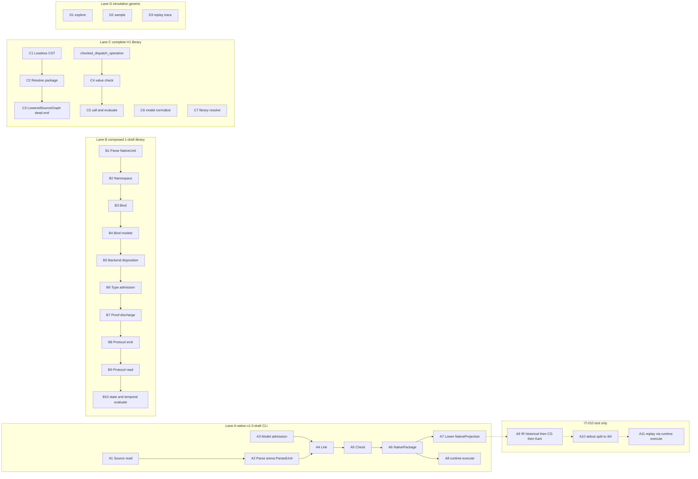
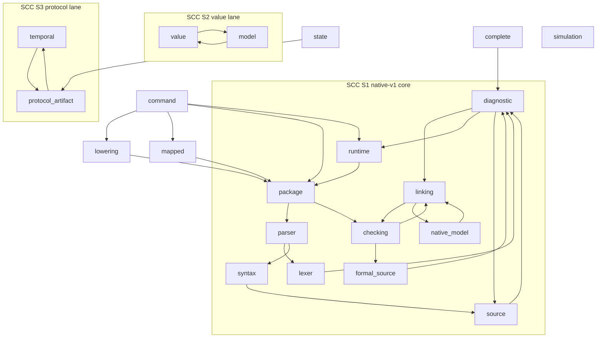
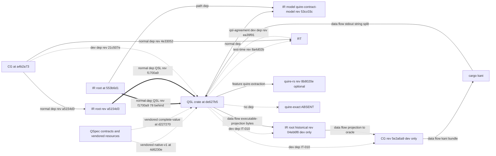

# ADR-010: Observed QSL and backend architecture baseline (ARCH-00)

## Status

Proposed, 2026-09-19. Owning ticket: agent-ix/quire-spec-language#206 (ARCH-00),
epic #205, Layer 0. Acceptance is decided at the baseline authority gate #208.
Supersedes nothing.

## Context

Epic #205 requires an evidence-backed record of the architecture as implemented
before its Layer 1 design tickets decide the target architecture. #205 lists
four Layer 1 design tickets: #209 (stage DAG and dependency direction), #210
(semantic-family extension and dispatch), #211 (canonical type, package and
conversion ownership) and #229 (QSL Capability specification alignment with
FR-290). #206 requires every stage, handoff, owner and dependency claim to carry
an evidence path at a named revision, and requires disagreements between
intended and observed architecture to be recorded as findings.

This record describes what exists at the revisions below. Where it names an
intended design (AD-016, the #209 program flow, the #205 ownership boundaries),
it names it only as the reference the observation is compared with. Nothing in
this record states that an intended element exists unless the cited code
contains it.

### Revisions inspected

All revisions are `origin/main` on 2026-09-19.

| Repo | Short name | sha |
|---|---|---|
| agent-ix/quire-spec-language | QSL | de627b58a42c5d9f84700609bdced407360c026d |
| agent-ix/quire-contract-ir | IR | 553b6d1527bf3158b0147b21a5061f2b71db2f66 |
| agent-ix/quire-contract-runtime | RT | d97bc0b0186450ad3b7ca885ffe94248d3dca633 |
| agent-ix/quire-contract-codegen | CG | a4b2a733fd341fc108cdb2ea926fdde6225ea4c1 |
| agent-ix/quire-specification | QSpec | 3a79dcedaffb423cfee6b74e4d6b5456ed2f90c7 |
| agent-ix/filament-core-data | FCD | 7dcb2f2c7466a770b2362561e70ed10a8f941c1f |
| agent-ix/quire-integration | QI | 40cff46e81026ffd9236f406f1b5677042ce83c0 |

Pull requests cited, at the heads the evidence was read at on 2026-09-19: QSL #200 `13b6687`,
QSL #204 `6eee1f3`, QSL #228 `a43e951`, IR #139 `64982f1`, IR #138 `100208c`,
FCD #200 `049d8c2`, QSpec #59 `0ced0f4`, QSpec #76 `bad22a9`, QI #2 `5a03aa4`. QSL #204 advanced to `2b02528` and IR #139 to
`417ec86` before 17:02Z; the cited claims hold at both heads. QSL #204 merged at
2026-09-19T17:04:35Z as `ba9e33b`, after the Context revision de627b5; the
PR-sensitive items (§8) name what it changes.

Issue bodies are cited as retrieved at 2026-09-19T17:02Z. Each cited body's
`updatedAt` is at or before that time; §9.1 lists the ones L1-D1 depends on.

### Evidence convention

Every positive evidence cell is `<prefix>:<path>:<line>` at the revision above.

| Prefix | Expands to |
|---|---|
| `QSL:` | `quire-spec-language@de627b5:src/` (paths starting `tests/`, `examples/`, `resources/`, `.github/` or `Cargo.*` are repo-root relative) |
| `QSpec:` | `quire-specification@3a79dce:` |
| `IR:` | `quire-contract-ir@553b6d1:` |
| `RT:` | `quire-contract-runtime@d97bc0b:` |
| `CG:` | `quire-contract-codegen@a4b2a73:` |
| `FCD:` | `filament-core-data@7dcb2f2:` |
| `QI:` | `quire-integration@40cff46:` |
| `<prefix>@<sha>:` | the same repository at another named revision, for example `IR@a5154d3:Cargo.toml:24` |
| `PR #n@<sha>:` | the named pull request at the named head, repo-root relative |

Absence cells use the negative-evidence form `absent: <pattern> in <path>`,
meaning `git grep -n -F '<pattern>' <sha> -- <path>` at the revision above
returns nothing. A `~` before a line number marks an approximate line inside the
named function. `absent-i:` is the same check with `git grep -n -i -F`
(case-insensitive). `excluding <path>` adds the pathspec `:!<path>`. Section references (`§`) point inside this record. "Behind"
counts are `git rev-list --count <pin>..<Context sha>` against the Context
table, not against a later `origin/main`.

Other records cite an item of this record as `ADR-010 OBS-nnn`, `ADR-010 DA-nn`
or `ADR-010 L1-D1`.

### Summary counts

| Measure | Count | What it counts |
|---|---|---|
| Present QSL stages | 28 | Stages with an entry function and output type in `src/`: lane A native-v1 8, lane B composed 10, lane C complete-V1 7, lane D simulation 3 (§2) |
| Absent stages | 7 | Stages AD-016 or the #209 program flow names that have no implementation on QSL main (§2.6) |
| End-to-end CLI lanes | 1 | native-v1: parse → link → check → package → lower or run |
| Proof-and-replay paths | 1, test-only; on every full `cargo test` gate, which installs no cargo-kani | IT-010 `tests/configversion_backends.rs` (§2.1 A9–A11) |
| Top-level QSL modules | 31 | `pub mod` and `mod` items in `QSL:lib.rs:13-44`, placed in §3.1 |
| Module SCCs with more than one module | 3 | Largest has 11 modules; 7 two-cycles in total (§3.1) |
| Repository cycles | 3 | IR ⇄ QSL (normal both ways), QSL ⇄ CG (dev both ways), QSL ⇄ RT (test-time both ways), under the edge rule in §3.2 |
| Duplicate or ambiguous authorities | 18 | 14 DUPLICATE, 4 AMBIGUOUS (§5, items DA-01…DA-18) |
| Findings | 41 | OBS-001…OBS-041. Primary owner #209: 19, #210: 6, #211: 16 (§9.2) |
| Reference claims checked | 50 | AD-016 on QSL 14 (§1.1), #205 ownership boundaries 7 (§1.2), AD-016 downstream 29 (§6.1) |
| Open QSL issues mapped | 68 | Every open issue in agent-ix/quire-spec-language (§7.1–§7.4) |
| Downstream issues mapped | 34 | Every downstream issue or PR cited by a mapped QSL issue body, the ARCH-01 comment, §8 or §9 (§7.5) |

## Decision

1. This record is the Layer 0 current-state baseline for epic #205. Layer 1
   tickets #209, #210, #211 and #229 use it as their evidence input and do not
   need a second repository census.
2. This record adopts no target design. It authorizes no refactor, crate split,
   new abstraction, feature or compatibility promise.
3. Each Layer 1 decision item in §9 has exactly one owning ticket, one of #209,
   #210 or #211. That ticket decides the item. An item that touches another
   ticket names it as a secondary input only. #229 is a secondary input on the
   items in its scope (FR-290 vocabulary alignment: OBS-012, OBS-013, DA-11);
   the owning ticket decides the architecture boundary, and #229 decides the
   normative vocabulary it consumes.
4. Work-in-progress dispositions and the merge order for the single-writer
   files follow the ARCH-01 classification posted on #207
   (issuecomment-5743530928, 2026-09-19T16:35:16Z) (§8), not any disposition
   implied by the evidence census.
5. Other records cite items of this record as `ADR-010 OBS-nnn`,
   `ADR-010 DA-nn` or `ADR-010 L1-D1`.

## 1. Reference designs checked against the code

### 1.1 AD-016

AD-016 source: `QSpec:spec/assurance/AD-016-semantic-family-extension-path.md`
(accepted). It is the reference design; the right-hand columns are the observation.

| AD-016 claim | Observed on QSL main | Verdict | Evidence |
|---|---|---|---|
| QSL check → checked-package/v2 | No v2 emitter. QSL has a reader of the v2 identity preimage only. The v2 schema is a QSpec proposal. | DISAGREES | `QSL:value/package_identity.rs:13,15,334` · `QSpec:proposals/checked-package-v2/schema.json` · absent: `CheckedPackageV2` in `src/` |
| Shared kernel crate `quire-exact` (Owner decision 2) | No `crates/quire-exact` and no Cargo dependency on it. | ABSENT | absent: `quire-exact` in `Cargo.toml` |
| `model::intake` | Not on main. PR #200 adds it (2104 lines). | ABSENT on main | absent: `mod intake` in `src/model` · `PR #200@13b6687:src/model/intake.rs` |
| ValueTypeRef / NativeValueType for native refs | PR #200 uses `DeclarationKey{package:"quire/native", node:"ix://quire/native/<Name>"}`. | DISAGREES (PR) | `PR #200@13b6687:src/model/intake.rs:710-722` |
| QSL is sole minter of spans; SourceMap keyed by checked node id | `SourceMap` maps body bytes to document bytes and is not keyed by node id. Value-lane `Location` carries no byte spans. | DISAGREES | `QSL:source_map.rs:30` · `QSL:value/expression/refusal.rs:32` |
| QSL admission "negotiates nothing"; CG `negotiate_*` is the single negotiation point | QSL has `Backend{identity, capabilities, families}` and returns `UnsupportedCapability` / `UnsupportedFamily`. QSL has `negotiate_integer_division` and `negotiate_ieee`; RT has its own copies. CG has only `negotiate_kani_obligations`. | DISAGREES | `QSL:linking/composed/requests.rs:80,282` · `QSL:value/division.rs:223` · `QSL:value/ieee.rs:830,882` · `RT:src/exact/ieee.rs:819` · `RT:src/exact/division.rs:217` · `CG:src/kani_obligations.rs:454` |
| native-v1 `runtime::execute` is not a replay target | IT-010 replays through `runtime::execute`. | DISAGREES (test) | `QSL:tests/configversion_backends.rs:252,259,948-951` |
| Witness arrives as IR typed witness (`KaniOutcomeKind`, 10 kinds) | IT-010 decodes by splitting stdout on `let concrete_vals: Vec<Vec<u8>> = vec![`. | DISAGREES (test) | `QSL:tests/configversion_backends.rs:843-857` |
| Replay via `value::expression::CheckedPackage::call` | `call` exists, keyed by function name (`&str`). Only tests call it. | PRESENT, unwired | `QSL:value/expression/mod.rs:635` |
| QSL → contract-model normal dependency | `quire-contract-ir = {package="quire-contract-model", rev 53cc03c}` | AGREES | `QSL:Cargo.toml:36` |
| QSL dev-dependency on CG rev 5e2a6a9 | Present | AGREES | `QSL:Cargo.toml:43` |
| QSL dev-dependency on IR historical rev 04eb6f8 | Present as `quire-contract-ir-historical` | AGREES | `QSL:Cargo.toml:44` |
| `Capability` in QSL | 4 variants: FamilyCheck, StateOperation, FiniteReplay, TemporalProjection | AGREES (count) | `QSL:linking/composed/requests.rs:36` |
| Kani launcher sha | `KANI_SHA256 7f143a25…` matches the AD-016 launcher sha | AGREES | `QSL:tests/configversion_backends.rs:34` |

Tally: 5 agree, 1 present but unwired, 8 disagree or absent.

### 1.2 #205 ownership boundaries

Source: the "Ownership boundaries" list in the #205 body. Each statement is
compared with the code.

| #205 statement | Observed | Verdict | Evidence |
|---|---|---|---|
| QSL owns the compiler pipeline, checked semantic model, package production, reference semantics and CLI orchestration | QSL owns parse, link, check, package and the CLI (§2.1). It has no checked-package/v2 producer (OBS-001). Definedness checking is delegated to IR (OBS-010). QSL also hosts native execution (`runtime::execute`) and value-lane evaluation (`CheckedPackage::call`). | PARTIAL | `QSL:command/compilation.rs:94-103` · `QSL:checking/proof.rs:660` · `QSL:runtime/execution.rs:97` · `QSL:value/expression/mod.rs:635` |
| QSpec owns normative cross-repository contracts and shared vocabulary | QSpec holds AD-016 and FR-290. IR FR-031 states a replay executor that AD-016 contradicts (OBS-036). QSL vendors QSpec trees that trail QSpec main (OBS-024). | PARTIAL | `QSpec:spec/assurance/AD-016-semantic-family-extension-path.md:238` · `IR:spec/contract/FR-031-bounded-kani-dispatch-replay-provenance.md:15` · `QSL:resources/native-v1/VENDOR.json:20` |
| Contract IR owns proof-oriented lowering and its versioned IR/package representation | IR owns the checked-package/v2 reader and Kani lowering. IR also performs native replay by calling QSL `runtime::execute` (OBS-028). | PARTIAL | `IR:crates/quire-contract-model/src/checked_package/dispatch.rs:28` · `IR:src/kani/arithmetic.rs:40` · `IR:src/kani/replay.rs:80-88` |
| Runtime owns executable semantic behavior and native replay surfaces | Native execution is in QSL `runtime`; value evaluation is in QSL `value` and duplicated in RT `exact` (DA-16). RT has no replay surface. Replay runs in IR and in QSL test IT-010. | DISAGREES | `QSL:runtime/execution.rs:97` · `RT:src/exact/expression.rs:742` · absent-i: `replay` in `src` (RT) · `QSL:tests/configversion_backends.rs:259` |
| Codegen owns backend emission and generated proof harnesses | CG emits oracles and the Kani bundle. CG `assurance/pins.json` states CG `src/` has no Kani code (OBS-034). FR-290 names a QSL Kani backend (OBS-013). | PARTIAL | `CG:src/kani.rs:357` · `CG:assurance/pins.json:26` · `QSpec:spec/objects/protocol/FR-290-protocol-claim-kind.md:33-34,49-51` |
| Each semantic concept has one canonical owner and one representation per stage | 14 DUPLICATE and 4 AMBIGUOUS concepts (§5). | DISAGREES | §5 |
| Boundary conversions are explicit, total over admitted input, and versioned when serialized | Lowering is explicit and versioned. `object_keys` is a caller-supplied bridge, `EffectiveId` bytes are reused as `NodeKey`, and IT-010 decodes the witness by a partial string split (§4.2). | PARTIAL | `QSL:lowering/wire.rs:51` · `QSL:model/checked_dispatch.rs:657` · `QSL:value/model_query.rs:108` · `QSL:tests/configversion_backends.rs:843-857` |

Tally: 0 agree, 5 partial, 2 disagree. The disagreements on replay ownership
are OBS-038 and OBS-039.

## 2. Stage graph

Columns: entry function → output type, plus refusal type. The input is the
previous row's output unless stated.

### 2.1 Lane A: native-v1 (edition 0-draft). CLI-reachable and the only end-to-end lane.

Orchestrator: `command::compilation::package` (`QSL:command/compilation.rs:94`)
runs link (:101) → check (:102) → package (:103) on a parsed unit.

| # | Stage | Entry | Input | Output | Refusal |
|---|---|---|---|---|---|
| A1 | Source read | `Source::read` `QSL:source.rs:94` (`read_verified` :189) | bytes, path | `Source` | `Box<Diagnostic>` `QSL:diagnostic.rs:306` |
| A2 | Parse | `parser::parse` `QSL:parser.rs:13`, `parse_source` :25 | `Source`, `Limits` | `ParsedUnit` `QSL:syntax.rs:324` (flat arena, `ExprId` `QSL:syntax.rs:57`). No CST. | `Box<Diagnostic>` |
| A3 | Model admission | `model_source::read` `QSL:model_source.rs:248`, `.admit` :225 | model JSON (native-state-model/1,2 · native-rule-model/1,2) | `NativeModel` | `Box<Diagnostic>` |
| A4 | Link | `linking::link` `QSL:linking.rs:295`, `link_native` :319 | `ParsedUnit`, models | `LinkedPackage` `QSL:linking.rs:190` (formal environment native-formal-environment/1, :202) | `Box<Diagnostic>` |
| A5 | Check | `checking::check` `QSL:checking.rs:302` | `LinkedPackage`, bindings | `CheckedPackage<'a>` `QSL:checking.rs:263` | `Box<Diagnostic>`. Definedness is delegated to IR `DeclarationEnvironment::check_expression` (`QSL:checking/proof.rs:660`). |
| A6 | Package | `NativePackage::new` `QSL:package.rs:252` | `CheckedPackage` | `NativePackage` `QSL:package.rs:224`, identity `NativePackageIdentity` :202, format native-checked-clauses/1 (`QSL:package/view.rs:45`) | `PackageError` `QSL:package.rs:141` |
| A7 | Lower | `lowering::lower_for` `QSL:lowering.rs:283` (`lower` :274) | `NativePackage`, target | `NativeProjection` `QSL:lowering.rs:228`; wire `ir::EXECUTABLE_PROJECTION_FORMAT` from IR model 53cc03c (`QSL:lowering/wire.rs:51`); targets boolean-oracle/v1, integer-ir/v1, state-scalar-ir/v1 (`QSL:lowering/target.rs:39-46`) | `LoweringError` `QSL:lowering.rs:140` |
| A8 | Execute (native) | `runtime::execute` `QSL:runtime/execution.rs:97` (validate `QSL:runtime/validation.rs:181`, evaluate `QSL:runtime/evaluation.rs:40`) | `NativePackage`, native-state-input/1 | `ExecutionReport` `QSL:runtime/execution.rs:43` / `ExecutionOutcome` :23 {ValidationFailed, Evaluated} | `ExecutionOutcome::ValidationFailed`, `Box<Diagnostic>` |
| A9 | Proof (IR → CG → Kani) | No library or CLI entry. Test-only in IT-010: `backend_ir::BoundPackage::from_json_bytes` (IR 04eb6f8) `QSL:tests/configversion_backends.rs:543,597,871` → `codegen::generate_kani_bundle` (CG 5e2a6a9) :789 → generated crate depending on RT 8a4d02b (:820-821) → cargo kani :831, :837 | `NativeProjection` bytes | Kani stdout | test panic: each step calls `unwrap` or `expect` (:543, :597, :840, :871) |
| A10 | Witness decode | No typed decode. Test-only `playback_i64` `QSL:tests/configversion_backends.rs:843-857` | stdout string | `i64` from the first `vec![…]` row only, which must hold exactly 8 bytes | `Option::None` |
| A11 | Replay | No library entry. Test-only `native_verdict` `QSL:tests/configversion_backends.rs:252` → `runtime::execute` :259; verdict asserted at :948-951 | `i64` | `Option<bool>` verdict | `None` for input outside `DOMAIN` (:262) |

IT-010 preconditions and failure modes. The test is not `#[ignore]`d. It
requires `cargo-kani 0.67.0` on `PATH` with sha256 `KANI_SHA256`
(`QSL:tests/configversion_backends.rs:34,509-526`). It runs Kani with
`CARGO_NET_OFFLINE=true` (:837), so RT 8a4d02b must already be in the cargo
cache. The only check that IR model 53cc03c (producer) and IR 04eb6f8 (consumer)
agree is the digest equality at :543-544, present at one of the three consumer
sites (:543, :597, :871). The IR 04eb6f8 ↔ CG 5e2a6a9 pairing is checked at
:504-507 (IT-010-SC-01). RT 8a4d02b has no pairing check: `RUNTIME_REVISION` is
checked only for length 40 (:508). IT-010 has no `required-features` gate
(`QSL:Cargo.toml:58-95` lists none for it), so the one CI job
(`workflow_dispatch` only) and `make ci` both run it through `cargo test
--workspace` (`QSL:.github/workflows/ci.yml:3-4,22,26`, `QSL:Makefile:34,38`).
Neither installs cargo-kani, so on those gates IT-010 panics at :513.

CLI commands: `parse`, `format`, `run`, `compile`, `lower [--target]`
(`QSL:cli.rs:59-126`). Entry points: `command::run` `QSL:command.rs:309`,
`compile` :315, `lower` :321, `lower_for` :326. Exit codes 20/21/22/30
(`RunCause` / `RunError`, `QSL:main.rs:24-25,113-115,138` ·
`QSL:command.rs:227-232`). `NativePackage::read_verified` recompiles from source
and does not trust a stored package (`QSL:package.rs:233-246`).

Side lane A′ (feature `quire-extraction`): `mapped::compile` `QSL:mapped.rs:138`
→ `MappedPackage` :110; `quire_source::compile` `QSL:quire_source.rs:312`.
Reached through `RunSelection::Extracted` (`QSL:command/compilation.rs:26,36`).

### 2.2 Lane B: composed (edition 1-draft). Library, examples and tests only; no CLI.

| # | Stage | Entry | Output | Refusal |
|---|---|---|---|---|
| B1 | Parse | `parse_native` `QSL:parser.rs:43`, `parse_native_source` :55 | `NativeUnit` `QSL:syntax/composed.rs:10` (EDITION "1-draft" :18) | `Box<Diagnostic>` |
| B2 | Namespace admission | `linking::composed::admit_namespace` `QSL:linking/composed.rs:375` | `NamespaceReport` :303 | in report |
| B3 | Bind | `bind` `QSL:linking/composed/binding.rs:180` | `Report` :79 | `Refusal` :16 |
| B4 | Bind models | `bind_models` `QSL:linking/composed/models.rs:278` | bound models | `ImportRefusal` :70 |
| B5 | Request/backend disposition | `requests::report` `QSL:linking/composed/requests.rs:282` | `Disposition` (includes UnsupportedCapability, UnsupportedFamily) | in `Disposition` |
| B6 | Type admission | `checking::composed::admit_types` `QSL:checking/composed.rs:311` | `TypeReport` :266 | in report |
| B7 | Proof discharge | `proofs::discharge` `QSL:checking/composed/proofs.rs:217` | `ProofReport` :157 | in report |
| B8 | Protocol artifact emit | `protocol_artifact::native::admit` `QSL:protocol_artifact/native/mod.rs:82` → `emit` :104; `admit_v2` `QSL:protocol_artifact/native/temporal_v2.rs:170`; `admit_v3` `QSL:protocol_artifact/native/temporal_v3.rs:49` | `EmittedPackage` (quire.compiled-protocol/1,2,3) | `Report<FamilyAdmission>` |
| B9 | Protocol artifact read | `protocol_artifact::read` `QSL:protocol_artifact/intake.rs:520`; `v2::read` `QSL:protocol_artifact/v2/intake.rs:476`; `v3::read` `QSL:protocol_artifact/v3/intake.rs:211` | `AdmittedPackage` `QSL:protocol_artifact/mod.rs:387` | v2 `QSL:protocol_artifact/v2/refusal.rs:141`, v3 `QSL:protocol_artifact/v3/refusal.rs:38` |
| B10 | Evaluate | `state::evaluate` `QSL:state/evaluation.rs:35` / `evaluate_v2` :45 → `EvaluationReport` `QSL:state/input.rs:316`; `temporal::evaluate` `QSL:temporal.rs:58` / `evaluate_v2` :145 | reports | state `Refusal` `QSL:state/input.rs:277`; temporal `Refusal` `QSL:temporal/result.rs:213` |

Lane B has no IR lowering, proof, witness or replay stage (§2.6).

Checked handoffs inside lane B. Their input is the wire-admitted
`v2::AdmittedPackage` from B9, not a source-compiled package (OBS-037).

| Handoff | Derive / produce | Read / evaluate | Format |
|---|---|---|---|
| checked predicate | `QSL:protocol_artifact/checked_predicate.rs:139` | `QSL:protocol_artifact/checked_predicate.rs:156` | quire.checked-predicate/v1 (`QSL:protocol_artifact/checked_handoff.rs:1585`) |
| temporal subject | `QSL:protocol_artifact/temporal_subject.rs:177` | `QSL:protocol_artifact/temporal_subject.rs:193` | quire.checked-temporal-subject/v1 (`QSL:protocol_artifact/checked_handoff.rs:1586`) |
| native temporal v1 | `QSL:protocol_artifact/native_temporal/request.rs:1317` | `QSL:protocol_artifact/native_temporal/result.rs:754` | request/result /v1 (`QSL:protocol_artifact/native_temporal/common.rs:13-14`) |
| native temporal v2 | `QSL:protocol_artifact/native_temporal/v2.rs:397` | :535 | /v2 (`QSL:protocol_artifact/native_temporal/v2.rs:22-24`) |

B8 has no caller in `src/` outside `protocol_artifact::native`. Its callers are
the example (`QSL:examples/protocol-handoff/producer.rs:1411,1415,1566`) and
test files under `QSL:tests/`, for example `QSL:tests/native_protocol_emission.rs:134`
and `QSL:tests/compiled_protocol_v2.rs:2454`.

### 2.3 Lane C: complete-V1. Library and tests only; the source path stops before checking.

| # | Stage | Entry | Output | Refusal |
|---|---|---|---|---|
| C1 | Lossless parse | `complete::parse` `QSL:complete/mod.rs:103` | `ParsedSource` with `LosslessCst` `QSL:complete/cst.rs:189` | `Box<CompleteDiagnostic>` `QSL:complete/diagnostic.rs:183` |
| C2 | Resolve package | `resolve_source_package` `QSL:complete/package.rs:861` | `ResolvedSourcePackage` :587 | `PackageRefusal` :847 |
| C3 | Lower source graph | `lower_source_graph` `QSL:complete/package.rs:1340` | `LoweredSourceGraph` :625 ((production, span) pairs only) | none |
| C4 | Check values | `PackageDeclarations::check` `QSL:value/expression/mod.rs:234` | `CheckedPackage` `QSL:value/expression/mod.rs:71` | `Vec<CheckRefusal>` `QSL:value/expression/refusal.rs:363` |
| C5 | Call / evaluate | `CheckedPackage::call` `QSL:value/expression/mod.rs:635`, `evaluate` :659 | `Evaluation` `QSL:value/expression/evaluate.rs:51`; `Outcome<T>` {Completed, Undefined, Refused, Incomplete} `QSL:value/outcome.rs:18` | `InputRefusal` `QSL:value/expression/mod.rs:105`; `Refusal` `QSL:value/outcome.rs:103` |
| C6 | Normalize model | `model::normalize` `QSL:model/normalize.rs:2102` | `NormalizeOutcome` :230 | `ModelRefusal` :218 |
| C7 | Library resolve | `resolve_libraries` `QSL:value/library.rs:374` | `LibraryLock` | `LibraryRefusal` :181 |

C1–C3 form the source path; C4–C5 the value path; C6 and C7 are independent
entries. The only non-test constructor of `value::expression::Expression` is
`model::checked_dispatch_operation` `QSL:model/checked_dispatch.rs:653`
(refusal `DispatchBridgeRefusal` :154). Nothing outside `src/complete` consumes
`LoweredSourceGraph`.

### 2.4 Lane D: simulation. Generic, with no implementer in QSL.

| # | Stage | Entry | Output | Refusal |
|---|---|---|---|---|
| D1 | Explore | `explore` `QSL:simulation/explore.rs:97` | `Outcome` :59 (for example `Exhaustive(Stats)`) | in `Outcome` |
| D2 | Sample | `sample` `QSL:simulation/sample.rs:95` | `Trace<TransitionId>` `QSL:simulation/trace.rs:41` | `EmptyInitial` `QSL:simulation/sample.rs:83` |
| D3 | Replay trace | `replay` `QSL:simulation/trace.rs:97` | `()` | `ReplayError` `QSL:simulation/trace.rs:53` |

`TransitionSystem` has no implementer in QSL (fan-in 0).

### 2.5 Program-flow order compared with lane A

The #209 "Required design" states the program flow `source → CST → parsed
semantic forms → checked semantic graph → linked/package form → backend IR →
execution/proof → typed witness → replay`.

| Program-flow element | Observed in lane A |
|---|---|
| CST | Lane A has no CST (arena `ParsedUnit`). A CST exists only in lane C and stops at C3. |
| check before link | Link (A4) runs before check (A5): `QSL:command/compilation.rs:101-102` |
| typed witness | None. A10 is a test-only string parse. |
| replay | Test-only, through native-v1 |

### 2.6 Absent stages

| # | Absent stage | Reference that names it | Evidence of absence |
|---|---|---|---|
| X1 | `quire-exact` shared kernel | AD-016 Owner decision 2 | absent: `quire-exact` in `Cargo.toml` |
| X2 | `model::intake` | AD-016 | absent: `mod intake` in `src/model`; `DomainPackage::new` is caller-constructed (`QSL:model/domain_package.rs:441`) |
| X3 | checked-package/v2 emitter | AD-016 | absent: `CheckedPackageV2` in `src/`; only the preimage reader `project_declarations` `QSL:value/package_identity.rs:334` |
| X4 | source → `value::expression::Expression` producer | #209 program flow (CST → checked semantic graph) | absent: `LoweredSourceGraph` in `src` excluding `src/complete` (producer `QSL:complete/package.rs:625`) |
| X5 | composed → IR lowering | #209 program flow (package form → backend IR) | absent: `crate::lowering` and `EXECUTABLE_PROJECTION` in `src/linking/composed`, `src/checking/composed`, `src/protocol_artifact`, `src/state`, `src/temporal` |
| X6 | typed witness decode and non-native replay | AD-016; #209 program flow (typed witness → replay) | absent: `kani` in `src/`; only `QSL:tests/configversion_backends.rs:252,843-857` |
| X7 | native-run-result/2 | AD-014 / FR-352 | absent: `native-run-result/2` in `src/`; /1 at `QSL:wire_format.rs:31` |

## 3. Dependency views

### 3.1 In-crate module graph

Method: `use crate::…` items from `origin/main` sources, including grouped
imports and root re-exports, excluding `#[cfg(test)]` modules and `*tests.rs`.
Fan-in and fan-out count distinct top-level modules at the other end of those
edges.

Top-level modules (`QSL:lib.rs:13-44`; `quire_source` is behind feature
`quire-extraction`). Lines count every `.rs` line in the module's file and
directory, including in-file tests. Public items count lines matching
`^\s*pub (async )?(fn|struct|enum|trait|type|const|static|mod|use) `.

| Module | Lane or stage | Lines | Public items |
|---|---|---|---|
| source | shared: A1 | 300 | 16 |
| lexer | A2 | 141 | 0 |
| token | A2, B1 | 352 | 0 |
| parser | A2, B1 | 1739 | 4 |
| syntax | A2, B1 | 873 | 74 |
| format | CLI `format` | 170 | 2 |
| model_source | A3 | 995 | 15 |
| native_model | A3 | 1231 | 21 |
| linking | A4, B2–B5 | 8147 | 243 |
| formal_source | A4, A5, B6, B7 | 107 | 7 |
| checking | A5, B6, B7 | 8650 | 128 |
| package | A6 | 3286 | 29 |
| lowering | A7 | 1662 | 42 |
| runtime | A8 | 5356 | 125 |
| command | CLI orchestration | 2122 | 35 |
| mapped | A′ | 201 | 13 |
| quire_source | A′ | 488 | 20 |
| protocol_artifact | B8, B9, checked handoffs | 22959 | 508 |
| state | B10 | 3753 | 51 |
| temporal | B10 | 2778 | 88 |
| complete | C1–C3 | 6956 | 142 |
| value | C4, C5, C7 | 19397 | 596 |
| model | C6 | 9091 | 176 |
| simulation | D1–D3 | 571 | 25 |
| diagnostic | shared: all refusals | 383 | 13 |
| digest | shared: identities | 67 | 3 |
| source_map | shared: body ↔ document bytes | 264 | 11 |
| wire_format | shared: wire names | 52 | 3 |
| located_json | shared: JSON input | 86 | 4 |
| json_number | shared: JSON input | 105 | 0 |
| serde_object | shared: JSON input | 53 | 0 |

Strongly connected components with more than one module:

| SCC | Modules | Edges (evidence) |
|---|---|---|
| S1 (11) | package, lexer, parser, linking, syntax, runtime, diagnostic, source, formal_source, native_model, checking | closing: diagnostic→linking `QSL:diagnostic.rs:320`; diagnostic→runtime `QSL:diagnostic.rs:324`; source↔diagnostic `QSL:source.rs:3`, `QSL:diagnostic.rs:3`; linking→checking `QSL:linking/composed/models.rs:11`; native_model→linking `QSL:native_model/admission.rs:12`; linking→native_model `QSL:linking.rs:15`; checking→linking `QSL:checking/proof.rs:20`. Entering each other member: package→parser `QSL:package/reading.rs:10`; parser→lexer `QSL:parser.rs:3`; parser→syntax `QSL:parser.rs:4`; syntax→source `QSL:syntax.rs:3`; lexer→diagnostic `QSL:lexer.rs:3`; checking→formal_source `QSL:checking.rs:14`; formal_source→diagnostic `QSL:formal_source.rs:7`; package→checking `QSL:package.rs:20`; runtime→package `QSL:runtime/execution.rs:4` |
| S2 (2) | value, model | value→model: 8 `use crate::model` items in 6 files, e.g. `QSL:value/composite.rs:31`; model→value: 6 non-test `use crate::value` items (a seventh, `QSL:model/checked_dispatch.rs:860`, is in `#[cfg(test)]`), e.g. `QSL:model/domain_package.rs:14` |
| S3 (2) | temporal, protocol_artifact | temporal→protocol_artifact `QSL:temporal.rs:29`; protocol_artifact→temporal `QSL:protocol_artifact/native_temporal/common.rs:11` |

Two-cycles (7 in total): checking↔linking, diagnostic↔linking,
diagnostic↔runtime, diagnostic↔source, linking↔native_model (all inside S1),
model↔value (S2) and protocol_artifact↔temporal (S3).

S1 closes because `Diagnostic` embeds `Vec<linking::DeclarationLocation>`,
`Option<Box<runtime::RuntimeLocation>>` and
`Option<Box<quire_contract_ir::Diagnostic>>` (`QSL:diagnostic.rs:306-324`): the
module with the highest fan-in depends on higher-level modules.

| Fan-out (top) | n | Fan-in (top) | n |
|---|---|---|---|
| command | 16 | diagnostic | 20 |
| package | 11 | source | 18 |
| mapped | 10 | syntax | 12 |
| protocol_artifact | 10 | native_model | 10 |
| runtime | 10 | digest | 10 |
| lowering | 9 | formal_source / linking / checking | 9 each |

Largest files: `QSL:state/evaluation.rs` 3110 · `QSL:value/expression/check.rs`
2209 · `QSL:model/normalize.rs` 2189 · `QSL:value/ieee.rs` 1821 ·
`QSL:protocol_artifact/checked_handoff.rs` 1795.

Islands with no in-crate production consumer: complete, value+model, state,
simulation, the composed pipeline (lane B) and protocol_artifact emission.

### 3.2 Cross-repository dependencies

Edge rule: a repository edge is a Cargo dependency of any kind (normal, dev,
optional) or a Cargo manifest that the repository's tests write or build. Edges
and cycles are counted between the seven Context-table repositories only.
Dependencies on other repositories (quire-rs, and IR root → quire-protocol) are
listed where QSL has them but are not followed, so cycles through them, such as
IR ⇄ quire-protocol, are out of scope. A repository cycle is a pair of
repositories with an edge in each direction.

| From | To | Kind | Rev | Evidence |
|---|---|---|---|---|
| QSL | IR model (package quire-contract-model, alias `quire_contract_ir`) | normal | 53cc03c (26 behind IR) | `QSL:Cargo.toml:36` |
| QSL | quire-rs | optional (feature quire-extraction) | 8b8020e | `QSL:Cargo.toml:26` (feature `:17`) |
| QSL | CG | dev | 5e2a6a9 | `QSL:Cargo.toml:43` |
| QSL | IR root historical (`quire-contract-ir-historical`) | dev | 04eb6f8 | `QSL:Cargo.toml:44` |
| QSL tests | RT | test-time: fixture crate built by a test, and the IT-010 generated crates | 8a4d02b (CG 5e2a6a9 `RUNTIME_REVISION`) | `QSL:tests/fixtures/native-lowering/Cargo.toml:14` · `QSL:tests/native_backend.rs:281` · `QSL:tests/configversion_backends.rs:820-821` · `CG@5e2a6a9:src/oracle.rs:17` |
| QSL | RT | no Cargo dependency | none | absent: `quire-contract-runtime` in `Cargo.toml` |
| QSL | FCD | none on main (PR #200 adds rev 7dcb2f2) | none | absent: `filament` in `Cargo.toml` · `PR #200@13b6687:Cargo.toml:37-38` |
| QSL | quire-exact | none (crate absent) | none | absent: `quire-exact` in `Cargo.toml` |
| QSL package view | IR and QSpec | hard-coded literals `ir_revision "690bde7f…"` and `STANDARD "e897f810…"` | 690bde7, not the Cargo pin 53cc03c | `QSL:package/view.rs:39,46` |
| IR root | IR model | normal, workspace path | path | `IR:Cargo.toml:21` |
| IR root | IR model (`quire-contract-model-owner`) | dev self-pin | 53cc03c | `IR:Cargo.toml:37` |
| IR root | QSL | normal and dev | f1700a9 (78 behind) | `IR:Cargo.toml:24,38` |
| IR tests | QSL | test-time fixture manifest | f1700a9 | `IR:tests/fixtures/bridge-qsl-consumer/Cargo.toml:13` |
| CG | IR root (package quire-contract-ir) | normal | a5154d3 | `CG:Cargo.toml:17` |
| CG → IR root a5154d3 | QSL | transitive normal | f1700a9 | `IR@a5154d3:Cargo.toml:24` |
| CG | RT | normal | 4e33052 | `CG:Cargo.toml:18,27` |
| CG | QSL | dev | 21c507e | `CG:Cargo.toml:28` |
| RT qsl-agreement | QSL | dev | ea39f91 | `RT:conformance/qsl-agreement/Cargo.toml:18` |

Repository cycles under the edge rule:

| Cycle | Edges | Kinds |
|---|---|---|
| IR ⇄ QSL | IR root → QSL f1700a9 (`IR:Cargo.toml:24`); QSL → IR model 53cc03c (`QSL:Cargo.toml:36`) | normal both ways. The model crate has no QSL dependency, so there is no crate-level cycle. |
| QSL ⇄ CG | QSL → CG 5e2a6a9 (`QSL:Cargo.toml:43`); CG → QSL 21c507e (`CG:Cargo.toml:28`); CG → IR root a5154d3 → QSL f1700a9 (`CG:Cargo.toml:17`, `IR@a5154d3:Cargo.toml:24`) | dev both ways, plus a transitive normal edge CG → QSL |
| QSL ⇄ RT | QSL tests → RT 8a4d02b (`QSL:tests/fixtures/native-lowering/Cargo.toml:14`); RT qsl-agreement → QSL ea39f91 (`RT:conformance/qsl-agreement/Cargo.toml:18`) | test-time both ways |

Proof-path revision chain (IT-010). The projection format comes from IR model
53cc03c (`QSL:lowering/wire.rs:51`, `QSL:Cargo.toml:36`). The consumer is IR
root 04eb6f8 (`QSL:Cargo.toml:44`), which is also the IR that CG 5e2a6a9 pins
(`CG@5e2a6a9:src/oracle.rs:14`; QSL `Cargo.lock` resolves CG's
`quire-contract-ir` to 04eb6f8). The generated crates use RT 8a4d02b
(`CG@5e2a6a9:src/oracle.rs:17`). No revision on this chain is a production pin
of QSL except 53cc03c. The cross-revision guards are the IR ↔ CG pairing at
`QSL:tests/configversion_backends.rs:504-507` and the producer/consumer digest
equality at :543-544; the RT 8a4d02b link is checked only for hash length at
:508 (OBS-040).

IR's typed handoffs from QSL are bound to QSL f1700a9. IR `predicate::project`,
`temporal::project` and `replay_with_native_runtime(&NativePackage)` take QSL
Rust types from the crate pinned at `IR:Cargo.toml:24`
(`IR:src/kani/replay.rs:3-6,80` · `IR:src/predicate/admission.rs:91-92`). A value
built by QSL main (de627b5) is a different type from a different crate, so QSL
main cannot pass it to IR main without serializing it.

IR types used inside QSL (approximate use counts: `git grep -w <Type>` over `src/`
files that import `quire_contract_ir`; a plain `git grep -w` outside
`value`, `model` and `complete` gives slightly higher counts, e.g. `ValueType` 219): `ValueType` 212 · `SymbolName` 103 ·
`StateObservation` 87 · `RequirementRef` 42 · `ExpressionKind` 39 · `Diagnostic`
31 · `ExecutionPoint` 29 · `SourceSpan` 22 · `DeclarationEnvironment` 20.
Modules using `ir::`: runtime (10 files), checking (8), command (5),
protocol_artifact (5).

Vendored QSpec resources:

| Tree | QSpec commit | Files | Behind QSpec 3a79dce | Drift from QSpec 3a79dce |
|---|---|---|---|---|
| `QSL:resources/native-v1/VENDOR.json` | 4d6230e (+ "self" bf9960e) | 69 | 144 commits | not measured |
| `QSL:resources/complete-value/VENDOR.json` | d227270 | 58 | 10 commits | 5 files differ: checked-package-v2 vectors and schema, complete-model-lock, complete-value-lock, native-diagnostics.md |

`native-diagnostics.md` is vendored twice at different sha256
(`QSL:resources/native-v1/VENDOR.json:20` d3a5d54… and
`QSL:resources/complete-value/VENDOR.json:64` e894159…). `edition.md` also
differs between the two trees.

Legend: arrows labelled "dep" point from the dependent to its dependency;
arrows labelled "data flow" point from producer to consumer.

### 3.3 Wire formats emitted or read by QSL

| Format | Direction | Evidence |
|---|---|---|
| native-run/1, native-compile/1, native-run-result/1 | emit | `QSL:wire_format.rs:27,29,31` |
| native-run-result/2 | absent (AD-014 / FR-352 name /2) | absent: `native-run-result/2` in `src/` |
| native-rule-model/1,2 | read | `QSL:wire_format.rs:33-35` |
| native-state-model/1,2 | read | `QSL:native_model.rs:27-28` |
| native-state-input/1 | read | `QSL:wire_format.rs:37` |
| native-linked-package/1 | emit | `QSL:wire_format.rs:39` |
| native-formal-environment/1 | internal | `QSL:linking.rs:202` |
| native-checked-clauses/1 | package view | `QSL:package/view.rs:45` |
| quire.contract.executable-projection/v1 | emit (lowering) | `QSL:lowering/wire.rs:51`; listed "unlowered" at `QSL:package/view.rs:395-410` |
| native-reference/1 | projection "available" | `QSL:package/view.rs:395-410` |
| quire.compiled-protocol/1,2,3 (+ schemas /1,2,3) | emit + read | `QSL:protocol_artifact/mod.rs:49`, `QSL:protocol_artifact/v2/mod.rs:19`, `QSL:protocol_artifact/v3/mod.rs:14` |
| quire.protocol.compact-json/1 | encoding | `QSL:protocol_artifact/mod.rs:57` |
| quire.checked-predicate/v1, quire.checked-temporal-subject/v1 | emit + read | `QSL:protocol_artifact/checked_handoff.rs:1585-1586` |
| native temporal request/result /v1, /v2 | emit + read | `QSL:protocol_artifact/native_temporal/common.rs:13-14`, `QSL:protocol_artifact/native_temporal/v2.rs:22-24` |
| quire.checked-package-id/v2, quire.checked-semantic-graph/v2 | read only (preimage) | `QSL:value/package_identity.rs:13,15` |
| quire.checked-semantic-node/v1 | digest domain | `QSL:value/node.rs:18` |
| quire.model.effective-declaration/v1 | digest domain | `QSL:model/key.rs:26` |
| quire.native.diagnostics/v1 | catalog; revisions "1-draft.3" and "1-draft.1" both claimed | `QSL:complete/diagnostic.rs:13` · `QSL:linking/composed/definition_source.rs:240` |
| quire.value.accounting/v1 | budget | `QSL:value/accounting.rs:2` |

## 4. Inventory

### 4.1 Boundary types

| Boundary | Type | Evidence |
|---|---|---|
| source → parse | `Source`, `Span`, `LocatedSpan` | `QSL:source.rs:94` |
| parse → link | `ParsedUnit` / `NativeUnit` | `QSL:syntax.rs:324`, `QSL:syntax/composed.rs:10` |
| link → check | `LinkedPackage` | `QSL:linking.rs:190` |
| check → package | `checking::CheckedPackage<'a>` | `QSL:checking.rs:263` |
| package → lower / run | `NativePackage` | `QSL:package.rs:224` |
| lower → IR | `NativeProjection` (bytes in `ir::EXECUTABLE_PROJECTION_FORMAT`) | `QSL:lowering.rs:228` |
| protocol emit → read | `EmittedPackage` / `AdmittedPackage` | `QSL:protocol_artifact/mod.rs:387` |
| protocol read → checked handoff → IR | `v2::AdmittedPackage` → `ValidatedCheckedPredicate` / temporal subject | `QSL:protocol_artifact/checked_predicate.rs:139` · `QSL:protocol_artifact/temporal_subject.rs:177` · `IR:src/predicate/admission.rs:92` |
| value check → call | `value::expression::CheckedPackage` | `QSL:value/expression/mod.rs:71` |
| complete CST → nothing | `LoweredSourceGraph` (no consumer) | `QSL:complete/package.rs:625` |

### 4.2 Conversions

| From → To | Function | Explicit / total? |
|---|---|---|
| `DeclarationKey` → `NodeKey` | caller-supplied `object_keys: &BTreeMap<DeclarationKey, NodeKey>` `QSL:model/checked_dispatch.rs:657` | caller-supplied bridge with no owner |
| `EffectiveId` → `NodeKey` | `NodeKey::from_bytes(*key.type_identity.as_bytes())` `QSL:value/model_query.rs:108`; `from_bytes` is `pub(crate)` `QSL:value/node.rs:49` | explicit byte transfer from domain quire.model.effective-declaration/v1 (`QSL:model/key.rs:26,157`) into domain quire.checked-semantic-node/v1 (`QSL:value/node.rs:18`); the only production caller |
| `NodeKey` → `EffectiveId` | `EffectiveId::from_digest_bytes(*reference.object_type().as_bytes())` `QSL:value/model_query.rs:123`; `EffectiveId::from_digest_bytes(*target.as_bytes())` `QSL:value/model_query.rs:155` | explicit byte transfer, reverse direction (two sites) |
| `NativePackage` → IR projection | `lower_for` `QSL:lowering.rs:283` | explicit, versioned |
| projection → IR bound package | `backend_ir::BoundPackage::from_json_bytes` `QSL:tests/configversion_backends.rs:543` | test-only |
| Kani stdout → i64 | `playback_i64` `QSL:tests/configversion_backends.rs:843-857` | string split, first row only, partial |
| model dispatch → `Expression` | `checked_dispatch_operation` `QSL:model/checked_dispatch.rs:653` | explicit; the only non-test producer |

### 4.3 Dispatch points, including string dispatch

| Site | Dispatch on | Evidence |
|---|---|---|
| Relationship category | string `"allocation"` (PR #200@13b6687 removes it; PR-sensitive) | `QSL:model/systems.rs:269` |
| Protocol admission | string `"quire.protocol.finite-global/v1"` | `QSL:protocol_artifact/validate.rs:287,291` |
| State canonical JSON | string `"filament-canonical-json-1"` | `QSL:state/evaluation.rs:2478-2484` |
| State authority adapter | string `"quire.state.authority-adapter"` | `QSL:state/evaluation.rs:2781-2783` |
| Temporal clock role | prefix `"clock:"` (`CLOCK_PREFIX`) | `QSL:temporal.rs:50` |
| Backend request | `Capability` (4) × `Family` (4) against `Backend{identity:&str}` | `QSL:linking/composed/requests.rs:20,36,80` |
| Value call | function name `&str` | `QSL:value/expression/mod.rs:635` |
| Lowering target | `--target` string → 3 targets | `QSL:lowering/target.rs:39-46` |
| Complete capability id | `CapabilityId(String)` | `QSL:complete/package.rs:690` |

### 4.4 Bypass paths

| Bypass | What it skips | Evidence |
|---|---|---|
| `protocol_artifact::read` admits wire data into the `state` and `temporal` evaluators | source compile and check; the module doc says the reader "does not prove that a source compiler produced them" | `QSL:protocol_artifact/mod.rs:1-8` |
| wire-admitted `v2::AdmittedPackage` → checked-predicate / temporal-subject → IR `predicate::project` / `temporal::project` | source compile and check; the "checked" handoffs carry no source-compile provenance (OBS-037) | `QSL:protocol_artifact/v2/intake.rs:476` · `QSL:protocol_artifact/checked_predicate.rs:139,156` · `QSL:protocol_artifact/temporal_subject.rs:177,193` · `IR:src/predicate/admission.rs:91-92` |
| `DomainPackage::new` is caller-constructed | intake | `QSL:model/domain_package.rs:441` |
| `EffectiveId` bytes reused as `NodeKey` | the node-id digest domain (crate-internal; `from_bytes` is `pub(crate)`) | `QSL:value/model_query.rs:108` · `QSL:value/node.rs:49` |
| IT-010 witness | typed IR witness decode | `QSL:tests/configversion_backends.rs:843-857` |
| IT-010 replay | value-lane `CheckedPackage::call` | `QSL:tests/configversion_backends.rs:259` |

### 4.5 Coupling hotspots

| Hotspot | Why | Evidence |
|---|---|---|
| `Diagnostic` | fan-in 20; embeds linking, runtime and IR types; closes SCC S1 | `QSL:diagnostic.rs:306-324` |
| `ir::ValueType` | 212 uses; it is the native-v1 type vocabulary and IR owns it | §3.2 usage census |
| IR `DeclarationEnvironment::check_expression` | QSL checking, composed proofs and lowering all call IR for definedness | `QSL:checking/proof.rs:660`, `QSL:checking/composed/proofs/engine.rs:579`, `QSL:lowering.rs:385` |
| `command` | fan-out 16 | §3.1 |
| `protocol_artifact` | 22959 lines, 508 public items, fan-out 10 | §3.1 |
| `src/model` single-writer files | `normalize.rs` (2189 lines) is written by #228, #204 and #200; `conformance.rs` and `refusal.rs` by #204 and #200; `checked_dispatch.rs`, the OBS-007 evidence site, by #204 | `PR #228@a43e951`, `PR #204@6eee1f3`, `PR #200@13b6687` diffs against de627b5 under `src/model` · §8 |

## 5. Ownership table

Flag values: DUPLICATE (two or more owners of one concept), AMBIGUOUS (no single
owner can be named from the code), ABSENT (no owner). Each DUPLICATE or
AMBIGUOUS row is a Layer 1 decision item (DA-nn, §9.3).

| Item | Concept | Owner(s) observed | Evidence | Flag |
|---|---|---|---|---|
| DA-01 | Declaration identity | `linking::DeclarationKey` (enum path under `RequirementRef`) and `model::key::DeclarationKey{package: String, node: String}` | `QSL:linking.rs:69` · `QSL:model/key.rs:72` | DUPLICATE |
| DA-02 | Semantic node identity | `NodeKey([u8;32])` in domain quire.checked-semantic-node/v1; `EffectiveId([u8;32])` in domain quire.model.effective-declaration/v1, carried by `ReferenceKey.type_identity`. `DeclarationKey` is bridged to `NodeKey` by a caller map, and `EffectiveId` bytes are reused as `NodeKey` and back. | `QSL:value/node.rs:18,22,49` · `QSL:model/key.rs:26,157` · `QSL:model/population.rs:376` · `QSL:model/checked_dispatch.rs:657` · `QSL:value/model_query.rs:108,123,155` | AMBIGUOUS |
| DA-03 | Package identity | `NativePackageIdentity` (native-v1) and the checked-package-id/v2 preimage reader (value lane) | `QSL:package.rs:202` · `QSL:value/package_identity.rs:13` | DUPLICATE |
| DA-04 | Checked typestate | `checking::CheckedPackage<'a>` and `value::expression::CheckedPackage` | `QSL:checking.rs:263` · `QSL:value/expression/mod.rs:71` | DUPLICATE |
| DA-05 | Types | `ir::ValueType` (212 uses, native-v1), `checking::types::NativeType`, `value::composite::ValueType` | `QSL:value/composite.rs:36` · `QSL:checking/types.rs:12` | DUPLICATE |
| DA-06 | Values | `value::composite::Value`, `state::input::Value`, `runtime::input::ValueNode` (10 variants; its integers are fixed-width `i64` and it has no function variant) | `QSL:value/composite.rs:132` · `QSL:state/input.rs:207` · `QSL:runtime/input.rs:94,101-104` | DUPLICATE |
| DA-07 | Rational semantics | historical and composed checkers interpret the same admitted rational differently, asserted by TC-120 | `QSL:checking/types.rs:462` | DUPLICATE |
| DA-08 | Clause kind (QSL) | `syntax::ClauseKind` and `value::expression::syntax::ClauseKind` | `QSL:syntax.rs:294` · `QSL:value/expression/syntax.rs:86` | DUPLICATE |
| DA-09 | Outcomes | `value::Outcome<T>` {Completed, Undefined, Refused, Incomplete}; runtime `ExecutionOutcome` / `EvaluationOutcome`; state `EvaluationOutcome`; simulation `Outcome` | `QSL:value/outcome.rs:18` · `QSL:runtime/execution.rs:23` · `QSL:state/input.rs:307` · `QSL:simulation/explore.rs:59` | DUPLICATE |
| DA-10 | Refusals | `Box<Diagnostic>` (45-variant `Code`), `value::Refusal`, `state::Refusal`, `temporal::Refusal`, protocol v2/v3 refusal, composed binding `Refusal`, `ImportRefusal`, `ModelRefusal`, `PackageRefusal`, `LibraryRefusal`, `CheckRefusal`, `InputRefusal`, `PackageError`, `LoweringError` | `QSL:diagnostic.rs:51,306` · `QSL:value/outcome.rs:103` · `QSL:state/input.rs:277` · `QSL:temporal/result.rs:213` · the refusal columns of §2 | DUPLICATE |
| DA-11 | Capabilities | `requests::Capability` (4, request label), `CapabilityId(String)` (complete), `IeeeBackendCapabilities`, FR-290's 6 protocol claim kinds, AD-016 language admission capability. Program statements at the retrieval time: #213 implements the canonical `Capability` value type, and #185 owns backend registration and routing and must not own a competing enum; #205 lists #185 as "sole capability registry/routing implementation owner". | `QSL:linking/composed/requests.rs:36` · `QSL:complete/package.rs:690` · `QSL:value/ieee.rs:830` · `QSpec:spec/objects/protocol/FR-290-protocol-claim-kind.md:33-34,49-51` · #213, #185, #205 bodies | AMBIGUOUS |
| DA-12 | Bounds / budgets | `value::accounting` (ChargePoint :143, Incomplete :392, Meter :465), `model::accounting` (ChargePoint :127, Incomplete :201, Meter :244), protocol artifact-work/1, temporal-work/1, state evaluation-work/1, runtime native-ref-cost/1-draft, many `*Limits` | `QSL:value/accounting.rs:143` · `QSL:model/accounting.rs:127` | DUPLICATE |
| DA-13 | Provenance / spans | `Source`/`Span` (native), `LosslessCst` spans (complete), `SourceMap` (body↔document bytes), value `Location` (no spans), IR `SourceSpan` (22 uses) | `QSL:source.rs:94` · `QSL:complete/cst.rs:189` · `QSL:source_map.rs:30` · `QSL:value/expression/refusal.rs:32` | AMBIGUOUS |
| DA-14 | Versions | Cargo pin 53cc03c, view `ir_revision` 690bde7 and view `STANDARD` e897f81; diagnostic catalog 1-draft.1 and 1-draft.3; one catalog vendored at two digests; the IT-010 proof chain on IR 04eb6f8, CG 5e2a6a9 and RT 8a4d02b (§3.2) | `QSL:Cargo.toml:36` · `QSL:package/view.rs:39,46` · `QSL:linking/composed/definition_source.rs:240` · `QSL:complete/diagnostic.rs:13` · `QSL:resources/native-v1/VENDOR.json:20` · `QSL:tests/configversion_backends.rs:543-544` | AMBIGUOUS |
| (none) | Witnesses | QSL has no typed witness; test-only i64 decode. IR carries `witness: String`, which replay checks only for non-emptiness. | `QSL:tests/configversion_backends.rs:843` · `IR:src/kani/replay.rs:13-20,41` | ABSENT (see OBS-027) |
| DA-15 | Digest records | `digest::ByteDigest`, `state::input::CanonicalDigest{algorithm, domain, value}` (Strings), `model::key` "sha256-jcs", IR `CanonicalDigest([u8;32])` | `QSL:state/input.rs:43` · `QSL:model/key.rs:23` · `IR:crates/quire-contract-model/src/canonical.rs:68` | DUPLICATE |
| DA-16 | Exact value kernel (cross-repo) | QSL `value` and RT `exact` (Value 13 vs 12, ValueType 14 vs 13, Refusal 15 vs 13; RT lacks Population, WrongSnapshot, Model). IR `ValueType` has 8 variants. | `QSL:value/composite.rs:36,132` · `RT:src/exact/composite.rs:42,135` · `RT:src/exact/outcome.rs:83` · `IR:crates/quire-contract-model/src/expression.rs:189` | DUPLICATE |
| DA-17 | Clause kind (cross-repo) | QSL ×2, IR `ClauseKind` (6 variants), RT `ClauseKind` (5 variants) | `IR:crates/quire-contract-model/src/identity.rs:833` · `RT:src/observation.rs:26` | DUPLICATE |
| DA-18 | Names | native-v1 and the runtime use IR's `ir::SymbolName` (103 uses); the value lane names functions by `&str`; composed and model declarations are named by the two `DeclarationKey` forms (DA-01) | `QSL:checking.rs:200` · `QSL:runtime/input.rs:39` · `QSL:value/expression/mod.rs:635` | DUPLICATE |

Tally: 14 DUPLICATE, 4 AMBIGUOUS, 1 ABSENT.

## 6. Downstream census (IR, RT, CG, FCD, QI)

### 6.1 AD-016 claims checked downstream

| Verdict | Count | Claims |
|---|---|---|
| CONFIRMED | 22 | `CheckedPackageV2::read` (`IR:crates/quire-contract-model/src/checked_package/v2/mod.rs:622`), `::lower` (`IR:crates/quire-contract-model/src/checked_package/v2/lower.rs:135`), `CheckedPackageRefusalCode` (13), `CheckedPackageLimit` (7), `CheckedSourceMapEntry`, `CheckedNodeId`, `CheckedDomainPackageRef`, `KaniOutcomeKind` 10 (`IR:src/kani/outcome.rs:8-29`), `ResourceBounds` (`IR:src/kani/abi.rs:21`), RT `exact` feature (`RT:src/lib.rs:55-56`), RT exact expression types, `Integer(BigInt)`, `ChargePoint` (52), RT `negotiate_*` exist, `conformance/qsl-agreement`, RT `ClauseKind` (5), CG `use quire_contract_runtime::exact as rt` (`CG:src/exact_scalar.rs:1370`), CG Cargo pins :18/:27/:28, CG modules, `KaniObligationIdentity.arguments`, `ObligationRecord.disposition`, `GenerationTerminalState` (6) |
| PARTIAL | 2 | CG `negotiate_*` (only `negotiate_kani_obligations`); IR→QSL edge (present, and it is a normal dependency that carries replay) |
| DIFFERS / ABSENT | 5 | `witness: Option<Witness>` (is `String`); `kani/witness.rs` (absent); replay.rs "packet type only" (it calls the executor); QI heads workspace (absent); QSL→FCD edge (absent) |

AD-016 claims about QSL's own crate (the contract-model and dev dependencies,
`quire-exact`, `model::intake`) are counted once, in §1.1.

### 6.2 Downstream entry points

| Repo | Stage | Entry | Input → Output | Refusal |
|---|---|---|---|---|
| IR | checked-package intake | `read_checked_package` `IR:crates/quire-contract-model/src/checked_package/dispatch.rs:28` (string dispatch on contract_version :65) | bytes → `CheckedPackageDispatchResult{AdmittedV2, Refused, Incomplete}` | `CheckedPackageRefusal` |
| IR | v2 lower | `CheckedPackageV2::lower` `IR:crates/quire-contract-model/src/checked_package/v2/lower.rs:135` | node ids + profile → `CompleteLoweringResultV2` (:117) | in result |
| IR | predicate projection | `predicate::project` `IR:src/predicate/admission.rs:92` | QSL f1700a9 `ValidatedCheckedPredicate` → `PredicateProjection` | `PredicateDecision` |
| IR | temporal projection | `temporal::project` `IR:src/temporal/admission.rs:590` | QSL f1700a9 temporal subject + request/result → `TemporalProjection` | `TemporalDecision` |
| IR | Kani lowering / dispatch | `lower_checked_arithmetic` `IR:src/kani/arithmetic.rs:40`, `DispatchIndex::resolve(&str)` `IR:src/kani/dispatch.rs:88` | checked arithmetic → Kani lowering | `KaniOutcome` (`IR:src/kani/outcome.rs:33`) |
| IR | replay | `replay_counterexample` `IR:src/kani/replay.rs:55`, `replay_with_native_runtime` :80 | packet (+ QSL f1700a9 `NativePackage` for the native form) → `ReplayAgreement` / `NativeReplayAgreement` | `KaniOutcome` (`Inconclusive`, code `kani_native_replay_disagreement`, :65, :92) |
| RT | exact check / call | `PackageDeclarations::check` `RT:src/exact/expression.rs:291`, `CheckedPackage::call` :742 | host closures (no wire format) → `Evaluation` | `Vec<CheckRefusal>`, `InputRefusal` |
| CG | oracle | `generate_boolean_oracle` `CG:src/oracle.rs:504`; `generate_exact_scalar_oracles` `CG:src/exact_scalar.rs:571`; `generate_composite_equality_oracles` `CG:src/composite_equality.rs:568` | IR types / `CheckedPackageV2` → bundles | `GenerationDiagnostic`, `ExactScalarRefusal` (19), `CompositeEqualityRefusal` (17) |
| CG | Kani | `generate_kani_bundle` `CG:src/kani.rs:357`; `negotiate_kani_obligations` `CG:src/kani_obligations.rs:454`; `execute_kani_obligation` `CG:src/kani_execution.rs:454` | → `KaniArtifactBundle` / `KaniObligationOutcome` / `KaniExecutionEvidence` | `KaniDiagnostic`, `KaniObligationError`, `KaniExecutionRefusal` |
| CG | replay adapter | `replay_codegen_counterexample` `CG:src/bounded_kani_replay.rs:11` | one-line delegation to IR `replay_counterexample` with a caller-supplied `execute_native: impl FnOnce(&FiniteInput) -> KaniOutcome` | `KaniOutcome` |
| FCD | Semantic IR 2.0.0 producer | `lift` `FCD:crates/extraction-frontend/src/lift.rs:109` | → `LiftOutcome{Refused, Blocked, Written}` | `Refusal` (`FCD:crates/extraction-frontend/src/bundle.rs:42`) |
| QI | integration | `hello()` placeholder `QI:src/lib.rs:4` | none | none |

The checked-package/v2 reader (IR) and its consumers (CG `exact_scalar`,
`composite_equality`) exist. The producer (QSL) does not (OBS-001).

Replay reachability: `runtime::execute` is reachable from downstream only through
IR `replay_with_native_runtime` (`IR:src/kani/replay.rs:80,88`), whose sole caller
is the IR integration test `IR:tests/kani_replay.rs:240`. Every CG replay call
site supplies a stub executor (`CG:src/bounded_kani_replay.rs:57-60`,
`CG:tests/bounded_kani_corpus.rs:204-210,376`).

Replay does not read the witness. `validate_packet` checks only that `witness`
is non-empty (`IR:src/kani/replay.rs:41`). `replay_counterexample` passes only
the validated `FiniteInput` to the executor (:61), and
`replay_with_native_runtime` hands the packet to the caller's `reconstruct`
(:87). Agreement is accepted when the native result is a counterexample (:62) or
a completed native `false` (:89); any other result is reported as
`Inconclusive` with code `kani_native_replay_disagreement` (:65, :92).

### 6.3 Pin staleness (commits behind the Context sha)

| Pin | Where | Kind | Behind |
|---|---|---|---|
| IR a5154d3 | `CG:Cargo.toml:17` | normal | 7 |
| IR model 53cc03c | `QSL:Cargo.toml:36` (normal); `IR:Cargo.toml:37` (dev self-pin) | normal / dev | 26 |
| IR root 04eb6f8 | `QSL:Cargo.toml:44` | dev | 33 |
| RT 4e33052 | `CG:Cargo.toml:18,27` | normal | 6 |
| RT 8a4d02b | `QSL:tests/fixtures/native-lowering/Cargo.toml:14` | test-time | 13 |
| CG 5e2a6a9 | `QSL:Cargo.toml:43` | dev | 15 |
| QSL f1700a9 | `IR:Cargo.toml:24,38` | normal and dev | 78 |
| QSL 21c507e | `CG:Cargo.toml:28` | dev | 19 |
| QSL ea39f91 | `RT:conformance/qsl-agreement/Cargo.toml:18` | dev | 5 |

### 6.4 Downstream largest files

| Repo | File | Lines |
|---|---|---|
| IR | `IR:crates/quire-contract-model/src/expression.rs` | 3886 |
| IR | `IR:crates/quire-contract-model/src/output_mapping.rs` | 2836 |
| FCD | `FCD:crates/semantic-ir/src/schema.rs` | 2911 |
| CG | `CG:src/exact_scalar.rs` | 1906 |
| RT | `RT:src/exact/ieee.rs` | 1781 |

## 7. Ticket map

Scope: every open issue in agent-ix/quire-spec-language (68 at 2026-09-19;
`gh issue list --state open`), plus the downstream issues selected by the rule
in §7.5. Bodies are as retrieved at 2026-09-19T17:02Z.

Owner rule used in every table: the family contract (state and model
population, lookup, inheritance and dispatch, temporal and trace, algebraic,
unbounded, refinement and abstraction relations) goes to #210; the stage edge,
dependency direction and orchestration to #209; the object, representation,
package, identity, refusal or accounting representation to #211. Where a row
cites a §9 item, the owner named for that item is the §9 owner. Bounds split
the same way: whether a family is bounded or unbounded goes to #210, and the
limit and budget representation (DA-12) goes to #211. "Unrelated"
means the issue consumes no Layer 1 decision.

Class values: record (Layer 0 output), design (Layer 1 or design ticket), gate,
enablement (foundation that later work depends on), conformance (mapping or
evidence over accepted interfaces), feature, fix, unrelated.

### 7.1 Architecture program tickets (28)

| Issue | Layer | Class | Layer 1 decision consumed | Declared prerequisites (issue body) |
|---|---|---|---|---|
| #205 | epic | epic | this record as Layer 0 input | parent #1 |
| #206 | 0 | record | owns this record | parent #205 |
| #207 | 0 | record | WIP classification (§8) | runs alongside ARCH-00 |
| #208 | 0 gate | gate | this record and #207 | ARCH-00, ARCH-01 |
| #209 | 1 | design | owns §9 items owned by #209 | ARCH-G0 |
| #210 | 1 | design | owns §9 items owned by #210, including L1-D1 | ARCH-G0; coordinates with ARCH-10, ARCH-12 |
| #211 | 1 | design | owns §9 items owned by #211 | ARCH-G0; coordinates with ARCH-10, ARCH-11 |
| #229 | 1 | design | secondary input on OBS-012, OBS-013, DA-11 | QSpec #116; coordinates with #210, #211 |
| #212 | 1 gate | gate | every §9 decision | ARCH-10, ARCH-11, ARCH-12, #229 |
| #222 | early design | design | #210 (temporal, trace and unbounded families); #211 (DA-12) | #212, QSpec #112, QSpec #113 |
| #213 | 2 | enablement | #211 (DA-01…DA-04, DA-09, DA-10, DA-12, DA-13); #210 (DA-11) | #212, #222; consumes #229 |
| #214 | 2 | enablement | #210 (lane C4/C5 family interface) | #210, #211, #212, #213 |
| #215 | 2 | enablement | #209 (OBS-031); #211 (OBS-034) | #209, #211, #212 |
| #231 | 2 | enablement | #211 (OBS-027, X6); #209 (OBS-002, OBS-028) | #211, #212, #213 |
| #185 | 2 (in the #1 ladder as A08) | enablement | #210 (DA-11, OBS-003, OBS-004, OBS-012); L1-D1 | #213, #229, #212, QSpec #116 |
| #216 | 2 gate | gate | OBS-001 | ARCH-20, ARCH-21, ARCH-22, #231, #229, #213, #185, #131, #132, #164 |
| #217 | 3 | enablement | #209 (OBS-002, OBS-028, OBS-030, OBS-036); #211 (OBS-027) | #216, #185 |
| #218 | 3 | enablement | #209 (frames through the proof spine) | ARCH-30, QSpec #101, QSpec #106 |
| #219 | 3 gate | gate | #217, #218 | ARCH-30, ARCH-31 |
| #220 | 4 | conformance | #210 (state and finite execution; lanes B10 and D) | #216, #219 |
| #221 | 4 | conformance | #210 (sum and case) | #216 |
| #223 | 4 | conformance | #210 (protocol, frame, refinement, abstraction) | #216, #218, #219 |
| #224 | 4 gate | gate | #220, #221, #223 | ARCH-40, ARCH-41, ARCH-42, ARCH-43 |
| #225 | 5 | design | #209 (CLI and lifecycle) | #216, #224 |
| #226 | 5 | enablement | #211 (OBS-022, OBS-024, OBS-034) | #215, #216 |
| #232 | 5 | feature (bounded child of #122) | #209 through #225; DA-11 capability path | #225, #216 |
| #230 | 5 | conformance | #209 through #225 | #225, #224, #232 |
| #227 | 5 gate | gate | #225, #226, #230 | ARCH-50, ARCH-51, #230, all prior gates |

Declared prerequisites that the #205 "Dependency graph" does not draw as a
direct edge. The table is a sample of such edges, not a complete list; an edge
the graph implies only transitively counts as not drawn.

| Edge in issue body | #205 graph |
|---|---|
| #186 depends on #231 | no #231 → #186 edge |
| #222's boundedness decisions are a prerequisite for #188 and #189 | no #222 → #188 or #189 edge |
| #218 depends on QSpec #101 and #106 | not drawn |
| #232 depends on #216 | draws only #225 → #232 |
| #231 depends on #211 | draws only #213 → #231 |

### 7.2 A04–A15 feature ladder and intake (QSL)

| Issue | Class | Boundary consumed | Layer 1 owner |
|---|---|---|---|
| #120 (A04) | feature | type environment and model generalization (C6, DA-05) | #211 |
| #121 (A05) | feature | state, model population, finite execution (A8, B10, lane D) | #210 |
| #122 (A06) | feature | lifecycle and CLI orchestration (§2.1 CLI) | #209 |
| #123 (A07) | feature | qualification over all lanes | #209 |
| #131 | feature | domain-package intake (X2) | #211 |
| #132 | feature | compiled-protocol `Model` and vendored QSpec (B8, OBS-024) | #211 |
| #164 | feature | value `TypeEnvironment` and model boundary (DA-05) | #211 |
| #186 (A09) | feature that other rungs consume | typed witness channel, native-run-result/2 (X7, OBS-026) | #211 |
| #187 (A10) | feature | sum types and case (C4 value family) | #210 |
| #188 (A11) | feature | temporal and trace (B10); boundedness from #222 | #210 |
| #189 (A12) | feature | unbounded declarations (family #210; bound representation DA-12 #211) | #210 |
| #191 (A13) | feature | spec-versioning refinement gate | #210 |
| #192 (A14) | feature | profile-layering refinement gate | #210 |
| #198 (A15) | feature | model-to-implementation relation | #210 |

#185 (A08) is listed in §7.1: it sits in the #1 ladder and acts as enablement
for later rungs.

### 7.3 A04 model follow-ups (lane C, `src/model` and `src/value`)

All rows are class "fix".

| Issue | Boundary consumed | Layer 1 owner |
|---|---|---|
| #199 | C6 normalize accounting order (DA-12) | #211 |
| #195 | C6 normalize order and refusal order (DA-10) | #211 |
| #193 | C6 phase-3 refusal vs charge order (DA-10, DA-12) | #211 |
| #184 | C6 refusal code (DA-10) | #211 |
| #183 | model accounting of the redefinition walk (DA-12) | #211 |
| #181 | C6 phase-4 subset facts (model population family) | #210 |
| #180 | C6 operation-member facts (model population family) | #210 |
| #176 | model dispatch through inherited operations | #210 |
| #175 | TC-196 runtime half (C5 call family) | #210 |
| #174 | query-only dispatch restriction (C4 bridge) | #210 |
| #173 | competing operation redefinitions (inheritance family) | #210 |
| #170 | result/self anchors in the value expression layer (C4) | #210 |
| #165 | conformance composed into normalize (C6, DA-12) | #211 |
| #155 | FR-208 business meanings in the model binder | #210 |
| #147 | FR-151/152 dispatch preconditions and navigation | #210 |
| #146 | FR-151/152 depth ceilings and cleanup (DA-12) | #211 |

### 7.4 Other open QSL issues

| Issue | Class | Boundary consumed | Layer 1 owner |
|---|---|---|---|
| #1 | epic | parent epic of the feature ladder | unrelated (parent) |
| #27 | fix | refusal and wire-code discriminants (DA-10) | #211 |
| #28 | unrelated | TestMatrix status-column contract | unrelated |
| #29 | fix | CLI parse and dispatch (§2.1 CLI) | #209 |
| #42 | unrelated | reserved-construct list as a progress metric | unrelated |
| #85 | fix | compiled-protocol channel premise (B8 wire) | #211 |
| #103 | unrelated | licence text in digest-pinned artifacts | unrelated |
| #133 | feature | parsing `quire` fences in spec artifacts (A2 or C1) | #209 |
| #160 | unrelated | coverage rows for QSpec-owned TCs | unrelated |
| #190 | unrelated | QSL spec pins (FR-046, FR-095, FR-047 / ADR-009) | unrelated |

Count check: 28 (§7.1) + 14 (§7.2) + 16 (§7.3) + 10 (§7.4) = 68 rows, one per
open issue.

### 7.5 Downstream tickets

Rule: every downstream issue or pull request, open or closed, referenced in the
body of an issue mapped in §7.1–§7.4, in the ARCH-01 comment on #207, or cited
in §8 or §9. Under #205 ("Existing consumers") these keep
their repository-local ownership; the owner column names the Layer 1 decision
they consume.

| Ticket | Cited by | Boundary | Class | Layer 1 owner |
|---|---|---|---|---|
| QSpec #81 | #132 | compiled-protocol `Model` contract | feature | #211 |
| QSpec #101, QSpec #106 | #218 | frame normative resolutions | design | #209 |
| QSpec #112 | #205, #222, #188, #190 | infinite-trace / unbounded operator | design | #210 |
| QSpec #113 | #205, #222, #189 | optional bound / unbounded declarations | design | #210 |
| QSpec #114 | #186 | separating witness, native-run-result/2 | design | #211 |
| QSpec #115 | #187 | sum types | design | #210 |
| QSpec #116 | #185, #229, #191, #192 | solver-absence policy and capability vocabulary | design | #210 (secondary #229) |
| QSpec #124 | #198 | model-to-implementation relation | design | #210 |
| IR #109 | #218 | frames | enablement | #209 |
| IR #110 | #217 | ContractPackage construction | enablement | #209 |
| IR #136 | #223 | SMT/runtime backend | feature | #210 |
| IR #137 | #207 (ARCH-01 comment) | typed counterexamples | enablement | #211 |
| IR #140 | OBS-036 | FR-031 replay executor vs AD-016 | fix | #209 |
| RT #34 | #217 | function application in RT | enablement | #209 |
| RT #51 | #207 (ARCH-01 comment, RT PR #52) | exact semantics in Kani config | enablement | #209 |
| CG #48 | #217 | function-application harness | enablement | #209 |
| CG #49 | #218 | frame harness | enablement | #209 |
| CG #50 | #186 | witness replay from the record | enablement | #211 |
| CG #58, CG #59, CG #60, CG #73 | #219 | proof-gate evidence | gate | #209 |
| CG #84 | #223 | Verus backend | feature | #210 |
| FCD #172, FCD #173 | #131 | Semantic IR producer shapes | enablement | #211 |
| FCD #199 | §8 (FCD PR #200) | intake shapes for QSL #200 | enablement | #211 |
| tl-mltl #68 (as written in #188) | #188 | temporal solver | feature | #210 |
| QSpec #104 | #155 | TC-235 unbacked FR-208 criteria | fix | #210 |
| QSpec #63 (closed) | #1 | complete V1 inventory plan | record | unrelated |
| QSpec #13 (closed) | #42 | composed native grammar and predicate declarations | design | #209 |
| quire-research #28 | #1 | ecosystem repository epic | unrelated | unrelated |
| spec-objects-business PR #8 (merged) | #133 | object-type model tables and mapping tokens | enablement | #211 |
| quire-wasm #6 (closed) | #207 | bounded WASM lifecycle parity | feature | unrelated |

Count: 34 downstream issues and pull requests.

## 8. Work-in-progress dispositions

Source: the ARCH-01 classification comment on #207
(issuecomment-5743530928, 2026-09-19T16:35:16Z). It is the authority for these
dispositions and for the merge order.

| Item | Scope | Disposition | Layer 1 link or cited fact |
|---|---|---|---|
| QSL PR #228@a43e951 `task/120-normalize-order` | `src/model/normalize.rs` charge and refusal order | keep | merges second (after #204) |
| QSL PR #204@6eee1f3 `task/176-173-174-dispatch` | dispatch through inherited operations, redefinition conflicts, query-only | keep | round 1 implements #176(b); merged first as ba9e33b; changes `src/model/checked_dispatch.rs` (OBS-007 site) |
| QSL PR #200@13b6687 `task/131-intake-wiring` | Semantic IR 2.0.0 domain-package intake (`model::intake`) | keep | waits on FCD PR #200; merges third; OBS-006, OBS-014, OBS-041 |
| timed-refund spec worktree (uncommitted, tip d2f4345) | FR-050 timed-refund handoff constants | defer | waits on #211 |
| QSpec PR #59@0ced0f4 | FR-300 control-to-temporal mapping | defer | waits on #210 |
| QI PR #2@5a03aa4 | composed-integration spec and plan | defer | waits on #209, which decides whether QI owns the current-head lane (OBS-031) |
| QSpec PR #76@bad22a9 | checked-package V2 application operation identity | revise | feeds #211 and #217 |
| QSpec PR #16@199adc3 `agent-d/capability-ledger` | functional capability ledger | revise | capability vocabulary aligns with #185 / FR-290; feeds #229 and DA-11 (#210) |
| IR PR #139@64982f1 | typed `Witness` replacing `witness: String` | keep | changes the OBS-027 fact when merged |
| IR PR #138@100208c | FR-031-AC-3 states replay is planned | keep | changes FR-031 text cited by OBS-036 when merged |
| FCD PR #200@049d8c2 | no-slot identities and node-identity frame entries | keep | prerequisite of QSL PR #200 |

Single writer: Agent A writes `src/model/normalize.rs`,
`src/model/conformance.rs` and `src/model/refusal.rs`. Merge order:
#204 (merged as ba9e33b) → #228 → #200; #228 builds on #204's typed `RedefinitionTarget`.

All other ARCH-01 items (stale-merged and superseded branches, the #28 matrix
lane, and PRs whose disposition names no Layer 1 ticket) are outside Layer 1
and are recorded only on #207.

PR-sensitive items: X2, OBS-006, OBS-007, OBS-014, OBS-018, OBS-027, OBS-036,
OBS-041, DA-02, the §2.3 and §4.2 rows citing `QSL:model/checked_dispatch.rs`
(PR #204 removes `DispatchRoot::receiver_type` and adds
`object_type_supertypes`) and the §4.3 `"allocation"` row describe state that the keep PRs above change.

PR #200 observations that feed §9: it adds the FCD dependency at rev 7dcb2f2
(`PR #200@13b6687:Cargo.toml:37-38`), encodes native references as
`DeclarationKey{package:"quire/native", …}` (OBS-006), removes the
`"allocation"` string dispatch (OBS-014), promotes `tempfile` to a production
dependency (`PR #200@13b6687:Cargo.toml:42`) and adds a second quire-rs revision
2823a93 to the lock (`PR #200@13b6687:Cargo.lock:1077`) (OBS-041).

## 9. Layer 1 decision items

Each item has one owner. The owner ticket decides it; this record decides none.

### 9.1 Program decision items

| ID | Decision item | Evidence | Owner |
|---|---|---|---|
| L1-D1 | Whether each of #186, #187, #188, #189, #191, #192 and #198 waits on #185 (lowering target registry and routing over the canonical `Capability` type): which existing sequencing edges from #185 are capability-dispatch prerequisites and which may be relaxed. Observed at 2026-09-19T17:02Z. **#185** depends on #213, #229, #212 and QSpec #116; it consumes #213's `Capability` and owns registration and routing; it states it is "an architectural prerequisite for proof/backend work that requires capability dispatch". **Sequencing edges** ("Woven in after"): #186 after V1-A08 (#185); #187 after A09; #188 after A10; #189 after A11; #191 after A12; #192 after the spec-versioning gate; #198 after A14. Every ladder rung is therefore ordered after #185, directly or transitively. **Declared technical prerequisites**: #186 on #231 and QSpec #114; #187 on #121, QSpec #115 and PR #172 (merged 2026-09-19T01:33Z); #188 on QSpec #112; #189 on QSpec #113; #191 and #192 on QSpec #116 (which #185 also depends on); #198 on QSpec #124 and PR #168 (merged 2026-09-18T22:57Z). None names #185 as a technical prerequisite. #188 and #189 state that a claim no registered backend can discharge settles `unsupported`, which is #185 registry behaviour. #1's execution order lists #185 ahead of proof and backend work (#1 "Architecture re-baseline 2026-09-19"). **Outside the ladder**: #217 depends on #185; #223 names CG Verus #84 and IR SMT/runtime #136 as implementation owners of backend breadth that #205 places after #185. No GitHub blocked-by link records any of these edges. | #185 (updated 16:49:12Z), #186 (16:49:25Z), #187 (01:21:34Z), #188 (01:21:36Z), #189 (05:09:26Z), #191 (01:21:43Z), #192 (01:21:44Z), #198 (05:07:42Z), #1, #213 (16:49:06Z), #217 (16:40:29Z), #223 (16:50:28Z) bodies · #205 "Existing consumers" · ARCH-01 comment on #207 §4 | #210 |

### 9.2 Findings

| ID | Finding | Evidence | Owner |
|---|---|---|---|
| OBS-001 | No checked-package/v2 emitter exists. QSL reads the v2 identity preimage only, and the v2 schema is a QSpec proposal. No path leads from checked semantics to a downstream package. | `QSL:value/package_identity.rs:13,15,334` · `QSpec:proposals/checked-package-v2/schema.json` · absent: `CheckedPackageV2` in `src/` | #209 (secondary #211) |
| OBS-002 | The only proof-and-replay path is test IT-010. It uses the historical IR crate, decodes the witness by splitting Kani stdout into an i64, and replays through native-v1 `runtime::execute`. AD-016 rules out all three. Its IR (04eb6f8), CG (5e2a6a9) and RT (8a4d02b) revisions are all separate from the production IR pin 53cc03c. It needs a pinned `cargo-kani 0.67.0` on `PATH` and a warm cargo cache. Every full `cargo test` gate runs it, and neither CI nor `make ci` installs cargo-kani, so those gates fail at :513. | `QSL:tests/configversion_backends.rs:32-34,252,259,509-526,543,789,820-821,837,843-857,948-951` · `QSL:Cargo.toml:44` · `QSL:.github/workflows/ci.yml:3-4,22,26` · `QSL:Makefile:34,38` | #209 |
| OBS-003 | The composed linker performs backend capability negotiation (`Backend{identity, capabilities, families}` → UnsupportedCapability / UnsupportedFamily). AD-016 states QSL admission negotiates nothing. | `QSL:linking/composed/requests.rs:80,282` | #210 |
| OBS-004 | QSL owns `negotiate_integer_division`, `negotiate_ieee` and `IeeeBackendCapabilities`; RT owns copies of both functions. CG calls neither and has only `negotiate_kani_obligations`. AD-016 places `negotiate_*` in CG as the single point. | `QSL:value/division.rs:223` · `QSL:value/ieee.rs:830,882` · `RT:src/exact/ieee.rs:819` · `RT:src/exact/division.rs:217` · `CG:src/kani_obligations.rs:454` | #210 |
| OBS-005 | The shared kernel `quire-exact` (AD-016 Owner decision 2) is absent from QSL main: no crate and no dependency. | absent: `quire-exact` in `Cargo.toml` | #211 (secondary #209: crate existence and direction) |
| OBS-006 | `model::intake` is absent on main, and `DomainPackage::new` is caller-constructed. PR #200 encodes native types as `DeclarationKey{package:"quire/native"}`, not AD-016's ValueTypeRef / NativeValueType. That pseudo-package shares the key space of real domain packages, and `read_field_type_ref` matches the native prefix before it resolves a package's own types. PR-sensitive. | `QSL:model/domain_package.rs:441` · `PR #200@13b6687:src/model/intake.rs:109,710-722` | #211 |
| OBS-007 | The complete-V1 lossless CST ends at `LoweredSourceGraph`. No producer builds `value::expression` from source; the only non-test producer is `checked_dispatch_operation`. | `QSL:complete/package.rs:625,1340` · `QSL:model/checked_dispatch.rs:653` | #209 |
| OBS-008 | Four parallel lanes exist (native-v1, composed, complete-V1, simulation). Only native-v1 runs end to end, and the CLI reaches only native-v1. | `QSL:cli.rs:59-126` · §2 | #209 |
| OBS-009 | The observed stage order is link → check. The #209 program flow places the checked semantic graph before the linked/package form. | `QSL:command/compilation.rs:101-102` | #209 |
| OBS-010 | Layering inversion: QSL checking, composed proofs and lowering call IR `DeclarationEnvironment::check_expression` as the definedness authority. | `QSL:checking/proof.rs:660` · `QSL:checking/composed/proofs/engine.rs:579` · `QSL:lowering.rs:385` | #209 |
| OBS-011 | The composed lane (1-draft) has no IR lowering, proof, witness or replay. Protocol emission (B8) has no caller in `src/` outside `protocol_artifact::native`; only an example and tests call it. | `QSL:protocol_artifact/native/mod.rs:82,104` · `QSL:examples/protocol-handoff/producer.rs:1411,1415,1566` · `QSL:tests/native_protocol_emission.rs:134` | #209 |
| OBS-012 | "Capability" has three meanings: request label (QSL, 4 variants), language admission (AD-016) and protocol claim kind (FR-290, 6 kinds). FR-290 states QSL's enum aligns to its 6; the enum has 4 different variants. Downstream adds IR `CheckedCapability{feature, disposition}` (both strings), IR Kani `CapabilityDisposition` (3), IR `OutputCapability` (12) and CG `ObligationDisposition` (4). | `QSL:linking/composed/requests.rs:36` · `QSpec:spec/objects/protocol/FR-290-protocol-claim-kind.md:33-34,49-51` · `IR:crates/quire-contract-model/src/checked_package/shared.rs:269` · `CG:src/kani_obligations.rs:292` | #210 (secondary #229: vocabulary) |
| OBS-013 | FR-290 names "quire-spec-language's Kani backend" as a registrant. AD-016 and the #205 ownership boundaries place Kani emission in CG. QSL has no Kani backend outside a test. | `QSpec:spec/objects/protocol/FR-290-protocol-claim-kind.md:33-34,49-51` · `QSL:tests/configversion_backends.rs:789` · absent: `kani` in `src/` | #210 (secondary #229) |
| OBS-014 | String dispatch at five production sites: `"allocation"` (PR-sensitive, #200), `"quire.protocol.finite-global/v1"`, `"filament-canonical-json-1"`, `"quire.state.authority-adapter"`, `"clock:"`. | `QSL:model/systems.rs:269` · `QSL:protocol_artifact/validate.rs:287,291` · `QSL:state/evaluation.rs:2478-2484,2781-2783` · `QSL:temporal.rs:50` | #210 |
| OBS-015 | Bypass: `protocol_artifact::read` admits wire data into the `state` and `temporal` evaluators without a source compile, and its module doc says so. | `QSL:protocol_artifact/mod.rs:1-8` · `QSL:state/evaluation.rs:35,45` | #209 |
| OBS-016 | Module cycles: one 11-module SCC (closed by `Diagnostic` embedding linking, runtime and IR types), plus value↔model and protocol_artifact↔temporal; 7 two-cycles in total. | `QSL:diagnostic.rs:306-324` · §3.1 | #209 |
| OBS-017 | Two `CheckedPackage` types with different meanings (native clauses and value functions). | `QSL:checking.rs:263` · `QSL:value/expression/mod.rs:71` | #211 (secondary #209: checked and unchecked public types) |
| OBS-018 | Two `DeclarationKey` types and two 32-byte node identities in different digest domains. A caller-supplied map bridges `DeclarationKey` to `NodeKey`, and the crate-internal `NodeKey::from_bytes` reuses `EffectiveId` bytes as a `NodeKey` at its only production call site, with reverse transfers at :123 and :155. The module documents this transfer as the encoding FR-143 requires (`QSL:value/model_query.rs:10-16`); `NODE_KEY_DOMAIN` (`QSL:value/node.rs:17-18`) names a separate node-id domain. #211 decides which holds. | `QSL:linking.rs:69` · `QSL:model/key.rs:26,72,157` · `QSL:value/node.rs:17-18,49` · `QSL:value/model_query.rs:10-16,108,123,155` · `QSL:model/checked_dispatch.rs:657` | #211 |
| OBS-019 | Three value representations and three type vocabularies. native-v1 uses IR's `ValueType` (212 uses) as its type system. Runtime `ValueNode` integers are fixed-width `i64`, and it has no function variant. | `QSL:value/composite.rs:36,132` · `QSL:state/input.rs:207` · `QSL:runtime/input.rs:94,101-104` · `QSpec:spec/assurance/AD-016-semantic-family-extension-path.md:238` | #211 |
| OBS-020 | TC-120 asserts that the historical and composed checkers interpret the same admitted rational differently: a tested semantic disagreement. | `QSL:checking/types.rs:462` | #211 |
| OBS-021 | `SourceMap` maps body↔document bytes and is not keyed by checked node id (AD-016 claim). The value-lane `Location` has no byte spans. | `QSL:source_map.rs:30` · `QSL:value/expression/refusal.rs:32` | #211 |
| OBS-022 | The package view hard-codes two revision literals, `ir_revision "690bde7f…"` and `STANDARD "e897f810…"`, while Cargo pins IR at 53cc03c, which is 26 commits behind IR 553b6d1. | `QSL:package/view.rs:39,46` · `QSL:Cargo.toml:36` | #211 |
| OBS-023 | The diagnostic catalog is vendored twice at different sha256, and the code claims two catalog revisions (1-draft.1 and 1-draft.3). | `QSL:resources/native-v1/VENDOR.json:20` · `QSL:resources/complete-value/VENDOR.json:64` · `QSL:linking/composed/definition_source.rs:240` · `QSL:complete/diagnostic.rs:13` | #211 |
| OBS-024 | The vendored QSpec trees trail QSpec 3a79dce: native-v1 by 144 commits and complete-value by 10, with 5 differing files including the checked-package-v2 schema and vectors. | `QSL:resources/native-v1/VENDOR.json:20` · `QSL:resources/complete-value/VENDOR.json:64` | #211 |
| OBS-025 | Two accounting systems: `value::accounting` and `model::accounting` have the same shape with independent counters, and four other budget formats exist. | `QSL:value/accounting.rs:143,392,465` · `QSL:model/accounting.rs:127,201,244` | #211 |
| OBS-026 | native-run-result/2 (AD-014 / FR-352) is absent; QSL emits /1 only. | `QSL:wire_format.rs:31` · absent: `native-run-result/2` in `src/` | #211 |
| OBS-027 | IR `CounterexamplePacket.witness` is `String`, not AD-016's `Option<Witness>`, and replay reads it only to check that it is non-empty. `src/kani/witness.rs` is absent on IR main and present only in open IR PR #139@64982f1. PR-sensitive. | `IR:src/kani/replay.rs:13-20,41` | #211 |
| OBS-028 | IR performs native replay itself: `replay_with_native_runtime` calls QSL `runtime::execute` on a native-v1 `NativePackage`, and its sole caller is the IR integration test `IR:tests/kani_replay.rs:240`. CG `replay_codegen_counterexample` (`src/bounded_kani_replay.rs:11`) is a one-line delegation to IR `replay_counterexample` with a caller-supplied executor; no CG call site supplies a real native executor, so no CG replay path reaches QSL. Every `replay_counterexample` call site (CG, and IR tests `IR:tests/kani_replay.rs:208-221`) injects a stub returning the expected verdict: the #205 non-goal "predetermined verdicts, mocked witnesses". Neither IR replay function reads the witness content; disagreement is reported as `Inconclusive` (`kani_native_replay_disagreement`). AD-016 states IR holds the packet type only and CG owns the executor call. | `IR:src/kani/replay.rs:41,55-67,80-97` · `IR:tests/kani_replay.rs:240` · `CG:src/bounded_kani_replay.rs:11,57-60` · `CG:tests/bounded_kani_corpus.rs:204-210,376` · #205 Non-goals | #209 |
| OBS-029 | Repository cycle: IR root has a normal dependency on QSL (rev f1700a9, 78 commits behind) while QSL depends on IR's model crate. AD-016 describes the IR→QSL edge as "outside this pipeline"; the edge carries the Kani replay path and the predicate and temporal projections. Those typed handoffs take QSL f1700a9 types, so QSL main cannot reach them without serialization. | `IR:Cargo.toml:24,38` · `QSL:Cargo.toml:36` · `IR:src/kani/replay.rs:3-6,80` · `IR:src/predicate/admission.rs:91-92` | #209 |
| OBS-030 | No code outside tests calls value-lane `CheckedPackage::call` in any repository, and CG source references no QSL code. AD-016's replay target is unwired in every repository. | `RT:conformance/qsl-agreement/tests/tc_191_function_application.rs:54` · `CG:tests/exact_scalar_support/agreement.rs:24` · `QSL:value/expression/mod.rs:635` | #209 |
| OBS-031 | QI has no `heads/` workspace, no heads.toml and no `make heads` / `make heads-update`. QI main is a placeholder crate with no dependencies, so no current-head integration lane exists. ARCH-01 defers QI PR #2 on #209 for the same question. | `QI:src/lib.rs:4` · `QI:Cargo.toml:16-18` · absent: `heads` in `Makefile` (QI) · ARCH-01 comment on #207 §2a | #209 (secondary #211: pin versus current-head rule) |
| OBS-032 | RT `exact` states it keeps QSL `value`'s names and order, and it differs: Value 12 vs 13, ValueType 13 vs 14, Refusal 13 vs 15 (RT lacks Population, WrongSnapshot, Model). | `RT:src/exact/mod.rs:6-11` · `RT:src/exact/composite.rs:42,135` · `RT:src/exact/outcome.rs:83` · `QSL:value/composite.rs:67,158` · `QSL:value/outcome.rs:171,175` | #211 |
| OBS-033 | Backend dispatch runs on wire strings: IR `CheckedNodeTag::from_wire`, `required_by(tag, form:&str)`, `DispatchIndex::resolve(&str)`; CG `semantic_form=="call"` and `node_tag=="state" && semantic_form=="frame"`; RT function lookup by name. #210 decides the cross-repository dispatch contract; the string sites are IR-, CG- and RT-owned code. | `IR:crates/quire-contract-model/src/checked_package/v2/mod.rs:104` · `IR:src/kani/dispatch.rs:88` · `CG:src/composite_equality.rs:799` · `CG:src/kani_obligations.rs:828` · `RT:src/exact/expression.rs:583` | #210 |
| OBS-034 | Pins trail their targets and are duplicated as literals. Four QSL revisions are in use: f1700a9 by IR and, through IR a5154d3, by CG builds; 21c507e by CG; ea39f91 by RT; de627b5 head. QSL in turn pins IR at more than one revision (§3.2). CG hard-codes `IR_CANDIDATE_REVISION` and `RUNTIME_REVISION`. CG `assurance/pins.json` states "no Kani or vacuity code under src/", and CG `src/` contains Kani code. | `CG:src/oracle.rs:14,17` · `CG:assurance/pins.json:26` · `CG:src/kani.rs:357` · `IR@a5154d3:Cargo.toml:24` · §6.3 | #211 (secondary #209: dependency direction) |
| OBS-035 | IR `CheckedPackageRefusalCode` has 13 variants. IR's vendored PROVENANCE states FR-322 has 16 codes, 5 of them cause-carrying, which the reader does not implement. #211 decides the refusal-outcome contract; reader conformance is IR-owned. | `IR:crates/quire-contract-model/src/checked_package/shared.rs:65` · `IR:tests/fixtures/checked-package/PROVENANCE:117-127` | #211 |
| OBS-036 | Specification conflict: IR FR-031's Behavior names native `runtime::execute` as the replay executor, while accepted AD-016 arrow 7 places the executor at QSL complete-V1 `value::expression::CheckedPackage::call` and states `runtime::execute` is not a replay target. IR #140 tracks the conflict and the code move; IR PR #138@100208c edits FR-031-AC-3. PR-sensitive. | `IR:spec/contract/FR-031-bounded-kani-dispatch-replay-provenance.md:15,23,31,39` · `QSpec:spec/assurance/AD-016-semantic-family-extension-path.md:238` · IR #140 | #209 |
| OBS-037 | Bypass at a cross-repository handoff: the "checked" predicate and temporal-subject handoffs are derived from the wire-admitted `v2::AdmittedPackage`, not from a source-compiled package, and IR `predicate::project` / `temporal::project` consume them as QSL checked leaves. The values carry no source-compile provenance. | `QSL:protocol_artifact/mod.rs:1-8` · `QSL:protocol_artifact/v2/intake.rs:476` · `QSL:protocol_artifact/checked_predicate.rs:139,156` · `QSL:protocol_artifact/temporal_subject.rs:177,193` · `IR:src/predicate/admission.rs:91-92` | #209 (secondary #211) |
| OBS-038 | #205 assigns executable semantic behavior and native replay surfaces to Runtime. Observed: QSL hosts native execution (`runtime::execute`) and value evaluation (`CheckedPackage::call`), IR performs native replay, and RT has no replay surface. | `QSL:runtime/execution.rs:97` · `QSL:value/expression/mod.rs:635` · `IR:src/kani/replay.rs:80-88` · absent-i: `replay` in `src` (RT) · §1.2 | #209 |
| OBS-039 | The two reference designs name different replay owners: AD-016 arrow 7 places the replay executor at QSL `value::expression::CheckedPackage::call`; #205 gives native replay surfaces to Runtime. | `QSpec:spec/assurance/AD-016-semantic-family-extension-path.md:238` · #205 "Ownership boundaries" | #209 (secondary #211) |
| OBS-040 | Test-time repository cycles QSL ⇄ CG and QSL ⇄ RT exist alongside IR ⇄ QSL (§3.2). The IT-010 proof chain (IR model 53cc03c format → IR 04eb6f8 → CG 5e2a6a9 → RT 8a4d02b) shares no revision with production except the format producer, and its cross-revision guards are the IR ↔ CG pairing check and one digest equality at one of three consumer sites; the RT link is checked only for hash length. | `QSL:Cargo.toml:43,44` · `CG:Cargo.toml:28` · `QSL:tests/fixtures/native-lowering/Cargo.toml:14` · `RT:conformance/qsl-agreement/Cargo.toml:18` · `QSL:tests/configversion_backends.rs:504-508,543-544,597,871` · `CG@5e2a6a9:src/oracle.rs:14,17` | #209 |
| OBS-041 | PR #200 adds a normal QSL → FCD edge at 7dcb2f2, promotes `tempfile` to a production dependency, and adds a second quire-rs revision (2823a93) to the lock. PR-sensitive. | `PR #200@13b6687:Cargo.toml:37-38,42` · `PR #200@13b6687:Cargo.lock:1077,1098` | #209 (secondary #211: duplicate revision) |

Owner tally (primary):

| Owner | Findings | Count |
|---|---|---|
| #209 stage DAG and dependency direction | OBS-001, 002, 007, 008, 009, 010, 011, 015, 016, 028, 029, 030, 031, 036, 037, 038, 039, 040, 041 | 19 |
| #210 extension and dispatch | OBS-003, 004, 012, 013, 014, 033 | 6 |
| #211 type, package and conversion ownership | OBS-005, 006, 017–027, 032, 034, 035 | 16 |

Load. Counting findings, DA items and L1-D1, #211 owns 33 of 60 items
(16 findings and 17 DA items), #209 owns 19 and #210 owns 8. All replay
ownership items (OBS-028, OBS-036, OBS-038, OBS-039) sit with #209. #213
consumes 8 of #211's DA items. #211's items fall into four groups:

- identity, names and typestate: DA-01…DA-04, DA-08, DA-17, DA-18, OBS-017,
  OBS-018;
- values, types and kernel: DA-05…DA-07, DA-16, OBS-005, OBS-019, OBS-020,
  OBS-032;
- versions, pins and vendoring: DA-14, OBS-022…OBS-024, OBS-034;
- outcomes, refusals, bounds, provenance and wire records: DA-09, DA-10, DA-12,
  DA-13, DA-15, OBS-006, OBS-021, OBS-025…OBS-027, OBS-035.

### 9.3 Duplicate and ambiguous authorities

Rows and evidence are in §5.

| ID | Concept | Flag | Related findings | Owner |
|---|---|---|---|---|
| DA-01 | Declaration identity | DUPLICATE | OBS-018 | #211 |
| DA-02 | Semantic node identity | AMBIGUOUS | OBS-018 | #211 |
| DA-03 | Package identity | DUPLICATE | OBS-001 | #211 |
| DA-04 | Checked typestate | DUPLICATE | OBS-017 | #211 |
| DA-05 | Types | DUPLICATE | OBS-019 | #211 |
| DA-06 | Values | DUPLICATE | OBS-019 | #211 |
| DA-07 | Rational semantics | DUPLICATE | OBS-020 | #211 |
| DA-08 | Clause kind (QSL) | DUPLICATE | none | #211 |
| DA-09 | Outcomes | DUPLICATE | none | #211 |
| DA-10 | Refusals | DUPLICATE | OBS-035 | #211 |
| DA-11 | Capabilities | AMBIGUOUS | OBS-003, OBS-004, OBS-012 | #210 (secondary #229) |
| DA-12 | Bounds / budgets | DUPLICATE | OBS-025 | #211 |
| DA-13 | Provenance / spans | AMBIGUOUS | OBS-021 | #211 |
| DA-14 | Versions | AMBIGUOUS | OBS-022, OBS-023, OBS-034, OBS-040 | #211 |
| DA-15 | Digest records | DUPLICATE | none | #211 |
| DA-16 | Exact value kernel (cross-repo) | DUPLICATE | OBS-005, OBS-032 | #211 |
| DA-17 | Clause kind (cross-repo) | DUPLICATE | none | #211 |
| DA-18 | Names | DUPLICATE | OBS-018 | #211 |

## Consequences

- #209, #210, #211 and #229 start from one shared evidence set with fixed
  revisions. A Layer 1 decision that cites this record cites an item id
  (`ADR-010 OBS-nnn`), not a file read.
- Evidence is pinned to the revisions in the Context table. A later revision
  that changes a cited line does not change this record; a new baseline
  revision would. #208 re-checks the PR-sensitive items (§8) after each keep PR
  merges.
- The record enumerates duplicates and absences without choosing between them.
  #212 applies seven change scenarios to the accepted architecture, and a
  scenario that exposes a missing decision reopens its owning Layer 1 ticket,
  so an undecided §9 item surfaces there.
- Downstream issues outside the §7.5 rule are not mapped here; #205 leaves them
  with their repositories and links them from layer gates.

## Alternatives Considered

- **Adopt the #205 program document as the baseline.** #206's Method rules this
  out: old plans and issue prose are not sufficient evidence, and §1.2, §2.5 and
  §9 show where the program and the code disagree.
- **One finding per ticket with no shared record.** Layer 1 tickets would each
  repeat the repository census, which #206's acceptance forbids.
- **Record the baseline outside `spec/` (for example `docs/`).** It would not be
  validated by Quire or reviewed through `/spec-review`, which #206 requires.
