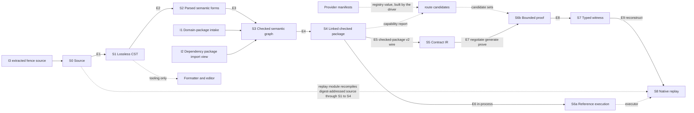
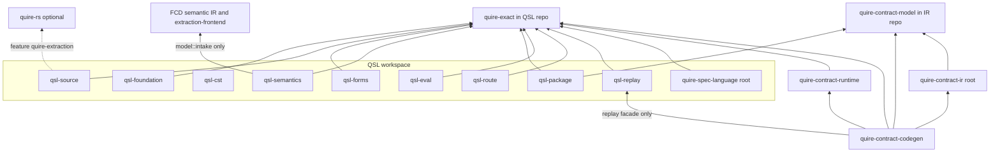

# ADR-011: QSL stage DAG and crate/module dependency architecture (ARCH-10)

## Status

Proposed, 2026-09-19. Owning ticket: agent-ix/quire-spec-language#209 (ARCH-10),
epic #205, Layer 1. Acceptance is tested by the change-scenario gate #212.
Supersedes nothing.

## Context

#209 asks for the legal compilation and execution stages of QSL V1, what each
stage edge preserves, the refusal and bypass rules, CLI orchestration, and the
target crate and module dependency graph with extraction criteria.

Inputs, used as given and not reopened:

- **ADR-010** (observed baseline). Its §2 and §3 are the current stages and
  dependencies. Its §9 routes 19 findings to #209: OBS-001, 002, 007, 008, 009,
  010, 011, 015, 016, 028, 029, 030, 031, 036, 037, 038, 039, 040 and 041. It
  also names #209 as a secondary owner of OBS-005, OBS-017 and OBS-034. This
  record cites ADR-010 items as `ADR-010 OBS-nnn` and lanes and stages as
  `ADR-010 A4`, `ADR-010 lane B` and so on.
- **QSpec AD-016** (accepted, `agent-ix/quire-specification`
  `spec/assurance/AD-016-semantic-family-extension-path.md`). Its seven arrows,
  crate graph, replay ownership, Shared-type strategy, `heads/` workspace and
  six owner decisions are binding. This record places the QSL-internal stages
  and modules around those arrows. Where AD-016 marks a cell `OPEN — decided in
  WP<n>`, this record leaves it open unless the cell is a QSL-internal module
  placement, which #209 owns. AD-016 records four types named
  `CheckedPackage`, and its Owner decision 6 defers renaming them.
- **Sibling Layer 1 tickets.** #210 decides family extension contracts, dispatch
  and capability selection. #211 decides canonical types, identities,
  conversions and versions. #229 aligns QSL's `Capability` specification with
  the #134 vocabulary (agent-ix/quire-specification#134 widens FR-290). ADR-012
  (#210, QSL PR #234) is the family-contract record this one pairs with. #225
  decides lifecycle and CLI orchestration. This record names the question it
  hands to each one and decides none of them.
- **agent-ix/quire-contract-runtime#53.** At RT d97bc0b (origin/main,
  2026-09-18) no Kani harness reaches RT `src/exact/`. The RT proof gate
  compiles 11,519 lines of it and discharges zero propositions over them: the
  code compiled under Kani and the obligation count did not move. This is the
  same instrument-honesty defect as ADR-010 OBS-028.
- **agent-ix/quire-contract-ir#140.** IR FR-031's Behavior sentence and
  FR-031-AC-3 name native `runtime::execute` as the replay executor, which
  AD-016 arrow 7 rules out. IR PR #138 rewrites FR-031's Status section only.
  agent-ix/quire-contract-ir#140 amends the Behavior sentence and AC-3 and
  removes `replay_with_native_runtime`.
- **Owner ruling, 2026-09-19: skeleton first.** A skeleton build runs in
  parallel with Layers 1 and 2. It carries one Boolean clause from contract to
  Contract IR, to a CG-emitted crate, to a `cargo kani` proof, to an injected
  violation, to a counterexample, and to native replay with the same verdict,
  green in CI. §1.1 places it.

Implementing tickets. This record names them as the changes that realize its
decisions. It does not design their content.

| Ticket | Realizes |
|---|---|
| #222 | Boundedness design: temporal, trace and unbounded-request architecture on the stage edges |
| #213 | Implementation of canonical identity, typestate, outcome, provenance, bound and `Capability` value types that the stage outputs carry |
| #185 | The only capability registry and router: the QSL `route` module (§6.1) |
| #231 | Typed proof-result, witness and replay envelopes on E8 and E9 |
| #214 | As a `Value` family implementation ticket, the widening of the layer-6 `replay` facade for that family (ADR-013 TK-01) |
| QSL-138, QSL-141 | The S2 forms producer: the `forms` core (M-3a) and each family's parsed-form type (M-3b) |
| QSL-139 | The check/evaluate split for function application (M-5) |
| #215 | Exact-pin and current-head integration lanes |
| #216 | The single checked-package gate (Layer 2) |
| #217 | The function-application proof and native-replay exemplar: the first widening of the skeleton spine (§1.1) |
| #218 | Frames and scoped clauses through the proof spine |
| #219 | The executable proof, witness and native-replay gate. It verifies §2.3 on the spine. |
| #220, #221, #223 | Family placements: state, model and finite execution; sum and case; protocol, frame, refinement and abstraction relation |
| #225 | Lifecycle and CLI orchestration design (§5) |
| #29, #133 | CLI parse and dispatch; parsing `quire` fences (input I3) |
| #131, #132 | Domain-package and model intake (I1) on the checked path |
| #122 / #232 | Lifecycle and CLI implementation |
| #230 | Bounded lifecycle conformance slice |
| #226 | Architecture-drift gates that enforce §3, §6 and §7 from Layer 5 |
| agent-ix/quire-contract-runtime#53 | The RT `src/exact/` proof gate under §2.3, until X-1 moves the kernel |
| agent-ix/quire-contract-ir#140 | Replay executor wording in IR FR-031 and removal of `replay_with_native_runtime` |
| agent-ix/quire-contract-ir#109 | Frame clauses in the Contract IR (scenario 4 only) |

Changes this record needs that have no ticket yet are listed under Tickets to
open at #212.

Terms used below:

- **Stage**: a step with one owner, one admitted input type and one output
  type. Stages are `S0`…`S8` (§1).
- **Edge**: a legal handoff between two stages (`E1`…`E9`, §2).
- **Seam**: a module or dependency that exists today, maps to no target stage,
  and has a named retirement change (§6.2).
- **Checked**: a value of an S3 or S4 output type: `CheckedGraph` (S3's own
  output, defined in layer-3 `check`) or `CheckedPackage` (S4's in-process
  output, defined in layer-4 `package`, §4; ADR-013 T-1). Two producers exist: the S3
  check stage and the E4 link step in `package`. A wire-admitted value never
  becomes checked typestate (ADR-013 R-10): the I2 reader yields
  `VerifiedPackage` and `ImportView`, neither of which is checked. Nothing else
  constructs a value of a checked type.
- **Reference semantics**: the QSL evaluator whose result defines what a
  checked package means. #205 assigns reference semantics to QSL.

## Decision

1. The stage DAG in §1 is the only legal compilation and execution flow for QSL
   V1. Every QSL module and every QSL cross-repository dependency maps to one
   stage, to a foundation or tooling layer, or to a seam with a named
   retirement change (§6).
2. Every edge carries the typed contract in §2: admitted types, owner, what it
   preserves, its limits, and whether partial output may escape.
3. The bypasses in §3 are forbidden. A test that exercises a forbidden bypass
   is evidence of a defect, not of a feature.
4. Checking precedes all executable lowering (§4). No public type is shared
   between an unchecked and a checked object.
5. CLI commands orchestrate stage APIs and return structured outcomes (§5).
6. The module DAG in §6 and the crate DAG in §7 are the target dependency
   architecture. Each §6.1 layer named in the §6.1 crate map is its own
   workspace crate (§7.2). The crate extractions this record approves are `quire-exact`, which
   AD-016 Owner decision 2 already accepted, and the §6.1 layer crates
   (X-2 to X-10, QSL-177 to QSL-185).
7. The four observed lanes converge or retire as §8 states. Every producer
   path other than the spine is deleted in the PR that lands its spine
   replacement; the checked-package producer lane goes before gate #216 (M-6).
8. A proof gate discharges at least one proposition over the modules it claims.
   The proof's expectation SHALL be derived independently of the function under
   proof. Where the expectation and the function under proof share a helper, a
   mutation of that helper moves both sides together and the proposition holds
   vacuously. Evidence: a mutation of each shared helper is run and shown to
   fail the proof. The floor on discharged checks counts SUCCESS checks only.
   UNREACHABLE checks, and every status other than SUCCESS, are not counted as
   discharged. Compiling the code under the prover is necessary, not sufficient
   (agent-ix/quire-contract-runtime#53). Each claimed module also has a mutation
   control that turns the gate red (§2.3).
9. Compatibility disposition for every change in this record is **none**. QSL
   is prerelease, and each replaced path is removed in the change that lands
   its successor.
10. The ADR-010 findings routed to #209 are decided as §9 states.
11. Other records cite this record's local ids as `ADR-011 S3`, `ADR-011 E5`,
    `ADR-011 FB-03`, `ADR-011 SEAM-1`, `ADR-011 X-1` or `ADR-011 M-4`.
12. The skeleton spine (§1.1) is the first end-to-end run of AD-016 arrows 3 to
    7. Gate #212 cites its result where one exists; that is evidence, not a
       ticket-order edge, and #212 does not wait on
       agent-ix/quire-contract-codegen#87. #217 widens it.

## 1. Stage DAG

| Stage | Output role | Owner repository and module | AD-016 arrow |
|---|---|---|---|
| S0 Source | Source bytes with `SourceIdentity` and revision | QSL `source` | none |
| S1 Lossless CST | Exact, recovering concrete syntax tree | QSL `cst` (the `qsl-cst` crate: `qsl_cst::cst`, `qsl_cst::grammar`, and its private parser) | none |
| S2 Parsed semantic forms | Unchecked syntactic forms per family, each with a span. No semantic identity. | QSL `forms` (the `qsl-forms` crate) | arrow 1 input ("Source AST") |
| S3 Checked semantic graph | Checked nodes with minted node ids and declaration identities, resolved against admitted domain packages and dependency import views | QSL `check` (today `value::expression` check, `check::checked_dispatch`, `value::library`) over `model` | arrow 1 output |
| S4 Linked checked package | The checked graph linked with the checked packages of its dependencies, each compiled from its digest-addressed source through S1 to S4, with package identity and source map. The closure carries checked dependency nodes, never wire-admitted ones. Two forms: in-process, and `quire.checked-package/v2` wire. | QSL `package` | arrow 2 producer |
| S5 Contract IR | Target-neutral IR nodes read from the v2 wire | IR `quire-contract-model` (`CheckedPackageV2::read`, `::lower`) | arrow 2 consumer |
| S6a Reference execution | `Evaluation` of a checked package: a `FamilyOutcome`, which is the kernel `Outcome` (completed, undefined, refused or incomplete) or a family-owned `FamilyResult` (refused or undefined) for an evaluation-time result the kernel does not own, beside the evaluation's location and loss records (ADR-013 O-16). A family that does not evaluate natively (`Relation`) is not an S6a input. Deterministic and free of side effects: the same package, arguments, object environment and meter budget give the same outcome. | QSL `value::expression` evaluate and `CheckedPackage::call` (the AD-016 arrow 7 path), over the `quire-exact` kernel | arrow 7 executor |
| S6b Bounded proof | Per-item negotiation disposition, then one IR `KaniOutcome` per supported item | CG (per-item negotiation, oracle, `kani_obligations`), RT ops, host ABI and `negotiate_*` predicates, IR `src/kani` outcome | arrows 3 to 6 |
| S7 Typed witness | `CounterexamplePacket` with a `ReplaySource` | IR `src/kani` (packet and witness types) | arrow 6 output |
| S8 Native replay | Parity verdict: the S6a result under the reconstructed input, compared with the S6b result | CG replay adapter (reconstruction and comparator), QSL layer-6 `replay` (S1 to S4 recompile, then S6a as executor) | arrow 7 |

Side inputs:

| Input | Enters | Owner | Rule |
|---|---|---|---|
| I1 Domain-package intake | S3 | QSL `model::intake` (QSL PR #200), the only FCD ↔ QSL translation point (AD-016) | Intake admits FCD Semantic IR bytes into an admitted `DomainPackage` before any check reads it. A caller-constructed `DomainPackage` is test-support only. |
| I2 Dependency packages | S3 | QSL layer-3 `library` defines `VerifiedPackage` and the §4 binding (over F `digest` and `wire_format`), and converts `VerifiedPackage` → `ImportView` (ADR-013 T-1). The layer-4 `package` reader reads the v2 bytes and calls `library` to verify them, a downward edge. | Neither output is checked typestate (ADR-013 R-10). The `ImportView` serves E3 name resolution only. It exposes the verified package's exported declarations as data keyed by `WireNodeId`; I2 re-checks no declaration. At E3 a view holds only `WireNodeId`s, and a reference into it is a `PackageNodeKey{package: package_id, node: WireNodeId}` (ADR-013 T-2, T-3). A `WireNodeId` becomes a `NodeKey` only by lookup in a checked package: at E4, in the dependency's checked package compiled from source, whose `package_id` equals the view's (§4 dependency binding). The `ImportView`'s only constructor is in `library`, from a `VerifiedPackage`, so no other module can build a view. Orchestration passes the view into E3. No layer-3 module depends on layer 4. |
| I3 Extracted fence source | S0 | QSL `source` intake adapter over quire-rs extraction (feature `quire-extraction`) | Extraction yields S0 bytes plus a document `SourceMap`. It enters the same S1 parser as any other source. |

Package import graph rules (I2). One check admits a set of import views. The
set refuses, with no checked graph, when:

- an import is missing, or its identity is not listed in the library lock or
  pinned request;
- two views claim the same package with different identities;
- the import graph has a cycle, including a package that imports itself.

Stage order resolves ADR-010 OBS-009 as follows. Name and model binding (ADR-010
A4 "link", and lanes B2 to B4) is a phase inside S3, not a stage before it. S4
"linked" means closure over the *checked packages* of the dependencies,
identified by package identity, which happens after checking. No stage after S3
re-resolves a name, except the replay `QualifiedName` lookup at E9 (ADR-013
R-06).

### 1.1 Skeleton spine

The skeleton (owner ruling, 2026-09-19) is the first end-to-end run of AD-016
arrows 3 to 7: one Boolean clause through E5, E7, E8 and E9 to a native replay
with the same verdict, green in CI. It is built in parallel with Layers 1 and
2.

- Gate #212 cites its result for scenario 6 (§10) where one exists. It is
  evidence, not a ticket-order edge: #212 does not wait on
  agent-ix/quire-contract-codegen#87.
- #217's function-application exemplar is the first widening of that spine,
  not the first proof. #218 widens it to frames and scoped clauses.
- It meets §2.3: its gate discharges at least one proposition over the code it
  claims, counting SUCCESS checks only; its expectation is derived
  independently of the function under proof, a run mutation of each helper
  shared between oracle and code under proof fails it, and its injected
  violation is the mutation control.
- It meets FB-07: replay runs through S6a. A stubbed executor or a
  predetermined verdict does not count.
- It counts as evidence for E1 to E4 only for the stages its input actually
  passes through.

## 2. Edge contracts

### 2.1 Admitted types and owners

Type names follow ADR-013 T-1: `LosslessCst` (S1), `ParsedSource` (S2),
`CheckedGraph` (S3), `CheckedPackage` (S4 in-process, defined in `package`),
`EmittedPackage` (S4 wire), `VerifiedPackage` and `ImportView` (I2). Each is a
distinct nominal type with private constructors in its stage module.

| Edge | From → to | Admitted input | Output | Edge owner |
|---|---|---|---|---|
| E1 | S0 → S1 | Source bytes, `SourceIdentity`, limits | Lossless CST | QSL `cst` |
| E2 | S1 → S2 | A CST with no error or recovery node | Parsed forms | QSL `forms`; family form builders (ADR-012 §2) |
| E3 | S2 → S3 | Parsed forms, the unit's source owner (ADR-013 O-04), admitted domain packages (I1), layer-3 `library` import views (I2) for name resolution only, library lock, and the package's lock evidence (§2.4) | Checked semantic graph | QSL `check`; family `check` and `requirements` hooks (ADR-012 §2) |
| E4 | S3 → S4 | Checked semantic graph, and each dependency's checked package compiled from its digest-addressed source through S1 to S4, whose recomputed `package_id` equals that of the verified view E3 resolved against (§4 dependency binding) | Linked checked package (in-process) whose closure carries the checked dependency nodes, and v2 bytes on request | QSL `package` |
| E5 | S4 → S5 | `quire.checked-package/v2` bytes only, and beside them the expected `package_id` the driver received in E4's `EmittedPackage`. IR's reader enforces conditions 1 and 2 of the §4 verified binding (supported version, digest equal to declared identity) under FR-322 (IR TC-048), and condition 3 (identity pinned by the request) against that expected `package_id` | IR `CheckedPackageV2`, then IR nodes | IR reader. The wire contract is QSpec's. |
| E6 | S4 → S6a | In-process linked checked package with its checked dependency closure (E4), typed arguments, object environment, `Meter` | `Evaluation` carrying a `FamilyOutcome` | QSL `value::expression` |
| E7 | S5 → S6b | IR nodes; the per-item requirement records (keyed by occurrence key, ADR-012 §13.5), which the driver passes from the in-process `CheckedPackage`; bounds, and the `route` candidate sets, passed by the orchestrating driver (T-13) | `ObligationRecord` per requested item. For `supported` items: oracle, harness and one `KaniOutcome`. | CG, with RT ops and IR outcome (AD-016 arrows 3 to 6) |
| E8 | S6b → S7 | Kani run of a `supported` item | `CounterexamplePacket{source: ReplaySource}`, where `ReplaySource` is `Witness(Witness)` or `Input(values)` (ADR-013 O-25; the AD-016 amendment is ADR-013 QC-20) | IR |
| E9 | S7 → S8 | The replay request: the IR packet plus the #231 envelope members (state environment, accounting limits, and the S1 to S4 stage limits copied from the proving run), and the digest-addressed source of the proved package and of its domain and dependency packages (QC-1 byte provision) | Parity verdict | CG replay adapter, through QSL layer-6 `replay` only. `replay` recompiles the source through S1 to S4 into a `CheckedPackage` whose closure carries the checked dependency nodes (E4). It checks that `package_id` equals the packet's (ADR-013 T-2, O-26), that each `RawSourceRef` source digest matches, and the §4 dependency binding for each dependency, selects the function by `QualifiedName`, then calls the S6a executor. No `CheckedPackage` is built from wire bytes. |

E9 details:

- The replay request is the IR packet plus the #231 envelope members: the
  state environment, the accounting limits, and the S1 to S4 stage limits
  copied from the proving run (ADR-013 O-26, QC-8). CG does not construct
  them from anything else. QSpec fixes the outcome→verdict map per ADR-013
  O-16 category (FR-323, with QC-8), and the request carries the members
  above only. `Undefined` and `FamilyOutcome::FamilyEvaluated` never count
  as agreement. Remaining
  work: agent-ix/quire-specification#141.
- The recompile runs under the stage limits the request carries. A limit
  refusal at E9 yields no verdict and carries its `LimitExceeded` cause,
  never `inconclusive`.
- `CheckedPackage::call` admits its arguments before S6a and returns
  `Result<Evaluation, CallFailure>`, with `CallFailure {
  Input(InputRefusal), Fault(InternalFault) }`. `replay` carries `Input` as a
  `StageFailure::Refused` cause (an ADR-013 O-26 refusal) and `Fault` as an
  internal fault. Neither yields a verdict, and neither is `inconclusive`.
  AD-016 arrow 7 is stale here. Remaining work:
  agent-ix/quire-specification#141.
- A packet whose `package_id` differs from the recompiled package's refuses
  with a typed cause and yields no verdict.
- The packet's `source` is a `ReplaySource`: `Witness(Witness)` or
  `Input(values)`, never both (ADR-013 O-25, ADR-013 QC-20). A `Witness`-sourced
  replay derives its input from the transcript by `decode`. An `Input`-sourced
  replay runs from the stored input, settles AD-016 WP9 category
  `reproduced-without-witness`, and never counts as backend evidence.
- `replay` builds each dependency's view itself: it compiles that
  dependency's QC-1 source bytes through S1 to S4, emits its v2 bytes and
  verifies them under the §4 binding. The expected dependency `package_id` is
  the one the proved package records for it (ADR-013 QC-10), which the
  packet's `package_id` check already covers. A dependency whose recomputed
  `package_id` differs refuses with `DependencyIdentityMismatch`, catalog code
  `stale_dependency`, as the other dependency refusals in ADR-013 O-26 do, and
  yields no verdict (§4 dependency binding).
- The replay request carries a typed `QualifiedName` (owner ruling,
  2026-09-19). `replay` resolves it by name lookup in the recompiled package
  and passes the result to `CheckedPackage::call`. AD-016 arrow 7 is
  unchanged.
- Node ids in the packet are `WireNodeId`s. Each becomes a `NodeKey` only by
  lookup in the recompiled checked package. The packet carries the occurrence
  key (node id, role, ordinal; ADR-013 O-07) of the failing node (QC-8), and
  E9 resolves spans by that occurrence key. A dependency's `WireNodeId`
  resolves through the source map of the dependency package that `replay`
  recompiled, under the `RawSourceRef` digests the packet carries (ADR-013
  O-25).
- An S6a `Incomplete`, `Undefined`, `Refused` or
  `FamilyOutcome::FamilyEvaluated` result never counts as agreement. It
  settles `inconclusive` with a typed cause.

Capability routing (ADR-012 §6 and §7, #185). Each step has one owner. QSL
`route` (layer R, §6.1) computes each item's candidate set after S4 and
before E7. CG `negotiate_*` settles every item's disposition at E7 (AD-016
arrow 4) and writes its one terminal record. After E7, `route` reads the
FR-331 dispositions as wire and returns the `BackendId` of each item settled
`supported`, and nothing else. The orchestrating driver (T-13) passes that
`BackendId` to CG generation.

- `route` computes each item's candidate set from the per-item `Requirements`
  records made at E3 (§2.2) and a registry value. The registry value is
  built from provider manifests by the orchestrating driver (T-13) and passed
  in as an argument; it is never global state.
- The orchestrating driver (T-13) passes the checked package's v2 bytes and
  the candidate sets to CG, and after E7 passes each `BackendId` that `route`
  returns to CG generation. No QSL library module depends on or calls CG.
- The registry-to-CG path crosses as data (ADR-013 T-7): a backend's descriptor
  is its FR-331 provider manifest, which the driver reads and `route` converts
  into its `BackendDescriptor`; candidate sets cross on the candidate-set wire
  authored in agent-ix/quire-specification#134; a capability crosses in its #229
  wire spelling. No shared Rust crate holds these types. QSL and CG each convert
  from the wire, so there is no CG → QSL type edge and FB-05 holds.
- Capability kinds are the #134 vocabulary.

### 2.2 What each edge preserves

Columns:

- **Syntax** is trivia, layout and token text.
- **Provenance** is byte spans in the original source.
- **Identity** is semantic node and declaration identity.
- **Version** is edition, package identity and digest, and wire or schema
  version.
- **Proof metadata** is bounds, extents, the capability report, obligation
  identity and tool pins.

"Minted" means the edge creates the item. "Carried" means it passes the item
through unchanged and never re-derives it. "Dropped" means the edge discards it
by design, and no later stage may recover it.

| Edge | Syntax | Provenance | Identity | Version | Proof metadata |
|---|---|---|---|---|---|
| E1 | Minted, lossless | Minted: spans against `SourceIdentity` and revision; I3 adds the document `SourceMap` | none | Edition read from source | none |
| E2 | Dropped | Carried: each form holds the span of its CST node | none: forms carry position only | Edition and the unit's profile, import and model selections carried; each form's `using` alias carried as written | Declared bounds and extents carried as syntax |
| E3 | none | Carried: QSL, the only span minter, keys the source map by occurrence key (node id, role, ordinal; ADR-013 O-07) | **Minted**: checked node id (`quire.checked-semantic-node/v1`, FR-201). A node bound to a domain-package declaration carries that declaration's `DeclarationKey{package, node}`, which the domain package assigns and I1 intake admits; QSL never mints one (ADR-013 O-03, C-02). AD-016 arrow 1 is stale here. Remaining work: agent-ix/quire-specification#141. Node ids are content-addressed over the ADR-013 O-04 preimage. Structurally identical nodes share one id, and each source occurrence is keyed by (node id, role, ordinal) (ADR-013 O-07). The node-identity preimage names the node's owner: `SourceOwner` or `DefinitionOwner` (`{authority, identity}`) for a source- or definition-declared node, and the domain package identity, declared version and IR node for a `ModelOwner` node (QC-18). Package scope comes only from that owner; a node's FR-322 `declaration` is package-local and contributes its qualified name to the content key (ADR-013 O-04). A declared record, tuple or function carries its owner, so only packages of one owner share its id, and declared nodes of distinct owners never share a `NodeKey`. Builtin and anonymous structural types (`scalar_type`, `bounded_domain` and anonymous composite types) carry no owner and share one id across packages (OQ-7 ruling). The lock evidence (§2.4) is admitted here, because the FR-322 application-node key hashes each operation's law `DefinitionRef`s, digests included. A reference into an I2 view is `PackageNodeKey{package: package_id, node: WireNodeId}` in `library` (ADR-013 T-3); it names the view's node without making a `NodeKey` from wire bytes. | Lock evidence admitted (§2.4); dependency and domain-package identities resolved and recorded | Bounds and extents typed. Each checked item that has `Requirements` gets one requirement record, made without negotiation and keyed by its occurrence key, holding the item's one capability kind (the #134 vocabulary, FR-057), the declared extent and the authored bound. `request_index` is the bytewise order of those keys, so two identical claims stay distinct. The record holds kind, extent and bound only (ADR-012 §13.5). AD-016 arrow 1's `capability_report` wording is stale here: the v2 `capability_report` is FR-322's feature-level report (E4). |
| E4 | none | Carried: source map by occurrence key, in the package | Carried verbatim | **Minted**: package identity and digest, v2 schema version | Carried as v2 `bounded_domain` and `model_population`. The per-item requirement records are carried in the in-process `CheckedPackage`, not in the v2 bytes. The v2 `capability_report` follows FR-322: one `{feature, disposition}` entry per `required_features` entry and per selected model capability. A function-only `Value` package has `required_features = ["quire.value.complete/v1"]` and one entry for it with disposition `available`. |
| E5 | none | Carried as `CheckedSourceMapEntry`, never re-minted | Carried read-only as `CheckedNodeId` and `CheckedDomainPackageRef` | Checked: an unsupported v2 contract version refuses | Carried; `requires-bound` derived once from the IR table |
| E6 | none | Carried: `Evaluation.location` from the node id | Carried | Package identity bound to the evaluation | none |
| E7 | none | CG tags from node ids | Obligation id = digest over every `KaniObligationIdentity` member except `source_span` (AD-016 arrow 5; QC-14, landed by agent-ix/quire-specification#140); it gains the clause occurrence key with QC-8. Remaining work: agent-ix/quire-specification#141. | Kani tool pin and runtime revision become part of the evidence identity | **Minted**: disposition per `request_index`, obligation identity with its per-argument bound subset |
| E8 | none | none: resolved at E9 | Obligation id, harness symbol | Tool pin carried | Bound subset carried; `proved` qualifies only over it |
| E9 | none | Resolved: `WireNodeId` → `NodeKey` by lookup in the recompiled package, then the packet's occurrence key → nested span through the v2 source map of the package that holds the node | Obligation id, node id | Package identity of the replayed package equals the proved package | Same finite domain as the harness |

Consequence: S1 is the only stage that holds syntax. After E2, nothing reads
source text or CST to recover meaning (§3 FB-01).

### 2.3 Refusals, limits and partial output

Every stage returns a structured result: its output, or a refusal with typed
causes and catalog codes. Stages S1 to S4 and the I2 reader return
`Result<Staged<T>, StageFailure<C>>`, with `StageFailure` variants `Refused`,
`Limit(LimitExceeded)` and `Fault(InternalFault)` in F `diagnostic`. A family
`check` that reaches a limit returns `StageFailure::Limit(LimitExceeded)`.
`CheckedPackage::call` admits its arguments before S6a and returns
`Result<Evaluation, CallFailure>`, with `CallFailure { Input(InputRefusal),
Fault(InternalFault) }`, where `Evaluation` is `Evaluation<Value>`. S6a
itself returns `Result<Evaluation<T>, InternalFault>`. The layer-5
`Evaluation<T> { outcome: FamilyOutcome<T>,
location: Option<check::Location>, losses: Vec<LocatedLoss> }` carries the
evaluation's one locus and its loss records beside the layer-3 `check`-core
`FamilyOutcome { Evaluated(kernel::Outcome), FamilyEvaluated(FamilyResult) }`,
which carries the kernel `Outcome<T>` unchanged in its `Evaluated` arm and a
family-owned evaluation-time refusal or undefined result in `FamilyEvaluated`
(ADR-013 T-4, O-16). S6a's input type admits no `Relation`, so no
family-dispatch refusal exists;
`Incomplete` is an S6a outcome only. The layer-6 `replay` facade and the
layer-R `route` module return `Result<Staged<T>, StageFailure<C>>`, each with
its own cause type. The
canonical outcome and refusal types are ADR-013's, and #213 implements them.
#222 designs boundedness on the edges. #231 implements the typed
proof-result, witness and replay envelopes on E8 and E9. They live in the
layer-6 `replay` module and are part of its public API; CG reaches them only
through that API (FB-05). The rules below decide only what may cross an
edge.

| Edge | On error | May partial output escape? |
|---|---|---|
| E1 | A CST with error or recovery nodes and its diagnostics | **Only to tooling.** The formatter and editor (`complete::editor`, `complete::edit`) may consume a recovering CST. E2 refuses a CST that has any error or recovery node. |
| E2 | Refusal with diagnostics | No. A form is built from a complete CST or not at all. |
| E3 | Refusal with every error diagnostic; warnings travel with a success | No. A package with an error diagnostic yields no checked graph (AD-016 arrow 1). |
| E4 | Refusal, including `DependencyIdentityMismatch` (catalog code `stale_dependency`, §4) | No. No package, and no v2 bytes. |
| E5 | IR `CheckedPackageRefusalCode` | No. A refused package yields no IR package (AD-016 arrow 2). |
| E6 | `Outcome::Refused`, `Undefined` or `Incomplete`; `FamilyOutcome::FamilyEvaluated(FamilyResult::Refused(_))` or `FamilyResult::Undefined(_)` for a family-owned evaluation cause (`wrong_snapshot`, the model-query refusal, `precondition-false`, `absent-key`); `InternalFault`. Bad arguments are refused at admission, before S6a: `CheckedPackage::call` returns `CallFailure::Input(InputRefusal)` | `Incomplete` is a typed outcome that says a budget ran out. It is never read as `Completed`. |
| E7 | Per item: `requires-bound`, `unsupported` (warned) or `invalid-request` | **Per item only.** Each requested item settles exactly one terminal record (AD-016 terminal-disposition rule). An item not settled `supported` produces no oracle, harness or packet. Other items proceed. |
| E8 | `KaniOutcomeKind` other than `Counterexample` | No packet without a counterexample, and no placeholder witness |
| E9 | Identity mismatch refusal, including `DependencyIdentityMismatch` (catalog code `stale_dependency`, §4); `Witness::parse` or `decode` refusal; `CallFailure::Input(InputRefusal)` from `CheckedPackage::call`, carried as a `StageFailure::Refused` cause (ADR-013 O-26), and `CallFailure::Fault`, carried as an internal fault; a recompile limit refusal with its `LimitExceeded` cause; internal fault: no verdict, distinct outcome kind (§5); disagreement → `inconclusive` with a typed cause | No verdict is synthesized for a refusal, a limit or a fault, and a disagreement is never repaired |

**Limits.** Every stage entry takes explicit limits: input bytes, nesting
depth, node count and work budget, as that stage needs them. A stage that
reaches a limit refuses with a limit cause that names the limit. It never
truncates its output, and a limit refusal is never read as success. Recursive
stages (S1, S2, S3, S6a) bound their depth by an explicit limit, not by the
native stack. #222 designs the bounds that belong to boundedness semantics,
and ADR-013 T-4 the limit cause type (`LimitExceeded`).

**Internal fault.** A violated internal invariant is not a refusal of the
input. It settles a distinct outcome kind, carried to the command outcome and
to its own exit code (§5). It is never reported as success or as a refusal.

**Proof-stage acceptance (S6b; agent-ix/quire-contract-runtime#53, ADR-010
OBS-028).** This rule applies to proof evidence that the #205 gates count: #212,
#217 and #219, and the skeleton spine (§1.1). A gate discharges at least one
proposition over the code it claims. Compiling the code under the prover is
necessary, not sufficient: RT `src/exact/` compiled under Kani and the
obligation count did not move (agent-ix/quire-contract-runtime#53).

The proof's expectation SHALL be derived independently of the function under
proof. Where the expectation and the function under proof share a helper, a
mutation of that helper moves both sides together and the proposition holds
vacuously: on the agent-ix/quire-contract-runtime#57 harness over `src/exact/`,
both sides went through `decode`, and a mutated `decode` left the proof
VERIFICATION SUCCESSFUL (#245).

An expectation that evaluates through a `quire-exact` operation shares that
operation with any function under proof that calls it (ADR-013 O-13). For a
proof of a `quire-exact` operation, or of an RT op that calls one, the
expectation comes from the QSpec operation vectors or from a checked-in
specification model that calls no `quire-exact` operation. AD-016 arrow 4 and
its crate-table line 406 are stale here. Remaining work:
agent-ix/quire-specification#141.

Each counted gate publishes a checked-in list of the modules it claims. For
each claimed module, the gate passes only if all of these hold:

1. The prover transcript shows at least one discharged check location inside
   that module. A check counts as discharged only when the backend reports
   that obligation's check as proved or SUCCESS. UNREACHABLE checks, and
   every status other than SUCCESS, are not counted as discharged. A backend
   that reports no per-check status counts one check per obligation, and
   only when that obligation is proved.
2. At least one mutation control injected inside that module turns the gate
   red.
3. For each helper that the expectation shares with the function under
   proof, a mutation of that helper is run and shown to fail the proof.

Every run mutation (items 2 and 3) is checked in as evidence: the mutation
diff, the exact command and the failing check output. A mutant that does not
fail the proof fails the gate; no mutant is allow-listed. #219 enforces these
rules.

A helper is shared when the expectation and the function under proof both
call it, directly or transitively. The shared-helper set is computed from the
build as the functions reachable from both the expectation and the function
under proof. Each counted gate checks that set in beside its
claimed-module list, and #219 compares the checked-in set with the computed
set. An empty set is stated as empty.

A claimed module that the prover compiles but where it reaches no proposition
is reported as `unreached`, and the gate fails. #219 verifies this rule on the
spine, including each claimed-module list against the transcript census. A
claimed-module list that shrinks between runs is reported by #219. A stubbed
executor, a predetermined verdict or a build-only run is never proof evidence
(#205 Non-goals).

Proof evidence from other gates counts toward the #205 gates only when those
gates meet this rule. Kernel proof evidence today is the RT `src/exact/` gate,
which agent-ix/quire-contract-runtime#53 tracks; after X-1 it is the
`quire-exact` gate. Whether this rule also binds RT and CG repository process
outside the #205 gates is a cross-repository rule, proposed to QSpec as an NFR
(T-11). agent-ix/quire-contract-codegen#58, agent-ix/quire-contract-codegen#59,
agent-ix/quire-contract-codegen#60 and #73 are defects in CG's generated-harness
gate, not the gate itself.

### 2.4 Lock evidence

A package's lock evidence is the FR-322 `lock` content: edition, profile
selections, definition selections, model selections, sources, required
features and dependency selections. Every member except `sources` enters
`package_id` through the identity preimage. It enters at E3, where node
identity is minted, and not at E4. The inputs it is derived from are the
source bytes, the QSL build, and the domain and dependency sources, because
E9 recompiles from those alone (ADR-013 O-26) and must reproduce `package_id`.
A caller-supplied lock file never enters `package_id`.

| Member | Source |
|---|---|
| `edition` | The edition QSpec's value lock selects as always-selected: role `edition` in `proposals/quire-v1/definitions/complete-value-lock.json` (agent-ix/quire-specification), `agent-ix` / `ix:native` / `quire-draft 1-draft.2`, with the digest that file records. The source header's `language "ix:native" edition "1-draft";` names it, and E3 matches it to that `edition` role. The edition in QSpec's v2 positive fixtures (`quire-edition`, an all-`1` digest) is a placeholder, not an edition. |
| `profile_selections` | The source header's `profile … version … digest …` declarations. E3 refuses a header digest that differs from the accessor's entry for that definition. |
| `definition_selections` and each law `DefinitionRef` | QSpec's value lock |
| `model_selections` | The source header's `model` declarations, matched to the domain packages admitted at I1. Spine `compile` (§5) admits no domain package, so its E3 refuses a `model` declaration. |
| `sources` | `RawSourceRef` (`quire.source.bytes/v1`) over the bytes E1 read |
| `required_features` | §2.2 E4: `["quire.value.complete/v1"]` for a function-only `Value` package |
| `dependency_selections` | Each dependency's `package_id` |

Every definition digest QSL writes is read from a QSpec-published accessor
for `complete-value-lock.json`. QSL holds no digest constant that restates
QSpec data. Until QSpec publishes that accessor, the emitter has no edition
selection and refuses (Remaining work: the QSpec lock accessor, owned and
raised by QSL). QSL's `DefinitionLock` catalog (`src/value/definition.rs`)
restates QSpec identities and revisions, and records lock revision `1-draft.1`
and root revision `1-draft.1` where QSpec's lock is at `1-draft.2` for both. The
accessor replaces that whole restatement. The catalog is a temporary
exception to the no-restatement rule, and it expires when the QSpec accessor
lands: the change that adopts the accessor deletes the catalog's restated
identities, revisions and digests.

A `dependency_selections` entry holds the dependency's `package_id`. FR-322's
`lock` prose, its `dependency_reference` member and FR-322-AC-26, QSL
`library::ImportDeclaration` and the complete-V1 `import … digest …` grammar
all key a dependency by its `package_id`. QSpec's
`proposals/checked-package-v2/schema.json` types the entry as a `Selection`
with a `quire.definition.bytes/v1` `DefinitionRef`, which is a QSpec schema
defect. Until QSpec corrects the schema, E4 emits `dependency_selections: []`,
E3 refuses a unit that declares an `import`, and the I2 reader refuses a
non-empty `dependency_selections` (Remaining work: the QSpec schema defect).

## 3. Forbidden bypasses

Until #226 lands, the #216 and #219 gate walks check this table, §6.1 and
ADR-013 R-09 (no new consumer of a lane-private type) by inspection, and #212
re-walks them against the scenarios.

| ID | Forbidden | Why | Observed today | Verified by |
|---|---|---|---|---|
| FB-01 | Any stage after S1 reads source text, CST, token text or display strings to recover semantics | S3 is the only semantic authority. Later stages carry its identities (§2.2). | none known | #216 "No public downstream consumer reconstructs meaning" evidence, then #226 |
| FB-02 | Any consumer branches on diagnostic message text, `Display` output or rendered codes instead of the typed cause | Diagnostics are output for people, not a channel between stages | CG decides Kani verdicts by string-matching rendered backend output (agent-ix/quire-contract-codegen#59); it retires with #231's typed proof-result envelope | #216 evidence, #231, then #226 |
| FB-03 | Wire-admitted data reaches an S6a evaluator, the S4 emitter or a backend as if it were checked, without the verified binding in §4 | A wire reader proves shape, not a source compile | `protocol_artifact::read` feeding `state` and `temporal` (ADR-010 OBS-015); checked-predicate and temporal-subject handoffs to IR (OBS-037) | #216 typestate evidence and "incompatible version fails without partial output", then #226 |
| FB-04 | Lowering, execution or proof from an S2 form or any unchecked object | Checking precedes all executable lowering (§4) | none on the spine | #216 typestate evidence, then #226 |
| FB-05 | A backend repository (IR, RT, CG) depends on QSL Rust types, except the CG replay adapter's normal dependency on the public API of the QSL layer-6 `replay` module, which includes the #231 envelopes, and nothing else (AD-016 Owner decision 5) | IR reads the v2 wire only (AD-016 Decisions) | IR root → QSL f1700a9 (OBS-029) | a direction check over each backend's `cargo tree`, plus the API-surface check, whose part (a) fails any CG call outside the `replay` facade, owner to be named (T-12, a proposed #215 scope amendment) |
| FB-06 | S3 calls a backend crate to decide a semantic question such as definedness | The backend would become a second language authority | QSL checking, composed proofs and lowering call IR `DeclarationEnvironment::check_expression` (OBS-010) | module-DAG check (§6.1) |
| FB-07 | Replay through any executor other than S6a, or replay evidence from an injected stub executor | AD-016 arrow 7 | IR `replay_with_native_runtime` → `runtime::execute` (removed by agent-ix/quire-contract-ir#140); stubbed CG and IR replay executors (OBS-028) | #217, #219 |
| FB-08 | A witness typed by any means other than IR `Witness::parse` and `decode` | AD-016 arrow 7: `decode` is the only typing step | IT-010 splits Kani stdout into an `i64` (OBS-002) | #217, #219 |
| FB-09 | A CLI command makes a semantic decision, or reads diagnostic text | §5 | none known | #230, then #226 |
| FB-10 | A proof gate claims a module over which it discharges no SUCCESS check, or shares a helper between its expectation and the code under proof without a run mutation of that helper that fails the proof | §2.3 | RT `src/exact/` (agent-ix/quire-contract-runtime#53); the agent-ix/quire-contract-runtime#57 harness's shared `decode` (#245) | §2.3 gate owners, #219 |
| FB-11 | A dependency or test-time edge that closes a cycle between QSL, IR, RT and CG | §7.1 | QSL ⇄ CG and QSL ⇄ RT test-time cycles (OBS-040) | the same direction check over normal and dev edges (T-12) |
| FB-12 | Capability negotiation in S3 | AD-016: QSL admission negotiates nothing. #210 owns the capability-selection contract, #213 the `Capability` value type, and #185 is the only registry and router. | composed `requests::report` (ADR-010 OBS-003, a #210 item) | #216 "#185 alone owns registry/routing" evidence |
| FB-13 | A module other than QSL `check` calls the kernel `NodeKey` constructor | §6.1 "Kernel identity constructors have one caller each" (ADR-013 O-04); the T-12 API-surface check enforces it | none in `value::enumeration` or `value::unit` since QSL-131 K4: they compute preimage digests in `value::semantic_node`, compare a retained key's bytes with the digest, and resolve a preimage's node ids (`WireNodeId`) by lookup among the admitted keys; no shipped code mints their keys (SR-508: no `src/` module constructs an `EnumDeclaration` or a `UnitGraph`) | `arch-lint api-surface` T12-B; its debt list (FR-060, "T12-B and T12-C: shipped code and debt lists") only shrinks, and a new mint outside `check` fails |

## 4. Checking precedes lowering

- S5, S6a and S6b admit only S4 outputs, and S4 admits only S3 outputs. There
  is no path from S2 to S5, S6a or S6b.
- Each stage's output is a distinct public type. The constructors of S3 and S4
  output types are private to their stage modules, so no other module can
  build a checked value. Verification: `compile_fail` tests show that code
  outside the stage module cannot construct them, as #216 "Checked typestate
  prevents unchecked values" evidence.
- **Verified binding (I2).** A package read from the v2 wire becomes a
  `VerifiedPackage` (not checked typestate, ADR-013 R-10) only when all three
  hold:
  1. its schema version is a supported v2 version;
  2. its FR-322 `package_id`, recomputed as the `quire.package.semantic/v2`
     digest of the JCS bytes of the `identity_preimage` read, lexically equals
     its declared `package_id` (ADR-013 T-2);
  3. that identity is listed in the consumer's library lock or pinned request.

  Otherwise the reader refuses with a named cause and yields nothing. A
  digest of the file bytes, a lock file or the source never substitutes.
  `VerifiedPackage` and this binding are defined in layer-3 `library`. The
  layer-4 `package` reader reads the bytes and calls `library` to verify
  them. #213 S-3 implements the types (ADR-013 T-1).
- **Dependency binding (E4, E9).** Each dependency in the S4 closure is
  compiled from source through S1 to S4, and its recomputed `package_id`
  equals the `package_id` of the verified view that E3 resolved against.
  E4 and the layer-6 `replay` facade at E9 check this for every dependency and
  otherwise refuse with `DependencyIdentityMismatch`, catalog code
  `stale_dependency` (ADR-013 O-26, C-13), yielding no package and no
  verdict. The dependency source bytes, and the view each check compares
  against, come from:
  1. an ordinary compile: the S4 source resolution, which reads the same
     resolved package source that the verified view was produced from;
  2. `replay`: the QC-1 digest-addressed byte provision in the replay request.
     `replay` compiles each dependency's bytes through S1 to S4 and verifies
     the emitted v2 bytes to build its view. The expected `package_id` is the
     one the proved package records for that dependency (ADR-013 QC-10),
     covered by the packet's `package_id` check.
- Exactly one QSL type carries each QSL stage output. Two QSL public types
  named `CheckedPackage` with different meanings (ADR-010 OBS-017, DA-04)
  break this rule. The rule is met by deleting the native-v1 type with SEAM-1
  (M-6). No type is renamed (AD-016 Owner decision 6). The RT and IR types of
  that name stay in their repositories as AD-016 records them.
- The S4 in-process type is defined in layer-4 `package`. Layer-4 `package`
  is the module `checked_package` in this crate, and becomes the crate
  `qsl-package` under X-7 (§6.2). `package` keeps its fields and its
  constructor private and exposes read-only accessors. `value::expression`
  names the type through one `pub use`, so the AD-016 arrow 7 path
  `value::CheckedPackage::call` is the contract, not a second type. A
  `compile_fail` test shows that `value::expression` cannot construct it.
- `CheckedPackage`'s layer-5 operations, `call`, `evaluate` and
  `emit_function_package_v2`, are the methods of the extension trait
  `CheckedPackageEvaluation`. Layer-5 `value::expression` defines the trait
  and implements it for `CheckedPackage` over `package`'s accessors. The
  operations are trait methods because Rust accepts an inherent `impl` only
  in the crate that defines the type (E0116), and under X-7 that crate is
  `qsl-package`. The trait keeps the method names, so `pkg.call(..)` and
  `CheckedPackage::call(&pkg, ..)` both resolve, as AD-016 Owner decision 6
  requires. A caller brings `CheckedPackageEvaluation` into scope to call
  them; `value` re-exports it beside `CheckedPackage`.
- A value that fails a stage keeps the previous stage's type. It is never
  wrapped as the next stage's type in a failed state.

## 5. CLI and library orchestration

#225 owns the lifecycle and CLI orchestration design. #122 and its bounded
child #232 implement it, and #230 is the conformance slice. The rules below are
constraints that design must meet. The field list and the exit-code values are
#225's. The orchestrating driver crate is T-13, implemented by QSL #248.

- `command` calls stage APIs in DAG order and makes no semantic decision. It
  contains no parsing, name resolution, typing, definedness, capability or
  evaluation logic.
- Each command returns a structured command outcome. It identifies the last
  stage reached, the terminal outcome kind, the diagnostics with typed causes,
  and the identities of the artifacts produced.
- Outcome kinds map to exit codes through one total function with no `_` arm.
  Refusal, limit refusal and internal fault (§2.3) map to distinct codes.
  Verification: the function denies `clippy::wildcard_enum_match_arm`, and
  #230 tests every kind.
- Text and JSON rendering is a separate step over the structured outcome, and
  no command logic depends on it.
- A library caller gets the same stage APIs and the same outcome. No behavior
  is reachable only through the CLI.
- Lifecycle surfaces (package cache, providers, plugins, AOT and JIT) call the
  same stage APIs and never bypass §3.
- #29 (CLI parse and dispatch) and #133 (parsing `quire` fences, input I3)
  land inside these rules.
- Spine `compile` takes complete-V1 source: `compile <identity> <revision>
  <path>`, the operand shape of `parse` and `format`. It writes the
  `quire.checked-package/v2` bytes to stdout. The lock evidence comes from the
  source header and the QSpec lock accessor (§2.4), and no lock file or
  request file is read. It takes no domain or dependency source, so E3
  refuses a `model` or `import` declaration. No native-compile/1
  request or `native-rule-model/1` model has a spine equivalent.
- Spine `run` calls a named checked function: a `QualifiedName` resolved by
  name lookup in the compiled package, then `CheckedPackage::call` (E6, and
  the same shape E9 uses). Native-run/1 clause execution over snapshots and
  invocations (FR-023, FR-026, FR-028, FR-031, FR-032) has no spine
  equivalent before M-6c and stays until M-6c lands one (§7.3).

## 6. Module DAG

### 6.1 Target layers

The "Depends on" column is an exhaustive allow-list. A module may depend on a
listed lower layer, or on a module earlier in its own layer's order. Every
other edge is forbidden. The result is acyclic. #226 owns the drift gate that
enforces it; before #226, §3's interim rule applies.

| Layer | Modules, in order | Stage | Depends on |
|---|---|---|---|
| K | `quire-exact` crate: the AD-016 Shared-type row as amended by QC-15, QC-21 and QC-22 (TK-10; ADR-013 §8) (`Value`, `ValueType`, `Outcome`, `Refusal`, `Undefined`, `BoundViolation`, `CardinalityBound`, `BoundedInteger`, `NodeKey`, `EffectiveId`, `UniverseId`, `ObjectId`, `UnitId`, `VariantId`, `MemberId`, `PopulationId`, `Origin`/`Location`, `ChargePoint`, `Meter`, `Incomplete`) and the scalar and collection operations over them | foundation | none in the ecosystem |
| F | `absence` < `json_number` < `serde_object` < `digest` < `wire_format` < `source` (with `source_map`) < `diagnostic` < `located_json` | foundation | K |
| 1 | `token` < `lexer` < `cst` | S1 | F |
| 2 | `qsl-forms` crate: `forms` core < family form builders | S2 | 1, F, K |
| I3 | `qsl-source` crate root < `preflight` | S0 intake adapter | F, K; quire-rs only under feature `quire-extraction` |
| 3 | `semantic_value` < `model` (with `model::intake`) < `library` (with `VerifiedPackage`, the §4 binding and `ImportView`) < `check` core (`CheckContext`, family checker trait, shared checked types, `FamilyOutcome`, `FamilyResult` and `EvalOutcome`) < family checker modules | S3, I1, I2 binding and view | 2, F, K; FCD crates from `model::intake` only |
| 4 | `package` | S4, I2 byte reader (verification calls `library`) | 3, F, K; `quire-contract-model` for v2 wire constants and round-trip tests only |
| 5 | `value::expression` core (S6a) < family evaluators under `value::expression`, including the state and temporal evaluators < `simulation` | S6a | 4, 3, F, K |
| R | `route` (#185 registry and router) | candidate sets over S4 before E7; after E7, the `BackendId` of each item settled `supported`, read from the FR-331 dispositions as wire. The backend is chosen only by the `BackendId` argument. | 4, 3, F, K |
| tool | `complete::editor`, `complete::edit`, `format` | tooling over S1 | 1, F |
| 6 | `replay` | the CG-facing replay facade: S1 to S4 recompile, then S6a. Its public API includes the #231 envelopes. | layers 1 to 5, F, K; I3 under feature `quire-extraction` |
| 6 | `command` < `cli` < `main` | orchestration of QSL stages | every layer above, including I3, R, tool and `replay`; quire-rs only through `qsl-source`; never CG |
| driver | the orchestrating driver crate that calls both QSL and CG (T-13, implemented by #248; #225 accepts its design) | orchestration across repositories | the QSL layer crates and CG; a separate crate downstream of CG, because CG → QSL is a normal edge and Cargo refuses a package cycle |

Crate map. Layers F, 1, I3, 2, 3, 4, 5, R and the layer-6 `replay` facade are
each their own workspace crate (§7.2). K is `quire-exact` (X-1). A layer
crate's `[dependencies]` name only the layer crates and the external crates in
its "Depends on" cell above.

| Crate | Layer |
|---|---|
| `qsl-foundation` | F |
| `qsl-cst` | 1 |
| `qsl-source` | I3 |
| `qsl-forms` | 2 |
| `qsl-semantics` | 3 |
| `qsl-package` | 4 |
| `qsl-eval` | 5 |
| `qsl-route` | R |
| `qsl-replay` | 6 (`replay`) |

The root crate, `quire-spec-language`, keeps `command`, `cli` and `main`, the
tool modules, and every seam module (§6.2). A seam module stays in the root
crate until its owning change deletes it there.

Rules that close the ADR-010 OBS-016 cycles:

- **`diagnostic` is foundation.** It holds codes, typed causes and a
  foundation-level locus. It does not embed `linking`, `runtime` or IR types.
  `source` returns typed source errors and never constructs a `Diagnostic`. A
  stage converts its own location into the foundation locus when it emits a
  diagnostic. This breaks the SCC S1 two-cycles diagnostic↔linking,
  diagnostic↔runtime and diagnostic↔source. The other S1 two-cycles,
  checking↔linking and linking↔native_model, lie inside SEAM-1 and are removed
  with it (M-6). The locus is ADR-013 T-5's `Locus` (`Region`, `Occurrence`,
  `Artifact`), which uses the kernel `Location` (DA-13).
- **K is a leaf.** `quire-exact` depends on no QSL module and no ecosystem
  crate, so K → `model` → K cannot exist. Each kernel `Value` and `ValueType`
  payload is a kernel shape (ADR-013 T-6, against the AD-016 Shared-type row
  as amended by QC-15, QC-21 and QC-22): `Value::Quantity` carries the
  kernel `Quantity` (a magnitude and a `UnitId`), `Value::Enum` carries an
  `EnumMember` (a `VariantId` and its rank), `Value::Reference` carries an
  `ObjectReference`, and `Value::Population` carries the opaque `PopulationId`
  digest newtype (QC-21). `ValueType::Population` carries its count only. The
  `PopulationBinding` a `PopulationId` names is QSL `model`'s. The kernel
  `Refusal` carries the kernel's own typed causes; F `diagnostic`, which
  holds `CatalogCode`, maps each one to a code (ADR-013 T-6, O-17).
  `TypeEnvironment` and `ObjectTypeDeclaration` are not kernel types: they
  are in `value::declaration`, at layer 3.
- **Layer 2 holds kernel types.** `forms` depends on K and carries kernel
  types directly as parsed-form payloads, for example
  `quire_exact::Integer` for an integer literal and
  `quire_exact::CollectionKind` for a collection kind. E3 reads those values
  and never re-reads token text (FB-01). The edge admits kernel types, not
  kernel operations: `forms` performs no evaluation. A kernel operation is
  one of the K row's scalar and collection operations; constructing or
  parsing a kernel value is not one. A parsed form still
  holds no `ValueType` and no `NodeKey` (FR-091-AC-11), so S2 carries no
  semantic identity. K is a leaf and F already depends on K, so the edge
  closes no cycle. Owner ruling: ADR-013 OQ-A.
- **`model` sits below `check`.** M-2 moves the two things that make `model`
  depend on `value::expression` today: `model::checked_dispatch` moves to
  `check`, and so does the FR-151 field-refinement obligation
  (`model::conformance::check_field_refinement_obligation`, the only
  `conformance` code that reads `value::expression` facts). Both moves are
  M-2's own — moving `model` code is not M-5's job — but neither can execute
  until M-5 relocates the `value::expression` types they depend on (§7.3).
  Kernel types move to `quire-exact` (X-1). `model::accounting` is a
  separate layer-3 `model` rung meter over its own disjoint counters
  (`ModelNormalizationLimits`), not a kernel type, and stays in `model`
  (QSL-164). X-1 added the kernel copy of `value::accounting`'s
  `Meter`/`Incomplete`/`LimitKind` but left the QSL `value` copies in place,
  unchanged; **QSL-166** owns finishing that consolidation for
  `value::accounting` alone (§7.3). QSL value modules
  outside the kernel row move to `semantic_value` (QSL-165), a separate
  change. After M-2 and
  QSL-165, `model` depends on `semantic_value`, F and K only. This breaks
  SCC S2.
- **The temporal evaluator, under `value::expression`, sits below orchestration
  and never imports a wire module.** Wire emission and reading live in S4
  `package`, and temporal evaluation lives in S6a. This breaks SCC S3.
- **`check` never imports `quire-contract-model`.** This resolves OBS-010.
- **`route` is not S3.** The checker never reads the registry (ADR-012 §6).
  `route` reads the S4 capability report and computes candidate sets. It
  negotiates nothing per item. CG's per-item negotiation at E7 stays in CG.
- **Families are modules, not crates.** Every family (ADR-012 §1) is a set of
  modules inside its layers' crates: a form builder under `forms` in
  `qsl-forms`, a checker under `check` in `qsl-semantics`, an emission arm
  under `package` in `qsl-package` and an evaluator under `value::expression`
  in `qsl-eval`. A crate holds one §6.1 layer, and a family spans layers
  (§7.2).
- **Family modules never depend on each other.** Inside each layer the order
  is core, then families. `CheckContext` (contents in ADR-012 §2) lives in the
  `check` core, beside the family checker trait. Each family checker module
  depends on the `check` core and lower layers, never on another family
  module. The same holds for `forms`, `package` and `value::expression`: a
  family module depends on its layer's core only. Checked types that more
  than one family uses, including the canonical checked clause kind, live in
  the layer-3 `check` core, not in `value::expression` or a family module.
- **`replay` is the narrow facade.** The layer-6 `replay` library module is
  the executor entry for TK-01 (ADR-013 O-26, C-13). It recompiles the
  digest-addressed source through S1 to S4, checks `package_id` and the
  `RawSourceRef` source digests, takes domain and dependency packages from
  the QC-1 byte provision, selects the function by `QualifiedName` and calls
  S6a. Its public API, which includes the #231 envelopes, is the only QSL
  surface CG uses (FB-05, T-12). #243 lands it first with the skeleton spine
  (T-2), and each family's implementation ticket widens it for that family
  (ADR-013 TK-01).
- **Kernel identity constructors have one caller each.** Only `check` calls
  the kernel `NodeKey` constructor (ADR-013 O-04), and only `model` calls the
  kernel `EffectiveId` constructor (ADR-013 O-05) and the kernel `PopulationId`
  constructor (ADR-013 QC-21). The T-12 API-surface check enforces all three.

### 6.2 Current module map

Each current module (`QSL:lib.rs:13-44`, ADR-010 §3.1) maps to a target module
or to a seam. A seam carries its retirement change. Retirement means removal
in one change, with no compatibility disposition.

Seams:

| Seam | Contents | Retires when | Owning change |
|---|---|---|---|
| SEAM-1 native-v1 | ADR-010 lane A, defined by its entry points: the `lower` command, the native `run` and `compile` paths, `package::NativePackage`, `runtime::execute`, the native-linked-package/1 format and the `lowering` targets. SEAM-1 holds every module reachable only from those entry points, including the `package` submodules `intake`, `reading`, `wire`, `encoding`, `features` and `view` (native-linked-package/1, FR-019 and FR-020): arena `syntax` and native `parser`, `linking::native`, native `checking`, `native_model`, `model_source`, `mapped`, `runtime`, and the `command` submodules `compilation`, `projection_error` and `wire`, and the native arms of `extraction` and `output`. Code shared with SEAM-2 (for example `formal_source`, which `checking::composed` imports) belongs to SEAM-2. | Per lane (§7.3 M-6). The checked-package producer lane (M-6a) is deleted before gate #216: "Old producer/bypass paths are unreachable" and "Do not pass while two authoritative producer paths coexist" (#216). Native `run` clause execution and the modules only it reaches retire with M-6c. | M-6a, M-6c to M-6e |
| SEAM-2 composed | ADR-010 lane B: `syntax::composed`, `parser::composed`, `linking::composed`, `checking::composed`, and shared code such as `formal_source` | Deleted (owner ruling). Each composed family is deleted in the PR that lands its S3 family checker and S4 emission, so everything reaches IR through the one S4 spine. #185 removes the `requests` backend disposition from QSL (FB-12). | M-6e with the family implementation tickets (§7.3); #185 for `requests` |
| SEAM-3 protocol wires | `protocol_artifact` (compiled-protocol /1 to /3 emit and read; checked-predicate, temporal-subject and native-temporal handoffs) | Its reads that feed `state` and `temporal` are deleted with #120, #121 and #164 (state) and #188 and #189 (temporal) (M-6c). Its handoffs to IR are deleted with #218 and agent-ix/quire-contract-ir#141, which land S4 emission over the checked graph and IR v2 admission (M-6d). The last lane PR deletes the remainder. The QSpec wire question is in §Questions. | M-6c, M-6d |
| SEAM-4 IT-010 | `tests/it/configversion_backends.rs` proof and replay path, QSL dev dependencies on CG 5e2a6a9 and IR 04eb6f8, and the RT test fixture crate | Deleted with `lowering` once the skeleton spine (§1.1) is green, so CI keeps a Kani proof-and-replay check throughout | M-6a |
| SEAM-5 source graph | `complete::package::lower_source_graph` / `LoweredSourceGraph` (ADR-010 C3) | The S2 `forms` producer lands and replaces it | QSL-138 (M-3a) |

Module table:

| Current module | Target | Notes |
|---|---|---|
| `model::population::AbsenceMode` | F `absence` (new) | QSL-146: moved out of `model::population`, not copied. Its two consumers, the parsed form and `model::population`, sit on opposite sides of a layer boundary, so it cannot stay on either side. It imports nothing, hence its position first in §6.1's F order. |
| `source`, `source_map` | F `source` | S0; `source_map` becomes the occurrence-key-keyed source map (O-07): occurrence key → regions (AD-016; ADR-013 O-12). Its `Diagnostic` import is removed by M-1. |
| `diagnostic` | F `diagnostic` | loses its linking, runtime and IR fields (§6.1, M-1) |
| `digest`, `wire_format`, `json_number`, `serde_object` | F | unchanged role |
| `located_json` | F | its `formal_source` import retires with SEAM-2; its IR `SourceSpan` import is replaced by the F `source` span (M-1) |
| `lexer`, `token` | 1 | shared by S1 |
| `complete` (`cst`, `parser`, `grammar`, `diagnostic`) | 1 `cst` | S1 |
| `complete::editor`, `complete::edit` | tool | the only consumers of a recovering CST |
| `complete::package` (import resolution) | 3 `library` | resolves imports against I2 import views; `lower_source_graph` is SEAM-5 |
| `format` | tool | retargeted from the arena to the CST in M-6a |
| `syntax`, `parser` | SEAM-1 (native) and SEAM-2 (`composed`) | S2 `forms` replaces them |
| `linking` | SEAM-1 (`native`) and SEAM-2 (`composed`) | name binding becomes an S3 phase |
| `checking` | SEAM-1 and SEAM-2 | |
| `formal_source` | SEAM-2 | shared native and composed code |
| `native_model`, `model_source`, `mapped`, `runtime` | SEAM-1 | `runtime::execute` is not a replay target (AD-016). Native `run` reaches `model_source`, `mapped` and `runtime`, so they retire with it in M-6c (§7.3, ADR-011-OQ-2). `NativeModelProfile` and its ceiling sites retire with SEAM-1. |
| `lowering` | SEAM-1 | `lowering` as a whole, including `lowering::target`, its `ProjectionTarget` enum and the `--target` argument, is deleted in M-6a once the skeleton spine (§1.1) is green. The backend is chosen only by the `BackendId` argument, resolved in `route` (#185). |
| crate `qsl-source` | I3 | the extraction adapter stops at S0: verified body bytes plus their document `SourceMap`. The native compile join is in `command::extraction` (SEAM-1). `qsl-source` builds the clause-only Quire context (`clause_context`) and re-exports the Quire result and failure types `command` renders; the root crate names no quire-rs dependency. |
| `package` | 4 `package` | `NativePackage` and the native-linked-package/1 submodules (`intake`, `reading`, `wire`, `encoding`, `features`, `view`) are SEAM-1; the v2 emitter and the I2 byte reader are new in M-4. Until X-7 extracts `qsl-package`, layer-4 `package`'s content — `CheckedPackage`, `EmittedPackage`, the v2 emitter and the I2 byte reader — lives in the top-level module `checked_package`, and the module named `package` holds only SEAM-1. Every rule this ADR states for layer-4 `package` applies to `checked_package`. |
| `value` kernel submodules: `numeric`, `integer`, `rational`, `decimal`, `ieee` and `division` (operations), `text`, `collection`, `comparison`, `equality`, `outcome`, `accounting`, `composite` | K `quire-exact` | only the types in the AD-016 Shared-type row as amended by QC-15, QC-21 and QC-22 (TK-10; ADR-013 §8), and the operations over them. QSL has no `value::` copy of any of these thirteen: every QSL caller imports the kernel item from `quire_exact`. |
| `value` non-kernel submodules: `definition`, `enumeration`, `unit`, `quantity`, `declaration`, `stop`, `member` | 3 `semantic_value` | not in the AD-016 kernel row; used by `model`, `check` and S6a (QSL-165). `declaration` holds the FR-143 registry (`TypeEnvironment`, `ObjectTypeDeclaration`) and the FR-149 check-level equality layer; it imports only K and its `semantic_value` siblings `enumeration`, `quantity` and `stop`, and `check`, `model` (`value::model_query`) and S6a consume it. `stop` is the early-exit carrier that `declaration`, `enumeration`, `quantity`, `model_query` and S6a convert to and from the kernel `Outcome`; it imports only K, and its lowest consumers are `semantic_value` modules. `member` is ADR-013 O-06's structured checked member identity; it imports only F and K. |
| `value::application_key` | 3 `check` | the FR-322 checked application-node key (QSL-156). It imports `check`'s `MAX_CHECKING_DEPTH` as its body-depth bound, so it cannot sit below `check` core. |
| `value::semantic_node` | 3 `semantic_value` | the I04 node-identity preimage machinery (owner projection, JCS digest, `WireNodeId` lookup) shared by `enumeration` and `unit`; moved out of the deleted K-copy `value::node`, whose only kernel types, `NodeKey` and `NODE_KEY_DOMAIN`, are imported from `quire_exact` (QSL-131 K4) |
| `value::division::negotiate_*`, `value::ieee::negotiate_*` | RT | AD-016 Shared-type row: the `negotiate_*` predicates stay in RT, and CG negotiates (arrow 3). AD-016 WP7 decides the predicate list (OBS-004). #213 S-1 (X-1) moved `division` and `ieee` into K but left the QSL copies of `negotiate_*` in place; QSL-131 Slice A (PR #290) removed them. Both modules are now gone entirely, not merely edited: QSL-131 K2 (#339) deleted `value::division` and QSL-131 O3 deleted `value::ieee`, so there is no file or line left to cite for either — every caller reaches the evaluation functions through `quire_exact` directly. |
| `value::expression::syntax` | 2 `forms` | M-3a |
| crate `qsl-forms` | 2 `forms` | the `forms` core: the crate root, `dispatch` (the closed dispatch entry table and the parsed-form contract) and `syntax` (the parsed-form types, including the former `value::expression::syntax`). It depends only on `qsl-cst`, `qsl-foundation` and `quire-exact`; the root crate imports `qsl_forms` directly and re-exports none of its items. |
| `value::expression::check`, `facts`, `termination`, `ir` | 3 `check` | `ir` is the checked expression output (M-5) |
| `family` | 3 `check` core | the family contract (`FamilyKind`, `FamilyContract`, `ReferenceEvaluation`), the S1-S4 outcomes, the S6a result types (`FamilyOutcome`, `FamilyResult`, `EvalOutcome`) and the S6a family kind (`S6aFamilyKind`, FR-090-AC-4) |
| `value::expression::refusal` | split | twelve check-cause types (`Origin`, `Location`, `ProvedInterval`, `Obligation`, `MeasureObligation`, `CheckingStage`, `CheckingLimitKind`, `WrongSnapshotCause`, `CheckCause`, `DispatchFunctionRole`, `InvalidDispatchDeclaration`, `CheckRefusal`) moved to `check::refusal` (M-5, QSL-139, done); `InputRefusal` — defined separately in `value/expression/mod.rs`, never part of `refusal.rs` — moved to argument admission in `CheckedPackage::call`, before S6a |
| `value::expression::evaluate`, `value::expression` `CheckedPackage::call` | 5 `value::expression` | S6a and the replay executor, at the AD-016 arrow 7 path |
| `value::library`, `value::package_identity`, `value::model_query` | 3 `library`, 3 `library`, 3 `model` | `package_identity` is a structural preimage reader with no wire I/O; `library` imports it (`value/library.rs:25`) |
| `value::containment` | 3 `semantic_value` | FR-143 `ValueGraph`; its `protocol_artifact` consumer retires with SEAM-3 (QSL-165) |
| `model::object_environment` (`ObjectEnvironment`) | 3 `model` | Formerly `value::reference`. `ObjectEnvironment` records FR-089's `PopulationId` -> `PopulationBinding` correspondence, and `PopulationBinding` is `model`'s (§6.1, "K is a leaf"), so it cannot move down into `semantic_value`; §6.1's order `semantic_value < model` forbids the upward import, so the module sits in `model` (QSL-181 X-6a). Its only consumers are S6a and tests. |
| `model` (`dispatch`, `domain_package`, `key`, `normalize`, `population`, `refusal`, `systems`, `conformance` type conformance) | 3 `model` | `model::intake` is I1 |
| `model::checked_dispatch`, `model::conformance::check_field_refinement_obligation` | 3 `check` | M-2, blocked by M-5 (corrected 2026-09-20: moving `model` code is M-2's job, not M-5's — M-5 only unblocks it by relocating the `value::expression` types both moves depend on; see §7.3) |
| `model::accounting` | 3 `model` (unchanged) | separate layer-3 `model` rung meter over its own disjoint counters (`ModelNormalizationLimits`); not a kernel type, and not unified with the kernel `Meter` (QSL-164). `value::accounting`'s byte-identical duplicate of the kernel `Meter`/`Incomplete`/`LimitKind` is QSL-166's to consolidate onto `quire-exact` (§7.3); `model::accounting` is outside that scope. |
| `state` | replaced by a family evaluator under layer-5 `value::expression` in #120, #121 and #164 (design #220) | It is typed on SEAM-1 and SEAM-3 types (`native_model`, `protocol_artifact::wire`, `ProtocolNumber`, `Locus`) and on IR `ValueType` (`state/evaluation.rs:15`, `:21`). The PR among #120, #121 and #164 that lands the evaluator over checked forms and S3 `model` deletes the old module (M-6c). |
| `temporal` | replaced by a family evaluator under layer-5 `value::expression` in #188 and #189 (design #222) | typed on `protocol_artifact::wire` and `ProtocolNumber` (`temporal/formula.rs:10`, `temporal/mapping.rs:19`). The PR among #188 and #189 that lands the evaluator over checked forms only (FB-03) deletes the old module (M-6c). |
| `protocol_artifact` | SEAM-3 | |
| `simulation` | 5 `simulation` | finite exploration engine for S6a; its implementer arrives through #220 |
| `command`, `cli`, `main` | 6 | §5; the native `command` submodules are SEAM-1 |
| crate `qsl-replay` | 6 `replay` | the CG-facing replay facade (§6.1), widened per family by each family's implementation ticket |
| `xtask`, `tools/fixture-audit` | build tooling | not on the stage DAG, and they depend on no stage module |
| none today | 3 `check` (`check::capability`, new) | new: the canonical FR-290 capability-kind value type and its total wire conversion (ADR-013 O-19, C-24), implemented under QSL-173. Placed in `check` core, not F: the per-item requirement records are made at E3, whose producer ADR-011 §2.1's E3 row names as `check`; its other two consumers, layer 4 `package` and layer R `route`, each list "3" in their §6.1 "Depends on" column, so both may import `check` directly. This differs from `AbsenceMode`'s F placement above: `AbsenceMode`'s two consumers (layer-2 `forms`, layer-3 `model`) cannot depend on each other, so neither layer may own it, while `Capability`'s three consumers (`check`, `package`, `route`) form one downward chain that already permits importing `check`. |

## 7. Crate DAG and extraction

### 7.1 Target crate graph

This extends the AD-016 crate graph. An arrow means "depends on". Only normal
dependencies are drawn. Dev and test-time edges obey FB-11. The QSL workspace
box holds the root crate and the §6.1 layer crates; the edges between them are
the §6.1 allow-list and are not drawn.

Differences from today (ADR-010 §3.2), each removed in its owning change:

| Edge | Target | Owning change |
|---|---|---|
| IR root → QSL (normal and dev, f1700a9) | **Removed** in the IR change that lands predicate and temporal admission over the v2 value, expression and temporal nodes at v2 intake, with #218 and #223 (M-6d). | agent-ix/quire-contract-ir#141; #218, #223 |
| QSL → CG (dev), QSL → IR historical (dev) | **Removed** with SEAM-4 | M-6a, once the skeleton spine is green |
| QSL tests → RT (fixture crate, IT-010 generated crates) | **Removed** with SEAM-4 | M-6a, once the skeleton spine is green |
| RT `qsl-agreement` → QSL (dev) | **Removed.** The agreement suite is retargeted to `quire-exact` against QSpec vectors (AD-016). | RT, after X-1 (Tickets to open at #212) |
| CG → QSL (dev, 21c507e) | **Becomes normal** (AD-016 Owner decision 5), on `qsl-replay` | #217 (AD-016 WP9); the repoint from the root crate to `qsl-replay` is T-14, after X-10 |
| QSL root → layer crates | **New:** one workspace crate per §6.1 layer (§6.1 crate map). X-2 (`qsl-foundation`) is extracted (QSL-177 PR2); X-3 (`qsl-cst`) is extracted (QSL-178 PR2); X-4 (`qsl-source`) is extracted (QSL-179); X-5 (`qsl-forms`) is extracted (QSL-180); X-10 (`qsl-replay`) is extracted (QSL-185); `located_json` stays in the root crate for now (§7.3 X-2 note). | X-2 to X-10 (QSL-177 to QSL-185) |
| QSL → FCD | **Admitted** (AD-016). Only `model::intake` imports FCD crates. | QSL PR #200 |
| QSL → `quire-exact`, RT → `quire-exact`, CG → `quire-exact` | **New** | X-1, carried out as #213 S-1 after the AD-016 amendment (TK-10, QC-15) |

Rules:

- No cycle exists over normal, dev or test-time edges between QSL, IR, RT and
  CG. QSL owns the replay crossing test (AD-016 as amended by
  agent-ix/quire-specification#140). It reads IR's agreement vectors as raw
  bytes through one data accessor in `quire-contract-model`, which QSL already
  pins; the accessor returns no IR type. It adds no crate edge, and the QSL test
  never reads a path inside a cargo checkout. The parity comparator stays in
  agent-ix/quire-contract-codegen#50. The end-to-end run of proof and replay is
  agent-ix/quire-contract-codegen#87, and head drift is the QI `heads/`
  workspace. Remaining work: agent-ix/quire-contract-ir#146.
- QSL's own `Cargo.lock` resolves exactly one revision per quire-ecosystem
  crate. A duplicate-revision check on QSL's own lock enforces it; its owner is
  proposed as a #215 scope amendment (T-12).
  AD-016 heads drift check 6 covers head drift only, because `[patch]` in
  `heads/` maps every pin to one head.
- A dependency needed only by tests is a dev dependency.

### 7.2 Extraction criteria

Each §6.1 layer named in the §6.1 crate map is its own workspace crate. A
crate is extracted only when all three of these hold. Size alone never
justifies a crate.

1. **Stable responsibility.** It owns one stage or one foundation concern, with
   an accepted contract (this record, AD-016, or a #210 or #211 decision).
2. **Narrow API.** Its public surface can be listed in full: the stage input
   and output types, their refusals, and the operations over them.
3. **Acyclic direction.** Its dependencies are strictly lower layers (§6.1),
   and none of its consumers is imported back.

Each layer-crate extraction (X-2 to X-10, §7.3):

- moves the layer's modules out of the root crate. No seam module moves.
- repoints every caller, tests included, at the layer crate. The root crate
  re-exports no moved item.
- moves the tests that exercise only that layer into the layer crate's own
  `tests/` directory.

### 7.3 Proposed extractions and module moves

Each row is one change, except M-3b, which is incremental, one per family's
migration ticket. QSL-165, split out of M-2's original scope (below), is one
change too. M-3a and M-5 are one change each, and separate from each other.

**Order correction (2026-09-20).** This section originally stated the order
X-1, M-2, M-3a and M-5, one at a time, with the reason given as a shared
edit surface: "X-1, M-2, M-3a and M-5 all edit `value` and `model`." That is
not the actual constraint. M-3a landed ahead of M-2 with no conflict,
because its scope (`value::expression::syntax`) is disjoint from M-2's six
`value` submodules — edit-surface collision was never binding.

The actual constraint is a dependency: M-2's two moves (below) each need a
`value::expression` type that only M-5 relocates to layer-3 `check`.

- `model::checked_dispatch`'s move needs `DispatchTable`/`DispatchCandidate`
  (`value/expression/ir.rs`) and `DispatchOperation`/`PackageDeclarations`
  (`value/expression/check.rs`), today layer-5. Moving it first would create
  a `check → value::expression` edge (layer 3 → 5), forbidden by §6.1's
  exhaustive allow-list.
- `model::conformance::check_field_refinement_obligation`'s move needs the
  same thing, through a different route: its exclusive helper chain
  (`clause_location`, `self_field_node`, `field_domain_type`,
  `presence_condition`, `comparison_condition`, `established_facts`,
  `format_interval`) is built entirely out of `value::expression` primitives
  — `established_field_fact` (`value/expression/facts.rs`), `Node`/
  `NodeKind`/`Connective`/`OrderedKind` (`value/expression/ir.rs`) and
  `Location`/`Origin`/`ProvedInterval` (`value/expression/refusal.rs`).

`semantic_value` is a separate change (**QSL-165**, split out of M-2's
original scope). Its submodules import only K, F and each other; no
K-designated `value` submodule is left to import them back (§6.1's "K is a
leaf" bullet).

M-5 does not depend on QSL-165 or on QSL-131: `value::expression`'s
check-stage submodules (`check`, `facts`, `ir`, `refusal`, `termination`)
import only K-designated `value` siblings, and, in `check.rs`'s case
(`value/expression/check.rs:15,20`), two of the `semantic_value`-bound
submodules (`enumeration`, `quantity`) — in the allowed direction, layer-3
`check` depending on layer-3 `semantic_value`, later in the layer's order
depending on earlier. Nothing in that submodule set requires `semantic_value`
to exist first.

The real order is **X-1 → M-3a → M-5 (QSL-139) → M-2 (QSL-7)**, and,
independently, **QSL-131 → QSL-165**. M-3a depends only on X-1 and landed
correctly ahead of M-2; its only contact point with M-2 is
`src/value/mod.rs`, where both remove submodule declarations. QSL-165 is
not blocked.

| ID | Change | Direction | Public API | Order | Compatibility disposition |
|---|---|---|---|---|---|
| X-1 | Extract crate `quire-exact` (AD-016 Owner decision 2) | Leaf: it depends on no ecosystem crate. QSL, RT and CG depend on it. QSL-131 made the edge cuts that keep it a leaf (§6.1's "K is a leaf" bullet). | The AD-016 Shared-type row types as amended by QC-15, QC-21 and QC-22, and the scalar and collection operations over them | 1st: #213 S-1, blocked by the AD-016 amendment (TK-10, QC-15), which lands after agent-ix/quire-contract-ir#139 (merged, 954c2f2). RT and CG adopt the crate under TK-03 (agent-ix/quire-contract-runtime#56, agent-ix/quire-contract-codegen#89); T-9 (agent-ix/quire-contract-runtime#55) then retargets RT `qsl-agreement` to it | none: the RT `src/exact` kernel parts are replaced in agent-ix/quire-contract-runtime#56. On the QSL side, #213 S-1 builds `quire-exact` and cuts the kernel's own internal edges (T-6) but leaves the QSL `value` kernel copies in place, including the redesigned `ValueType`/`Value` (`negotiate_*` in `division` and `ieee` was removed by QSL-131 Slice A, PR #290 — `src/value/division.rs:223`, `src/value/ieee.rs:882` no longer define it). QSL-146 (below) owns the byte-identical subset (`CollectionKind`, `Integer`, `IntegerInterval`) and the `AbsenceMode` move; QSL-131 (#213 S-1b) owns the rest except the accounting types (`Meter`, `Incomplete`, `LimitKind`), which QSL-166 (below) owns — `ValueType`/`Value` are QSL-131's. |
| M-1 | Make `diagnostic` a foundation module | F | codes, typed causes, locus | with #213 | none |
| QSL-146 | Remove the QSL `value` kernel's byte-identical duplicates of the `quire-exact` types (`CollectionKind`, `Integer`, `IntegerInterval`) and move `AbsenceMode` into F (`absence`) | F (`absence`); the removed types' consumers repoint at `quire-exact` | `quire-exact` widens 17 `Integer`/`IntegerInterval` methods (`add`, `sub`, `mul`, `neg`, `gcd`, `abs`, `pow`, `exact_div`, `div_rem_truncating`, `div_mod_floor`, `power_of_ten`, `power_product_bits`, `spanning`, `from_big`, `as_big`, `split_factor_two`, `shifted_left`) from `pub(crate)` to `pub`, each verified against a real cross-crate call site (§7.2 criterion 2's narrow-API bar), since their QSL callers are now a separate crate; `quire_spec_language::value` narrows, removing 8 `pub use` re-exports (`CollectionKind`, `Integer`, `IntegerInterval`, `BoundedInteger`, `IntegerDomain`, `EmptyInterval`, `NonCanonicalInteger`, `OutOfDomain`) whose one remaining definition is `quire-exact`'s | after X-1 and M-3a | none: QSL-146 removes exactly the byte-identical copies. `quire-exact`'s `ValueType`/`Value` are not byte-identical to the QSL copy they'd replace -- their `Enum`, `Reference` and `Quantity` payloads are a redesigned target shape (`quire-exact/src/quantity.rs`, `reference.rs` document this as a deliberate, non-verbatim cut), and `quire-exact`'s `Value` has no `Population` variant at all. Consolidating `ValueType`/`Value` is therefore not a mechanical duplicate removal; QSL-131 (#213 S-1b) owns it. |
| QSL-166 | `value::accounting` duplicates eight `quire-exact` items byte-for-byte — `length_amount` (`:18`), `ScalarLimits` (`:26`), `LimitKind` (`:51`), `ChargePoint` (`:143`), `Incomplete` (`:392`), `InjectedDenial` (`:410`), `Charge` (`:419`) and `Meter` (`:465`); consolidate all eight onto the kernel definitions and delete `value::accounting` and its `mod accounting;` declaration (`value/mod.rs:41`), then repoint every consumer at the kernel definitions: the 19 modules that import directly from `accounting::` (this row's Public API cell), plus `model/key.rs`, `model/normalize.rs` and `model/population.rs`, which reach the same types only through the `value` re-export — 22 modules in the repoint scope. `model::accounting` (`Meter`, `Incomplete`, `LimitKind`, `ModelNormalizationLimits`) is a separate layer-3 `model` rung meter over its own disjoint counters, not a kernel type, and is out of this ticket's scope (QSL-164) | K `quire-exact` for `value::accounting`'s eight duplicated types; `model::accounting` is untouched and stays in `model` | `Charge` (`quire-exact/src/accounting.rs:424`, `pub(crate)`) and `length_amount` (`:24`, `pub(crate)`) are outside `quire-exact`'s public facade (`lib.rs:127` exports only `ChargePoint`, `Incomplete`, `InjectedDenial`, `LimitKind`, `Meter`, `ScalarLimits`); 15 of the 19 `accounting::`-importers use `Charge` directly and three (`decimal.rs`, `text.rs`, `collection.rs`) use `length_amount` directly. Three more modules reach the same types only through the `value` re-export and are not among the 19: `model/key.rs:17` and `model/normalize.rs:220` each take `length_amount` alone, and `model/population.rs:147-150` takes six symbols in one aliased block — `length_amount`, `Charge as ScalarCharge`, `ChargePoint as ScalarChargePoint`, `Incomplete as ScalarIncomplete`, `LimitKind as ScalarLimitKind` and `Meter as ScalarMeter` — through both `value/mod.rs:67` and `:74`. `Charge`'s true consumer count is 16 (the 15 plus `population.rs`'s alias) and `length_amount`'s is six (the three direct plus `key.rs`, `normalize.rs` and `population.rs`); both widen to `pub`, each verified against a real cross-crate call site (§7.2 criterion 2's narrow-API bar), as QSL-146's row above does for its 17 methods. The API narrows too: deleting `value::accounting` removes the six-name `pub use accounting::{ChargePoint, Incomplete, InjectedDenial, LimitKind, Meter, ScalarLimits}` re-export (`value/mod.rs:67`) and the `pub(crate) use accounting::{length_amount, Charge}` re-export (`value/mod.rs:74`) that the widening replaces, taking `population.rs`'s `Scalar*` aliases with it | after X-1; independent of QSL-131 and QSL-146 (disjoint scope — none of `value::accounting`'s eight items or `model::accounting`'s `Meter`/`Incomplete`/`LimitKind` collide with QSL-146's `CollectionKind`/`Integer`/`IntegerInterval`/`AbsenceMode` or QSL-131's `ValueType`/`Value`/`negotiate_*`/K-leaf edges) | none: no shim, no alias module, no re-export |
| M-2 | Move `model` below `check` (§6.1): move `model::checked_dispatch` and `model::conformance::check_field_refinement_obligation` (with its seven exclusive helpers and one exclusive const -- `CLAUSE_SELF_SLOT`, `clause_location`, `self_field_node`, `field_domain_type`, `presence_condition`, `comparison_condition`, `established_facts` and `format_interval`) to `check`, widening `ConformanceIndex` (the struct, its `build` constructor, and its `fields`, `operations` and `scalars` members) and `missing_member` to `pub(crate)` (`AxisFailure`/`ConformanceOutcome` stay `pub`, unchanged) so `check` (which sits above `model`) can call back into them | 3 | `model`, `model::intake` | after M-5 (QSL-139) (corrected 2026-09-20; was "after X-1") | none |
| QSL-165 | Create `semantic_value` from `value`'s non-kernel submodules (`definition`, `enumeration`, `unit`, `quantity`, `declaration`, `stop`, `member`); split out of M-2's original scope (2026-09-20) | 3 | `semantic_value` | Not blocked. No K-designated `value` submodule is left to import these back (§6.1's "K is a leaf" bullet). | none |
| M-3a | Add the `forms` core: the closed dispatch entry table, retire SEAM-5, delete `LoweredSourceGraph`, and move `value::expression::syntax` | 2 | `forms` core dispatch and the parsed-form/leading-token-kind enums (ADR-012 §4.3, §5.1 S2) | QSL-138, after X-1 (corrected 2026-09-20; was "after M-2", which is now circular since M-2 depends on M-5 and M-5 depends on M-3a) | none: `LoweredSourceGraph` is deleted in the same change |
| M-3b | Add each family's parsed-form type: its grammar-production function and its `Expression` enum variant, landing incrementally, one per family's own migration ticket, alongside M-6c to M-6e | 2 | parsed form types per family (#210) | per family, tracked under QSL-141 | none |
| M-4 | Add the S4 v2 emitter and I2 reader in `package` (ADR-010 OBS-001) | 4 | linked package → `EmittedPackage` v2 bytes; v2 bytes → `VerifiedPackage` through the layer-3 `library` binding | before M-6 | none |
| M-5 | Split `value::expression`: checking moves to layer-3 `check` (S3), and evaluation stays in layer-5 `value::expression` (S6a) | 3 and 5 | check entry; the S6a `CheckedPackage::call` entry | QSL-139, after M-3a | none |
| M-6 | Retire SEAM-1 to SEAM-4, split by lane. Each old path is deleted in the PR that lands its spine replacement (owner ruling, 2026-09-19). | none | removed | per lane, below | none: nothing runs side by side |
| X-2 | Extract crate `qsl-foundation` (QSL-177). **Extracted** (QSL-177 PR2): `absence`, `json_number`, `serde_object`, `digest`, `wire_format`, `source` (with `source_map`) and `diagnostic` moved. `located_json` stays in the root crate -- it still imports `formal_source` (SEAM-2), which M-6e retires; it moves to `qsl-foundation` in a follow-up once that import is gone. | F | the F modules' public items | once no F module imports a seam module or a higher layer | none: no root-crate re-export (§7.2) |
| X-3 | Extract crate `qsl-cst` (QSL-178). **Extracted** (QSL-178 PR2): `token`, `lexer` and, from `complete`, `cst`, `parser`, `grammar` and `diagnostic` moved, along with the `ParsedSource` type and the plain `parse`/`parse_source` entry points (pure layer-1 concepts, not named as a separate module in the ticket text but owned by the same crate for the same reason `parser::parse` already built them there). `complete::editor`, `complete::edit`, `format` and `complete::package` (layer 3, moving with QSL-181) stay in the root crate; `complete::parse_with_catalog` stays with them, since it also depends on the layer-3 `ProfileCatalog`. | 1 | the layer-1 modules' public items | after X-2, on the same condition | none: no root-crate re-export (§7.2) |
| X-4 | Extract crate `qsl-source` (QSL-179). **Extracted**: the I3 adapter is the crate `qsl-source` (its crate root and `preflight`), which depends only on `qsl-foundation` (F), and on quire-rs under its own feature `quire-extraction`; the root crate's `quire-extraction` feature enables it. | I3 | the adapter (`clause_context`, `extract`, `ExtractedSource`, `Selection`, `Limits`, `Error`, `Cause`, `PreflightFailure`, the Quire contract constants) and the pinned Quire result and failure types the root crate renders, with feature `quire-extraction` | after X-2, on the same condition | none: no root-crate re-export (§7.2) |
| X-5 | Extract crate `qsl-forms` (QSL-180). **Extracted**: the `forms` core is the crate `qsl-forms` (its crate root, `dispatch` and `syntax`), which depends only on `qsl-cst` (1), `qsl-foundation` (F) and `quire-exact` (K). The root crate depends on `qsl-forms`, so Cargo refuses a normal-dependency edge from `qsl-forms` back to it; TC-398's dependency check also refuses one in `qsl-forms`'s `[dev-dependencies]`, where Cargo accepts a cycle. | 2 | the layer-2 modules' public items: `build_form`, `ParsedForm`, `FormsRefusal`, `FormsCause`, `LeadingTokenKind`, and the parsed-form types (`Expression`, `TypeForm`, `TypeFormHead`, `BuiltinType`, `FunctionDeclaration` with its `clause_kind` and `callable_by_name` accessors, `ClauseKind`, `DeclaredClauseKind`, `BinaryOperator`, `BinderQuery`, `Accumulation`, `FieldInitializer`) | after X-3, on the same condition | none: no root-crate re-export (§7.2) |
| X-6 | Extract crate `qsl-semantics` (QSL-181) | 3 | the layer-3 modules' public items | after X-5, on the same condition | none: no root-crate re-export (§7.2) |
| X-7 | Extract crate `qsl-package` (QSL-182) | 4 | the layer-4 modules' public items | after X-6, on the same condition | none: no root-crate re-export (§7.2) |
| X-8 | Extract crate `qsl-eval` (QSL-183) | 5 | the layer-5 modules' public items | after X-7, on the same condition | none: no root-crate re-export (§7.2) |
| X-9 | Extract crate `qsl-route` (QSL-184) | R | `route` | after X-7, on the same condition | none: no root-crate re-export (§7.2) |
| X-10 | Extract crate `qsl-replay` (QSL-185). **Extracted**: `bounds`, `identity`, `proof_result`, `request`, `result` and `witness` are in the crate `qsl-replay`, which depends only on `quire-exact` (K) and `qsl-foundation` (F). | 6 | the `replay` facade, including the #231 envelopes | none | none: no root-crate re-export (§7.2) |

M-6 is split by lane (owner ruling, 2026-09-19). There is no window in which
a working path is removed before its replacement, and no window in which an
old path and its replacement both run:

| Lane | Deleted | In the PR that lands |
|---|---|---|
| M-6a checked-package producer | the native `compile` command, which writes native-linked-package/1 bytes; the `lower` command; `format` is retargeted to the CST, and native-edition `format` retires with no replacement. That retirement is a scoped exception, by owner decision on 2026-09-22, to the 2026-09-19 ruling that nothing working is removed early: `format` is tooling with no downstream artifact, the native lane is retiring, and native `run` does not need formatted input (Rulings 2026-09-22, native-edition `format`). Last in the lane, once the skeleton spine (§1.1) is green: `lowering` as a whole (`ProjectionTarget` and `--target` included), the IT-010 path (SEAM-4), and the QSL dev dependencies on CG, IR and the RT fixture crate | the spine for those commands: QSL-8 (this repo's #240) with M-4, before #216. Spine `compile` and spine `run` (§5) are the replacements. The skeleton spine is QSL #243 (QSL-5) with agent-ix/quire-contract-codegen#87. |
| M-6b proof and replay | nothing: its former contents, SEAM-4 and `lowering`, are deleted in M-6a | #217 widens the skeleton spine to the function-application exemplar and deletes nothing. The skeleton moves CG's dev pin on QSL from 21c507e to a QSL revision that has M-4 and the S6a entry. |
| M-6c state and temporal evaluators | `state`, `temporal`, and the SEAM-3 reads and `native_model` and IR imports that feed them; native `run` (native-run/1 clause execution over snapshots and invocations) and the SEAM-1 modules only it reaches, including `package::NativePackage`, the native-linked-package/1 reader, `runtime`, `mapped` and `model_source` (ADR-011-OQ-2) | #120, #121 and #164 (state; design #220) and #188 and #189 (temporal; design #222). The PR that lands spine clause execution deletes native `run`. |
| M-6d protocol handoffs | SEAM-3 emission and handoffs to IR, the composed emission (B8, B9), and IR's predicate and temporal admission over QSL types with the IR root → QSL edge | #218 (design #223), with agent-ix/quire-contract-ir#141 |
| M-6e composed checker | SEAM-2: each composed family is deleted in the PR that lands its S3 family checker and S4 emission. The composed checker is deleted, not kept (owner ruling). | Each family implementation ticket as its family lands: #214, #120, #164, #170 and #175 (`Value`), #120, #121 and #164 (`StateModel`), #187 (`SumCase`), #188 and #189 (`TemporalTrace`), #218 (`ProtocolClause`), #191, #192 and #198 (`Relation`); the last one deletes the remainder |

A SEAM-1 module (arena `syntax` and native `parser`, `linking::native`, native
`checking`, `native_model`, `model_source`, `mapped`, `runtime`, the native
`command` submodules) is deleted in the lane PR that removes its last
consumer.

Gate #216 is evaluated per lane. At #216, M-6a has landed: no CLI command or
library API produces a checked package, v2 bytes or a backend artifact except
through the spine. Native `run` builds a `NativePackage` in process as the
input to its clause execution, writes no package bytes and no backend
artifact, and retires in M-6c. The `NativePackage` library API it uses,
including its constructor and its native-linked-package/1 bytes, stays with
it until M-6c; no CLI command writes those bytes after M-6a (ADR-011-OQ-2
records this against #216's wording). The M-6b to M-6e lanes are not checked-package producers;
their "old path unreachable" evidence belongs to the gate after each
replacement (#219 for M-6b, #224 for M-6c to M-6e). This per-lane reading of
#216 is an owner ruling (2026-09-19); the coordinator amends the text of #216,
#219 and #224 at the #212 consolidation (T-4).

The approved crate extractions are X-1 to X-10.

## 8. Lane convergence

| Lane (ADR-010) | Disposition |
|---|---|
| A native-v1 | **Retires** as SEAM-1, lane by lane (M-6). It admits no new families (AD-016 arrow 1). |
| B composed | **Converges.** B1 → S1 and S2. B2 to B4 → S3 binding phase. B5 → leaves QSL (FB-12, #210). B6 and B7 → S3 family checkers. B8 and B9 → S4 emission (#223, #218); the SEAM-3 emission is deleted in the same PRs (M-6d). B10 → S6a family evaluators. |
| C complete-V1 | **The spine.** C1 → S1. C2 → I2 and `library`. C3 → replaced by S2 (M-3a). C4 → S3. C5 → S6a. C6 → S3 `model`. C7 → `library`. |
| D simulation | **Converges** into S6a as the finite exploration engine. It gains an implementer only through a family evaluator (#220). |

## 9. ADR-010 findings decided

| Item | Decision |
|---|---|
| OBS-001 | S4 `package` owns the checked-package/v2 emitter (M-4). It is the only QSL → IR path. |
| OBS-002 | IT-010's proof path is SEAM-4, deleted in M-6a once the skeleton spine is green. The skeleton spine is then the proof-and-replay evidence (FB-07, FB-08), and #217 widens it. |
| OBS-007 | S2 `forms` is the only producer of check-stage input from source (SEAM-5, M-3a). `model::checked_dispatch` moves to `check` (M-2). |
| OBS-008 | One spine (lane C). Lane A retires, lane B converges, lane D joins S6a (§8). The other checked-package producer paths are deleted before #216 (M-6a); each other lane is deleted with its replacement (M-6). |
| OBS-009 | Name and model binding is a phase of S3. "Linked" means S4 closure over package identities (§1). |
| OBS-010 | S3 decides definedness itself. `check` never imports `quire-contract-model` (FB-06, §6.1). |
| OBS-011 | The composed lane gets no lowering of its own. Its families reach IR through S4 v2 (§8). |
| OBS-015 | Forbidden bypass FB-03. The `protocol_artifact` reads that feed `state` and `temporal` are deleted in the PRs that land the replacement evaluators over checked forms (#220, #222; M-6c). |
| OBS-016 | The §6.1 layers are an exhaustive, ordered allow-list. `diagnostic` is foundation, `model` is below `check` (M-2), `temporal` imports no wire module, and the remaining S1 two-cycles leave with SEAM-1. |
| OBS-028 | IR holds the packet and witness only. CG reconstructs. QSL S6a executes. A stubbed executor is not evidence (FB-07, §2.3). |
| OBS-029 | The IR root → QSL edge is removed by the IR change that lands v2 predicate and temporal admission, with #218 and #223 (§7.1, FB-05, M-6d). |
| OBS-030 | `value::expression::CheckedPackage::call` is the S6a entry. The CG replay adapter wires it, first in the skeleton spine and then in #217. |
| OBS-031 | QI owns the current-head `heads/` workspace (AD-016). #215 implements it and also checks QSL's own lock for duplicate revisions (§7.1). The pin-versus-head rule is a #211 secondary; the pin is ADR-013 T-9's `RevisionPin`. |
| OBS-036 | The replay executor is QSL S6a (`value::expression::CheckedPackage::call`, AD-016 arrow 7). agent-ix/quire-contract-ir#140 is the implementing change: it amends FR-031 Behavior and AC-3 and removes `replay_with_native_runtime`. IR PR #138 rewrites only FR-031's Status section and does not settle this. FR-031-AC-3 gets its own coverage row, discharged by the QSL replay crossing test (§7.1), after agent-ix/quire-contract-ir#145 removes the stub tags. Remaining work: agent-ix/quire-contract-ir#146. |
| OBS-037 | Forbidden bypass FB-03. The handoffs to IR are deleted in the PRs that land S4 emission over the checked graph (#218, #223; M-6d). |
| OBS-038 | Closed against #205 as amended (2026-09-19): "Runtime owns executable operations, exact numeric predicates and the host ABI. QSL owns reference semantics and the native replay executor (`CheckedPackage::call`, AD-016 arrow 7); Codegen reconstructs the replay request and Contract IR holds the counterexample packet." No native replay surface belongs in IR (agent-ix/quire-contract-ir#140). |
| OBS-039 | Closed against the same #205 text. #205 and AD-016 agree. |
| OBS-040 | FB-11. QSL tests depend on QSpec vectors, QSL crates and the raw-byte IR agreement-vector accessor in the already-pinned `quire-contract-model` (Remaining work: agent-ix/quire-contract-ir#146). QSL owns the replay crossing test; the parity comparator is agent-ix/quire-contract-codegen#50, the end-to-end run is agent-ix/quire-contract-codegen#87, and head drift is QI `heads/` (§7.1). The direction check is a proposed #215 scope amendment (Tickets to open at #212). |
| OBS-041 | The QSL → FCD edge is admitted, confined to `model::intake`. QSL's lock holds one revision per quire crate, checked by the duplicate-revision check (Tickets to open at #212). A test-only crate stays a dev dependency. PR #200 meets these before merge. |
| OBS-005 (secondary) | `quire-exact` exists as a leaf crate in the QSL repo (X-1, #213 S-1). The primary decision is #211's. |
| OBS-017 (secondary) | One QSL type per QSL stage output, met by deleting the native-v1 type with no rename (§4). Stage type names are ADR-013 T-1's. |
| OBS-034 (secondary) | Direction per §7.1. Pin representation: ADR-013 T-9 `RevisionPin` (full 40-character sha and lock source). |
| agent-ix/quire-contract-runtime#53 | Proof-stage acceptance (§2.3): a gate discharges at least one proposition over the code it claims, counting SUCCESS checks only; its expectation is derived independently of the function under proof, and a run mutation of each shared helper fails the proof (#245). agent-ix/quire-contract-runtime#53 owns the RT `src/exact/` gate until X-1. |

## 10. Change scenarios

Each row names the stages and modules a change touches. It is a placement, not
an implementation plan. Rows 1 to 7 are #209's scenarios. Rows 8 and 9 add
the #212 scenarios that #209 does not list. #212 re-walks its seven scenarios
against the combined Layer 1 architecture.

| # | #212 | Change | Stages and edges | QSL modules | Other repositories | Must not |
|---|---|---|---|---|---|---|
| 1 | 1 | Exact scalar operator | S2 form, S3 check, S4 v2 arm, S6a kernel operation, E7 CG render arm | `forms`, `check`, `package`, `quire-exact` | IR `Operator` row, CG render arm, QSpec vector (AD-016 scenario 1) | evaluate in `command`; add a `negotiate_*` in QSL |
| 2 | 2 | New semantic form (for example sum type and exhaustive case, #221) | S2 builder, S3 family checker, S4 v2 node, S6a evaluator, E7 when a backend supports it | `forms`, `check`, `package`, `value::expression` | QSpec wire (v2 node), IR reader row, CG arm when supported | edit unrelated families; dispatch on strings; add a `_` arm at a dispatch seam. Family hooks per ADR-012 §2 and §8. |
| 3 | none | Model-bound construct | I1 intake, S3 `model`, S4 `model_population` | `model::intake`, `model` | FCD emitter (AD-016 scenario 5) | read FCD types outside `model::intake`; re-derive the bound after S4; extend `NativeModelProfile`, which retires with SEAM-1 |
| 4 | 3 | Scoped protocol clause (frame or scoped anchor) | S2, S3 clause checker, S4 v2 clause and frame node, E7 frame obligation (`unsupported` until agent-ix/quire-contract-ir#109) | `forms`, `check`, `package` | IR `ClauseKind` and frame lowering, RT observation kind, CG harness (AD-016 scenarios 2 and 7) | emit through `protocol_artifact` (FB-03) |
| 5 | none | Temporal operator | S2, S3 temporal checker, S4 v2 temporal form, S6a temporal evaluator | `forms`, `check`, `package`, `value::expression` (temporal evaluator) | IR temporal admission from v2 (not QSL types, FB-05) | import a wire module from the temporal evaluator. #222 decides boundedness. |
| 6 | 5 | Unbounded request | S3 records the extent. S4 carries it. The item settles `requires-bound` or `unsupported` with no oracle or harness, settled by CG `negotiate_*` over the `route` candidate set (§2.1, ADR-012 §7.2). #185's own rule (an unadvertised claim settles `unsupported` with a warning) is an input to that answer. | `check`, `package` | IR `requires-bound` row (AD-016 scenario 4) | narrow the domain silently; report `proved` for an unbounded claim |
| 7 | 7 | New backend | Declares its provider manifest in its own repository (ADR-012 §12.3), which the driver (T-13) adds to the registry value. At E7, CG consumes S5 IR and the `route` candidate sets and settles every disposition in its `negotiate_*` arm for the backend's kind. After E7, `route` returns the backend's `BackendId` for each item settled `supported`, and the driver passes it to CG generation. The backend emits artifacts and returns typed outcomes in #231 envelopes. If it replays, it replays through the QSL `replay` facade via E9. | none | the backend repository; CG (backend kind, `negotiate_*` arm and generation arm, seam S9); QSpec for any new wire | parse QSL; depend on any QSL API other than the `replay` facade; mint spans or identities (FB-01, FB-05) |
| 8 | 4 | Model-bound identity change that preserves provenance | I1 intake re-admits the domain package with its new identity and the `DeclarationKey`s that the domain package assigns (ADR-013 O-03). S3 re-resolves and mints new node ids for nodes bound to changed declarations, and for the nodes that reference them (ADR-013 C-02); source spans stay keyed by occurrence key (ADR-013 O-07). S4 mints a new package identity. Consumers pinned to the old identity refuse at the I2 binding (§4) until their lock names the new one. | `model::intake`, `model`, `check`, `package`, `library` | FCD emitter; IR reads the new identity from v2 | re-key spans by anything other than the occurrence key; accept the old identity in a lock for the new package |
| 9 | 6 | Nested counterexample and native replay | S6b yields a counterexample. E8 builds the packet with its `ReplaySource`. E9 calls `replay`, which recompiles the digest-addressed source through S1 to S4, checks `package_id` and the source digests, and runs S6a on the decoded witness or the stored input. The node id is looked up as a `NodeKey` in the recompiled package, and the failing node's occurrence key resolves to its nested span through the v2 source map of the package that holds it. The skeleton spine (§1.1) is the first run. | `replay`, over S1 to S4 and `value::expression` | IR packet and witness, CG replay adapter, #231 envelope | type the witness outside `Witness::decode`; replay through a stub; repair a disagreement |

## Answers to ADR-012 (#210) §13.1

1. **Where the #185 candidate and routing steps run.** In crate `qsl-route`,
   module `route` (layer R). The candidate step runs after S4 and before
   E7. The routing step runs after E7: it reads the FR-331 dispositions as wire
   and returns a `BackendId` per `supported` item. The orchestrating driver
   (T-13) builds the registry value and passes it in. CG `negotiate_*` settles
   every per-item disposition at E7 (§2.1).
2. **No QSL library crate calls CG.** Confirmed. No QSL library module depends
   on or calls CG (§6.1 layer 6: "never CG"). Only the orchestrating
   driver (T-13) calls both. Because CG → QSL is a normal edge (AD-016
   Owner decision 5), the driver is a separate crate downstream of CG; it
   cannot be the QSL package's own `main`. QSL #248 implements it, and #225
   accepts its design.
3. **Families map to modules in their layers' crates.** Every family is a set
   of modules inside the §6.1 layer crates. A crate holds one layer, and a
   family spans layers (§6.1, §7.2).
4. **`CheckContext` lives in the `check` core** (layer 3), beside the family
   checker trait. Family checker modules depend on the `check` core, never on
   each other (§6.1).

Ticket edges under ADR-012 L1-D1 (§11). This record adds no #185 edge to any
ticket that L1-D1 relaxes. Stage placement matches the relaxed edges:

- #186 waits on #231. Its witness is produced by S6a, with no routing.
- #187 and #198 wait on #212 and #214. They are S2, S3 and S6a work, plus
  S4 export for #198, with no `route` step.
- #191 and #192 wait on #212. They are build tooling (`xtask`), off the stage
  DAG.
- #188, #189, #217 and #223 keep their #185 edge, because their exit criteria
  settle an item through `route` and E7.
- M-6 adds no #185 edge. M-6a deletes `lowering`, together with
  `ProjectionTarget` and `--target`; the `BackendId` argument that `route`
  resolves in #185 is the only backend choice.

## Questions handed to sibling tickets

Answered by ADR-012 (#210, QSL PR #234) §13.5 and applied above:

- **Family hooks.** ADR-011 S2 form builder, ADR-011 S3 `check` and
  `requirements`, ADR-011 S4 `package` emission, ADR-011 S6a `evaluate`. A
  missing hook is a compile error: the ADR-012 seam S2 and S3 matches that
  call a family's hooks have one arm per family and no `_` arm, and the
  ADR-012 seam S1 stage-participation table has one entry per family
  (ADR-012 §5.1). At the ADR-011 S6a evaluation stage, a family that sits
  out evaluation is absent from S6a's input type: S6a dispatches over the
  families that implement `ReferenceEvaluation`, which excludes `Relation`,
  so it has no `Relation` arm and no family-dispatch refusal (ADR-013 O-16).
  The kernel `Refusal` carries no family cause. At lowering and proof
  stages, a family that sits out the stage has an explicit, hand-written arm
  that returns `unsupported` with a catalog code.
- **Requirement records.** Exactly one record per checked item that has
  `Requirements`: the item's one kind, extent and bound. No backend, candidate
  or disposition (§2.2 E3). The v2 `capability_report` member is FR-322's
  feature-level report (§2.2 E4), not these records.
- **IR admission.** IR's predicate admission reads the v2 value and expression
  nodes, and its temporal admission reads the v2 temporal nodes, decoded at v2
  intake (agent-ix/quire-contract-ir#141; §7.1).

Answered by ADR-013 (#211, QSL PR #236) §3.1 and applied above: stage type
names (T-1), digest form and I2 re-checking (T-2), `PackageNodeKey` (T-3),
stage outcome, limit and fault types (T-4), `Locus` (T-5), kernel edge cuts
(T-6), capability types crossing as data (T-7) and `RevisionPin` (T-9). The
executor key (T-8) is settled by owner ruling: a typed `QualifiedName`.

To #225:

- The command outcome field list, the outcome-kind vocabulary it renders, and
  the exit-code values (§5).
- Acceptance of the T-13 driver crate design that QSL #248 implements, which
  sits downstream of CG and QSL (§6.1).

To QSpec (wire owner):

- Whether compiled-protocol /1 to /3 and the checked handoff formats return as
  separate wires or are replaced by v2 forms once S4 emits them (SEAM-3). The
  format is authored in QSpec.
- A published accessor for `proposals/quire-v1/definitions/complete-value-lock.json`,
  from which QSL reads every definition digest it writes (§2.4). QSL owns
  raising it; it blocks v2 emission.
- A type-node arm of `node-identity-preimage.schema.json`, with vectors, for
  builtin `scalar_type`, `bounded_domain` and anonymous `composite_type`
  nodes: a content key with no owner (ADR-013 O-04, QC-18). Declared
  records, tuples and functions carry their owner (QC-18's owner-member
  request).
- The `dependency_selections` item type in
  `proposals/checked-package-v2/schema.json`: the dependency's `package_id`,
  not a `Selection` (§2.4).
- An AD-016 amendment: arrow 1 and the Shared-type rows name
  `capability_report` as the carrier of per-item requirements, while FR-322
  defines it as a feature-level report (§2.2 E3, E4). The wire that carries
  the per-item requirement records to CG is open with it.
- The v2 positive fixtures' placeholders: the `quire-edition` edition, the
  diagnostics `catalog` reference and every type-node key. Until they are
  replaced, a conformant producer cannot emit the fixtures byte for byte, so
  QSL's fixture test compares only what the fixtures pin: IR admits QSL's
  emission of equivalent source, and QSL's I2 reader admits the fixtures.

## Open questions for the owner

- **ADR-011-OQ-2: `NativePackage` and `runtime` under native `run`.** The
  2026-09-22 OQ-3 ruling deletes `package::NativePackage`, `lowering`,
  `runtime` and IT-010 in the last M-6a change. The OQ-1 ruling keeps native
  `run` until M-6c, and native `run` executes clauses through
  `runtime::execute` over a `NativePackage` (`src/command.rs`, `run_bytes`).
  Deleting either in M-6a removes native `run`, which the no-gap ruling
  forbids. This record deletes `lowering` and IT-010 in M-6a and retires
  `NativePackage` and `runtime` with native `run` in M-6c (§7.3). Open:
  whether the owner confirms that placement.

## Owner rulings (2026-09-19)

The owner delegated these to the #205 coordinator.

- **No gap window.** M-6 is split by lane, and each old path is deleted in the
  PR that lands its spine replacement (§7.3). Nothing runs side by side, and
  nothing working is removed early. The skeleton spine covers proof-and-replay
  evidence until #217.
- **#216 per lane.** Confirmed: #216 checks the checked-package producer
  lane; #219 and #224 check the other lanes after their replacements (§7.3,
  T-4).
- **Composed checker.** Deleted. Everything reaches IR through the one S4
  spine (SEAM-2, M-6e).
- **#205 wording.** Amended; OBS-038 and OBS-039 are closed against it (§9).
- **Ticket creation.** Consolidated by the coordinator at the #212 gate, once
  ADR-011, ADR-012 and ADR-013 agree (table below).
- **Sibling questions.** Answered by ADR-012 §13.5 and ADR-013 §3.1 and
  applied in this record (§Questions).

## Rulings (2026-09-22): M-6a owner questions

The QSL lead ruled these for the QSL-8 and QSL-6 lane. Each is applied in the
sections it names.

- **OQ-1: spine `run`.** Spine `run` calls a named checked function: a
  `QualifiedName`, then `CheckedPackage::call` (§5; US-014-EX-1; E6, E9).
  Native-run/1 clause execution (FR-026 clauses over snapshots) stays until
  M-6c provides its spine equivalent (§7.3). Reason: the 2026-09-19 ruling
  says nothing working is removed early, and clause execution has no spine
  replacement before M-6c, so removing it in M-6a would be an unreplaced
  regression. It is existing function with no successor yet. Reopen if the
  owner lifts that ruling for this lane.
- **OQ-2: spine `compile` input.** Complete-V1 source, as §8, §2.1 E1 and I1,
  and US-014 already state. The request format is `compile <identity>
  <revision> <path>`, returning v2 bytes, with the source header as the lock
  (§5, §2.4).
- **OQ-3: `NativePackage`, `lowering`, `runtime` and IT-010.** `lowering`
  and IT-010 are deleted in the last M-6a change, which runs only once the
  skeleton spine is green: QSL #243 (QSL-5) with
  agent-ix/quire-contract-codegen#87 (§6.2, §7.3). `NativePackage`,
  `runtime`, `mapped`, `model_source` and the native-linked-package/1 reader
  stay until native `run` retires in M-6c. Reason: the owner ruling that
  nothing working is removed early. IT-010 is the only Kani
  proof-and-replay check in `make ci`, so gating its deletion on its
  replacement keeps that coverage continuous, and native `run` executes
  through the modules that stay. ADR-011-OQ-2 stays open for the owner. With
  it, the §6.2 `lowering` row, the §7.3 lane table
  and #216's "backend artifact" wording agree. ADR-011-OQ-2 records its
  interaction with OQ-1. FR-079's criteria guard a catalog replacement that
  no longer happens: they hold until `lowering` is deleted and retire with
  it.
- **OQ-4: `format` over a recovering CST.** Refused, as FR-003's Behavior
  and FR-003-AC-8 state. FR-003-AC-7 and FR-003-AC-8 supersede the
  recovery-node criterion proposed in a QSL-8 comment.
- **Native-edition `format`.** Native-edition `format` retires in M-6a,
  with no replacement (§7.3 M-6a row). `format` reads the complete-V1 CST
  (FR-003), and a native-edition source refuses with `unknown_edition`. This
  is a scoped exception to the 2026-09-19 ruling that nothing working is
  removed early, decided by the owner on 2026-09-22. Reason: `format` is
  tooling with no downstream artifact, the native lane is retiring, and
  native `run` does not need formatted input. The exception covers `format`
  only; native `run` stays until M-6c (OQ-1).
- **OQ-5: `dependency_selections`.** Each entry holds the dependency's
  `package_id`; QSpec's schema typing is a QSpec defect. Until QSpec corrects
  it, `dependency_selections` is `[]` and an `import` is refused (§2.4). It is
  not a prerequisite of the lock-evidence work.
- **OQ-6: edition and definition digests.** The edition is `ix:native` /
  `1-draft.2` per QSpec's `complete-value-lock.json`; the fixtures'
  `quire-edition` edition is a placeholder. Every digest comes from a
  QSpec-published accessor for that file, and QSL holds no digest constant
  restating QSpec data (§2.4). Reason: E9 recompiles from source alone, which
  rules out a caller-supplied lock file, and constants are a copy of another
  repository's data, which drifts. Until the accessor exists, its absence is
  a cross-repository blocker that QSL owns and raises. The accessor replaces
  the whole `DefinitionLock` catalog's restatement of QSpec data; that
  catalog is a temporary exception whose expiry is the accessor landing
  (§2.4).
- **SG-1: where lock evidence enters.** At E3, not E4 (§2.2, §2.4). Reason:
  node identity is minted at E3, and the FR-322 application-node key includes
  law `DefinitionRef` digests.
- **OQ-7: type-node keys.** Node keys are content keys scoped only by
  owner (ADR-013 O-04, OQ-G). A record, tuple or function declared in
  source carries its owner, so only packages of the same owner share its
  id. Builtin and anonymous structural types (builtin `scalar_type`,
  `bounded_domain`, anonymous `composite_type`) carry no owner and share
  one id across all packages. `PackageNodeKey` carries cross-package
  references (ADR-013 T-3). QSpec publishes no preimage arm for builtin and
  anonymous type nodes, so QSL implements a proposed one. Reason: declared
  records and tuples are nominal, like the enum, dimension and unit nodes
  QSpec already scopes by owner; without the owner, two unrelated packages
  declaring `geo.Point` with the same fields would get equal `NodeKey`s in
  one check; builtin and anonymous types have no owner and stay shared
  (ADR-013 OQ-G). Reopen if QSpec rejects the QC-18 owner-member request;
  QSL then conforms to QSpec and adds explicit collision handling.
- **SG-2: `capability_report`.** It follows FR-322 and the fixtures: one
  `available` entry for `quire.value.complete/v1` (§2.2 E4).
- **SG-3 (the FR-030 split), SG-4 (the FR-003 input) and SG-5 (`Value` S2
  production and its assembler, FR-091)** are settled by the merged QSL PRs
  #341 and #336. **SG-6 (the ADR-013 T-4 stage types)** is implementation, not
  an owner question.

## Tickets to open at #212

| # | Proposed change | Proposed owner and repository |
|---|---|---|
| T-1 | M-6a: spine `compile` and spine `run` (§5), `format` retarget, deletion of native `compile`, `lower`, `lowering` and SEAM-4, before #216 (a Layer 2 move that amends #205's layer plan). Native `run` stays until M-6c. | QSL, Layer 2, with QSL-8 (this repo's #240) |
| T-2 | The skeleton spine (§1.1) as a tracked ticket. QSL #243 lands the layer-6 `replay` facade (ADR-013 TK-01), and agent-ix/quire-contract-codegen#87 lands the replay adapter. Each family's implementation ticket then widens `replay` for that family. | QSL #243 and agent-ix/quire-contract-codegen#87, with QSL M-4 |
| T-3 | Add the lane deletions M-6c to M-6e, native `run` included, to the exit criteria of the implementation tickets that land each replacement: #217, #120, #121, #164, #170, #175, #187, #188, #189, #191, #192, #198, #214 and #218 | QSL (issue text for those tickets) |
| T-4 | Ruled 2026-09-19: #216 is evaluated per lane, the producer lane at #216 and the other lanes at #219 and #224 (§7.3). Remaining: amend the issue text. | #205 coordinator, at the #212 consolidation: QSL #216, #219, #224 |
| T-5 | Confirm that agent-ix/quire-contract-ir#141 (v2 intake admission of value, expression and temporal nodes) also removes the IR root → QSL edge | agent-ix/quire-contract-ir#141, with #218 and #223 |
| T-6 | Record X-1 `quire-exact` extraction as #213 S-1, with its kernel gate under §2.3 and the blocking edge from the AD-016 amendment (TK-10, QC-15) | QSL #213 and RT |
| T-7 | M-2 (`model` below `check`) and QSL-165 (`semantic_value`) with the #205 edge M-2 → #214 | QSL |
| T-8 | M-4 (S4 v2 emitter and I2 reader) | QSL, before #216 |
| T-9 | RT `qsl-agreement` retarget to `quire-exact` against QSpec vectors | agent-ix/quire-contract-runtime#55, after X-1 and TK-03 (agent-ix/quire-contract-runtime#56) |
| T-10 | CG generated-harness gate under §2.3: claimed-module list, `unreached` failure, SUCCESS-only discharge floor, mutation control, shared-helper list, and a run mutation of each shared helper that fails the proof (#245) | CG |
| T-11 | Proof-stage acceptance (§2.3) as a proposed QSpec NFR binding RT and CG proof gates | QSpec |
| T-12 | Proposed #215 scope amendment: backend direction check (FB-05, FB-11); the single API-surface check, which fails any caller outside these rules: (a) CG calls only the layer-6 `replay` facade (FB-05), (b) only QSL `check` calls the kernel `NodeKey` constructor (ADR-013 O-04), (c) only QSL `model` calls the kernel `EffectiveId` constructor (ADR-013 O-05), (d) only QSL `model` calls the kernel `PopulationId` constructor (ADR-013 QC-21); and duplicate-revision check on QSL's lock (§7.1). The API-surface check scans every crate that depends on `quire-exact`, and a `NodeKey`, `EffectiveId` or `PopulationId` constructor call outside QSL `check` and `model` fails it. #215 ships it as one reusable tool; RT runs it in its lint gate under agent-ix/quire-contract-runtime#56, and CG under agent-ix/quire-contract-codegen#89. Until then #216 and #219 check all four by inspection. | QSL #215 (issue text); agent-ix/quire-contract-runtime#56 and agent-ix/quire-contract-codegen#89 run it |
| T-13 | The orchestrating driver crate (§6.1 driver row; ADR-012 §7): S1 to S4 compile, E4 emit, the `route` candidate step, the pre-negotiation `BackendId` conversion (ADR-012 §7.2), E7 CG `negotiate_*`, the `route` routing step after E7, and CG generation with the returned `BackendId`s. #225 accepts its design. | QSL #248 |
| T-14 | Repoint CG's normal dependency on QSL from the root crate `quire-spec-language` to `qsl-replay` (§7.1), after X-10 | agent-ix/quire-contract-codegen |

## Consequences

- Every module has a stage, a foundation or tooling layer, or a seam with an
  owning retirement change. A module that meets none of these is a defect that
  #226's architecture-drift gate reports.
- Gate #216 cannot pass while any old checked-package producer path is
  reachable. The CLI therefore moves to the spine within Layer 2 (M-6a, T-1),
  not in Layer 5. The other old lanes are deleted with their replacements.
- IR loses its typed access to QSL. CG keeps one: the public API of the layer-6
  `replay` facade. IR's predicate and temporal projections return over v2 value,
  expression and temporal nodes decoded at IR v2 intake
  (agent-ix/quire-contract-ir#141).
- Proof gates counted by #205 gain an `unreached` failure, a SUCCESS-only
  discharge count, a mutation control per claimed module and a run mutation of
  each helper shared between oracle and code under proof (§2.3). Kernel proof
  evidence does not count until agent-ix/quire-contract-runtime#53 adds a
  harness whose expectation is derived independently of the function under proof
  in `src/exact/`, with a run mutation of each shared helper that fails the
  proof, and a mutation control there.
- The skeleton spine is the proof-and-replay evidence counted by #205 gates
  from the M-6a deletion of IT-010, and #217 widens it.

## Alternatives Considered

- **Keep link before check as separate stages.** Rejected. A separate link
  stage before checking would publish a "linked" type that is not yet checked,
  which is the ambiguous-typestate case §4 forbids. It would also split name
  resolution from the checker that relies on it.
- **Reference execution consumes Contract IR (S5) instead of the linked
  package.** Rejected. The executor would then depend on a backend
  representation to define QSL semantics, and AD-016 arrow 7 names the QSL
  complete-V1 entry.
- **Give RT the replay executor.** Rejected. RT holds
  no reference semantics, and AD-016 arrow 7 and Owner decision 3 place the
  executor in QSL.
- **Put the I2 reader in `check`, or let `check` call `package`.** Rejected.
  Either one closes a layer 3 ↔ layer 4 cycle.
- **Define `VerifiedPackage` and the §4 binding in layer-4 `package`.**
  Rejected. `library` converts `VerifiedPackage` → `ImportView`, so it would
  import layer 4 from layer 3. Defining both in `library` keeps the only
  edge downward: `package` calls `library`.
- **Let CG call the S1 to S4 compile entry and `CheckedPackage::call`
  directly.** Rejected. CG would reach several QSL stage APIs, and FB-05
  could not be checked against one named surface. The `replay` facade is
  that surface.
- **Place the #185 registry in S3.** Rejected. S3 negotiates nothing (FB-12,
  AD-016).
- **Split crates along the largest modules (`protocol_artifact`, `value`,
  `model`).** Rejected by §7.2 and the #205 non-goal on size-only splits.
- **Keep native-v1 `compile` and `lower` serving the CLI until Layer 5.**
  Rejected. #216 fails while
  two authoritative producer paths coexist, and native-v1 keeps a second
  checked type and a second type system (ADR-010 OBS-017, OBS-019).
