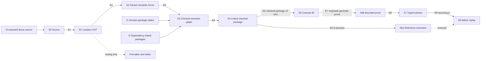
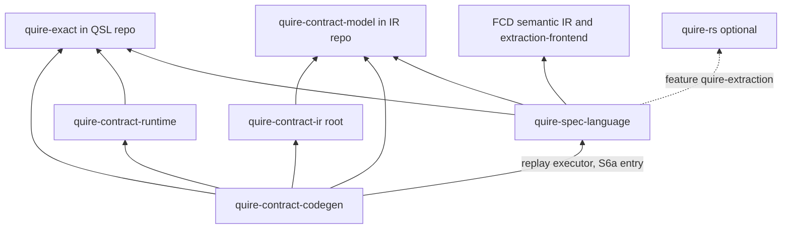

# ADR-011: QSL stage DAG and crate/module dependency architecture (ARCH-10)

## Status

Proposed, 2026-09-19. Owning ticket: agent-ix/quire-spec-language#209 (ARCH-10),
epic #205, Layer 1. Acceptance is tested by the change-scenario gate #212.
Supersedes nothing.

## Context

#209 asks for the legal compilation and execution stages of QSL V1, what each
stage edge preserves, the refusal and bypass rules, CLI orchestration, and the
target crate and module dependency graph with extraction criteria.

Inputs, used as given and not reopened:

- **ADR-010** (observed baseline). Its §2 and §3 are the current stages and
  dependencies. Its §9 routes 19 findings to #209: OBS-001, 002, 007, 008, 009,
  010, 011, 015, 016, 028, 029, 030, 031, 036, 037, 038, 039, 040 and 041. It
  also names #209 as a secondary owner of OBS-005, OBS-017 and OBS-034. This
  record cites ADR-010 items as `ADR-010 OBS-nnn` and lanes and stages as
  `ADR-010 A4`, `ADR-010 lane B` and so on.
- **QSpec AD-016** (accepted, `agent-ix/quire-specification`
  `spec/assurance/AD-016-semantic-family-extension-path.md`). Its seven arrows,
  crate graph, replay ownership, Shared-type strategy, `heads/` workspace and
  six owner decisions are binding. This record places the QSL-internal stages
  and modules around those arrows. Where AD-016 marks a cell `OPEN — decided in
  WP<n>`, this record leaves it open unless the cell is a QSL-internal module
  placement, which #209 owns.
- **Sibling Layer 1 tickets.** #210 decides family extension contracts,
  dispatch and capability selection. #211 decides canonical types, identities,
  conversions and versions. #229 decides the capability vocabulary. This
  record names the question it hands to each one and decides none of them.
- **RT #53.** No Kani harness reaches RT `src/exact/`. The RT proof gate
  compiles 11,519 lines of it and discharges zero propositions over them. This
  is the same instrument-honesty defect as ADR-010 OBS-028.
- **IR #140.** IR FR-031's Behavior sentence and FR-031-AC-3 name native
  `runtime::execute` as the replay executor, which AD-016 arrow 7 rules out.
  IR PR #138 rewrites FR-031's Status section only. IR #140 amends the
  Behavior sentence and AC-3 and removes `replay_with_native_runtime`.

Terms used below:

- **Stage**: a step with one owner, one admitted input type and one output
  type. Stages are `S0`…`S8` (§1).
- **Edge**: a legal handoff between two stages (`E1`…`E9`, §2).
- **Seam**: a module or dependency that exists today, maps to no target stage,
  and has a named retirement change (§6.2).
- **Checked**: produced by the S3 check stage. Nothing else constructs a value
  of a checked type.
- **Reference semantics**: the QSL evaluator whose result defines what a
  checked package means. #205 assigns reference semantics to QSL.

## Decision

1. The stage DAG in §1 is the only legal compilation and execution flow for QSL
   V1. Every QSL module and every QSL cross-repository dependency maps to one
   stage, to a foundation layer, or to a seam with a named retirement change
   (§6).
2. Every edge carries the typed contract in §2: admitted types, owner, what it
   preserves, and whether partial output may escape.
3. The bypasses in §3 are forbidden. A test that exercises a forbidden bypass
   is evidence of a defect, not of a feature.
4. Checking precedes all executable lowering (§4). No public type is shared
   between an unchecked and a checked object.
5. CLI commands orchestrate stage APIs and return structured outcomes (§5).
6. The module DAG in §6 and the crate DAG in §7 are the target dependency
   architecture. Crate extraction follows the criteria in §7.2. The only crate
   extraction this record approves is `quire-exact`, which AD-016 Owner
   decision 2 already accepted.
7. The four observed lanes converge or retire as §8 states.
8. A proof gate passes only when it discharges at least one proposition over
   every module it claims (§2.3).
9. Compatibility disposition for every change in this record is **none**. QSL
   is prerelease, and each replaced path is removed in the change that lands
   its successor.
10. The ADR-010 findings routed to #209 are decided as §9 states.

## 1. Stage DAG

| Stage | Output role | Owner repository and module | AD-016 arrow |
|---|---|---|---|
| S0 Source | Source bytes with `SourceIdentity` and revision | QSL `source` | none |
| S1 Lossless CST | Exact, recovering concrete syntax tree | QSL `cst` (today `complete::cst`, `complete::parser`, `complete::grammar`) | none |
| S2 Parsed semantic forms | Unchecked syntactic forms per family, each with a span. No semantic identity. | QSL `forms` (today absent: ADR-010 X4) | arrow 1 input ("Source AST") |
| S3 Checked semantic graph | Checked nodes with minted node ids and declaration identities, resolved against admitted domain packages and dependency packages | QSL `check` (today `value::expression` check, `model`, `value::library`) | arrow 1 output |
| S4 Linked checked package | The checked graph closed over its dependency identities, with package identity and source map. Two forms: in-process, and `quire.checked-package/v2` wire. | QSL `package` | arrow 2 producer |
| S5 Contract IR | Target-neutral IR nodes read from the v2 wire | IR `quire-contract-model` (`CheckedPackageV2::read`, `::lower`) | arrow 2 consumer |
| S6a Reference execution | `Outcome` of evaluating a checked package: completed, undefined, refused or incomplete | QSL `evaluate` (today `value::expression` evaluate and `CheckedPackage::call`) over the `quire-exact` kernel | arrow 7 executor |
| S6b Bounded proof | Per-item negotiation disposition, then one IR `KaniOutcome` per supported item | CG (`negotiate_*`, oracle, `kani_obligations`), RT ops and host ABI, IR `src/kani` outcome | arrows 3 to 6 |
| S7 Typed witness | `CounterexamplePacket` with a typed `Witness` | IR `src/kani` (packet and witness types) | arrow 6 output |
| S8 Native replay | Parity verdict: the S6a result under the reconstructed input, compared with the S6b result | CG replay adapter (reconstruction and comparator), QSL S6a (executor) | arrow 7 |

Side inputs:

| Input | Enters | Owner | Rule |
|---|---|---|---|
| I1 Domain-package intake | S3 | QSL `model::intake`, the only FCD ↔ QSL translation point (AD-016) | Intake admits FCD Semantic IR bytes into an admitted `DomainPackage` before any check reads it. A caller-constructed `DomainPackage` is test-support only. |
| I2 Dependency packages | S3 | QSL `package` (reader) | A QSL package that another package imports enters S3 as an S4 linked package. Its identity is verified when it is read. Its declarations are never re-checked from its source. |
| I3 Extracted fence source | S0 | QSL `source` intake adapter over quire-rs extraction (feature `quire-extraction`) | Extraction yields S0 bytes plus a document `SourceMap`. It enters the same S1 parser as any other source. |

Stage order resolves ADR-010 OBS-009 as follows. Name and model binding
(ADR-010 A4 "link", and lanes B2 to B4) is a phase inside S3, not a stage
before it. S4 "linked" means closure over dependency *package identities*,
which happens after checking. No stage after S3 re-resolves a name.

## 2. Edge contracts

### 2.1 Admitted types and owners

Type names in this table are roles. #211 decides the canonical type names,
their typestate encoding and their invariants.

| Edge | From → to | Admitted input | Output | Edge owner |
|---|---|---|---|---|
| E1 | S0 → S1 | Source bytes, `SourceIdentity`, limits | Lossless CST | QSL `cst` |
| E2 | S1 → S2 | A CST with no error or recovery node | Parsed forms | QSL `forms`; family form builders from #210 |
| E3 | S2 → S3 | Parsed forms, admitted domain packages (I1), dependency linked packages (I2), library lock | Checked semantic graph | QSL `check`; family checkers from #210 |
| E4 | S3 → S4 | Checked semantic graph | Linked checked package (in-process), and v2 bytes on request | QSL `package` |
| E5 | S4 → S5 | `quire.checked-package/v2` bytes only | IR `CheckedPackageV2`, then IR nodes | IR reader. The wire contract is QSpec's. |
| E6 | S4 → S6a | In-process linked checked package, typed arguments, object environment, `Meter` | `Evaluation` / `Outcome` | QSL `evaluate` |
| E7 | S5 → S6b | IR nodes with `capability_report`, bounds | `ObligationRecord` per requested item. For `supported` items: oracle, harness and one `KaniOutcome`. | CG, with RT ops and IR outcome (AD-016 arrows 3 to 6) |
| E8 | S6b → S7 | Kani run of a `supported` item | `CounterexamplePacket{witness: Option<Witness>}` | IR |
| E9 | S7 → S8 | Packet, `KaniObligationIdentity.arguments`, the S4 package of the same identity | Parity verdict | CG replay adapter, calling the S6a executor |

### 2.2 What each edge preserves

Columns:

- **Syntax** is trivia, layout and token text.
- **Provenance** is byte spans in the original source.
- **Identity** is semantic node and declaration identity.
- **Version** is edition, package identity and digest, and wire or schema
  version.
- **Proof metadata** is bounds, extents, the capability report, obligation
  identity and tool pins.

"Minted" means the edge creates the item. "Carried" means it passes the item
through unchanged and never re-derives it. "Dropped" means the edge discards it
by design, and no later stage may recover it.

| Edge | Syntax | Provenance | Identity | Version | Proof metadata |
|---|---|---|---|---|---|
| E1 | Minted, lossless | Minted: spans against `SourceIdentity` and revision; I3 adds the document `SourceMap` | none | Edition read from source | none |
| E2 | Dropped | Carried: each form holds the span of its CST node | none: forms carry position only | Edition carried | Declared bounds and extents carried as syntax |
| E3 | none | Carried: QSL, the only span minter, keys the source map by checked node id | **Minted**: checked node id and declaration identity. The scheme is decided in #211. | Dependency and domain-package identities resolved and recorded | Bounds and extents typed. The capability report is recorded without negotiation; #210 decides its content. |
| E4 | none | Carried: source map by node id, in the package | Carried verbatim | **Minted**: package identity and digest, v2 schema version | Carried as v2 `bounded_domain`, `model_population` and `capability_report` |
| E5 | none | Carried as `CheckedSourceMapEntry`, never re-minted | Carried read-only as `CheckedNodeId` and `CheckedDomainPackageRef` | Checked: an unsupported v2 contract version refuses | Carried; `requires-bound` derived once from the IR table |
| E6 | none | Carried: `Evaluation.location` from the node id | Carried | Package identity bound to the evaluation | none |
| E7 | none | CG tags from node ids | Obligation id = clause node id | Kani tool pin and runtime revision become part of the evidence identity | **Minted**: disposition per `request_index`, obligation identity with its per-argument bound subset |
| E8 | none | none: resolved at E9 | Obligation id, harness symbol | Tool pin carried | Bound subset carried; `proved` qualifies only over it |
| E9 | none | Resolved: node id → nested span through the v2 source map | Obligation id, node id | Package identity of the replayed package equals the proved package | Same finite domain as the harness |

Consequence: S1 is the only stage that holds syntax. After E2, nothing reads
source text or CST to recover meaning (§3 FB-01).

### 2.3 Refusals and partial output

Every stage returns a structured result: its output, or a refusal with typed
causes and catalog codes. #211 decides the canonical outcome and refusal
types. The rules below decide only what may cross an edge.

| Edge | On error | May partial output escape? |
|---|---|---|
| E1 | A CST with error or recovery nodes and its diagnostics | **Only to tooling.** The formatter and editor (`complete::editor`, `complete::edit`) may consume a recovering CST. E2 refuses a CST that has any error or recovery node. |
| E2 | Refusal with diagnostics | No. A form is built from a complete CST or not at all. |
| E3 | Refusal with every error diagnostic; warnings travel with a success | No. A package with an error diagnostic yields no checked graph (AD-016 arrow 1). |
| E4 | Refusal | No. No package, and no v2 bytes. |
| E5 | IR `CheckedPackageRefusalCode` | No. A refused package yields no IR package (AD-016 arrow 2). |
| E6 | `Outcome::Refused`, `Undefined` or `Incomplete`; `InputRefusal` for bad arguments | `Incomplete` is a typed outcome that says a budget ran out. It is never read as `Completed`. |
| E7 | Per item: `requires-bound`, `unsupported` (warned) or `invalid-request` | **Per item only.** Each requested item settles exactly one terminal record (AD-016 terminal-disposition rule). An item not settled `supported` produces no oracle, harness or packet. Other items proceed. |
| E8 | `KaniOutcomeKind` other than `Counterexample` | No packet without a counterexample, and no placeholder witness |
| E9 | `Witness::parse` or `decode` refusal; disagreement → `inconclusive` with a typed cause | No verdict is synthesized for a refused decode, and a disagreement is never repaired |

**Proof-stage acceptance (S6b; RT #53, ADR-010 OBS-028).** A proof gate is
evidence for exactly the modules it claims. For each claimed module, the gate
passes only if both of these hold:

1. The prover transcript shows at least one discharged check location inside
   that module.
2. At least one mutation control injected inside that module turns the gate
   red.

A gate that compiles a module under the prover but reaches no proposition in
it reports that module as `unreached`, and the gate fails. This rule binds the
RT `make kani` gate (RT #53), the CG generated-harness gates (CG #58, #59, #60
and #73) and the #217 and #219 proof-spine gates. A stubbed executor, a
predetermined verdict or a build-only run is never proof evidence (#205
Non-goals).

## 3. Forbidden bypasses

| ID | Forbidden | Why | Observed today |
|---|---|---|---|
| FB-01 | Any stage after S1 reads source text, CST, token text or display strings to recover semantics | S3 is the only semantic authority. Later stages carry its identities (§2.2). | none known |
| FB-02 | Any consumer branches on diagnostic message text, `Display` output or rendered codes instead of the typed cause | Diagnostics are output for people, not a channel between stages | none known |
| FB-03 | Wire-admitted data reaches an S6a evaluator, the S4 emitter or a backend as if it were checked, without a verified binding to a checked producer | A wire reader proves shape, not a source compile | `protocol_artifact::read` feeding `state` and `temporal` (ADR-010 OBS-015); checked-predicate and temporal-subject handoffs to IR (OBS-037) |
| FB-04 | Lowering, execution or proof from an S2 form or any unchecked object | Checking precedes all executable lowering (§4) | none on the spine |
| FB-05 | A backend repository (IR, RT, CG) depends on QSL Rust types, except the CG replay adapter's normal dependency on the QSL S6a entry (AD-016 Owner decision 5) | IR reads the v2 wire only (AD-016 Decisions) | IR root → QSL f1700a9 (OBS-029) |
| FB-06 | S3 calls a backend crate to decide a semantic question such as definedness | The backend would become a second language authority | QSL checking, composed proofs and lowering call IR `DeclarationEnvironment::check_expression` (OBS-010) |
| FB-07 | Replay through any executor other than S6a, or replay evidence from an injected stub executor | AD-016 arrow 7 | IR `replay_with_native_runtime` → `runtime::execute`; stubbed CG and IR replay executors (OBS-028) |
| FB-08 | A witness typed by any means other than IR `Witness::parse` and `decode` | AD-016 arrow 7: `decode` is the only typing step | IT-010 splits Kani stdout into an `i64` (OBS-002) |
| FB-09 | A CLI command makes a semantic decision, or reads diagnostic text | §5 | none known |
| FB-10 | A proof gate claims a module over which it discharges no proposition | §2.3 | RT `src/exact/` (RT #53) |
| FB-11 | A dependency or test-time edge that closes a cycle between QSL, IR, RT and CG | §7.1 | QSL ⇄ CG and QSL ⇄ RT test-time cycles (OBS-040) |
| FB-12 | Capability negotiation in S3 | AD-016: QSL admission negotiates nothing. #210 owns the capability-selection contract. | composed `requests::report` (ADR-010 OBS-003, a #210 item) |

## 4. Checking precedes lowering

- S5, S6a and S6b admit only S4 outputs, and S4 admits only S3 outputs. There
  is no path from S2 to S5, S6a or S6b.
- Each stage's output is a distinct public type. The constructors of S3 and S4
  output types are private to their stage modules, so no other module can
  build a checked value. An S4 reader (I2) re-establishes the checked state
  only by verifying the package identity it reads. #211 decides the typestate
  encoding and the verification rule.
- Exactly one type carries each stage output. Two public types named
  `CheckedPackage` with different meanings (ADR-010 OBS-017, DA-04) break
  this rule. The native-v1 type retires with seam SEAM-1 (§6.2), and #211
  decides the canonical name.
- A value that fails a stage keeps the previous stage's type. It is never
  wrapped as the next stage's type in a failed state.

## 5. CLI and library orchestration

- `command` calls stage APIs in DAG order and makes no semantic decision. It
  contains no parsing, name resolution, typing, definedness, capability or
  evaluation logic.
- Each command returns a structured command outcome. The outcome holds the
  last stage reached, the terminal outcome kind, diagnostics with typed causes
  and catalog codes, and the identities of the artifacts it produced. #211
  decides the outcome kind vocabulary.
- One total, exhaustive map turns an outcome kind into a process exit code. It
  has no `_` arm. Text and JSON rendering is a separate step over the
  structured outcome, and no command logic depends on it.
- A library caller gets the same stage APIs and the same outcome. No behavior
  is reachable only through the CLI.
- Lifecycle surfaces (package cache, providers, plugins, AOT and JIT) are
  #225's design. They call the same stage APIs and may not bypass §3.

## 6. Module DAG

### 6.1 Target layers

A module may depend only on modules in lower layers, or on modules in its own
layer that are listed as lower in the "Depends on" column. The result is
acyclic. An architecture check enforces it; #226 owns that drift gate.

| Layer | Module | Stage | Depends on |
|---|---|---|---|
| K | `quire-exact` crate (kernel values, types, outcomes, refusals, node key, location, accounting) | foundation | none in the ecosystem |
| F | `diagnostic`, `digest`, `wire_format`, `located_json`, `json_number`, `serde_object`, `source` (with `source_map`) | foundation | K |
| 1 | `lexer`, `token`, `cst` | S1 | F |
| 2 | `forms` | S2 | 1, F |
| 3 | `model` (with `model::intake`), `library`, then `check` | S3, I1 | 2, F, K. `check` depends on `model`, and `model` never depends on `check`. |
| 4 | `package` | S4, I2 | 3, F, K; `quire-contract-model` for v2 wire constants and round-trip tests only |
| 5 | `evaluate`, family evaluators (state, temporal), `simulation` | S6a | 4, 3, K |
| 6 | `command`, `cli`, `main` | orchestration | every lower layer |
| tool | `complete::editor`, `complete::edit`, `format` | tooling over S1 | 1, F |

Rules that close the ADR-010 OBS-016 cycles:

- **`diagnostic` is foundation.** It holds codes, typed causes and a
  foundation-level locus. It does not embed `linking`, `runtime` or IR types.
  A stage converts its own location into the foundation locus when it emits a
  diagnostic. This breaks SCC S1 and its two-cycles diagnostic↔linking,
  diagnostic↔runtime and diagnostic↔source. #211 decides the locus type
  (DA-13).
- **`model` sits below `check`.** Kernel types move to `quire-exact`, so
  `model` depends on K and never on `value` or `check`. This breaks SCC S2.
- **`temporal` evaluation sits below orchestration and never imports a wire
  module.** Wire emission and reading live in S4 `package`, and temporal
  evaluation lives in S6a. This breaks SCC S3.
- **`check` never imports `quire-contract-model`.** This resolves OBS-010.

### 6.2 Current module map

Each current module (`QSL:lib.rs:13-44`, ADR-010 §3.1) maps to a target module
or to a seam. A seam carries its retirement change. Retirement means removal
in one change, with no compatibility disposition.

Seams:

| Seam | Contents | Retires when | Owning change |
|---|---|---|---|
| SEAM-1 native-v1 | ADR-010 lane A: arena `syntax` and native `parser`, native `linking`, native `checking`, `formal_source`, `native_model`, `model_source`, `package::NativePackage`, `lowering` and its three targets, `runtime`, `mapped`, the native half of `command` | The spine (S0 to S6a) serves `run` and `compile`, and backend output uses v2. SEAM-1 is removed before gate #216 passes (#205 Layer 2: "No deprecated producer path remains reachable"). | #216 gate precondition; lowering-target removal with #217 |
| SEAM-2 composed | ADR-010 lane B: `syntax::composed`, `parser::composed`, `linking::composed`, `checking::composed` | Its binding and type-admission rules are rehomed as S3 family checkers through #210 contracts. `requests` backend disposition moves out of QSL (FB-12). | #214 and the family tickets #220, #221 and #223 |
| SEAM-3 protocol wires | `protocol_artifact` (compiled-protocol /1 to /3 emit and read; checked-predicate, temporal-subject and native-temporal handoffs) | Emission moves to S4 from the checked graph. Reading feeds no evaluator or backend without the FB-03 binding. Whether these formats remain as separate wires is decided in #211. | #223 (protocol and frame), #218 (frames through the proof spine) |
| SEAM-4 IT-010 | `tests/configversion_backends.rs` proof and replay path, QSL dev dependencies on CG 5e2a6a9 and IR 04eb6f8, and the RT test fixture crate | The CG replay adapter replays through S6a with a typed witness (#217). | #217 |
| SEAM-5 source graph | `complete::package::lower_source_graph` / `LoweredSourceGraph` (ADR-010 C3) | The S2 `forms` producer lands and replaces it | #214 |

Module table:

| Current module | Target | Notes |
|---|---|---|
| `source`, `source_map` | F `source` | S0; `source_map` gains node-id keying (AD-016; DA-13 in #211) |
| `diagnostic` | F `diagnostic` | loses its linking, runtime and IR fields (§6.1) |
| `digest`, `wire_format`, `located_json`, `json_number`, `serde_object` | F | unchanged role |
| `lexer`, `token` | 1 | shared by S1 |
| `complete` (`cst`, `parser`, `grammar`, `diagnostic`) | 1 `cst` | S1 |
| `complete::editor`, `complete::edit` | tool | the only consumers of a recovering CST |
| `complete::package` (resolution) | 3 `library` / I2 | resolution of imports against linked packages; `lower_source_graph` is SEAM-5 |
| `format` | tool | re-targets from the arena to the CST when SEAM-1 retires |
| `syntax`, `parser` | SEAM-1 (native) and SEAM-2 (`composed`) | S2 `forms` replaces them |
| `linking` | SEAM-1 and SEAM-2 | name binding becomes an S3 phase |
| `checking` | SEAM-1 and SEAM-2 | |
| `formal_source`, `native_model`, `model_source`, `mapped`, `lowering`, `runtime` | SEAM-1 | `runtime::execute` is not a replay target (AD-016) |
| `quire_source` | I3 | the extraction adapter stays at S0; its call into `mapped` retires with SEAM-1 |
| `package` | 4 `package` | `NativePackage` is SEAM-1; the v2 emitter is S4 (ADR-010 OBS-001) |
| `value` (kernel: `composite`, `integer`, `rational`, `decimal`, `ieee`, `text`, `outcome`, `accounting`, `node` and the other value operations) | K `quire-exact` | the AD-016 Owner decision 2 kernel row; #211 decides the exact type list against AD-016 |
| `value::expression` (check) | 3 `check` | |
| `value::expression` (evaluate, `CheckedPackage::call`) | 5 `evaluate` | S6a and the replay executor |
| `value::library`, `value::package_identity`, `value::model_query` | 3 `library`, 4 `package`, 3 `model` | |
| `value::division::negotiate_*`, `value::ieee::negotiate_*` | outside QSL | AD-016 arrow 3 and 4 placement; #210 decides the predicate list (OBS-004) |
| `model` | 3 `model` | `model::intake` is I1 |
| `state`, `temporal` | 5 family evaluators | they consume checked forms only (FB-03) |
| `protocol_artifact` | SEAM-3 | |
| `simulation` | 5 `simulation` | finite exploration engine for S6a; its implementer arrives through #220 |
| `command`, `cli`, `main` | 6 | §5 |
| `xtask`, `tools/fixture-audit` | build tooling | not on the stage DAG, and they depend on no stage module |

## 7. Crate DAG and extraction

### 7.1 Target crate graph

This extends the AD-016 crate graph. An arrow means "depends on". Only normal
dependencies are drawn. Dev and test-time edges obey FB-11.

Differences from today (ADR-010 §3.2), each removed in its owning change:

| Edge | Target | Owning change |
|---|---|---|
| IR root → QSL (normal and dev, f1700a9) | **Removed.** IR predicate and temporal admission read v2 forms. #210 decides the family forms, and the wire is QSpec's. | #218 and #223, with IR #109 |
| QSL → CG (dev), QSL → IR historical (dev) | **Removed** with SEAM-4 | #217 |
| QSL tests → RT (fixture crate, IT-010 generated crates) | **Removed** with SEAM-1 and SEAM-4 | #216, #217 |
| RT `qsl-agreement` → QSL (dev) | **Removed.** The agreement suite is retargeted to `quire-exact` against QSpec vectors (AD-016). | RT, after `quire-exact` lands |
| CG → QSL (dev, 21c507e) | **Becomes normal** (AD-016 Owner decision 5) | #217 (AD-016 WP9) |
| QSL → FCD | **Admitted** (AD-016). Only `model::intake` imports FCD crates. | QSL PR #200 |
| QSL → `quire-exact`, RT → `quire-exact`, CG → `quire-exact` | **New** | #213 (AD-016 WP5a and WP5b) |

Rules:

- No cycle exists over normal, dev or test-time edges between QSL, IR, RT and
  CG. Cross-repository end-to-end evidence lives in the downstream-most crate
  that already depends on every stage it exercises (CG for proof and replay),
  or in the QI `heads/` workspace for drift.
- The QSL lock resolves exactly one revision per quire-ecosystem crate. This
  matches AD-016 heads drift check 6.
- A dependency needed only by tests is a dev dependency.

### 7.2 Extraction criteria

A module becomes its own crate only when all four of these hold. Size alone
never justifies a crate.

1. **Stable responsibility.** It owns one stage or one foundation concern, with
   an accepted contract (this record, AD-016, or a #210 or #211 decision).
2. **Narrow API.** Its public surface can be listed in full: the stage input
   and output types, their refusals, and the operations over them.
3. **Acyclic direction.** Its dependencies are strictly lower layers (§6.1),
   and none of its consumers is imported back.
4. **Consumer need.** A second crate consumes it, or it needs a build profile
   the host crate cannot give it (`no_std`, Kani, a footprint build).

### 7.3 Proposed extractions and module moves

| ID | Change | Direction | Public API | Order | Compatibility disposition |
|---|---|---|---|---|---|
| X-1 | Extract crate `quire-exact` (AD-016 Owner decision 2) | Leaf. QSL, RT and CG depend on it. | The kernel types in the AD-016 Shared-type row and the scalar and collection operations over them | 1st (#213) | none: the QSL `value` kernel and the RT `src/exact` kernel parts are replaced in one change per repository |
| M-1 | Make `diagnostic` a foundation module | F, depending on K only | codes, typed causes, locus | 2nd (#213) | none |
| M-2 | Move `model` below `check` | 3, depending on K and F only | `model`, `model::intake` | after X-1 | none |
| M-3 | Add S2 `forms` and retire SEAM-5 | 2 | parsed form types per family (#210) | #214 | none: `LoweredSourceGraph` is deleted in the same change |
| M-4 | Add the S4 v2 emitter in `package` (ADR-010 OBS-001) | 4 | linked package → v2 bytes | #216 | none |
| M-5 | Split `value::expression` into S3 `check` and S5 `evaluate` | 3 and 5 | check entry; `evaluate` and the S6a `call` entry | #214 | none |
| M-6 | Retire SEAM-1 | none | removed | before #216 passes | none |

No other crate extraction is approved. `protocol_artifact`, `value` and `model`
are the largest modules. They stay modules until they meet §7.2.

## 8. Lane convergence

| Lane (ADR-010) | Disposition |
|---|---|
| A native-v1 | **Retires** as SEAM-1. It admits no new families (AD-016 arrow 1). |
| B composed | **Converges.** B1 → S1 and S2. B2 to B4 → S3 binding phase. B5 → leaves QSL (FB-12, #210). B6 and B7 → S3 family checkers. B8 and B9 → S4 and SEAM-3. B10 → S6a family evaluators. |
| C complete-V1 | **The spine.** C1 → S1. C2 → I2 and `library`. C3 → replaced by S2 (M-3). C4 → S3. C5 → S6a. C6 → S3 `model`. C7 → `library`. |
| D simulation | **Converges** into S6a as the finite exploration engine. It gains an implementer only through a family evaluator (#220). |

## 9. ADR-010 findings decided

| Item | Decision |
|---|---|
| OBS-001 | S4 `package` owns the checked-package/v2 emitter (M-4). It is the only QSL → IR path. |
| OBS-002 | IT-010's proof path is SEAM-4. The CG replay adapter replaces it in #217 (FB-07, FB-08). |
| OBS-007 | S2 `forms` is the only producer of checked-stage input from source. `LoweredSourceGraph` retires (SEAM-5, M-3). |
| OBS-008 | One spine (lane C). Lane A retires, lane B converges, lane D joins S6a (§8). |
| OBS-009 | Name and model binding is a phase of S3. "Linked" means S4 closure over package identities (§1). |
| OBS-010 | S3 decides definedness itself. `check` never imports `quire-contract-model` (FB-06, §6.1). |
| OBS-011 | The composed lane gets no lowering of its own. Its families reach IR through S4 v2 (§8). |
| OBS-015 | Forbidden bypass FB-03. Evaluators take checked input only. |
| OBS-016 | Target layers in §6.1 are acyclic. `diagnostic` is foundation, `model` is below `check`, and wire modules are not imported by `temporal`. |
| OBS-028 | IR holds the packet and witness only. CG reconstructs. QSL S6a executes. A stubbed executor is not evidence (FB-07, §2.3). |
| OBS-029 | The IR root → QSL edge is removed (§7.1, FB-05). |
| OBS-030 | `CheckedPackage::call` is the S6a entry. The CG replay adapter wires it in #217. |
| OBS-031 | QI owns the current-head `heads/` workspace (AD-016). #215 implements it. The pin-versus-head rule is a #211 secondary. |
| OBS-036 | The replay executor is QSL S6a (`value::expression::CheckedPackage::call`, AD-016 arrow 7). IR #140 amends FR-031 Behavior and AC-3 and removes `replay_with_native_runtime`. |
| OBS-037 | Forbidden bypass FB-03. The handoffs derive from the checked graph at S4 (SEAM-3). |
| OBS-038 | QSL owns reference semantics and the replay executor. RT owns runtime ops and the host ABI that generated code calls. No native replay surface belongs in IR. |
| OBS-039 | Consistent once read as above: #205 gives reference semantics to QSL, and AD-016 arrow 7 names the executor. RT holds no replay executor. |
| OBS-040 | FB-11. QSL tests depend on QSpec vectors and QSL crates only. Cross-repository end-to-end tests live in CG or QI `heads/` (§7.1). |
| OBS-041 | The QSL → FCD edge is admitted, confined to `model::intake`. One revision per quire crate in the lock. A test-only crate stays a dev dependency. PR #200 meets these before merge. |
| OBS-005 (secondary) | `quire-exact` exists as a leaf crate in the QSL repo (X-1). The primary decision is #211's. |
| OBS-017 (secondary) | One public type per stage output (§4). #211 names it. |
| OBS-034 (secondary) | Direction per §7.1. #211 owns pin representation. |

## 10. Change scenarios

Each row names the stages and modules a change touches. It is a placement, not
an implementation plan. #212 re-walks all seven against the combined Layer 1
architecture.

| # | Change | Stages and edges | QSL modules | Other repositories | Must not |
|---|---|---|---|---|---|
| 1 | Exact scalar operator | S2 form, S3 check, S4 v2 arm, S6a kernel operation, E7 CG render arm | `forms`, `check`, `package`, `quire-exact` | IR `Operator` row, CG render arm, QSpec vector (AD-016 scenario 1) | evaluate in `command`; add a `negotiate_*` in QSL |
| 2 | New semantic form (for example sum type and exhaustive case) | S2 builder, S3 family checker, S4 v2 node, S6a evaluator, E7 when a backend supports it | `forms`, `check`, `package`, `evaluate` | QSpec wire (v2 node), IR reader row, CG arm when supported | edit unrelated families; dispatch on strings. #210 decides the family contract. |
| 3 | Model-bound construct | I1 intake, S3 `model`, S4 `model_population` | `model::intake`, `model` | FCD emitter (AD-016 scenario 5) | read FCD types outside `model::intake`; re-derive the bound after S4 |
| 4 | Scoped protocol clause (frame or scoped anchor) | S2, S3 clause checker, S4 v2 clause and frame node, E7 frame obligation (`unsupported` until IR #109) | `forms`, `check`, `package` | IR `ClauseKind` and frame lowering, RT observation kind, CG harness (AD-016 scenarios 2 and 7) | emit through `protocol_artifact` without S3 (FB-03) |
| 5 | Temporal operator | S2, S3 temporal checker, S4 v2 temporal form, S6a temporal evaluator | `forms`, `check`, `package`, temporal evaluator | IR temporal admission from v2 (not QSL types, FB-05) | import a wire module from `temporal`. #210 and #222 decide boundedness. |
| 6 | Unbounded request | S3 records the extent. S4 carries it. E7 settles `requires-bound` or `unsupported` with no oracle or harness. | `check`, `package` | IR `requires-bound` row (AD-016 scenario 4) | narrow the domain silently; report `proved` for an unbounded claim |
| 7 | New backend | E7 only: consumes S5 IR, settles dispositions, emits artifacts, returns typed outcomes. If it replays, it replays through S6a via E9. | none | the backend repository; QSpec for any new wire | parse QSL; depend on QSL types other than the S6a entry; mint spans or identities (FB-01, FB-05) |

## Questions handed to sibling tickets

To #210:

- The per-stage family hooks at S2 (form builder), S3 (checker), S4 (v2
  emission arm) and S6a (evaluator), and how a missing hook fails.
- What S3 records in `capability_report`, now that composed `requests`
  disposition leaves QSL (FB-12).
- The v2 family forms that replace the IR predicate and temporal admission of
  QSL types (§7.1 IR root → QSL removal).

To #211:

- The typestate encoding and names for S2, S3 and S4 outputs, and the rule by
  which an I2 reader re-establishes the checked state from a package identity
  (§4).
- The structured outcome and refusal types that every stage returns, and the
  command outcome kind vocabulary (§2.3, §5).
- The foundation `diagnostic` locus type (§6.1, DA-13).
- Whether compiled-protocol /1 to /3 and the checked handoff formats remain
  separate wires or are replaced by v2 forms (SEAM-3).
- The exact `quire-exact` type list, reconciled with AD-016's Shared-type row
  (X-1).

## Consequences

- Every module has a stage, a foundation layer or a seam with an owning
  retirement change. A module that meets none of these is a defect that #226's
  architecture-drift gate reports.
- Gate #216 cannot pass while SEAM-1 is reachable. The CLI therefore moves to
  the spine within Layer 2, not in Layer 5.
- IR and CG lose their typed access to QSL except the S6a entry. IR's predicate
  and temporal projections depend on v2 forms that #210 and QSpec define.
- The RT and CG proof gates gain an unreached-module failure (§2.3). RT's gate
  stays red until RT #53 adds a harness and a mutation control in `src/exact/`.
- Until #217 lands, IT-010 remains the only proof-and-replay test and does not
  count as proof evidence.

## Alternatives Considered

- **Keep link before check as separate stages.** Rejected. A separate link
  stage before checking would publish a "linked" type that is not yet checked,
  which is the ambiguous-typestate case §4 forbids. It would also split name
  resolution from the checker that relies on it.
- **Reference execution consumes Contract IR (S5) instead of the linked
  package.** Rejected. The executor would then depend on a backend
  representation to define QSL semantics, and AD-016 arrow 7 names the QSL
  complete-V1 entry.
- **Give RT the replay executor, reading #205 literally.** Rejected. RT holds
  no reference semantics, and AD-016 arrow 7 and Owner decision 3 place the
  executor in QSL.
- **Split crates along the largest modules (`protocol_artifact`, `value`,
  `model`).** Rejected by §7.2 and the #205 non-goal on size-only splits.
- **Keep native-v1 as a permanent second lane for the CLI.** Rejected. It would
  keep a second checked type and a second type system (ADR-010 OBS-017,
  OBS-019), and #205's Layer 2 gate forbids deprecated producer paths.
