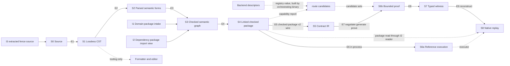

# ADR-011: QSL stage DAG and crate/module dependency architecture (ARCH-10)

## Status

Proposed, 2026-09-19. Owning ticket: agent-ix/quire-spec-language#209 (ARCH-10),
epic #205, Layer 1. Acceptance is tested by the change-scenario gate #212.
Supersedes nothing.

## Context

#209 asks for the legal compilation and execution stages of QSL V1, what each
stage edge preserves, the refusal and bypass rules, CLI orchestration, and the
target crate and module dependency graph with extraction criteria.

Inputs, used as given and not reopened:

- **ADR-010** (observed baseline). Its §2 and §3 are the current stages and
  dependencies. Its §9 routes 19 findings to #209: OBS-001, 002, 007, 008, 009,
  010, 011, 015, 016, 028, 029, 030, 031, 036, 037, 038, 039, 040 and 041. It
  also names #209 as a secondary owner of OBS-005, OBS-017 and OBS-034. This
  record cites ADR-010 items as `ADR-010 OBS-nnn` and lanes and stages as
  `ADR-010 A4`, `ADR-010 lane B` and so on.
- **QSpec AD-016** (accepted, `agent-ix/quire-specification`
  `spec/assurance/AD-016-semantic-family-extension-path.md`). Its seven arrows,
  crate graph, replay ownership, Shared-type strategy, `heads/` workspace and
  six owner decisions are binding. This record places the QSL-internal stages
  and modules around those arrows. Where AD-016 marks a cell `OPEN — decided in
  WP<n>`, this record leaves it open unless the cell is a QSL-internal module
  placement, which #209 owns. AD-016 records four types named
  `CheckedPackage`, and its Owner decision 6 defers renaming them.
- **Sibling Layer 1 tickets.** #210 decides family extension contracts,
  dispatch and capability selection. #211 decides canonical types, identities,
  conversions and versions. #229 aligns QSL's `Capability` specification with the #134 vocabulary (QSpec
  #134 widens FR-290). ADR-012 (#210, QSL PR #234) is the family-contract
  record this one pairs with. #225
  decides lifecycle and CLI orchestration. This record names the question it
  hands to each one and decides none of them.
- **RT #53.** At RT d97bc0b (origin/main, 2026-09-18) no Kani harness reaches
  RT `src/exact/`. The RT proof gate compiles 11,519 lines of it and discharges
  zero propositions over them: the code compiled under Kani and the obligation
  count did not move. This is the same instrument-honesty defect as ADR-010
  OBS-028.
- **IR #140.** IR FR-031's Behavior sentence and FR-031-AC-3 name native
  `runtime::execute` as the replay executor, which AD-016 arrow 7 rules out.
  IR PR #138 rewrites FR-031's Status section only. IR #140 amends the
  Behavior sentence and AC-3 and removes `replay_with_native_runtime`.
- **Owner ruling, 2026-09-19: skeleton first.** A skeleton build runs in
  parallel with Layers 1 and 2. It carries one Boolean clause from contract to
  Contract IR, to a CG-emitted crate, to a `cargo kani` proof, to an injected
  violation, to a counterexample, and to native replay with the same verdict,
  green in CI. §1.1 places it.

Implementing tickets. This record names them as the changes that realize its
decisions. It does not design their content.

| Ticket | Realizes |
|---|---|
| #222 | Boundedness design: temporal, trace and unbounded-request architecture on the stage edges |
| #213 | Implementation of canonical identity, typestate, outcome, provenance, bound and `Capability` value types that the stage outputs carry |
| #185 | The only capability registry and router: the QSL `route` module (§6.1) |
| #231 | Typed proof-result, witness and replay envelopes on E8 and E9 |
| #214 | The S2 forms producer (M-3) and the check/evaluate split for function application (M-5) |
| #215 | Exact-pin and current-head integration lanes |
| #216 | The single checked-package gate (Layer 2) |
| #217 | The function-application proof and native-replay exemplar: the first widening of the skeleton spine (§1.1) |
| #218 | Frames and scoped clauses through the proof spine |
| #219 | The executable proof, witness and native-replay gate. It verifies §2.3 on the spine. |
| #220, #221, #223 | Family placements: state, model and finite execution; sum and case; protocol, frame, refinement and abstraction relation |
| #225 | Lifecycle and CLI orchestration design (§5) |
| #29, #133 | CLI parse and dispatch; parsing `quire` fences (input I3) |
| #131, #132 | Domain-package and model intake (I1) on the checked path |
| #122 / #232 | Lifecycle and CLI implementation |
| #230 | Bounded lifecycle conformance slice |
| #226 | Architecture-drift gates that enforce §3, §6 and §7 from Layer 5 |
| RT #53 | The RT `src/exact/` proof gate under §2.3, until X-1 moves the kernel |
| IR #140 | Replay executor wording in IR FR-031 and removal of `replay_with_native_runtime` |
| IR #109 | Frame clauses in the Contract IR (scenario 4 only) |

Changes this record needs that have no ticket yet are listed under Owner
questions: M-6 and the skeleton spine, the IR removal of QSL-typed projections,
X-1, M-2, M-4, the RT agreement retarget, the CG generated-harness gate rule,
and the cross-repository direction and lock checks.

Terms used below:

- **Stage**: a step with one owner, one admitted input type and one output
  type. Stages are `S0`…`S8` (§1).
- **Edge**: a legal handoff between two stages (`E1`…`E9`, §2).
- **Seam**: a module or dependency that exists today, maps to no target stage,
  and has a named retirement change (§6.2).
- **Checked**: a value of an S3 or S4 output type. Three producers exist: the
  S3 check stage, the E4 link step in `package`, and the I2 reader, which
  admits a package only through the verified binding in §4. Nothing else
  constructs a value of a checked type.
- **Reference semantics**: the QSL evaluator whose result defines what a
  checked package means. #205 assigns reference semantics to QSL.

## Decision

1. The stage DAG in §1 is the only legal compilation and execution flow for QSL
   V1. Every QSL module and every QSL cross-repository dependency maps to one
   stage, to a foundation or tooling layer, or to a seam with a named
   retirement change (§6).
2. Every edge carries the typed contract in §2: admitted types, owner, what it
   preserves, its limits, and whether partial output may escape.
3. The bypasses in §3 are forbidden. A test that exercises a forbidden bypass
   is evidence of a defect, not of a feature.
4. Checking precedes all executable lowering (§4). No public type is shared
   between an unchecked and a checked object.
5. CLI commands orchestrate stage APIs and return structured outcomes (§5).
6. The module DAG in §6 and the crate DAG in §7 are the target dependency
   architecture. Crate extraction follows the criteria in §7.2. The only crate
   extraction this record approves is `quire-exact`, which AD-016 Owner
   decision 2 already accepted.
7. The four observed lanes converge or retire as §8 states. Every producer
   path other than the spine is removed before gate #216 passes (M-6).
8. A proof gate discharges at least one proposition over the code it claims.
   Compiling the code under the prover is necessary, not sufficient (RT #53).
   Each claimed module also has a mutation control that turns the gate red
   (§2.3).
9. Compatibility disposition for every change in this record is **none**. QSL
   is prerelease, and each replaced path is removed in the change that lands
   its successor.
10. The ADR-010 findings routed to #209 are decided as §9 states.
11. Other records cite this record's local ids as `ADR-011 S3`, `ADR-011 E5`,
    `ADR-011 FB-03`, `ADR-011 SEAM-1`, `ADR-011 X-1` or `ADR-011 M-4`.
12. The skeleton spine (§1.1) is the first end-to-end run of AD-016 arrows 3 to
    7 and is evidence that gate #212 consults. #217 widens it.

## 1. Stage DAG

| Stage | Output role | Owner repository and module | AD-016 arrow |
|---|---|---|---|
| S0 Source | Source bytes with `SourceIdentity` and revision | QSL `source` | none |
| S1 Lossless CST | Exact, recovering concrete syntax tree | QSL `cst` (today `complete::cst`, `complete::parser`, `complete::grammar`) | none |
| S2 Parsed semantic forms | Unchecked syntactic forms per family, each with a span. No semantic identity. | QSL `forms` (today absent: ADR-010 X4) | arrow 1 input ("Source AST") |
| S3 Checked semantic graph | Checked nodes with minted node ids and declaration identities, resolved against admitted domain packages and dependency import views | QSL `check` (today `value::expression` check, `model::checked_dispatch`, `value::library`) over `model` | arrow 1 output |
| S4 Linked checked package | The checked graph closed over its dependency identities, with package identity and source map. Two forms: in-process, and `quire.checked-package/v2` wire. | QSL `package` | arrow 2 producer |
| S5 Contract IR | Target-neutral IR nodes read from the v2 wire | IR `quire-contract-model` (`CheckedPackageV2::read`, `::lower`) | arrow 2 consumer |
| S6a Reference execution | `Outcome` of evaluating a checked package: completed, undefined, refused or incomplete. Deterministic and free of side effects: the same package, arguments, object environment and meter budget give the same outcome. | QSL `value::expression` evaluate and `CheckedPackage::call` (the AD-016 arrow 7 path), over the `quire-exact` kernel | arrow 7 executor |
| S6b Bounded proof | Per-item negotiation disposition, then one IR `KaniOutcome` per supported item | CG (per-item negotiation, oracle, `kani_obligations`), RT ops, host ABI and `negotiate_*` predicates, IR `src/kani` outcome | arrows 3 to 6 |
| S7 Typed witness | `CounterexamplePacket` with a typed `Witness` | IR `src/kani` (packet and witness types) | arrow 6 output |
| S8 Native replay | Parity verdict: the S6a result under the reconstructed input, compared with the S6b result | CG replay adapter (reconstruction and comparator), QSL I2 reader and S6a (executor) | arrow 7 |

Side inputs:

| Input | Enters | Owner | Rule |
|---|---|---|---|
| I1 Domain-package intake | S3 | QSL `model::intake` (QSL PR #200), the only FCD ↔ QSL translation point (AD-016) | Intake admits FCD Semantic IR bytes into an admitted `DomainPackage` before any check reads it. A caller-constructed `DomainPackage` is test-support only. |
| I2 Dependency packages | S3, and S8 through E9 | Reader: QSL layer-4 `package`. View type: QSL layer-3 `library`. | The reader verifies the binding in §4. Under that one binding it has two outputs: an import view for E3, and a verified S4 in-process package for E9. The import view's only constructor is in `library` and runs the §4 checks itself over the data the reader supplies, so no other module can build a view. Orchestration passes the view into E3. `check` never calls `package`. Whether I2 re-checks any declaration from source is decided in #211. |
| I3 Extracted fence source | S0 | QSL `source` intake adapter over quire-rs extraction (feature `quire-extraction`) | Extraction yields S0 bytes plus a document `SourceMap`. It enters the same S1 parser as any other source. |

Package import graph rules (I2). One check admits a set of import views. The
set refuses, with no checked graph, when:

- an import is missing, or its identity is not listed in the library lock or
  pinned request;
- two views claim the same package with different identities;
- the import graph has a cycle, including a package that imports itself.

Stage order resolves ADR-010 OBS-009 as follows. Name and model binding
(ADR-010 A4 "link", and lanes B2 to B4) is a phase inside S3, not a stage
before it. S4 "linked" means closure over dependency *package identities*,
which happens after checking. No stage after S3 re-resolves a name.

### 1.1 Skeleton spine

The skeleton (owner ruling, 2026-09-19) is the first end-to-end run of AD-016
arrows 3 to 7: one Boolean clause through E5, E7, E8 and E9 to a native replay
with the same verdict, green in CI. It is built in parallel with Layers 1 and
2.

- It is evidence that gate #212 consults for scenario 6 (§10).
- #217's function-application exemplar is the first widening of that spine,
  not the first proof. #218 widens it to frames and scoped clauses.
- It meets §2.3: its gate discharges at least one proposition over the code it
  claims, and its injected violation is the mutation control.
- It meets FB-07: replay runs through S6a. A stubbed executor or a
  predetermined verdict does not count.
- It counts as evidence for E1 to E4 only for the stages its input actually
  passes through.

## 2. Edge contracts

### 2.1 Admitted types and owners

Type names in this table are roles. #211 decides the canonical type names,
their typestate encoding and their invariants.

| Edge | From → to | Admitted input | Output | Edge owner |
|---|---|---|---|---|
| E1 | S0 → S1 | Source bytes, `SourceIdentity`, limits | Lossless CST | QSL `cst` |
| E2 | S1 → S2 | A CST with no error or recovery node | Parsed forms | QSL `forms`; family form builders from #210 |
| E3 | S2 → S3 | Parsed forms, admitted domain packages (I1), layer-3 `library` import views (I2), library lock | Checked semantic graph | QSL `check`; family checkers from #210 |
| E4 | S3 → S4 | Checked semantic graph | Linked checked package (in-process), and v2 bytes on request | QSL `package` |
| E5 | S4 → S5 | `quire.checked-package/v2` bytes only, admitted under the §4 verified binding (supported version, digest equal to declared identity, identity pinned by the request) | IR `CheckedPackageV2`, then IR nodes | IR reader. The wire contract is QSpec's. |
| E6 | S4 → S6a | In-process linked checked package, typed arguments, object environment, `Meter` | `Evaluation` / `Outcome` | QSL `value::expression` |
| E7 | S5 → S6b | IR nodes with `capability_report`, bounds, and the `route` candidate sets, passed by the orchestrating binary | `ObligationRecord` per requested item. For `supported` items: oracle, harness and one `KaniOutcome`. | CG, with RT ops and IR outcome (AD-016 arrows 3 to 6) |
| E8 | S6b → S7 | Kani run of a `supported` item | `CounterexamplePacket{witness: Option<Witness>}` | IR |
| E9 | S7 → S8 | Packet, `KaniObligationIdentity.arguments`, and the S4 package read through the QSL I2 reader, whose identity must equal the proved package's identity | Parity verdict | CG replay adapter, calling the QSL I2 reader and the S6a executor |

E9 details:

- The S6a outcome-to-verdict mapping, the object environment and the meter
  budget travel in the #231 replay envelope. CG does not construct them from
  anything else.
- A packet whose package identity differs from the package read refuses with
  a typed cause and yields no verdict.
- A packet with `witness: None` is not replayed.
- The function to call is named by the checked declaration identity carried in
  the obligation identity. The executor key passed to `CheckedPackage::call`
  is looked up from that identity in the S4 package, never re-resolved from
  source. Whether the key is the declared qualified name or the checked node
  id is decided in #211 (ADR-012 §13.2).
- An S6a `Incomplete`, `Refused` or `InputRefusal` result never counts as
  agreement. It settles `inconclusive` with a typed cause.

Capability routing (ADR-012 §6 and §7, #185). The candidate step and the
routing step run in the QSL `route` module (layer R, §6.1), after S4 and
before E7. Per-item disposition stays in CG `negotiate_*` (AD-016 arrow 4),
which writes the one terminal record per item.

- `route` computes each item's candidate set from the `Requirements` recorded
  in the S4 `capability_report` and a registry value. The registry value is
  built from backend descriptors by the orchestrating binary and passed in as
  an argument; it is never global state.
- The orchestrating binary passes the checked package's v2 bytes and the
  candidate sets to CG. No QSL library module depends on or calls CG.
- `BackendDescriptor`, the candidate set and the `Capability` values cross
  from QSL to CG. They are #213 value types, and they live in a crate that
  both QSL and CG may depend on (`quire-exact` or another crate below both),
  or they cross as data in a QSpec-authored format. #211 decides which. They
  are never QSL-crate types, so FB-05 holds.
- Capability kinds are the #134 vocabulary.

### 2.2 What each edge preserves

Columns:

- **Syntax** is trivia, layout and token text.
- **Provenance** is byte spans in the original source.
- **Identity** is semantic node and declaration identity.
- **Version** is edition, package identity and digest, and wire or schema
  version.
- **Proof metadata** is bounds, extents, the capability report, obligation
  identity and tool pins.

"Minted" means the edge creates the item. "Carried" means it passes the item
through unchanged and never re-derives it. "Dropped" means the edge discards it
by design, and no later stage may recover it.

| Edge | Syntax | Provenance | Identity | Version | Proof metadata |
|---|---|---|---|---|---|
| E1 | Minted, lossless | Minted: spans against `SourceIdentity` and revision; I3 adds the document `SourceMap` | none | Edition read from source | none |
| E2 | Dropped | Carried: each form holds the span of its CST node | none: forms carry position only | Edition carried | Declared bounds and extents carried as syntax |
| E3 | none | Carried: QSL, the only span minter, keys the source map by checked node id | **Minted**: checked node id (`quire.checked-semantic-node/v1`, FR-201) and `DeclarationKey{package, node}` (AD-016 arrow 1). One id per node occurrence within a package. The pair (package identity, node id) is unique across the package and every I2 view in one check. | Dependency and domain-package identities resolved and recorded | Bounds and extents typed. The capability report is recorded without negotiation; #210 decides its content. |
| E4 | none | Carried: source map by node id, in the package | Carried verbatim | **Minted**: package identity and digest, v2 schema version | Carried as v2 `bounded_domain`, `model_population` and `capability_report` |
| E5 | none | Carried as `CheckedSourceMapEntry`, never re-minted | Carried read-only as `CheckedNodeId` and `CheckedDomainPackageRef` | Checked: an unsupported v2 contract version refuses | Carried; `requires-bound` derived once from the IR table |
| E6 | none | Carried: `Evaluation.location` from the node id | Carried | Package identity bound to the evaluation | none |
| E7 | none | CG tags from node ids | Obligation id = clause node id | Kani tool pin and runtime revision become part of the evidence identity | **Minted**: disposition per `request_index`, obligation identity with its per-argument bound subset |
| E8 | none | none: resolved at E9 | Obligation id, harness symbol | Tool pin carried | Bound subset carried; `proved` qualifies only over it |
| E9 | none | Resolved: node id → nested span through the v2 source map | Obligation id, node id | Package identity of the replayed package equals the proved package | Same finite domain as the harness |

Consequence: S1 is the only stage that holds syntax. After E2, nothing reads
source text or CST to recover meaning (§3 FB-01).

### 2.3 Refusals, limits and partial output

Every stage returns a structured result: its output, or a refusal with typed
causes and catalog codes. #211 decides the canonical outcome and refusal
types, and #213 implements them. #222 designs boundedness on the edges, and
#231 implements the typed proof-result, witness and replay envelopes on E8 and
E9. The rules below decide only what may cross an edge.

| Edge | On error | May partial output escape? |
|---|---|---|
| E1 | A CST with error or recovery nodes and its diagnostics | **Only to tooling.** The formatter and editor (`complete::editor`, `complete::edit`) may consume a recovering CST. E2 refuses a CST that has any error or recovery node. |
| E2 | Refusal with diagnostics | No. A form is built from a complete CST or not at all. |
| E3 | Refusal with every error diagnostic; warnings travel with a success | No. A package with an error diagnostic yields no checked graph (AD-016 arrow 1). |
| E4 | Refusal | No. No package, and no v2 bytes. |
| E5 | IR `CheckedPackageRefusalCode` | No. A refused package yields no IR package (AD-016 arrow 2). |
| E6 | `Outcome::Refused`, `Undefined` or `Incomplete`; `InputRefusal` for bad arguments | `Incomplete` is a typed outcome that says a budget ran out. It is never read as `Completed`. |
| E7 | Per item: `requires-bound`, `unsupported` (warned) or `invalid-request` | **Per item only.** Each requested item settles exactly one terminal record (AD-016 terminal-disposition rule). An item not settled `supported` produces no oracle, harness or packet. Other items proceed. |
| E8 | `KaniOutcomeKind` other than `Counterexample` | No packet without a counterexample, and no placeholder witness |
| E9 | Identity mismatch refusal; `Witness::parse` or `decode` refusal; disagreement → `inconclusive` with a typed cause | No verdict is synthesized for a refusal, and a disagreement is never repaired |

**Limits.** Every stage entry takes explicit limits: input bytes, nesting
depth, node count and work budget, as that stage needs them. A stage that
reaches a limit refuses with a limit cause that names the limit. It never
truncates its output, and a limit refusal is never read as success. Recursive
stages (S1, S2, S3, S6a) bound their depth by an explicit limit, not by the
native stack. #222 designs the bounds that belong to boundedness semantics,
and #211 the limit cause type.

**Internal fault.** A violated internal invariant is not a refusal of the
input. It settles a distinct outcome kind, carried to the command outcome and
to its own exit code (§5). It is never reported as success or as a refusal.

**Proof-stage acceptance (S6b; RT #53, ADR-010 OBS-028).** This rule applies to
proof evidence that the #205 gates count: #212, #217 and #219, and the skeleton
spine (§1.1). A gate discharges at least one proposition over the code it
claims. Compiling the code under the prover is necessary, not sufficient: RT
`src/exact/` compiled under Kani and the obligation count did not move
(RT #53).

Each counted gate publishes a checked-in list of the modules it claims. For
each claimed module, the gate passes only if both of these hold:

1. The prover transcript shows at least one discharged check location inside
   that module.
2. At least one mutation control injected inside that module turns the gate
   red.

A claimed module that the prover compiles but where it reaches no proposition
is reported as `unreached`, and the gate fails. #219 verifies this rule on the
spine, including each claimed-module list against the transcript census. A
claimed-module list that shrinks between runs is reported by #219. A stubbed
executor, a predetermined verdict or a build-only run is never proof evidence
(#205 Non-goals).

Proof evidence from other gates counts toward the #205 gates only when those
gates meet this rule. Kernel proof evidence today is the RT `src/exact/` gate,
which RT #53 tracks; after X-1 it is the `quire-exact` gate. Whether this rule
also binds RT and CG repository process outside the #205 gates is a
cross-repository rule, routed to QSpec (Owner questions). CG #58, #59, #60 and
#73 are defects in CG's generated-harness gate, not the gate itself.

## 3. Forbidden bypasses

Until #226 lands, the #216 and #219 gate walks check this table and §6.1 by
inspection, and #212 re-walks them against the scenarios.

| ID | Forbidden | Why | Observed today | Verified by |
|---|---|---|---|---|
| FB-01 | Any stage after S1 reads source text, CST, token text or display strings to recover semantics | S3 is the only semantic authority. Later stages carry its identities (§2.2). | none known | #216 "No public downstream consumer reconstructs meaning" evidence, then #226 |
| FB-02 | Any consumer branches on diagnostic message text, `Display` output or rendered codes instead of the typed cause | Diagnostics are output for people, not a channel between stages | CG decides Kani verdicts by string-matching rendered backend output (CG #59); it retires with #231's typed proof-result envelope | #216 evidence, #231, then #226 |
| FB-03 | Wire-admitted data reaches an S6a evaluator, the S4 emitter or a backend as if it were checked, without the verified binding in §4 | A wire reader proves shape, not a source compile | `protocol_artifact::read` feeding `state` and `temporal` (ADR-010 OBS-015); checked-predicate and temporal-subject handoffs to IR (OBS-037) | #216 typestate evidence and "incompatible version fails without partial output", then #226 |
| FB-04 | Lowering, execution or proof from an S2 form or any unchecked object | Checking precedes all executable lowering (§4) | none on the spine | #216 typestate evidence, then #226 |
| FB-05 | A backend repository (IR, RT, CG) depends on QSL Rust types, except the CG replay adapter's normal dependency on the QSL replay entry: the I2 reader and the S6a `CheckedPackage::call` (AD-016 Owner decision 5) | IR reads the v2 wire only (AD-016 Decisions) | IR root → QSL f1700a9 (OBS-029) | a direction check over each backend's `cargo tree`, owner to be named (Owner questions; proposed as a #215 scope amendment) |
| FB-06 | S3 calls a backend crate to decide a semantic question such as definedness | The backend would become a second language authority | QSL checking, composed proofs and lowering call IR `DeclarationEnvironment::check_expression` (OBS-010) | module-DAG check (§6.1) |
| FB-07 | Replay through any executor other than S6a, or replay evidence from an injected stub executor | AD-016 arrow 7 | IR `replay_with_native_runtime` → `runtime::execute` (removed by IR #140); stubbed CG and IR replay executors (OBS-028) | #217, #219 |
| FB-08 | A witness typed by any means other than IR `Witness::parse` and `decode` | AD-016 arrow 7: `decode` is the only typing step | IT-010 splits Kani stdout into an `i64` (OBS-002) | #217, #219 |
| FB-09 | A CLI command makes a semantic decision, or reads diagnostic text | §5 | none known | #230, then #226 |
| FB-10 | A proof gate claims a module over which it discharges no proposition | §2.3 | RT `src/exact/` (RT #53) | §2.3 gate owners, #219 |
| FB-11 | A dependency or test-time edge that closes a cycle between QSL, IR, RT and CG | §7.1 | QSL ⇄ CG and QSL ⇄ RT test-time cycles (OBS-040) | the same direction check over normal and dev edges (Owner questions) |
| FB-12 | Capability negotiation in S3 | AD-016: QSL admission negotiates nothing. #210 owns the capability-selection contract, #213 the `Capability` value type, and #185 is the only registry and router. | composed `requests::report` (ADR-010 OBS-003, a #210 item) | #216 "#185 alone owns registry/routing" evidence |

## 4. Checking precedes lowering

- S5, S6a and S6b admit only S4 outputs, and S4 admits only S3 outputs. There
  is no path from S2 to S5, S6a or S6b.
- Each stage's output is a distinct public type. The constructors of S3 and S4
  output types are private to their stage modules, so no other module can
  build a checked value. Verification: `compile_fail` tests show that code
  outside the stage module cannot construct them, as #216 "Checked typestate
  prevents unchecked values" evidence.
- **Verified binding (I2 and E9).** A package read from the v2 wire becomes a
  checked value only when all three hold:
  1. its schema version is a supported v2 version;
  2. the digest recomputed from its bytes equals its declared package
     identity;
  3. that identity is listed in the consumer's library lock or pinned request.

  Otherwise the reader refuses with a named cause and yields nothing. #211
  decides the digest form and the typestate encoding, and #213 implements
  them.
- Exactly one QSL type carries each QSL stage output. Two QSL public types
  named `CheckedPackage` with different meanings (ADR-010 OBS-017, DA-04)
  break this rule. The rule is met by deleting the native-v1 type with SEAM-1
  (M-6). No type is renamed (AD-016 Owner decision 6). The RT and IR types of
  that name stay in their repositories as AD-016 records them.
- The S4 in-process type is defined in layer-4 `package`. Its `call` entry is
  implemented in layer-5 `value::expression` and is reached at the AD-016
  arrow 7 path `value::expression::CheckedPackage::call`.
- A value that fails a stage keeps the previous stage's type. It is never
  wrapped as the next stage's type in a failed state.

## 5. CLI and library orchestration

#225 owns the lifecycle and CLI orchestration design. #122 and its bounded
child #232 implement it, and #230 is the conformance slice. The rules below are
constraints that design must meet. The field list and the exit-code values are
#225's.

- `command` calls stage APIs in DAG order and makes no semantic decision. It
  contains no parsing, name resolution, typing, definedness, capability or
  evaluation logic.
- Each command returns a structured command outcome. It identifies the last
  stage reached, the terminal outcome kind, the diagnostics with typed causes,
  and the identities of the artifacts produced.
- Outcome kinds map to exit codes through one total function with no `_` arm.
  Refusal, limit refusal and internal fault (§2.3) map to distinct codes.
  Verification: the function denies `clippy::wildcard_enum_match_arm`, and
  #230 tests every kind.
- Text and JSON rendering is a separate step over the structured outcome, and
  no command logic depends on it.
- A library caller gets the same stage APIs and the same outcome. No behavior
  is reachable only through the CLI.
- Lifecycle surfaces (package cache, providers, plugins, AOT and JIT) call the
  same stage APIs and never bypass §3.
- #29 (CLI parse and dispatch) and #133 (parsing `quire` fences, input I3)
  land inside these rules.

## 6. Module DAG

### 6.1 Target layers

The "Depends on" column is an exhaustive allow-list. A module may depend on a
listed lower layer, or on a module earlier in its own layer's order. Every
other edge is forbidden. The result is acyclic. #226 owns the drift gate that
enforces it; before #226, §3's interim rule applies.

| Layer | Modules, in order | Stage | Depends on |
|---|---|---|---|
| K | `quire-exact` crate: the AD-016 Shared-type row (`Value`, `ValueType`, `Outcome`, `Refusal`, `Undefined`, `BoundViolation`, `CardinalityBound`, `BoundedInteger`, `NodeKey`, `Origin`/`Location`, `ChargePoint`, `Meter`, `Incomplete`) and the scalar and collection operations over them | foundation | none in the ecosystem |
| F | `json_number` < `serde_object` < `digest` < `wire_format` < `source` (with `source_map`) < `diagnostic` < `located_json` | foundation | K |
| 1 | `token` < `lexer` < `cst` | S1 | F |
| 2 | `forms` core < family form builders | S2 | 1, F |
| I3 | `quire_source` | S0 intake adapter | F, K; quire-rs only under feature `quire-extraction` |
| 3 | `semantic_value` < `model` (with `model::intake`) < `library` < `check` core (`CheckContext`, family checker trait) < family checker modules | S3, I1 | 2, F, K; FCD crates from `model::intake` only |
| 4 | `package` | S4, I2 reader | 3, F, K; `quire-contract-model` for v2 wire constants and round-trip tests only |
| 5 | `value::expression` (S6a) < `state`, `temporal` < `simulation` | S6a | 4, 3, F, K |
| R | `route` (#185 registry and router) | selection over S4 | 4, 3, F, K |
| tool | `complete::editor`, `complete::edit`, `format` | tooling over S1 | 1, F |
| 6 | `command` < `cli` < `main` | orchestration of QSL stages | every layer above, including I3, R and tool; quire-rs only through `quire_source`; never CG |
| driver | the orchestrating binary that calls both QSL and CG | orchestration across repositories | the QSL library and CG; a separate crate downstream of CG, because CG → QSL is a normal edge and Cargo refuses a package cycle. Its placement is #225's (Questions). |

Rules that close the ADR-010 OBS-016 cycles:

- **`diagnostic` is foundation.** It holds codes, typed causes and a
  foundation-level locus. It does not embed `linking`, `runtime` or IR types.
  `source` returns typed source errors and never constructs a `Diagnostic`. A
  stage converts its own location into the foundation locus when it emits a
  diagnostic. This breaks the SCC S1 two-cycles diagnostic↔linking,
  diagnostic↔runtime and diagnostic↔source. The other S1 two-cycles,
  checking↔linking and linking↔native_model, lie inside SEAM-1 and are removed
  with it (M-6). #211 decides the locus type (DA-13).
- **K is a leaf.** `quire-exact` depends on no QSL module and no ecosystem
  crate. Today the kernel `Value` and `ValueType` carry `Quantity`, `Enum`,
  `Reference` and `Population` variants whose payload types live in
  `quantity`, `enumeration`, `reference` and `model::population`
  (`value/composite.rs:22-31,132-158`). `Refusal` carries
  `expression::WrongSnapshotCause` and `diagnostic::Code`
  (`value/outcome.rs:10,13`). `collection`, `equality`, `division` and `ieee`
  import `key`, `enumeration`, `quantity` and `definition`. X-1 must cut every
  one of these edges: each payload type either moves into K as part of an
  AD-016 row type, or its variant leaves the kernel type. Which one, per type,
  is decided in #211 against AD-016 WP5a. The constraint this record decides
  is that K depends on nothing, so K → `model` → K cannot exist.
  `TypeEnvironment` and `ObjectTypeDeclaration` in `composite` are not
  kernel types and stay in layer 3.
- **`model` sits below `check`.** M-2 moves the three things that make `model`
  depend on `value::expression` today: `model::checked_dispatch` moves to
  `check`, and so does the FR-151 field-refinement obligation
  (`model::conformance::check_field_refinement_obligation`, the only
  `conformance` code that reads `value::expression` facts). Kernel types move
  to `quire-exact` (X-1), including the `model::accounting` meter. QSL value
  modules outside the kernel row move to `semantic_value`. After M-2, `model`
  depends on `semantic_value`, F and K only. This breaks SCC S2.
- **`temporal` evaluation sits below orchestration and never imports a wire
  module.** Wire emission and reading live in S4 `package`, and temporal
  evaluation lives in S6a. This breaks SCC S3.
- **`check` never imports `quire-contract-model`.** This resolves OBS-010.
- **`route` is not S3.** The checker never reads the registry (ADR-012 §6).
  `route` reads the S4 capability report and computes candidate sets. It
  negotiates nothing per item. CG's per-item negotiation at E7 stays in CG.
- **Families are modules, not crates.** Every family (ADR-012 §1) is a set of
  modules inside the QSL library crate: a form builder under `forms`, a
  checker under `check`, an emission arm under `package` and an evaluator
  under `value::expression`. No family meets §7.2: none has a second consumer
  or a build profile the QSL crate cannot give it.
- **Family modules never depend on each other.** Inside each layer the order
  is core, then families. `CheckContext` (contents in ADR-012 §2) lives in the
  `check` core, beside the family checker trait. Each family checker module
  depends on the `check` core and lower layers, never on another family
  module. The same holds for `forms`, `package` and `value::expression`: a
  family module depends on its layer's core only.

### 6.2 Current module map

Each current module (`QSL:lib.rs:13-44`, ADR-010 §3.1) maps to a target module
or to a seam. A seam carries its retirement change. Retirement means removal
in one change, with no compatibility disposition.

Seams:

| Seam | Contents | Retires when | Owning change |
|---|---|---|---|
| SEAM-1 native-v1 | ADR-010 lane A, defined by its entry points: the `lower` command, the native `run` and `compile` paths, `package::NativePackage`, `runtime::execute`, the native-linked-package/1 format and the `lowering` targets. SEAM-1 holds every module reachable only from those entry points, including the `package` submodules `intake`, `reading`, `wire`, `encoding` and `features` (native-linked-package/1, FR-019 and FR-020): arena `syntax` and native `parser`, `linking::native`, native `checking`, `native_model`, `model_source`, `mapped`, `runtime`, and the `command` submodules `compilation`, `projection_error` and `wire`, and the native arms of `extraction` and `output`. Code shared with SEAM-2 (for example `formal_source`, which `checking::composed` imports) belongs to SEAM-2. | M-6 lands. Gate #216 cannot pass before then: "Old producer/bypass paths are unreachable" and "Do not pass while two authoritative producer paths coexist" (#216). | M-6 |
| SEAM-2 composed | ADR-010 lane B: `syntax::composed`, `parser::composed`, `linking::composed`, `checking::composed`, and shared code such as `formal_source` | M-6 removes every SEAM-2 path that emits a downstream artifact. The composed checker remains until its binding and type-admission rules are rehomed as S3 family checkers through #210 contracts. Until then it yields diagnostics only and no lowering, execution or emission API reaches its output. `requests` backend disposition leaves QSL (FB-12). | M-6 for emission; #214, #220, #221 and #223 for the checker |
| SEAM-3 protocol wires | `protocol_artifact` (compiled-protocol /1 to /3 emit and read; checked-predicate, temporal-subject and native-temporal handoffs) | M-6 removes every read that feeds an evaluator or a backend, and every handoff to IR. Emission returns from S4 over the checked graph. The QSpec wire question is in §Questions. | M-6 for removal; #223 and #218 for S4 emission |
| SEAM-4 IT-010 | `tests/configversion_backends.rs` proof and replay path, QSL dev dependencies on CG 5e2a6a9 and IR 04eb6f8, and the RT test fixture crate | Removed together with SEAM-1 in M-6 | M-6 |
| SEAM-5 source graph | `complete::package::lower_source_graph` / `LoweredSourceGraph` (ADR-010 C3) | The S2 `forms` producer lands and replaces it | #214 (M-3) |

Module table:

| Current module | Target | Notes |
|---|---|---|
| `source`, `source_map` | F `source` | S0; `source_map` gains node-id keying (AD-016; DA-13 in #211). Its `Diagnostic` import is removed by M-1. |
| `diagnostic` | F `diagnostic` | loses its linking, runtime and IR fields (§6.1, M-1) |
| `digest`, `wire_format`, `json_number`, `serde_object` | F | unchanged role |
| `located_json` | F | its `formal_source` import retires with SEAM-2; its IR `SourceSpan` import is replaced by the F `source` span (M-1) |
| `lexer`, `token` | 1 | shared by S1 |
| `complete` (`cst`, `parser`, `grammar`, `diagnostic`) | 1 `cst` | S1 |
| `complete::editor`, `complete::edit` | tool | the only consumers of a recovering CST |
| `complete::package` (import resolution) | 3 `library` | resolves imports against I2 import views; `lower_source_graph` is SEAM-5 |
| `format` | tool | retargeted from the arena to the CST in M-6 |
| `syntax`, `parser` | SEAM-1 (native) and SEAM-2 (`composed`) | S2 `forms` replaces them |
| `linking` | SEAM-1 (`native`) and SEAM-2 (`composed`) | name binding becomes an S3 phase |
| `checking` | SEAM-1 and SEAM-2 | |
| `formal_source` | SEAM-2 | shared native and composed code |
| `native_model`, `model_source`, `mapped`, `runtime` | SEAM-1 | `runtime::execute` is not a replay target (AD-016). `NativeModelProfile` and its ceiling sites retire with SEAM-1. |
| `lowering` | SEAM-1, except `lowering::target` | `lowering::target` (`src/lowering/target.rs:39-46`) is replaced by the #185 registry in `route`. M-6 removes the rest. |
| `quire_source` | I3 | the extraction adapter stays at S0; its call into `mapped` retires with SEAM-1 |
| `package` | 4 `package` | `NativePackage` and the native-linked-package/1 submodules (`intake`, `reading`, `wire`, `encoding`, `features`) are SEAM-1; the v2 emitter and the I2 reader are new in M-4 |
| `value` kernel submodules: `numeric`, `integer`, `rational`, `decimal`, `ieee` and `division` (operations), `text`, `collection`, `comparison`, `equality`, `outcome`, `accounting`, `node`, `composite` | K `quire-exact` | only the types in the AD-016 Shared-type row and the operations over them (X-1) |
| `value` non-kernel submodules: `definition`, `enumeration`, `unit`, `quantity`, `key`, `reference` | 3 `semantic_value` | not in the AD-016 kernel row; used by `model`, `check` and S6a (M-2) |
| `value::division::negotiate_*`, `value::ieee::negotiate_*` | RT | AD-016 Shared-type row: the `negotiate_*` predicates stay in RT, and CG negotiates (arrow 3). #210 decides the predicate list (OBS-004). |
| `value::expression::syntax` | 2 `forms` | M-3 |
| `value::expression::check`, `facts`, `termination`, `ir` | 3 `check` | `ir` is the checked expression output (M-5) |
| `value::expression::refusal` | split | check causes move to `check`; `InputRefusal` stays with S6a (M-5) |
| `value::expression::evaluate`, `value::expression` `CheckedPackage::call` | 5 `value::expression` | S6a and the replay executor, at the AD-016 arrow 7 path |
| `value::library`, `value::package_identity`, `value::model_query` | 3 `library`, 3 `library`, 3 `model` | `package_identity` is a structural preimage reader with no wire I/O; `library` imports it (`value/library.rs:25`) |
| `value::containment` | 3 `semantic_value` | FR-143 `ValueGraph`; its `protocol_artifact` consumer retires with SEAM-3 |
| `model` (`dispatch`, `domain_package`, `key`, `normalize`, `population`, `refusal`, `systems`, `conformance` type conformance) | 3 `model` | `model::intake` is I1 |
| `model::checked_dispatch`, `model::conformance::check_field_refinement_obligation` | 3 `check` | M-2 |
| `model::accounting` | K `quire-exact` | one kernel `Meter` (M-2 with X-1) |
| `state` | removed in M-6c; returns as a layer-5 family evaluator in #220 | It is typed on SEAM-1 and SEAM-3 types (`native_model`, `protocol_artifact::wire`, `ProtocolNumber`, `Locus`) and on IR `ValueType` (`state/evaluation.rs:15`, `:21`), so it is deleted, not re-typed. #220 re-adds it over checked forms and S3 `model`. |
| `temporal` | removed in M-6c; returns as a layer-5 family evaluator in #222 and #220 | typed on `protocol_artifact::wire` and `ProtocolNumber` (`temporal/formula.rs:10`, `temporal/mapping.rs:19`), so it is deleted, not re-typed; it returns consuming checked forms only (FB-03) |
| `protocol_artifact` | SEAM-3 | |
| `simulation` | 5 `simulation` | finite exploration engine for S6a; its implementer arrives through #220 |
| `command`, `cli`, `main` | 6 | §5; the native `command` submodules are SEAM-1 |
| `xtask`, `tools/fixture-audit` | build tooling | not on the stage DAG, and they depend on no stage module |

## 7. Crate DAG and extraction

### 7.1 Target crate graph

This extends the AD-016 crate graph. An arrow means "depends on". Only normal
dependencies are drawn. Dev and test-time edges obey FB-11.

Differences from today (ADR-010 §3.2), each removed in its owning change:

| Edge | Target | Owning change |
|---|---|---|
| IR root → QSL (normal and dev, f1700a9) | **Removed** before gate #216. IR drops its predicate and temporal admission over QSL types. Predicate and temporal admission return over v2 forms with #218 and #223. | IR ticket (Owner questions); #218, #223 |
| QSL → CG (dev), QSL → IR historical (dev) | **Removed** with SEAM-4 | M-6 |
| QSL tests → RT (fixture crate, IT-010 generated crates) | **Removed** with SEAM-1 and SEAM-4 | M-6 |
| RT `qsl-agreement` → QSL (dev) | **Removed.** The agreement suite is retargeted to `quire-exact` against QSpec vectors (AD-016). | RT, after X-1 (Owner questions) |
| CG → QSL (dev, 21c507e) | **Becomes normal** (AD-016 Owner decision 5) | #217 (AD-016 WP9) |
| QSL → FCD | **Admitted** (AD-016). Only `model::intake` imports FCD crates. | QSL PR #200 |
| QSL → `quire-exact`, RT → `quire-exact`, CG → `quire-exact` | **New** | X-1 (AD-016 WP5a and WP5b), ahead of #213 |

Rules:

- No cycle exists over normal, dev or test-time edges between QSL, IR, RT and
  CG. Cross-repository end-to-end evidence lives in the downstream-most crate
  that already depends on every stage it exercises (CG for proof and replay),
  or in the QI `heads/` workspace for drift.
- QSL's own `Cargo.lock` resolves exactly one revision per quire-ecosystem
  crate. A duplicate-revision check on QSL's own lock enforces it; its owner is
  an Owner question (proposed as a #215 scope amendment).
  AD-016 heads drift check 6 covers head drift only, because `[patch]` in
  `heads/` maps every pin to one head.
- A dependency needed only by tests is a dev dependency.

### 7.2 Extraction criteria

A module becomes its own crate only when all four of these hold. Size alone
never justifies a crate.

1. **Stable responsibility.** It owns one stage or one foundation concern, with
   an accepted contract (this record, AD-016, or a #210 or #211 decision).
2. **Narrow API.** Its public surface can be listed in full: the stage input
   and output types, their refusals, and the operations over them.
3. **Acyclic direction.** Its dependencies are strictly lower layers (§6.1),
   and none of its consumers is imported back.
4. **Consumer need.** A second crate consumes it, or it needs a build profile
   the host crate cannot give it (`no_std`, Kani, a footprint build).

### 7.3 Proposed extractions and module moves

Each row is one change. M-3 and M-5 are separate slices. X-1, M-2 and M-5 all
edit `value` and `model`, so they land in that order, one at a time.

| ID | Change | Direction | Public API | Order | Compatibility disposition |
|---|---|---|---|---|---|
| X-1 | Extract crate `quire-exact` (AD-016 Owner decision 2) | Leaf: it depends on no ecosystem crate. QSL, RT and CG depend on it. X-1 makes the edge cuts that keep it a leaf (§6.1 kernel rule). | The AD-016 Shared-type row types and the scalar and collection operations over them | 1st (AD-016 WP5a and WP5b) | none: the QSL `value` kernel and the RT `src/exact` kernel parts are replaced in one change per repository |
| M-1 | Make `diagnostic` a foundation module | F | codes, typed causes, locus | with #213 | none |
| M-2 | Move `model` below `check` (§6.1) and create `semantic_value` | 3 | `model`, `model::intake`, `semantic_value` | after X-1 | none |
| M-3 | Add S2 `forms` and retire SEAM-5 | 2 | parsed form types per family (#210) | #214 | none: `LoweredSourceGraph` is deleted in the same change |
| M-4 | Add the S4 v2 emitter and I2 reader in `package` (ADR-010 OBS-001) | 4 | linked package → v2 bytes; v2 bytes → verified import view | before M-6 | none |
| M-5 | Split `value::expression`: checking moves to layer-3 `check` (S3), and evaluation stays in layer-5 `value::expression` (S6a) | 3 and 5 | check entry; the S6a `CheckedPackage::call` entry | after M-2 and M-3, with #214 | none |
| M-6 | Retire SEAM-1 and SEAM-4, and remove SEAM-2 and SEAM-3 emission, in Layer 2 before #216 | none | removed | after M-4 and the IR removal (Owner question 4); M-6d after the skeleton spine is green in CI; before #216 | none |

M-6 is delivered as these slices, in order:

1. **M-6a.** `run` and `compile` call the spine. A construct the spine does
   not yet cover returns a structured refusal. Backend output is v2 only
   (M-4).
2. **M-6b.** `format` is retargeted to the CST.
3. **M-6c.** The `lower` command, the SEAM-1 modules, SEAM-2 and SEAM-3
   emission, the SEAM-3 reads that feed `state` and `temporal`, and the `state`
   `native_model` and IR imports are removed.
4. **M-6d.** The IT-010 test path and the QSL dev dependencies on CG, IR and
   the RT fixture crate are removed. M-6d lands only after the skeleton spine
   is green in CI. The skeleton moves CG's dev pin on QSL from 21c507e to a
   QSL revision that has M-4 and the S6a entry.

Between M-6 and #217, QSL has no proof or replay test. The skeleton spine
(§1.1) is the only proof-and-replay evidence in that window, and it lives in
CG. Between M-6 and #218 and #223, predicate, temporal and protocol handoffs
to IR are unavailable. Between M-6 and #220 and #222, the state and temporal
evaluators are unavailable. These gaps are Owner questions.

No other crate extraction is approved.

## 8. Lane convergence

| Lane (ADR-010) | Disposition |
|---|---|
| A native-v1 | **Retires** as SEAM-1 in M-6. It admits no new families (AD-016 arrow 1). |
| B composed | **Converges.** B1 → S1 and S2. B2 to B4 → S3 binding phase. B5 → leaves QSL (FB-12, #210). B6 and B7 → S3 family checkers. B8 and B9 → S4 emission (#223, #218); the SEAM-3 emission is removed in M-6. B10 → S6a family evaluators. |
| C complete-V1 | **The spine.** C1 → S1. C2 → I2 and `library`. C3 → replaced by S2 (M-3). C4 → S3. C5 → S6a. C6 → S3 `model`. C7 → `library`. |
| D simulation | **Converges** into S6a as the finite exploration engine. It gains an implementer only through a family evaluator (#220). |

## 9. ADR-010 findings decided

| Item | Decision |
|---|---|
| OBS-001 | S4 `package` owns the checked-package/v2 emitter (M-4). It is the only QSL → IR path. |
| OBS-002 | IT-010's proof path is SEAM-4, removed in M-6. The CG replay adapter, first in the skeleton spine and then in #217, replaces it (FB-07, FB-08). |
| OBS-007 | S2 `forms` is the only producer of check-stage input from source (SEAM-5, M-3). `model::checked_dispatch` moves to `check` (M-2). |
| OBS-008 | One spine (lane C). Lane A retires, lane B converges, lane D joins S6a (§8). Every other producer path is removed before #216 (M-6). |
| OBS-009 | Name and model binding is a phase of S3. "Linked" means S4 closure over package identities (§1). |
| OBS-010 | S3 decides definedness itself. `check` never imports `quire-contract-model` (FB-06, §6.1). |
| OBS-011 | The composed lane gets no lowering of its own. Its families reach IR through S4 v2 (§8). |
| OBS-015 | Forbidden bypass FB-03. The `protocol_artifact` reads that feed `state` and `temporal` are removed in M-6; the evaluators return over checked forms (#220, #222). |
| OBS-016 | The §6.1 layers are an exhaustive, ordered allow-list. `diagnostic` is foundation, `model` is below `check` (M-2), `temporal` imports no wire module, and the remaining S1 two-cycles leave with SEAM-1. |
| OBS-028 | IR holds the packet and witness only. CG reconstructs. QSL S6a executes. A stubbed executor is not evidence (FB-07, §2.3). |
| OBS-029 | The IR root → QSL edge is removed before #216 by an IR change (§7.1, FB-05; Owner questions). |
| OBS-030 | `value::expression::CheckedPackage::call` is the S6a entry. The CG replay adapter wires it, first in the skeleton spine and then in #217. |
| OBS-031 | QI owns the current-head `heads/` workspace (AD-016). #215 implements it and also checks QSL's own lock for duplicate revisions (§7.1). The pin-versus-head rule is a #211 secondary. |
| OBS-036 | The replay executor is QSL S6a (`value::expression::CheckedPackage::call`, AD-016 arrow 7). IR #140 is the implementing change: it amends FR-031 Behavior and AC-3 and removes `replay_with_native_runtime`. IR PR #138 rewrites only FR-031's Status section and does not settle this. |
| OBS-037 | Forbidden bypass FB-03. The handoffs to IR are removed in M-6 and return from S4 over the checked graph (#218, #223). |
| OBS-038 | QSL owns reference semantics and the replay executor (AD-016 arrow 7, Owner decision 3). RT owns runtime ops, the `negotiate_*` predicates and the host ABI that generated code calls. No native replay surface belongs in IR (IR #140). #205's ownership wording assigns "native replay surfaces" to RT, which conflicts with AD-016. This record follows AD-016 and routes a #205 wording amendment to the epic owner (Owner questions). |
| OBS-039 | Same conflict as OBS-038. This record does not reinterpret #205. The amendment is routed to the epic owner. |
| OBS-040 | FB-11. QSL tests depend on QSpec vectors and QSL crates only. Cross-repository end-to-end tests live in CG or QI `heads/` (§7.1). The direction check is an Owner question. |
| OBS-041 | The QSL → FCD edge is admitted, confined to `model::intake`. QSL's lock holds one revision per quire crate, checked by the duplicate-revision check (Owner questions). A test-only crate stays a dev dependency. PR #200 meets these before merge. |
| OBS-005 (secondary) | `quire-exact` exists as a leaf crate in the QSL repo (X-1). The primary decision is #211's. |
| OBS-017 (secondary) | One QSL type per QSL stage output, met by deleting the native-v1 type with no rename (§4). #211 owns naming beyond that. |
| OBS-034 (secondary) | Direction per §7.1. #211 owns pin representation. |
| RT #53 | Proof-stage acceptance (§2.3): a gate discharges at least one proposition over the code it claims. RT #53 owns the RT `src/exact/` gate until X-1. |

## 10. Change scenarios

Each row names the stages and modules a change touches. It is a placement, not
an implementation plan. Rows 1 to 7 are #209's scenarios. Rows 8 and 9 add
the #212 scenarios that #209 does not list. #212 re-walks its seven scenarios
against the combined Layer 1 architecture.

| # | #212 | Change | Stages and edges | QSL modules | Other repositories | Must not |
|---|---|---|---|---|---|---|
| 1 | 1 | Exact scalar operator | S2 form, S3 check, S4 v2 arm, S6a kernel operation, E7 CG render arm | `forms`, `check`, `package`, `quire-exact` | IR `Operator` row, CG render arm, QSpec vector (AD-016 scenario 1) | evaluate in `command`; add a `negotiate_*` in QSL |
| 2 | 2 | New semantic form (for example sum type and exhaustive case, #221) | S2 builder, S3 family checker, S4 v2 node, S6a evaluator, E7 when a backend supports it | `forms`, `check`, `package`, `value::expression` | QSpec wire (v2 node), IR reader row, CG arm when supported | edit unrelated families; dispatch on strings. #210 decides the family contract. |
| 3 | none | Model-bound construct | I1 intake, S3 `model`, S4 `model_population` | `model::intake`, `model` | FCD emitter (AD-016 scenario 5) | read FCD types outside `model::intake`; re-derive the bound after S4; extend `NativeModelProfile`, which retires with SEAM-1 |
| 4 | 3 | Scoped protocol clause (frame or scoped anchor) | S2, S3 clause checker, S4 v2 clause and frame node, E7 frame obligation (`unsupported` until IR #109) | `forms`, `check`, `package` | IR `ClauseKind` and frame lowering, RT observation kind, CG harness (AD-016 scenarios 2 and 7) | emit through `protocol_artifact` (FB-03) |
| 5 | none | Temporal operator | S2, S3 temporal checker, S4 v2 temporal form, S6a temporal evaluator | `forms`, `check`, `package`, `temporal` | IR temporal admission from v2 (not QSL types, FB-05) | import a wire module from `temporal`. #210 and #222 decide boundedness. |
| 6 | 5 | Unbounded request | S3 records the extent. S4 carries it. The item settles `requires-bound` or `unsupported` with no oracle or harness, with the settling step decided under the #210/#229 answer (§2.1). #185's own rule (an unadvertised claim settles `unsupported` with a warning) is an input to that answer. | `check`, `package` | IR `requires-bound` row (AD-016 scenario 4) | narrow the domain silently; report `proved` for an unbounded claim |
| 7 | 7 | New backend | Declares one `BackendDescriptor` in its own repository (ADR-012 §12.3), which the driver adds to the registry value. At E7 it consumes S5 IR and the `route` candidate sets, settles dispositions in `negotiate_*`, emits artifacts, returns typed outcomes in #231 envelopes. If it replays, it replays through the I2 reader and S6a via E9. | none | the backend repository; QSpec for any new wire | parse QSL; depend on QSL types other than the replay entry; mint spans or identities (FB-01, FB-05) |
| 8 | 4 | Model-bound identity change that preserves provenance | I1 intake re-admits the domain package with its new identity. S3 re-resolves and mints new `DeclarationKey`s; source spans keep their node-id keys. S4 mints a new package identity. Consumers pinned to the old identity refuse at the I2 binding (§4) until their lock names the new one. | `model::intake`, `model`, `check`, `package`, `library` | FCD emitter; IR reads the new identity from v2 | re-key spans by anything other than node id; accept the old identity in a lock for the new package |
| 9 | 6 | Nested counterexample and native replay | S6b yields a counterexample. E8 builds the packet with a typed `Witness`. E9 reads the S4 package through the I2 reader, checks identity, decodes the witness, runs S6a, and resolves the node id to its nested span through the v2 source map. The skeleton spine (§1.1) is the first run. | I2 reader in `package`, `value::expression` | IR packet and witness, CG replay adapter, #231 envelope | type the witness outside `Witness::decode`; replay through a stub; repair a disagreement |

## Answers to ADR-012 (#210) §13.1

1. **Where the #185 candidate and routing steps run.** In the QSL library
   crate, module `route` (layer R), after S4 and before E7. The orchestrating
   binary builds the registry value and passes it in. Per-item disposition is
   CG `negotiate_*` at E7 (§2.1).
2. **No QSL library crate calls CG.** Confirmed. No QSL library module depends
   on or calls CG (§6.1 layer 6: "never CG"). Only the driver, the
   orchestrating binary, calls both. Because CG → QSL is a normal edge (AD-016
   Owner decision 5), the driver is a separate crate downstream of CG; it
   cannot be the QSL package's own `main`. #225 places it.
3. **Families map to modules in one crate.** Every family is a set of modules
   inside the QSL library crate. No family meets the §7.2 extraction criteria.
4. **`CheckContext` lives in the `check` core** (layer 3), beside the family
   checker trait. Family checker modules depend on the `check` core, never on
   each other (§6.1).

Ticket edges under ADR-012 L1-D1 (§11). This record adds no #185 edge to any
ticket that L1-D1 relaxes. Stage placement matches the relaxed edges:

- #186 waits on #231. Its witness is produced by S6a, with no routing.
- #187 and #198 wait on #212 and #214. They are S2, S3 and S6a work, plus
  S4 export for #198, with no `route` step.
- #191 and #192 wait on #212. They are build tooling (`xtask`), off the stage
  DAG.
- #188, #189, #217 and #223 keep their #185 edge, because their exit criteria
  settle an item through `route` and E7.
- M-6 does not wait on #185. It removes the native lowering targets, and
  `route` replaces `lowering::target` in #185 itself.

## Questions handed to sibling tickets

To #210:

- The per-stage family hooks at S2 (form builder), S3 (checker), S4 (v2
  emission arm) and S6a (evaluator), and how a missing hook fails.
- What S3 records in `capability_report` once composed `requests` disposition
  has left QSL (FB-12).
- The v2 family forms that replace IR's predicate and temporal admission of
  QSL types (§7.1).

To #211:

- The typestate encoding and names for S2, S3 and S4 outputs, beyond the one
  deletion §4 decides.
- The digest form for the verified binding (§4), and whether the I2 reader
  re-checks any declaration from source.
- Whether the pair (package identity, checked node id) is the canonical
  cross-package node key, or whether `DeclarationKey{package, node}` already
  serves that role for every node kind (§2.2 E3).
- The structured outcome and refusal types that every stage returns,
  including the limit cause and the internal-fault kind (§2.3).
- The foundation `diagnostic` locus type (§6.1, DA-13).
- The kernel edge cuts for X-1: for each payload type of a kernel `Value`,
  `ValueType` or `Refusal` variant, whether it moves into K or its variant
  leaves the kernel type, with the constraint that K depends on nothing
  (§6.1, AD-016 WP5a).
- Which crate holds `BackendDescriptor`, the candidate set and `Capability`
  so that QSL and CG can both use them without a CG → QSL type edge (§2.1).

To #225:

- The command outcome field list, the outcome-kind vocabulary it renders, and
  the exit-code values (§5).
- Where the driver crate lives (a crate in CG, in QI, or its own repository),
  given that it must sit downstream of CG and QSL (§6.1).

To QSpec (wire owner):

- Whether compiled-protocol /1 to /3 and the checked handoff formats return as
  separate wires or are replaced by v2 forms once S4 emits them (SEAM-3). The
  format is authored in QSpec.

## Owner questions

1. **M-6 ticket.** Open a Layer 2 ticket for M-6 (the CLI rewire of `run` and
   `compile`, the `format` retarget, and the SEAM-1, SEAM-2 emission, SEAM-3
   and SEAM-4 removal), ahead of #216. This moves the CLI onto the spine in
   Layer 2, which amends #205's layer plan. The skeleton spine (§1.1) also
   needs a named ticket; it could be tracked with M-6.
2. **Accept the gaps.** Between M-6 and #217, QSL has no proof or replay test
   of its own. Between M-6 and #218, #220, #222 and #223, predicate, temporal
   and protocol handoffs and the state and temporal evaluators are
   unavailable. Accept these gaps, or reorder #217 before M-6.
3. **SEAM-2 checker.** Keep the composed checker as diagnostics-only until its
   families rehome, or delete it in M-6.
4. **IR ticket.** Open an IR ticket that removes IR's predicate and temporal
   admission over QSL types and the IR root → QSL edge before #216.
5. **#205 wording.** Amend #205's ownership wording that assigns "native replay
   surfaces" to RT, to match AD-016 arrow 7 (OBS-038, OBS-039).
6. **Tickets for X-1, M-2, M-4 and the RT agreement retarget**, with the #205
   edges X-1 → #213 and M-2 → #214, and name the gate
   that claims `quire-exact` under §2.3 after X-1.
7. **CG generated-harness gate.** Open a CG ticket that adds the claimed-module
   list, the `unreached` failure and the mutation control to CG's
   generated-harness gate.
8. **Cross-repository proof rule.** Route the §2.3 rule to QSpec if it should
   bind RT and CG repository process beyond the #205 gates.
9. **Cross-repository checks.** Name an owner for the backend direction check
   (FB-05, FB-11) and the duplicate-revision check on QSL's lock (§7.1),
   proposed as a #215 scope amendment. Until then, #216 and #219 check both by
   inspection.

## Consequences

- Every module has a stage, a foundation or tooling layer, or a seam with an
  owning retirement change. A module that meets none of these is a defect that
  #226's architecture-drift gate reports.
- Gate #216 cannot pass while SEAM-1, SEAM-4 or any SEAM-2 or SEAM-3 emission
  is reachable. The CLI therefore moves to the spine within Layer 2 (M-6), not
  in Layer 5 (Owner question 1).
- IR and CG lose their typed access to QSL except the replay entry (the I2
  reader and S6a). IR's predicate and temporal projections return over v2
  forms that #210 and QSpec define.
- Proof gates counted by #205 gain an `unreached` failure and a mutation
  control per claimed module (§2.3). Kernel proof evidence does not count until RT #53 adds a
  harness and a mutation control in `src/exact/`.
- The skeleton spine is the only proof-and-replay evidence between M-6 and
  #217.

## Alternatives Considered

- **Keep link before check as separate stages.** Rejected. A separate link
  stage before checking would publish a "linked" type that is not yet checked,
  which is the ambiguous-typestate case §4 forbids. It would also split name
  resolution from the checker that relies on it.
- **Reference execution consumes Contract IR (S5) instead of the linked
  package.** Rejected. The executor would then depend on a backend
  representation to define QSL semantics, and AD-016 arrow 7 names the QSL
  complete-V1 entry.
- **Give RT the replay executor.** Rejected. RT holds
  no reference semantics, and AD-016 arrow 7 and Owner decision 3 place the
  executor in QSL.
- **Put the I2 reader in `check`, or let `check` call `package`.** Rejected.
  Either one closes a layer 3 ↔ layer 4 cycle.
- **Place the #185 registry in S3.** Rejected. S3 negotiates nothing (FB-12,
  AD-016).
- **Split crates along the largest modules (`protocol_artifact`, `value`,
  `model`).** Rejected by §7.2 and the #205 non-goal on size-only splits.
- **Keep native-v1 serving the CLI until Layer 5.** Rejected. #216 fails while
  two authoritative producer paths coexist, and native-v1 keeps a second
  checked type and a second type system (ADR-010 OBS-017, OBS-019).
