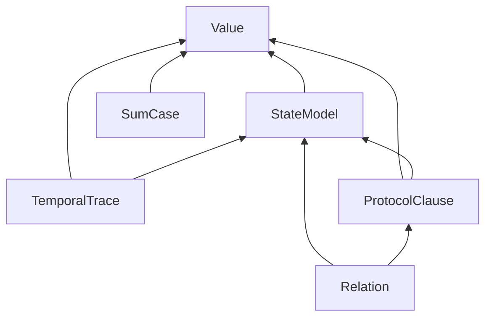
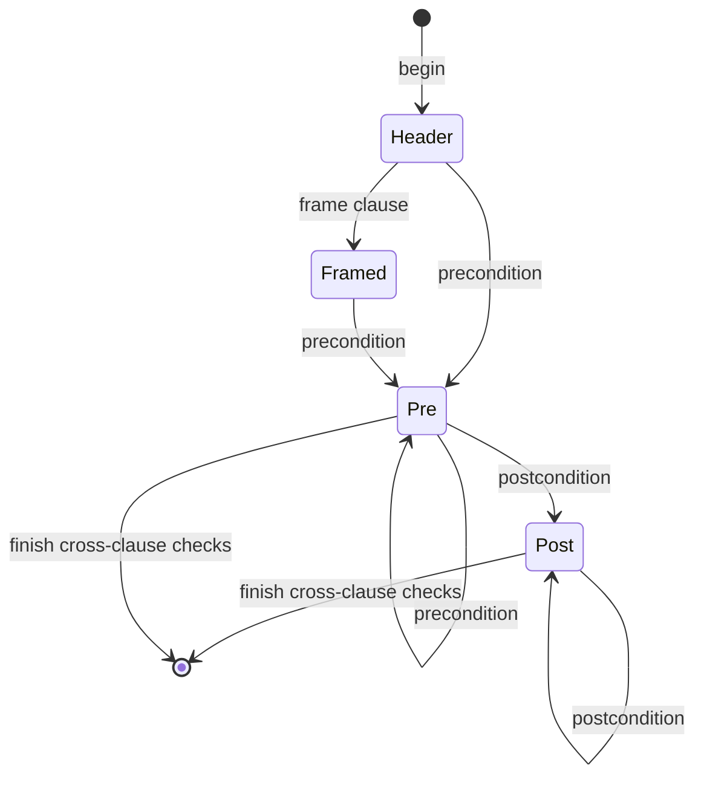

# ADR-012: Semantic-family extension and dispatch contracts (ARCH-11)

## Status

Proposed, 2026-09-19. Owning ticket: agent-ix/quire-spec-language#210
(ARCH-11), epic #205, Layer 1. Acceptance is decided at the architecture
change-scenario gate #212. Supersedes nothing.

## Context

#210 requires QSL semantic families to extend the compiler and the proof
pipeline through declared interfaces, with no central method that consumes a
complete grammar and no dispatch on strings. Two records bound this decision.

- [ADR-010](ADR-010-observed-architecture-baseline.md) is the observed
  baseline. It routes six findings (OBS-003, OBS-004, OBS-012, OBS-013,
  OBS-014, OBS-033), the capability authority DA-11 and the program item L1-D1
  to #210. Its §4.3 lists nine dispatch sites, five of them on strings.
- QSpec AD-016 (accepted) fixes the seven-arrow path for one family, function
  application, from source to native replay. It makes CG `negotiate_*` the
  single capability negotiation point and QSL admission language-only. This
  record adopts AD-016 unchanged and applies its per-arrow contract to every
  family in #210's scope.

Sibling Layer 1 tickets own adjacent decisions. This record cites them as
"decided in #NNN" and does not decide them.

| Ticket | Owns |
|---|---|
| #209 | stages, stage edges, the crate and module DAG, and where each hook's code lives |
| #211 | canonical types, identities, outcomes, refusals, provenance and version representations, and conversions |
| #229 | the capability specification: the vocabulary (FR-290's six kinds), its identity and version rules, and the absence policy |
| #213 | the canonical Rust `Capability` value type and the shared outcome types |
| #185 | the capability registry and routing; it alone implements them |
| #222 | the early boundedness design: finite, bounded and unbounded requests and their bound representation; it feeds #213, #188 and #189 |

This record designs the family contract and the selection mechanism. It
consumes the vocabulary and absence policy from #229, the `Capability` type
and outcome types from #213, and the registry from #185. It does not design
any of them.

Item citations use ADR-010's form: `ADR-010 OBS-nnn`, `ADR-010 DA-nn`,
`ADR-010 L1-D1`. Rust names in this record (`FamilyKind`, `FamilyContract`,
`Requirements` and so on) are design names for the contract; #213 and #214
choose the final spelling within the rules stated here.

## Decision

1. QSL semantic families form a closed set, `FamilyKind`, with six members
   (§1). Execution and proof mode is a typed axis that every family declares,
   not a seventh family.
2. Every family implements one shared contract with six parts: identity,
   provenance, typing context, requirements, structured outcome and stage
   hooks (§2). Everything else is family-owned (§3).
3. A construct whose clauses have independent meaning is a typed node with one
   typed subnode per clause, checked through a staged builder (§4). A
   central `match` is legal only as a dispatch seam whose arms each make one
   call into family code.
4. Adding a semantic variant fails the build at every closed seam listed in
   §5. Adding one at an open seam (backend registration) fails explicitly
   through the registry, never by a silent default.
5. Syntax admission, semantic admission, backend capability and runtime
   availability are four separate decisions with four owners (§6). None
   implies another.
6. Backend selection matches a typed requirement against typed
   advertisements held in the #185 registry, an explicit value, independent
   of registration order and of ambient state (§7). Selection only computes
   candidates. CG `negotiate_*` stays the single point that settles a
   disposition, including `unsupported` for an absent capability. Solver
   absence yields the outcome decided in #229, never a hold and never a
   fallback to another backend.
7. The contract covers check, package, lower, execute or prove, witness and
   replay (§8), following AD-016's arrows.
8. Strings select semantics only at a serialization or command-line edge,
   through one total conversion into a closed enum (§9).
9. The six routed findings and DA-11 are decided in §10; L1-D1 is decided in
   §11.
10. §12 gives the bounded change sets for a sum/case form and for a scoped
    frame clause.

## 1. Family catalogue

`FamilyKind` is a closed Rust enum. Each variant names one ownership unit:
the forms it parses, the checked nodes it produces, the diagnostics it emits
and the stage hooks it implements.

| `FamilyKind` | Scope in #210 | Depends on families | Consuming tickets |
|---|---|---|---|
| `Value` | scalar and composite values, types, expressions, function application | none | #214 (exemplar migration), #120, #164, #170, #175 |
| `StateModel` | state, model population, lookup, inheritance, dispatch | `Value` | #220, #121, #147, #155, #173, #174, #176, #180, #181 |
| `SumCase` | sum types and `case` with its exhaustiveness obligation | `Value` | #221, #187 |
| `TemporalTrace` | temporal and trace semantics | `Value`, `StateModel` | #222, #188 |
| `ProtocolClause` | protocols, clauses, frames, scoped anchors | `Value`, `StateModel` | #218, #223 |
| `Relation` | refinement and model-to-implementation relations | `StateModel`, `ProtocolClause` | #191, #192, #198, #223 |

The "Depends on families" column is a DAG. A family reads another family's
checked output only through the public checked types of that family and the
shared context (§2). No family calls another family's checking or lowering
internals. #209 decides the crate and module placement; that placement must
keep this family DAG acyclic.



### 1.1 Execution and proof mode

Finite, bounded and unbounded modes cut across every family. A family does not
own a mode. Each checked node states, through its `Requirements` (§2), which
mode its obligations need. The mode type and the bound representation are
decided in #222. This record fixes three mechanics.

- The mode is a field of the requirement, so backend selection (§7) keys on
  the pair (capability, mode).
- An unbounded requirement is never narrowed to a bounded one. A backend that
  advertises the capability only in bounded mode is not a candidate for it.
  When a finite bound is available, `negotiate_*` settles `requires-bound`
  (AD-016 arrow 5 and "Frames and unbounded constructs"); what counts as an
  available bound is decided in #222.
- A bounded result reports the bound it held over. The report travels with the
  outcome and is never dropped at a later stage.

## 2. Shared family contract

The shared contract is the minimum every family implements. It has six parts.

| Part | Contract | Representation owner |
|---|---|---|
| Identity | Every checked node carries a stable identity minted by QSL at check time. Equality and hashing never use display text or collection position. | decided in #211 (DA-01, DA-02) |
| Provenance | Every checked node maps to its source span through a source map keyed by that identity. QSL is the only minter (AD-016 arrow 1). | decided in #211 (DA-13) |
| Typing context | A family's check receives an explicit `&CheckContext`: resolved declarations, the type environment, the scope stack, limits and the meter. Nothing is read from global or thread-local state. | context type decided in #211; stage placement in #209 |
| Requirements | A pure function of a checked node returns `Requirements { capabilities, mode, bound }`: the typed capability kinds its claims need, the execution or proof mode, and the bound it declares. | vocabulary decided in #229, Rust type in #213; mode and bound decided in #222 |
| Structured outcome | A family check returns either the checked node or a refusal with a family-typed cause. Each cause maps to a stable catalog code through one exhaustive `catalog_code()`. | outcome and refusal types decided in #211 (DA-09, DA-10) |
| Stage hooks | The family implements a hook for each stage in §8 that it takes part in. Every hook takes checked input; none takes CST, tokens or display strings. | this record |

Design-level shape of the contract:

```text
trait FamilyContract {
    const KIND: FamilyKind;
    type Form;              // parsed semantic form: typed subnodes (§4)
    type Checked;           // checked payload with identity and provenance
    type Cause: CatalogCoded;
    fn check(form: Self::Form, cx: &mut CheckContext)
        -> FamilyOutcome<Self::Checked, Self::Cause>;
    fn requirements(checked: &Self::Checked) -> Requirements;
    fn package(checked: &Self::Checked, out: &mut PackageEmitter)
        -> Result<(), PackageRefusal>;
    fn evaluate(checked: &Self::Checked, env: &mut EvalEnv)
        -> Outcome<Value>;
}
```

The trait is a static contract, implemented once per family and dispatched
through closed enums (§5). It is not an object-safe plug-in interface, and no
code holds a `dyn FamilyContract` collection. A family that has no reference
evaluation (for example `Relation`, whose gates run over compiled corpora)
implements no `evaluate` hook. It does not implement a stub that returns a
fixed verdict.

## 3. Family-owned responsibilities

Each family owns the following. The shared layer owns none of it.

| Responsibility | Family-owned contract |
|---|---|
| Parsing structure | The family owns its grammar productions and the typed `Form` they produce. The parser composes families through one closed table of entry productions. Each entry calls one family production function. |
| Validation | Clause-level checks and cross-clause constraints, run through the family's builder (§4). |
| Normalization | Any canonical form the family needs, such as sorted variant sets or resolved frame targets. It runs inside the family's check, before identity is minted, so identity is taken over the normalized form. |
| Evaluation and lowering | The reference `evaluate` hook, the checked-package emission arm, and the family's arms in downstream IR, RT and CG seams (§8). |
| Diagnostics | A family `Cause` enum. Every variant has a catalog code in the vendored diagnostic catalog; the catalog version is decided in #211 (OBS-023). |
| Tests | Clause-level unit tests, builder ordering tests, one exhaustive-seam test per closed seam (§5), wire totality tests, and one absent-capability corpus case per capability the family requires (§7). |

The per-family assignment:

| Family | Parsing forms | Validation and normalization | Evaluation and lowering | Distinct diagnostics |
|---|---|---|---|---|
| `Value` | literals, operators, `let`, `if`, calls, records, collections, function declarations | typing, coercion, `Int[..]` range obligations, termination | `value::expression` evaluator; v2 value and expression nodes; IR `Operator`; RT exact ops; CG oracle arm | ill-typed, operator-ineligible, range, termination |
| `StateModel` | model declarations, populations, lookups, inheritance, dispatched calls | population extent, redefinition conflicts, dispatch preconditions, query-only restriction | model normalize and population evaluation; v2 `model` and `relation` nodes | missing-name, redefinition, dispatch-ineligible |
| `SumCase` | variant type declarations, variant construction, `case` with arms | arm pattern typing per arm; exhaustiveness as its own obligation | `case` evaluation; v2 variant and case nodes | non-exhaustive, unreachable arm, wrong variant |
| `TemporalTrace` | temporal formulas, intervals, clock roles, profiles | interval and window typing, profile facet admission | temporal evaluation over a trace; v2 temporal nodes | unbounded without facet, clock role, interval |
| `ProtocolClause` | protocols, operation clauses, frames, scoped anchors | clause ordering, frame target eligibility (FR-340), anchor scoping | protocol and state evaluation; v2 `state`/`frame` and clause nodes | frame target, anchor scope, clause order |
| `Relation` | refinement relations, abstraction relations from model elements to implementation state | relation totality over its declared domain; unbound-element refusal | corpus-differential gates; abstraction relation export in the checked package | unbound element, refinement violation |

## 4. Typed subnodes and staged builders

### 4.1 Rule

A construct whose clauses have independently meaningful semantics is parsed
into a typed node with one typed subnode per clause. It is checked by a staged
builder. No routine consumes and validates the construct's complete grammar in
one pass.

A clause has independent meaning when it has its own refusal causes, or its
own identity, or when a backend can accept or refuse it separately.
Preconditions, postconditions, frames, anchors, `case` arms, temporal
intervals and refinement premises all meet this test.

### 4.2 Builder shape

The builder is a typestate over the construct's clause order. Each transition
checks exactly one clause and returns that clause's checked subnode or its
refusals. `finish` checks only the constraints that span clauses.



Builder rules:

- Clause order is encoded in the builder's states. An out-of-order clause is a
  typed refusal raised by the transition it tried to take. No sequencer
  inspects the clause list afterwards.
- Each clause check is a free function over that clause's `Form` and the
  context. A unit test drives it without building the enclosing construct.
- Diagnostics are aggregated in declared clause order. The order is a
  property of the builder, not of traversal accident, so it can be tested.
- A refused clause does not stop sibling clauses from being checked. `finish`
  runs its cross-clause checks only when every clause they read was checked.
  A refused construct emits no checked node (AD-016 arrow 1, "Rejected item →
  substitute? No").

### 4.3 Dispatch seams are thin

A central `match` over a closed form enum is a dispatch seam. It is legal
when every arm makes exactly one call into the owning family and holds no
semantic logic of its own. The observed `infer_form` in
`src/value/expression/check.rs` (about 280 lines) is a seam that also holds
semantic logic. #214 converts it into a thin seam for the `Value` family. The
other families' migrations stay with #220 to #223.

## 5. Exhaustive extension behaviour

### 5.1 Closed seams (compile-time failure)

Adding a variant to any of the following enums fails the build at every
listed seam. None of these `match` expressions may contain a `_` or
catch-all arm.

| # | Closed enum | Seams that must fail to compile | Owner |
|---|---|---|---|
| S1 | `FamilyKind` | check dispatch, package emission dispatch, requirement derivation, reference evaluation dispatch, `catalog_code()` family prefix | QSL (#214) |
| S2 | parsed form enum (for expressions, the one `Expression` enum) | parser entry table; check seam | QSL, owning family |
| S3 | checked node enum (today `NodeKind`) | evaluator, v2 emitter, requirement derivation | QSL, owning family |
| S4 | family `Cause` enums | `catalog_code()` | owning family |
| S5 | clause kind (canonical form decided in #211, DA-08 and DA-17) | QSL → IR conversion, IR → RT observation conversion, IR → CG obligation kind (AD-016 scenario 2) | QSL, IR, RT, CG |
| S6 | IR checked-node tag and semantic-form enums | IR `lower` arm; CG `negotiate_*` arm; CG harness arm; RT op selection | IR, CG, RT |
| S7 | capability kind enum (#229 vocabulary, #213 type) | requirement derivation per family; registry advertisement check; outcome mapping for an absent capability | QSL (#213, #185) |
| S8 | IR `KaniOutcomeKind` and any later backend outcome enum | outcome → FR-331 result map (AD-016 arrow 6) | IR |

A downstream arm that cannot yet lower or prove a new variant is still an
explicit arm. It returns `unsupported` with a catalog code, as AD-016 does for
frames today. That arm is written by hand; it is never a `_` arm.

### 5.2 Open seams (explicit registry failure)

The set of backends is open. Backends register with the #185 registry. The
registry fails explicitly in these cases, and never by a first-wins or
last-wins default:

| Case | Behaviour |
|---|---|
| Two registrations with the same backend identity | registry construction refuses, naming the identity |
| A registration advertising a capability kind outside the #229 vocabulary | refused at registration; the wire decode of an unknown kind follows #229's unknown-kind rule |
| A requirement no registrant advertises for its (capability, mode) pair | empty candidate set; `negotiate_*` settles `unsupported`, warned (§7.3) |
| More than one registrant matches and the request names none | `negotiate_*` settles `invalid-request`, naming every candidate (§7.2) |

### 5.3 Test obligation

#214 adds one test-only variant and shows a compile failure at each of S1–S4.
S5–S8 get the same test in their owning repositories when those seams are
built. AD-016's `cargo mutants` requirement on mapping functions applies to
every conversion at S5–S8.

## 6. Four admissions

| Decision | Question | Owner and stage | Input → output | Failure | Does not imply |
|---|---|---|---|---|---|
| Syntax admission | Is this text a well-formed form of an admitted edition? | QSL parser; family productions | source → family `Form` | parse diagnostic; no form | that the form type-checks |
| Semantic admission | Is this form meaningful in the language? | QSL checker; family `check` | `Form` + `CheckContext` → checked node + `Requirements` | family refusal with catalog code; no checked node | that any backend supports it |
| Backend capability | Does a registered backend advertise what the checked node requires, and what is settled for the item? | candidates: the #185 registry (stage decided in #209). Disposition: CG `negotiate_*` only (AD-016 arrow 4) | `Requirements` + registry → candidate set; candidate set + IR form → disposition | `unsupported` (warned, naming the capability), `requires-bound` or `invalid-request`, each settled by `negotiate_*` | that the backend's tool is installed |
| Runtime availability | Is the selected backend's tool present and usable now? | the executing adapter at execute or prove time (CG for Kani) | backend descriptor → available tool identity or absence cause | solver-absence outcome (§7.4) | anything about language meaning |

Consequences of the separation:

- The checker never reads the registry. A checked package is the same bytes
  whatever backends are registered. This is AD-016's rule that QSL admission
  is language-only and negotiates nothing.
- The checker records `Requirements` as data (AD-016 arrow 1's
  `capability_report`). Recording a requirement grants nothing.
- Registration never probes tools. Availability is checked when a backend is
  about to run, so one registry value gives the same selection on machines
  with and without the tool.

## 7. Capability-based backend selection

### 7.1 Parties

| Party | Declares | Owner |
|---|---|---|
| Family | `Requirements` of each checked node (§2) | each family |
| Backend | `BackendDescriptor { id: BackendId, advertises: set of (capability kind, mode) }`. `BackendId` is a typed identity, never a display string. | the backend's repository; registered in #185 |
| Registry | a value built from descriptors; computes candidate sets and routes each settled item to its backend's lowering target | #185 |
| Negotiator | the one per-item disposition, over the candidate set | CG `negotiate_*` (AD-016; QSpec FR-290 and AD-010 as amended by QSpec PR #133) |

The registry is an ordinary value, for example a `BTreeMap` keyed by
`BackendId`. It is built by the orchestrating caller and passed as an argument.
It is not a `static`, a `OnceLock`, a thread-local, or a link-time collection
(`inventory`, `linkme` or `ctor`). Two registries built from the same
descriptors in any order are equal and select identically.

### 7.2 Selection and negotiation

For each requested item, in this order, once, before execution:

1. The registry computes the candidate set from the item's `Requirements`.
   If the request names a `BackendId`, the candidate set is that backend when
   it advertises every required (capability, mode) pair, and empty otherwise.
   If the request names none, the candidate set is every registrant that
   advertises every required pair.
2. CG `negotiate_*` receives the IR form and the candidate set and settles
   exactly one disposition:

| Candidate set | Disposition settled by `negotiate_*` |
|---|---|
| empty | `unsupported`, warned, naming the required capability kind and mode (§7.3) |
| more than one, request names none | `invalid-request`, naming every candidate; the caller resolves it by naming a backend |
| exactly one | that backend's own settlement of the IR form: `supported`, `requires-bound`, `unsupported` (warned) or `invalid-request` |

3. The registry routes each `supported` item to the lowering target of its
   one candidate. It routes nothing else.

Selection computes candidates and settles nothing. That keeps AD-016's single
negotiation point, as QSpec PR #133 restates it in FR-290 and AD-010. The
candidate set never depends on registration order, on display names or on
ambient state. A routed item is not re-routed later. If its backend proves
unavailable (§7.4), the item settles the solver-absence outcome.

### 7.3 Absent capability

An absent capability is an item whose candidate set is empty. The mechanics
are:

- `negotiate_*` settles it `unsupported` with a warning naming the required
  capability, per QSpec FR-290-AC-4. The outcome constructor and catalog code
  come from #213 and #229.
- No backend is invoked, and no artifact is emitted for the item at any later
  stage.
- The outcome is never a refusal of the language form, never a success and
  never a hold.
- The accounting record joins it on `request_index`, like every other
  disposition (AD-016's completeness test on zero or two records applies).

### 7.4 Solver absence

When the selected backend's tool is absent or unusable at run time, the
adapter returns a typed absence cause. One exhaustive function maps that
cause to the outcome decided in #229. The ticket fixes only that solver
absence is never a hold. IR `KaniOutcomeKind::Unavailable` is the observed
carrier for Kani. The mechanics fixed here are:

- Availability is probed by the adapter that would run the tool, at the
  execute or prove stage, and nowhere earlier.
- The outcome names the backend, the tool identity it expected (for Kani, the
  AD-016 tool pin) and the claim.
- There is no fallback to another backend and no downgrade to a weaker mode.

## 8. Stage coverage

The contract spans six stages. The arrow numbers are AD-016's.

| Stage | AD-016 arrow | Family hook | Owner | Closed seam | Absent capability or unsupported form |
|---|---|---|---|---|---|
| Check | 1 | `check`, `requirements` | QSL family | S1–S4, S7 | not consulted; requirements recorded as data |
| Package | 2 | `package` (checked-package/v2 emission arm) | QSL family; wire in QSpec | S1, S3 | unsupported families carried in `capability_report`, not dropped |
| Lower | 2, 3 | IR `lower` arm per (tag, form); RT op selection | IR, RT | S5, S6 | explicit `unsupported` arm with catalog code |
| Execute or prove | 4, 5 | candidates and routing (#185, §7.2); CG `negotiate_*` and harness arm per IR form; reference `evaluate` for native execution | #185, CG, QSL | S6, S7 | every disposition from `negotiate_*` (§7.2, §7.3); solver absence at run time (§7.4) |
| Witness | 6 | the family's witness binding schema, derived from the obligation identity's arguments | IR (packet and witness), CG (schema) | S8 | no packet without a counterexample; no placeholder witness |
| Replay | 7 | the family's `evaluate` hook, reached through the QSL complete-V1 executor | CG reconstruction; QSL executor | S1, S3 | refused decode yields no verdict; disagreement is `inconclusive` with a typed cause |

Two rules apply at every stage.

- A hook takes checked input or a versioned checked package. No stage
  reparses QSL text, CST, display strings or diagnostics to recover
  semantics.
- An item refused or settled `unsupported` at one stage emits no substitute
  artifact at any later stage (AD-016 terminal-disposition rule).

The shape of the witness envelope and the replay request and result is
decided in #211 and implemented in #231. The replay executor's key, which
AD-016 names as `function: &str`, is an identity question decided in #211
(§13).

## 9. String dispatch

Rule: a string may select semantics only at a serialization or command-line
edge. There, one total conversion turns it into a closed enum or refuses it
with a typed cause. After the edge, no code compares a string to choose
behaviour.

| Site (ADR-010 §4.3, OBS-014, OBS-033) | Decision | Owner |
|---|---|---|
| `"allocation"` relationship category (`model/systems.rs:269`) | typed category enum; QSL PR #200 removes the string | QSL `StateModel` |
| `"quire.protocol.finite-global/v1"` (`protocol_artifact/validate.rs:287,291`) | typed profile enum decoded once at protocol-artifact intake | QSL `ProtocolClause` |
| `"filament-canonical-json-1"` (`state/evaluation.rs:2478-2484`) | typed canonicalization enum decoded at state-input intake | QSL `StateModel` |
| `"quire.state.authority-adapter"` (`state/evaluation.rs:2781-2783`) | typed adapter-kind enum decoded at intake | QSL `StateModel` |
| `"clock:"` prefix (`temporal.rs:50`) | a typed clock-role variant in the temporal form; the prefix is parsed once | QSL `TemporalTrace` |
| composed `Backend{identity: &str}` (`linking/composed/requests.rs:80`) | removed from the linker; candidates use `BackendId` in the #185 registry (§7) | #185 |
| value call by function name `&str` (`value/expression/mod.rs:635`) | keyed by checked declaration identity; the identity type is decided in #211 | #214 |
| `--target` string (`lowering/target.rs:39-46`) | CLI edge conversion to a typed `BackendId`; the fixed catalog is replaced by the #185 registry | #185 |
| `CapabilityId(String)` (`complete/package.rs:690`) | replaced by the #213 capability type | #213 |
| IR `CheckedNodeTag::from_wire`, `required_by(tag, form: &str)`, `DispatchIndex::resolve(&str)` | wire strings decoded once in the v2 reader into closed tag and form enums; lowering and dispatch match on the enums | IR |
| CG `semantic_form == "call"`, `node_tag == "state" && semantic_form == "frame"` | CG matches on IR's enums (seam S6) | CG |
| RT function lookup by name | keyed by checked declaration identity, as for QSL | RT |

The IR, CG and RT rows describe code in those repositories. This record
states the contract; the change belongs to their own tickets (§14).

## 10. Findings and DA-11 decided

| Item | Decision |
|---|---|
| ADR-010 OBS-003 | The composed linker performs no backend negotiation. `requests::report` records requests as data. Its `Backend` parameter and its `UnsupportedCapability` and `UnsupportedFamily` dispositions are removed when #185 lands. Candidates and routing then live only in the #185 registry, and dispositions only in CG `negotiate_*` (§7). There is one path, not two. |
| ADR-010 OBS-004 | `negotiate_integer_division`, `negotiate_ieee` and `IeeeBackendCapabilities` are capability predicates. AD-016 arrow 3 places them in RT and arrow 4 makes CG the only caller. The QSL copies are removed. QSL value semantics keep their evaluation functions, which are not negotiation. |
| ADR-010 OBS-012 | "Capability" has one meaning: the kind a claim requires and a backend advertises, from the #229 vocabulary. Language admission is called semantic admission (§6) and is not a capability. The QSL four-variant request label enum is replaced by the #229 type; the replacement's version and unknown-kind behaviour are decided in #229. IR `CheckedCapability`, `CapabilityDisposition` and `OutputCapability`, and CG `ObligationDisposition`, are dispositions or output kinds. They stay layer-owned, with total conversions (AD-016 shared-type strategy). |
| ADR-010 OBS-013 | The Kani backend is registered in the #185 registry as one `BackendDescriptor`. Its implementation is CG (harness, negotiation) plus IR (outcome), per AD-016. QSL owns the registry, not the backend. FR-290's phrase "quire-spec-language's Kani backend" should say so; that is a QSpec edit (§13). |
| ADR-010 OBS-014 | Five production string sites; each is decided in §9. |
| ADR-010 OBS-033 | Cross-repository dispatch is on closed enums decoded once at the v2 reader edge (§9, seam S6). IR, CG and RT own their edits. |
| ADR-010 DA-11 | One authority per role. Vocabulary: #229, over QSpec FR-290. Rust type: #213. Requirement derivation: each family's `requirements` hook. Advertisement: each backend's descriptor. Registry and routing: #185, using the candidate mechanism in §7.2. Per-item disposition: CG `negotiate_*` only. Runtime availability: the executing adapter. |

## 11. L1-D1: which ladder tickets wait on #185

Test used: a ticket waits on #185 only when one of its exit criteria is
registry behaviour, that is, when a claim must be routed to a registered
backend, or must settle the absent-capability outcome.

| Ticket | Waits on #185? | Reason |
|---|---|---|
| #186 (A09) | No, relaxed | State `forall` witness on `native-run-result/2`, produced by the native reference runtime. No solver, no routing. Technical prerequisites stay #231 and QSpec #114. |
| #187 (A10) | No, relaxed | Sum types and `case` are semantic admission and reference evaluation in the `SumCase` family. Exhaustiveness is a checker obligation with its own refusal, not a backend claim. Proof lowering of sum/case is later work (#221 and downstream). |
| #188 (A11) | Yes, kept | Its exit criterion "with no backend registered it settles `unsupported` with the warning" is the §7.3 outcome over the #185 registry. Profile and facet work may start earlier; closure waits on #185. Its boundedness is decided in #222. |
| #189 (A12) | Yes, kept | Its exit criterion "a claim over an unbounded collection settles `unsupported` with the warning" needs the #185 registry's empty candidate set for (capability, `Unbounded`). Declaration admission may start earlier; closure waits on #185. Its bound semantics are decided in #222. |
| #191 (A13) | No, relaxed | Corpus-differential `xtask` gate; no solver, no routing. It shares QSpec #116 with #185 but does not consume #185. |
| #192 (A14) | No, relaxed | Same as #191, for profile layering. |
| #198 (A15) | No, relaxed | Declares, checks and exports the abstraction relation; the unbound-element refusal is a checker or export refusal. Kani and Verus consumption of the relation is backend breadth under #223, which stays after #185. |

The "Woven in after" order among the ladder rungs is sequencing for a single
writer. Where it runs through #185, it is not a technical prerequisite for the
five relaxed tickets. Outside the ladder, #217 and #223 keep their dependency
on #185. This record edits no issue; applying the edges is for the ticket
owner after #212.

## 12. Representative change sets

Each table lists the full touch set. A row outside the table is a defect in
this design and reopens #210 at #212.

### 12.1 Add a sum type and an exhaustive `case`

Normative input: QSpec #115 (spelling, FR-143 and FR-146 at `1-draft.4`).

| Stage | Change | Seam forced |
|---|---|---|
| Canonical type | add the sum type descriptor to the canonical type (decided in #211, DA-05) | type `match`es at S3 and S6 |
| Parse | `SumCase` productions: variant declaration and `case` with arms; one entry in the parser entry table | S2 |
| Form | `CaseForm { scrutinee, arms: Vec<ArmForm> }` and `ArmForm { pattern, body }` typed subnodes | S2 |
| Check | builder: scrutinee → each arm (pattern typed against the scrutinee's variants, independently) → `finish` runs the exhaustiveness obligation as its own check with its own cause | S1, S4 |
| Checked node | `Case` variant in the checked node enum | S3 |
| Requirements | none beyond the `Value` family's for the same arms | S7 (explicit arm) |
| Evaluate | `case` arm selection by variant identity | S3 |
| Package | v2 emission arm for variant and case nodes (wire vocabulary from QSpec #115) | S1, S3 |
| IR | tag and form enum variants; an explicit `unsupported` lower arm until the IR form exists | S6 |
| CG | explicit `negotiate_*` arm returning `unsupported` with a catalog code until a harness exists | S6 |
| RT | variant value operation, when lowering lands | S6 |

Tests: arm-level unit tests; the non-exhaustive `case` refusal; the
unreachable-arm refusal; builder diagnostic order; a v2 round trip; one
typed `unsupported` ledger case downstream. No other family's module changes.

### 12.2 Add a scoped frame clause to a protocol operation

Normative input: QSpec FR-340 (frame body) and QSpec #101 and #106.

| Stage | Change | Seam forced |
|---|---|---|
| Clause kind | add `Frame` to the canonical clause kind (decided in #211, DA-08 and DA-17) | S5 in QSL, IR, RT and CG |
| Parse | `ProtocolClause` production for `frame` with `modifies`, `creates`, `deletes`; the scoped anchor production | S2 |
| Form | `FrameForm { modifies, creates, deletes }`, each a list of reference forms; `ScopedAnchorForm { scope, anchor }` | S2 |
| Check | builder transition `Header → Framed`: each member resolved to node identities and checked against FR-340 eligibility on its own; anchor scope checked by its own function; `finish` checks that postcondition writes fall inside `modifies` | S1, S4 |
| Checked node | `Frame` and `ScopedAnchor` subnodes of the operation node | S3 |
| Requirements | the frame obligation's capability kind (from #229) and mode | S7 |
| Evaluate | runtime frame check, `frame_violation`/`unauthorized-change` | S3 |
| Package | v2 `state`/`frame` node (FR-340) | S1, S3 |
| IR, CG | explicit `unsupported` arms until IR #109 and CG #49 land (AD-016 "Frames and unbounded constructs") | S6 |

Tests: frame member eligibility, one refusal per FR-340 cause; anchor scope
refusal; out-of-order clause refusal raised by the builder transition;
cross-clause write containment; typed `unsupported` ledger test; the
absent-capability corpus case. No `Value`, `SumCase` or `TemporalTrace`
module changes.

## 13. Questions for siblings and the owner

### 13.1 For #209

1. Which stage and crate hosts the #185 candidate and routing step (§7.2):
   the checked-package orchestration stage in QSL, or a separate routing
   stage between package and lower?
2. How does the candidate set reach CG `negotiate_*` without a CG → QSL
   normal dependency beyond AD-016's WP9 edge: as a field of the checked
   package, or as a separate typed argument whose type lives in the IR model
   crate?
3. Does the family DAG (§1) map to modules in one crate, or does any family
   meet #209's extraction criteria for its own crate?
4. Where does the `CheckContext` live so that family modules depend on it
   without depending on each other?

### 13.2 For #211

1. The replay executor key: AD-016 names `CheckedPackage::call(function:
   &str, …)`. Is the key the declared qualified name (lexical identity) or
   the checked node identity? §9 requires one of these, typed.
2. The canonical clause kind that S5 extends: which of the two QSL
   `ClauseKind` types, the IR type or the RT type is canonical, and which
   conversions are total?
3. The family refusal type: one shared refusal with a family cause enum, or a
   per-family refusal type joined by `catalog_code()`?
4. Where does the sum type descriptor live in the canonical type (§12.1)?

### 13.3 For #229

1. The outcome for solver absence (§7.4), its catalog code and its FR-331
   relation. The absent-capability outcome is FR-290's `unsupported` (warned);
   #229 fixes its catalog code.
2. Does a capability requirement carry a mode, or is mode a separate
   dimension that backends advertise alongside the six kinds? §7 needs the
   pair; it does not care which record carries the mode.
3. The frame obligation and the sum/case claim: which of the six kinds, if
   any, do they require? If none fits, the vocabulary question returns to
   QSpec.
4. Unknown-kind behaviour at registration (§5.2).

### 13.4 Owner questions

1. FR-290 names "quire-spec-language's Kani backend" as a registrant, while
   AD-016 places Kani emission in CG. The QSpec edit (via QSpec #116) should
   read: the Kani backend is a CG and IR backend registered in QSL's registry.
2. FR-290 is titled "Protocol claim kind vocabulary", but #229 adopts it as
   the vocabulary for every family's capability requirements. Does the owner
   accept that value, state and temporal claims use the protocol claim kinds,
   or should QSpec widen the vocabulary?
3. When more than one backend matches and the request names none,
   `negotiate_*` settles `invalid-request` (§7.2). Is a declared preference
   order wanted instead? This record chose `invalid-request` because a
   preference order is dispatch on a policy that is not part of the claim.
4. #229's scope lists "compatibility behavior for older four-kind QSL
   artifacts". This record designs no reader for the four-kind labels; the
   linker path that uses them is removed (OBS-003). Is any compatibility for
   them wanted?

## 14. Work this record hands on

| Work | Ticket |
|---|---|
| `FamilyKind`, `FamilyContract`, seams S1–S4, the thin check seam, the `Value` migration, the test-only variant | #214 |
| Capability type and outcome constructors for §7.3 and §7.4 | #213 |
| Registry value, `BackendDescriptor`, candidate sets and routing (§7.2), removal of the composed linker negotiation and of the fixed target catalog | #185 |
| `negotiate_*` taking the candidate set (§7.2) | CG ticket, to be opened by the CG owner |
| `StateModel`, `ProtocolClause`, `SumCase`, `Relation` migrations | #220, #223, #221, #223 |
| Mode and bound semantics and representation | #222, feeding #213 |
| IR tag and form enums at the v2 reader edge | IR ticket, to be opened by the IR owner |
| CG and RT enum matches in place of string compares; QSL negotiate copies removed in favour of RT's | CG and RT tickets, to be opened by their owners; QSL removal in #213 |

## Consequences

- #212 can apply scenario 2 (sum type and case) and scenario 3 (protocol
  clause with a frame) against §12 and scenario 7 (a backend without syntax or
  checking authority) against §6 and §7.
- A new family or form costs one family module plus compiler-forced arms. A
  new backend costs one descriptor plus its own negotiator. Neither edits the
  checker.
- The checked package no longer varies with installed backends, so the same
  package is reproducible across machines.
- Five production string-dispatch sites and the composed-linker negotiation
  are removed, not kept alongside the typed paths.
- An ambiguous request settles `invalid-request`. Callers with two matching
  backends must name one.

## Alternatives Considered

- **Open plug-in families behind `dyn FamilyContract`, registered at link
  time.** Rejected. Adding a variant would no longer fail the build, and
  dispatch would depend on registration and ambient state, which #210
  forbids.
- **One visitor that walks the whole grammar per stage.** Rejected. It is the
  monolithic routine the handoff rule forbids; clause order and diagnostics
  would be testable only through complete constructs.
- **Dispositions settled by the registry.** Rejected. It would add a second
  negotiation point beside CG `negotiate_*`, which AD-016 and QSpec PR #133
  forbid.
- **Selection inside the checker.** Rejected. It makes the checked package
  depend on installed backends and contradicts AD-016's language-only
  admission.
- **First-registered backend wins on ambiguity.** Rejected. It is dispatch on
  registration order.
- **Fall back to another backend when the selected tool is absent.**
  Rejected. It turns runtime availability into a hidden change of the proof
  claim, and the program forbids fallbacks.
- **Treat unbounded mode as a seventh family.** Rejected. Every family can
  have unbounded obligations, so mode is an axis of the requirement, not an
  ownership unit.
