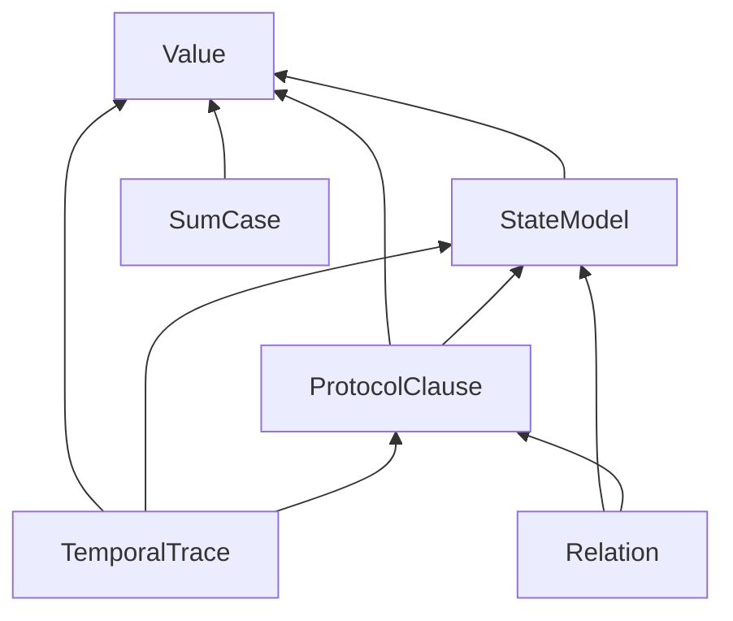
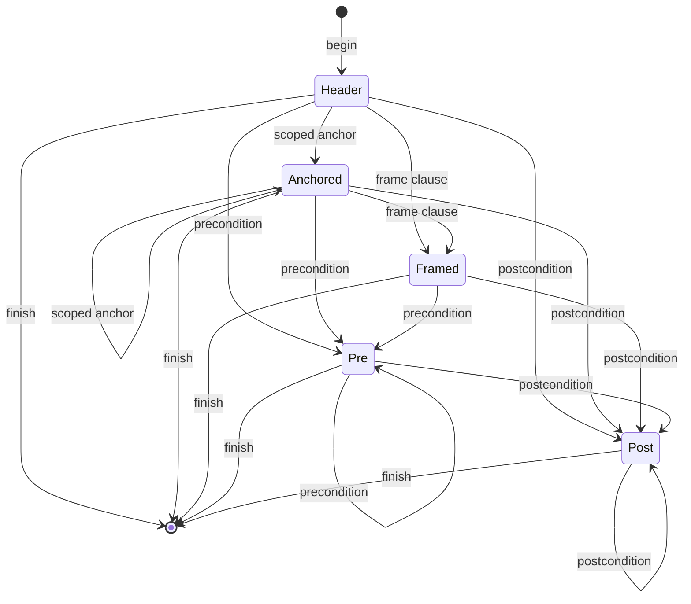

# ADR-012: Semantic-family extension and dispatch contracts (ARCH-11)

## Status

Proposed, 2026-09-19. Owning ticket: agent-ix/quire-spec-language#210
(ARCH-11), epic #205, Layer 1. Acceptance is decided at the architecture
change-scenario gate #212. Supersedes nothing.

This record is the `/specify` output for #210. Its `/spec-review` (all
analyses, SR-474 to SR-481) is in
[`spec/reviews/family-extension/`](../reviews/family-extension/base.md).

## Context

#210 requires QSL semantic families to extend the compiler and the proof
pipeline through declared interfaces, with no central method that consumes a
complete grammar and no dispatch on strings. Three records bound this
decision.

- [ADR-010](ADR-010-observed-architecture-baseline.md) is the observed
  baseline. It routes six findings (OBS-003, OBS-004, OBS-012, OBS-013,
  OBS-014, OBS-033), the capability authority DA-11 and the program item L1-D1
  to #210. Its §4.3 lists the dispatch sites, five of them on strings in
  production code. Code citations below use ADR-010's `QSL:<path>:<line>`
  form at its pinned revision de627b5.
- QSpec AD-016 (accepted) fixes the seven-arrow path for one family, function
  application, from source to native replay. It makes CG `negotiate_*` the
  single capability negotiation point, and it makes QSL admission
  language-only. This record applies AD-016's per-arrow contract to every
  family in #210's scope and does not reopen it.
- QSpec FR-290 and AD-010, as amended on agent-ix/quire-specification#133,
  restate the single negotiation point and its four terminal dispositions:
  `supported`, `requires-bound`, `unsupported` (warned) and `invalid-request`.

Sibling tickets own adjacent decisions. This record cites them as "decided in
#NNN" and does not decide them.

| Ticket | Owns |
|---|---|
| #209 | stages, stage edges, the crate and module DAG, and where each hook's code lives (ADR-011) |
| #211 | canonical types, identities, outcomes, refusals, provenance and version representations, and conversions (ADR-013, QSL PR #236; its O-rows are cited as `ADR-013 O-nn`) |
| agent-ix/quire-specification#134 | the capability vocabulary (FR-290's kinds) and its wire spelling; FR-331 there carries the candidate set |
| #229 | QSL's capability specification, aligned to agent-ix/quire-specification#134 (QSL PR #237): the absence policy, how a family declares, a backend advertises and a request selects a capability, and the claim form → kind table (FR-057). #229 consumes §6 and §7.1 of this record for the selection mechanics. |
| #213 | the canonical Rust `Capability` value type and the shared outcome types |
| #185 | the capability registry and routing; it alone implements them |
| #222 | the early boundedness design: finite, bounded and unbounded requests, the "available finite bound" predicate, and which bound representation #213 implements under #211's DA-12 ownership. It feeds #213, #188 and #189. |

This record designs the family contract and the selection mechanism. It consumes
the capability vocabulary from agent-ix/quire-specification#134 (FR-290), the
absence policy and the claim form → kind table (FR-057) from #229, the
`Capability` type and outcome types from #213, the registry from #185 and the
boundedness design from #222.

Item citations use ADR-010's form: `ADR-010 OBS-nnn`, `ADR-010 DA-nn`,
`ADR-010 L1-D1`. Other records cite this record's closed seams as
`ADR-012 S<n>` (§5.1). In this record a bare `S<n>` is always a seam of
§5.1; ADR-011's stage and edge ids are always written `ADR-011 S<n>` and
`ADR-011 E<n>`. Rust names in this record (`FamilyKind`,
`FamilyContract`, `Requirements` and so on) are design names; the
implementing tickets choose the final spelling within the rules stated here.

## Decision

1. QSL semantic families form a closed set, `FamilyKind`, with six members
   (§1). The domain extent of a claim (finite, bounded or unbounded) is data
   every family records, not a seventh family (§1.1).
2. Every family implements one shared contract with six parts: identity,
   provenance, typing context, requirements, structured outcome and stage
   hooks (§2). Everything else is family-owned (§3).
3. A construct whose clauses have independent meaning is a typed node with one
   typed subnode per clause, checked through a staged builder (§4). A central
   `match` is legal only as a dispatch seam whose arms each make one call into
   family code.
4. Adding a variant to a closed enum fails the build at every seam listed in
   §5.1. At the open seam (backend registration), each §5.2 case yields its
   explicit outcome, independent of registration order.
5. Syntax admission, semantic admission, backend capability and runtime
   availability are four separate decisions with four owners (§6). None
   implies another.
6. The #185 registry computes candidate backends from a claim's capability
   kinds. The registry is an explicit value, independent of registration
   order and of ambient state. CG `negotiate_*` settles every disposition,
   including `requires-bound` and `unsupported` (§7). Solver absence yields
   the terminal result QSpec defines (ADR-013 QC-9) on the routed backend alone.
7. The contract covers check, package, lower, execute or prove, witness and
   replay (§8), following AD-016's arrows.
8. Strings select semantics only at a listed edge, through one total
   conversion into a closed enum or a typed identity (§9).
9. The six routed findings and DA-11 are decided in §10. L1-D1 is decided in
   §11.
10. §12 gives the bounded change sets for a sum/case form, for a scoped frame
    clause and for a new backend.

## 1. Family catalogue

`FamilyKind` is a closed Rust enum. Each variant names one ownership unit:
the forms it parses, the checked nodes it produces, the diagnostics it emits
and the stage hooks it implements.

| `FamilyKind` | Scope in #210 | Reads checked types of (semantic order) | Design input | Implementation owners |
|---|---|---|---|---|
| `Value` | scalar and composite values, types, expressions, function application | none | none | #214 (function application), #120, #164, #170, #175 |
| `StateModel` | state, model population, lookup, inheritance, dispatch | `Value` | #220 | #120, #121, #164 |
| `SumCase` | sum types and `case` with its exhaustiveness obligation | `Value` | #221 | #187 |
| `TemporalTrace` | temporal and trace semantics, and the control-to-temporal mapping (QSpec FR-300, PR #59) | `Value`, `StateModel`, `ProtocolClause` | #222 | #188, #189 |
| `ProtocolClause` | protocols, clauses, frames, scoped anchors | `Value`, `StateModel` | #223 | #218 |
| `Relation` | refinement and model-to-implementation relations | `StateModel`, `ProtocolClause` | #223 | #191, #192, #198 |

The "Reads checked types of" column is a semantic ordering, and it is a DAG.
It is carried by types in the layer-3 `check` core, not by module imports.
Families are modules in the ADR-011 §6.1 layer crates, and each family module depends only
on its layer's core and lower layers (ADR-011 §6.1). A checked type that one
family produces and another family reads is defined in the `check` core. The
producing family constructs it; the reading family matches on it. Everything
else a family module defines is private to that module. These types move into
the `check` core:

| Checked type in the `check` core | Produced by | Read by |
|---|---|---|
| checked expression node (today `NodeKind`, `value::expression::ir`, moved by ADR-011 M-5) and checked type node | `Value` | every other family |
| checked model element reference, population extent and dispatch target | `StateModel` | `TemporalTrace`, `ProtocolClause`, `Relation` |
| canonical checked clause kind (S5) | `ProtocolClause` | `TemporalTrace`, `Relation`, the layer-4 `package` emitter |
| checked operation header and checked clause subnodes (frame, scoped anchor, pre- and postcondition) | `ProtocolClause` | `TemporalTrace` (the FR-300 control-to-temporal mapping), `Relation` |

The same rule holds in layer 2 `forms`, layer 4 `package` and layer 5
`value::expression`: a family module depends on its layer's core only.

`SumCase` has no edge to `StateModel`. Variant payload types resolve through
the type environment in `CheckContext`, which lives in the `check` core.
#187's prerequisite on #121 is therefore a sequencing edge, not a family edge.
This record leaves that edge in place because L1-D1 concerns #185 only.



### 1.1 Domain extent

Finite, bounded and unbounded domains cut across every family. No family owns
them. The extent vocabulary, the bound representation and the "available
finite bound" predicate are decided in #222. The mechanics below are fixed
here, and #212 can check them from this record alone.

- The family records each claim's declared extent, and any authored bound, as
  data in its `Requirements` (§2). This is recording, not a mode decision.
- AD-016's single predicate for boundedness is IR `requires-bound`. QSL's
  recorded extent and bound are inputs to it. CG `negotiate_*` settles from IR's
  result and the candidate's advertised modes (AD-016 arrow 4, ADR-013 O-20).
  Whether a backend advertises a mode beside each kind is
  agent-ix/quire-specification#134's (scope item 3).
- Backends advertise (capability kind, mode) pairs. Candidates are matched on
  capability kind alone (§7.2). The mode, bounded or unbounded extent, is
  compared in CG `negotiate_*`, after matching. `negotiate_*` settles:
  - When IR does not report `requires-bound`, or the candidate advertises
    unbounded mode, it settles the form's own disposition.
  - When IR reports `requires-bound`, the candidate advertises only bounded
    mode and a finite bound is available, it settles `requires-bound`.
  - When IR reports `requires-bound`, the candidate advertises only bounded
    mode and no finite bound is available, it settles `unsupported`, warned.
  - `supported` for a bounded-only backend requires a bounded extent.
- A bounded extent is within both modes. An unbounded extent is within
  unbounded mode only.
- Each requested item has exactly one capability kind (FR-057, FR-290), so
  `negotiate_*` applies these rules once, to that kind and its extent.
- An unbounded claim keeps its extent. A `requires-bound` item runs only after
  the caller supplies a bound, which makes a new bounded request with its own
  identity (AD-016 arrow 5).
- A bounded result reports the bound it held over. The report travels from IR
  `KaniOutcome` to the FR-331 accounting record and reaches it intact.

#212 scenario 5 needs one input from #222: the "available finite bound"
predicate. #222 may produce it in parallel with #212.

## 2. Shared family contract

The shared contract is the minimum every family implements. It has six parts.

| Part | Contract | Representation owner |
|---|---|---|
| Identity | Every checked node carries a stable identity, minted by QSL at check time. It is content-addressed over the ADR-013 O-04 preimage, whose owner subject is the declaring source's `SourceOwner` or definition's `DefinitionOwner` (`{authority, identity}`), or for a model-owned node the domain package's identity and declared version plus the IR node identity, so it is independent of counters, display strings and collection positions. Structurally identical nodes share one id. Each source occurrence is keyed by (node id, role, ordinal) (ADR-013 O-07). | ADR-013 O-04 (DA-02) and O-07; package identity O-02 |
| Provenance | Every checked node occurrence maps to its source span through a source map keyed by its occurrence key. QSL is the only minter (AD-016 arrow 1). | ADR-013 O-12 (DA-13) |
| Typing context | A family's `check` receives `&mut CheckContext`. Resolved declarations, the type environment and limits are read-only through it. The meter, the diagnostic sink and the scope stack are the only mutable parts. Nothing is read from global or thread-local state. | contents: this record; placement: the QSL `check` core (ADR-011, #209) |
| Requirements | A pure function of a checked node returns `Requirements`. It holds the item's one capability kind (FR-057, FR-290), its declared extent and any authored bound. A claim form whose FR-057 kind is none yields no `Requirements` value and requests no backend (§7.2). | kinds from agent-ix/quire-specification#134 (FR-290); each family records the Requirements of its own claim forms, by the claim form → kind table of FR-057 (QSL PR #237); Rust type in #213; extent and bound decided in #222 |
| Structured outcome | A family `check` returns the checked node or a refusal with a family-typed cause. A family `check` that reaches a limit or exhausts the meter returns `StageFailure::Limit(LimitExceeded)` with limit kind work budget (ADR-013 T-4); `Incomplete` is an S6a outcome only. Each cause maps to a stable catalog code through one exhaustive `catalog_code()`. | ADR-013 O-16 (outcomes) and O-17 (refusals): each family has its own `Cause` enum with `catalog_code()`; the shared part is `RefusalRecord` in F `diagnostic` (O-17); the kernel `Refusal` carries kernel causes only |
| Stage hooks | The family implements a hook for each stage in §8 that it takes part in. Every hook takes checked input; none takes CST, tokens or display strings. | this record |

Design-level shape of the contract:

```text
trait FamilyContract {
    const KIND: FamilyKind;
    type Form;              // parsed semantic form: typed subnodes (§4)
    type Checked;           // checked payload with identity and provenance
    type Cause: CatalogCoded;
    fn check(form: Self::Form, cx: &mut CheckContext)
        -> CheckOutcome<Self::Checked, Self::Cause>;
        // CheckOutcome<T, C> = Result<Staged<T>, StageFailure<C>> (ADR-013 T-4):
        // checked | refused | limit | fault
    fn requirements(checked: &Self::Checked) -> Option<Requirements>;
    fn package(checked: &Self::Checked, out: &mut PackageEmitter)
        -> Result<(), PackageRefusal>;
}

trait ReferenceEvaluation: FamilyContract {
    type Observed;          // kernel value, state observation or trace verdict
    fn evaluate(checked: &Self::Checked, env: &mut EvalEnv, meter: &mut Meter)
        -> Result<EvalOutcome<Self::Observed>, InternalFault>;
        // EvalOutcome<T> { Kernel(Outcome<T>), Family(FamilyResult) }:
        // Family is a family-owned evaluation-time refusal or undefined
        // result; Err is an S6a invariant break (ADR-013 O-16, T-4)
}
```

Both traits are static contracts, implemented once per family and dispatched
through closed enums (§5). Each family is reached through a `match` on a closed
enum, so the set of families is fixed at compile time.

`ReferenceEvaluation` is implemented by every family except `Relation`, whose
gates run over compiled corpora. The S1 evaluation seam (ADR-011 S6a)
dispatches over the families that implement `ReferenceEvaluation`: its input
type has no `Relation` variant, so it has no `Relation` arm. The seam's
outcome is a QSL layer-3 `check`-core type,
`FamilyOutcome { Evaluated(kernel::Outcome), FamilyEvaluated(FamilyResult) }`,
because the kernel `Refusal` carries only kernel causes; the seam returns it
inside the layer-5 `Evaluation`, beside the evaluation's location and loss
records (ADR-011 §2.3). `FamilyResult { Refused, Undefined }` carries a family-owned evaluation-time cause that the `evaluate`
hook returns: the family owns the cause type and implements F `diagnostic`'s
`CatalogCoded` or `UndefinedCoded` for it, so a new family cause needs no
`check`-core edit (ADR-013 O-16, O-17). The seam passes each hook result
through unchanged: `EvalOutcome::Kernel(o)` as `FamilyOutcome::Evaluated(o)`,
`EvalOutcome::Family(r)` as `FamilyOutcome::FamilyEvaluated(r)`, and
`Err(fault)` as `Err(fault)`. `EvalOutcome` is a `check`-core type because
it is the hook's return type and the `check` core defines the hook.

The rule for a family that sits out a stage depends on the stage. At an
evaluation stage, the family is absent from the stage's input type, so no arm
and no refusal exists for it. This follows the #214 precedent below: a
contract part that nothing can legitimately construct is left out, not
stubbed. Nothing produces an S6a evaluation of a `Relation` declaration:
the abstraction relation has no FR-057 capability kind (§7.2), so no
counterexample of it exists, and the refinement gates' `operation-contract`
claims reach S6a as clause expressions, not as a `Relation` declaration
(owner ruling on FR-090-OQ-2, ADR-013 O-16). At a lowering or proof stage, the family has an explicit arm that
returns `unsupported` with a catalog code (§5.1).

`package` is all-or-nothing. A family either emits every v2 node for the item
or emits none and returns the refusal.

**#214's implementation record.** #214 (FR-062/FR-065) implements this
contract for real, migrating `Value`'s function-declaration and
function-application forms as the one representative family, and finds
that several parts of the design-level shape above have no real
construction with only one family migrated and that family carrying no
FR-057 capability kind and no typed refusal cause distinct from its
existing checking refusals. Rather than keep a part of the contract that
nothing can ever legitimately construct (an uninhabited type whose own
`#[allow(dead_code)]` would be the only way past the lint gate), #214
narrows the implemented trait shape to what it can back with a real
caller, and records what is deferred here so the intent survives past this
one PR:

- `FamilyContract::requirements()` and the `Requirements`/`CapabilityKind`/
  `Extent`/`Bound` types are **not implemented**. FR-057/#229 (QSL-11,
  Done) states plainly that function-application has no FR-057 capability
  kind at all ("no kind for an expression nested in a clause, such as a
  function application"), so a `requirements()` for this family would
  return `None` unconditionally -- not a real function, its own absence
  wearing a signature. The family whose migration first has a claim form
  with a real FR-057 kind adds this back to the contract in that same
  change, per [docs/family-migration-recipe.md](../../docs/family-migration-recipe.md).
- `FamilyContract::Cause` is **not a trait associated type**; `check`
  returns `CheckOutcome<Self::Checked>` with no cause type parameter.
  Function declaration has no typed refusal cause distinct from `Value`'s
  existing checking refusals (`CheckCause`), so a `Cause` enum for it would
  have zero real variants; a probe over such an enum tests only its own
  `catalog_code()` mapping, not a seam (S4, §5.1). The family whose
  migration first has a real typed cause adds `Cause` back to the trait and
  to FR-063's seam-probe checked-in list (S4) in that change.
- `PackageRefusal` is **deleted**; `FamilyContract::package` itself is
  **deleted entirely** (PR #262 review, findings F1/F2, a correction to
  this paragraph's earlier "`package` returns `()`" text). Its one real
  caller, `CheckedPackage::emit_function_package_v2`, wrote `package`'s
  output into a scratch buffer it never read back, then built its actual
  returned bytes independently through `family::emit_v2` -- a hook nothing
  consumed, the same forward-declared-shape hazard `requirements` already
  is. The family whose migration first genuinely needs a shared,
  trait-level packaging hook (for example because several families' v2
  nodes must compose into one all-or-nothing emission a shared caller
  drives) adds `package` back then, with a real consumer in the same
  change.
- `StageFailure` carries only `Limit`, not `Fault` (this paragraph's
  earlier text) and not a family-typed `Refused`. `Fault(InternalFault)`'s
  one construction site compared `mint_declaration_identity`'s output
  against itself -- a pure function called twice with the same arguments,
  which cannot fail by construction -- so PR #262 review (finding F7)
  deleted it along with the fabricated comparison that was its only
  caller. `src/diagnostic.rs`'s own `InternalFault` (landed after #214's
  first pass, from #213 S-5) is that type's real eventual home for a
  future stage entry with a genuine internal-fault outcome.
- The S1 stage-participation table (`stage_hooks(FamilyKind, Stage) ->
  HookStatus`) is **deleted** (PR #262 review, finding F7): its only
  non-test callers were three `assert_eq!` sites asserting a hand-written
  `match`'s own literal result against itself, and removing those
  fabricated callers left the table with no real reader. FR-063-AC-6's
  checked-in S1 list narrows from two locations to one accordingly (see
  FR-063's and `xtask/src/seam_probe.rs`'s own correction notes).
- `ReferenceEvaluation::EvaluateRefusal` carries only `Refused(String)`, not
  an `Incomplete` variant carrying a real meter state: `quire-exact`'s own
  `Meter::charge`/`charge_plan` are `pub(crate)`
  (`quire-exact/src/accounting.rs:551,595`), not exported, so no family
  migrated so far can construct a real `Incomplete` from outside
  `quire-exact`. This is an export gap in `quire-exact` (#213's own scope),
  not a QSL-side design choice; #214 defers `Incomplete` to when that gap
  closes rather than fabricate a caller for an unreachable variant.

**What #214 actually delivers against the design intent above (PR #262
review headline finding).** The narrowing recorded here is about which
contract *parts* have a real construction site; it is not a claim that the
part which remains -- `check` -- performs the family's admission decision.
It does not, for either form #214 migrates: `ValueFunctionFamily::check`
mints an identity and records one diagnostic, refusing only on the
nesting-depth limit; the real typing, definedness and termination verdict
for function declarations is made entirely by the unchanged `Typer`,
invoked unconditionally immediately after, for every declaration, and
`Expression::Call` (function application) never calls any
`FamilyContract` method at all -- `Self::call` in `check.rs` is Typer's own
unchanged method, with one incidental call to `family::mint_call_identity`
added for identity. Both the contract's `check` and the unchanged `Typer`
run for every declaration and every call. This is not the ADR-011 §7.3
M-6e side-by-side hazard in the narrow sense that rule targets -- `Typer`
was never a separate, deprecated *old* admission path left running by
oversight; it is the only checker either form has ever had, and the
contract's `check` was never built to replace it, only to mint identity
alongside it -- but it does mean FR-065's own text ("check... exclusively
through the contract") is delivered only for identity and provenance
minting, not for the checking decision itself. FR-065's Status section
records this by Acceptance Criterion; the real migration (moving the
checking itself into `ValueFunctionFamily::check` and removing it from
`Typer`) is filed as its own, separate ticket rather than attempted as
part of #214.

None of this changes the six-part contract's design intent above, which
remains the target shape; it is what #214 could back with a real,
non-fabricated caller against the one family it migrated, and -- for the
checking decision itself -- less than #214's own first-pass report
claimed. See
[docs/family-migration-recipe.md](../../docs/family-migration-recipe.md)
for the recipe each later family migration follows, including when each
deferred part comes back.

## 3. Family-owned responsibilities

Each family owns the following. The shared layer owns none of it.

| Responsibility | Family-owned contract |
|---|---|
| Parsing structure | The family owns its grammar productions and the typed `Form` they produce. The parser composes families through one closed entry table keyed by a closed leading-token kind enum. Each entry calls one family production function. The leading-token kind alone selects the production. |
| Validation | Clause-level checks and cross-clause constraints, run through the family's builder (§4). |
| Normalization | Any canonical form the family needs, such as sorted variant sets or resolved frame targets. It runs inside the family's `check`, before identity is minted, so identity is taken over the normalized form. |
| Evaluation and lowering | The `evaluate` hook, the checked-package emission arm, and the family's arms in downstream IR, RT and CG seams (§8). |
| Diagnostics | A family `Cause` enum. Every variant has a catalog code in the QSpec diagnostic catalog; the catalog version follows ADR-013 O-17 and O-23 (OBS-023). |
| Tests | Clause-level unit tests, builder ordering tests, the seam probe (§5.3), wire totality tests, and one backend-absence corpus case per capability kind the family's claim forms request (§7). |

The per-family assignment:

| Family | Parsing forms | Validation and normalization | Evaluation and lowering | Distinct diagnostics |
|---|---|---|---|---|
| `Value` | literals, operators, `let`, `if`, calls, records, collections, function declarations | typing, coercion, `Int[..]` range obligations, termination | `value::expression` evaluator; v2 value and expression nodes; IR `Operator`; RT exact ops; CG oracle arm | ill-typed, operator-ineligible, range, termination |
| `StateModel` | model declarations, populations, lookups, inheritance, dispatched calls | population extent, redefinition conflicts, dispatch preconditions, query-only restriction | model normalize and population evaluation; v2 `model` and `relation` nodes | missing-name, redefinition, dispatch-ineligible |
| `SumCase` | variant type declarations, variant construction, `case` with arms | arm pattern typing per arm; exhaustiveness as its own obligation | `case` evaluation; v2 variant and case nodes | non-exhaustive, unreachable arm, wrong variant |
| `TemporalTrace` | temporal formulas, intervals, clock roles, profiles; the control-to-temporal mapping over checked protocol operations | interval and window typing, profile facet admission | temporal evaluation over a trace; v2 temporal nodes | unbounded without facet, clock role, interval |
| `ProtocolClause` | protocols, operation clauses, frames, scoped anchors | clause ordering, frame target eligibility (FR-340), anchor scoping | protocol and state evaluation; v2 `state`/`frame` and clause nodes | frame target, anchor scope, clause order |
| `Relation` | refinement relations, abstraction relations from model elements to implementation state | relation totality over its declared domain; unbound-element refusal | corpus-differential gates; abstraction relation export in the checked package; no native `evaluate`: ADR-011 S6a's input type has no `Relation` variant (§2). The refinement gates (#191, #192) emit `operation-contract` claims, one per clause implication; FR-290 (QSpec PR #135) keeps `refinement` for refinement between protocols | unbound element, refinement violation |

## 4. Typed subnodes and staged builders

### 4.1 Rule

A construct whose clauses have independently meaningful semantics is parsed
into a typed node with one typed subnode per clause. It is checked by a staged
builder. No routine consumes and validates the construct's complete grammar in
one pass.

A clause has independent meaning when it has its own refusal causes, or its
own identity, or when a backend can accept or refuse it separately.
Preconditions, postconditions, frames, anchors, `case` arms, temporal
intervals and refinement premises all meet this test.

### 4.2 Builder shape

The builder is a runtime state machine over the construct's clause order. Its
one step function is `accept(state, clause) -> (state, ClauseResult)`. It
matches on the pair (current state, clause kind) with an explicit arm for
every pair and no `_` arm.

- An admitted pair checks exactly that clause with the clause's own function,
  and moves to the next state.
- A pair that is out of order returns a typed clause-order refusal and leaves
  the state unchanged.
- A clause that is in order but fails its own check returns its refusals and
  still advances the state, so the sibling clauses after it are checked.

`finish(state)` checks only the constraints that span clauses. It runs each
cross-clause check only when every clause that check reads was checked
successfully. A construct with any refusal emits no checked node (AD-016
arrow 1, "Rejected item → substitute? No").

The diagram shows the operation builder that §12.2 uses. It is illustrative.
The admitted clause sequences are the grammar's (QSpec FR-340 and the
operation clause grammar). Every state reached after `Header` may finish.



Builder rules:

- Clause order is encoded in the state machine. No sequencer inspects the
  clause list afterwards.
- Each clause check is a free function over that clause's `Form` and the
  context. A unit test drives it without building the enclosing construct.
- Diagnostics are ordered by builder state, then by source position within a
  state. The order is a property of the builder, so it can be tested.

### 4.3 Dispatch seams are thin

A central `match` over a closed form enum is a dispatch seam. It is legal
when every arm makes exactly one call into the owning family and holds no
semantic logic of its own.

Building an arm's argument, wrapping its result in the seam's enum variant and
propagating an error with `?` are not semantic logic. A branch, a lookup or a
check in the arm is.

The observed `infer_form` (`QSL:src/value/expression/check.rs:683-966`, about
280 lines) is a seam that also holds semantic logic, for both `Value` and
`StateModel` forms. #214 makes the function-application arms thin. The
remaining `Value` arms move with #120, #164, #170 and #175. The `StateModel`
arms (model lookup, population and dispatched call) move with #120, #121 and
#164 under #220's mapping (§14). Of the arms at `check.rs:761-784`, `Present`
and `Value` are option operations and stay in `Value`; `Deref` reads a model
element reference and moves with the `StateModel` arms; `Pre` is legal only in
an operation postcondition and moves to `ProtocolClause` with #218.

The one `Expression` enum (S2) is defined in the `forms` core. Each variant's
owning family is the family whose hook its arm calls, and that family adds and
removes the variant.

## 5. Exhaustive extension behaviour

### 5.1 Closed seams (compile-time failure)

Adding a variant to any of the following enums fails the build at every
listed seam.

| # | Closed enum | Seams that must fail to compile | Owner |
|---|---|---|---|
| S1 | `FamilyKind` | every `match` on `FamilyKind`: `catalog_code()` family prefix, and the stage-participation table that says which hook each family has at each stage. The ADR-011 S6a seam dispatches over the S6a family kind, a closed `check`-core enum that is `FamilyKind` without `Relation`, matched with one arm per variant and no `_` arm, so `Relation` has no evaluation arm (§2, FR-090-AC-4). The calls into a family's `check`, `package`, `requirements` and `evaluate` are S2 and S3 arms, grouped by family. | QSL (#214) |
| S2 | parsed form enum (for expressions, the one `Expression` enum) and the leading-token kind enum | parser entry table; check seam | QSL, owning family |
| S3 | checked node enum (today `NodeKind`) | evaluator, v2 emitter, requirement derivation | QSL, owning family |
| S4 | family `Cause` enums | `catalog_code()` | owning family |
| S5 | clause kind. Canonical: the QSL checked clause kind in the layer-3 `check` core, where ADR-011 M-5 moves `value::expression::check` (ADR-013 O-10, as ruled by the coordinator). The layer-4 `package` emitter converts it to v2 and depends downward. The v2, IR and CG conversions are total; IR → RT is total with refusal. | QSL → IR conversion, IR → RT observation conversion, IR → CG obligation kind (AD-016 scenario 2) | QSL, IR, RT, CG |
| S6 | IR checked-node tag and semantic-form enums, decoded at v2 intake | IR `lower` arm; CG `negotiate_*` arm; CG harness arm; RT op selection. No vocabulary is re-derived from a wire string after intake. | IR (agent-ix/quire-contract-ir#141), CG, RT |
| S7 | capability kind enum (agent-ix/quire-specification#134 vocabulary, #213 type) | requirement derivation per family; registry advertisement check; CG `negotiate_*` capability arm | QSL (#213, #185), CG |
| S8 | IR `KaniOutcomeKind` and any later backend outcome enum | outcome → FR-331 result map (AD-016 arrow 6) | IR |
| S9 | CG backend kind enum (closed) | CG `negotiate_*` backend arm; CG artifact generation arm. Every capability is settled inside a `negotiate_*` arm over this enum; a new backend kind is a compile error until it has an arm. | CG (agent-ix/quire-contract-codegen#86) |

These rules make the failure certain:

- No `match` at a listed seam has a `_` or catch-all arm. Seam modules deny
  `clippy::wildcard_enum_match_arm` and
  `clippy::match_wildcard_for_single_variants`, and the lint gate runs them.
- No S1–S9 enum is `#[non_exhaustive]`. A cross-crate match on a
  `#[non_exhaustive]` enum must have a `_` arm, which would defeat the seam.
- S9 is a settlement point by construction, not by coincidence. Today CG has one
  concrete function, `negotiate_kani_obligations`
  (`CG:src/kani_obligations.rs:454` at CG `origin/main` on 2026-09-19).
  agent-ix/quire-contract-codegen#86 makes settlement a `negotiate_*` arm over
  the closed S9 enum, with a test that fails when any capability is settled
  outside such an arm.
- S6 has one rule past intake: no vocabulary is re-derived from a wire string.
  Intake already decodes most tags once. The defect is the `as_str()` sites in
  IR `src/kani/` after intake (27 measured), which
  agent-ix/quire-contract-ir#141 removes.
- A downstream arm that cannot yet lower or prove a new variant is still an
  explicit arm. It returns `unsupported` with a catalog code, as AD-016 does
  for frames today. That arm is written by hand.

### 5.2 Open seam (explicit registry failure)

The set of registered backends is open at run time. Backends register with the
#185 registry, which fails explicitly in these cases, each with the outcome in
the table, independent of registration order.

| Case | Behaviour |
|---|---|
| Two registrations with the same `BackendId` | the second registration refuses with `invalid_capability`/`duplicate-backend`, naming the identity; the existing registration stands (FR-057:214-218) |
| A registration advertising a capability kind outside the agent-ix/quire-specification#134 vocabulary | handled by the unknown-kind rule of #229's specification, aligned to agent-ix/quire-specification#134; this record adds nothing |
| A request naming a `BackendId` that is not registered | `negotiate_*` settles `invalid-request`, naming the unknown identity. A CLI argument naming it is refused at the CLI edge with the same identity named (§9), so no request is formed. |
| A requirement whose capability kind no registrant advertises | empty candidate set; `negotiate_*` settles `unsupported`, warned (§7.3) |
| More than one registrant matches and the request names none | `negotiate_*` settles `invalid-request`, naming every candidate (§7.2) |

### 5.3 Evidence

- **Seam probe.** Each S1–S4 enum has a probe variant behind the cargo feature
  `seam-probe`, which only the probe build enables. An `xtask seam-probe` builds
  each affected crate with the feature and asserts that the set of rustc E0004
  locations equals a checked-in list of seam functions, no more and no fewer. It
  runs in the full gate. #214 builds it for S1–S4. Every S1–S4 enum and every
  match site over it is in an ADR-011 §6.1 layer crate (§1). The probe builds
  each crate that defines or matches an S1–S4 enum, and the union of their
  E0004 locations is compared with the list. The seams that cross repositories are probed where their enums are
  defined: S5 in QSL, IR, RT and CG with #218; S6 by
  agent-ix/quire-contract-ir#141; S7 by #185 for the registry arm and by
  agent-ix/quire-contract-codegen#86 for the CG arm; S8 in IR with each backend
  outcome enum; S9 by agent-ix/quire-contract-codegen#86. AD-016's `make heads`
  drift checks 1 (clause and tag wire strings total both ways) and 7 (every
  layer's `catalog_code()` total) are the evidence that the repositories agree.
- **Mapping mutants.** AD-016's `cargo mutants` requirement covers the
  conversions at S1 and S4 (`catalog_code()`) and S5–S9, which are ADR-013
  C-05, C-06, C-09, C-15 and C-20. A surviving `cargo mutants` mutant in any
  of these mappings fails the gate. No mutant is allow-listed.
- **Registry.** Under #185:
  - a property-based test that registries built from any permutation of the
    same descriptors are equal and give identical candidate sets;
  - a `cargo-deny` ban on `inventory`, `linkme` and `ctor`, and a lint gate
    that finds no `static`, `OnceLock` or `thread_local!` in the registry
    module;
  - one unit test per §5.2 row.
- **Dispositions end to end.** The #185 and #217 end-to-end disposition
  test runs in CG over the candidate-set wire and the v2 bytes as data, at
  the QSL revision CG pins, and never calls `route`. It runs the #185 exit
  corpus, including the backend-absence case of §3, and asserts §7.3:
  `unsupported` with its warning, no artifact, and one accounting record per
  `request_index`. QSL tests only `route`'s candidate-set output.

## 6. Four admissions

| Decision | Question | Owner and stage | Input → output | Failure | Does not imply |
|---|---|---|---|---|---|
| Syntax admission | Is this text a well-formed form of an admitted edition? | QSL parser; family productions | source → family `Form` | parse diagnostic; no form | that the form type-checks |
| Semantic admission | Is this form meaningful in the language? | QSL checker; family `check` | `Form` + `CheckContext` → checked node + `Requirements` | family refusal with catalog code, or `StageFailure::Limit(LimitExceeded)`; no checked node | that any backend supports it |
| Backend capability | Which registered backends advertise the item's capability kind, and what is settled for the item? | candidates: the #185 registry, in the QSL `route` module (layer R), after ADR-011 S4 and before ADR-011 E7. Disposition: CG `negotiate_*` only (AD-016 arrow 4) | `Requirements` + registry → candidate set; candidate set + IR form → disposition | `unsupported` (warned), `requires-bound` or `invalid-request`, each settled by `negotiate_*` | that the backend's tool is installed |
| Runtime availability | Is the selected backend's tool present at the pinned version? | the executing adapter, after negotiation and before the run (CG for Kani) | backend descriptor → available tool identity or absence cause | solver-absence outcome (§7.4) | anything about language meaning |

Consequences of the separation:

- The checker's inputs exclude the registry. A checked package is the same bytes
  whatever backends are registered. This is AD-016's rule that QSL admission
  is language-only and negotiates nothing.
- The checker records `Requirements` as data, in AD-016 arrow 1's
  `capability_report`. Recording a requirement grants nothing.
- Registration records descriptors only; tool probing happens at run time
  (§7.4). One registry value gives the same candidates on machines with and
  without the tool.

## 7. Capability-based backend selection

### 7.1 Parties

| Party | Declares | Owner |
|---|---|---|
| Family | `Requirements` of each checked node (§2) | each family |
| Backend | `BackendDescriptor { id: BackendId, advertises: set of (capability kind, mode), tool: pinned tool identity }`. `BackendId` is a typed identity. | the backend's repository; registered in #185 |
| Registry | a value built from descriptors, read by QSL `route` (ADR-011 layer R): `route` computes each item's candidate set before E7 and, after negotiation, returns the `BackendId` of each item settled `supported` | #185 |
| Negotiator | the one per-item disposition, over the candidate set | CG `negotiate_*` arms over the closed backend kind S9 (AD-016; QSpec FR-290 and AD-010 as amended by PR #133; agent-ix/quire-contract-codegen#86) |

`BackendDescriptor`, the candidate set and `Capability` cross repository
boundaries as QSpec data, not through a shared Rust crate (ADR-013 T-7). A
backend's descriptor is its FR-331 provider manifest, which QSL `route`
converts into its `BackendDescriptor`. On the wire, a `BackendId` is the
`backend{identity, manifest_digest}` member in `quire.tool-manifest.jcs/v1`
(ADR-013 O-19). A candidate set is one list of `backend` members per
`request_index`, sorted by (identity, manifest digest).

The registry is an ordinary value, for example a `BTreeMap` keyed by
`BackendId`. The orchestrating driver (ADR-011 T-13, #248) builds it and passes
it as an argument. It lives in the driver's call frame and reaches every
consumer as an argument (§5.3 holds the gates). Two registries built from the
same descriptors in any order are equal and select identically.

The candidate step runs in the QSL `route` module (layer R), after ADR-011
S4 and before ADR-011 E7. The routing step runs in `route` after E7: it reads
the FR-331 dispositions as wire and returns the `BackendId` of each item
settled `supported`. The orchestrating driver is a separate crate downstream
of CG (ADR-011 T-13, implemented by #248; #225 accepts its design). It calls
QSL for the checked package and the `route` candidate sets, calls CG with
both, then passes each `BackendId` that `route` returns to CG generation. CG
settles every disposition. No QSL library module depends on or calls CG
(ADR-011).

### 7.2 Selection and negotiation

For each requested item the steps run once, in this order, before any backend
runs:

1. **Candidates.** QSL `route` computes the candidate set from the
   item's `Requirements`, matching on capability kind alone. A backend
   matches when it advertises the item's one kind (FR-057). The mode is
   compared in step 3:
   - If the request names a registered `BackendId`, the set is that backend
     when it advertises the item's kind, and empty otherwise.
   - If the request names an unregistered `BackendId`, the set is marked
     unknown-backend.
   - If the request names none, the set is every registrant that advertises
     the item's kind.
   - An item needs a kind to have candidates. A claim form whose FR-057 kind
     is none requests no backend and gets no candidates: the `case`
     exhaustiveness obligation, discharged at language admission, and the
     abstraction relation. Every item that requests a backend reaches
     `negotiate_*` exactly once.
2. **Target-neutral IR.** IR lowers the checked item (AD-016 arrows 2 and 3).
3. **Negotiation.** CG `negotiate_*` receives the IR form, the item's extent
   and the candidate set, and settles exactly one disposition.
4. **Routing.** After negotiation, QSL `route` reads the FR-331
   dispositions as wire and returns the `BackendId` of each item settled
   `supported`. The driver passes it to CG's backend-specific generation,
   which follows target-neutral IR (AD-016 arrows 4 and 5). Each step has one
   owner: `route` computes candidates and returns the routed `BackendId`s,
   and CG `negotiate_*` settles.

| Candidate set | Disposition settled by `negotiate_*` |
|---|---|
| unknown-backend | `invalid-request`, naming the unknown `BackendId` |
| empty | `unsupported`, warned, naming the item's unmet capability kind and any backend the request named (backend absence, §7.3) |
| more than one, request names none | `invalid-request`, naming every candidate; the caller resolves it by naming a backend |
| exactly one | the CG `negotiate_*` arm for that backend's kind (seam S9), over the IR form and the extent rules of §1.1: `supported`, `requires-bound`, `unsupported` (warned) or `invalid-request` |

Every settlement is an arm of CG `negotiate_*`, whichever repository
implements the backend. A backend outside CG (for example the quire-analyze
implication backend, or a temporal backend for #188) contributes a descriptor,
a CG `negotiate_*` arm, and its own generation and runner. CG maps the
descriptor's `BackendId` to its closed backend kind through one total
conversion. Before any negotiation, the orchestrating driver passes every
registered `BackendId` through that conversion once. When any has no CG kind,
it refuses the run with `invalid_capability`/`unknown-backend`, naming each
unconverted `BackendId` in bytewise order. That refusal is command-level, and
#225 renders it. FR-290's per-item `invalid-request` row stays as CG's guard
for requests formed outside the driver.

Selection computes candidates, and `negotiate_*` settles. The candidate set is
a function of the requirements and the registry's contents alone. A routed
item is not re-routed later.

The candidate set reaches CG as a typed argument of the negotiation request. Its
wire form is a field of the QSpec FR-331 negotiation request, and QSpec owns
that field (agent-ix/quire-specification#134 scope item 4).

### 7.3 Backend absence

Backend absence (FR-290, FR-057) is an item whose candidate set is empty. At
admission, capability absence is a different thing: the `absent-kind` refusal.

- `negotiate_*` settles it `unsupported` with a warning naming the item's unmet
  capability kind (FR-290 kinds as widened by agent-ix/quire-specification#134)
  and any backend the request named, per FR-057 and QSpec FR-290-AC-4. The
  outcome constructor comes from #213 and the catalog code from #229.
- No backend is invoked, and no artifact is emitted for the item at any later
  stage.
- The outcome is a terminal `unsupported` disposition of the request. The
  language form stays admitted.
- The accounting record joins it on `request_index`, like every other
  disposition. AD-016's completeness test on zero or two records applies.

### 7.4 Solver absence

Solver absence is a property of an item already settled `supported` and
routed.

- The adapter that would run the tool probes it after routing and before the
  run, and nowhere earlier. The probe checks that the tool is present and
  matches the descriptor's pinned tool identity (for Kani, the AD-016 tool
  pin).
- A missing tool or a pin mismatch is a typed absence cause. One exhaustive
  function maps it to the FR-331 result that QSpec owns (ADR-013 QC-9, filed
  as TK-06); #229 cites that result. IR `KaniOutcomeKind::Unavailable` is the
  observed carrier for Kani.
- The result names the backend, the expected tool identity and the claim.
- The result is terminal for the item on the routed backend, in the mode
  negotiation settled.
- Evidence: a fault-injection test runs with the tool missing from `PATH` and
  again with a mismatched pin. It asserts that the QC-9 result names the
  backend, the tool identity and the claim, that no other candidate runs, and
  that no probe runs before routing. It replaces the `expect` panic in IT-010
  (ADR-010 §2.1) and belongs to agent-ix/quire-contract-codegen#86 (§14.1).
- A failure after the tool starts (crash, timeout, malformed output) is a
  backend outcome. It maps through S8 to its FR-331 result, and §7.4 covers
  only the probe before the run.

## 8. Stage coverage

The contract spans six stages. The arrow numbers are AD-016's.

| Stage | AD-016 arrow | Family hook | Owner | Closed seams | Backend absence or unsupported form |
|---|---|---|---|---|---|
| Check | 1 | `check`, `requirements` | QSL family | S1–S4, S7 | not consulted; requirements recorded as data |
| Package | 2 | `package` (checked-package/v2 emission arm, all-or-nothing) | QSL family; wire in QSpec | S1, S3 | requirements carried in `capability_report`, not dropped |
| Lower | 2, 3 | IR `lower` arm per (tag, form); RT op selection | IR, RT | S5, S6 | explicit `unsupported` arm with catalog code |
| Execute or prove | 4, 5 | candidates and routing (#185, §7.2); CG `negotiate_*` and harness arm per IR form and backend kind; `evaluate` for native execution | #185, CG, QSL | S6, S7, S9 | every disposition from `negotiate_*` (§7.2, §7.3); solver absence after routing (§7.4) |
| Witness | 6 | the family's witness binding schema, derived from the obligation identity's arguments; the payload is the FR-351 record unchanged | IR (packet, witness and the `WitnessBinding` type); CG builds the family's bindings (AD-016) | S8 | no packet without a counterexample; no placeholder witness |
| Replay | 7 | the family's `evaluate` hook, reached through the ADR-011 layer-6 `replay` facade, the only CG-facing surface | CG reconstruction; QSL `replay` facade | S1, S3 | refused decode yields no verdict; disagreement is `inconclusive` with a typed cause; a `Relation` declaration is not an S6a input (§2): an abstraction relation has no FR-057 kind (§7.2), and a refinement gate's `operation-contract` counterexample replays its clauses as clause expressions |

Two rules apply at every stage.

- A hook takes checked input or a versioned checked package. No stage
  reparses QSL text, CST, display strings or diagnostics to recover
  semantics.
- An item refused, or settled `requires-bound`, `unsupported` or
  `invalid-request`, emits no substitute artifact at any later stage (AD-016
  terminal-disposition rule).

Each family result maps to the eight ADR-013 O-16 categories through the three
outcome families of O-16. `check` refusals are the refusal category. A `check`
limit failure and an S6a `Incomplete` are the incomplete category. `evaluate`
returns the kernel `Outcome<T>`. Dispositions come from CG. Proof results come
from IR's `KaniOutcomeKind` map. No family adds a category.

The witness envelope follows ADR-013 O-25, the replay request O-26 and the
replay result O-27. #231 implements them. The replay executor's key is a typed
`QualifiedName` (ADR-013 O-11, OQ-5 option 1, by owner ruling). It keeps
AD-016 arrow 7: the executor resolves it against the recompiled package's
declarations.

## 9. String dispatch

Rule: a string may select semantics only at a listed edge. At an edge, one
total conversion turns it into a closed enum or a typed identity, or refuses
it with a typed cause. A typed identity over an open set (a `BackendId`) is
resolved by a lookup in the registry value, and an unknown name is refused
with a cause naming it. After the edge, no code compares a string to choose
behaviour.

The edges are:

- source lexing, where keywords become closed leading-token kinds;
- the typed v2 reader and the other wire readers named in the table;
- the protocol-artifact and state-input intake readers;
- CLI argument parsing.

The v2 reader refuses an unknown wire tag or node kind with a named code. Each
edge function carries the marker attribute `#[string_edge]`, a tool attribute.
An `xtask string-edge` scan over the QSL crates reports every string comparison
or string `match` outside a marked function in non-test code, and runs in the
lint gate. Each allow-list entry names the user value it compares and
selects no behaviour. #214 builds the attribute and the scan.
agent-ix/quire-contract-ir#141, agent-ix/quire-contract-codegen#86 and the RT
ticket run the same scan in their repositories.

| Site (ADR-010 §4.3, OBS-014, OBS-033) | OBS-014 site | Decision | Owner |
|---|---|---|---|
| `"allocation"` relationship category (`QSL:src/model/systems.rs:269`) | yes | typed category enum; QSL PR #200 removes the string | QSL `StateModel` |
| `"quire.protocol.finite-global/v1"` (`QSL:src/protocol_artifact/validate.rs:287,291`) | yes | typed profile enum decoded once at protocol-artifact intake | QSL `ProtocolClause` |
| `"filament-canonical-json-1"` (`QSL:src/state/evaluation.rs:2478-2484`) | yes | typed canonicalization enum decoded at state-input intake | QSL `StateModel` |
| `"quire.state.authority-adapter"` (`QSL:src/state/evaluation.rs:2781-2783`) | yes | typed adapter-kind enum decoded at intake | QSL `StateModel` |
| `"clock:"` prefix (`QSL:src/temporal.rs:50`) | yes | a typed clock-role variant in the temporal form; the prefix is parsed once, at lexing | QSL `TemporalTrace` |
| composed `Backend{identity: &str}` (`QSL:src/linking/composed/requests.rs:80`) | no | removed from the linker; candidates use `BackendId` in the #185 registry (§7) | #185 |
| value call by function name `&str` (`QSL:src/value/expression/mod.rs:635`) | no | this is the replay executor entry; keyed by a typed `QualifiedName` (ADR-013 O-11, owner ruling on OQ-5), the one name lookup after checking that ADR-013 R-06 allows | #214 |
| backend CLI argument | no | resolved to `BackendId` by registry lookup in `route`; it is the only backend choice. `--target` and `ProjectionTarget` (`QSL:src/lowering/target.rs:39-46`) are deleted with SEAM-1 (ADR-011 M-6b). | #185 |
| `CapabilityId(String)` (`QSL:src/complete/package.rs:690`) | no | replaced by the #213 capability type | #213 |
| IR `CheckedNodeTag::from_wire`, `required_by(tag, form: &str)`, `DispatchIndex::resolve(&str)`, and the `as_str()` sites in IR `src/kani/` | no | wire strings decoded at v2 intake into closed tag and form enums; no vocabulary re-derived from a wire string after intake | agent-ix/quire-contract-ir#141 |
| CG `semantic_form == "call"`, `node_tag == "state" && semantic_form == "frame"` | no | CG matches on IR's enums (seam S6) | CG (agent-ix/quire-contract-codegen#86) |
| RT function lookup by name | no | keyed by the wire node id (`WireNodeId`, ADR-013 O-04) that RT receives in IR wire data. This is an id lookup, not name resolution, so ADR-013 R-06 holds. RT holds no `NodeKey` | RT |

The IR, CG and RT rows describe code in those repositories. This record
states the contract; the change belongs to their own tickets (§14).

## 10. Findings and DA-11 decided

| Item | Decision |
|---|---|
| ADR-010 OBS-003 | The composed linker performs no backend negotiation. `requests::report` records requests as data and has no `Backend` parameter, no `UnsupportedCapability` disposition and no `UnsupportedFamily` disposition. Candidates and routing live only in the #185 registry, and dispositions only in CG `negotiate_*` (§7). #185 implements the removal unconditionally: four-kind compatibility is refused as unsupported (owner ruling on #229, recorded in agent-ix/quire-specification#134). QSL FR-036 (line 97, AC-5, AC-6) and TC-115 change with it (§14). |
| ADR-010 OBS-004 | `negotiate_integer_division`, `negotiate_ieee` and `IeeeBackendCapabilities` are RT capability predicates (AD-016 arrow 3). A CG `negotiate_*` arm may take them as inputs (arrow 4, WP7 open), but they are not settlement points and settle no disposition; today CG calls neither (agent-ix/quire-contract-codegen#86). CG `negotiate_*` arms over S9 are the only settlement points. The predicate list is decided by AD-016 WP7. QSL has no copy of them: X-1 (#213 S-1) moved `division` and `ieee` into `quire-exact` without cutting these (its own summary said so), so QSL carried both until QSL-131 removed them (ADR-011 §6.1's K-leaf bullet). QSL value semantics keep their evaluation functions, which are not negotiation. |
| ADR-010 OBS-012 | "Capability" has one meaning: the requirement kind that semantic admission records as `capability_report` data (AD-016 arrow 1), from the agent-ix/quire-specification#134 (FR-290) vocabulary. This is how this record reads AD-016's row "QSL `Capability` = language admission": the values are recorded during admission and decide nothing. The QSL four-variant request label enum is replaced by the #213 type. IR `CheckedCapability`, `CapabilityDisposition` and `OutputCapability`, and CG `ObligationDisposition`, are dispositions or output kinds. They stay layer-owned, with total conversions (AD-016 shared-type strategy). |
| ADR-010 OBS-013 | The Kani backend is one `BackendDescriptor` in the #185 registry. Its implementation is CG (harness and its `negotiate_*` arm) plus IR (outcome), per AD-016. QSL owns the registry, not the backend. FR-290's wording "quire-spec-language's Kani backend" is corrected by agent-ix/quire-specification#134 (scope item 5). |
| ADR-010 OBS-014 | The five production string sites are the rows marked "yes" in §9. Each is typed at its intake edge. |
| ADR-010 OBS-033 | Cross-repository dispatch is on closed enums decoded at v2 intake; no vocabulary is re-derived from a wire string after intake (§9, seams S6 and S9). The enum sets follow the vocabulary as widened by agent-ix/quire-specification#134. agent-ix/quire-contract-ir#141 and agent-ix/quire-contract-codegen#86 implement it; RT owns its edits. |
| ADR-010 DA-11 | One authority per role. Vocabulary and wire spelling: agent-ix/quire-specification#134 (FR-290). QSL alignment and the claim form → kind table: #229 (FR-057, QSL PR #237). Rust type: #213. Requirement derivation: each family's `requirements` hook. Advertisement: each backend's descriptor. Registry and routing: #185, using the candidate mechanism in §7.2. Per-item disposition: CG `negotiate_*` only. Runtime availability: the executing adapter. #210 owns DA-11; #229 is its secondary owner for QSL's alignment to the vocabulary. |
| FR-300 control-to-temporal mapping (deferred to #210 by ADR-010 §8) | The mapping belongs to `TemporalTrace`, which reads checked `ProtocolClause` output (§1). It does not wait on #210. Its QSL consumer is #188. |

## 11. L1-D1: which ladder tickets wait on #185

Test used: a ticket waits on #185 if and only if one of its exit criteria needs
a candidate set from the #185 registry. Any ticket that waits on #185 also waits
on agent-ix/quire-contract-codegen#86, which makes `negotiate_*` take the
candidate set (§14), because only `negotiate_*` settles the outcome. The same
holds for #185's own exit criterion.

| Ticket | Waits on #185? | Waits instead on | Reason |
|---|---|---|---|
| #186 (A09) | No, relaxed | #231 | State `forall` witness on `native-run-result/2`, produced by the native reference runtime. No solver, no routing. The witness payload is the FR-351 record unchanged. |
| #187 (A10) | No, relaxed | #212, #213, #214, agent-ix/quire-specification#115 | Sum types and `case` are semantic admission and reference evaluation in `SumCase`. Exhaustiveness is a checker obligation with its own refusal, not a backend claim. It needs the S1–S4 seams from #214. Proof lowering of sum/case is later work. |
| #188 (A11) | Yes, kept | n/a | Its exit criterion "with no backend registered it settles `unsupported` with the warning" needs the empty candidate set from #185 and the CG `negotiate_*` change. Profile and facet work may start earlier; closure waits. Its boundedness is decided in #222. |
| #189 (A12) | Yes, kept | n/a | Its exit criterion "a claim over an unbounded collection settles `unsupported` with the warning" needs a #185 candidate set and the §1.1 extent rule in CG `negotiate_*`. Declaration admission may start earlier; closure waits. Its bound semantics are decided in #222. |
| #191 (A13) | No, relaxed | #212 | Corpus-differential `xtask` gate; no family hook, no solver, no routing. It shares agent-ix/quire-specification#116 with #185 but does not consume #185. |
| #192 (A14) | No, relaxed | #212 | Same as #191, for profile layering. |
| #198 (A15) | No, relaxed | #212, #214 | Declares, checks and exports the abstraction relation. Its emission request is a checked-package export request and names no `BackendId`. The unbound-element refusal is a checker or export refusal. Kani and Verus consumption of the relation stays after #185 as backend breadth. |

The "Woven in after" order among the ladder rungs is sequencing for a single
writer. Where it runs through #185, it is not a technical prerequisite for the
five relaxed tickets. Outside the ladder, #217 and #223 keep their dependency
on #185. This record edits no issue; the owner applies the edges after #212
(§14.2).

## 12. Representative change sets

Each table lists the full touch set. A row outside the table is a defect in
this design and reopens #210 at #212. #212 checks each row by inspection
against the #209 module map. The landing PRs of #187 and #218 change only paths
inside the modules their table names. The #219 and #224 gate walks check this
until #226 lands, and #226 enforces it after that.

### 12.1 Add a sum type and an exhaustive `case`

Normative input: agent-ix/quire-specification#115 (spelling, FR-143 and FR-146
at `1-draft.4`). The capability kind of a sum/case proof claim is the one
FR-057's claim form → kind table (QSL PR #237) assigns (§13.3 Q2). The table
covers admission, evaluation and packaging, which need no capability kind.

QSL paths are ADR-011 §6.1 target modules. Paths in other repositories are at
their `origin/main` on 2026-09-19 and are cited as `RT:`, `CG:`, `IR:` and
`QSpec:`.

| Stage | Change | Module or path | Seam forced |
|---|---|---|---|
| Canonical type | a sum type is a checked type node; the kernel `ValueType` gains a sum shape (ADR-013 O-14, DA-05) | `quire-exact` `ValueType`; checked type node in the `check` core | type `match`es at S3 and S6 |
| Kernel consumers | a sum arm in every exhaustive `match` over the kernel `ValueType` (ADR-013 O-13 consumers), and in IR's own `ValueType` (C-05) | kernel: `RT:src/exact/composite.rs`, `RT:src/exact/equality.rs`; `CG:src/oracle.rs`, `CG:src/composite_equality.rs`, `CG:src/kani.rs`, `CG:src/bound_strategy/generation.rs`. IR, over IR's own `ValueType` (C-05), not the kernel: `IR:crates/quire-contract-model/src/expression.rs`, `IR:crates/quire-contract-model/src/wire.rs`, `IR:src/kani/witness.rs` | compile-forced arms. Until its operation exists, an RT evaluation arm returns the kernel `Refused` with a named cause, and an IR or CG lowering or proof arm returns `unsupported` with a catalog code. |
| Parse | `SumCase` productions: variant declaration and `case` with arms; one leading-token kind and one entry in the parser entry table | `token` (leading-token kind); `forms` core (entry table); `forms::sum_case` | S2 |
| Form | `CaseForm { scrutinee, arms: Vec<ArmForm> }` and `ArmForm { pattern, body }` typed subnodes | `forms::sum_case` | S2 |
| Check | builder: scrutinee → each arm (pattern typed against the scrutinee's variants, independently) → `finish` runs the exhaustiveness obligation as its own check with its own cause | `check::sum_case`; `check` core dispatch arm | S1, S4 |
| Diagnostics | codes for non-exhaustive, unreachable arm and wrong variant | `QSpec:proposals/quire-v1/definitions/native-diagnostics.md` | S4 |
| Checked node | `Case` variant in the checked node enum | `check` core | S3 |
| Requirements | none; the existing `Value` requirements of the arm bodies apply | none | none |
| Evaluate | `case` arm selection by variant identity | `value::expression::sum_case` | S3 |
| Package | v2 emission arm for variant and case nodes | `package` (v2 emitter, `SumCase` arm) | S1, S3 |
| QSpec wire | variant and case node spelling (agent-ix/quire-specification#115). v2 is prerelease: QSpec revises its node-kind set in place with no version bump, and a v2 reader refuses an unknown node kind explicitly with a named code (owner ruling) | `QSpec:proposals/checked-package-v2/schema.json` and its fixtures | none in QSL |
| IR | tag and form enum variants decoded at v2 intake; an explicit `unsupported` lower arm until the IR form exists | `IR:crates/quire-contract-model/src/checked_package/v2/mod.rs`, `IR:crates/quire-contract-model/src/checked_package/v2/lower.rs` | S6 |
| CG | explicit `negotiate_*` arm returning `unsupported` with a catalog code until a harness exists | `CG:src/kani_obligations.rs` | S6 |
| RT | variant value operation, when lowering lands | `RT:src/exact/composite.rs` | S6 |
| Witness, replay | none while the item settles `unsupported`. When a harness exists: the variant witness bindings, built by CG over the IR-owned `WitnessBinding` type (AD-016), and replay through the `SumCase` `evaluate` arm via the ADR-011 layer-6 `replay` facade | `IR:src/kani/witness.rs` (`WitnessBinding`); CG binding construction; `value::expression::sum_case` | S8 |

Tests: arm-level unit tests; the non-exhaustive `case` refusal; the
unreachable-arm refusal; builder diagnostic order; `case` evaluation on each
variant; the agent-ix/quire-specification#115 sum and `case` vectors (FR-143,
FR-146); a v2 round trip; one typed `unsupported` ledger case downstream. The
QSL modules changed are the ones in the table; every other family module is
unchanged.

### 12.2 Add a scoped frame clause to a protocol operation

Normative input: QSpec FR-340 (frame body) and agent-ix/quire-specification#101
and agent-ix/quire-specification#106. The frame obligation's kind is
`operation-contract`, an existing kind, per FR-057 (QSL PR #237, merged; §13.3
Q2).

| Stage | Change | Module or path | Seam forced |
|---|---|---|---|
| Clause kind | add `Frame` and `ScopedAnchor` to the canonical checked clause kind (ADR-013 O-10), with the total v2, IR and CG conversions and the IR → RT conversion total with refusal | `check` core (QSL); `IR:crates/quire-contract-model/src/identity.rs` (`ClauseKind`); `RT:src/observation.rs`; `CG:src/kani_obligations.rs`, `CG:src/harness.rs` | S5 in QSL, IR, RT and CG |
| Clause-kind matches in other families | a compile-forced arm for `Frame` and `ScopedAnchor` in the `TemporalTrace` control-to-temporal mapping and in the `Relation` premise match. Each arm maps the clause to no temporal event and no refinement premise, by hand. | `check::temporal_trace`, `check::relation` | S5 |
| QSpec wire | v2 spellings of the `Frame` and `ScopedAnchor` clause kinds and of the scoped anchor node. v2 is prerelease: QSpec revises its node-kind set in place with no version bump, and a v2 reader refuses an unknown node kind explicitly with a named code (owner ruling) | `QSpec:proposals/checked-package-v2/schema.json` and its fixtures | none in QSL |
| Parse | `ProtocolClause` productions for `frame` with `modifies`, `creates`, `deletes`, and for the scoped anchor | `token`; `forms` core; `forms::protocol_clause` | S2 |
| Form | `FrameForm { modifies, creates, deletes }`, each a list of reference forms; `ScopedAnchorForm { scope, anchor }` | `forms::protocol_clause` | S2 |
| Check | builder transitions into `Anchored` and `Framed` (§4.2): each anchor checked by its own scope function; each frame member resolved to node identities and checked against FR-340 eligibility on its own; `finish` checks that postcondition writes fall inside `modifies` | `check::protocol_clause` | S1, S4 |
| Diagnostics | FR-340 frame and anchor cause codes | `QSpec:proposals/quire-v1/definitions/native-diagnostics.md` | S4 |
| Checked node | `Frame` and `ScopedAnchor` checked clause subnodes of the operation node | `check` core | S3 |
| Requirements | the frame obligation records `operation-contract`, the kind FR-057 assigns it (§13.3 Q2). That kind exists, so the capability vocabulary is unchanged | `check::protocol_clause` | none; S7 is unchanged |
| Evaluate | runtime frame check, `frame_violation`/`unauthorized-change` | `value::expression::protocol_clause` | S3 |
| Package | v2 `state`/`frame` node (FR-340) and the scoped anchor node | `package` (v2 emitter, `ProtocolClause` arm) | S1, S3, S5 |
| IR, CG | explicit `unsupported` arms until agent-ix/quire-contract-ir#109 and agent-ix/quire-contract-codegen#49 land (AD-016 "Frames and unbounded constructs") | `IR:crates/quire-contract-model/src/checked_package/v2/lower.rs`; `CG:src/kani_obligations.rs` | S6 |
| Witness, replay | none while the item settles `unsupported`. When agent-ix/quire-contract-ir#109 and agent-ix/quire-contract-codegen#49 land: the frame witness bindings, built by CG over the IR-owned `WitnessBinding` type (AD-016), and frame counterexample replay through the `ProtocolClause` `evaluate` arm via the ADR-011 layer-6 `replay` facade (#218) | `IR:src/kani/witness.rs` (`WitnessBinding`); CG binding construction; `value::expression::protocol_clause` | S8 |

Tests: frame member eligibility, one refusal per FR-340 cause; anchor scope
refusal; out-of-order clause refusal from the builder; cross-clause write
containment; runtime `frame_violation` evaluation; the S5 seam probe showing
the `TemporalTrace` and `Relation` arms are forced; typed `unsupported` ledger
test; the backend-absence corpus case for `operation-contract`. The clause
kind lives in the `check` core, so no `Value` or `SumCase` module changes.
`TemporalTrace` and `Relation` change only by their compile-forced clause-kind
arm.

### 12.3 Add a backend

| Stage | Change | Seam forced |
|---|---|---|
| Descriptor | the backend's FR-331 provider manifest, which is its `BackendDescriptor` (identity, advertised (capability kind, mode) pairs, pinned tool). It crosses as QSpec data, with no shared crate (ADR-013 T-7, §7.1) | none |
| Registration | the backend registers its provider manifest: the orchestrating driver reads it, QSL `route` converts it into the `BackendDescriptor`, and the driver adds that to the registry value | none (§5.2 failures apply) |
| CG | one backend kind variant, its `negotiate_*` arm and its generation arm | S9 |
| Runner | the backend's runner and its availability probe (§7.4) | none |
| Outcome | the backend outcome enum and its FR-331 map | S8 |
| Replay | replay through the ADR-011 layer-6 `replay` facade and the existing QSL `evaluate` hooks, if the backend emits counterexamples | none |

No QSL parser, checker, family or checked-package change. This is #212
scenario 7.

Registration changes selection for requests that name no backend. Candidates
match on capability kind alone (§7.2), so a second registrant for a kind makes
every such request for that kind settle `invalid-request`, naming both. This
holds when the two differ in mode: an unbounded-mode backend and a bounded-only
backend for the same kind give `invalid-request` for an unbounded request that
names neither. agent-ix/quire-specification#134 records `invalid-request` with
no preference order as the rule. #212 scenario 7 records this effect.

## 13. Questions for siblings and the owner

### 13.1 For #209 (answered by ADR-011, QSL PR #235)

| Question | ADR-011 answer, adopted here |
|---|---|
| Stage and crate of the #185 candidate and routing steps (§7.2) | crate `qsl-route`, module `route` (layer R), after ADR-011 S4 and before ADR-011 E7; CG `negotiate_*` settles |
| No QSL library crate calls CG (§7.1) | confirmed; the orchestrating driver is a separate crate downstream of CG (ADR-011 T-13, #248) |
| Family DAG placement (§1) | families are modules in their layers' crates (ADR-011 §6.1 crate map) |
| `CheckContext` placement (§2) | the `check` core |

### 13.2 For #211 (answered by ADR-013, QSL PR #236)

| Q | Question | ADR-013 answer, adopted here |
|---|---|---|
| Q1 | Replay executor key | a typed `QualifiedName` (O-11), by owner ruling on OQ-5; AD-016 arrow 7 is kept, so no QSpec amendment |
| Q2 | Canonical clause kind for S5 | the QSL checked clause kind in the layer-3 `check` core (O-10, with the coordinator's ruling that it sits in `check`, not layer-5 `value::expression`); v2, IR and CG conversions total; IR → RT total with refusal |
| Q3 | Family refusal type | a per-family `Cause` enum with `catalog_code()`; the shared part is `RefusalRecord` in F `diagnostic` (O-17); the kernel `Refusal` carries kernel causes only |
| Q4 | Sum type | a checked type node; the kernel `ValueType` gains a sum shape; agent-ix/quire-specification#115 spells it in v2 (O-14) |
| Q4 | `BackendId` on the wire | `backend{identity, manifest_digest}` in `quire.tool-manifest.jcs/v1` (O-19) |
| T-7 | Crate for `BackendDescriptor`, candidate set, `Capability` | none; they cross as QSpec data (T-7) |

### 13.3 For #229

1. The catalog code for solver absence (§7.4). Its FR-331 result is owned by
   QSpec (ADR-013 QC-9, TK-06), and #229 cites it.
2. The frame obligation and the sum/case claim: which kinds, if any, do they
   require? FR-057's claim form → kind table (QSL PR #237) answers this over
   agent-ix/quire-specification#134's vocabulary. §12.1 and §12.2 follow that
   table, and #212 judges scenarios 2 and 3 against it.

Answered: four-kind compatibility is refused as unsupported (owner ruling on
#229, agent-ix/quire-specification#134 non-goals), so this record designs no
reader. The FR-290 Kani wording (OBS-013) is agent-ix/quire-specification#134
scope item 5.

### 13.4 Owner questions

1. agent-ix/quire-specification#134 widens FR-290 to value, state, replay and
   temporal claims and adds the FR-331 candidate set. #212 needs #134 settled,
   because §7 cannot select a backend for the #217 function exemplar without a
   kind. Owner: agent-ix/quire-specification#134.

Answered: when more than one backend matches and the request names none, the
item settles `invalid-request` with no preference order
(agent-ix/quire-specification#134 scope item 6, §7.2).

### 13.5 Answers to sibling questions

| Question | Answer |
|---|---|
| ADR-011: per-stage hooks and how a missing hook fails | Hooks per stage (§2, §8): ADR-011 S2 family form builder, ADR-011 S3 `check` and `requirements`, ADR-011 S4 `package`, ADR-011 S6a `evaluate` (`ReferenceEvaluation`). A missing hook is a compile error: the S2 and S3 matches that call a family's hooks have one arm per family and no `_` arm, and the S1 stage-participation table has one entry per family (§5.1). At ADR-011 S6a a family that sits out evaluation is absent from the input type (for `Relation`, the S6a family kind has no `Relation` variant), so it has no arm and no refusal (§2). At lowering and proof stages a family that sits out the stage has an explicit, hand-written arm that returns `unsupported` with a catalog code. |
| ADR-011: what ADR-011 S3 records in `capability_report` | exactly one entry per checked item that has `Requirements`, keyed by the item's occurrence key (ADR-013 O-07); `request_index` is the bytewise order of those keys, so two identical claims stay distinct. Each entry holds exactly the item's one capability kind (FR-057; vocabulary per agent-ix/quire-specification#134, FR-290), the declared extent and the authored bound (#222), because ADR-011 S3 negotiates nothing (§2, §6). |
| ADR-011: v2 family forms replacing IR's admission of QSL types | predicate admission reads the v2 value and expression nodes emitted by the `Value` `package` hook; temporal admission reads the v2 temporal nodes emitted by the `TemporalTrace` `package` hook. QSpec owns their spelling. IR decodes them at v2 intake (agent-ix/quire-contract-ir#141) and admits them there (#218 and #223 with agent-ix/quire-contract-ir#109). |
| ADR-013 Q210-1: does a selected capability travel in the packet or replay request? | No. Capability values cross only in FR-331 negotiation: the provider manifest, the request with its candidate set, and the dispositions. The counterexample packet and the replay request carry the `backend` member (O-19) and the tool pin, which identify the backend that settled `supported`, and the obligation identity. They do not carry a capability. Replay needs none: it runs the family's `evaluate` hook, which selects no backend. |
| ADR-013 Q210-2: does §1.1 need anything beyond O-20? | Confirmed: nothing beyond O-20 once #222 fixes the mode and extent vocabulary (Q222-3). QSL records the declared extent and bound as data. Backends advertise (capability kind, mode). CG `negotiate_*` settles the mode. |
| ADR-013: how RT obtains `NodeKey`s | RT holds no `NodeKey`. It sees only `WireNodeId`s from the wire (ADR-013 O-04), in the CG-generated harnesses built from IR wire data. Only QSL converts a `WireNodeId` to a `NodeKey`: ADR-011 E4 and the `replay` facade. |
| ADR-013 Q210-3: family results → the eight O-16 categories | `check`: a refusal is `refusal`, a `StageFailure::Limit(LimitExceeded)` is `incomplete`; a checked node is not an outcome. `evaluate` (every family except `Relation`, including the simulation lane): the kernel `Outcome<T>` maps by O-16's evaluation column: `Completed` → `success` or `violation`, `Undefined` → `undefined`, `Refused` → `refusal`, `Incomplete` → `incomplete`. `Relation` gates: pass → `success`, differential mismatch → `violation`, gate refusal → `refusal`. `Relation` has no S6a result (§2). `FamilyOutcome::Evaluated` carries the kernel `Outcome` unchanged. A family-owned evaluation cause is `FamilyOutcome::FamilyEvaluated`: `FamilyResult::Refused` → `refusal`, `FamilyResult::Undefined` → `undefined` (O-16's refusal and undefined rows). Dispositions and proof results use O-16's own columns. No family adds a category, and no family maps to `internal failure` except through the executor's runtime-invariant rule. |
| ADR-013 Q210-4: FR-351 unchanged for family witnesses? | Confirmed. Every family witness, including #186's state `forall`, is the FR-351 record unchanged. A family contributes only its witness binding schema (§8), so O-25 needs no family-specific envelope. |

## 14. Work this record hands on

### 14.1 Implementation

| Work | Ticket |
|---|---|
| `FamilyKind`, `FamilyContract`, `ReferenceEvaluation`, seams S1–S4, the seam probe, the thin check seam for function application, the `#[string_edge]` attribute and `xtask string-edge` scan | #214 |
| Capability type and outcome constructors for §7.3 and §7.4 | #213 |
| Registry value, `BackendDescriptor`, candidate sets and routing (§7.2), the S7 registry arm and its seam probe, removal of the composed-linker negotiation (the `requests` backend disposition), registry evidence (§5.3) | #185 |
| Removal of the QSL `negotiate_*` copies from `value::ieee` and `value::division` (OBS-004); `quire-exact`'s own `division`/`ieee` (moved in by X-1, #213 S-1) never carried them | QSL-131 |
| QSL FR-036 amendment (line 97, AC-5, AC-6: requests recorded as data; dispositions in CG `negotiate_*`) and the TC-115 rewrite, through `/specify` before #185 starts | #185 |
| `negotiate_*` taking the candidate set and extent (§7.2, §1.1), backend kind enum S9, the solver-absence fault-injection test (§7.4), CG S6 enum matches | agent-ix/quire-contract-codegen#86 (the last two are §14.2 amendments to #86); #185 exit, #188, #189 and #217 wait on it. #86's S6 matches wait on agent-ix/quire-contract-ir#141. #86 and #141 take their S6, S7 and S9 variant sets from agent-ix/quire-specification#134. |
| Remaining `Value` forms | #120, #164, #170, #175 |
| `StateModel` migration, including the `StateModel` arms of `infer_form` | #120, #121, #164 via #220 |
| `SumCase` | #187 via #221 |
| `TemporalTrace`, including the FR-300 mapping | #188, #189 via #222 |
| `ProtocolClause` | #218 via #223 |
| `Relation` | #191, #192, #198 via #223 |
| IR tag and form enums decoded at v2 intake; removal of the post-intake `as_str()` sites in IR `src/kani/` | agent-ix/quire-contract-ir#141 |
| CG enum matches in place of string compares | agent-ix/quire-contract-codegen#86 |
| RT enum matches in place of string compares | RT ticket, to be opened by the RT owner |
| S2 (parser leading-token-kind entry table/parsed-form-enum check seam) and S3 (checked-node-enum evaluator/v2-emitter/requirement-derivation matches) seam-probe coverage, over the crate-wide enums (`token::Kind`, `Expression`, `NodeKind`) every `Value` form uses, not only function declaration/application | [QSL-143](https://linear.app/agent-ix/issue/QSL-143) |
| Marking or converting the QSL crate's remaining string-dispatch sites (outside `src/family/*`/`src/value/expression/*`) so `xtask string-edge` can join the lint gate (FR-064) | [QSL-145](https://linear.app/agent-ix/issue/QSL-145) |
| `FamilyContract`'s `requirements` (ADR-012 §2's sixth contract part) and a typed refusal `Cause`, for a family with a real FR-057 capability kind or a real typed refusal cause; `Relation`'s absence from S6a's input type (FR-090-AC-4); FR-062-AC-8's S4 cause-bearing-family seam-probe coverage; AC-9's `package` fault-injection behavior (FR-062-AC-1, AC-4, AC-6, AC-8, AC-9) | [QSL-152](https://linear.app/agent-ix/issue/QSL-152) |
| `StageLimits`'/`StageLimitKind`'s input-bytes, node-count and work-budget limit kinds, with a real producer and consumer for each, and the `evaluate`-hook `Incomplete` outcome once `quire-exact`'s meter-charge API is exported (FR-062-AC-5) | [QSL-153](https://linear.app/agent-ix/issue/QSL-153) |
| FR-063's S1-S4 seam-probe coverage of the mechanism itself (`xtask seam-probe`'s own end-to-end behavior, dedicated trace-tagged tests), and the checked-in list's coverage across all five of AC-6's named categories (tracked here, though AC-6 stays unbacked until QSL-143/QSL-152/`stage_hooks`'s replacement each land their own share) (FR-063-AC-1, AC-2, AC-3, AC-4, AC-6, AC-7) | [QSL-149](https://linear.app/agent-ix/issue/QSL-149) |
| Spec defects: FR-063-AC-5's gate-stubbing test, and FR-064-AC-6's second half (the production gate actually invoking `xtask string-edge`'s lint denial) | [QSL-155](https://linear.app/agent-ix/issue/QSL-155) (spec defect) |
| The add-then-remove-reappears scan sequence, the CLI process-exit-code assertion, and a real test against the five named ADR-010 §4.3 production dispatch sites (not synthetic fixtures) for the string-dispatch restriction (FR-064-AC-2, AC-4, AC-5) | [QSL-150](https://linear.app/agent-ix/issue/QSL-150) |
| A compile-fail test that the function packaging/lowering public API accepts no raw-CST/source-string overload, and the deleted, unreplaced occurrence-span-survives-linking test (a call's source occurrence resolves to the same byte span before linking, after linking and after v2 decode, with a corrupted-alternate control) (FR-065-AC-1, AC-3 -- AC-3 is the delivered half with zero tests, do it first) | [QSL-154](https://linear.app/agent-ix/issue/QSL-154) |
| Moving function declaration/application checking (typing, definedness, termination) into `ValueFunctionFamily::check` and deleting it from `Typer`/`Self::call`, closing the pre-migration composed-checker entry points this ticket's rescoping decision left in place; also owns FR-062-AC-7 (a real recursive-descent fixture and a limit-varied-by-one control), unbackable against today's non-recursive `check` for the same reason (FR-062-AC-7, FR-065-AC-4, AC-5) | [QSL-148](https://linear.app/agent-ix/issue/QSL-148) |
| Two typing contexts constructed from the same resolved declarations, checking the same form through each, produce identical checked output (FR-062-AC-3 -- untagged this round: F6 deleted the self-comparison the tag once stood in for, and the tag survived its own assertion) | [QSL-161](https://linear.app/agent-ix/issue/QSL-161) |
| The family-migration recipe document's programmatic content check (FR-066-AC-1 through AC-4; `TC-165` has zero tests) | [QSL-151](https://linear.app/agent-ix/issue/QSL-151) |
| The real `PreimageTerm`-conformant identity preimage (external `quire.checked-package-id/v2` `ApplicationNode`/`PreimageTerm` schema), replacing this migration's `Debug`-rendered (`{:?}`) pragmatic stopgap | [QSL-156](https://linear.app/agent-ix/issue/QSL-156) |
| The layer-6 `replay` facade's typed `QualifiedName` call against a family's widened `evaluate` hook (`TC-166` has zero tests) (FR-062-AC-10, FR-065-AC-6) -- a real owner that already existed before this table was written but was not recorded against either criterion until now | [QSL-5](https://linear.app/agent-ix/issue/QSL-5) / #243 |

Requirements needed before implementation starts:

- #185: the FR-036 amendment above, and a registry FR over #229's
  specification.
- #213: the capability and outcome FRs from #229 and #211.
- #214: an FR for the family contract and the seam probe, derived from §2,
  §4 and §5.

### 14.2 Issue-body amendments for the owner after #212

- #185: add the composed-linker removal, the QSL `negotiate_*` copy removal,
  the FR-036 amendment and the registry evidence.
- #214: add the seam probe and the string-edge scan; state that only the
  function-application arms of `infer_form` are in scope.
- #186, #187, #191, #192, #198: replace the #185 edge with the §11 "Waits
  instead on" edges.
- #185 (exit), #188, #189, #217: add agent-ix/quire-contract-codegen#86 as a
  prerequisite.
- #188, #189: add agent-ix/quire-contract-ir#109, which supplies the
  temporal IR form that `negotiate_*` takes, as a prerequisite of closure.
- #229: cite §6 and §7.1 of this record as the selection mechanics it
  consumes.
- #86: add the solver-absence fault-injection test, the CG S6 enum matches and
  the string-edge scan; add agent-ix/quire-contract-ir#141 and
  agent-ix/quire-specification#134 as prerequisites. #141: add the string-edge
  scan and agent-ix/quire-specification#134 as a prerequisite.
- #212: add #229 and agent-ix/quire-specification#134 as prerequisites. #212
  judges scenarios 5 and 7 on agent-ix/quire-contract-codegen#86 and
  agent-ix/quire-contract-ir#141 being open with this record's scope; their
  landing is an implementation exit, not a gate condition.
- The exit cases of #185, #188 and #189 that need a disposition run in CG
  over the candidate-set wire and the v2 bytes as data (§5.3), so they need
  no #225 edge.

## Consequences

- #212 can apply scenario 2 (sum type and case) and scenario 3 (protocol
  clause with a frame) against §12.1 and §12.2, scenario 5 (unbounded proof
  request) against §1.1 and §7.2, and scenario 7 (a backend without syntax or
  checking authority) against §6, §7 and §12.3.

| #212 scenario | Evidence |
|---|---|
| 1 exact scalar operator | §3 `Value` row (operator-ineligible cause) and §4.3 thin seam: one `Value` family arm per operator, the kernel operation in `quire-exact`, IR `Operator` and RT exact op arms; seam probe at S2 and S3 |
| 2 sum type and case | §12.1 tests; seam probe at S1–S4 |
| 3 frame clause | §12.2 tests; S5 seam probes in QSL, IR, RT and CG |
| 5 unbounded proof request | CG `negotiate_*` tests: `requires-bound` with an available bound, `unsupported` (warned) without one, `supported` only for a bounded extent; the bound round trip from IR `KaniOutcome` to the FR-331 record |
| 6 nested counterexample replay | §8 Witness and Replay rows: the O-25 witness, O-26 request and O-27 result (#231); replay through the family `evaluate` hook keyed by `QualifiedName` |
| 7 new backend | §12.3 touch set; a metamorphic test that the checked package has the same bytes with and without the new descriptor registered; the ADR-011 layer check that `check` and the family modules (layer 3) do not depend on `route` (layer R) |

- A new family or form costs one family module plus compiler-forced arms. A
  new backend costs one descriptor plus one CG `negotiate_*` arm and its
  runner. Neither edits the checker.
- The checked package does not vary with installed backends, so the same
  package is reproducible across machines.
- The five production string-dispatch sites and the composed-linker
  negotiation are removed, not kept beside the typed paths.
- An ambiguous request settles `invalid-request`. Callers with two matching
  backends name one.

## Alternatives Considered

- **Open plug-in families behind `dyn FamilyContract`, registered at link
  time.** Rejected. Adding a variant would no longer fail the build, and
  dispatch would depend on registration and ambient state, which #210
  forbids.
- **One visitor that walks the whole grammar per stage.** Rejected. It is the
  monolithic routine the handoff rule forbids; clause order and diagnostics
  would be testable only through complete constructs.
- **Dispositions settled by the registry, or by a negotiator in each backend
  repository.** Rejected. Either adds a second negotiation point beside CG
  `negotiate_*`, which AD-016 and agent-ix/quire-specification#133 forbid.
- **Candidates matched on (capability kind, mode).** Rejected. An unbounded
  claim would find no bounded-only backend, so no path would settle
  `requires-bound`.
- **Selection inside the checker.** Rejected. It makes the checked package
  depend on installed backends and contradicts AD-016's language-only
  admission.
- **First-registered backend wins on ambiguity.** Rejected. It is dispatch on
  registration order.
- **Fall back to another backend when the selected tool is absent.**
  Rejected. It turns runtime availability into a hidden change of the proof
  claim, and the program forbids fallbacks.
- **Treat unbounded mode as a seventh family.** Rejected. Every family can
  have unbounded claims, so extent is data of the requirement, not an
  ownership unit.
