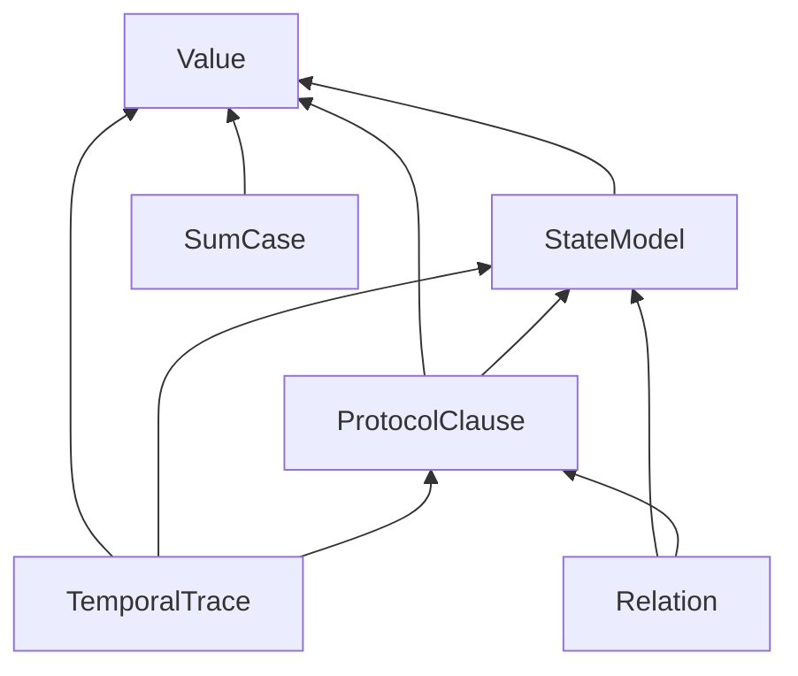
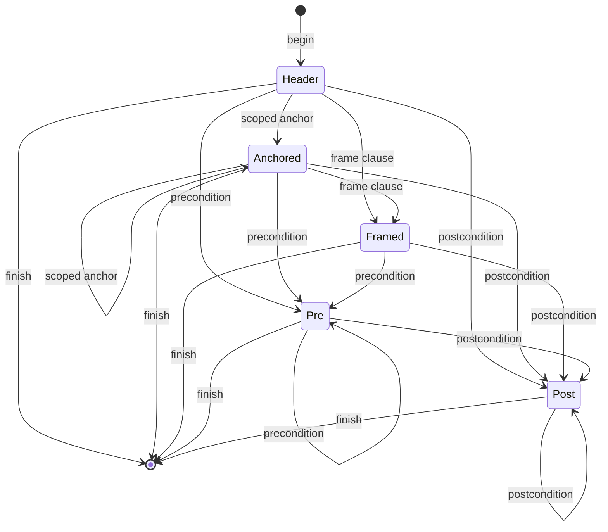

# ADR-012: Semantic-family extension and dispatch contracts (ARCH-11)

## Status

Proposed, 2026-09-19. Owning ticket: agent-ix/quire-spec-language#210
(ARCH-11), epic #205, Layer 1. Acceptance is decided at the architecture
change-scenario gate #212. Supersedes nothing.

This record is the `/specify` output for #210. Its `/spec-review` (all
analyses, SR-474 to SR-481) is in
[`spec/reviews/family-extension/`](../reviews/family-extension/base.md).

## Context

#210 requires QSL semantic families to extend the compiler and the proof
pipeline through declared interfaces, with no central method that consumes a
complete grammar and no dispatch on strings. Three records bound this
decision.

- [ADR-010](ADR-010-observed-architecture-baseline.md) is the observed
  baseline. It routes six findings (OBS-003, OBS-004, OBS-012, OBS-013,
  OBS-014, OBS-033), the capability authority DA-11 and the program item L1-D1
  to #210. Its §4.3 lists the dispatch sites, five of them on strings in
  production code. Code citations below use ADR-010's `QSL:<path>:<line>`
  form at its pinned revision de627b5.
- QSpec AD-016 (accepted) fixes the seven-arrow path for one family, function
  application, from source to native replay. It makes CG `negotiate_*` the
  single capability negotiation point, and it makes QSL admission
  language-only. This record applies AD-016's per-arrow contract to every
  family in #210's scope and does not reopen it.
- QSpec FR-290 and AD-010, as amended by QSpec PR #133 (merged, 818f555),
  restate the single negotiation point and its four terminal dispositions:
  `supported`, `requires-bound`, `unsupported` (warned) and `invalid-request`.

Sibling tickets own adjacent decisions. This record cites them as "decided in
#NNN" and does not decide them.

| Ticket | Owns |
|---|---|
| #209 | stages, stage edges, the crate and module DAG, and where each hook's code lives (ADR-011) |
| #211 | canonical types, identities, outcomes, refusals, provenance and version representations, and conversions (ADR-013) |
| #229 | the capability specification: the vocabulary (FR-290's kinds, as widened by QSpec #134), its identity, wire spelling and version rules, the absence policy, and how a family declares, a backend advertises and a request selects a capability. #229 consumes §6 and §7.1 of this record for the selection mechanics. |
| #213 | the canonical Rust `Capability` value type and the shared outcome types |
| #185 | the capability registry and routing; it alone implements them |
| #222 | the early boundedness design: finite, bounded and unbounded requests, the "available finite bound" predicate, and which bound representation #213 implements under #211's DA-12 ownership. It feeds #213, #188 and #189. |

This record designs the family contract and the selection mechanism. It
consumes the vocabulary and absence policy from #229, the `Capability` type
and outcome types from #213, the registry from #185 and the boundedness
design from #222.

Item citations use ADR-010's form: `ADR-010 OBS-nnn`, `ADR-010 DA-nn`,
`ADR-010 L1-D1`. Other records cite this record's closed seams as
`ADR-012 S<n>` (§5.1). In this record a bare `S<n>` is always a seam of
§5.1; ADR-011's stage and edge ids are always written `ADR-011 S<n>` and
`ADR-011 E<n>`. Rust names in this record (`FamilyKind`,
`FamilyContract`, `Requirements` and so on) are design names; the
implementing tickets choose the final spelling within the rules stated here.

## Decision

1. QSL semantic families form a closed set, `FamilyKind`, with six members
   (§1). The domain extent of a claim (finite, bounded or unbounded) is data
   every family records, not a seventh family (§1.1).
2. Every family implements one shared contract with six parts: identity,
   provenance, typing context, requirements, structured outcome and stage
   hooks (§2). Everything else is family-owned (§3).
3. A construct whose clauses have independent meaning is a typed node with one
   typed subnode per clause, checked through a staged builder (§4). A central
   `match` is legal only as a dispatch seam whose arms each make one call into
   family code.
4. Adding a variant to a closed enum fails the build at every seam listed in
   §5.1. At the open seam (backend registration), each §5.2 case yields its
   explicit outcome, never a first-wins or last-wins default.
5. Syntax admission, semantic admission, backend capability and runtime
   availability are four separate decisions with four owners (§6). None
   implies another.
6. The #185 registry computes candidate backends from a claim's capability
   kinds. The registry is an explicit value, independent of registration
   order and of ambient state. CG `negotiate_*` settles every disposition,
   including `requires-bound` and `unsupported` (§7). Solver absence yields
   the outcome decided in #229, never a hold and never a fallback.
7. The contract covers check, package, lower, execute or prove, witness and
   replay (§8), following AD-016's arrows.
8. Strings select semantics only at a listed edge, through one total
   conversion into a closed enum or a typed identity (§9).
9. The six routed findings and DA-11 are decided in §10. L1-D1 is decided in
   §11.
10. §12 gives the bounded change sets for a sum/case form, for a scoped frame
    clause and for a new backend.

## 1. Family catalogue

`FamilyKind` is a closed Rust enum. Each variant names one ownership unit:
the forms it parses, the checked nodes it produces, the diagnostics it emits
and the stage hooks it implements.

| `FamilyKind` | Scope in #210 | Depends on families | Design input | Implementation owners |
|---|---|---|---|---|
| `Value` | scalar and composite values, types, expressions, function application | none | none | #214 (function application), #120, #164, #170, #175 |
| `StateModel` | state, model population, lookup, inheritance, dispatch | `Value` | #220 | #120, #121, #164 |
| `SumCase` | sum types and `case` with its exhaustiveness obligation | `Value` | #221 | #187 |
| `TemporalTrace` | temporal and trace semantics, and the control-to-temporal mapping (QSpec FR-300, PR #59) | `Value`, `StateModel`, `ProtocolClause` | #222 | #188, #189 |
| `ProtocolClause` | protocols, clauses, frames, scoped anchors | `Value`, `StateModel` | #223 | #218 |
| `Relation` | refinement and model-to-implementation relations | `StateModel`, `ProtocolClause` | #223 | #191, #192, #198 |

The "Depends on families" column is a DAG. A family reads another family's
checked output only through that family's public checked types and the shared
context (§2). No family calls another family's checking or lowering
internals. Families are modules in the one QSL crate (ADR-011, #209), and the
module dependencies follow this DAG, which keeps it acyclic.

`SumCase` has no edge to `StateModel`. Variant payload types resolve through
the type environment in `CheckContext`, not through `StateModel` internals.
#187's prerequisite on #121 is therefore a sequencing edge, not a family edge.
This record leaves that edge in place because L1-D1 concerns #185 only.



### 1.1 Domain extent

Finite, bounded and unbounded domains cut across every family. No family owns
them. The extent vocabulary, the bound representation and the "available
finite bound" predicate are decided in #222. The mechanics below are fixed
here, and #212 can check them from this record alone.

- The family records each claim's declared extent, and any authored bound, as
  data in its `Requirements` (§2). This is recording, not a mode decision.
  The mode a backend runs in is settled by CG `negotiate_*` (AD-016 arrow 4,
  ADR-013 O-20).
- Backends advertise (capability kind, mode) pairs. Candidates are matched on
  capability kind alone (§7.2). `negotiate_*` compares the claim's extent with
  the candidate's advertised modes:
  - When the extent is within an advertised mode, it settles the form's own
    disposition.
  - When the extent is unbounded, the candidate advertises only bounded mode
    and a finite bound is available, it settles `requires-bound`.
  - When the extent is unbounded, the candidate advertises only bounded mode
    and no finite bound is available, it settles `unsupported`, warned.
  - It never settles `supported` for an unbounded extent on a bounded-only
    backend.
- An unbounded claim is never narrowed. A `requires-bound` item runs only
  after the caller supplies a bound. That makes a new bounded request with its
  own identity (AD-016 arrow 5).
- A bounded result reports the bound it held over. The report travels from IR
  `KaniOutcome` to the FR-331 accounting record and is never dropped.

#212 scenario 5 needs one input from #222: the "available finite bound"
predicate. #222 may produce it in parallel with #212.

## 2. Shared family contract

The shared contract is the minimum every family implements. It has six parts.

| Part | Contract | Representation owner |
|---|---|---|
| Identity | Every checked node carries a stable identity, minted by QSL at check time as a function of the node's normalized content and its declaration path. It is never a counter, a display string or a collection position. | decided in #211 (DA-01, DA-02) |
| Provenance | Every checked node maps to its source span through a source map keyed by that identity. QSL is the only minter (AD-016 arrow 1). | decided in #211 (DA-13) |
| Typing context | A family's `check` receives `&mut CheckContext`. Resolved declarations, the type environment and limits are read-only through it. The meter, the diagnostic sink and the scope stack are the only mutable parts. Nothing is read from global or thread-local state. | contents: this record; placement: the QSL `check` core (ADR-011, #209) |
| Requirements | A pure function of a checked node returns `Requirements`. Its entries are (capability kind, declared extent, authored bound). The capability set is non-empty by type. A claim that needs no backend capability yields no `Requirements` value. If such an item is requested for proof, it still reaches `negotiate_*` exactly once (§7.2). | kinds decided in #229, Rust type in #213; extent and bound decided in #222 |
| Structured outcome | A family `check` returns the checked node, a refusal with a family-typed cause, or `Incomplete` when a limit or the meter is exhausted. Each cause maps to a stable catalog code through one exhaustive `catalog_code()`. | outcome and refusal types decided in #211 (DA-09, DA-10) |
| Stage hooks | The family implements a hook for each stage in §8 that it takes part in. Every hook takes checked input; none takes CST, tokens or display strings. | this record |

Design-level shape of the contract:

```text
trait FamilyContract {
    const KIND: FamilyKind;
    type Form;              // parsed semantic form: typed subnodes (§4)
    type Checked;           // checked payload with identity and provenance
    type Cause: CatalogCoded;
    fn check(form: Self::Form, cx: &mut CheckContext)
        -> FamilyOutcome<Self::Checked, Self::Cause>;   // checked | refused | incomplete
    fn requirements(checked: &Self::Checked) -> Option<Requirements>;
    fn package(checked: &Self::Checked, out: &mut PackageEmitter)
        -> Result<(), PackageRefusal>;
}

trait ReferenceEvaluation: FamilyContract {
    fn evaluate(checked: &Self::Checked, env: &mut EvalEnv) -> Outcome<Value>;
}
```

Both traits are static contracts, implemented once per family and dispatched
through closed enums (§5). Neither is an object-safe plug-in interface, and no
code holds a `dyn` collection of families.

`ReferenceEvaluation` is implemented by every family except `Relation`, whose
gates run over compiled corpora. The S1 evaluation seam has an explicit
`Relation` arm. That arm returns a typed `unsupported` refusal with a catalog
code. It is not a stub that returns a fixed verdict.

`package` is all-or-nothing. A family either emits every v2 node for the item
or emits none and returns the refusal.

## 3. Family-owned responsibilities

Each family owns the following. The shared layer owns none of it.

| Responsibility | Family-owned contract |
|---|---|
| Parsing structure | The family owns its grammar productions and the typed `Form` they produce. The parser composes families through one closed entry table keyed by a closed leading-token kind enum. Each entry calls one family production function. The parser does not try productions in order and keep the first that succeeds. |
| Validation | Clause-level checks and cross-clause constraints, run through the family's builder (§4). |
| Normalization | Any canonical form the family needs, such as sorted variant sets or resolved frame targets. It runs inside the family's `check`, before identity is minted, so identity is taken over the normalized form. |
| Evaluation and lowering | The `evaluate` hook, the checked-package emission arm, and the family's arms in downstream IR, RT and CG seams (§8). |
| Diagnostics | A family `Cause` enum. Every variant has a catalog code in the vendored QSpec diagnostic catalog; the catalog version is decided in #211 (OBS-023). |
| Tests | Clause-level unit tests, builder ordering tests, the seam probe (§5.3), wire totality tests, and one absent-capability corpus case per capability the family requires (§7). |

The per-family assignment:

| Family | Parsing forms | Validation and normalization | Evaluation and lowering | Distinct diagnostics |
|---|---|---|---|---|
| `Value` | literals, operators, `let`, `if`, calls, records, collections, function declarations | typing, coercion, `Int[..]` range obligations, termination | `value::expression` evaluator; v2 value and expression nodes; IR `Operator`; RT exact ops; CG oracle arm | ill-typed, operator-ineligible, range, termination |
| `StateModel` | model declarations, populations, lookups, inheritance, dispatched calls | population extent, redefinition conflicts, dispatch preconditions, query-only restriction | model normalize and population evaluation; v2 `model` and `relation` nodes | missing-name, redefinition, dispatch-ineligible |
| `SumCase` | variant type declarations, variant construction, `case` with arms | arm pattern typing per arm; exhaustiveness as its own obligation | `case` evaluation; v2 variant and case nodes | non-exhaustive, unreachable arm, wrong variant |
| `TemporalTrace` | temporal formulas, intervals, clock roles, profiles; the control-to-temporal mapping over checked protocol operations | interval and window typing, profile facet admission | temporal evaluation over a trace; v2 temporal nodes | unbounded without facet, clock role, interval |
| `ProtocolClause` | protocols, operation clauses, frames, scoped anchors | clause ordering, frame target eligibility (FR-340), anchor scoping | protocol and state evaluation; v2 `state`/`frame` and clause nodes | frame target, anchor scope, clause order |
| `Relation` | refinement relations, abstraction relations from model elements to implementation state | relation totality over its declared domain; unbound-element refusal | corpus-differential gates; abstraction relation export in the checked package | unbound element, refinement violation |

## 4. Typed subnodes and staged builders

### 4.1 Rule

A construct whose clauses have independently meaningful semantics is parsed
into a typed node with one typed subnode per clause. It is checked by a staged
builder. No routine consumes and validates the construct's complete grammar in
one pass.

A clause has independent meaning when it has its own refusal causes, or its
own identity, or when a backend can accept or refuse it separately.
Preconditions, postconditions, frames, anchors, `case` arms, temporal
intervals and refinement premises all meet this test.

### 4.2 Builder shape

The builder is a runtime state machine over the construct's clause order. Its
one step function is `accept(state, clause) -> (state, ClauseResult)`. It
matches on the pair (current state, clause kind) with an explicit arm for
every pair and no `_` arm.

- An admitted pair checks exactly that clause with the clause's own function,
  and moves to the next state.
- A pair that is out of order returns a typed clause-order refusal and leaves
  the state unchanged.
- A clause that is in order but fails its own check returns its refusals and
  still advances the state, so the sibling clauses after it are checked.

`finish(state)` checks only the constraints that span clauses. It runs each
cross-clause check only when every clause that check reads was checked
successfully. A construct with any refusal emits no checked node (AD-016
arrow 1, "Rejected item → substitute? No").

The diagram shows the operation builder that §12.2 uses. It is illustrative.
The admitted clause sequences are the grammar's (QSpec FR-340 and the
operation clause grammar). Every state reached after `Header` may finish.



Builder rules:

- Clause order is encoded in the state machine. No sequencer inspects the
  clause list afterwards.
- Each clause check is a free function over that clause's `Form` and the
  context. A unit test drives it without building the enclosing construct.
- Diagnostics are ordered by builder state, then by source position within a
  state. The order is a property of the builder, so it can be tested.

### 4.3 Dispatch seams are thin

A central `match` over a closed form enum is a dispatch seam. It is legal
when every arm makes exactly one call into the owning family and holds no
semantic logic of its own.

The observed `infer_form` (`QSL:src/value/expression/check.rs:683-966`, about
280 lines) is a seam that also holds semantic logic, for both `Value` and
`StateModel` forms. #214 makes the function-application arms thin. The
remaining `Value` arms move with #120, #164, #170 and #175. The `StateModel`
arms (model lookup, population and dispatched call) move with #120, #121 and
#164 under #220's mapping (§14).

## 5. Exhaustive extension behaviour

### 5.1 Closed seams (compile-time failure)

Adding a variant to any of the following enums fails the build at every
listed seam.

| # | Closed enum | Seams that must fail to compile | Owner |
|---|---|---|---|
| S1 | `FamilyKind` | check dispatch, package emission dispatch, requirement derivation, reference evaluation dispatch (explicit `Relation` arm), `catalog_code()` family prefix | QSL (#214) |
| S2 | parsed form enum (for expressions, the one `Expression` enum) and the leading-token kind enum | parser entry table; check seam | QSL, owning family |
| S3 | checked node enum (today `NodeKind`) | evaluator, v2 emitter, requirement derivation | QSL, owning family |
| S4 | family `Cause` enums | `catalog_code()` | owning family |
| S5 | clause kind (canonical form decided in #211, DA-08 and DA-17) | QSL → IR conversion, IR → RT observation conversion, IR → CG obligation kind (AD-016 scenario 2) | QSL, IR, RT, CG |
| S6 | IR checked-node tag and semantic-form enums, decoded at v2 intake | IR `lower` arm; CG `negotiate_*` arm; CG harness arm; RT op selection. No vocabulary is re-derived from a wire string after intake. | IR (Contract IR #141), CG, RT |
| S7 | capability kind enum (#229 vocabulary, #213 type) | requirement derivation per family; registry advertisement check; CG `negotiate_*` capability arm | QSL (#213, #185), CG |
| S8 | IR `KaniOutcomeKind` and any later backend outcome enum | outcome → FR-331 result map (AD-016 arrow 6) | IR |
| S9 | CG backend kind enum (closed) | CG `negotiate_*` backend arm; CG artifact generation arm. Every capability is settled inside a `negotiate_*` arm over this enum; a new backend kind is a compile error until it has an arm. | CG (Codegen #86) |

These rules make the failure certain:

- No `match` at a listed seam has a `_` or catch-all arm. Seam modules deny
  `clippy::wildcard_enum_match_arm` and
  `clippy::match_wildcard_for_single_variants`, and the lint gate runs them.
- No S1–S9 enum is `#[non_exhaustive]`. A cross-crate match on a
  `#[non_exhaustive]` enum must have a `_` arm, which would defeat the seam.
- S9 is a settlement point by construction, not by coincidence. Today CG has
  one concrete function, `negotiate_kani_obligations`
  (`CG:src/kani_obligations.rs:454`). Codegen #86 makes settlement a
  `negotiate_*` arm over the closed S9 enum, with a test that fails when any
  capability is settled outside such an arm.
- S6 has one rule past intake: no vocabulary is re-derived from a wire string.
  Intake already decodes most tags once. The defect is the `as_str()` sites
  in IR `src/kani/` after intake (27 measured), which Contract IR #141
  removes.
- A downstream arm that cannot yet lower or prove a new variant is still an
  explicit arm. It returns `unsupported` with a catalog code, as AD-016 does
  for frames today. That arm is written by hand.

### 5.2 Open seam (explicit registry failure)

The set of registered backends is open at run time. Backends register with the
#185 registry, which fails explicitly in these cases and never by a first-wins
or last-wins default.

| Case | Behaviour |
|---|---|
| Two registrations with the same `BackendId` | registry construction refuses, naming the identity |
| A registration advertising a capability kind outside the #229 vocabulary | handled by #229's unknown-kind rule; this record adds nothing |
| A request naming a `BackendId` that is not registered | `negotiate_*` settles `invalid-request`, naming the unknown identity. A CLI argument naming it is refused at the CLI edge with the same identity named (§9), so no request is formed. |
| A requirement whose capability kinds no registrant advertises | empty candidate set; `negotiate_*` settles `unsupported`, warned (§7.3) |
| More than one registrant matches and the request names none | `negotiate_*` settles `invalid-request`, naming every candidate (§7.2) |

### 5.3 Evidence

- **Seam probe.** Each S1–S4 enum has a probe variant behind the cargo
  feature `seam-probe`, which the normal build never enables. An `xtask
  seam-probe` builds each affected crate with the feature and asserts that
  the set of rustc E0004 locations equals a checked-in list of seam functions,
  no more and no fewer. It runs in the full gate. #214 builds it for S1–S4.
  The owners of S5–S9 build the same probe in their repositories when those
  seams exist.
- **Mapping mutants.** AD-016's `cargo mutants` requirement covers the
  conversions at S1 and S4 (`catalog_code()`) and S5–S9.
- **Registry.** Under #185:
  - a property-based test that registries built from any permutation of the
    same descriptors are equal and give identical candidate sets;
  - a `cargo-deny` ban on `inventory`, `linkme` and `ctor`, and a lint gate
    that finds no `static`, `OnceLock` or `thread_local!` in the registry
    module;
  - one unit test per §5.2 row.

## 6. Four admissions

| Decision | Question | Owner and stage | Input → output | Failure | Does not imply |
|---|---|---|---|---|---|
| Syntax admission | Is this text a well-formed form of an admitted edition? | QSL parser; family productions | source → family `Form` | parse diagnostic; no form | that the form type-checks |
| Semantic admission | Is this form meaningful in the language? | QSL checker; family `check` | `Form` + `CheckContext` → checked node + `Requirements` | family refusal with catalog code, or `Incomplete`; no checked node | that any backend supports it |
| Backend capability | Which registered backends advertise the required capability kinds, and what is settled for the item? | candidates: the #185 registry, in the QSL `route` module (layer R), after ADR-011 S4 and before ADR-011 E7. Disposition: CG `negotiate_*` only (AD-016 arrow 4) | `Requirements` + registry → candidate set; candidate set + IR form → disposition | `unsupported` (warned), `requires-bound` or `invalid-request`, each settled by `negotiate_*` | that the backend's tool is installed |
| Runtime availability | Is the selected backend's tool present at the pinned version? | the executing adapter, after negotiation and before the run (CG for Kani) | backend descriptor → available tool identity or absence cause | solver-absence outcome (§7.4) | anything about language meaning |

Consequences of the separation:

- The checker never reads the registry. A checked package is the same bytes
  whatever backends are registered. This is AD-016's rule that QSL admission
  is language-only and negotiates nothing.
- The checker records `Requirements` as data, in AD-016 arrow 1's
  `capability_report`. Recording a requirement grants nothing.
- Registration never probes tools. One registry value gives the same
  candidates on machines with and without the tool.

## 7. Capability-based backend selection

### 7.1 Parties

| Party | Declares | Owner |
|---|---|---|
| Family | `Requirements` of each checked node (§2) | each family |
| Backend | `BackendDescriptor { id: BackendId, advertises: set of (capability kind, mode), tool: pinned tool identity }`. `BackendId` is a typed identity, never a display string. | the backend's repository; registered in #185 |
| Registry | a value built from descriptors; computes candidate sets and routes each `supported` item to its backend | #185 |
| Negotiator | the one per-item disposition, over the candidate set | CG `negotiate_*` arms over the closed backend kind S9 (AD-016; QSpec FR-290 and AD-010 as amended by PR #133; Codegen #86) |

The registry is an ordinary value, for example a `BTreeMap` keyed by
`BackendId`. The orchestrating binary builds it and passes it as an argument.
It is not a `static`, a `OnceLock`, a thread-local, or a link-time collection
(`inventory`, `linkme` or `ctor`). Two registries built from the same
descriptors in any order are equal and select identically.

The candidate and routing steps run in the QSL `route` module (layer R),
after ADR-011 S4 and before ADR-011 E7. The orchestrating binary is a separate crate
downstream of CG; #225 decides where it lives. It calls QSL for the checked
package and the `route` candidate sets, then calls CG with both. No QSL
library module depends on or calls CG (ADR-011).

### 7.2 Selection and negotiation

For each requested item the steps run once, in this order, before any backend
runs:

1. **Candidates.** The #185 registry computes the candidate set from the
   item's `Requirements`, matching on capability kind alone:
   - If the request names a registered `BackendId`, the set is that backend
     when it advertises every required capability kind, and empty otherwise.
   - If the request names an unregistered `BackendId`, the set is marked
     unknown-backend.
   - If the request names none, the set is every registrant that advertises
     every required capability kind.
   - An item with no `Requirements` has as candidates the named backend, or
     every registrant. The CG arm for its IR form then settles it; an IR form
     no backend proves settles `unsupported` with a catalog code. Every
     requested item reaches `negotiate_*` exactly once.
2. **Target-neutral IR.** IR lowers the checked item (AD-016 arrows 2 and 3).
3. **Negotiation.** CG `negotiate_*` receives the IR form, the item's extent
   and the candidate set, and settles exactly one disposition.
4. **Routing.** The registry routes each `supported` item to its one
   candidate's backend-specific generation, which follows target-neutral IR
   (AD-016 arrows 4 and 5). It routes nothing else.

| Candidate set | Disposition settled by `negotiate_*` |
|---|---|
| unknown-backend | `invalid-request`, naming the unknown `BackendId` |
| empty | `unsupported`, warned, naming every unmet capability kind (§7.3) |
| more than one, request names none | `invalid-request`, naming every candidate; the caller resolves it by naming a backend |
| exactly one | the CG `negotiate_*` arm for that backend's kind (seam S9), over the IR form and the extent rules of §1.1: `supported`, `requires-bound`, `unsupported` (warned) or `invalid-request` |

Every settlement is an arm of CG `negotiate_*`, whichever repository
implements the backend. A backend outside CG (for example the quire-analyze
implication backend, or a temporal backend for #188) contributes a descriptor,
a CG `negotiate_*` arm, and its own generation and runner. CG maps the
descriptor's `BackendId` to its closed backend kind through one total
conversion; an unknown identity is `invalid-request`.

Selection computes candidates and settles nothing. The candidate set never
depends on registration order, on display names or on ambient state. A routed
item is not re-routed later.

The candidate set reaches CG as a typed argument of the negotiation request.
Its wire form is a field of the QSpec FR-331 negotiation request, and QSpec
owns that field (§13.4).

### 7.3 Absent capability

An absent capability is an item whose candidate set is empty.

- `negotiate_*` settles it `unsupported` with a warning naming every unmet
  capability kind (FR-290 kinds as widened by QSpec #134), per QSpec FR-290-AC-4. The outcome constructor comes from
  #213 and the catalog code from #229.
- No backend is invoked, and no artifact is emitted for the item at any later
  stage.
- The outcome is never a refusal of the language form, never a success and
  never a hold.
- The accounting record joins it on `request_index`, like every other
  disposition. AD-016's completeness test on zero or two records applies.

### 7.4 Solver absence

Solver absence is a property of an item already settled `supported` and
routed.

- The adapter that would run the tool probes it after routing and before the
  run, and nowhere earlier. The probe checks that the tool is present and
  matches the descriptor's pinned tool identity (for Kani, the AD-016 tool
  pin).
- A missing tool or a pin mismatch is a typed absence cause. One exhaustive
  function maps it to the FR-331 result that #229 decides, with #222
  confirming its boundedness reading. IR `KaniOutcomeKind::Unavailable` is
  the observed carrier for Kani.
- The result names the backend, the expected tool identity and the claim.
- It is never a hold. There is no fallback to another backend and no
  downgrade to a weaker mode.
- Evidence: a fault-injection test runs with the tool missing from `PATH` and
  again with a mismatched pin. It asserts that the #229 outcome names the
  backend, the tool identity and the claim, that no other candidate runs, and
  that no probe runs before routing. It replaces the `expect` panic in IT-010
  (ADR-010 §2.1) and belongs to Codegen #86 (§14.1).

## 8. Stage coverage

The contract spans six stages. The arrow numbers are AD-016's.

| Stage | AD-016 arrow | Family hook | Owner | Closed seams | Absent capability or unsupported form |
|---|---|---|---|---|---|
| Check | 1 | `check`, `requirements` | QSL family | S1–S4, S7 | not consulted; requirements recorded as data |
| Package | 2 | `package` (checked-package/v2 emission arm, all-or-nothing) | QSL family; wire in QSpec | S1, S3 | requirements carried in `capability_report`, not dropped |
| Lower | 2, 3 | IR `lower` arm per (tag, form); RT op selection | IR, RT | S5, S6 | explicit `unsupported` arm with catalog code |
| Execute or prove | 4, 5 | candidates and routing (#185, §7.2); CG `negotiate_*` and harness arm per IR form and backend kind; `evaluate` for native execution | #185, CG, QSL | S6, S7, S9 | every disposition from `negotiate_*` (§7.2, §7.3); solver absence after routing (§7.4) |
| Witness | 6 | the family's witness binding schema, derived from the obligation identity's arguments; the payload is the FR-351 record unchanged | IR (packet and witness), CG (schema) | S8 | no packet without a counterexample; no placeholder witness |
| Replay | 7 | the family's `evaluate` hook, reached through the QSL complete-V1 executor | CG reconstruction; QSL executor | S1, S3 | refused decode yields no verdict; disagreement is `inconclusive` with a typed cause |

Two rules apply at every stage.

- A hook takes checked input or a versioned checked package. No stage
  reparses QSL text, CST, display strings or diagnostics to recover
  semantics.
- An item refused, or settled `requires-bound`, `unsupported` or
  `invalid-request`, emits no substitute artifact at any later stage (AD-016
  terminal-disposition rule).

Each family result maps to the #211 outcome categories through the three
outcome families of ADR-013 O-16. `check` refusals are the refusal category.
`Incomplete` is the incomplete category. `evaluate` returns the kernel
`Outcome<T>`. Dispositions come from CG. Proof results come from IR's
`KaniOutcomeKind` map. No family adds a category.

The shape of the witness envelope and the replay request and result is
decided in #211 and implemented in #231. The replay executor's key, which
AD-016 names as `function: &str`, is an identity decided in #211 (§13.2).

## 9. String dispatch

Rule: a string may select semantics only at a listed edge. At an edge, one
total conversion turns it into a closed enum or a typed identity, or refuses
it with a typed cause. A typed identity over an open set (a `BackendId`) is
resolved by a lookup in the registry value, and an unknown name is refused
with a cause naming it. After the edge, no code compares a string to choose
behaviour.

The edges are:

- source lexing, where keywords become closed leading-token kinds;
- the typed v2 reader and the other wire readers named in the table;
- the protocol-artifact and state-input intake readers;
- CLI argument parsing.

An unknown wire tag is a typed refusal of the v2 reader, never a skipped node.
Each edge function carries the marker attribute `#[string_edge]`, a tool
attribute. An `xtask string-edge` scan over the QSL crates reports every string
comparison or string `match` outside a marked function, and runs in the lint
gate. #214 builds the attribute and the scan.

| Site (ADR-010 §4.3, OBS-014, OBS-033) | OBS-014 site | Decision | Owner |
|---|---|---|---|
| `"allocation"` relationship category (`QSL:src/model/systems.rs:269`) | yes | typed category enum; QSL PR #200 removes the string | QSL `StateModel` |
| `"quire.protocol.finite-global/v1"` (`QSL:src/protocol_artifact/validate.rs:287,291`) | yes | typed profile enum decoded once at protocol-artifact intake | QSL `ProtocolClause` |
| `"filament-canonical-json-1"` (`QSL:src/state/evaluation.rs:2478-2484`) | yes | typed canonicalization enum decoded at state-input intake | QSL `StateModel` |
| `"quire.state.authority-adapter"` (`QSL:src/state/evaluation.rs:2781-2783`) | yes | typed adapter-kind enum decoded at intake | QSL `StateModel` |
| `"clock:"` prefix (`QSL:src/temporal.rs:50`) | yes | a typed clock-role variant in the temporal form; the prefix is parsed once, at lexing | QSL `TemporalTrace` |
| composed `Backend{identity: &str}` (`QSL:src/linking/composed/requests.rs:80`) | no | removed from the linker; candidates use `BackendId` in the #185 registry (§7) | #185 |
| value call by function name `&str` (`QSL:src/value/expression/mod.rs:635`) | no | keyed by checked declaration identity; the identity type is decided in #211 | #214 |
| `--target` (`QSL:src/lowering/target.rs:39-46`) | no | already an edge conversion: a total `FromStr` into the closed `ProjectionTarget` enum. Its three values are QSL lowering domains, not backends, and stay a closed QSL enum beside the registry. Backend choice is a separate CLI argument resolved to `BackendId` by registry lookup. | QSL lowering; #185 for the backend argument |
| `CapabilityId(String)` (`QSL:src/complete/package.rs:690`) | no | replaced by the #213 capability type | #213 |
| IR `CheckedNodeTag::from_wire`, `required_by(tag, form: &str)`, `DispatchIndex::resolve(&str)`, and the `as_str()` sites in IR `src/kani/` | no | wire strings decoded at v2 intake into closed tag and form enums; no vocabulary re-derived from a wire string after intake | Contract IR #141 |
| CG `semantic_form == "call"`, `node_tag == "state" && semantic_form == "frame"` | no | CG matches on IR's enums (seam S6) | CG (Codegen #86) |
| RT function lookup by name | no | keyed by checked declaration identity, as for QSL | RT |

The IR, CG and RT rows describe code in those repositories. This record
states the contract; the change belongs to their own tickets (§14).

## 10. Findings and DA-11 decided

| Item | Decision |
|---|---|
| ADR-010 OBS-003 | The composed linker performs no backend negotiation. `requests::report` records requests as data and has no `Backend` parameter, no `UnsupportedCapability` disposition and no `UnsupportedFamily` disposition. Candidates and routing live only in the #185 registry, and dispositions only in CG `negotiate_*` (§7). #185 implements the removal unconditionally: four-kind compatibility is refused as unsupported (owner ruling on #229, recorded in QSpec #134). QSL FR-036 (line 97, AC-5, AC-6) and TC-115 change with it (§14). |
| ADR-010 OBS-004 | `negotiate_integer_division`, `negotiate_ieee` and `IeeeBackendCapabilities` are RT capability predicates (AD-016 arrow 3). A CG `negotiate_*` arm may take them as inputs (arrow 4, WP7 open), but they are not settlement points and settle no disposition; today CG calls neither (Codegen #86). CG `negotiate_*` arms over S9 are the only settlement points. QSL has no copy of them; #185 removes the QSL copies, as ADR-010 §7 maps OBS-004. QSL value semantics keep their evaluation functions, which are not negotiation. |
| ADR-010 OBS-012 | "Capability" has one meaning: the requirement kind that semantic admission records as `capability_report` data (AD-016 arrow 1), from the #229 vocabulary. This is how this record reads AD-016's row "QSL `Capability` = language admission": the values are recorded during admission and decide nothing. The QSL four-variant request label enum is replaced by the #213 type. IR `CheckedCapability`, `CapabilityDisposition` and `OutputCapability`, and CG `ObligationDisposition`, are dispositions or output kinds. They stay layer-owned, with total conversions (AD-016 shared-type strategy). |
| ADR-010 OBS-013 | The Kani backend is one `BackendDescriptor` in the #185 registry. Its implementation is CG (harness and its `negotiate_*` arm) plus IR (outcome), per AD-016. QSL owns the registry, not the backend. FR-290's wording "quire-spec-language's Kani backend" is corrected by QSpec #134 (scope item 5). |
| ADR-010 OBS-014 | The five production string sites are the rows marked "yes" in §9. Each is typed at its intake edge. |
| ADR-010 OBS-033 | Cross-repository dispatch is on closed enums decoded at v2 intake; no vocabulary is re-derived from a wire string after intake (§9, seams S6 and S9). The enum sets follow the vocabulary as widened by QSpec #134. Contract IR #141 and Codegen #86 implement it; RT owns its edits. |
| ADR-010 DA-11 | One authority per role. Vocabulary: #229, over QSpec FR-290 as widened by QSpec #134. Rust type: #213. Requirement derivation: each family's `requirements` hook. Advertisement: each backend's descriptor. Registry and routing: #185, using the candidate mechanism in §7.2. Per-item disposition: CG `negotiate_*` only. Runtime availability: the executing adapter. #210 owns DA-11; #229 is its secondary owner for the vocabulary. |
| QSpec PR #59 (FR-300, deferred to #210 by ADR-010 §8) | The control-to-temporal mapping belongs to `TemporalTrace`, which reads checked `ProtocolClause` output (§1). PR #59 does not wait on #210. Its QSL consumer is #188. |

## 11. L1-D1: which ladder tickets wait on #185

Test used: a ticket waits on #185 if and only if one of its exit criteria
needs a candidate set from the #185 registry. Any ticket that waits on #185
also waits on Codegen #86, which makes `negotiate_*` take the candidate set
(§14), because only `negotiate_*` settles the outcome. The same holds for
#185's own exit criterion.

| Ticket | Waits on #185? | Waits instead on | Reason |
|---|---|---|---|
| #186 (A09) | No, relaxed | #231 | State `forall` witness on `native-run-result/2`, produced by the native reference runtime. No solver, no routing. The witness payload is the FR-351 record unchanged. |
| #187 (A10) | No, relaxed | #212, #214 | Sum types and `case` are semantic admission and reference evaluation in `SumCase`. Exhaustiveness is a checker obligation with its own refusal, not a backend claim. It needs the S1–S4 seams from #214. Proof lowering of sum/case is later work. |
| #188 (A11) | Yes, kept | n/a | Its exit criterion "with no backend registered it settles `unsupported` with the warning" needs the empty candidate set from #185 and the CG `negotiate_*` change. Profile and facet work may start earlier; closure waits. Its boundedness is decided in #222. |
| #189 (A12) | Yes, kept | n/a | Its exit criterion "a claim over an unbounded collection settles `unsupported` with the warning" needs a #185 candidate set and the §1.1 extent rule in CG `negotiate_*`. Declaration admission may start earlier; closure waits. Its bound semantics are decided in #222. |
| #191 (A13) | No, relaxed | #212 | Corpus-differential `xtask` gate; no family hook, no solver, no routing. It shares QSpec #116 with #185 but does not consume #185. |
| #192 (A14) | No, relaxed | #212 | Same as #191, for profile layering. |
| #198 (A15) | No, relaxed | #212, #214 | Declares, checks and exports the abstraction relation. Its emission request is a checked-package export request and names no `BackendId`. The unbound-element refusal is a checker or export refusal. Kani and Verus consumption of the relation stays after #185 as backend breadth. |

The "Woven in after" order among the ladder rungs is sequencing for a single
writer. Where it runs through #185, it is not a technical prerequisite for the
five relaxed tickets. Outside the ladder, #217 and #223 keep their dependency
on #185. This record edits no issue; the owner applies the edges after #212
(§14.2).

## 12. Representative change sets

Each table lists the full touch set. A row outside the table is a defect in
this design and reopens #210 at #212. #212 checks each row by inspection
against the #209 module map. The landing PRs of #187 and #218 are checked to
change only paths inside the modules their table names.

### 12.1 Add a sum type and an exhaustive `case`

Normative input: QSpec #115 (spelling, FR-143 and FR-146 at `1-draft.4`).
The capability kind of a sum/case proof claim is decided by #229 with QSpec #134 (scope item 2; §13.3 Q3). The table
covers admission, evaluation and packaging, which need no capability kind.

| Stage | Change | Seam forced |
|---|---|---|
| Canonical type | add the sum type descriptor to the canonical type (decided in #211, DA-05) | type `match`es at S3 and S6 |
| Parse | `SumCase` productions: variant declaration and `case` with arms; one leading-token kind and one entry in the parser entry table | S2 |
| Form | `CaseForm { scrutinee, arms: Vec<ArmForm> }` and `ArmForm { pattern, body }` typed subnodes | S2 |
| Check | builder: scrutinee → each arm (pattern typed against the scrutinee's variants, independently) → `finish` runs the exhaustiveness obligation as its own check with its own cause | S1, S4 |
| Diagnostics | codes for non-exhaustive, unreachable arm and wrong variant in the QSpec `native-diagnostics.md` catalog, then a QSL re-vendor | S4 |
| Checked node | `Case` variant in the checked node enum | S3 |
| Requirements | none; the existing `Value` requirements of the arm bodies apply | none |
| Evaluate | `case` arm selection by variant identity | S3 |
| Package | v2 emission arm for variant and case nodes | S1, S3 |
| QSpec wire | variant and case node spelling in the checked-package/v2 schema (QSpec #115); a new v2 node kind is a v2 wire version change decided in #211 | none in QSL |
| IR | tag and form enum variants; an explicit `unsupported` lower arm until the IR form exists | S6 |
| CG | explicit `negotiate_*` arm returning `unsupported` with a catalog code until a harness exists | S6 |
| RT | variant value operation, when lowering lands | S6 |
| Witness, replay | none while the item settles `unsupported`. When a harness exists: the variant witness binding schema, and replay through the `SumCase` `evaluate` arm | S8 |

Tests: arm-level unit tests; the non-exhaustive `case` refusal; the
unreachable-arm refusal; builder diagnostic order; `case` evaluation on each
variant; a v2 round trip; one typed `unsupported` ledger case downstream. No
other family's module changes.

### 12.2 Add a scoped frame clause to a protocol operation

Normative input: QSpec FR-340 (frame body) and QSpec #101 and #106. The
Requirements row depends on the kind #229 with QSpec #134 (scope item 2) assigns (§13.3 Q3).

| Stage | Change | Seam forced |
|---|---|---|
| Clause kind | add `Frame` and `ScopedAnchor` to the canonical clause kind (decided in #211, DA-08 and DA-17) | S5 in QSL, IR, RT and CG |
| Parse | `ProtocolClause` productions for `frame` with `modifies`, `creates`, `deletes`, and for the scoped anchor | S2 |
| Form | `FrameForm { modifies, creates, deletes }`, each a list of reference forms; `ScopedAnchorForm { scope, anchor }` | S2 |
| Check | builder transitions into `Anchored` and `Framed` (§4.2): each anchor checked by its own scope function; each frame member resolved to node identities and checked against FR-340 eligibility on its own; `finish` checks that postcondition writes fall inside `modifies` | S1, S4 |
| Diagnostics | FR-340 frame and anchor cause codes in the QSpec `native-diagnostics.md` catalog, then a QSL re-vendor | S4 |
| Checked node | `Frame` and `ScopedAnchor` subnodes of the operation node | S3 |
| Requirements | the frame obligation's capability kind, if #229 with QSpec #134 assigns one (§13.3 Q3); otherwise none | S7 only if a kind is added |
| Evaluate | runtime frame check, `frame_violation`/`unauthorized-change` | S3 |
| Package | v2 `state`/`frame` node (FR-340); a v2 wire version change decided in #211 | S1, S3 |
| IR, CG | explicit `unsupported` arms until IR #109 and CG #49 land (AD-016 "Frames and unbounded constructs") | S6 |
| Witness, replay | none while the item settles `unsupported`. When IR #109 and CG #49 land: the frame witness binding schema and frame counterexample replay through the `ProtocolClause` `evaluate` arm (#218) | S8 |

Tests: frame member eligibility, one refusal per FR-340 cause; anchor scope
refusal; out-of-order clause refusal from the builder; cross-clause write
containment; runtime `frame_violation` evaluation; typed `unsupported` ledger
test; the absent-capability corpus case when a kind is assigned. No `Value`,
`SumCase` or `TemporalTrace` module changes.

### 12.3 Add a backend

| Stage | Change | Seam forced |
|---|---|---|
| Descriptor | one `BackendDescriptor` (identity, advertised (capability kind, mode) pairs, pinned tool) in the backend's repository | none |
| Registration | the orchestrating binary adds the descriptor to the registry value | none (§5.2 failures apply) |
| CG | one backend kind variant, its `negotiate_*` arm and its generation arm | S9 |
| Runner | the backend's runner and its availability probe (§7.4) | none |
| Outcome | the backend outcome enum and its FR-331 map | S8 |
| Replay | replay through the existing QSL `evaluate` hooks, if the backend emits counterexamples | none |

No QSL parser, checker, family or checked-package change. This is #212
scenario 7.

## 13. Questions for siblings and the owner

### 13.1 For #209 (answered by ADR-011, QSL PR #235)

| Question | ADR-011 answer, adopted here |
|---|---|
| Stage and crate of the #185 candidate and routing steps (§7.2) | the QSL `route` module (layer R), after ADR-011 S4 and before ADR-011 E7; CG `negotiate_*` settles |
| No QSL library crate calls CG (§7.1) | confirmed; the orchestrating binary is a separate crate downstream of CG, placed by #225 |
| Family DAG placement (§1) | families are modules in the one QSL crate |
| `CheckContext` placement (§2) | the `check` core |

### 13.2 For #211

1. The replay executor key: AD-016 names `CheckedPackage::call(function:
   &str, …)`. Is the key the declared qualified name or the checked node
   identity? §9 requires one of them, typed. Changing it amends AD-016 arrow
   7, so a QSpec issue must carry that amendment.
2. The canonical clause kind that S5 extends: which of the two QSL
   `ClauseKind` types, the IR type or the RT type is canonical, and which
   conversions are total?
3. The family refusal type: one shared refusal with a family cause enum, or a
   per-family refusal type joined by `catalog_code()`?
4. Where the sum type descriptor lives in the canonical type (§12.1), and the
   wire representation of `BackendId` in the counterexample packet and the
   replay request (ADR-013 O-19).

### 13.3 For #229

1. The outcome for solver absence (§7.4), its catalog code and its FR-331
   result, confirmed with #222.
2. Whether backends advertise a mode beside each capability kind (#229 with
   QSpec #134, scope item 3). §7 needs (capability kind, mode)
   advertisements; it does not need the mode inside the vocabulary.
3. The frame obligation and the sum/case claim: which kinds, if any, do they
   require (#229 with QSpec #134, scope item 2)? §12.1 and §12.2 are
   conditional on this answer, and it must be settled before #212 judges
   scenarios 2 and 3.

Answered: four-kind compatibility is refused as unsupported (owner ruling on
#229, QSpec #134 non-goals), so this record designs no reader. The FR-290 Kani
wording (OBS-013) is QSpec #134 scope item 5.

### 13.4 Owner questions

1. QSpec #134 widens FR-290 to value, state, replay and temporal claims and
   adds the FR-331 candidate set. #212 needs #134 settled, because §7 cannot
   select a backend for the #217 function exemplar without a kind. Owner:
   #229 with QSpec.
2. The candidate set crosses to CG as a field of the FR-331 negotiation
   request (§7.2). QSpec #134 carries it; confirm that #134 owns the field.

Answered: when more than one backend matches and the request names none, the
item settles `invalid-request` with no preference order (QSpec #134 scope
item 6, §7.2).

### 13.5 Answers to sibling questions

| Question | Answer |
|---|---|
| ADR-011: per-stage hooks and how a missing hook fails | Hooks per stage (§2, §8): ADR-011 S2 family form builder, ADR-011 S3 `check` and `requirements`, ADR-011 S4 `package`, ADR-011 S6a `evaluate` (`ReferenceEvaluation`). A missing hook is a compile error: every S1 dispatch seam has one arm per family and no `_` arm (§5.1). A family that does not take part in a stage has an explicit, hand-written arm returning a typed `unsupported` refusal with a catalog code; that is a refusal at run time, never a silent skip. |
| ADR-011: what ADR-011 S3 records in `capability_report` | exactly one entry per checked item that has `Requirements`, keyed by the item's checked identity. Each entry holds the capability kinds (vocabulary per #229 and QSpec #134), the declared extent and the authored bound (#222). Nothing else: no backend, candidate or disposition, because ADR-011 S3 negotiates nothing (§2, §6). |
| ADR-011: v2 family forms replacing IR's admission of QSL types | predicate admission reads the v2 value and expression nodes emitted by the `Value` `package` hook; temporal admission reads the v2 temporal nodes emitted by the `TemporalTrace` `package` hook. QSpec owns their spelling. IR decodes them at v2 intake (Contract IR #141) and admits them there (#218 and #223 with IR #109). |
| ADR-013 Q210-1: capability wire spelling and version; backend identity value | spelling and version decided in #229; `BackendId` representation decided in #211 (§13.2 Q4) |
| ADR-013 Q210-2 and O-20: mode vocabulary | QSL records the declared extent and bound as data; CG `negotiate_*` settles the mode (§1.1), as O-20 says. The mode and extent vocabulary and its rules are decided in #222, not #210; this record fixes only the selection mechanics that use them. #211 is asked to change O-20's Owner row to "decided in #222". |
| ADR-013 Q210-3: family results → O-16 categories | §8: refusal, incomplete, kernel `Outcome<T>`, CG dispositions and the IR proof map. No family adds a category. |
| ADR-013 Q210-4: family witness payloads | confirmed: the FR-351 record unchanged; a family contributes only its binding schema (§8) |

## 14. Work this record hands on

### 14.1 Implementation

| Work | Ticket |
|---|---|
| `FamilyKind`, `FamilyContract`, `ReferenceEvaluation`, seams S1–S4, the seam probe, the thin check seam for function application, the `#[string_edge]` attribute and `xtask string-edge` scan | #214 |
| Capability type and outcome constructors for §7.3 and §7.4 | #213 |
| Registry value, `BackendDescriptor`, candidate sets and routing (§7.2), the S7 registry arm and its seam probe, removal of the composed-linker negotiation, removal of the QSL `negotiate_*` copies from `value::ieee` and `value::division` (OBS-004), registry evidence (§5.3) | #185 |
| QSL FR-036 amendment (line 97, AC-5, AC-6: requests recorded as data; dispositions in CG `negotiate_*`) and the TC-115 rewrite, through `/specify` before #185 starts | #185 |
| `negotiate_*` taking the candidate set and extent (§7.2, §1.1), backend kind enum S9, the solver-absence fault-injection test (§7.4), CG S6 enum matches | Codegen #86 (the last two are §14.2 amendments to #86); #185 exit, #188, #189 and #217 wait on it. #86's S6 matches wait on Contract IR #141. #86 and #141 take their S6, S7 and S9 variant sets from QSpec #134. |
| Remaining `Value` forms | #120, #164, #170, #175 |
| `StateModel` migration, including the `StateModel` arms of `infer_form` | #120, #121, #164 via #220 |
| `SumCase` | #187 via #221 |
| `TemporalTrace`, including the FR-300 mapping | #188, #189 via #222 |
| `ProtocolClause` | #218 via #223 |
| `Relation` | #191, #192, #198 via #223 |
| IR tag and form enums decoded at v2 intake; removal of the post-intake `as_str()` sites in IR `src/kani/` | Contract IR #141 |
| CG enum matches in place of string compares | Codegen #86 |
| RT enum matches in place of string compares | RT ticket, to be opened by the RT owner |

Requirements needed before implementation starts:

- #185: the FR-036 amendment above, and a registry FR over #229's
  specification.
- #213: the capability and outcome FRs from #229 and #211.
- #214: an FR for the family contract and the seam probe, derived from §2,
  §4 and §5.

### 14.2 Issue-body amendments for the owner after #212

- #185: add the composed-linker removal, the QSL `negotiate_*` copy removal,
  the FR-036 amendment and the registry evidence.
- #214: add the seam probe and the string-edge scan; state that only the
  function-application arms of `infer_form` are in scope.
- #186, #187, #191, #192, #198: replace the #185 edge with the §11 "Waits
  instead on" edges.
- #185 (exit), #188, #189, #217: add Codegen #86 as a prerequisite.
- #86: add the solver-absence fault-injection test and the CG S6 enum matches;
  add Contract IR #141 and QSpec #134 as prerequisites. #141: add QSpec #134
  as a prerequisite.
- #212: add #229 and QSpec #134 as prerequisites. #212 judges scenarios 5
  and 7 on Codegen #86 and Contract IR #141 being open with this record's
  scope; their landing is an implementation exit, not a gate condition.
- The exit cases of #185, #188 and #189 that need a disposition run in a test
  harness downstream of CG, so they need no #225 edge.

## Consequences

- #212 can apply scenario 2 (sum type and case) and scenario 3 (protocol
  clause with a frame) against §12.1 and §12.2, scenario 5 (unbounded proof
  request) against §1.1 and §7.2, and scenario 7 (a backend without syntax or
  checking authority) against §6, §7 and §12.3.

| #212 scenario | Evidence |
|---|---|
| 2 sum type and case | §12.1 tests; seam probe at S1–S4 |
| 3 frame clause | §12.2 tests; S5 seam probes in QSL, IR, RT and CG |
| 5 unbounded proof request | CG `negotiate_*` tests: `requires-bound` with an available bound, `unsupported` (warned) without one, never `supported`; the bound round trip from IR `KaniOutcome` to the FR-331 record |
| 7 new backend | §12.3 touch set; a metamorphic test that the checked package has the same bytes with and without the new descriptor registered |

- A new family or form costs one family module plus compiler-forced arms. A
  new backend costs one descriptor plus one CG `negotiate_*` arm and its
  runner. Neither edits the checker.
- The checked package does not vary with installed backends, so the same
  package is reproducible across machines.
- The five production string-dispatch sites and the composed-linker
  negotiation are removed, not kept beside the typed paths.
- An ambiguous request settles `invalid-request`. Callers with two matching
  backends name one.

## Alternatives Considered

- **Open plug-in families behind `dyn FamilyContract`, registered at link
  time.** Rejected. Adding a variant would no longer fail the build, and
  dispatch would depend on registration and ambient state, which #210
  forbids.
- **One visitor that walks the whole grammar per stage.** Rejected. It is the
  monolithic routine the handoff rule forbids; clause order and diagnostics
  would be testable only through complete constructs.
- **Dispositions settled by the registry, or by a negotiator in each backend
  repository.** Rejected. Either adds a second negotiation point beside CG
  `negotiate_*`, which AD-016 and QSpec PR #133 forbid.
- **Candidates matched on (capability kind, mode).** Rejected. An unbounded
  claim would find no bounded-only backend, and `requires-bound` could never
  be settled.
- **Selection inside the checker.** Rejected. It makes the checked package
  depend on installed backends and contradicts AD-016's language-only
  admission.
- **First-registered backend wins on ambiguity.** Rejected. It is dispatch on
  registration order.
- **Fall back to another backend when the selected tool is absent.**
  Rejected. It turns runtime availability into a hidden change of the proof
  claim, and the program forbids fallbacks.
- **Treat unbounded mode as a seventh family.** Rejected. Every family can
  have unbounded claims, so extent is data of the requirement, not an
  ownership unit.
