# ADR-013: Canonical type, package and conversion ownership (ARCH-12)

## Status

Proposed, 2026-09-19. Owning ticket: agent-ix/quire-spec-language#211
(ARCH-12), epic #205, Layer 1. Acceptance is decided at the architecture
change-scenario gate #212. Supersedes nothing. A #209, #210, #222 or #229
decision that contradicts a §3 cell reopens that cell and no other.

## Context

[ADR-010](ADR-010-observed-architecture-baseline.md) records the architecture as
implemented and routes 16 findings and 17 duplicate or ambiguous authorities to
#211 as primary owner, and five findings as secondary owner (ADR-010 §9.2,
§9.3). This record decides them. DA-11 (Capabilities) belongs to #210, with
#229 owning the vocabulary; this record states only where capability values
cross a boundary (O-19).

Inputs this record builds on:

- **AD-016** (QSpec, accepted): the seven-arrow extension path, the Shared-type
  strategy table and Owner decisions 1–6. The `quire-exact` kernel lives in the
  QSL repository (Owner decision 2); `quire.checked-package/v2` is the only QSL
  → Contract IR seam; replay places the packet in IR, reconstruction in CG and
  the executor at QSL complete-V1 `value::expression::CheckedPackage::call`
  (Owner decision 3); renames of `CanonicalDigest`, `DeclarationKey` and
  `CheckedPackage` are deferred until the owner asks (Owner decision 6). This
  record proposes no rename. Five cells of this record differ from accepted
  AD-016 text; each is listed in §8 OQ-3 as a QSpec amendment, and the
  affected implementation waits for it (§7).
- **QSpec contracts**: FR-201 (identity-domain vocabulary), FR-321 (model
  selection), FR-322 (`quire.checked-package/v2`), FR-323
  (`quire.native-runtime/v1`), FR-331 (`quire.backend-provider/v1`), FR-351
  (separating witness record), FR-352 (`native-run-result/2`), AD-014, and the
  `proposals/checked-package-v2/` schemas and vectors that FR-322 names as its
  normative transport.
- **Witness fact**: IR PR #139 at head `417ec86` (open) defines `Witness` with
  one stored field, `transcript`. Harness symbol, check kind, check text and
  concrete values are methods that re-derive their answer from `transcript` on
  every call. This record adopts that as the witness ownership decision (O-25)
  and adds admission-time validation.

Sibling Layer 1 tickets are authored in parallel. #209 decides stages, stage
order and the crate/module DAG. #210 decides family contracts and capability
selection. #222 decides boundedness. #229 decides capability vocabulary and wire
spelling. Where this record needs one of their decisions it writes "decided in
#NNN" and lists the question in §8.

## Decision

Item ids `R-`, `O-`, `C-`, `S-`, `QC-`, `Q209-`, `Q210-`, `Q222-`, `Q229-` and
`OQ-` are local to this record. Other artifacts cite them as `ADR-013 O-nn`, the
same form ADR-010 uses for its `OBS-` and `DA-` ids.

### 1. Ownership rules

| ID | Rule |
| --- | --- |
| R-01 | Every concept in §3 has exactly one canonical owner per layer: one repository, one stage and one public type. Where a §3 object names two layers (for example clause in QSL and obligation in CG), each layer's type is listed with its owner, and the types are joined by a named conversion in §4. Lane-private types (§6) are outside this rule and fall under R-09. |
| R-02 | A normative cross-repository wire is authored in QSpec. The producing and consuming repositories implement it and never extend it locally. A missing wire member is a QSpec change (§8 QC table), not a local field. A Rust API that one repository links from another (IR types used by CG) is owned by the defining repository; its serialized form, where one exists, is a QSpec contract. |
| R-03 | QSL-internal compiler representations are QSL-owned. Contract IR, Runtime and Codegen keep a local representation only where §4 names the conversion and its test. |
| R-04 | Identity equality is one of four kinds (§2). Each §3 object names its kind or states that it is not an identity. Two identities in different FR-201 digest domains are unequal whatever their bytes. |
| R-05 | No consumer derives semantic identity from display text, diagnostic text, rendering, registration order, or the index of an item in a collection whose order no declaration defines (for example a hash-map iteration, a parse-result vector or a transcript's row order). A position is identity only where a declaration defines it (a tuple position, a parameter position). An encoding order, such as Kani's `concrete_vals` rows, is resolved only by joining it with a declared schema that names every position. |
| R-06 | A name is an identifier or qualified name in source or on a wire. After a package's check stage no consumer of that package resolves a name. The checker resolves names to checked node ids, and a later stage selects by node id. An importing package's checker resolving a library export by FR-322 `declaration.qualified_name` is that package's own check stage. |
| R-07 | A conversion is total over its admitted input: the values that pass the source contract's reader and schema. It refuses everything else with a typed cause and a catalog code. It drops no identity, provenance, version or bound. A target that cannot represent a source value refuses; it never truncates, rounds, defaults or approximates. |
| R-08 | A serialized contract has one version per build. The producer fixes the version in the artifact. A reader accepts exactly its version and refuses any other with an explicit unsupported-version refusal. No reader for another version, no inferred version and no adapter between versions exists (§5). |
| R-09 | A representation that §6 lists as lane-private carries no canonical authority. No conversion to or from a canonical type is defined for it, and no consumer added after this record is accepted uses it. Its deletion follows its lane's disposition, decided in #209. The #226 drift gate enforces the no-new-consumer rule. |
| R-10 | Checked typestate is constructed only by the QSL checker. Bytes read from any wire, including QSL's own emitted v2 package, never become checked typestate (O-15). |

Evidence for the rules: R-10 and the typestate half of O-15 are shown by
`compile_fail` tests on every public constructor path (#213). R-05 and R-06 are
shown by adverse tests in #213 that change display text, diagnostic text and
collection order and assert unchanged identities, plus a static check in the
#226 drift gate that no post-check module calls a name-resolution function.

### 2. Identity equality kinds

| Kind | Meaning | Example |
| --- | --- | --- |
| lexical | Equal iff the exact bytes or exact string are equal. No case folding, Unicode normalization or alias. | FR-201 domain labels, qualified-name identifiers, a witness transcript after admission (O-25) |
| declared | Equal iff the same declaration assigned it. The key is assigned by the declaring artifact, and its components compare lexically. | `DeclarationKey{package, node}` (FR-321-AC-3), a record field `(declaration, field)` |
| normalized | Equal iff the digests over a canonical encoding are equal under the same digest domain. The canonical encoding is RFC 8785 JCS of a closed preimage schema. | checked node id, `package_id`, `EffectiveId`, domain-package `sha256-jcs` digest |
| semantic | Equal by meaning under a published law. | kernel `Value` equality under the QSpec operation catalog, `quire.op.ieee.numeric_equal` |

### 3. Canonical owners

Each table gives: owner (repository and stage), implementing ticket, public type
and invariants, serialized authority and version, conversion directions with
loss and provenance rules, validation and diagnostics, and equality kind. Stage
names follow the #209 program flow (source, CST, parsed forms, checked graph,
linked/package form, backend IR, execution/proof, typed witness, replay), plus
the intake stage for domain packages. Where #213 or #231 creates a type, the
table states its invariants; §7 lists the #213 slice (S-1 to S-6) that builds
it.

#### O-01 Domain-package identity

| Field | Decision |
| --- | --- |
| Owner | FCD produces the semantic IR bytes. QSL `model::intake` is the only translation point (AD-016 intake boundary) and owns the identity at the intake stage. |
| Implementing ticket | #131 (QSL PR #200) wires intake to the existing `DomainPackageRef` on main; #213 S-2 then adds the single-selection rule below. |
| Public type | QSL `DomainPackageRef` (FR-321): `identity`, `version`, `digest_domain = sha256-jcs`, `digest` (32 bytes). Constructed only by intake after the digest over the RFC 8785 bytes is recomputed and equal. A package selects at most one version of a domain-package `identity`; a second selection of the same `identity` refuses at intake (§8 QC-5). |
| Serialized authority | FCD → QSL: the Semantic IR 2.0.0 schema, admitted under the QSpec FR-154 admission table; the QSL pin selects 2.0.0 and any other version refuses. QSL → IR: QSpec FR-321 and the v2 lock `model_selections` (FR-322). |
| Conversions | FCD bytes → `DomainPackageRef` (intake only, C-01). `DomainPackageRef` → v2 lock member (QSL emitter) → IR `CheckedDomainPackageRef` (read-only, C-17). No reverse conversion. |
| Validation and diagnostics | Intake refuses before name binding: wrong domain `stale_dependency`/`digest-domain-mismatch`, digest mismatch `stale_dependency`/`byte-digest-mismatch` (FR-321-AC-2), duplicate identity (QC-5). |
| Equality | normalized: the `sha256-jcs` digest decides. `identity` and `version` are labels checked against the digested bytes at intake, so two refs with equal digest and unequal labels cannot both be admitted. |

#### O-02 Checked-package identity (DA-03)

| Field | Decision |
| --- | --- |
| Owner | QSL, linked/package-form stage: the v2 emitter mints it. Module path decided in #209 (Q209-3). |
| Implementing ticket | #213 S-2 for the identity type; the v2 emitter itself (AD-016 WP6) has no ticket (§7, OQ-4). |
| Public type | QSL package identity over the `quire.checked-package-id/v2` preimage, built from the existing preimage reader in `value::package_identity`. Invariant: it is computed from a `CheckedPackage` and never accepted from a caller. |
| Serialized authority | QSpec FR-322: `package_id`, a `quire.package.semantic/v2` digest of exactly the JCS bytes of `identity_preimage`; contract `quire.checked-package/v2`. |
| Conversions | `CheckedPackage` → `package_id` (QSL, one-way). Wire string → IR (read-only). A replay request names the package by `package_id`; the executor recomputes it (O-26). |
| Validation and diagnostics | IR reader refuses a mismatched `package_id` under FR-322 (IR TC-048). The QSL executor refuses a replay whose recomputed id differs (O-26). |
| Equality | normalized. A lock-file digest or a raw source digest never substitutes (FR-201-AC-4). |

`NativePackageIdentity` (native-v1, `native-checked-clauses/1`) is lane-private
(§6).

#### O-03 Model declaration identity (DA-01)

| Field | Decision |
| --- | --- |
| Owner | QSL `model::key`, intake stage. The domain package assigns the key; QSL never mints, renames or merges one (FR-321-AC-3). |
| Implementing ticket | #131 (QSL PR #200) lands native references as `ValueTypeRef::Native`; #213 S-2 reworks the key after #131 merges. |
| Public type | `model::key::DeclarationKey{package, node}`, digest domain `sha256-jcs`. It names declarations of a domain package only. The key has no version member; uniqueness across versions holds because O-01 admits one version per identity. A native type is not a declaration: native type references are `ValueTypeRef::Native(NativeValueType)` (AD-016). |
| Serialized authority | `model-effective-declaration.schema.json` `DeclarationKey`; v2 wire strings. |
| Conversions | FCD IR node identity → `DeclarationKey` (intake). `DeclarationKey` → checked node id by minting the node-identity preimage with `ModelOwner{identity, node}` (O-04, C-02). No reverse conversion. |
| Validation and diagnostics | Intake refuses a `DeclarationKey` whose `package` is not a selected domain package. The pseudo-package form `DeclarationKey{package: "quire/native", …}` (ADR-010 OBS-006) is refused; a native reference resolves only as `ValueTypeRef::Native`, and it never shares the key space of a real package. #131 adds an adverse test for that refusal before PR #200 merges. |
| Equality | declared. |

`linking::DeclarationKey` (native-v1 `RequirementRef` path) identifies native-v1
authored declarations and is lane-private (§6). Its canonical counterpart is the
checked node id (O-04), not `model::key::DeclarationKey`.

#### O-04 Checked node identity (DA-02)

| Field | Decision |
| --- | --- |
| Owner | QSL, check stage: the checker is the only minter (AD-016 arrow 1). The type lives in the `quire-exact` kernel (`NodeKey`, AD-016 kernel row). AD-016 also lists node ids in its Semantic identities row; this record follows the kernel row, and OQ-3 (e) asks QSpec to reconcile the two rows. |
| Implementing ticket | #213 S-1. |
| Public type | `NodeKey`: 32 bytes in domain `quire.checked-semantic-node/v1` only. Constructed only from a node-identity preimage (`node-identity-preimage.schema.json`). No constructor accepts bytes minted in another domain; the crate-internal `NodeKey::from_bytes` (`value/node.rs:49`) is removed. |
| Serialized authority | QSpec FR-322 `NodeId{domain, digest}`; preimage schema and `node-identity-vectors.json`. |
| Conversions | preimage → `NodeKey` (checker). `DeclarationKey` → `NodeKey` through the `ModelOwner` preimage, recorded by the checker as the package's model correspondence (C-02). Consumers read the correspondence from the `CheckedPackage`; the caller-supplied `object_keys` map (ADR-010 §4.2) has no canonical role. `NodeKey` → v2 wire string → IR `CheckedNodeId` (read-only). A wire node id becomes a `NodeKey` only by lookup against the node set of a package the checker produced (O-26). |
| Validation and diagnostics | IR reader refuses a node id outside the domain or a duplicate id (FR-322). Vectors: QSpec node-identity vectors for definition owners; model-owned vectors are QC-3. |
| Equality | normalized. |

#### O-05 Effective declaration identity (ADR-010 OBS-018)

| Field | Decision |
| --- | --- |
| Owner | QSL `model`, model-normalization step of the check stage. |
| Implementing ticket | #213 S-2, after QC-2 and OQ-3 (c). |
| Public type | `EffectiveId`: 32 bytes in domain `quire.model.effective-declaration/v1`, derived only from an `EffectiveDeclaration` preimage (original `DeclarationKey` plus derivation facts). FR-201 does not list this domain; QC-2 adds it. |
| Serialized authority | `model-effective-declaration.schema.json` and its vectors (QSpec TC-195); it adds no v2 wire member (checked-package-v2 README). |
| Conversions | None to or from `NodeKey`. FR-143 makes the `type` component of a `Reference<T>` value an effective-declaration identity. That component is therefore typed as `EffectiveId`, not `NodeKey`, so no byte transfer between the two domains exists. Because the kernel `Value` holds references, `EffectiveId` and the reference's universe and object identities are kernel component types of `Value` (OQ-3 (c)). |
| Validation and diagnostics | A reference whose type component is not an `EffectiveId` of the bound universe refuses at value admission. |
| Equality | normalized. |

This decides OBS-018: `NODE_KEY_DOMAIN` holds for node ids, FR-143 holds for
reference type components, and the `EffectiveId` ↔ `NodeKey` transfers at
`value/model_query.rs:108,123,155` have no canonical role.

#### O-06 Member identity

| Field | Decision |
| --- | --- |
| Owner | QSL, check stage (the checker resolves every member). |
| Implementing ticket | #213 S-2. |
| Public type | One closed member type mirroring the v2 `OperationMember` union: `field{declaration, name}`, `position{declaration, position}`, `element{declaration}`, `relationship_end{declaration, name}`, `operation{declaration, name}`, `type_argument{declaration}`, `profile_operator{operator}`. `declaration` is a `NodeKey`. |
| Serialized authority | QSpec FR-322 and the preimage schema `OperationMember`. |
| Conversions | Checked member → v2 wire member (total over the union, C-18). A projection, navigation or dispatched call never resolves a member by search (FR-322). |
| Validation and diagnostics | FR-322 refusal order (`operation-member-mismatch`, `operator-ineligible`/`ill_typed`). |
| Equality | declared: (declaring node id, identifier or declared position). |

#### O-07 Source occurrence identity

| Field | Decision |
| --- | --- |
| Owner | QSL, check stage (binding source regions to a node). QSL is the only minter (AD-016). |
| Implementing ticket | #213 S-4. |
| Public type | An occurrence is keyed by (checked node id, `role`, `ordinal`), exactly the FR-322 `source_map` key. It carries one or more regions; each region is (`RawSourceRef`, byte start, byte end), where `RawSourceRef` names the source document by authority, identity, revision and `quire.source.bytes/v1` digest. Every node has at least one occurrence (FR-322). |
| Serialized authority | v2 `source_map` entries (`SourceMapEntry`: `node_id`, `role`, `ordinal`, `regions`; FR-322). |
| Conversions | node id → occurrences through the package source map (O-12, C-14). Occurrences are excluded from every identity preimage (FR-322 `identity_projection`). |
| Validation and diagnostics | IR refuses a source-map entry naming an unknown node. |
| Equality | lexical over (node id, role, ordinal). |

#### O-08 Frame identity

| Field | Decision |
| --- | --- |
| Owner | QSL, check stage. Frame semantics belong to the frame family (decided in #210). |
| Implementing ticket | #213 S-3 for the identity; frame semantics follow #210. |
| Public type | The checked node id of the `state` node with `semantic_form: "frame"`. Its subject is the FR-340 `modifies`/`creates`/`deletes` sets of `NodeKey`s of `relation`/`model` nodes; each resolves to its `DeclarationKey` through the model correspondence (O-04). |
| Serialized authority | QSpec FR-340 and the v2 frame body shape. |
| Conversions | Checked frame → v2 frame node (total). IR frame lowering is IR-owned (AD-016, IR #109). |
| Validation and diagnostics | FR-340 refusals; runtime frame violation `frame_violation`/`unauthorized-change`. |
| Equality | normalized (node id). Subject sets compare as sets of node ids. |

#### O-09 Clause and obligation identity

| Field | Decision |
| --- | --- |
| Owner | Clause: QSL, check stage. Obligation: CG, backend-IR stage (AD-016 arrow 5). |
| Implementing ticket | Clause: #213 S-3. Obligation: CG conformance work with no ticket (§7). #231 carries the obligation identity in its envelopes. |
| Public type | Clause: the checked node id of the `claim`, `temporal` or `protocol` node. Obligation: `KaniObligationIdentity`. One clause yields one obligation per CG `ObligationKind` it requests, so an obligation is identified by the full identity digest over (clause node id, obligation kind, `arguments`), never by the clause node id alone. `arguments` are `Vec<ObligationBinding>` in declared parameter order, each naming its parameter node id and declared per-argument domain. |
| Serialized authority | Clause: FR-322. Obligation: CG `KaniObligationIdentity` digest (`obligationIdentitySha256`, AD-016 seed vector). Its digest domain is not in FR-201 (QC-4). `source_span` is removed from the identity preimage, because occurrences are excluded from identity (O-07). |
| Conversions | clause node id → obligation identity (CG, C-19: adds kind and arguments; no re-mint of the clause id). |
| Validation and diagnostics | CG negotiation settles one disposition per `request_index` (AD-016 terminal-disposition rule). |
| Equality | normalized for both. |

#### O-10 Clause kind (DA-08, DA-17)

| Field | Decision |
| --- | --- |
| Owner | QSL, check stage: the checked clause kind of `value::expression`. Each downstream layer owns its own kind enum (AD-016 Shared-type strategy). |
| Implementing ticket | #213 S-3 for QSL; each downstream mapping is its layer's work (§7). |
| Public type | One closed checked clause-kind enum in `value::expression`. `syntax::ClauseKind` (native-v1) is lane-private (§6). |
| Serialized authority | v2 `node_tag` and `semantic_form` strings plus the clause operation identities (`quire.op.temporal.clause`, `quire.op.claim.clause`, `quire.op.protocol.control`, `quire.op.state.transition`). |
| Conversions | QSL checked kind → v2 strings (QSL, total). v2 → IR `ClauseKind` (6 kinds; IR, total `From`, no `_` arm, C-05). IR `ClauseKind` → RT observation kind (RT, C-06). IR → CG obligation kind (CG, exhaustive, C-20). These are the layer-owned representations AD-016's Shared-type strategy names; each has one owner and a named mapping, so DA-17 is explained, not duplicated. |
| Validation and diagnostics | Wire-string totality tests in both directions; mutation tests on each mapping. |
| Equality | lexical on the wire string. A layer enum value is equal to another iff their wire strings are equal. |

#### O-11 Qualified names (DA-18)

| Field | Decision |
| --- | --- |
| Owner | QSL, parsed-forms stage produces them; check stage resolves them. |
| Implementing ticket | #213 S-3. |
| Public type | A qualified name is a non-empty sequence of identifiers (`QualifiedName` in the preimage schema). It is a declared component of an identity preimage, not an identity. |
| Serialized authority | Preimage schema `Identifier` and `QualifiedName`; FR-322 `declaration.qualified_name`. |
| Conversions | name → node id by the checker only (R-06). No name → identity lookup exists after the check stage. The replay executor selects functions by node id (O-26), so the `function: &str` key of `CheckedPackage::call` is not the canonical selector (OQ-3 (b)). `ir::SymbolName` in native-v1 is lane-private (§6). |
| Validation and diagnostics | Unresolved or ambiguous names refuse at check with a catalog code. |
| Equality | lexical over the identifier sequence. |

#### O-12 Source locations and provenance (DA-13)

| Field | Decision |
| --- | --- |
| Owner | QSL, source and check stages. QSL is the only span minter (AD-016). |
| Implementing ticket | #213 S-4. |
| Public type | One package source map keyed by the O-07 occurrence key, whose regions carry `RawSourceRef` document identity. `LocatedSpan` (`src/source.rs`) is the source-stage span; #213 S-4 adds document identity to it or replaces it with the O-07 region type. The kernel `Origin`/`Location` is a location tag that names a node id and occurrence key and carries no bytes. `source_map::SourceMap` maps embedded-body bytes to document bytes; it is a source-stage helper whose output feeds the node-keyed map (C-21), and it is not a provenance authority (OBS-021). CST spans (`LosslessCst`) are source-stage inputs to `LocatedSpan`. |
| Serialized authority | v2 `source_map` (FR-322). |
| Conversions | FCD `Locus` → region (intake only). Body span → document span (source stage, C-21). Node id → regions at replay through the v2 source map (AD-016 arrow 7, C-14). RT reports the tag it is handed and computes none. No layer re-mints a span. |
| Validation and diagnostics | A tag naming no node in the package refuses at replay. |
| Equality | lexical over (`RawSourceRef` digest, byte start, byte end) for a region. |

IR `SourceSpan` used in native-v1 and the native-v1 `Source`/`Span` types are
lane-private (§6).

#### O-13 Semantic values, exact kernel and rational semantics (DA-06, DA-07, DA-16)

| Field | Decision |
| --- | --- |
| Owner | `quire-exact` kernel crate in the QSL repository (AD-016 Owner decision 2), execution stage. Consumers: QSL evaluator, RT host ABI, CG oracles. |
| Implementing ticket | #213 S-1 for the QSL side. RT and CG adoption (AD-016 WP5a, WP5b) has no ticket (§7). |
| Public type | Kernel `Value`, `Undefined` and their operations. `Integer` is unbounded. Rational operations follow the `quire.op.rational.*` catalog entries and the QSpec complete-value vectors; that is the only rational semantics. |
| Serialized authority | v2 `literal` terms (`value_kind`, `value`, `type`); FR-323 `state_environment` typed values; QSpec complete-value vectors. |
| Conversions | v2 literal → `Value` (total over the closed `value_kind` set, C-07). Witness bytes → `Value` only through a typed `WitnessBinding` decode, widening `i64` into `Integer` without loss (AD-016, C-11). `Value` → a finite harness domain only when the value is inside the declared domain; otherwise `requires-bound` or refusal, never narrowing (C-22). |
| Validation and diagnostics | Kernel refusals carry catalog codes. Agreement: kernel vs QSpec vectors; RT `conformance/qsl-agreement` retargeted to kernel vs QSpec vectors (AD-016). |
| Equality | semantic, under the catalog laws (IEEE values use the three distinct IEEE identities of FR-322). |

This decides DA-16, OBS-005 and OBS-032: `quire-exact` is the canonical owner
(AD-016 Owner decision 2). QSL `value` and RT `exact` hold no separate kernel
types; both consume `quire-exact`. RT keeps `Frame`, `Body`, its
`CheckedPackage`, `Evaluation` and `plan_call` (AD-016). Crate creation and
dependency direction are decided in #209 (Q209-4). This decides DA-07 and
OBS-020: TC-120 records a divergence between two lane-private checkers; neither
is a semantic authority.

#### O-14 Type descriptors (DA-05)

| Field | Decision |
| --- | --- |
| Owner | QSL, check stage, for package types; `quire-exact` for the evaluation shape. |
| Implementing ticket | #213 S-3. |
| Public type | A package type is a checked graph node (`scalar_type`, `composite_type`, `bounded_domain`) identified by its node id; record, tuple and union identity is that node id (FR-143-AC-6). The kernel `ValueType` is the evaluation shape. Model field types are `ValueTypeRef{Native(NativeValueType), Package(DeclarationKey)}` (AD-016 intake). |
| Serialized authority | FR-322 type nodes; `literal.type` and `application.result_type` are node keys and are never inferred. |
| Conversions | Checked type node → v2 node (QSL). v2 → IR value type (IR, total `From` from checked forms, AD-016, C-05). `checking::types::NativeType` and native-v1's use of `ir::ValueType` are lane-private (§6). |
| Validation and diagnostics | FR-322 type checks (`ill_typed` and the operation refusal order). |
| Equality | normalized (node id) across a package boundary; semantic (structural) for kernel `ValueType` during evaluation. |

#### O-15 Typestate (DA-04, OBS-017)

| Field | Decision |
| --- | --- |
| Owner | QSL. Stage order and whether a post-check linked form exists are decided in #209 (Q209-2). |
| Implementing ticket | #213 S-3. |
| Public type | Distinct types per typestate: unchecked (`ParsedSource`, `ResolvedSourcePackage` in the complete-V1 lane), checked (`value::expression::CheckedPackage`), packaged (the emitted v2 bytes with their `package_id`). `checking::CheckedPackage<'a>` is lane-private (§6). |
| Invariants | The checked type has no public constructor and no conversion from an unchecked or wire-admitted value. A package with an error diagnostic produces no checked package (AD-016 arrow 1). Wire-admitted values, including `protocol_artifact` reads and v2 bytes, never become checked typestate (R-10); the replay executor obtains a `CheckedPackage` by recompiling digest-addressed source (O-26). |
| Serialized authority | None for unchecked and checked; `quire.checked-package/v2` for packaged. |
| Conversions | unchecked → checked (checker only); checked → packaged (emitter only). No reverse conversion. |
| Validation and diagnostics | Check refusals (O-17); `compile_fail` tests for every forbidden construction. |
| Equality | Not an identity; the package identity is O-02. |

#### O-16 Outcomes (DA-09)

Three outcome families exist, each with one owner. They are distinct and never
converted into one another except by the maps in the table below. #213 adds
one QSL type, the outcome category, which is the target of every map below and
of each family map (Q210-3). It has the eight values in the first column.

| Family | Owner and type | Serialized authority |
| --- | --- | --- |
| Evaluation outcome | `quire-exact` `Outcome<T>{Completed, Undefined, Refused, Incomplete}` (AD-005, AD-016) | FR-323 per-item disposition |
| Negotiation disposition | CG `ObligationRecord.disposition`: `supported`, `requires-bound`, `unsupported`, `invalid-request` | FR-331 `dispositions` |
| Proof result | IR `KaniOutcomeKind` (10 kinds) mapped by one exhaustive IR-owned function to one FR-331 terminal record | FR-331 `results` or `dispositions` |

Category mapping. Every source value has exactly one row.

| Category | Evaluation (kernel → FR-323) | Negotiation (FR-331) | Proof (IR kind → FR-331 terminal record) |
| --- | --- | --- | --- |
| success | `Completed(value)` → value | `supported` | `Proved` → result `proved`. A backend result `tested` is also success; it keeps the value `tested` and is never promoted to `proved`. |
| violation | `Completed(false)` of a claim → false/violation | not applicable | `Counterexample` → result `refuted` |
| undefined | `Undefined` → `undefined` (FR-323-AC-1) | not applicable | not produced |
| refusal | `Refused(Refusal)` → refusal | `invalid-request` | `Refused`, `InvalidInput`, `IncompleteInput` → disposition `invalid-request`, no result entry |
| unsupported | not an evaluation outcome | `unsupported` or `requires-bound` | `Unavailable` (solver or backend absent) → disposition `unsupported`, no result entry |
| incomplete (timeout, cancellation, bound exhaustion) | `Incomplete` with its charge point and limit → incomplete | not applicable | `TimedOut`, `Cancelled`, `ResourceExhausted` → result `incomplete`, cause kept |
| inconclusive | not an evaluation outcome | not applicable | `Inconclusive` → result `inconclusive`. A replay parity disagreement (O-27) is also `inconclusive`, with a typed cause. |
| internal failure | not a kernel outcome; the executor produces `failed` when a runtime invariant breaks (`runtime_invariant`/`established-invariant-broken`, FR-323-AC-1) | not applicable | an IR invariant breaking while mapping → result `failed` |

Invariants: no category collapses into a boolean, string or another category
through any conversion; missing anchors, exhausted limits and false predicates
stay distinct (FR-323-AC-3); a timeout and a cancellation keep their cause. The
proof column fixes the category part of AD-016's `OPEN — decided in WP9` cell
(OQ-3 (d)); IR implements the map. Runtime `ExecutionOutcome`/`EvaluationOutcome`,
state `EvaluationOutcome` and simulation `Outcome` are lane-private (§6); a
family result wraps kernel outcomes and maps to these categories under its
family contract (Q210-3).

Implementing tickets: #213 S-1 builds the kernel outcome, refusal and category
types; #231 carries them unchanged in its envelopes and builds the FR-331 result
reader (C-23). IR owns C-09. CG keeps its disposition type.

Equality: not an identity. Category and disposition values compare lexically on
their wire strings.

#### O-17 Refusals and diagnostic codes (DA-10, OBS-023, OBS-035)

| Field | Decision |
| --- | --- |
| Owner | Codes: QSpec `native-diagnostics.md` (`quire.native.diagnostics/v1`). Typed causes: each layer and stage. |
| Implementing ticket | #213 S-5 for the shared refusal types and QSL `catalog_code()`; each downstream layer implements its own mapping (IR reader codes: IR conformance work with no ticket, §7). |
| Public type | Each stage keeps its typed refusal cause (`CheckRefusal`, `InputRefusal`, `PackageRefusal`, `LibraryRefusal`, `ModelRefusal`, IR `CheckedPackageRefusalCode`, …). Each cause type has one exhaustive `fn catalog_code(&self) -> CatalogCode` with no `_` arm (AD-016), and a fixed O-16 category. |
| Serialized authority | One catalog revision per QSL build: the revision vendored in `resources/complete-value` at the QSpec pin. FR-322 selects revision `1-draft.4`. A code site that claims another revision (`1-draft.1` and `1-draft.3`, ADR-010 OBS-023) is a defect, not a second catalog. |
| Conversions | typed cause → catalog code (total, C-15). Catalog code → typed cause does not exist; a consumer reads the code and its structured fields, never the message. |
| Validation and diagnostics | Per-layer `catalog_code()` totality test against the vendored catalog. IR's reader implements every FR-322 code; the 13-of-16 gap (OBS-035) is IR-owned conformance work. |
| Equality | lexical on the code string. |

The native-v1 `Box<Diagnostic>` with its 45-variant `Code` and the native-v1
catalog copy are lane-private (§6). Where `Diagnostic` lives in the module DAG
(OBS-016) is decided in #209 (Q209-6).

#### O-18 Digest records (DA-15)

| Field | Decision |
| --- | --- |
| Owner | QSL `digest` module, for every digest QSL mints or reads. |
| Implementing ticket | #213 S-2. |
| Public type | One domain-labelled digest record: digest domain (closed enum of the FR-201 domains plus the model-schema domains QC-2 adds), algorithm `sha256`, 32 bytes. Constructed only by the minting function of its domain or by a reader that checks the domain. `state::input::CanonicalDigest` (string triple), `ByteDigest` and `model::key`'s `"sha256-jcs"` string fold into it. |
| Serialized authority | FR-201; FR-322 digest members: unprefixed 64 lowercase hex with explicit domain and algorithm. |
| Conversions | wire string ↔ record: exact 64 lowercase hex and a known domain, else refusal (C-16). No conversion between domains. IR `CanonicalDigest([u8;32])` is IR-owned (`ir-canonical`); QSL computes no IR digest and converts none. |
| Validation and diagnostics | Wrong or absent domain refuses (FR-201-AC-3). |
| Equality | lexical on the domain, then bytes (FR-201). |

#### O-19 Capability values at boundaries (DA-11 is #210's)

Ownership chain, recorded and not redesigned here: #229 owns the capability
specification, vocabulary and wire spelling (aligning with QSpec FR-290);
#213 S-6 implements the canonical Rust `Capability` value type; #185 alone
implements the registry and routing; #210 decides the selection contract. The
code owner of the value type is QSL. This record fixes only where capability
values cross a boundary:

| Crossing | Carrier | Owner of the carrier |
| --- | --- | --- |
| QSL check → v2 package | `capability_report` (language admission, AD-016 arrows 1–2) | QSpec FR-322; QSL emits, IR reads as data |
| Provider manifest → negotiation | FR-331 `manifest.capabilities` | QSpec FR-331; CG |
| Negotiation → result | FR-331 `dispositions` | QSpec FR-331; CG |

Each crossing carries the value in its wire form with a total wire ↔ enum
conversion in the consuming layer (AD-016 capability row, C-24). Backend
identity and tool pin are not capability values; they travel in the FR-331
manifest and tool lock (O-24). The wire spelling and version are decided in
#229 (Q229-1).

Equality: lexical on the capability wire string.

#### O-20 Proof modes

| Field | Decision |
| --- | --- |
| Owner | CG, backend-IR stage: the disposition is settled by CG negotiation (AD-016 arrow 4); it is not a QSL-emitted value. The `requires-bound` predicate that decides it is IR's (AD-016); CG reports it as the FR-331 disposition value. The mode vocabulary and family rules are decided in #210 with #222 (Q210-2). |
| Implementing ticket | CG (existing negotiation code). #213 S-6 implements only QSL's typed request representation to #222's design. |
| Public type | CG's disposition plus the declared finite domain per argument. A `proved` result qualifies only over that declared subset, and the subset is part of the obligation identity (AD-016 arrow 5, O-09). |
| Serialized authority | FR-331 request `domains`, `limits`, `requested claims`; FR-331 `dispositions`. |
| Conversions | authored bound → negotiation → `supported` over a declared finite domain, `requires-bound`, or `unsupported` (C-25). An unbounded domain is never narrowed implicitly. |
| Validation and diagnostics | IR `requires-bound` is the single predicate (AD-016). |
| Equality | lexical on the FR-331 disposition string. |

#### O-21 Bounds, limits and accounting (DA-12, OBS-025)

This record assigns owners to the bound representations that exist. The bound
taxonomy, derivations between kinds, and the meaning of absent bounds are
#222's boundedness design (Q222-1, Q222-2). #213 S-6 implements the QSL bound
types to that design, and #188 and #189 consume them.

| Existing representation | Owner and type | Serialized authority |
| --- | --- | --- |
| Authored bound values | QSL `model`: `Extent{Closed, Open}`, `ValueType::Population(u64)`, bounded-domain nodes; kernel `BoundedInteger`, `CardinalityBound`, `BoundViolation` | v2 `bounded_domain`, `model_population` (the finite domain travels once) |
| Proof-bound forms | IR `requires-bound` forms; CG declared per-argument domain | FR-331 `domains` |
| Evaluation resource limit | `quire-exact` `Meter`, `ChargePoint`, `Incomplete` under `quire.value.accounting/v1` | FR-323 `limits` (`ScalarLimitsV1`, `PopulationAdmissionLimitsV1`) |
| Backend tool budget | IR `ResourceBounds`; Kani pin table (unwind, solver) | AD-016 Kani tool pin |

`model::accounting` has the same shape as `value::accounting` and folds into the
kernel meter (#213 S-6); one meter, one set of charge points. The protocol
`artifact-work/1`, `temporal-work/1`, state `evaluation-work/1` and runtime
`native-ref-cost/1-draft` budgets are lane-private (§6). Representations in
different rows never convert into one another except where #222 names a
derivation.

Equality: not an identity. Each bound value compares under its owning type.

#### O-22 Contract versions and schema negotiation (DA-14)

| Field | Decision |
| --- | --- |
| Owner | QSpec for each contract version identifier; the producing repository fixes it in each artifact. |
| Implementing ticket | #213 S-5 for QSL readers; #231 for version refusal in its envelopes. |
| Rule | There is no negotiation. A producer writes exactly one version. A reader accepts exactly one version per contract and refuses every other one with an explicit unsupported-version refusal. The order of that refusal relative to structural parse errors follows each contract's own refusal order (FR-322, FR-323, FR-331). A version is never inferred from content (FR-352-AC-2). |
| Package schema | `quire.checked-package/v2` is the only QSL → IR package contract (AD-016). IR's `read_checked_package` dispatch admits `v2` only. |
| Tests | IR TC-048 (v2 reader); QSpec TC-255 (FR-352); #231 adds an unknown-version test for each envelope it reads. |
| Equality | lexical on the version identifier. |

#### O-23 Revision pins and vendored artifacts (OBS-022, OBS-024, OBS-034)

| Pin | Authority | Rule |
| --- | --- | --- |
| Cargo dependency revision | Each repository's `Cargo.toml` and `Cargo.lock` exact `rev` | A revision literal elsewhere that restates a Cargo pin is checked equal to the lock by a test. This covers the package view's `ir_revision` and `STANDARD` literals (OBS-022) and CG's `IR_CANDIDATE_REVISION`, `RUNTIME_REVISION` and `assurance/pins.json` statements (OBS-034). One lock holds one revision of each git dependency (OBS-041). |
| Vendored QSpec bytes | `VENDOR.json` at an exact QSpec commit (NFR-011) | One vendored copy per QSpec artifact per build. A second copy at another digest (the diagnostic catalog, OBS-023) is lane-private to native-v1 (§6). Stale trees are re-vendored at the pin; drift is detected by AD-016 heads check 4 once #215 builds it. |

Exact release pins versus the current-head lane:

- **Release pins** are exact revisions in each repository's own manifest and
  lock. They are the only qualified dependency selection, and AD-011 ecosystem
  locks qualify them.
- **The current-head lane** is the AD-016 `quire-integration/heads/` workspace:
  a manifest of full shas, with `[patch]` only in `heads/Cargo.toml`. It is a
  drift check. It never changes a release pin, never produces release evidence
  and never publishes. A green heads run precedes each pin-bump PR. Whether QI
  owns that workspace (OBS-031) is decided in #209 (Q209-7).

Implementing tickets: #215 builds the pin-equality tests and the heads lane
(QSL literals, OBS-022; CG literals and `pins.json`, OBS-034); #226 turns them
into drift gates.

Equality: lexical on the full revision sha.

#### O-24 Proof results

| Field | Decision |
| --- | --- |
| Owner | IR `KaniOutcome` (typed Kani result, execution/proof stage). CG produces the FR-331 envelope as the backend provider. QSL reads a proof result through #231's reader. |
| Implementing ticket | IR (AD-016 WP9 map, no ticket, §7); #231 for the QSL-side proof-result envelope and FR-331 reader. |
| Public type | IR: `KaniOutcome` with `KaniOutcomeKind` (10). QSL: #231's typed proof-result envelope, carrying the O-16 category, the FR-331 terminal record, backend identity and tool lock. |
| Serialized authority | QSpec FR-331 `quire.backend-provider/v1` `results`, `dispositions`, `counterexamples`, `accounting`, manifest and tool lock. |
| Conversions | Kani run → `KaniOutcome` (IR). `KaniOutcomeKind` → FR-331 terminal record (IR, one total map, O-16, C-09). FR-331 → QSL envelope (#231, C-23). |
| Validation and diagnostics | Exactly one terminal record per `request_index` (AD-016); unknown version, duplicate keys and non-canonical encodings refuse before consumption (FR-331). |
| Equality | normalized: result identity per FR-331 over artifacts, results and execution provenance. |

#### O-25 Counterexamples and witnesses (OBS-027)

Two witness objects exist; they are different concepts, not duplicates.

| Field | Backend witness | Separating witness |
| --- | --- | --- |
| Owner | IR `src/kani/witness.rs` (IR PR #139), typed-witness stage | QSL replay executor produces it; QSpec FR-351 defines it |
| Public type | `Witness{transcript}`. `transcript` is the only stored field. `harness_symbol()`, `check()`, `check_text()`, `concrete_values()` and `decode(&[WitnessBinding])` are derived from it on every call. `parse` selects the single assertion block; cover and unwinding playback refuse (AD-016 allow-list). | FR-351 record: deciding element, index, value path, trace position |
| Admission | A `Witness` is admitted only through `parse`, including on deserialization: the stored transcript is the selected, trimmed assertion block, and a transcript that differs from its own selected block refuses. A malformed or cover transcript never reaches an accessor. | FR-351 and FR-352 readers |
| Carrier | IR: `CounterexamplePacket.witness: Option<Witness>`. Serialized: FR-331 `counterexamples` carries the canonical assignments; the transcript travels as an FR-331 `artifacts` entry the counterexample names (QC-6). | `native-run-result/2` (FR-352) |
| Identity | lexical over the admitted transcript | declared over its components (deciding element, index, value path, trace position); the deciding value compares under O-13 semantic equality |
| Implementing ticket | IR PR #139 builds `Witness`, merged at a recorded sha before #231 starts. #231 builds the QSL-side counterexample envelope that stores the transcript. | #231 builds the common record carrier; #186 adds only its state-specific payload |

Absent witness. `witness: None` means a counterexample that did not come from a
backend transcript (a corpus counterexample). Such a packet is marked
`witness_backed = false`, is replayed, and never counts as backend evidence. A
packet has one value source. With a witness, the replay values are its decode,
and the packet's `input` must equal that decode or reconstruction refuses.
Without a witness, the values are `input`.

The counterexample packet and the #231 envelope carry, for deterministic replay:

- the obligation identity (O-09, with its declared per-argument domains) and the
  clause node id;
- the selected function node id (the replay selection);
- the occurrence key of the clause (O-07);
- the `package_id` and contract version of the package the harness was
  generated from, and the digest of every `RawSourceRef` in its lock;
- the semantic profile selections from the v2 lock;
- the proof bounds and declared domains;
- backend identity and tool lock;
- the trace position, where the family has one;
- the witness, or `witness_backed = false`.

A packet missing any member is refused at reconstruction. The IR packet members
are IR work with no ticket (§7).

Conversions: `Witness` + `KaniObligationIdentity.arguments` → `WitnessBinding`s
→ typed `WitnessValue`s (IR `decode`) → kernel `Value`s (CG reconstruction,
lossless widening, C-11). The join between witness rows and parameters is by
declared identity, never by position: harness argument order equals
`arguments` order; each binding names its parameter node id; reconstruction
keys each value by parameter node id and orders the call arguments by the
function's declared parameter positions. A binding with no parameter, a
parameter with no binding, or a width or type mismatch refuses. `decode`
refusals carry the packet's obligation identity as provenance, not placeholder
strings. The FR-351 record's deciding element is a kernel `Value`; its value
path names members by O-06 member identity, never by collection position.

Envelope invariant (#231): the counterexample envelope stores the backend
witness as its admitted transcript only. Every other witness fact the envelope
exposes is derived from that transcript, so an envelope cannot disagree with its
own backend evidence, and a round trip preserves the stored transcript byte for
byte.

The AD-016 Replay-ownership row lists five `Witness` fields; this decision stores
one and derives four (OQ-3 (a)).

#### O-26 Replay requests

| Field | Decision |
| --- | --- |
| Owner | CG replay adapter builds the request (reconstruction, CG #50). QSL owns the executor-side typed request type. |
| Implementing ticket | #231 for the typed request and its round trip. CG #50 for C-12. The executor entry (C-13) has no ticket (§7, OQ-4). |
| Public type | Typed replay request: exact FR-322 package reference (`package_id`, contract version, source digests), selection by checked node id, typed kernel `Value` arguments keyed by parameter node id, state environment, `quire.value.accounting/v1` limits, originating counterexample identity, `witness_backed`, and expected verdict. |
| Serialized authority | QSpec FR-323 `quire.native-runtime/v1` (`package`, `selection`, `state_environment`, `limits`, `replay`), plus the digest-addressed byte provision QC-1 adds. |
| Conversions | Packet → request (CG, C-12). Request → execution (QSL executor, C-13): the executor obtains every source, definition and domain-package input by digest from the byte provision the request names. It never reads a path, environment variable or search location. It recompiles, recomputes `package_id` and requires equality with the request, requires every recompiled `RawSourceRef` digest to equal the request's, resolves the selected node id by lookup in the recompiled package's node set, and calls the selected function. |
| Validation and diagnostics | Unknown version; an input absent from the byte provision or whose bytes do not match their digest (`stale_dependency`/`byte-digest-mismatch`); stale `package_id`; a source digest that differs (spans would come from another revision); a selection naming no function node; arity or type mismatch; a value outside the declared domain; and a limit above the reader limit each refuse with a structured outcome and no partial substitute. |
| Equality | normalized: request identity per FR-323 over every semantic input and limit. |

#### O-27 Replay results

| Field | Decision |
| --- | --- |
| Owner | QSL executor produces the result; CG replay adapter compares parity. |
| Implementing ticket | #231 for the common result type and record carrier; #186 for the `native-run-result/2` serializer and its state-specific payload. |
| Public type | One typed per-item result carrying the O-16 category, the evaluated value, the FR-351 separating witness when the settlement basis is decisive, the resolved nested regions (O-12), the replay charges, and the executor's toolchain pin. Parity is an identical verdict under the same package and input domain; a disagreement is `inconclusive` with a typed cause and is never repaired (AD-016 arrow 7). |
| Serialized authority | `native-run-result/2` (FR-352, AD-014) carries the FR-351 record; FR-323 carries per-item dispositions. Which of the two is the replay-result record is OQ-2. The parity carrier field is `OPEN — decided in WP9` in AD-016 (QC-7). |
| Conversions | kernel `Outcome` → per-item disposition (total, category-preserving, O-16, C-08). |
| Validation and diagnostics | A version other than the selected one refuses (FR-352-AC-5, QSpec TC-255). |
| Equality | normalized: result identity per FR-323. The embedded FR-351 record compares as in O-25. |

### 4. Boundary conversions

Every conversion below is total over its admitted input and refuses everything
else with a typed cause (R-07). "Test" names the evidence and who supplies it.

| ID | From → To | Owner | Loss and provenance rule | Test |
| --- | --- | --- | --- | --- |
| C-01 | FCD semantic IR bytes → `DomainPackage` | QSL `model::intake` | Keeps every declaration key, `Locus` → region | #131 intake test over a pinned FCD fixture, including the `quire/native` refusal |
| C-02 | `DeclarationKey` → `NodeKey` | QSL checker | One-way mint through the `ModelOwner` preimage; recorded as model correspondence | Model-owned node-identity vectors (QC-3); #213 S-2 test against them |
| C-03 | `CheckedPackage` → `quire.checked-package/v2` bytes | QSL emitter | A family with no v2 arm fails to compile; no partial package | Emitter golden test against the v2 positive fixtures, QSpec TC-233 as reference (emitter ticket, OQ-4) |
| C-04 | v2 bytes → IR `CheckedPackageV2` | IR | Refuses under FR-322 codes; ids read-only | IR TC-048; QSpec TC-217 |
| C-05 | v2 checked forms → IR value type, `ClauseKind`, `Operator` | IR | Total `From`, no `_` arm | IR test enumerating every v2 form; `cargo mutants` on the mapping functions |
| C-06 | IR `ClauseKind` (6) → RT observation kind | RT | Each of the six kinds maps to an RT kind or refuses with a typed cause; none is dropped | RT test over all six IR kinds (RT work, no ticket, §7) |
| C-07 | v2 literal ↔ kernel `Value` | QSL emitter, kernel | Exact `value_kind` round trip | Round trip of every `value_kind` in the v2 positive fixtures and QSpec complete-value vectors (#213 S-1) |
| C-08 | kernel `Outcome` → FR-323 disposition | QSL executor | Category-preserving (O-16) | One adverse test per O-16 evaluation row (#213 S-1) |
| C-09 | `KaniOutcomeKind` → FR-331 terminal record | IR | One exhaustive map, O-16 proof column | IR test enumerating all ten kinds against O-16 |
| C-10 | Kani transcript → `Witness` | IR `Witness::parse` | Stores the selected, trimmed assertion block; cover and unwinding refuse | IR PR #139 `tc_042_*`; #231 byte-for-byte envelope round trip |
| C-11 | `Witness` + bindings → kernel `Value`s | IR `decode`, CG | Lossless widening; join by parameter node id; mismatch refuses | Vendored AD-016 seed counterexample vector; CG widening test at `i64::MIN` and `i64::MAX` (CG #50) |
| C-12 | Packet → FR-323 replay request | CG | Carries every O-25 member | CG contract test (CG #50); #231 round trip of the request type |
| C-13 | Replay request → execution | QSL executor | Digest-addressed inputs, `package_id` and source-digest equality, select by node-id lookup | Executor tests (OQ-4 ticket): a meaning-affecting edit refuses by `package_id`; a presentation-only edit refuses by source digest; a missing input refuses |
| C-14 | Node id → nested regions | QSL | Through the v2 source map, O-07 key | Source-map lookup test over the v2 positive fixtures (#213 S-4) |
| C-15 | Typed cause → catalog code | every layer | Exhaustive, no `_` arm | Per-layer `catalog_code()` totality test against the vendored catalog |
| C-16 | Digest wire string ↔ QSL digest record | QSL `digest` | Domain checked first | Digest members of the v2 positive and negative fixtures (#213 S-2) |
| C-17 | `DomainPackageRef` → v2 lock `model_selections` → IR `CheckedDomainPackageRef` | QSL emitter, IR | Read-only on the IR side | IR reader test on the v2 lock fixtures |
| C-18 | Checked member → v2 `OperationMember` | QSL emitter | Total over the seven variants | #213 S-2 test per variant |
| C-19 | Clause node id → `KaniObligationIdentity` | CG | Adds kind and arguments; no re-mint | CG test that one clause with two kinds yields two identities |
| C-20 | IR `ClauseKind` → CG obligation kind | CG | Exhaustive | CG test over all six IR kinds |
| C-21 | Embedded-body span → document region | QSL source stage | Keeps `RawSourceRef` | #213 S-4 test on an embedded body |
| C-22 | kernel `Value` → finite harness domain | CG | In-domain only; otherwise `requires-bound` or refusal, never narrowing | CG adverse test with an out-of-domain value |
| C-23 | FR-331 terminal record → QSL proof-result envelope | QSL (#231) | Category-preserving (O-16) | #231 test per O-16 proof row |
| C-24 | Capability wire string ↔ layer capability enum | each consuming layer | Total; unknown value refuses | Per-layer test over #229's vocabulary |
| C-25 | Authored bound → negotiation disposition | CG | Never narrows an unbounded domain | CG test with an unbounded domain returning `requires-bound` |

Conversions that do not exist: `EffectiveId` ↔ `NodeKey`; any lane-private type
(§6) ↔ its canonical counterpart; v2 bytes → QSL checked typestate; name →
node id after the check stage; one contract version → another.

```mermaid
flowchart LR
  FCD[FCD semantic IR bytes] -->|C-01 intake| DP[DomainPackageRef and DeclarationKey]
  SRC[QSL source] --> CHK[QSL checker]
  DP --> CHK
  CHK -->|C-02 mint| NK[NodeKey in quire-exact]
  CHK --> CP[CheckedPackage]
  CP -->|C-03 emit| V2[checked-package v2 wire]
  V2 -->|C-04 read| IRP[IR CheckedPackageV2]
  IRP -->|C-05 From| IRN[IR forms]
  IRN -->|C-19 and C-20| CG[CG oracle and harness]
  CG --> K[Kani run]
  K -->|C-09 and C-10| PKT[IR packet with Witness transcript]
  PKT -->|C-11 and C-12| REQ[FR-323 replay request]
  REQ -->|C-13 digest inputs and node id lookup| EXE[QSL executor]
  EXE -->|C-08| RES[replay result with FR-351 record]
```

### 5. Version policy

- One version per contract per build (R-08, O-22). Unknown and other versions
  are refused explicitly.
- No component reads an older artifact version. An older artifact is
  regenerated from source at the current version.
- `native-run-result/1` and `/2` (FR-352) are two versions of one contract.
  Under R-08 a QSL build produces one of them. Which one is OQ-1. #186's exit
  criterion assumes `run` keeps producing `/1` while `/2` exists; that needs the
  owner's answer to OQ-1.
- Exact release pins are authoritative; the current-head lane is a drift check
  and never a substitute (O-23).

### 6. Lane-private representations

These types exist in the native-v1 (lane A), composed (lane B) or simulation
(lane D) lanes. Under R-09 they carry no canonical authority, have no conversion
to a canonical type, and gain no consumer after this record is accepted. They
are deleted with their lane; lane disposition is decided in #209 (Q209-1).

| Concept | Lane-private type | Canonical owner |
| --- | --- | --- |
| Declaration identity | `linking::DeclarationKey` | O-04 checked node id |
| Package identity | `NativePackageIdentity` | O-02 |
| Checked typestate | `checking::CheckedPackage<'a>` | O-15 |
| Types | `checking::types::NativeType`; native-v1 use of `ir::ValueType` | O-14 |
| Values | `runtime::input::ValueNode`, `state::input::Value` | O-13 |
| Clause kind | `syntax::ClauseKind` | O-10 |
| Names | native-v1 use of `ir::SymbolName` | O-11 |
| Spans | native-v1 use of IR `SourceSpan`; native-v1 `Source`/`Span` | O-12 |
| Outcomes | runtime `ExecutionOutcome`/`EvaluationOutcome`, state `EvaluationOutcome`, simulation `Outcome` | O-16 |
| Diagnostics | `Box<Diagnostic>` 45-variant `Code`; `resources/native-v1` catalog copy | O-17 |
| Budgets | `artifact-work/1`, `temporal-work/1`, `evaluation-work/1`, `native-ref-cost/1-draft` | O-21 |

`state::input::CanonicalDigest` and `ByteDigest` are not lane-private: they are
duplicates that #213 S-2 folds into the O-18 record.

### 7. Layer 2 consumers

| Ticket | Implements | Waits on |
| --- | --- | --- |
| #229 | Capability specification, vocabulary and wire spelling (O-19, Q229-1). | — |
| #185 | Capability registry and routing only (O-19). | #213 S-6 |
| #222 | Bound taxonomy, derivations and absent-bound meaning (O-21, Q222-1, Q222-2). | #212, QSpec #112, QSpec #113 |
| #213 | All of O-01 to O-23 that name #213, in the six slices below. | #212 |
| #231 | QSL-side envelopes: proof-result envelope and FR-331 reader (O-24, C-23), counterexample envelope with the O-25 members, replay request type (O-26), result type and record carrier (O-27), round trips and adverse tests. No replay execution. | #213 S-1, IR PR #139 merged at a recorded sha, OQ-3 (a), QC-1, QC-6; the result half also waits on OQ-2 |
| #186 | `native-run-result/2` serializer and state payload (O-27). | #231, OQ-1, OQ-2 |
| #131 / QSL PR #200 | O-01 intake wiring, O-03 native references as `ValueTypeRef::Native` with an adverse test for the `quire/native` refusal. | FCD PR #200 |
| #215, #226 | O-23 pin-equality tests, heads lane and drift gates; R-09 and R-06 static checks. | #209 (Q209-7) |
| CG #50 | C-11 widening, C-12 reconstruction, parity comparison (O-27). | #231 |
| QSpec #114 | FR-351 and `native-run-result/2` (O-25, O-27). | — |
| QSpec #81, spec-objects-business PR #8 (merged), FCD #172, #173, #199 | ADR-010 §7.5 downstream tickets routed to #211; they implement the owners above (compiled-protocol `Model`, object tables, Semantic IR producer and intake shapes) and receive no new ownership decision here. | — |

Proposed #213 slices, in order. The split itself is an owner action on #213.

| Slice | Objects | Gate |
| --- | --- | --- |
| S-1 | `quire-exact` kernel: O-04 `NodeKey`, O-13 values, O-16 kernel outcome, refusal and category types | Q209-4, OQ-3 (c) |
| S-2 | Identities and digests: O-01 single selection, O-02, O-03 rework, O-05, O-06, O-18 | S-1, #131 merged, QC-2, QC-3, QC-5 |
| S-3 | Typestate, clause and type: O-08, O-09 clause id, O-10, O-11, O-14, O-15 | S-2, Q209-2 |
| S-4 | Provenance: O-07, O-12 node-keyed source map | S-3, Q209-3 |
| S-5 | Refusals and readers: O-17 QSL `catalog_code()`, O-22 QSL readers | S-1 |
| S-6 | Bounds, modes and capability: O-19 `Capability`, O-20 request representation, O-21 bound types and single meter | S-1, #222 accepted, #229 |

Work that this record assigns and that no ticket owns. Each is an owner
question (OQ-4); filing tickets is an owner action.

- QSL replay executor entry: digest-addressed recompilation, `package_id` and
  source-digest checks, node-id selection (O-26, C-13). #231 excludes replay
  execution and #217 owns integration only.
- The v2 emitter (AD-016 WP6, O-02, C-03).
- RT and CG adoption of `quire-exact` (AD-016 WP5a, WP5b) and RT C-06.
- IR: the O-25 packet members, the WP9 map (C-09), and FR-322 reader code
  completeness (OBS-035). IR #137 covers only the FR-031-AC-3 witness test.
- CG: obligation identity conformance (O-09, C-19, C-20, C-22, C-25).

### 8. Open questions

QSpec changes this record requires. Each blocks the named work until it merges.
#212 can pass with them open, because each names its contract owner (QSpec) and
the blocked work.

| ID | Change | Blocks |
| --- | --- | --- |
| QC-1 | FR-323: a digest-addressed byte provision for the source, definition and domain-package inputs a replay recompiles, and the `RawSourceRef` digests in the `package` reference. | #231 request type, OQ-4 executor, CG #50 |
| QC-2 | FR-201: list `quire.model.effective-declaration/v1` and the other digest domains the model schemas use. | #213 S-2 (O-05, O-18) |
| QC-3 | Node-identity vectors with `ModelOwner` owners for general model declarations. | #213 S-2 (C-02) |
| QC-4 | FR-201: a digest domain for the CG obligation identity, with `source_span` outside its preimage. | CG obligation conformance |
| QC-5 | FR-321: a refusal code for a second selection of the same domain-package identity, if the catalog has none. | #213 S-2, #131 |
| QC-6 | FR-331: confirm the transcript travels as an `artifacts` entry named by its `counterexamples` entry, whose assignments are its decode. | #231 counterexample envelope |
| QC-7 | AD-016 WP9: the parity carrier field. | CG #50 parity, #231 result type |

Questions for #209:

| ID | Question |
| --- | --- |
| Q209-1 | Which lanes (native-v1, composed, simulation) remain after Layer 2, and when are the §6 types deleted? |
| Q209-2 | In the complete-V1 lane, does a linked form exist after the checked form, and which stage owns `ResolvedSourcePackage`? O-15 adds a typestate only for a stage #209 places. |
| Q209-3 | Module paths of the v2 emitter (AD-016 WP6) and of the node-keyed source map. |
| Q209-4 | Creation and dependency direction of `quire-exact`; whether moving `EffectiveId` and the reference identity types into the kernel (O-05) breaks the `value` ↔ `model` cycle (SCC S2); and how RT and CG pin a kernel that lives in the QSL repository without a pin-bump cycle through CG's dev-dependency on QSL. |
| Q209-5 | Retirement of IR `replay_with_native_runtime` and the CG → QSL normal edge for the executor (OBS-028, OBS-039, AD-016 WP9). O-26 fixes only the executor's request type and selection key, following AD-016 arrow 7; the #205 Runtime replay-owner text conflicts and is #209's to settle. |
| Q209-6 | Where the diagnostic envelope sits in the module DAG (OBS-016); O-17 fixes only codes and typed causes. |
| Q209-7 | Whether QI owns the heads workspace (OBS-031); O-23 assumes the AD-016 workspace. |

Questions for #210:

| ID | Question |
| --- | --- |
| Q210-1 | The capability selection contract (DA-11): whether a selected capability travels in the counterexample packet or replay request, or only in FR-331 negotiation. |
| Q210-2 | Proof-mode vocabulary and family rules (with #222), consumed by O-20. |
| Q210-3 | How each family result (including the simulation lane) maps to the eight O-16 categories. |
| Q210-4 | Confirm that family witness payloads (for example #186's state `forall`) use the FR-351 record unchanged, so O-25 needs no family-specific envelope. |

Questions for #222:

| ID | Question |
| --- | --- |
| Q222-1 | The bound taxonomy: which kinds exist (authored semantic bound, proof bound, execution resource bound, backend tool budget, profile ceiling), which are distinct types, and which derivations between them exist. O-21 records only the existing representations and their owners. |
| Q222-2 | The meaning of an absent bound, and the owner and representation of trace position, interval, horizon and the infinite-trace facet. |

Questions for #229:

| ID | Question |
| --- | --- |
| Q229-1 | Wire spelling and version of capability values in v2 `capability_report` and FR-331 `manifest.capabilities`, aligned with QSpec FR-290. |

Owner questions:

| ID | Question |
| --- | --- |
| OQ-1 | Once `native-run-result/2` exists, does the QSL `run` command produce `/1` or `/2`? R-08 allows one. #186's exit criterion assumes both. |
| OQ-2 | FR-323 `results` and FR-352 `native-run-result/2` both describe a native replay result. Which is the replay-result record? Recommendation: `native-run-result/2` (AD-014, AD-016 arrow 7 name it), with FR-323 for the request and per-item disposition vocabulary. This is a QSpec change. |
| OQ-3 | Approve QSpec amendments to AD-016 that this record requires: (a) the Replay-ownership `Witness` row stores `transcript` only, with the other four derived; (b) arrow 7's executor entry selects by checked node id, not `function: &str`; (c) the kernel includes the component types of `Value`, including `EffectiveId` and the reference universe and object identities; (d) the WP9 category mapping of the ten `KaniOutcomeKind`s is the O-16 proof column; (e) node ids are listed in the kernel row only. No rename is proposed. If an amendment is refused, the matching cell of this record reopens. |
| OQ-4 | Assign tickets for the §7 work that no ticket owns: the QSL replay executor entry, the v2 emitter, RT and CG kernel adoption, the IR packet members and WP9 map, IR reader codes, and CG obligation conformance. Recommendation: the executor entry joins #214's function migration, which already carries function identity through the package. |

### 9. ADR-010 items decided

Primary-owner items:

| Item | Decision |
| --- | --- |
| DA-01 | O-03: `model::key::DeclarationKey` for model declarations; checked node id for QSL-authored ones; `linking::DeclarationKey` lane-private. |
| DA-02 | O-04, O-05: `NodeKey` (checked-semantic-node) and `EffectiveId` (effective-declaration) are distinct identities with no conversion; correspondence is checker-recorded. |
| DA-03 | O-02: v2 `package_id` minted by QSL; `NativePackageIdentity` lane-private. |
| DA-04 | O-15: `value::expression::CheckedPackage` canonical; checker-only construction. |
| DA-05 | O-14: package types are checked nodes; kernel `ValueType` for evaluation; `ValueTypeRef` for model fields. |
| DA-06 | O-13: kernel `Value`. |
| DA-07 | O-13: kernel rational operations and QSpec vectors; TC-120 is a lane divergence. |
| DA-08 | O-10: one checked clause kind in `value::expression`. |
| DA-09 | O-16: three outcome families, one QSL category type, total category-preserving maps. |
| DA-10 | O-17: catalog codes shared, typed causes per stage, one `catalog_code()` each. |
| DA-12 | O-21: owners of the existing bound representations; one kernel meter; taxonomy to #222. |
| DA-13 | O-07, O-12: QSL sole minter; FR-322 occurrence key; node-keyed source map; kernel location tag. |
| DA-14 | O-22, O-23: one version per contract; Cargo lock and `VENDOR.json` are the only pin authorities. |
| DA-15 | O-18: one domain-labelled digest record in QSL `digest`. |
| DA-16 | O-13: `quire-exact`; RT and QSL hold no kernel copies. |
| DA-17 | O-10: layer-owned kinds with named mappings (AD-016). |
| DA-18 | O-11: qualified names resolved only by the checker; selection by node id. |
| OBS-005 | O-13: `quire-exact` is the canonical owner; crate direction Q209-4. |
| OBS-006 | O-03: native references are `ValueTypeRef::Native`; the `quire/native` pseudo-package refuses. |
| OBS-017 | O-15: two `CheckedPackage` types; complete-V1 canonical, native-v1 lane-private. |
| OBS-018 | O-05: domains distinct; the byte transfers have no canonical role. |
| OBS-019 | O-13, O-14: one value kernel; lane types private. |
| OBS-020 | O-13: kernel rational semantics canonical. |
| OBS-021 | O-12: node-keyed source map is the authority; body↔document map is a source-stage helper. |
| OBS-022 | O-23: revision literals checked equal to the lock by a test (#215). |
| OBS-023 | O-17, O-23: one catalog revision per build; the native-v1 copy is lane-private. |
| OBS-024 | O-23: re-vendor at the pin; heads check 4. |
| OBS-025 | O-21: `model::accounting` folds into the kernel meter. |
| OBS-026 | O-27: `native-run-result/2` is QSpec-owned and QSL-produced; #231 builds the common carrier, #186 the serializer; which version `run` produces is OQ-1. |
| OBS-027 | O-25: IR `Witness{transcript}` admitted through `parse`, with derived accessors. |
| OBS-032 | O-13: single kernel ends the RT/QSL drift. |
| OBS-034 | O-23: pin literals and `pins.json` checked equal to the lock (#215). |
| OBS-035 | O-17: FR-322 code set canonical; IR conformance work. |

Secondary-owner items (the #211 part only):

| Item | Decision |
| --- | --- |
| OBS-001 | O-02, C-03: the v2 emitter mints `package_id` and is the only QSL → IR package producer; emitter ticket OQ-4. |
| OBS-031 | O-23: the pin versus current-head rule; QI ownership Q209-7. |
| OBS-037 | R-10, O-15: wire-admitted `v2::AdmittedPackage` values never become checked typestate; the handoffs are lane-private, and removal of the bypass is decided in #209. |
| OBS-039 | O-26: the executor request type and node-id selection follow AD-016 arrow 7; the conflicting #205 text is Q209-5. |
| OBS-041 | O-23: one lock holds one revision of each git dependency. |

## Consequences

- Every object in #211's list has one owner per layer, one implementing ticket
  or an OQ-4 entry, one serialized authority, and an equality kind or a
  not-an-identity statement. Every remaining duplicate is either a layer-owned
  type with a named conversion (§4) or a lane-private type (§6).
- #213 and #231 implement from §3 and §7 without choosing an owner. #212 can
  place its scenarios against O-01 to O-27; a scenario that needs an owner not
  listed here reopens this record.
- PR #200 at `9e59dde` already encodes native references as
  `ValueTypeRef::Native`; #131 adds the adverse test for the pseudo-package
  refusal before it merges (O-03).
- The byte transfers in `value/model_query.rs`, `NodeKey::from_bytes` and the
  caller-supplied `object_keys` map lose their role; #213 S-2 replaces them with
  typed reference components and the checker's model correspondence.
- Seven QSpec changes (QC-1 to QC-7), five AD-016 amendments (OQ-3) and one
  replay-result authority question (OQ-2) go to QSpec. Work that waits on them
  is listed in §7.

## Alternatives Considered

- **Make one lane's types canonical by conversion from the others.** A
  converter from native-v1 or composed types into canonical types is a bridge
  between lanes; #211's non-goals forbid it, and those lanes admit no new
  families (AD-016).
- **Unify `EffectiveId` and `NodeKey` as one identity.** FR-201 keeps
  identity domains distinct and FR-143 fixes the reference component's domain;
  one type would erase the domain check.
- **Store the witness facts as fields beside the transcript.** A deserialized
  packet could then claim an assertion while its transcript is a cover block;
  deriving from the transcript removes that disagreement.
- **Resolve replay inputs from the local checkout.** The executor would read
  whatever source is on disk, so a replay could silently run a different
  revision; digest-addressed inputs make a mismatch a refusal.
- **Version negotiation between producer and reader.** It creates a reader for
  each old version; one version per contract with explicit refusal keeps one
  reader.
