# ADR-013: Canonical type, package and conversion ownership (ARCH-12)

## Status

Proposed, 2026-09-19. Owning ticket: agent-ix/quire-spec-language#211
(ARCH-12), epic #205, Layer 1. Acceptance is decided at the architecture
change-scenario gate #212. Supersedes nothing.

## Context

[ADR-010](ADR-010-observed-architecture-baseline.md) records the architecture as
implemented and routes 16 findings and 17 duplicate or ambiguous authorities to
#211 (ADR-010 §9.2, §9.3). This record decides them. DA-11 (Capabilities)
belongs to #210, with #229 owning the vocabulary; this record states only where
capability values cross a boundary (O-19).

Inputs this record builds on and does not reopen:

- **AD-016** (QSpec, accepted): the seven-arrow extension path, the Shared-type
  strategy table and Owner decisions 1–6. In particular: the `quire-exact`
  kernel lives in the QSL repository (Owner decision 2); `quire.checked-package/v2`
  is the only QSL → Contract IR seam; replay places the packet in IR,
  reconstruction in CG and the executor at QSL complete-V1
  `value::expression::CheckedPackage::call` (Owner decision 3); renames of
  `CanonicalDigest`, `DeclarationKey` and `CheckedPackage` are deferred until the
  owner asks (Owner decision 6). This record proposes no rename.
- **QSpec contracts**: FR-201 (identity-domain vocabulary), FR-321 (model
  selection), FR-322 (`quire.checked-package/v2`), FR-323
  (`quire.native-runtime/v1`), FR-331 (`quire.backend-provider/v1`), FR-351
  (separating witness record), FR-352 (`native-run-result/2`), AD-014, and the
  `proposals/checked-package-v2/` schemas and vectors that FR-322 names as its
  normative transport.
- **Witness fact**: IR PR #139 at head `417ec86` (open) defines `Witness` with
  one stored field, `transcript`. Harness symbol, check kind, check text and
  concrete values are methods that re-derive their answer from `transcript` on
  every call. The transcript is the only stored state that carries meaning, so a
  witness cannot disagree with its own backend evidence. This record adopts
  that as the witness ownership decision (O-25).

Sibling Layer 1 tickets are authored in parallel. #209 decides stages, stage
order and the crate/module DAG. #210 decides family contracts and capability
selection. Where this record needs one of their decisions it writes
"decided in #209" or "decided in #210" and lists the question in §8.

## Decision

### 1. Ownership rules

| ID | Rule |
| --- | --- |
| R-01 | Every object in §3 has exactly one canonical owner: one repository, one stage and one public type. A second representation of the same concept exists only as a layer-owned type in another repository or stage, reached by a named, total, tested conversion (§4). |
| R-02 | A normative cross-repository wire or API is authored in QSpec. The producing and consuming repositories implement it and never extend it locally. A missing wire member is a QSpec change, not a local field. |
| R-03 | QSL-internal compiler representations are QSL-owned. Contract IR, Runtime and Codegen keep a local representation only where §4 names the conversion and its test. |
| R-04 | Identity equality is one of four kinds (§2). Each object in §3 names its kind. Two identities in different FR-201 digest domains are unequal whatever their bytes. |
| R-05 | No consumer derives semantic identity from display text, diagnostic text, rendering, registration order or the index of an item in an incidental collection. A position is identity only where a declaration defines it (a tuple position, a parameter position). An encoding order, such as Kani's `concrete_vals` rows, is resolved only by joining it with a declared schema that names every position. |
| R-06 | After the check stage no consumer resolves a name. Names are resolved to checked node ids by the checker. A later stage selects by node id. |
| R-07 | A conversion is total over its admitted input and refuses everything else with a typed cause and a catalog code. It drops no identity, provenance, version or bound. A target that cannot represent a source value refuses; it never truncates, rounds, defaults or approximates. |
| R-08 | A serialized contract has one version per build. The producer fixes the version in the artifact. A reader accepts exactly its version and refuses any other with an explicit unsupported-version refusal. No reader for another version, no inferred version and no adapter between versions exists (§5). |
| R-09 | A representation that §6 lists as lane-private carries no canonical authority. No conversion to or from a canonical type is defined for it, and no new family, stage or boundary consumes it. Its deletion follows its lane's disposition, decided in #209. |
| R-10 | Checked typestate is constructed only by the QSL checker. Bytes read from any wire, including QSL's own emitted v2 package, never become checked typestate (O-15). |

### 2. Identity equality kinds

| Kind | Meaning | Example |
| --- | --- | --- |
| lexical | Equal iff the exact bytes or exact string are equal. No case folding, Unicode normalization or alias. | FR-201 domain labels, qualified-name identifiers, a witness transcript |
| declared | Equal iff the same declaration assigned it. The key is assigned by the declaring artifact, and its components compare lexically. | `DeclarationKey{package, node}` (FR-321-AC-3), a record field `(declaration, field)` |
| normalized | Equal iff the digests over a canonical encoding are equal under the same FR-201 domain. The canonical encoding is RFC 8785 JCS of a closed preimage schema. | checked node id, `package_id`, `EffectiveId`, domain-package `sha256-jcs` digest |
| semantic | Equal by meaning under a published law. | kernel `Value` equality under the QSpec operation catalog, `quire.op.ieee.numeric_equal` |

### 3. Canonical owners

Each table gives: owner (repository and stage), public type and invariants,
serialized authority and version, conversion directions with loss and
provenance rules, validation and diagnostics, and equality kind. Stage names
follow the #209 program flow (source, CST, parsed forms, checked graph,
linked/package form, backend IR, execution/proof, typed witness, replay), plus
the intake stage for domain packages. Where #213 or #231 creates a type, the
table states its invariants and the ticket names it.

#### O-01 Domain-package identity

| Field | Decision |
| --- | --- |
| Owner | FCD produces the semantic IR bytes. QSL `model::intake` is the only translation point (AD-016 intake boundary) and owns the identity at the intake stage. |
| Implementing ticket | #213 builds the identity type; #131 (QSL PR #200) wires intake to it. |
| Public type | QSL `DomainPackageRef` (FR-321): `identity`, `version`, `digest_domain = sha256-jcs`, `digest` (32 bytes). Constructed only by intake after the digest over the RFC 8785 bytes is recomputed and equal. |
| Serialized authority | QSpec FR-321; the v2 lock `model_selections` (FR-322). Semantic IR is accepted at exactly the version the QSL pin selects (2.0.0 at #131); any other version refuses. |
| Conversions | FCD bytes → `DomainPackageRef` (intake only). `DomainPackageRef` → v2 lock member (QSL emitter) → IR `CheckedDomainPackageRef` (read-only; IR never re-derives it). No reverse conversion. |
| Validation and diagnostics | Intake refuses before name binding: wrong domain `stale_dependency`/`digest-domain-mismatch`, digest mismatch `stale_dependency`/`byte-digest-mismatch` (FR-321-AC-2). |
| Equality | normalized, over (`identity`, `version`, `digest_domain`, `digest`) (FR-321). |

#### O-02 Checked-package identity (DA-03)

| Field | Decision |
| --- | --- |
| Owner | QSL, linked/package-form stage: the v2 emitter mints it. Module path decided in #209 (AD-016 `OPEN — decided in WP6`). |
| Implementing ticket | #213. |
| Public type | QSL package identity over the `quire.checked-package-id/v2` preimage, built from the existing preimage reader in `value::package_identity`. Invariant: it is computed from a `CheckedPackage` and never accepted from a caller. |
| Serialized authority | QSpec FR-322: `package_id`, a `quire.package.semantic/v2` digest of exactly the JCS bytes of `identity_preimage`; contract `quire.checked-package/v2`. |
| Conversions | `CheckedPackage` → `package_id` (QSL, one-way). Wire string → IR (read-only). A replay request names the package by `package_id`; the executor recomputes it (O-26). |
| Validation and diagnostics | IR reader refuses a mismatched `package_id` under FR-322. The QSL executor refuses a replay whose recomputed id differs (stale package). |
| Equality | normalized. A lock-file digest or a raw source digest never substitutes (FR-201-AC-4). |

`NativePackageIdentity` (native-v1, `native-checked-clauses/1`) is lane-private
(§6).

#### O-03 Model declaration identity (DA-01)

| Field | Decision |
| --- | --- |
| Owner | QSL `model::key`, intake stage. The domain package assigns the key; QSL never mints, renames or merges one (FR-321-AC-3). |
| Implementing ticket | #213. |
| Public type | `model::key::DeclarationKey{package, node}`, digest domain `sha256-jcs`. It names declarations of a domain package only. A native type is not a declaration: native type references are `ValueTypeRef::Native(NativeValueType)` (AD-016). |
| Serialized authority | `model-effective-declaration.schema.json` `DeclarationKey`; v2 wire strings. |
| Conversions | FCD IR node identity → `DeclarationKey` (intake). `DeclarationKey` → checked node id by minting the node-identity preimage with `ModelOwner{identity, node}` (O-04). No reverse conversion. |
| Validation and diagnostics | Intake refuses a `DeclarationKey` whose `package` is not a selected domain package. The pseudo-package form `DeclarationKey{package: "quire/native", …}` (PR #200, ADR-010 OBS-006) is refused; a native reference resolves only as `ValueTypeRef::Native`, and it never shares the key space of a real package. |
| Equality | declared. |

`linking::DeclarationKey` (native-v1 `RequirementRef` path) identifies native-v1
authored declarations and is lane-private (§6). Its canonical counterpart is the
checked node id (O-04), not `model::key::DeclarationKey`.

#### O-04 Checked node identity (DA-02)

| Field | Decision |
| --- | --- |
| Owner | QSL, check stage: the checker is the only minter (AD-016 arrow 1). The type lives in the `quire-exact` kernel (`NodeKey`, AD-016 Shared-type row). |
| Implementing ticket | #213. |
| Public type | `NodeKey`: 32 bytes in domain `quire.checked-semantic-node/v1` only. Constructed only from a node-identity preimage (`node-identity-preimage.schema.json`). No constructor accepts bytes minted in another domain. |
| Serialized authority | QSpec FR-322 `NodeId{domain, digest}`; preimage schema and `node-identity-vectors.json`. |
| Conversions | preimage → `NodeKey` (checker). `DeclarationKey` → `NodeKey` through the preimage, recorded by the checker as the package's model correspondence. Consumers read the correspondence from the `CheckedPackage`; the caller-supplied `object_keys` map (ADR-010 §4.2) has no canonical role. `NodeKey` → v2 wire string → IR `CheckedNodeId` (read-only). |
| Validation and diagnostics | IR reader refuses a node id outside the domain or a duplicate id (FR-322). Vectors: QSpec node-identity vectors. |
| Equality | normalized. |

#### O-05 Effective declaration identity (ADR-010 OBS-018)

| Field | Decision |
| --- | --- |
| Owner | QSL `model`, model-normalization step of the check stage. |
| Implementing ticket | #213. |
| Public type | `EffectiveId`: 32 bytes in domain `quire.model.effective-declaration/v1`, derived only from an `EffectiveDeclaration` preimage (original `DeclarationKey` plus derivation facts). |
| Serialized authority | `model-effective-declaration.schema.json` and its vectors; it adds no v2 wire member (checked-package-v2 README). |
| Conversions | None to or from `NodeKey`. FR-143 makes the `type` component of a `Reference<T>` value an effective-declaration identity. That component is therefore typed as `EffectiveId`, not `NodeKey`, so no byte transfer between the two domains exists. Because the kernel `Value` holds references, `EffectiveId` and the reference's universe and object identities are kernel component types of `Value` (see §8 OQ-3). |
| Validation and diagnostics | A reference whose type component is not an `EffectiveId` of the bound universe refuses at value admission. |
| Equality | normalized. |

This decides OBS-018: `NODE_KEY_DOMAIN` holds for node ids, FR-143 holds for
reference type components, and the `EffectiveId` ↔ `NodeKey` transfers at
`value/model_query.rs:108,123,155` have no canonical role.

#### O-06 Member identity

| Field | Decision |
| --- | --- |
| Owner | QSL, check stage (the checker resolves every member). |
| Implementing ticket | #213. |
| Public type | One closed member type mirroring the v2 `OperationMember` union: `field{declaration, name}`, `position{declaration, position}`, `element{declaration}`, `relationship_end{declaration, name}`, `operation{declaration, name}`, `type_argument{declaration}`, `profile_operator{operator}`. `declaration` is a `NodeKey`. |
| Serialized authority | QSpec FR-322 and the preimage schema `OperationMember`. |
| Conversions | Checked member → v2 wire member (total over the union). A projection, navigation or dispatched call never resolves a member by search (FR-322). |
| Validation and diagnostics | FR-322 refusal order (`operation-member-mismatch`, `operator-ineligible`/`ill_typed`). |
| Equality | declared: (declaring node id, identifier or declared position). |

#### O-07 Source occurrence identity

| Field | Decision |
| --- | --- |
| Owner | QSL, source stage (spans) and check stage (binding a span to a node). QSL is the only minter (AD-016). |
| Implementing ticket | #213. |
| Public type | An occurrence is (checked node id, source document identity, byte span). Source document identity is the `quire.source.bytes/v1` digest. Every node has at least one occurrence (FR-322). |
| Serialized authority | v2 `source_map` entries (`CheckedSourceMapEntry`, FR-322). |
| Conversions | node id → occurrences through the package source map (O-12). Occurrences are excluded from every identity preimage (FR-322 `identity_projection`). |
| Validation and diagnostics | IR refuses a source-map entry naming an unknown node. |
| Equality | lexical over (node id, source digest, byte start, byte end). |

#### O-08 Frame identity

| Field | Decision |
| --- | --- |
| Owner | QSL, check stage. Frame semantics belong to the frame family (decided in #210). |
| Implementing ticket | #213 for the identity; frame semantics follow #210. |
| Public type | The checked node id of the `state` node with `semantic_form: "frame"`. Its subject is the FR-340 `modifies`/`creates`/`deletes` sets of `NodeKey`s of `relation`/`model` nodes; each resolves to its `DeclarationKey` through the model correspondence (O-04). |
| Serialized authority | QSpec FR-340 and the v2 frame body shape. |
| Conversions | Checked frame → v2 frame node (total). IR frame lowering is IR-owned (AD-016, IR #109). |
| Validation and diagnostics | FR-340 refusals; runtime frame violation `frame_violation`/`unauthorized-change`. |
| Equality | normalized (node id). Subject sets compare as sets of node ids. |

#### O-09 Clause and obligation identity

| Field | Decision |
| --- | --- |
| Owner | QSL, check stage, for the clause. CG, backend-IR stage, for the obligation (AD-016 arrow 5). |
| Implementing ticket | #213 for the clause node id; #231 carries the obligation identity in its envelopes. |
| Public type | Clause: the checked node id of the `claim`, `temporal` or `protocol` node. Obligation: `KaniObligationIdentity`, whose obligation id is the clause node id and whose `arguments` are `Vec<ObligationBinding>` ascending by identifier, with the declared per-argument domain. |
| Serialized authority | Clause: FR-322. Obligation: CG `KaniObligationIdentity` digest (`obligationIdentitySha256`, AD-016 seed vector). |
| Conversions | clause node id → obligation id (identity, no re-mint). |
| Validation and diagnostics | CG negotiation settles one disposition per `request_index` (AD-016 terminal-disposition rule). |
| Equality | normalized for both. |

#### O-10 Clause kind (DA-08, DA-17)

| Field | Decision |
| --- | --- |
| Owner | QSL, check stage: the checked clause kind of `value::expression`. |
| Implementing ticket | #213. |
| Public type | One closed checked clause-kind enum in `value::expression`. `syntax::ClauseKind` (native-v1) is lane-private (§6). |
| Serialized authority | v2 `node_tag` and `semantic_form` strings plus the clause operation identities (`quire.op.temporal.clause`, `quire.op.claim.clause`, `quire.op.protocol.control`, `quire.op.state.transition`). |
| Conversions | QSL checked kind → v2 strings (QSL, total). v2 → IR `ClauseKind` (6) (IR, total `From`, no `_` arm). IR `ClauseKind` → RT observation kind (RT, total). IR → CG obligation kind (CG, exhaustive). These are the layer-owned representations AD-016's Shared-type strategy names; each has one owner and a total mapping, so DA-17 is explained, not duplicated. |
| Validation and diagnostics | Wire-string totality tests in both directions; mutation tests on each mapping. |
| Equality | lexical on the wire string; enum identity inside each layer. |

#### O-11 Qualified names (DA-18)

| Field | Decision |
| --- | --- |
| Owner | QSL, parsed-forms stage produces them; check stage resolves them. |
| Implementing ticket | #213. |
| Public type | A qualified name is a non-empty sequence of identifiers (`QualifiedName` in the preimage schema). It is a declared component of an identity preimage, not an identity. |
| Serialized authority | Preimage schema `Identifier` and `QualifiedName`. |
| Conversions | name → node id by the checker only (R-06). No name → identity lookup exists after the check stage. The replay executor selects functions by node id (O-26), so the `function: &str` key of `CheckedPackage::call` is not the canonical selector (§8 OQ-3). `ir::SymbolName` in native-v1 is lane-private (§6). |
| Validation and diagnostics | Unresolved or ambiguous names refuse at check with a catalog code. |
| Equality | lexical over the identifier sequence. |

#### O-12 Source locations and provenance (DA-13)

| Field | Decision |
| --- | --- |
| Owner | QSL, source and check stages. QSL is the only span minter (AD-016). |
| Implementing ticket | #213. |
| Public type | `LocatedSpan` over `quire.source.bytes/v1` source bytes; one package source map keyed by checked node id, created by #213. The kernel `Origin`/`Location` is a location tag that names a node id and occurrence and carries no bytes. `source_map::SourceMap` maps embedded-body bytes to document bytes; it is a source-stage helper whose output feeds the node-keyed map, and it is not a provenance authority (OBS-021). |
| Serialized authority | v2 `source_map` (FR-322). |
| Conversions | FCD `Locus` → `LocatedSpan` (intake only). Body span → document span (source stage). Node id → span at replay through the v2 source map (AD-016 arrow 7). RT reports the tag it is handed and computes none. No layer re-mints a span. |
| Validation and diagnostics | A tag naming no node in the package refuses at replay. |
| Equality | lexical (source digest and byte range). |

IR `SourceSpan` used in native-v1 is lane-private (§6).

#### O-13 Semantic values, exact kernel and rational semantics (DA-06, DA-07, DA-16)

| Field | Decision |
| --- | --- |
| Owner | `quire-exact` kernel crate in the QSL repository (AD-016 Owner decision 2), execution stage. Consumers: QSL evaluator, RT host ABI, CG oracles. |
| Implementing ticket | #213. |
| Public type | Kernel `Value`, `Undefined` and their operations. `Integer` is unbounded. Rational operations follow the `quire.op.rational.*` catalog entries and the QSpec complete-value vectors; that is the only rational semantics. |
| Serialized authority | v2 `literal` terms (`value_kind`, `value`, `type`); FR-323 `state_environment` typed values; QSpec complete-value vectors. |
| Conversions | v2 literal → `Value` (total over the closed `value_kind` set). Witness bytes → `Value` only through a typed `WitnessBinding` decode, widening `i64` into `Integer` without loss (AD-016). `Value` → a finite harness domain only when the value is inside the declared domain; otherwise `requires-bound` or refusal, never narrowing. |
| Validation and diagnostics | Kernel refusals carry catalog codes. Agreement: kernel vs QSpec vectors; RT `conformance/qsl-agreement` retargeted to kernel vs QSpec vectors (AD-016). |
| Equality | semantic, under the catalog laws (IEEE values use the three distinct IEEE identities of FR-322). |

This decides DA-16 and OBS-032: QSL `value` and RT `exact` hold no separate
kernel types; both consume `quire-exact`. RT keeps `Frame`, `Body`, its
`CheckedPackage`, `Evaluation` and `plan_call` (AD-016). This decides DA-07 and
OBS-020: TC-120 records a divergence between two lane-private checkers; neither
is a semantic authority.

The AD-016 fallback rule (read every kernel cell as RT `src/exact/`) applies
only if the owner withdraws Owner decision 2. It is inactive while that decision
stands, so OBS-005 is decided as: `quire-exact` is the canonical owner. Its crate
creation and dependency direction are decided in #209; its types are built in
#213.

#### O-14 Type descriptors (DA-05)

| Field | Decision |
| --- | --- |
| Owner | QSL, check stage, for package types; `quire-exact` for the evaluation shape. |
| Implementing ticket | #213. |
| Public type | A package type is a checked graph node (`scalar_type`, `composite_type`, `bounded_domain`) identified by its node id; record, tuple and union identity is that node id (FR-143-AC-6). The kernel `ValueType` is the evaluation shape. Model field types are `ValueTypeRef{Native(NativeValueType), Package(DeclarationKey)}` (AD-016 intake). |
| Serialized authority | FR-322 type nodes; `literal.type` and `application.result_type` are node keys and are never inferred. |
| Conversions | Checked type node → v2 node (QSL). v2 → IR value type (IR, total `From` from checked forms, AD-016). `checking::types::NativeType` and native-v1's use of `ir::ValueType` are lane-private (§6). |
| Validation and diagnostics | FR-322 type checks (`ill_typed` and the operation refusal order). |
| Equality | normalized (node id) across a package boundary; semantic (structural) for kernel `ValueType` during evaluation. |

#### O-15 Typestate (DA-04, OBS-017)

| Field | Decision |
| --- | --- |
| Owner | QSL. Stage order and whether a post-check linked form exists are decided in #209. |
| Implementing ticket | #213. |
| Public type | Distinct types per typestate: unchecked (`ParsedSource`, `ResolvedSourcePackage` in the complete-V1 lane), checked (`value::expression::CheckedPackage`), packaged (the emitted v2 bytes with their `package_id`). `checking::CheckedPackage<'a>` is lane-private (§6). |
| Invariants | The checked type has no public constructor and no conversion from an unchecked or wire-admitted value. A package with an error diagnostic produces no checked package (AD-016 arrow 1). Wire-admitted values, including `protocol_artifact` reads and v2 bytes, never become checked typestate (R-10); the replay executor obtains a `CheckedPackage` by recompiling the locked source (O-26). |
| Serialized authority | None for unchecked and checked; `quire.checked-package/v2` for packaged. |
| Conversions | unchecked → checked (checker only); checked → packaged (emitter only). No reverse conversion. |
| Validation and diagnostics | Check refusals (O-17). |
| Equality | Not an identity; the package identity is O-02. |

#### O-16 Outcomes (DA-09)

Three outcome families exist, each with one owner. They are distinct and never
converted into one another except by the total maps in the table below.

| Family | Owner and type | Serialized authority |
| --- | --- | --- |
| Evaluation outcome | `quire-exact` `Outcome<T>{Completed, Undefined, Refused, Incomplete}` (AD-005, AD-016) | FR-323 per-item disposition |
| Negotiation disposition | CG `ObligationRecord.disposition`: `supported`, `requires-bound`, `unsupported`, `invalid-request` | FR-331 `dispositions` |
| Proof result | IR `KaniOutcomeKind` (10 kinds) mapped by one exhaustive IR-owned function to FR-331 `proved`, `refuted`, `tested`, `inconclusive`, `incomplete`, `failed` | FR-331 `results` |

Category mapping for the six #211 categories:

| Category | Evaluation (kernel, FR-323) | Negotiation (FR-331) | Proof (IR kind → FR-331) |
| --- | --- | --- | --- |
| success | `Completed(value)` → value | `supported` | `Proved` → `proved` |
| violation | `Completed(false)` of a claim → false/violation | not applicable | `Counterexample` → `refuted` |
| refusal | `Refused(Refusal)` → refusal | `invalid-request` | `Refused`, `InvalidInput`, `IncompleteInput` → per the IR map (AD-016 WP9) |
| unsupported | not an evaluation outcome | `unsupported` or `requires-bound` | no result is produced (no substitute artifact) |
| timeout, cancellation, bound exhaustion | `Incomplete` with its charge point and limit → incomplete | not applicable | `TimedOut`, `Cancelled`, `ResourceExhausted` → `incomplete` |
| internal failure | broken runtime invariant → `failed` (`runtime_invariant`/`established-invariant-broken`, FR-323-AC-1) | not applicable | `Unavailable`, `Inconclusive` → per the IR map |

Invariants: no category collapses into a boolean, string or another category
through any conversion; `undefined` stays its own disposition (FR-323-AC-1);
missing anchors, exhausted limits and false predicates stay distinct
(FR-323-AC-3); a timeout and a cancellation keep their cause. The IR map from
`KaniOutcomeKind` to FR-331 is IR-owned and is `OPEN — decided in WP9` in
AD-016; this record fixes only that it is total and category-preserving.
Runtime `ExecutionOutcome`/`EvaluationOutcome`, state `EvaluationOutcome` and
simulation `Outcome` are lane-private (§6); a family result wraps kernel
outcomes and maps to these categories under its family contract (decided in
#210).

Implementing ticket: #213 builds the shared outcome and refusal types (the
evaluation family and the QSL-side categories); #231 carries them unchanged in
the proof-result, witness and replay envelopes. CG and IR keep their own
disposition and result types under the maps above.

#### O-17 Refusals and diagnostic codes (DA-10, OBS-023, OBS-035)

| Field | Decision |
| --- | --- |
| Owner | Codes: QSpec `native-diagnostics.md` (`quire.native.diagnostics/v1`). Typed causes: each layer and stage. |
| Implementing ticket | #213 for the shared refusal types and QSL `catalog_code()`; each downstream layer implements its own mapping. |
| Public type | Each stage keeps its typed refusal cause (`CheckRefusal`, `InputRefusal`, `PackageRefusal`, `LibraryRefusal`, `ModelRefusal`, IR `CheckedPackageRefusalCode`, …). Each cause type has one exhaustive `fn catalog_code(&self) -> CatalogCode` with no `_` arm (AD-016), and a fixed category from O-16. |
| Serialized authority | One catalog revision per QSL build: the revision vendored in `resources/complete-value` at the QSpec pin. FR-322 selects revision `1-draft.4`. A code site that claims another revision (`1-draft.1` and `1-draft.3`, ADR-010 OBS-023) is a defect, not a second catalog. |
| Conversions | typed cause → catalog code (total). Catalog code → typed cause does not exist; a consumer reads the code and its structured fields, never the message. |
| Validation and diagnostics | Totality test against the vendored catalog (AD-016 heads check 7). IR's reader implements every FR-322 code; the 13-of-16 gap (OBS-035) is IR-owned conformance work. |
| Equality | lexical on the code string. |

The native-v1 `Box<Diagnostic>` with its 45-variant `Code` and the native-v1
catalog copy are lane-private (§6). Where `Diagnostic` lives in the module DAG
(OBS-016) is decided in #209.

#### O-18 Digest records (DA-15)

| Field | Decision |
| --- | --- |
| Owner | QSL `digest` module, for every digest QSL mints or reads. |
| Implementing ticket | #213. |
| Public type | One domain-labelled digest record: FR-201 domain (closed enum), algorithm `sha256`, 32 bytes. Constructed only by the minting function of its domain or by a reader that checks the domain. #213 folds `state::input::CanonicalDigest` (string triple) and `model::key`'s `"sha256-jcs"` string into it. |
| Serialized authority | FR-201; FR-322 digest members: unprefixed 64 lowercase hex with explicit domain and algorithm. |
| Conversions | wire string ↔ record: exact 64 lowercase hex and a known domain, else refusal. No conversion between domains. IR `CanonicalDigest([u8;32])` is IR-owned (`ir-canonical`); QSL computes no IR digest and converts none. |
| Validation and diagnostics | Wrong or absent domain refuses (FR-201-AC-3). |
| Equality | lexical on the domain, then bytes (FR-201). |

#### O-19 Capability values at boundaries (DA-11 is #210's)

Ownership chain, recorded and not redesigned here: #229 owns the capability
specification and vocabulary; #213 implements the canonical Rust `Capability`
value type; #185 alone implements the registry and routing; #210 decides the
selection contract. The code owner of the value type is QSL. This record fixes
only where capability values cross a boundary:

| Crossing | Carrier | Owner of the carrier |
| --- | --- | --- |
| QSL check → v2 package | `capability_report` (language admission, AD-016 arrow 1–2) | QSpec FR-322; QSL emits, IR reads as data |
| Provider manifest → negotiation | FR-331 `manifest.capabilities` | QSpec FR-331; CG |
| Negotiation → result | FR-331 `dispositions` | QSpec FR-331; CG |
| Counterexample → replay | backend identity and tool pin in the packet and FR-323 request (O-25, O-26) | IR packet; QSpec FR-323 |

Each crossing carries the value in its wire form with a total wire ↔ enum
conversion (AD-016 capability row). The wire spelling and version are decided in
#210 (§8 Q210-1).

#### O-20 Proof modes

| Field | Decision |
| --- | --- |
| Owner | The mode vocabulary and its family rules are decided in #210 with #222. The mode is settled by CG negotiation (AD-016 arrow 4); it is not a QSL-emitted value. |
| Implementing ticket | #213 implements the typed request and bound representation to the design #222 decides. |
| Public type | CG's disposition plus the declared finite domain per argument. A `proved` result qualifies only over that declared subset, and the subset is part of the obligation identity (AD-016 arrow 5). |
| Serialized authority | FR-331 request `domains`, `limits`, `requested claims`. |
| Conversions | authored bound (O-21) → negotiation → `supported` over a declared finite domain, `requires-bound`, or `unsupported`. An unbounded domain is never narrowed implicitly. |
| Validation and diagnostics | IR `requires-bound` is the single predicate (AD-016). |
| Equality | lexical on the mode value. |

#### O-21 Bounds, limits and accounting (DA-12, OBS-025)

Four bound kinds are distinct types and never convert into one another, except
the one derivation named below. #222 is the boundedness design; #213 implements
the QSL bound types to that design and owns them in code, and #188 and #189
consume them. IR and CG own the proof-bound and tool-budget types in their
repositories.

| Kind | Owner and type | Serialized authority |
| --- | --- | --- |
| Authored semantic bound | QSL `model`: `Extent{Closed, Open}`, `ValueType::Population(u64)`, bounded-domain nodes | v2 `bounded_domain`, `model_population` (the finite domain travels once) |
| Proof bound | IR `requires-bound` forms; CG declared per-argument domain | FR-331 `domains` |
| Evaluation resource limit | `quire-exact` `Meter`, `ChargePoint`, `Incomplete` under `quire.value.accounting/v1` | FR-323 `limits` (`ScalarLimitsV1`, `PopulationAdmissionLimitsV1`) |
| Tool budget | IR `ResourceBounds`; Kani pin table (unwind, solver) | AD-016 Kani tool pin |

The only derivation is authored bound → proof bound, by CG negotiation.
`model::accounting` has the same shape as `value::accounting` and folds into the
kernel meter (#213); one meter, one set of charge points. The protocol
`artifact-work/1`, `temporal-work/1`, state `evaluation-work/1` and runtime
`native-ref-cost/1-draft` budgets are lane-private (§6). The meaning of an
absent bound, trace position, interval, horizon and the infinite-trace facet are
decided in #222.

#### O-22 Contract versions and schema negotiation (DA-14)

| Field | Decision |
| --- | --- |
| Owner | QSpec for each contract version identifier; the producing repository fixes it in each artifact. |
| Implementing ticket | #231 for version refusal in the envelopes; #213 for QSL readers. |
| Rule | There is no negotiation. A producer writes exactly one version. A reader accepts exactly one version per contract and refuses every other one with an explicit unsupported-version refusal, before reading any other member. A version is never inferred from content (FR-352-AC-2). |
| Package schema | `quire.checked-package/v2` is the only QSL → IR package contract (AD-016). IR's `read_checked_package` dispatch admits `v2` only. |
| Equality | lexical on the version identifier. |

#### O-23 Revision pins and vendored artifacts (OBS-022, OBS-024, OBS-034)

| Pin | Authority | Rule |
| --- | --- | --- |
| Cargo dependency revision | Each repository's `Cargo.toml` and `Cargo.lock` exact `rev` | A revision literal elsewhere that restates a Cargo pin is forbidden. The package view's `ir_revision` and `STANDARD` literals (OBS-022) and CG's `IR_CANDIDATE_REVISION` and `RUNTIME_REVISION` (OBS-034) are derived from the lock or checked equal to it by a test. |
| Vendored QSpec bytes | `VENDOR.json` at an exact QSpec commit (NFR-011) | One vendored copy per QSpec artifact per build. A second copy at another digest (the diagnostic catalog, OBS-023) is lane-private to native-v1 (§6). Stale trees are re-vendored at the pin; drift is detected by AD-016 heads check 4. |

Exact release pins versus the current-head lane:

- **Release pins** are exact revisions in each repository's own manifest and
  lock. They are the only qualified dependency selection, and AD-011 ecosystem
  locks qualify them.
- **The current-head lane** is the AD-016 `quire-integration/heads/` workspace:
  a manifest of full shas, with `[patch]` only in `heads/Cargo.toml`. It is a
  drift check. It never changes a release pin, never produces release evidence
  and never publishes. A green heads run precedes each pin-bump PR. Whether QI
  owns that workspace (OBS-031) is decided in #209.

Implementing ticket: #213 removes QSL's restated revision literals (OBS-022);
pin and heads enforcement is built by #215 and #226, and CG removes its own
literals (OBS-034).

#### O-24 Proof results

| Field | Decision |
| --- | --- |
| Owner | IR `KaniOutcome` (typed Kani result, execution/proof stage); CG produces the FR-331 envelope as the backend provider. QSL consumes a proof result only at replay. |
| Implementing ticket | #231. |
| Public type | `KaniOutcome` with `KaniOutcomeKind` (10). |
| Serialized authority | QSpec FR-331 `quire.backend-provider/v1` `results`, `accounting`. |
| Conversions | Kani run → `KaniOutcome` (IR). `KaniOutcomeKind` → FR-331 result (IR, one total map, O-16). |
| Validation and diagnostics | Exactly one terminal record per `request_index` (AD-016); unknown version, duplicate keys and non-canonical encodings refuse before consumption (FR-331). |
| Equality | Result identity per FR-331: artifacts, results and execution provenance (normalized). |

#### O-25 Counterexamples and witnesses (OBS-027)

Two witness objects exist; they are different concepts, not duplicates.

| Field | Backend witness | Separating witness |
| --- | --- | --- |
| Owner | IR `src/kani/witness.rs` (IR PR #139), typed-witness stage | QSL replay executor produces it; QSpec FR-351 defines it |
| Public type | `Witness{transcript}`. `transcript` is the only stored field. `harness_symbol()`, `check()`, `check_text()`, `concrete_values()` and `decode(&[WitnessBinding])` are derived from it on every call. `parse` selects the single assertion block; cover and unwinding playback refuse (AD-016 allow-list). | FR-351 record: deciding element, index, value path, trace position |
| Carrier | `CounterexamplePacket.witness: Option<Witness>` (IR); absence only for a packet with no counterexample, never a placeholder (AD-014) | `native-run-result/2` (FR-352) |
| Identity | lexical over `transcript` | value, componentwise over its key (FR-351) |
| Implementing ticket | IR PR #139 builds `Witness`; #231's counterexample envelope carries it unchanged | #231 builds the common record carrier; #186 adds only its state-specific payload |

The counterexample packet carries, for deterministic replay: the obligation
identity (O-09, including its declared per-argument domain), the clause node id,
the `package_id` and contract version of the package the harness was generated
from, the backend identity and tool pin, and the witness. A packet missing any of
these is refused at reconstruction; adding a missing member is IR work under
#231 and IR #137.

Conversions: `Witness` + `KaniObligationIdentity.arguments` → `WitnessBinding`s
→ typed `WitnessValue`s (IR `decode`) → kernel `Value`s (CG reconstruction,
lossless widening). `decode` refuses arity, width and comment mismatch. The
FR-351 record's deciding element is a kernel `Value`; its value path names
members by O-06 member identity, never by position in an incidental collection.

Envelope invariant (#231): the counterexample envelope stores the backend
witness as its transcript only. Every other witness fact the envelope exposes is
derived from that transcript, so an envelope cannot disagree with its own
backend evidence, and a round trip preserves the transcript byte for byte.

The AD-016 Replay-ownership row lists five `Witness` fields; this decision stores
one and derives four (§8 OQ-3).

#### O-26 Replay requests

| Field | Decision |
| --- | --- |
| Owner | CG replay adapter builds the request (reconstruction); QSL owns the executor-side typed request (#231). |
| Implementing ticket | #231. |
| Public type | Typed replay request: exact FR-322 package reference (`package_id`, contract version), selection by checked node id, typed kernel `Value` arguments and state environment, `quire.value.accounting/v1` limits, originating counterexample identity and expected verdict. |
| Serialized authority | QSpec FR-323 `quire.native-runtime/v1` (`package`, `selection`, `state_environment`, `limits`, `replay`). |
| Conversions | Packet → request (CG). Request → execution (QSL): the executor recompiles the locked source, recomputes `package_id` and requires equality, then selects by node id and calls `CheckedPackage::call`. |
| Validation and diagnostics | Unknown version, stale `package_id`, a selection naming no function node, arity or type mismatch, a value outside the declared domain, and a limit above the reader limit each refuse with a structured outcome and no partial substitute (#231 acceptance). |
| Equality | Request identity per FR-323: every semantic input and limit (normalized). |

#### O-27 Replay results

| Field | Decision |
| --- | --- |
| Owner | QSL executor produces the result; CG replay adapter compares parity. |
| Implementing ticket | #231; #186 adds only its state-specific payload. |
| Public type | One typed per-item result carrying the O-16 category, the evaluated value, the FR-351 separating witness when the settlement basis is decisive, the resolved nested span (O-12) and the replay charges. Parity is an identical verdict under the same package and input domain; a disagreement is `inconclusive` with a typed cause and is never repaired (AD-016 arrow 7). |
| Serialized authority | `native-run-result/2` (FR-352, AD-014) carries the FR-351 record; FR-323 carries per-item dispositions. Which of the two is the replay-result record is an open QSpec question (§8 OQ-2). The parity carrier field is `OPEN — decided in WP9` in AD-016. |
| Conversions | kernel `Outcome` → per-item disposition (total, category-preserving, O-16). |
| Validation and diagnostics | A version other than the selected one refuses (FR-352-AC-5). |
| Equality | value, componentwise (FR-351 for the witness; FR-323 result identity for the record). |

### 4. Boundary conversions

Every conversion below is total over its admitted input and refuses everything
else with a typed cause (R-07). "Test" names the evidence the implementing ticket
supplies.

| ID | From → To | Owner | Loss and provenance rule | Test |
| --- | --- | --- | --- | --- |
| C-01 | FCD semantic IR bytes → `DomainPackage` | QSL `model::intake` | Keeps every declaration key, `Locus` → `LocatedSpan` | AD-016 heads check 2; FCD conformance fixtures |
| C-02 | `DeclarationKey` → `NodeKey` | QSL checker | One-way mint through the preimage; recorded as model correspondence | QSpec node-identity vectors; TC-195 |
| C-03 | `CheckedPackage` → `quire.checked-package/v2` bytes | QSL emitter | A family with no v2 arm fails to compile; no partial package | I04 vectors; heads check 1 |
| C-04 | v2 bytes → IR `CheckedPackageV2` | IR | Refuses under FR-322 codes; ids read-only | IR TC-217 |
| C-05 | v2 checked forms → IR value type, `ClauseKind`, `Operator` | IR | Total `From`, no `_` arm | `cargo mutants` on mapping functions |
| C-06 | IR `ClauseKind` → RT observation kind | RT | Total | RT mapping test |
| C-07 | v2 literal ↔ kernel `Value` | QSL emitter, kernel | Exact `value_kind` round trip | QSpec complete-value vectors |
| C-08 | kernel `Outcome` → FR-323 disposition | QSL executor | Category-preserving (O-16) | Adverse category tests (#213) |
| C-09 | `KaniOutcomeKind` → FR-331 result | IR | One exhaustive map | IR `STD-003`/`TC-051` closure pattern |
| C-10 | Kani transcript → `Witness` | IR `Witness::parse` | Keeps the transcript verbatim; cover and unwinding refuse | IR PR #139 tc_042 |
| C-11 | `Witness` + bindings → kernel `Value`s | IR `decode`, CG | Lossless widening; mismatch refuses | Seed counterexample vector |
| C-12 | Packet → FR-323 replay request | CG | Carries every O-25 member | #231 round trip |
| C-13 | Replay request → execution | QSL executor | Recompile, `package_id` equality, select by node id | #231 stale-package test; #217 exemplar |
| C-14 | Node id → nested span | QSL | Through the v2 source map | AD-016 scenario 6 |
| C-15 | Typed cause → catalog code | every layer | Exhaustive, no `_` arm | Heads check 7 |
| C-16 | Digest wire string ↔ QSL digest record | QSL `digest` | Domain checked first | FR-201 vectors |

Conversions that do not exist: `EffectiveId` ↔ `NodeKey`; any lane-private type
(§6) ↔ its canonical counterpart; v2 bytes → QSL checked typestate; name →
node id after the check stage; one contract version → another.

```mermaid
flowchart LR
  FCD[FCD semantic IR bytes] -->|C-01 intake| DP[DomainPackageRef and DeclarationKey]
  SRC[QSL source] --> CHK[QSL checker]
  DP --> CHK
  CHK -->|C-02 mint| NK[NodeKey in quire-exact]
  CHK --> CP[CheckedPackage]
  CP -->|C-03 emit| V2[checked-package v2 wire]
  V2 -->|C-04 read| IRP[IR CheckedPackageV2]
  IRP -->|C-05 From| IRN[IR forms]
  IRN --> CG[CG oracle and harness]
  CG --> K[Kani run]
  K -->|C-09 and C-10| PKT[IR packet with Witness transcript]
  PKT -->|C-11 and C-12| REQ[FR-323 replay request]
  REQ -->|C-13 recompile and select by node id| EXE[QSL CheckedPackage call]
  EXE -->|C-08| RES[replay result with FR-351 record]
```

### 5. Version and compatibility policy

- One version per contract per build (R-08, O-22). Unknown and other versions
  are refused explicitly.
- No component reads an older artifact version. Where an older artifact must be
  read, it is regenerated from source at the current version.
- Two registered versions of one wire kind (`native-run-result/1` and `/2`,
  FR-352) are two distinct contracts, each with its own reader; whether QSL
  keeps producing `/1` is an owner question (§8 OQ-1).
- Exact release pins are authoritative; the current-head lane is an additional
  drift check and never a substitute (O-23).

### 6. Lane-private representations

These types exist in the native-v1 (lane A) or composed (lane B) lanes. Under
R-09 they carry no canonical authority, have no conversion to a canonical type,
and are consumed by no new family, stage or boundary. They are deleted with their
lane; lane disposition is decided in #209.

| Concept | Lane-private type | Canonical owner |
| --- | --- | --- |
| Declaration identity | `linking::DeclarationKey` | O-04 checked node id |
| Package identity | `NativePackageIdentity` | O-02 |
| Checked typestate | `checking::CheckedPackage<'a>` | O-15 |
| Types | `checking::types::NativeType`; native-v1 use of `ir::ValueType` | O-14 |
| Values | `runtime::input::ValueNode`, `state::input::Value` | O-13 |
| Clause kind | `syntax::ClauseKind` | O-10 |
| Names | native-v1 use of `ir::SymbolName` | O-11 |
| Spans | native-v1 use of IR `SourceSpan` | O-12 |
| Outcomes | runtime `ExecutionOutcome`/`EvaluationOutcome`, state `EvaluationOutcome` | O-16 |
| Diagnostics | `Box<Diagnostic>` 45-variant `Code`; `resources/native-v1` catalog copy | O-17 |
| Budgets | `artifact-work/1`, `temporal-work/1`, `evaluation-work/1`, `native-ref-cost/1-draft` | O-21 |
| Digests | `state::input::CanonicalDigest` (until #213 folds it) | O-18 |

### 7. Layer 2 consumers

| Ticket | Implements |
| --- | --- |
| #229 | Capability specification and vocabulary (O-19). |
| #185 | Capability registry and routing only (O-19). |
| #222 | Boundedness design that #213 implements (O-20, O-21). |
| #213 | O-02 minting, O-04 constructor discipline, O-05 reference typing, O-06, O-12 node-keyed source map, O-13 kernel types, O-15 typestate, O-16 evaluation outcome categories, O-17 `catalog_code()` for QSL causes, O-18 digest record, O-19 `Capability` value type, O-20 and O-21 bound types to #222's design, O-21 single meter. |
| #231 | O-24 to O-27 envelopes: typed proof result, counterexample with the O-25 members, replay request and result, round trips and adverse tests. |
| #131 / QSL PR #200 | O-01, O-03 (native references as `ValueTypeRef::Native`, not the `quire/native` pseudo-package). |
| IR (#137, PR #139) | O-25 backend witness, C-09, C-10, FR-322 code completeness (OBS-035). |
| #215, #226 | O-23 pin and vendoring rules; heads checks. |

### 8. Open questions

Questions for #209:

| ID | Question |
| --- | --- |
| Q209-1 | Which lanes (native-v1, composed, simulation) remain after Layer 2, and when are the §6 types deleted? |
| Q209-2 | In the complete-V1 lane, does a linked form exist after the checked form, and which stage owns `ResolvedSourcePackage`? O-15 adds a typestate only for a stage #209 places. |
| Q209-3 | Module paths of the v2 emitter (AD-016 WP6) and of the node-keyed source map. |
| Q209-4 | Creation and dependency direction of `quire-exact`, and whether moving `EffectiveId` and the reference identity types into the kernel (O-05) is how the `value` ↔ `model` cycle (SCC S2) breaks. |
| Q209-5 | Retirement of IR `replay_with_native_runtime` and the CG → QSL normal edge for the executor (OBS-028, AD-016 WP9); O-26 fixes only the executor's request type and selection key. |
| Q209-6 | Where the diagnostic envelope sits in the module DAG (OBS-016); O-17 fixes only codes and typed causes. |
| Q209-7 | Whether QI owns the heads workspace (OBS-031); O-23 assumes the AD-016 workspace. |

Questions for #210:

| ID | Question |
| --- | --- |
| Q210-1 | Wire spelling and version of capability values in v2 `capability_report` and FR-331 `manifest.capabilities`, and the backend identity value the counterexample packet and replay request carry (O-19, O-25). |
| Q210-2 | Proof-mode vocabulary and family rules (with #222), consumed by O-20. |
| Q210-3 | How each family result (including the simulation lane) maps to the O-16 categories. |
| Q210-4 | Confirm that family witness payloads (for example #186's state `forall`) use the FR-351 record unchanged, so O-25 needs no family-specific envelope. |

Owner questions:

| ID | Question |
| --- | --- |
| OQ-1 | Once `native-run-result/2` exists, does the QSL `run` command keep producing `native-run-result/1`, or only `/2`? This record designs no support for both. |
| OQ-2 | FR-323 `results` and FR-352 `native-run-result/2` both describe a native replay result. Which is the replay-result record? Recommendation: `native-run-result/2` (AD-014, AD-016 arrow 7 name it), with FR-323 for the request and per-item disposition vocabulary. This is a QSpec change. |
| OQ-3 | Approve QSpec amendments to AD-016 that this record requires: (a) the Replay-ownership `Witness` row stores `transcript` only, with the other four derived; (b) arrow 7's executor entry selects by checked node id, not `function: &str`; (c) the kernel includes the component types of `Value`, including `EffectiveId` and the reference universe and object identities. No rename is proposed. |

### 9. ADR-010 items decided

| Item | Decision |
| --- | --- |
| DA-01 | O-03: `model::key::DeclarationKey` for model declarations; checked node id for QSL-authored ones; `linking::DeclarationKey` lane-private. |
| DA-02 | O-04, O-05: `NodeKey` (checked-semantic-node) and `EffectiveId` (effective-declaration) are distinct identities with no conversion; correspondence is checker-recorded. |
| DA-03 | O-02: v2 `package_id` minted by QSL; `NativePackageIdentity` lane-private. |
| DA-04 | O-15: `value::expression::CheckedPackage` canonical; checker-only construction. |
| DA-05 | O-14: package types are checked nodes; kernel `ValueType` for evaluation; `ValueTypeRef` for model fields. |
| DA-06 | O-13: kernel `Value`. |
| DA-07 | O-13: kernel rational operations and QSpec vectors; TC-120 is a lane divergence. |
| DA-08 | O-10: one checked clause kind in `value::expression`. |
| DA-09 | O-16: three outcome families with total category-preserving maps. |
| DA-10 | O-17: catalog codes shared, typed causes per stage, one `catalog_code()` each. |
| DA-12 | O-21: four distinct bound kinds; one kernel meter. |
| DA-13 | O-12: QSL sole minter; node-keyed source map; kernel location tag. |
| DA-14 | O-22, O-23: one version per contract; Cargo lock and `VENDOR.json` are the only pin authorities. |
| DA-15 | O-18: one domain-labelled digest record in QSL `digest`. |
| DA-16 | O-13: `quire-exact`; RT and QSL hold no kernel copies. |
| DA-17 | O-10: layer-owned kinds with total mappings (AD-016). |
| DA-18 | O-11: qualified names resolved only by the checker; selection by node id. |
| OBS-005 | O-13: `quire-exact` is canonical; fallback inactive; crate direction #209. |
| OBS-006 | O-03: native references are `ValueTypeRef::Native`; the `quire/native` pseudo-package refuses. |
| OBS-017 | O-15: two `CheckedPackage` types; complete-V1 canonical, native-v1 lane-private. |
| OBS-018 | O-05: domains distinct; the byte transfers have no canonical role. |
| OBS-019 | O-13, O-14: one value kernel; lane types private. |
| OBS-020 | O-13: kernel rational semantics canonical. |
| OBS-021 | O-12: node-keyed source map is the authority; body↔document map is a source-stage helper. |
| OBS-022 | O-23: revision literals derived from the lock or tested equal. |
| OBS-023 | O-17, O-23: one catalog revision per build; the native-v1 copy is lane-private. |
| OBS-024 | O-23: re-vendor at the pin; heads check 4. |
| OBS-025 | O-21: `model::accounting` folds into the kernel meter. |
| OBS-026 | O-27: `native-run-result/2` is QSpec-owned, QSL-produced (#186); OQ-1 and OQ-2 open. |
| OBS-027 | O-25: IR `Witness{transcript}` with derived accessors. |
| OBS-032 | O-13: single kernel ends the RT/QSL drift. |
| OBS-034 | O-23: pin literals derived or tested; CG-owned. |
| OBS-035 | O-17: FR-322 code set canonical; IR conformance work. |

## Consequences

- Every object in #211's list has one owner, one public type, one serialized
  authority and a named equality kind; every remaining duplicate is either a
  layer-owned type with a total conversion (§4) or a lane-private type (§6).
- #213 and #231 implement from §3 and §7 without choosing an owner. #212 can
  place its seven scenarios against O-01 to O-27; a scenario that needs an owner
  not listed here reopens this record.
- PR #200 must encode native references as `ValueTypeRef::Native` before it
  merges (O-03).
- The byte transfers in `value/model_query.rs` and the caller-supplied
  `object_keys` map lose their role; #213 replaces them with typed reference
  components and the checker's model correspondence.
- Three AD-016 amendments (OQ-3) and one replay-result authority question (OQ-2)
  go to QSpec.

## Alternatives Considered

- **Make one lane's types canonical by conversion from the others.** A
  converter from native-v1 or composed types into canonical types is a
  compatibility bridge; #211's non-goals forbid it, and those lanes admit no new
  families (AD-016).
- **Unify `EffectiveId` and `NodeKey` as one identity.** FR-201 keeps the two
  domains distinct and FR-143 fixes the reference component's domain; one type
  would erase the domain check.
- **Store the witness facts as fields beside the transcript.** A deserialized
  packet could then claim an assertion while its transcript is a cover block;
  deriving from the transcript removes that disagreement.
- **Version negotiation between producer and reader.** It creates a reader for
  each old version; one version per contract with explicit refusal keeps one
  reader.
