# ADR-013: Canonical type, package and conversion ownership (ARCH-12)

## Status

Proposed, 2026-09-19. Owning ticket: agent-ix/quire-spec-language#211
(ARCH-12), epic #205, Layer 1. Acceptance is decided at the architecture
change-scenario gate #212. Supersedes nothing. A #209, #210, #222 or #229
decision that contradicts a §3 cell reopens that cell and no other. Owner
rulings of 2026-09-19, made by the #205 coordinator under the owner's
delegation, and the QSL lead's kernel-convergence rulings of 2026-09-22 are
recorded in §8.

## Context

[ADR-010](ADR-010-observed-architecture-baseline.md) records the architecture as
implemented and routes 16 findings and 17 duplicate or ambiguous authorities to
#211 as primary owner, and five findings as secondary owner (ADR-010 §9.2,
§9.3). This record decides them. DA-11 (Capabilities) belongs to #210.
agent-ix/quire-specification#134 (FR-290) owns the capability vocabulary and
wire spelling, and #229 aligns QSL's specification to it; this record states
only where capability values cross a boundary (O-19).

Inputs this record builds on:

- **AD-016** (QSpec, accepted): the seven-arrow extension path, the Shared-type
  strategy table and Owner decisions 1–6. The `quire-exact` kernel lives in the
  QSL repository (Owner decision 2); `quire.checked-package/v2` is the only QSL
  → Contract IR seam; replay places the packet in IR, reconstruction in CG and
  the executor at QSL complete-V1 `value::expression::CheckedPackage::call`
  (Owner decision 3); renames of `CanonicalDigest`, `DeclarationKey` and
  `CheckedPackage` are deferred until the owner asks (Owner decision 6). This
  record proposes no rename. Eight cells of this record differ from accepted
  AD-016 text. They are AD-016 amendments: QC-13 to QC-17 (OQ-3 ruling),
  QC-20, the Packet row's `ReplaySource`, QC-21, the kernel row's
  `PopulationId` (O-13 Population row, QSL-172), and QC-22, the kernel row's
  reference, quantity and enum component shapes (OQ-B to OQ-F rulings). The affected implementation
  waits for them (§7). The replay executor key, which AD-016 arrow 7 names as
  `function: &str`, is a typed `QualifiedName` (OQ-5 ruling), which keeps arrow
  7 unchanged.
- **QSpec contracts**: FR-201 (identity-domain vocabulary), FR-321 (model
  selection), FR-322 (`quire.checked-package/v2`), FR-323
  (`quire.native-runtime/v1`), FR-331 (`quire.backend-provider/v1`), FR-351
  (separating witness record), FR-352 (`native-run-result/2`), AD-014, and the
  `proposals/checked-package-v2/` schemas and vectors that FR-322 names as its
  normative transport.
- **Witness fact**: IR PR #139, merged at `954c2f2`, defines `Witness` with
  one stored field, `transcript`. Harness symbol, check kind, check text and
  concrete values are methods that re-derive their answer from `transcript` on
  every call. This record adopts that as the witness ownership decision (O-25)
  and adds admission-time validation.
- **Sibling records**: ADR-011 (#209) and ADR-012 (#210), as amended by the
  #212 rulings (2026-09-19) in QSL PR #246. Section and item citations below
  refer to those texts.

Sibling Layer 1 tickets are authored in parallel. #209 decides stages, stage
order and the crate/module DAG. #210 decides family contracts and capability
selection. #222 decides boundedness. agent-ix/quire-specification#134 decides
the capability vocabulary and wire spelling, and #229 aligns QSL's specification
to it. Where this record needs one of their decisions it writes "decided in
#NNN" and lists the question in §8.

## Decision

Item ids `R-`, `O-`, `T-`, `C-`, `S-`, `QC-`, `TK-`, `Q209-`, `Q210-`, `Q222-`,
`Q229-` and `OQ-` are local to this record. Other artifacts cite them as
`ADR-013 O-nn`, the same form ADR-010 uses for its `OBS-` and `DA-` ids.

### 1. Ownership rules

| ID | Rule |
| --- | --- |
| R-01 | Every concept in §3 has exactly one canonical owner per layer: one repository, one stage and one public type. A layer is a repository, or, inside QSL, the pair (production stage, consumption stage) a §3 row names: a type produced at one stage and resolved at the next (O-11, O-12) has one owner per stage. Where a §3 object names two layers (for example clause in QSL and obligation in CG), each layer's type is listed with its owner, and the types are joined by a named conversion in §4. Lane-private types (§6) are outside this rule and fall under R-09. |
| R-02 | A normative cross-repository wire is authored in QSpec. The producing and consuming repositories implement it and never extend it locally. A missing wire member is a QSpec change (§8 QC table), not a local field. A Rust API that one repository links from another (IR types used by CG) is owned by the defining repository; its serialized form, where one exists, is a QSpec contract. |
| R-03 | QSL-internal compiler representations are QSL-owned. Contract IR, Runtime and Codegen keep a local representation only where §4 names the conversion and its test. |
| R-04 | Identity equality is one of four kinds (§2). Each §3 object names its kind or states that it is not an identity. Two identities in different FR-201 digest domains are unequal whatever their bytes. |
| R-05 | No consumer derives semantic identity from display text, diagnostic text, rendering, registration order, or the index of an item in a collection whose order no declaration defines (for example a hash-map iteration, a parse-result vector or a transcript's row order). A position is identity only where a declaration defines it (a tuple position, a parameter position). An encoding order, such as Kani's `concrete_vals` rows, is resolved only by joining it with a declared schema that names every position. |
| R-06 | A name is an authored identifier or qualified name of a declaration. After a package's check stage no consumer of that package resolves a name. The checker resolves names to checked node ids, and a later stage selects by node id. An importing package's checker resolving a library export by FR-322 `declaration.qualified_name` is that package's own check stage. Contract-defined keys (operation identities, node tags, semantic forms, catalog codes, capability wire strings) are lexical keys, not names. The replay executor key is a typed `QualifiedName` resolved against the recompiled package's declarations (OQ-5 ruling); that lookup, at ADR-011 E9, is the one exception to this rule. |
| R-07 | A conversion is total over its admitted input: for a wire source, the values that pass the source contract's reader and schema; for an in-memory source, every value its type can construct. It refuses everything else with a typed cause and a catalog code. It drops no identity, provenance, version or bound. A target that cannot represent a source value refuses; it never truncates, rounds, defaults or approximates. |
| R-08 | A serialized contract has one version per build. The producer fixes the version in the artifact. A reader accepts exactly its version and refuses any other with an explicit unsupported-version refusal. No reader for another version, no inferred version and no adapter between versions exists (§5). |
| R-09 | A representation that §6 lists as lane-private carries no canonical authority. No conversion to or from a canonical type is defined for it, and no consumer added after this record is accepted uses it. Its deletion follows its lane's disposition, decided in #209. The #226 drift gate enforces the no-new-consumer rule; until it lands, the #216 and #219 gate walks check it by inspection (ADR-011 §3). |
| R-10 | Checked typestate is constructed only by the QSL S3 checker and the S4 link step over its output (O-15, T-1). Bytes read from any wire, including QSL's own emitted v2 package, never become checked typestate; a wire node id stays a `WireNodeId` (O-04). |

Evidence for the rules: R-10 and the typestate half of O-15 are shown by
`compile_fail` tests on every public constructor path (#213). R-05 and R-06 are
shown by adverse tests in #213 that change display text, diagnostic text and
collection order and assert unchanged identities, plus a static check in the
#226 drift gate that no post-check module calls a name-resolution function,
except the layer-6 `replay` lookup of the executor's `QualifiedName` at
ADR-011 E9, the one exception R-06 names.

### 2. Identity equality kinds

| Kind | Meaning | Example |
| --- | --- | --- |
| lexical | Equal iff the exact bytes or exact string are equal. No case folding, Unicode normalization or alias. | FR-201 domain labels, qualified-name identifiers, a witness transcript after admission (O-25) |
| declared | Equal iff the same declaration assigned it. The key is assigned by the declaring artifact, and its components compare lexically. | `DeclarationKey{package, node}` (FR-321-AC-3), a record field `(declaration, field)` |
| normalized | Equal iff the digests over a canonical encoding are equal under the same digest domain. The canonical encoding is RFC 8785 JCS of a closed preimage schema. | checked node id, `package_id`, `EffectiveId`, domain-package `sha256-jcs` digest |
| semantic | Equal by meaning under a published law. | kernel `Value` equality under the QSpec operation catalog, `quire.op.ieee.numeric_equal` |

One RFC 8785 JCS implementation produces every RFC 8785 encoding: the
`quire-canonical` crate (`agent-ix/quire-canonical`; implementing ticket
PLAT-987, adopted by QSL-194, IR-274 and PLAT-989). Every normalized identity
above and every lexical comparison over an RFC 8785 encoding (O-24, O-26,
O-27) encodes through it, in every repository that produces or reads one. It
orders object members by UTF-16 code unit itself, so its bytes do not depend
on how a JSON map type is backed or on any Cargo feature. Two RFC 8785 digest
domains differ by their domain label and golden vectors, never by their
encoder. The FR-021 `NativePackageIdentity` (`quire.native.bound-package/v1`)
is not an RFC 8785 encoding: it hashes a typed-record encoding of a
lane-private type (O-02, §6, R-09) and retires with `NativePackage` in
ADR-011 §7.3 M-6c.

### 3. Canonical owners

Each table gives: owner (repository and stage), implementing ticket, public type
and invariants, serialized authority and version, conversion directions with
loss and provenance rules, validation and diagnostics, and equality kind. Stage
names follow the #209 program flow (source, CST, parsed forms, checked graph,
linked/package form, backend IR, execution/proof, typed witness, replay), plus
the intake stage for domain packages. Where #213 or #231 creates a type, the
table states its invariants; §7 lists the #213 slice (S-1 to S-6) that builds
it.

#### O-01 Domain-package identity

| Field | Decision |
| --- | --- |
| Owner | FCD produces the semantic IR bytes. QSL `model::intake` is the only translation point (AD-016 intake boundary) and owns the identity at the intake stage. |
| Implementing ticket | #131 (QSL PR #200) wires intake to the existing `DomainPackageRef` on main; #213 S-2 then adds the single-selection rule below. |
| Public type | QSL `DomainPackageRef` (FR-321): `identity`, `version`, `digest_domain = sha256-jcs`, `digest` (32 bytes). Constructed only by intake after the digest over the RFC 8785 bytes is recomputed and equal. A package selects at most one version of a domain-package `identity`; a second selection of the same `identity` refuses at intake (§8 QC-5). |
| Serialized authority | FCD → QSL: the Semantic IR 2.0.0 schema, admitted under the QSpec FR-154 admission table; the QSL pin selects 2.0.0 and any other version refuses. QSL → IR: QSpec FR-321 and the v2 lock `model_selections` (FR-322). |
| Conversions | FCD bytes → `DomainPackageRef` (intake only, C-01). `DomainPackageRef` → v2 lock member (QSL emitter) → IR `CheckedDomainPackageRef` (read-only, C-17). No reverse conversion. |
| Validation and diagnostics | Intake refuses before name binding: wrong domain `stale_dependency`/`digest-domain-mismatch`, digest mismatch `stale_dependency`/`byte-digest-mismatch` (FR-321-AC-2), duplicate identity (QC-5). |
| Equality | normalized: the `sha256-jcs` digest decides. `identity` and `version` are labels checked against the digested bytes at intake, so two refs with equal digest and unequal labels cannot both be admitted. |

#### O-02 Checked-package identity (DA-03)

| Field | Decision |
| --- | --- |
| Owner | QSL, linked/package-form stage: the v2 emitter mints it, in layer-4 `package` (ADR-011 M-4). |
| Implementing ticket | #213 S-2 for the identity type; the v2 emitter itself (AD-016 WP6) is ADR-011 T-8 (M-4). |
| Public type | QSL package identity over the `quire.checked-package-id/v2` preimage, built from the existing preimage reader in `value::package_identity`. Invariant: it is computed from a `CheckedPackage` and never accepted from a caller. |
| Serialized authority | QSpec FR-322: `package_id`, a `quire.package.semantic/v2` digest of exactly the JCS bytes of `identity_preimage`; contract `quire.checked-package/v2`. |
| Conversions | `CheckedPackage` → `package_id` (QSL, one-way). Wire string → IR (read-only). A replay request names the package by `package_id`; the executor recomputes it (O-26). |
| Validation and diagnostics | IR reader refuses a mismatched `package_id` under FR-322 (IR TC-048). The QSL executor refuses a replay whose recomputed id differs (O-26). |
| Equality | normalized. A lock-file digest or a raw source digest never substitutes (FR-201-AC-4). |

`NativePackageIdentity` (native-v1, `native-checked-clauses/1`) is lane-private
(§6).

#### O-03 Model declaration identity (DA-01)

| Field | Decision |
| --- | --- |
| Owner | QSL `model::key`, intake stage. The domain package assigns the key; QSL never mints, renames or merges one (FR-321-AC-3). AD-016 arrow 1 is stale here. Remaining work: agent-ix/quire-specification#141. |
| Implementing ticket | #131 (QSL PR #200) lands native references as `ValueTypeRef::Native`; #213 S-2 reworks the key after #131 merges. |
| Public type | `model::key::DeclarationKey{package, node}`, digest domain `sha256-jcs`. It names declarations of a domain package only. The key has no version member; uniqueness across versions holds because O-01 admits one version per identity. A native type is not a declaration: native type references are `ValueTypeRef::Native(NativeValueType)` (AD-016). |
| Serialized authority | `model-effective-declaration.schema.json` `DeclarationKey`; v2 wire strings. |
| Conversions | FCD IR node identity → `DeclarationKey` (intake). `DeclarationKey` → checked node id by minting the node-identity preimage with `ModelOwner{identity, node}` (O-04, C-02). No reverse computation: a node id reaches its `DeclarationKey` only by lookup in the model correspondence the checker records (O-04), as O-08 does. |
| Validation and diagnostics | Intake refuses a `DeclarationKey` whose `package` is not a selected domain package. The pseudo-package form `DeclarationKey{package: "quire/native", …}` (ADR-010 OBS-006) is refused; a native reference resolves only as `ValueTypeRef::Native`, and it never shares the key space of a real package. #213 S-2 owns the adverse test for that refusal; #131 is asked to land it with PR #200. |
| Equality | declared. |

`linking::DeclarationKey` (native-v1 `RequirementRef` path) identifies native-v1
authored declarations and is lane-private (§6). Its canonical counterpart is the
checked node id (O-04), not `model::key::DeclarationKey`.

#### O-04 Checked node identity (DA-02)

| Field | Decision |
| --- | --- |
| Owner | QSL, check stage: the checker is the only minter (AD-016 arrow 1). The type lives in the `quire-exact` kernel (`NodeKey`, AD-016 kernel row). AD-016 also lists node ids in its Semantic identities row; this record follows the kernel row, and QC-17 reconciles the two rows. |
| Implementing ticket | #213 S-1. |
| Public type | `NodeKey`: 32 bytes in domain `quire.checked-semantic-node/v1` only. Minting rule across crates: the kernel `NodeKey` has one public constructor, which takes the preimage digest. In QSL only `check` calls it, after computing the digest of a node-identity preimage (`node-identity-preimage.schema.json`) in QSL; the ADR-011 T-12 API-surface check (CG calls only the layer-6 `replay` facade, only `check` calls the `NodeKey` constructor, and only `model` calls the `EffectiveId` constructor) scans every crate that depends on `quire-exact` and fails any other caller, in RT and CG as in QSL. RT and CG hold no `NodeKey`: they handle only `WireNodeId`s, and only QSL (E4 and the layer-6 `replay` facade) converts a `WireNodeId` to a `NodeKey`. RT runs inside harnesses CG generates from IR wire data, and ADR-012 keys RT's function lookup by `WireNodeId`, an id lookup, not name resolution (R-06). `NodeKey::from_bytes` (`value/node.rs:49`) is removed and `NodeKey::from_hex` (`value/node.rs:25`) is no longer public. A node id read from any wire is a `WireNodeId`: an O-18 digest record in this domain, defined in QSL F, compared lexically, and never a `NodeKey`. |
| Serialized authority | QSpec FR-322 `NodeId{domain, digest}`; preimage schema and `node-identity-vectors.json`. |
| Conversions | preimage → `NodeKey` (checker). `DeclarationKey` → `NodeKey` through the `ModelOwner` preimage, recorded by the checker as the package's model correspondence (C-02). Consumers read the correspondence from the `CheckedPackage`; the caller-supplied `object_keys` map (ADR-010 §4.2) has no canonical role. `NodeKey` → v2 wire string → IR `CheckedNodeId` (read-only). Every node id read from a wire (packet, replay request, import view) is a `WireNodeId`. It becomes a `NodeKey` only by lookup in a QSL checked package: for an import, at E4 in the dependency's checked package compiled from its digest-addressed source (ADR-011 §1 S4 and E4/I2); for a packet or request, in the layer-6 `replay` facade at E9, in the package recompiled from source (O-26). `ImportView` and `PackageNodeKey` hold `WireNodeId`s (T-3), so R-10 holds. |
| Validation and diagnostics | IR reader refuses a node id outside the domain or a duplicate id (FR-322). Vectors: QSpec node-identity vectors for definition owners; model-owned vectors are QC-3. |
| Equality | normalized. Node ids are content-addressed over the node-identity preimage: equal ids mean structurally identical nodes, and each source occurrence of a node is keyed by (node id, role, ordinal) (O-07). Owner scope (QC-18): the preimage names the node's owner, not a `package_id`, so the preimage stays acyclic. A source-declared node's owner is `SourceOwner{kind: "source", authority, identity}` of its declaring source, and a definition-declared node's is `DefinitionOwner{kind: "definition", authority, identity}`; this covers the record, tuple and function nodes QSL compiles from source. A `ModelOwner` node's owner is the domain package's `DomainPackageRef` identity and declared version plus the IR node identity. Revisions and byte digests are package lock evidence and are not in the preimage, so an unchanged declaration keeps its node id across revisions of its source. A node's FR-322 `declaration` is package-local: it contributes its qualified name to the content key and carries no package. A declared node (a record, tuple, enum, dimension or unit type, or a function) carries its owner, so packages of one owner that declare the same structure under the same qualified name share its id, and a different owner or a different qualified name gives a different id. A builtin or anonymous type node (a builtin `scalar_type`, a `bounded_domain` such as `Int[0, 9]`, or an anonymous `composite_type`) has no owner and is keyed by content alone, so it shares one id across packages (OQ-G). Equal `NodeKey`s of declared nodes therefore never cross owners. Neither the source grammar nor the v2 wire carries a package name, and every owner component is recoverable at replay from the lock and the digest-addressed sources it names (QC-1). Within one check and one replay, the I2 rules admit one `package_id` per owner, so two revisions of one owner never meet in one check. QSpec's `proposals/checked-package-v2/README.md` and `node-identity-preimage.schema.json` publish the owner member for nominal enum, dimension and unit nodes. Every other node whose body holds no application, including builtin and anonymous type nodes, declared record, tuple and function nodes, value nodes and parameter nodes, is keyed by QSL's proposed `quire.structural-node/v1` preimage, which carries the owner of a declared node and none otherwise (FR-092). A model-owned node, the `model` or `relation` node of a domain package declaration or a clause function synthesized from a domain package clause, carries `ModelOwner` and a `null` `declaration` on that preimage; `Reference<T>`, `Population<T>[N]` and compound-unit quantity types are anonymous structural nodes, and a declared unit's quantity type is the unit's nominal node (FR-094; QC-25, QC-26). A function node references its body's root expression node, so its body holds no application, and every application node is an undeclared `expression` keyed by `quire.application-node/v1` with no owner (FR-093). QSL conforms to QSpec's arm once QSpec publishes one (QC-18, QC-24; implementing ticket QSL-156 A4b). A cross-package reference is a `PackageNodeKey{package_id, WireNodeId}` (T-3). Content identity across revisions is `package_id` (O-02), not the node id. |

#### O-05 Effective declaration identity (ADR-010 OBS-018)

| Field | Decision |
| --- | --- |
| Owner | QSL `model`, model-normalization step of the check stage. |
| Implementing ticket | #213 S-2, after QC-2 and QC-15. |
| Public type | `EffectiveId`: 32 bytes in domain `quire.model.effective-declaration/v1`. It is a kernel type (QC-15) with one public constructor that takes the preimage digest. In QSL only `model` calls it, after computing the digest of an `EffectiveDeclaration` preimage (original `DeclarationKey` plus derivation facts), so the kernel never depends on `model`. The ADR-011 T-12 API-surface check (CG calls only the layer-6 `replay` facade, only `check` calls the `NodeKey` constructor, and only `model` calls the `EffectiveId` constructor) scans every crate that depends on `quire-exact` and fails any other caller, in RT and CG as in QSL. FR-201 does not list this domain; QC-2 adds it. |
| Serialized authority | `model-effective-declaration.schema.json` and its vectors (QSpec TC-195); it adds no v2 wire member (checked-package-v2 README). |
| Conversions | None to or from `NodeKey`. FR-143 makes the `type` component of a `Reference<T>` value an effective-declaration identity. That component is therefore typed as `EffectiveId`, not `NodeKey`, so no byte transfer between the two domains exists. Because the kernel `Value` holds references, `EffectiveId`, `UniverseId` and `ObjectId` are kernel component types of `Value` (QC-15). `UniverseId` carries the `quire.model.object-universe/v1` digest that `model` computes, and `ObjectId` carries the authored object identity, never a digest (OQ-C ruling, below). |
| Validation and diagnostics | A reference whose type component is not an `EffectiveId` of the bound universe refuses at value admission. |
| Equality | normalized. |

This decides OBS-018: `NODE_KEY_DOMAIN` holds for node ids, FR-143 holds for
reference type components, and the `EffectiveId` ↔ `NodeKey` transfers at
`value/model_query.rs:108,123,155` have no canonical role.

Reference identity components (OQ-C and OQ-E rulings). A `Reference<T>`
value's identity is the QSpec FR-204 triple (universe, type, object), whose
components, universe definition and canonical key bytes
`ix://agent-ix/quire-specification/proposals/quire-v1/definitions/model-complete.md`
defines ("Object universe" and "Reference identity key"; QSpec FR-144
`Reference<T>` row and FR-144-AC-11). This record decides only which types
carry them and who computes them:

- **Universe.** `UniverseId`, carrying the `quire.model.object-universe/v1`
  digest (QSpec FR-201). QSL `model` computes one per connected component of
  the object-type supertype graph, so a model with two disconnected
  components has two universes.
- **Type.** `EffectiveId` (O-05).
- **Object.** `ObjectId`, carrying the authored object identity (QSpec
  FR-204; non-empty per QSpec FR-035) as its exact UTF-8 bytes. It is not
  digested and has no digest domain.

In the code, `model` builds one universe per model over every root type
(`qsl-semantics/src/model/normalize.rs:1819-1832`) and types its identity as `EffectiveId`
(`qsl-semantics/src/model/population.rs:389`, `:501`), and the kernel's `UniverseId` and
`ObjectId` are 32-byte digests in the domains `quire.universe/v1` and
`quire.object/v1` (`quire-exact/src/identity.rs:105-119`). Remaining work:
QSL-131.

#### O-06 Member identity

| Field | Decision |
| --- | --- |
| Owner | QSL, check stage (the checker resolves every member). |
| Implementing ticket | #213 S-2. |
| Public type | One closed member type mirroring the v2 `OperationMember` union: `field{declaration, name}`, `position{declaration, position}`, `element{declaration}`, `relationship_end{declaration, name}`, `operation{declaration, name}`, `type_argument{declaration}`, `profile_operator{operator}`. `declaration` is a `NodeKey`, unique across owners (O-04); a reference into another package is a `PackageNodeKey` (T-3). The kernel carries a member only as an opaque `MemberId` digest (QC-15). |
| Serialized authority | QSpec FR-322 and the preimage schema `OperationMember`. |
| Conversions | Checked member → v2 wire member (total over the union, C-18). A projection, navigation or dispatched call never resolves a member by search (FR-322). |
| Validation and diagnostics | FR-322 refusal order (`operation-member-mismatch`, `operator-ineligible`/`ill_typed`). |
| Equality | declared: (declaring node id, identifier or declared position). For a model `field` or `operation` member, the declaring node is the model node of the receiver's static object type, which exposes the member, even when a supertype declares it (FR-094). |

#### O-07 Source occurrence identity

| Field | Decision |
| --- | --- |
| Owner | QSL, check stage (binding source regions to a node). QSL is the only minter (AD-016). |
| Implementing ticket | #213 S-4. |
| Public type | An occurrence is keyed by (checked node id, `role`, `ordinal`), exactly the FR-322 `source_map` key. It carries one or more regions; each region is (`RawSourceRef`, byte start, byte end), where `RawSourceRef` names the source document by authority, identity, revision and `quire.source.bytes/v1` digest. Every node has at least one occurrence (FR-322). |
| Serialized authority | v2 `source_map` entries (`SourceMapEntry`: `node_id`, `role`, `ordinal`, `regions`; FR-322). |
| Conversions | node id → occurrences through the package source map (O-12, C-14). Occurrences are excluded from the node-identity and package-identity preimages (FR-322 `identity_projection`). The O-09 obligation identity includes the clause occurrence key, never its regions. The occurrence key (node id, role, ordinal) of the failing node is carried in the counterexample packet (O-25, QC-8), and ADR-011 E9 resolves spans by it. Remaining work: agent-ix/quire-specification#141. |
| Validation and diagnostics | IR refuses a source-map entry naming an unknown node. |
| Equality | lexical over (node id, role, ordinal). |

#### O-08 Frame identity

| Field | Decision |
| --- | --- |
| Owner | QSL, check stage. Frame semantics belong to the frame family (decided in #210). |
| Implementing ticket | #213 S-3 for the identity; frame semantics follow #210. |
| Public type | The checked node id of the `state` node with `semantic_form: "frame"`. Its subject is the FR-340 `modifies`/`creates`/`deletes` sets of `NodeKey`s of `relation`/`model` nodes; each resolves to its `DeclarationKey` through the model correspondence (O-04). |
| Serialized authority | QSpec FR-340 and the v2 frame body shape. |
| Conversions | Checked frame → v2 frame node (total). IR frame lowering is IR-owned (AD-016, agent-ix/quire-contract-ir#109). |
| Validation and diagnostics | FR-340 refusals; runtime frame violation `frame_violation`/`unauthorized-change`. |
| Equality | normalized (node id). Subject sets compare as sets of node ids. |

#### O-09 Clause and obligation identity

| Field | Decision |
| --- | --- |
| Owner | Clause: QSL, check stage. Obligation: CG, backend-IR stage (AD-016 arrow 5). |
| Implementing ticket | Clause: #213 S-3. Obligation: CG conformance work with no ticket (§7). #231 carries the obligation identity in its envelopes. |
| Public type | Clause: the checked node id of the `claim`, `temporal` or `protocol` node. Obligation: `KaniObligationIdentity`. One clause yields one obligation per CG `ObligationKind` it requests, so an obligation is identified by the digest over every `KaniObligationIdentity` member except `source_span` (QC-14): the clause node id, the clause occurrence key (O-07, QC-8), the obligation kind and the `arguments`. The clause node id alone identifies the clause only. The occurrence key keeps two occurrences of structurally identical clauses apart (O-04). `arguments` are `Vec<ObligationBinding>` ascending by identifier (AD-016 arrow 5), each naming its parameter node id and declared per-argument domain. The harness argument order equals `arguments` order, so witness decode depends on this order (O-25); the join from decoded values to parameters is by node id. |
| Serialized authority | Clause: FR-322. Obligation (QC-14, landed by agent-ix/quire-specification#140; the clause occurrence key arrives with QC-8, Remaining work: agent-ix/quire-specification#141): CG `KaniObligationIdentity` digest (`obligationIdentitySha256`, AD-016 seed vector). Its digest domain is not in FR-201 (QC-4). `source_span` stays outside the identity preimage; the obligation identity includes the clause occurrence key, never its regions (O-07). |
| Conversions | clause node id → obligation identity (CG, C-19: adds kind and arguments; no re-mint of the clause id). |
| Validation and diagnostics | CG negotiation settles one disposition per `request_index` (AD-016 terminal-disposition rule). |
| Equality | normalized for both. |

#### O-10 Clause kind (DA-08, DA-17)

| Field | Decision |
| --- | --- |
| Owner | QSL, check stage: the checked clause kind in the layer-3 `check` core (ADR-011 M-5). Each downstream layer owns its own kind enum (AD-016 Shared-type strategy). |
| Implementing ticket | #213 S-3 for QSL; each downstream mapping is its layer's work (§7). |
| Public type | One closed checked clause-kind enum in the layer-3 `check` core. `syntax::ClauseKind` (native-v1) is lane-private (§6). |
| Serialized authority | v2 `node_tag` and `semantic_form` strings plus the clause operation identities (`quire.op.temporal.clause`, `quire.op.claim.clause`, `quire.op.protocol.control`, `quire.op.state.transition`). |
| Conversions | QSL checked kind → v2 strings (QSL, total). v2 → IR `ClauseKind` (6 kinds; IR, total `From`, no `_` arm, C-05). IR `ClauseKind` → RT observation kind (RT, C-06). IR → CG obligation kind (CG, exhaustive, C-20). These are the layer-owned representations AD-016's Shared-type strategy names; each has one owner and a named mapping, so DA-17 is explained, not duplicated. |
| Validation and diagnostics | Wire-string totality tests in both directions; mutation tests on each mapping. |
| Equality | lexical on the wire string. A layer enum value is equal to another iff their wire strings are equal. |

This answers ADR-012 §13.2 Q2 for seam S5. The canonical clause kind is the QSL
checked clause kind in the layer-3 `check` core; `syntax::ClauseKind` is
lane-private and gains no variant. IR `ClauseKind`, the RT observation kind and
the CG obligation kind are layer-owned representations, not canonical. Totality:
QSL → v2 strings, v2 → IR (C-05) and IR → CG (C-20) are total with no `_` arm.
IR → RT (C-06) is total with refusal: each IR kind maps to one RT kind or
refuses with a typed cause, and the mapping table is RT's decision, fixed in its
C-06 test. A new clause kind (for example `Frame`, `ScopedAnchor`) is added
first to the QSL checked kind and its v2 spelling in QSpec, then to each layer's
enum, and each mapping fails to compile until it has an arm.

#### O-11 Qualified names (DA-18)

| Field | Decision |
| --- | --- |
| Owner | QSL, parsed-forms stage produces them; check stage resolves them. |
| Implementing ticket | #213 S-3. |
| Public type | A qualified name is a non-empty sequence of identifiers (`QualifiedName` in the preimage schema). It is a declared component of an identity preimage, not an identity. |
| Serialized authority | Preimage schema `Identifier` and `QualifiedName`; FR-322 `declaration.qualified_name`. |
| Conversions | name → node id by the checker only (R-06). No name → identity lookup exists after the check stage. The replay executor's selection key, `function: &str` in AD-016 arrow 7, is a typed `QualifiedName` (O-11, OQ-5 ruling), resolved against the recompiled package's declarations, never a bare string. `ir::SymbolName` in native-v1 is lane-private (§6). |
| Validation and diagnostics | Unresolved or ambiguous names refuse at check with a catalog code. |
| Equality | lexical over the identifier sequence. |

#### O-12 Source locations and provenance (DA-13)

| Field | Decision |
| --- | --- |
| Owner | QSL, source and check stages. QSL is the only span minter (AD-016). |
| Implementing ticket | #213 S-4 for the source map and `Locus` (landed, #399); #213 S-4b (QSL-233) for the source reference of a source QSL reads itself, the `LocatedSpan` replacement and C-21. |
| Public type | One package source map keyed by the O-07 occurrence key, whose regions carry `RawSourceRef` document identity. A source QSL reads itself carries the `RawSourceRef` its caller names: the caller supplies the authority, identity and revision namespace and value, and S0 adds the `quire.source.bytes/v1` digest of the admitted bytes (FR-001). `LocatedSpan` (`qsl-foundation/src/source.rs`) is replaced by the O-07 region type (`SourceRegion`), which carries the `RawSourceRef`; #213 S-4b makes that change. The kernel `Origin`/`Location` is a location tag that names a node id and occurrence key and carries no bytes. `source_map::SourceMap` maps embedded-body bytes to document bytes; it is a source-stage helper whose output feeds the node-keyed map (C-21), and it is not a provenance authority (OBS-021). CST spans (`LosslessCst`) are source-stage inputs to `SourceRegion`. |
| Serialized authority | v2 `source_map` (FR-322). |
| Conversions | FCD `Locus` → region (intake only). Body span → document span (source stage, C-21). `check::Location` → region of the unit the declaration was read from, through the S2 form spans (S3 and S6a, FR-096); a position in a tree not read from a unit has no region. Occurrence key → regions at replay through the occurrence-key-keyed source map (O-07) in v2 (AD-016 arrow 7, C-14). RT reports the tag it is handed and computes none. No layer re-mints a span. |
| Validation and diagnostics | A tag naming no node in the package refuses at replay. A diagnostic names its position by the foundation `Locus` (T-5). |
| Equality | lexical over (`RawSourceRef` digest, byte start, byte end) for a region. |

IR `SourceSpan` used in native-v1 and the native-v1 `Source`/`Span` types are
lane-private (§6).

#### O-13 Semantic values, exact kernel and rational semantics (DA-06, DA-07, DA-16)

| Field | Decision |
| --- | --- |
| Owner | `quire-exact` kernel crate in the QSL repository (AD-016 Owner decision 2), execution stage. Consumers: QSL evaluator, RT host ABI, and CG oracles for kernel types only. A CG oracle never computes its expectation with the kernel operation under proof, or with a kernel helper that operation calls (ADR-011 §2.3 rule 8). The expectation for a kernel operation is derived from the QSpec operation vectors or a checked-in specification model that calls no `quire-exact` operation. AD-016 arrow 4 and its crate-table line 406 are stale here. Remaining work: agent-ix/quire-specification#141. |
| Implementing ticket | #213 S-1 for the QSL side. RT and CG adoption (AD-016 WP5a, WP5b) is TK-03: agent-ix/quire-contract-runtime#56 and agent-ix/quire-contract-codegen#89. |
| Public type | Kernel `Value`, `Undefined` and their operations. `Integer` is unbounded. Rational operations follow the `quire.op.rational.*` catalog entries and the QSpec complete-value vectors; that is the only rational semantics. |
| Population | Closes the AD-016 kernel-row gap QSL-172 found: `ValueType::Population(u64)` had live `Value::Population` inhabitants (constructed at `qsl-semantics/src/model/population.rs:624` `admit_binding` and `:1097` `admit_invocation`; consumed at `src/value/expression/evaluate.rs:921` and `:934`; type-checked at `src/value/expression/mod.rs:171` (QSL-131 V5; formerly
`src/value/composite.rs:104`, before `ValueType`/`Value` became
`quire_exact`'s own kernel types)) with no kernel `Value` variant to pair it with. Kernel `Value` gains a `Population` variant carrying an opaque `PopulationId`: a 32-byte digest newtype (QC-21) with one public constructor from a digest, exactly like `VariantId`/`MemberId`. Only QSL `model` calls that constructor, exactly as O-05 states for `EffectiveId`'s constructor; ADR-011 T-12's API-surface check enforces both. `PopulationBinding` -- admission, membership, and the `allInstances`/`lookup` closure state -- stays a layer-3 QSL `model` type (`model::population`); the kernel imports nothing from `model`, so K → `model` → K does not open. QSL `model` mints a binding's `PopulationId` at admission time (when `admit_binding`/`admit_invocation` construct the `PopulationBinding`), from the binding's own preimage: the domain package it was admitted against, the `population_key` declaring it, and a closed three-state admission-role discriminator applied to every admission -- `Direct` for a binding `admit_binding` mints standalone, and `Pre`/`Post` for the two bindings `admit_invocation` attaches to one invocation frame under FR-153; `admit_invocation` tags its own two constituent bindings `Pre` and `Post`, and a directly-called `admit_binding` mints `Direct` -- so two admissions that share every one of these facts share a `PopulationId`, and two admissions that differ in any of them never collide, including a standalone `Direct` admission and an invocation's `Post` binding that share the same domain package and `population_key` and would otherwise carry an identical preimage. `model` records the `PopulationId → PopulationBinding` correspondence it mints as it admits each binding; the evaluator, given a `Value::Population(PopulationId)`, resolves the `PopulationBinding` by lookup in that recorded correspondence -- never by carrying the binding inside the kernel value -- exactly as O-04's `NodeKey → DeclarationKey` lookup and O-05's `EffectiveId` lookup are resolved through a recorded correspondence rather than a payload. `ValueType::Population(u64)` (the declared maximum, unchanged) pairs with `Value::Population(PopulationId)` at the QSL layer: QSL `model`/the evaluator resolves the `PopulationId` to its `PopulationBinding` through the recorded correspondence, then compares that binding's declared maximum with the `u64`, the type-checking pairing `src/value/expression/mod.rs:171` performs (QSL-131 V5; formerly `src/value/composite.rs:104`). The kernel, a leaf with no access to that correspondence, refuses every population pair: kernel `ValueType::admits` returns false for any `(Population, Population)` pair, `plan_pairs` refuses a population pair with `CheckedInvariant`, and `compare_keys` yields no key for one. This is unreadable as deleting the variant (`Value::Population` continues to exist) or as moving `PopulationBinding` into the kernel (the kernel component is `PopulationId` alone, an opaque digest, never the binding or its fields). Implementer: QSL-131 Slice B (#213 S-1b). |
| Serialized authority | v2 `literal` terms (`value_kind`, `value`, `type`); FR-323 `state_environment` typed values; QSpec complete-value vectors. |
| Conversions | v2 literal → `Value` (total over the closed `value_kind` set, C-07). Witness bytes → `Value` only through a typed `WitnessBinding` decode, widening `i64` into `Integer` without loss (AD-016, C-11). `Value` → a finite harness domain only when the value is inside the declared domain; otherwise `requires-bound` or refusal, never narrowing (C-22). |
| Validation and diagnostics | A kernel `Refusal` carries the kernel's own typed cause; QSL F `diagnostic` maps it to a catalog code (O-17). Agreement: kernel vs QSpec vectors; RT `conformance/qsl-agreement` retargeted to kernel vs QSpec vectors (AD-016). |
| Equality | semantic, under the catalog laws (IEEE values use the three distinct IEEE identities of FR-322). |

This decides DA-16, OBS-005 and OBS-032: `quire-exact` is the canonical owner
(AD-016 Owner decision 2). QSL `value` and RT `exact` hold no separate kernel
types; both consume `quire-exact`. RT keeps `Frame`, `Body`, its
`CheckedPackage`, `Evaluation` and `plan_call` (AD-016). Crate creation and
dependency direction are ADR-011 X-1's (Q209-4); T-6 lists the edge cuts. This
decides DA-07 and OBS-020: TC-120 records a divergence between two lane-private
checkers; neither is a semantic authority.

#### O-14 Type descriptors (DA-05)

| Field | Decision |
| --- | --- |
| Owner | QSL, check stage, for package types; `quire-exact` for the evaluation shape. |
| Implementing ticket | #213 S-3. |
| Public type | A package type is a checked graph node (`scalar_type`, `composite_type`, `bounded_domain`) identified by its node id; record, tuple and union identity is that node id (FR-143-AC-6). The kernel `ValueType` is the evaluation shape. Model field types are `ValueTypeRef{Native(NativeValueType), Package(DeclarationKey)}` (AD-016 intake). |
| Serialized authority | FR-322 type nodes; `literal.type` and `application.result_type` are node keys and are never inferred. |
| Sum types | Answers ADR-012 §13.2 Q4 (first part). A sum type is a checked type node like a record or tuple, identified by its node id, with its variants as declared members (O-06). The kernel `ValueType` gains one sum shape whose variants are opaque `VariantId` digests (QC-15). An enum is the sum whose variants carry no payload. An enum variant's `VariantId` is its QSpec FR-141 enum member identity: the `quire.checked-semantic-node/v1` node key over the `quire.enum-member-node/v1` preimage, whose `declaration_node_id` is the enum's node key (OQ-F ruling). The enum's node id therefore reaches the kernel only inside each `VariantId`'s preimage, and the kernel shape and an enum value carry no `NodeKey`. An enum value carries its `VariantId` and its rank, the variant's zero-based index in the FR-141 canonical member list (OQ-D ruling). The kernel enum shape carries that ranked list, so a rank is a function of its `VariantId`, and value admission refuses a (`VariantId`, rank) pair that disagrees with the shape. Identity and equality use the `VariantId` only. The canonical key is the rank, which gives the QSpec FR-144 enumeration key order. Values of different enums never share a collection, because comparing them refuses `ill_typed` (QSpec FR-141-AC-2). The identity of a variant that carries a payload is not decided here; it follows the v2 sum node spelling. In the code, `compare_keys` orders enum values by `VariantId` digest (`quire-exact/src/key.rs:103`), which does not conform to FR-144; `EnumShape` carries an unranked set (`quire-exact/src/value.rs:73`); the kernel `VariantId` domain is `quire.enum-variant/v1` (`quire-exact/src/identity.rs:129-135`); and `check` mints `VariantId` over a private `"sum-variant-member"` preimage (`qsl-semantics/src/check/identity.rs:570`). Remaining work: QSL-131. The v2 node spelling is agent-ix/quire-specification#115. While v2 is prerelease, QSpec revises its node-kind set in place, with no version bump per kind; a reader refuses an unknown node kind explicitly with a named code (QC-19). |
| Conversions | Checked type node → v2 node (QSL). Checked type node → kernel `ValueType` (QSL checker, C-26). v2 → IR value type (IR, total `From` from checked forms, AD-016, C-05). `checking::types::NativeType` and native-v1's use of `ir::ValueType` are lane-private (§6). |
| Validation and diagnostics | FR-322 type checks (`ill_typed` and the operation refusal order). |
| Equality | normalized (node id): equal type node ids mean the same type (O-04): for a declared type, the same declaration of one owner, within and across that owner's packages; for a builtin or anonymous type, the same structure, within and across all packages. A declared type's identity is its `declaration`. Semantic (structural) for kernel `ValueType` during evaluation. |

#### O-15 Typestate (DA-04, OBS-017)

| Field | Decision |
| --- | --- |
| Owner | QSL. Stage order is ADR-011's (#209): S3 check, then the S4 link step. |
| Implementing ticket | #213 S-3. |
| Public type | One nominal type per stage output (T-1): unchecked `ParsedSource`; checked `CheckedGraph` (S3) and `CheckedPackage` (S4 in-process, defined in layer-4 `package`, with `call` in `value::expression`); packaged `EmittedPackage` (v2 bytes with their `package_id`); wire-admitted `VerifiedPackage` and `ImportView` (I2, both in layer-3 `library`, fields and constructors private; the verified binding `verify_binding` and the ADR-011 §4 condition-1 witness minter `SupportedV2Wire::attest_ir_admitted_v2` are `pub` for the QSL-181 crate boundary, and arch-lint rule T12-E confines the minter's callers to layer-4 `qsl-package`'s `checked_v2`, as T12-B does for the `pub` kernel `NodeKey` constructor, O-04). `ResolvedSourcePackage` (complete-V1 lane C2) maps to I2 and `library` (ADR-011 §8) and is replaced by `VerifiedPackage` and `ImportView`. `checking::CheckedPackage<'a>` is lane-private (§6). |
| Invariants | The checked type has no public constructor and no conversion from an unchecked or wire-admitted value. A package with an error diagnostic produces no checked package (AD-016 arrow 1). Wire-admitted values, including `protocol_artifact` reads and v2 bytes, never become checked typestate (R-10); the replay executor obtains a `CheckedPackage` by recompiling digest-addressed source (O-26). |
| Serialized authority | None for unchecked and checked; `quire.checked-package/v2` for packaged. |
| Conversions | unchecked → checked graph (checker only); checked graph → checked package (link step only); checked package → packaged (emitter only); packaged bytes → `VerifiedPackage` (the layer-4 `package` reader reads the bytes and calls down into layer-3 `library`, which checks the §4 binding and constructs the value, T-2); `VerifiedPackage` → `ImportView` (`library`). No reverse conversion, and no conversion into a checked type from wire bytes. |
| Validation and diagnostics | Check refusals (O-17); `compile_fail` tests for every forbidden construction. |
| Equality | Not an identity; the package identity is O-02. |

#### O-16 Outcomes (DA-09)

Three outcome families exist, each with one owner. They are distinct and never
converted into one another except by the maps in the table below. #213 adds
one QSL type in F `diagnostic`, the outcome category, which is the target of
every map below and of each family map (Q210-3, answered in ADR-012 §13.5). It
has the eight values in the first column. It is not a kernel type.

| Family | Owner and type | Serialized authority |
| --- | --- | --- |
| Evaluation outcome | `quire-exact` `Outcome<T>{Completed, Undefined, Refused, Incomplete}` (AD-005, AD-016) | FR-323 per-item disposition |
| Negotiation disposition | CG `ObligationRecord.disposition`: `supported`, `requires-bound`, `unsupported`, `invalid-request` | FR-331 `dispositions` |
| Proof result | IR `KaniOutcomeKind` (10 kinds) mapped by one exhaustive IR-owned function to one FR-331 terminal record | FR-331 `results` or `dispositions` |

Category mapping. Every source value has exactly one row.

| Category | Evaluation (kernel → FR-323) | Negotiation (FR-331) | Proof (IR kind → FR-331 terminal record) |
| --- | --- | --- | --- |
| success | `Completed(value)`, except `Completed(false)` of a claim → value | `supported` | `Proved` with at least one SUCCESS check → result `proved`. A backend result `tested` is also success; it keeps the value `tested`, is never promoted to `proved`, and never counts as proof evidence. Only `proved` does. |
| violation | `Completed(false)` of a claim → false/violation | not applicable | `Counterexample` → result `refuted` |
| undefined | `Undefined` → `undefined` (FR-323-AC-1); S6a `FamilyOutcome::FamilyEvaluated(FamilyResult::Undefined(_))` → `undefined` | not applicable | not produced |
| refusal | `Refused(Refusal)` → refusal; S6a `FamilyOutcome::FamilyEvaluated(FamilyResult::Refused(_))` → refusal | `invalid-request` | `Refused`, `InvalidInput`, `IncompleteInput` → one FR-331 result with a typed refusal cause; the result value is QC-9 |
| unsupported | not an evaluation outcome | `unsupported` or `requires-bound` | `Unavailable` (solver or backend absent after negotiation) → one FR-331 result with a typed unavailability cause; the result value is QC-9 |
| incomplete (timeout, cancellation, bound exhaustion) | `Incomplete` with its charge point and limit → incomplete | not applicable | `TimedOut`, `Cancelled`, `ResourceExhausted` → result `incomplete`, cause kept |
| inconclusive | not an evaluation outcome | not applicable | `Inconclusive` → result `inconclusive`. A vacuous `Proved` (a `Proved` run with zero SUCCESS checks in the obligation) maps to the existing `KaniOutcomeKind::Inconclusive` variant with the typed cause `kani_vacuous_proof`, following IR's typed-cause convention (Remaining work: agent-ix/quire-contract-ir#146, agent-ix/quire-specification#141). A replay parity disagreement (O-27) is also `inconclusive`, with a typed cause. |
| internal failure | not a kernel outcome; the executor produces `failed` when a runtime invariant breaks (`runtime_invariant`/`established-invariant-broken`, FR-323-AC-1) | not applicable | an IR invariant breaking while mapping → result `failed` |

Invariants: no category collapses into a boolean, string or another category
through any conversion; missing anchors, exhausted limits and false predicates
stay distinct (FR-323-AC-3); a timeout and a cancellation keep their cause. The
proof column fixes the category part of AD-016's `OPEN — decided in WP9` cell
(QC-16); IR implements the map. Runtime `ExecutionOutcome`/`EvaluationOutcome`,
state `EvaluationOutcome` and simulation `Outcome` are lane-private (§6); a
family result wraps kernel outcomes and maps to these categories under its
family contract (Q210-3). S6a returns `Result<Evaluation<T>, InternalFault>`,
where

```text
Evaluation<T> {                      // layer-5 value::expression
    outcome: FamilyOutcome<T>,       // T: the family's Observed
    location: Option<check::Location>, // the evaluation's one locus
    losses: Vec<LocatedLoss>,        // empty unless Completed
}
FamilyOutcome<T> {
    Evaluated(kernel::Outcome<T>),   // the kernel outcome, unchanged
    FamilyEvaluated(FamilyResult),   // the family ran; its own result
}
FamilyResult {
    Refused(Box<dyn CatalogCoded>),     // category refusal
    Undefined(Box<dyn UndefinedCoded>), // category undefined
}
EvalOutcome<T> {                     // what a family's evaluate hook returns
    Kernel(kernel::Outcome<T>),
    Family(FamilyResult),
}
```

`FamilyOutcome`, `FamilyResult` and `EvalOutcome` are QSL layer-3
`check`-core types, `Evaluation` is a layer-5 `value::expression` type
because `LocatedLoss` holds value-layer types, and `InternalFault` is T-4's.
`EvalOutcome` is in the `check` core because it is the family hook's return
type and the `check` core defines the hook. A family's
`evaluate` hook returns `Result<EvalOutcome<T>, InternalFault>` (ADR-012 §2),
and the S6a seam passes `Kernel(o)` through as `Evaluated(o)`, `Family(r)` as
`FamilyEvaluated(r)` and `Err(fault)` as `Err(fault)`, each unchanged. The
hook has an `InternalFault` channel because it detects S6a invariant breaks
(a consumed environment, an unresolved identity) that FR-090-AC-3 requires
to reach the caller as `Err(InternalFault)`; refusal and undefined are
outcome categories, so they travel in `Ok`. S6a's input type admits no
family that ADR-012 does not evaluate natively (`Relation`): the family kind
S6a dispatches over has no `Relation` variant, so no family-dispatch refusal
is representable. `CheckedPackage::call` and `CheckedPackage::evaluate`
return `Result<Evaluation<Value>, CallFailure>` (T-4). A family's hook
records the location and losses in its layer-5 evaluation environment, and
the seam builds the `Evaluation` from the hook result and that
environment.

`FamilyOutcome::FamilyEvaluated` carries an evaluation-time result that a
family owns and the kernel does not. `FamilyResult::Refused` holds a family
refusal cause, category `refusal`; `FamilyResult::Undefined` holds a family
undefined cause, category `undefined`. The two arms keep the categories
distinct by type. The cause types are family-owned, and the `check` core never
names one: it holds them through two F `diagnostic` traits,
`CatalogCoded` (`fn catalog_code(&self) -> CatalogCode`, the O-17 method,
and `fn catalog_fields`, the catalog payload O-17's `RefusalRecord` carries)
and `UndefinedCoded` (`fn undefined_record(&self) -> UndefinedRecord`). F names
no family type.

`UndefinedRecord { reason, fields }` is an F `diagnostic` type, the
undefined-side counterpart of O-17's `RefusalRecord`. `reason` is an
`UndefinedReason`, the closed reason of the `quire.native.diagnostics/v1`
"Undefined reasons" table, which is not a refusal code. `fields` is the
payload that table requires for the reason. The trait returns the record, not
the bare reason, because the catalog requires the payload, and a consumer
outside the family holds only the trait object: without the record it could
reach the payload only by downcasting. The locus is `Evaluation.location`,
not a field of the record. A consumer outside the family reads the
O-17 `RefusalRecord` built from a `FamilyResult::Refused` cause, or the
`UndefinedRecord` of a `FamilyResult::Undefined` cause, never the cause
itself.

A cause belongs to the family whose construct produces it. The module path
does not decide the owner, because layer 5 `value::expression` holds every
family's evaluator (ADR-011 §6.1). The evaluation causes are:

- `WrongSnapshot` (`wrong-anchor` and `forbidden-pre-read`): an evaluation
  cause of `ProtocolClause`, the family that owns `Pre` (ADR-012 §4.3;
  FR-091-AC-8), defined in `value::expression` beside the `ProtocolClause`
  evaluator and carried in `FamilyResult::Refused` (T-6). It arises only
  from a `pre(..)` read.
- The model-query refusal: `model`'s `ModelRefusal`, a `StateModel` cause
  (ADR-012 §1 and §3 assign population evaluation to `StateModel`), carried
  in `FamilyResult::Refused` with its own `catalog_code()` (O-17).
- `PreconditionFalse` (FR-151 dispatch): a `StateModel` undefined cause,
  defined in `value::expression` beside the `StateModel` evaluator and
  carried in `FamilyResult::Undefined` with reason `precondition-false`.
  ADR-012 assigns dispatch and dispatch preconditions to `StateModel` (§1,
  §3, §4.3). The kernel `Undefined` has no `PreconditionFalse` reason.
- `AbsentKey` (FR-153 `lookup<T>(p, r) absent undefined` with no member of
  that key): a variant of the same `StateModel` undefined cause type,
  carried in `FamilyResult::Undefined` with reason `absent-key` and the
  catalog payload (the population binding and the requested key; the
  `lookup` locus is `Evaluation.location`). The
  kernel `Undefined` has no `AbsentKey` reason, and this record is the only
  carrier of undefined reason `absent-key`. Three reasons: the catalog
  requires a payload that a payload-free kernel variant cannot carry;
  `StateModel` lookup is the only code that detects an absent key; and a
  key-lookup cause is model vocabulary, which O-13 keeps out of the kernel.

`lookup<T>(p, r) absent refused` is a different query, which FR-153 has
refuse an absent key. Its cause is `ModelRefusal`'s `AbsentKey` cause, code
`invalid_runtime_input` with cause tag `absent-key`, category `refusal`,
carried in `FamilyResult::Refused` as the model-query refusal. The catalog
defines that refusal cause tag and the `absent-key` undefined reason as
separate entries (`quire.native.diagnostics/v1` `invalid_runtime_input` row
and "Undefined reasons" table; QSpec TC-198 L03), and each has one carrier.
The absence mode the query names selects which one S6a returns.

Representation. `CatalogCoded` and `UndefinedCoded` have the supertraits
`fmt::Debug + Send + Sync + 'static`. `FamilyResult` and `FamilyOutcome`
derive no `Clone`, `PartialEq` or `Eq`, so a test matches the arm with
`matches!` and compares `catalog_code()` or `undefined_record()`; the kernel
`Outcome` inside `Evaluated` keeps its own `Eq`. Assertions on a concrete
cause type live in the producing family's unit tests. Both types are
in-process only, with no serde implementation: a result crosses a process
boundary as the `RefusalRecord` or `UndefinedRecord` built from it.

The kernel `Refusal` holds kernel causes only. Simulation (lane D) converges
into S6a (ADR-011 §8), so its outcomes are the kernel `Outcome` through S6a.

Why a `FamilyEvaluated` arm (owner ruling on FR-090-OQ-1, QSL-174):

1. O-17 rules that each family owns its own `Cause` enum and that no shared
   enum lists every family's causes. Holding evaluation causes in one
   `check`-core enum would make it that shared list.
2. Families stay pluggable without editing the `check` core (ADR-012's
   extension contract). A shared enum would force a `check` edit for every new
   family cause; a trait object does not.
3. An evaluation refusal means "it ran and the answer is refused", which
   routing (#185) never retries. A "cannot run here" result, which routing
   could retry, has no S6a representation (the ruling on FR-090-OQ-2
   below), so `FamilyOutcome::FamilyEvaluated` always means the family
   ran.
4. The kernel stays free of model vocabulary (O-13). `PreconditionFalse`
   carries an operation, a selected method and a receiver, which come from
   FR-151 dispatch.

Rejected alternatives:

- Hold the evaluation causes in one `check`-core enum and move
  `PreconditionFalse` into the kernel `Undefined`: that enum becomes the
  shared cause list O-17 forbids, and model vocabulary enters the kernel.
- Put all three causes into the kernel `Refusal` and `Undefined`: the kernel
  then names QSL model and dispatch vocabulary, which O-13 forbids.
- Make `FamilyOutcome` and `FamilyResult` generic over the cause types
  (`FamilyOutcome<T, R, U>`): the S6a seam has one return type across every
  `FamilyKind` arm, so `R` and `U` would each have to be one type covering
  every family's causes. That is the shared cause enum O-17 forbids, and the
  `check` core cannot name layer-5 cause types.
- Give `ReferenceEvaluation` an associated cause type per family: one S6a run
  of a family's body can produce another family's cause (`allInstances` in a
  `Value` function body yields a `StateModel` `ModelRefusal`), so the
  associated type would have to name another family's cause. ADR-012 §1 lets
  `Value` read no other family's checked types. A trait object lets the cause
  cross that boundary without the family naming it.
- Hold `RefusalRecord` by value instead of a trait object: it would give
  `Eq`, `Clone` and serialization, but it discards the typed cause before the
  producing family's unit tests can assert it, and it ties the seam to #213
  S-5b's `RefusalRecord`. A consumer that needs the record builds it from the
  trait object at the consumer boundary.

Why S6a admits no `Relation` (owner ruling on FR-090-OQ-2, QSL-174):

1. Nothing produces an S6a evaluation of a `Relation` declaration. The
   abstraction relation has no FR-057 capability kind (ADR-012 §7.2), so no
   backend proves it and no counterexample of it exists. The refinement
   gates' claims have kind `operation-contract`, one per clause implication
   (FR-057); their clauses reach S6a as clause expressions through
   `CheckedPackage::evaluate`, not as a `Relation` declaration.
   `CheckedPackage::call` resolves functions only.
2. An unrepresentable state is better than a runtime refusal that nothing
   emits. ADR-012 §2's #214 precedent applies: a contract part that nothing
   can legitimately construct is left out, not stubbed.
3. No catalog code is needed. The `quire.native.diagnostics/v1` revision
   FR-322 selects defines none for a family that does not evaluate natively,
   and O-17 forbids inventing one.

The catalog has no category column: it does not state that `unsupported_*`
codes are category `unsupported`. That mapping is QSL's native-v1 exit-code
rule (`Code::is_unsupported`, `qsl-foundation/src/diagnostic.rs:286-295`,
which feeds FR-301 exit code 21), a lane-private representation (R-09).
O-16's evaluation column ("unsupported: not an evaluation outcome") is the
rule that keeps an `unsupported_*` code out of an S6a result.

Reopen condition: a replay path that must evaluate a `Relation` declaration
itself. That change adds a family-dispatch refusal variant and its catalog
code together.

Why `Evaluation` carries the location and the loss records (owner ruling on
FR-090-OQ-3, QSL-174):

1. QSpec FR-140-AC-3 requires "the rounded value plus a canonical-rational
   loss record", so S6a cannot drop the loss records. ADR-011 §2.2's E6 row
   carries `Evaluation.location` and never re-derives it.
2. One locus per evaluation is enough. Each catalog locus of an S6a result
   (the `precondition-false` call locus, the `absent-key` lookup locus, the
   `invalid_runtime_input`/`absent-key` query locus) is the node whose
   evaluation raised the cause. For `precondition-false` that node is the
   dispatched call, not the root of the evaluated expression.
3. `FamilyOutcome`, `FamilyResult` and `EvalOutcome` stay location-free, and
   `Evaluated` holds the kernel `Outcome<T>` unchanged.

`location` is `check::Location`, the declaration origin and child-index path
that every checked expression node carries (`qsl-semantics/src/check/refusal.rs`). A
`None` location is reported as "unavailable" under the catalog's
common-context rule.

Reopen condition: an evaluation that needs several loci, such as a cause
whose catalog payload names a locus other than the node that raised it, or
several diagnostics retained from one evaluation. The loci then belong in
each record.

Implementing tickets: #213 S-1 builds the kernel outcome and refusal types;
#213 S-5a builds the category type in F `diagnostic` (landed, #258); #231
carries them unchanged in its envelopes and builds the FR-331 result reader
(C-23). IR owns C-09. CG keeps its disposition type.

Validation and diagnostics: one test per row of the category table (C-08, C-09,
C-23); each map is exhaustive with no `_` arm; a source value with no row fails
to compile. The category's wire strings are stable and compared lexically.

Equality: not an identity. Category and disposition values compare lexically on
their wire strings.

#### O-17 Refusals and diagnostic codes (DA-10, OBS-023, OBS-035)

| Field | Decision |
| --- | --- |
| Owner | Codes: QSpec `native-diagnostics.md` (`quire.native.diagnostics/v1`). Typed causes: each layer and stage. |
| Implementing ticket | #213 S-5a for `CatalogCode` and QSL `catalog_code()` (landed, #258); #213 S-5b for the shared `RefusalRecord` type; each downstream layer implements its own mapping (IR reader codes: IR conformance work with no ticket, §7). |
| Public type | Each stage keeps its typed refusal cause (`CheckRefusal`, `InputRefusal`, `PackageRefusal`, `LibraryRefusal`, `ModelRefusal`, IR `CheckedPackageRefusalCode`, …). Each cause type has one exhaustive `fn catalog_code(&self) -> CatalogCode` with no `_` arm (AD-016), and a fixed O-16 category. |
| Serialized authority | One catalog revision per QSL build: the revision resolved from `agent-ix/quire-specification` at the QSpec pin. FR-322 selects revision `1-draft.6`. A code site that claims another revision (`1-draft.1` and `1-draft.3`, ADR-010 OBS-023) is a defect, not a second catalog. |
| Conversions | typed cause → catalog code (total, C-15). Catalog code → typed cause does not exist; a consumer reads the code and its structured fields, never the message. |
| Validation and diagnostics | Per-layer `catalog_code()` totality test against the catalog. IR's reader implements every FR-322 code; the 13-of-16 gap (OBS-035) is IR-owned conformance work. |
| Equality | lexical on the code string. |

Family refusals (answers ADR-012 §13.2 Q3): each family owns its own `Cause`
enum with its own exhaustive `catalog_code()`. No shared enum lists every
family's causes. The shared part is `RefusalRecord` in QSL F `diagnostic`
(#213 S-5b). It carries the `CatalogCode`, the O-16 category, the `Locus` (T-5)
and the structured fields the catalog defines for that code. It is produced
from a family cause by that family's `catalog_code()` and `catalog_fields()`,
or from a kernel `Refusal` by QSL's map of the kernel cause, which is F's
`CatalogCoded` implementation for the kernel `Refusal`. `catalog_fields()`
returns one entry for each payload item the catalog row requires for the
cause, other than a location, read from the cause's own variant and never
from a message. A location item is the record's `Locus`. At S6a the locus is
`Evaluation.location` resolved by the checked package, and it is absent
when that location is `None` or names a tree not read from a source unit
(FR-096). The kernel `Refusal` carries only
the kernel's own typed cause; `CatalogCode` and the category are not kernel
types. A consumer outside the family reads the `RefusalRecord`, never the
family cause.

Stage failures, the limit cause and the internal-fault kind are T-4. The
native-v1 `Box<Diagnostic>` with its 45-variant `Code` and the native-v1
catalog copy are lane-private (§6). `Diagnostic` is a foundation module
(ADR-011 §6.1, Q209-6).

#### O-18 Digest records (DA-15)

| Field | Decision |
| --- | --- |
| Owner | QSL `digest` module, for every digest QSL mints or reads. |
| Implementing ticket | #213 S-2. |
| Public type | One domain-labelled digest record: digest domain (closed enum of the FR-201 domains plus the model-schema domains QC-2 adds), algorithm `sha256`, 32 bytes. Constructed only by the minting function of its domain or by a reader that checks the domain. `state::input::CanonicalDigest` (string triple), `ByteDigest` and `model::key`'s `"sha256-jcs"` string fold into it. |
| Serialized authority | FR-201; FR-322 digest members: unprefixed 64 lowercase hex with explicit domain and algorithm. |
| Conversions | wire string ↔ record: exact 64 lowercase hex and a known domain, else refusal (C-16). No conversion between domains. IR `CanonicalDigest([u8;32])` is IR-owned (`ir-canonical`); QSL computes no IR digest and converts none. |
| Validation and diagnostics | Wrong or absent domain refuses (FR-201-AC-3). |
| Equality | lexical on the domain, then bytes (FR-201). |

#### O-19 Capability values at boundaries (DA-11 is #210's)

Ownership chain, recorded and not redesigned here:
agent-ix/quire-specification#134 owns the capability vocabulary and wire
spelling in FR-290, which it widens to value, state, replay and temporal
capability kinds; #229 aligns QSL's capability specification to it; #213 S-6
implements the canonical Rust `Capability` value type; #185 alone implements the
registry and routing; #210 decides the selection contract. The code owner of the
value type is QSL. This record fixes only where capability values cross a
boundary:

| Crossing | Carrier | Owner of the carrier |
| --- | --- | --- |
| QSL check → v2 package | `capability_report`: FR-322's feature-level report, one `{feature, disposition}` entry per required feature (ADR-011 §2.2 E4). Per-item requirement records stay in the in-process `CheckedPackage` (ADR-011 §2.2 E3) | QSpec FR-322; QSL emits, IR reads as data |
| Provider manifest → negotiation | FR-331 `manifest.capabilities` | QSpec FR-331; CG |
| Negotiation → result | FR-331 `dispositions` | QSpec FR-331; CG |

Each crossing carries the value in its wire form with a total wire ↔ enum
conversion in the consuming layer (AD-016 capability row, C-24). The wire
spelling and version are agent-ix/quire-specification#134's (FR-290).

Backend identity is not a capability value. `BackendId` is the typed identity
#185 registers (ADR-012). Its wire form (answers ADR-012 §13.2 Q4, second
part) is one member, `backend`, with two fields:

- `identity`: the provider identity string exactly as the FR-331 manifest
  states it (lexical);
- `manifest_digest`: the digest of that manifest in domain
  `quire.tool-manifest.jcs/v1` (FR-201), which also pins the tool.

The counterexample packet and the replay request carry this `backend` member
unchanged (QC-8). Two backend identities are equal iff both fields are equal. A
reader refuses a `backend` whose digest domain is not
`quire.tool-manifest.jcs/v1`. The Rust `BackendId` converts to and from this
member totally (C-27).

`BackendDescriptor`, the candidate set and `Capability` cross from QSL to CG
as data, not as shared Rust types (T-7).

Equality: lexical on the capability wire string.

#### O-20 Proof modes

| Field | Decision |
| --- | --- |
| Owner | Decided in #222 (Q222-3): the mode and extent vocabulary and its rules. Recorded mechanics: CG negotiation settles the disposition (AD-016 arrow 4); it is not a QSL-emitted value; the `requires-bound` predicate is IR's (AD-016), and CG reports it as the FR-331 disposition value. |
| Implementing ticket | CG (existing negotiation code). #213 S-6 implements only QSL's typed request representation to #222's design. |
| Public type | CG's disposition plus the declared finite domain per argument. A `proved` result qualifies only over that declared subset, and the subset is part of the obligation identity (AD-016 arrow 5, O-09). |
| Serialized authority | FR-331 request `domains`, `limits`, `requested claims`; FR-331 `dispositions`. |
| Conversions | authored bound → negotiation → `supported` over a declared finite domain, `requires-bound`, or `unsupported` (C-25). An unbounded domain is never narrowed implicitly. |
| Validation and diagnostics | IR `requires-bound` is the single predicate (AD-016). An unbounded claim settles as ADR-012 §1.1 states: `requires-bound` on a bounded-only candidate when a finite bound is available, `unsupported` with a warning when none is, and the form's own disposition on an unbounded-mode candidate. An unadvertised claim settles `unsupported` with a warning, and a malformed request `invalid-request`, each as one FR-331 disposition with its catalog code (AD-016 terminal-disposition rule). |
| Equality | lexical on the FR-331 disposition string. |

#### O-21 Bounds, limits and accounting (DA-12, OBS-025)

This record assigns owners to the bound representations that exist. The bound
taxonomy, derivations between kinds, and the meaning of absent bounds are
#222's boundedness design (Q222-1, Q222-2). #213 S-6 implements the QSL bound
types to that design, and #188 and #189 consume them.

| Existing representation | Owner and type | Serialized authority |
| --- | --- | --- |
| Authored bound values | QSL `model`: `Extent{Closed, Open}`, `ValueType::Population(u64)`, bounded-domain nodes; kernel `BoundedInteger`, `CardinalityBound`, `BoundViolation` | v2 `bounded_domain`, `model_population` (the finite domain travels once) |
| Proof-bound forms | IR `requires-bound` forms; CG declared per-argument domain | FR-331 `domains` |
| Evaluation resource limit | `quire-exact` `Meter`, `ChargePoint`, `Incomplete` under `quire.value.accounting/v1` | FR-323 `limits` (`ScalarLimitsV1`, `PopulationAdmissionLimitsV1`) |
| Backend tool budget | IR `ResourceBounds`; Kani pin table (unwind, solver) | AD-016 Kani tool pin |

`value::accounting` has the same shape as the kernel `Meter`/`Incomplete`/`LimitKind`
and consolidates onto them (QSL-166, #213 S-6). `model::accounting` is a separate
layer-3 `model` rung meter over its own disjoint counters (`ModelNormalizationLimits`)
and does not fold into the kernel meter (QSL-164). The protocol
`artifact-work/1`, `temporal-work/1`, state `evaluation-work/1` and runtime
`native-ref-cost/1-draft` budgets are lane-private (§6). Representations in
different rows never convert into one another except where #222 names a
derivation.

Conversions: authored bound → v2 `bounded_domain`/`model_population` (QSL
emitter, total); v2 → IR bound forms (IR, total `From`); authored bound →
negotiation disposition (CG, C-25); FR-323 `limits` → kernel `Meter` (QSL
executor, total). None narrows an unbounded domain.

Validation and diagnostics: a bound outside its type refuses with
`BoundViolation`; an exhausted meter yields `Incomplete` with its charge point
and limit (O-16); a stage limit refuses with `LimitExceeded` (T-4); an
unbounded proof claim settles as O-20 states.

Equality: not an identity. Each bound value compares under its owning type.

#### O-22 Contract versions and schema negotiation (DA-14)

| Field | Decision |
| --- | --- |
| Owner | QSpec for each contract version identifier; the producing repository fixes it in each artifact. |
| Implementing ticket | #213 S-5b for the one QSL reader outside #231: the I2 reader, which carries IR's version refusal as `unknown_wire`/`unsupported-wire` located at `Locus::Artifact{raw-artifact-digest, /contract_version}` (FR-096). #231 for version refusal in its envelopes (the replay request and the proof result). `decode_function_package_v2` reads no QSpec contract and stays only until QSL-6 S3 (ADR-011 X-7, X-8); the native-v1 readers are lane-private (§6). |
| Rule | There is no negotiation. A producer writes exactly one version. A reader accepts exactly one version per contract and refuses every other one with an explicit unsupported-version refusal, catalog code `unknown_wire`/`unsupported-wire`, which names the actual and expected contract identifiers. The order of that refusal relative to structural parse errors follows each contract's own refusal order (FR-322, FR-323, FR-331). A version is never inferred from content (FR-352-AC-2). |
| Package schema | `quire.checked-package/v2` is the only QSL → IR package contract (AD-016). IR's `read_checked_package` dispatch admits `v2` only. |
| Tests | IR TC-048 (v2 reader); QSpec TC-255 (FR-352); #231 adds an unknown-version test for each envelope it reads. |
| Equality | lexical on the version identifier. |

#### O-23 Revision pins (OBS-022, OBS-034)

| Pin | Authority | Rule |
| --- | --- | --- |
| Cargo dependency revision | Each repository's `Cargo.toml` and `Cargo.lock` exact `rev` | A revision literal elsewhere that restates a Cargo pin is checked equal to the lock by a test. This covers the package view's `ir_revision` and `STANDARD` literals (OBS-022) and CG's `IR_CANDIDATE_REVISION`, `RUNTIME_REVISION` and `assurance/pins.json` statements (OBS-034). One lock holds one revision of each git dependency (OBS-041). |

Exact release pins versus the current-head lane:

- **Release pins** are exact revisions in each repository's own manifest and
  lock. They are the only qualified dependency selection, and AD-011 ecosystem
  locks qualify them.
- **The current-head lane** is the AD-016 `quire-integration/heads/` workspace:
  a manifest of full shas, with `[patch]` only in `heads/Cargo.toml`. It is a
  drift check. It never changes a release pin, never produces release evidence
  and never publishes. A green heads run precedes each pin-bump PR. Whether QI
  owns that workspace (OBS-031) is answered by ADR-011: it does (Q209-7).

Implementing tickets: #215 builds the pin-equality tests and the heads lane
(QSL literals, OBS-022; CG literals and `pins.json`, OBS-034); #226 turns them
into drift gates.

Pin representation (OBS-034 secondary, T-9): a `RevisionPin` is the
repository source exactly as `Cargo.lock` records it, plus the full
40-character lowercase commit sha. A short sha, branch or tag refuses.

Equality: lexical on both fields of a `RevisionPin`.

#### O-24 Proof results

| Field | Decision |
| --- | --- |
| Owner | IR `KaniOutcome` (typed Kani result, execution/proof stage). CG produces the FR-331 envelope as the backend provider. QSL reads a proof result through #231's reader. |
| Implementing ticket | IR (AD-016 WP9 map, no ticket, §7); #231 for the QSL-side proof-result envelope and FR-331 reader. |
| Public type | IR: `KaniOutcome` with `KaniOutcomeKind` (10). QSL: #231's typed proof-result envelope, carrying the O-16 category, the FR-331 terminal record, and the `backend` member (O-19). |
| Serialized authority | QSpec FR-331 `quire.backend-provider/v1` `results`, `dispositions`, `counterexamples`, `accounting`, manifest and tool lock. |
| Conversions | Kani run → `KaniOutcome` (IR). `KaniOutcomeKind` → FR-331 terminal record (IR, one total map, O-16, C-09). FR-331 → QSL envelope (#231, C-23). |
| Validation and diagnostics | Exactly one terminal record per `request_index` (AD-016); unknown version, duplicate keys and non-canonical encodings refuse before consumption (FR-331). |
| Equality | lexical over the RFC 8785 encoding of the FR-331 result-identity members (artifacts, results, execution provenance). FR-331 defines no digest domain for it. |

#### O-25 Counterexamples and witnesses (OBS-027)

Two witness objects exist; they are different concepts, not duplicates.

| Field | Backend witness | Separating witness |
| --- | --- | --- |
| Owner | IR `src/kani/witness.rs` (IR PR #139), typed-witness stage | QSL replay executor produces it; QSpec FR-351 defines it |
| Public type | `Witness{transcript}`. `transcript` is the only stored field. `harness_symbol()`, `check()`, `check_text()`, `concrete_values()` and `decode(&[WitnessBinding])` are derived from it on every call. `parse` selects the single assertion block; cover and unwinding playback refuse (AD-016 allow-list). | FR-351 record: deciding element, index, value path, trace position |
| Admission | A `Witness` is admitted only through `parse`, including on deserialization: the stored transcript is the selected, trimmed assertion block, and a transcript that differs from its own selected block refuses. A malformed or cover transcript never reaches an accessor. | FR-351 and FR-352 readers |
| Carrier | IR: `CounterexamplePacket.source: ReplaySource`, an enum with two variants: `Witness(Witness)` or `Input(values)`. A packet holds one, never both. Serialized: an FR-331 `counterexamples` entry names either the transcript's `artifacts` entry, whose assignments are its decode and are not stored, or the canonical assignments of a counterexample with no transcript (QC-6). This replaces the AD-016 Packet row `witness: Option<Witness>` (QC-20). | `native-run-result/2` (FR-352) |
| Identity | lexical over the admitted transcript | declared over its components (deciding element, index, value path, trace position); the deciding value compares under O-13 semantic equality |
| Implementing ticket | IR PR #139 built `Witness` (merged at `954c2f2`). agent-ix/quire-contract-ir#144 routes `Deserialize` through `parse` (for example `#[serde(try_from = "String")]`) and makes `transcript` private, with tests that deserializing a cover, an untrimmed and a two-block transcript each refuses. #231 builds the QSL-side counterexample envelope that stores the transcript. | #231 builds the common record carrier; #186 adds only its state-specific payload |

Replay source. With `ReplaySource::Witness`, the replay input is derived from
the transcript by `decode`; no separate input is stored, so the two cannot
disagree. With `ReplaySource::Input`, the counterexample did not come from a
backend transcript (a corpus counterexample). It is replayed from its stored
input, its agreement settles the AD-016 WP9 category
`reproduced-without-witness`, and it never counts as backend evidence. ADR-011
E9 is aligned to this rule.

The counterexample packet and the #231 envelope carry, for deterministic replay:

- the obligation identity (O-09, with its declared per-argument domains) and the
  clause node id;
- the selected function's `QualifiedName` (the replay selection, OQ-5 ruling);
- the occurrence key of the failing node (O-07, QC-8);
- the `package_id` and contract version of the package the harness was
  generated from, and the digest of every `RawSourceRef` in its lock;
- the semantic profile selections from the v2 lock;
- the proof bounds and declared domains;
- the `backend` member (O-19);
- the trace position, where the family has one;
- the `ReplaySource`.

A packet missing any member is refused at reconstruction. The IR packet members
are IR work (TK-04).

Conversions: `Witness` + `KaniObligationIdentity.arguments` → `WitnessBinding`s
→ typed `WitnessValue`s (IR `decode`) → reconstructed arguments keyed by
`WireNodeId` (CG reconstruction, lossless widening, C-11). The layer-6 `replay`
facade converts each `WireNodeId` to a `NodeKey` by lookup in the recompiled
package at E9. The join between witness rows and parameters is by
declared identity, never by position: harness argument order equals
`arguments` order; each binding names its parameter node id; reconstruction
keys each value by parameter node id and orders the call arguments by the
function's declared parameter positions. A binding with no parameter, a
parameter with no binding, or a width or type mismatch refuses. `decode`
refusals carry the packet's obligation identity as provenance, not placeholder
strings. The FR-351 record's deciding element is a kernel `Value`; its value
path names members by O-06 member identity, never by collection position.

Envelope invariant (#231): the counterexample envelope stores the backend
witness as its admitted transcript only. Every other witness fact the envelope
exposes is derived from that transcript, so an envelope cannot disagree with its
own backend evidence, and a round trip preserves the stored transcript byte for
byte.

The AD-016 Replay-ownership row lists five `Witness` fields; this decision
stores one and derives four (QC-13).

#### O-26 Replay requests

| Field | Decision |
| --- | --- |
| Owner | CG replay adapter builds the request (reconstruction, agent-ix/quire-contract-codegen#50). QSL owns the executor-side typed request type, in the ADR-011 layer-6 `replay` module (#231). |
| Implementing ticket | #231 for the typed request and its round trip. agent-ix/quire-contract-codegen#50 for C-12. The executor entry (C-13) is TK-01. |
| Public type | Typed replay request. It is the O-25 packet plus the #231 envelope members, and nothing else: from the packet, the exact FR-322 package reference (`package_id`, contract version, source digests), the selected function's `QualifiedName` (OQ-5 ruling), the `ReplaySource`, the originating counterexample identity and the `backend` member (O-19); from the #231 envelope, the state environment, the `quire.value.accounting/v1` limits, and the S1 to S4 stage limits copied from the proving run (QC-8). QSpec fixes the outcome → verdict map per O-16 category (FR-323, QC-8), and `Undefined` and `FamilyOutcome::FamilyEvaluated` never count as agreement. Arguments are keyed by parameter `WireNodeId`, taken from the `ReplaySource`; the `replay` facade converts the keys to `NodeKey`s (O-04). The packet and the replay request are separate types. |
| Serialized authority | QSpec FR-323 `quire.native-runtime/v1` (`package`, `selection`, `state_environment`, `limits`, `replay`), plus the digest-addressed byte provision QC-1 adds. |
| Conversions | Packet + #231 envelope members → request (CG, C-12); CG copies them and invents no member. Request → execution (QSL executor, C-13): the executor obtains every source, definition and domain-package input by digest from the byte provision the request names. It never reads a path, environment variable or search location. It recompiles under the stage limits the request carries, recomputes `package_id` and requires equality with the request, requires every recompiled `RawSourceRef` digest to equal the request's, resolves the `QualifiedName` by name lookup in the recompiled package's declarations (OQ-5 ruling), and calls the selected function. `CheckedPackage::call` admits the arguments before any evaluation. |
| Validation and diagnostics | Unknown version; an input absent from the byte provision or whose bytes do not match their digest (`stale_dependency`/`byte-digest-mismatch`); a dependency whose view `replay` builds by compiling its QC-1 source through S1 to S4 and verifying the emitted v2 bytes under the ADR-011 §4 binding, and whose recomputed `package_id` differs from the one the proved package records (QC-10) (`DependencyIdentityMismatch`, `stale_dependency`); stale `package_id`; a source digest that differs (spans would come from another revision); a selection naming no function node; arity or type mismatch; a value outside the declared domain (an `InputRefusal`, carried by `replay` as a `StageFailure::Refused` cause and never `inconclusive`); a recompile that reaches a stage limit (`LimitExceeded`); and a limit above the reader limit each refuse with a structured outcome and no partial substitute. |
| Equality | lexical over the RFC 8785 encoding of the FR-323 request-identity members (package, selection, inputs, limits, options). |

#### O-27 Replay results

| Field | Decision |
| --- | --- |
| Owner | QSL executor produces the result; CG replay adapter compares parity. |
| Implementing ticket | #231 for the common result type and record carrier; #186 for the `native-run-result/2` serializer and its state-specific payload. |
| Public type | One typed per-item result carrying the O-16 category, the evaluated value, the FR-351 separating witness when the settlement basis is decisive, the resolved nested regions (O-12), the replay charges, and the executor's toolchain pin. Parity is an identical verdict under the same package and input domain, each verdict taken from the QSpec outcome → verdict map per O-16 category (QC-8); a disagreement is `inconclusive` with a typed cause and is never repaired (AD-016 arrow 7). Agreement on an `Input`-sourced packet settles `reproduced-without-witness` (AD-016 WP9), not backend evidence. |
| Serialized authority | `native-run-result/2` (FR-352, AD-014) carries the FR-351 record; FR-323 carries per-item dispositions. FR-352 `native-run-result/2` is the replay-result record, and FR-323 keeps the request and the per-item disposition vocabulary (OQ-2 ruling). The per-item result's member `arm` is a sum of the `Witness`-arm and `Input`-arm result types, and each arm result carries its own `settlement` (#231; AD-016 as amended by agent-ix/quire-specification#140, QC-7). |
| Conversions | kernel `Outcome` → per-item disposition (total, category-preserving, O-16, C-08). |
| Validation and diagnostics | A version other than the selected one refuses (FR-352-AC-5, QSpec TC-255). |
| Equality | lexical over the RFC 8785 encoding of the FR-323 result-identity members. The embedded FR-351 record compares as in O-25. |

### 3.1 Stage contracts for ADR-011

ADR-011 (#209, QSL PR #235) leaves nine questions to #211. Each row below
decides one. The O rows above hold the full decision where one exists.

| ID | ADR-011 question | Decision |
| --- | --- | --- |
| T-1 | Typestate encoding and names for the S2, S3 and S4 outputs | One distinct nominal type per stage output, each with private constructors in its stage module. No type is generic over a state parameter, so no `impl` block can accept two states. S1: `LosslessCst`. S2: `ParsedSource`. S3: `CheckedGraph`, new. S4 in-process: `CheckedPackage`, defined in layer-4 `package` (ADR-011 §4), with `call`, `evaluate` and `emit_function_package_v2` methods of the `CheckedPackageEvaluation` extension trait that `value::expression` defines and implements for it (ADR-011 §4; callers bring the trait into scope; AD-016 Owner decision 6 keeps the name `CheckedPackage::call`). S4 wire: `EmittedPackage`, the v2 bytes with their `package_id`, new. I2: `VerifiedPackage`, the v2 bytes after the verified binding holds, defined in layer-3 `library` together with the §4 binding check, new; and `ImportView`, converted from it in `library`, new. The layer-4 `package` reader reads bytes and calls down into `library`. `VerifiedPackage` and `ImportView` are not checked typestate (R-10). The only conversions are S2 → S3 (checker), S3 → S4 (link step), S4 → wire (emitter), wire → `VerifiedPackage` (`package` reader into `library`) and `VerifiedPackage` → `ImportView` (`library`). #213 S-3 builds them (O-15). |
| T-2 | The digest form for the verified binding, and whether I2 re-checks declarations | The digest is the FR-322 `package_id`: the `quire.package.semantic/v2` digest of the JCS bytes of the `identity_preimage` the reader read. The reader recomputes it and requires lexical equality (O-18) with the declared `package_id` and with the lock or request entry. A digest of the file bytes, a lock-file digest or a source digest never substitutes (FR-201-AC-4). For E3, I2 re-checks no declaration: `ImportView` exposes the verified package's exported declarations as data, and the importing check refers to them by T-3 keys. For E9, the executor re-checks every declaration: it recompiles the digest-addressed source through S1 to S4 and requires the recompiled `package_id` to equal the packet's (O-26). No `CheckedPackage` is built from wire bytes. ADR-011 applies this (Q209-8). |
| T-3 | The canonical cross-package node key | `DeclarationKey{package, node}` does not serve: it names domain-package declarations only (O-03). A bare `NodeKey` names no package (O-04): a declared node's key is unique across owners and shared by the packages of one owner, and a builtin or anonymous type's key is shared across packages. One check admits one `package_id` per owner. An I2 reference is therefore `PackageNodeKey{package: package_id, node: WireNodeId}`, owned by QSL `library` and built by #213 S-3: it pins the verified content and names the node without making a `NodeKey` from wire bytes (R-10, O-04). Equality is declared: both components compare lexically. The v2 member for a reference into a dependency package is FR-322's `dependency_reference`, which has this shape (QC-10). |
| T-4 | Stage outcome and refusal types, the limit cause and the internal-fault kind | Stages S1 to S4 and the I2 reader return `Result<Staged<T>, StageFailure<C>>`. `Staged<T>` carries the output and its warnings. `StageFailure<C>` has three variants: `Refused{causes, diagnostics}` with at least one typed cause `C` of that stage (O-17), `Limit(LimitExceeded)` and `Fault(InternalFault)`. `LimitExceeded` names the limit kind (closed enum: input bytes, nesting depth, node count, work budget), the configured bound, the actual counter at the failed charge and the `Locus` (T-5) where it was reached, so S1 and S2 limits have a location. The locus is absent only where no producer can know it: a position in a tree not read from a source unit, the I2 reader's own artifact byte ceiling, and an IR limit IR reports no position for (FR-096). Every ceiling of S1 to S4, the I2 reader and a family `check` is a stage limit, including the check stage's `CheckingLimits`: the catalog's `stage_limit_exceeded` row names these surfaces and keeps `resource_exhausted` for the caller's work-budget meter. S1's syntax budgets migrate under QSL-236 once STD-95 answers. `InternalFault` names the stage and the violated invariant by a stable identifier. It maps to the O-16 internal-failure category and is never a `Refusal`. A family `check` that reaches a limit returns `Limit(LimitExceeded)` with limit kind work budget. `CheckedPackage::call` and `CheckedPackage::evaluate` admit arguments before S6a and return `Result<Evaluation<Value>, CallFailure>`, with `CallFailure { Input(InputRefusal), Fault(InternalFault) }`; `replay` carries `Input` as a `StageFailure::Refused` cause and `Fault` as an internal fault. S6a returns `Result<Evaluation<T>, InternalFault>`, whose `FamilyOutcome` keeps the kernel `Outcome<T>` (O-16): its `Incomplete` is a meter budget, not a stage limit, and `Incomplete` is an S6a outcome only. The layer-6 `replay` facade and the layer-R `route` module return `Result<Staged<T>, StageFailure<C>>`, each with its own cause type. The types live in F `diagnostic`: `InternalFault` is built by #213 S-5a (landed, #258); `Staged<T>`, `StageFailure<C>` and `LimitExceeded`/its limit-kind enum are #213 S-5b's. Catalog codes for each limit kind and for internal fault are QC-11. #225 renders them to exit codes. |
| T-5 | The foundation `diagnostic` locus type (DA-13) | `Locus` has three variants. `Region(SourceRegion)` is the O-07 region (`RawSourceRef`, byte start, byte end). It names a position in a source QSL reads itself: S0 to S2 name their spans, and S3 and S6a name a `check::Location` resolved through the unit's form spans (O-12, FR-096). `Occurrence(Location)` is the kernel location tag (node id and occurrence key, O-12). It names a position that reaches QSL as an occurrence key, such as the counterexample packet's (O-25) at the `replay` facade, and resolves to regions through the source map when rendered. `Artifact{digest, pointer}` is a digest record (O-18) and a JSON pointer into that artifact, used by wire readers. F depends on K, so `Locus` uses the kernel `Location` directly. A stage converts its own position into a `Locus` when it emits a diagnostic (ADR-011 §6.1). #213 S-4 builds it. |
| T-6 | The kernel edge cuts for X-1 | Each payload either moves into `quire-exact` as a component type of an AD-016 kernel-row type (QC-15), or its variant leaves the kernel type. The `Reference` payload moves in: a `UniverseId`, an `EffectiveId` and an `ObjectId` (O-05). `UniverseId` is the `quire.model.object-universe/v1` digest of the object's universe, one universe per connected supertype component (OQ-C and OQ-E rulings). `ObjectId` is the authored object identity (QSpec FR-204; non-empty per FR-035) as exact UTF-8, not a digest (OQ-C ruling). The `Quantity` payload moves in: magnitude and a `UnitId`, with no reference to `quantity` declarations. `UnitId` is a domain-labelled digest record with O-18's shape and equality restricted to two domains: a declared unit carries its QSpec FR-142 node key (`quire.checked-semantic-node/v1` over the `quire.unit-node/v1` preimage), and a compound unit carries its `quire.value.compound-unit/v1` digest. The kernel holds the declared unit's key as opaque bytes under its domain label and names no declaration type. QSL `semantic_value` mints every `UnitId`, including the compound result of a quantity multiplication, division or power, which stays in `semantic_value` over the unit graph; the kernel's quantity operations take the identical unit and mint none. A consumer that adopts the kernel (TK-03) and forms a compound unit computes the QSpec FR-142 compound-unit digest itself. Equality is lexical on domain, then bytes, so a declared unit and a compound unit are never equal (R-04; OQ-B ruling). The `Enum` payload moves in as the O-14 sum shape: an enum value is a `VariantId` and its rank in the canonical member list, with no `NodeKey` (OQ-D and OQ-F rulings). The `Population` payload moves in as the O-13 Population row's shape: a `PopulationId` only, with no `PopulationBinding`. `VariantId` and `MemberId` are opaque digest newtypes with no dependency on `check` (QC-15); QSL computes their digests. `PopulationId` is likewise an opaque digest newtype, with no dependency on `model` (QC-21); QSL `model` computes it, exactly as it computes `EffectiveId` (O-05), and only `model` calls its constructor (ADR-011 T-12). `PopulationId`'s preimage's admission-role component is a closed three-state discriminator -- `Direct`, `Pre`, `Post` -- applied to every admission, not only the two `admit_invocation` attaches, so a standalone `admit_binding` admission and an invocation's `Post` binding over the same domain package and `population_key` mint distinct identities rather than colliding. `ValueType::Population` keeps its `u64` count only (AD-016 model row); `Value::Population` carries `PopulationId`, never `PopulationBinding`, which stays in `model`. Any other `model::population` payload -- membership, closure and `allInstances`/`lookup` state -- leaves the kernel type and stays in `model`. In `Refusal`, the `expression::WrongSnapshotCause` variant leaves: it becomes an evaluation cause of `ProtocolClause`, the family that owns `Pre` (ADR-012 §4.3), defined in `value::expression` and mapped through its own `catalog_code()` (O-16, O-17). A family that does not evaluate natively (`Relation`) is not an S6a input, so no family-dispatch cause exists (O-16); family causes are never kernel causes. `diagnostic::Code` leaves: the kernel `Refusal` carries the kernel's own typed cause, and QSL F `diagnostic`, which holds `CatalogCode` and the O-16 category type, maps that cause to a code. `NodeKey` and `EffectiveId` minting follows O-04 and O-05: one public constructor from a preimage digest, so the preimage types, JCS and hashing stay in QSL and the kernel imports none of them. `collection`, `equality`, `division` and `ieee` then import only kernel types. Code that needs a `definition` or `model::key` value stays in `semantic_value` and passes the kernel shape in. #213 S-1 makes the cuts as part of X-1. |
| T-7 | Which crate holds `BackendDescriptor`, the candidate set and `Capability` | They cross as data in QSpec-authored formats. No shared Rust crate holds them. `quire-exact` cannot, because the AD-016 kernel row lists its types exactly, and ADR-011 §7 approves no other extraction. A backend's descriptor is its FR-331 provider manifest. The driver reads it, and QSL `route` converts it into its `BackendDescriptor` (C-28). A candidate set is one list of `backend` members (O-19) per `request_index`, sorted by (identity, manifest digest) (QC-12, C-29). A capability crosses in its agent-ix/quire-specification#134 (FR-290) wire spelling (C-24). QSL's `Capability` (#213 S-6) and CG's own representations each convert from the wire, so there is no CG → QSL type edge (FB-05). |
| T-8 | The executor key | Ruled 2026-09-19 (OQ-5), as O-26 states: the replay request carries the selected function's `QualifiedName` (O-11), and E9 resolves it by name lookup in the recompiled package's declarations. It keeps AD-016 arrow 7 unchanged. ADR-011 E9 is aligned to this. |
| T-9 | Pin representation (OBS-034 secondary) | O-23: a `RevisionPin` is the repository source exactly as `Cargo.lock` records it, plus the full 40-character lowercase commit sha. A short sha, branch or tag refuses. Equality is lexical on both fields. |

### 4. Boundary conversions

Every conversion below is total over its admitted input and refuses everything
else with a typed cause (R-07). "Test" names the evidence and who supplies it.
C-05, C-06, C-09, C-15 and C-20 each carry `cargo mutants` evidence on their
mapping functions: a surviving mutant in any of them fails the gate, and no
mutant is allow-listed (ADR-012 §5.3).

| ID | From → To | Owner | Loss and provenance rule | Test |
| --- | --- | --- | --- | --- |
| C-01 | FCD semantic IR bytes → `DomainPackage` | QSL `model::intake` | Keeps every declaration key, `Locus` → region | #131 intake test over a pinned FCD fixture, including the `quire/native` refusal |
| C-02 | `DeclarationKey` → `NodeKey` | QSL checker | One-way mint through the `ModelOwner` preimage; recorded as model correspondence | Model-owned node-identity vectors (QC-3); #213 S-2 test against them |
| C-03 | `CheckedPackage` → `quire.checked-package/v2` bytes | QSL emitter | A family with no v2 arm fails to compile; no partial package | Emitter test against the v2 positive fixtures on the members they pin (FR-093 "Comparison with QSpec's v2 positive fixtures", FR-093-AC-13, TC-416), QSpec TC-233 as reference (emitter ticket ADR-011 T-8) |
| C-04 | v2 bytes → IR `CheckedPackageV2` | IR | Refuses under FR-322 codes; ids read-only | IR TC-048; QSpec TC-217 |
| C-05 | v2 checked forms → IR value type, `ClauseKind`, `Operator` | IR | Total `From`, no `_` arm | IR test enumerating every v2 form; `cargo mutants` on the mapping functions |
| C-06 | IR `ClauseKind` (6) → RT observation kind | RT | Each of the six kinds maps to an RT kind or refuses with a typed cause; none is dropped | RT test over all six IR kinds that fixes RT's mapping table (RT work, no ticket, §7); `cargo mutants` on the mapping functions |
| C-07 | v2 literal ↔ kernel `Value` | QSL emitter, kernel | v2 literal → `Value` is total over the closed `value_kind` set. `Value` → literal is total over the values that have a `value_kind`; any other value refuses with a typed cause. Exact round trip on that set | Round trip of every `value_kind` in the v2 positive fixtures and QSpec complete-value vectors (#213 S-1) |
| C-08 | kernel `Outcome` → FR-323 disposition | QSL executor | Category-preserving (O-16) | One adverse test per O-16 evaluation row (#213 S-1) |
| C-09 | `KaniOutcomeKind` → FR-331 terminal record | IR | One exhaustive map, O-16 proof column; a vacuous `Proved` maps to `Inconclusive` with cause `kani_vacuous_proof` | IR test enumerating all ten kinds against O-16, plus a run mutation of the map (a vacuous `Proved` stays `Proved`) that turns C-09 red; `cargo mutants` on the mapping functions. Remaining work: agent-ix/quire-contract-ir#146 |
| C-10 | Kani transcript → `Witness` | IR `Witness::parse` | Stores the selected, trimmed assertion block; cover and unwinding refuse | IR PR #139 `tc_042_*`; #231 byte-for-byte envelope round trip |
| C-11 | `ReplaySource` + bindings → reconstructed arguments keyed by `WireNodeId` | IR `decode`, CG | `Witness` decodes its transcript; `Input` carries the canonical assignments. Lossless widening; join by parameter `WireNodeId`; mismatch refuses. The `replay` facade converts the ids to `NodeKey`s at E9 (O-04) | AD-016 seed counterexample vector; CG widening test at `i64::MIN` and `i64::MAX` (agent-ix/quire-contract-codegen#50) |
| C-12 | Packet + #231 envelope members → FR-323 replay request | CG | Copies every O-25 member and the envelope's state environment and accounting limits, and the S1 to S4 stage limits copied from the proving run; invents none (O-26) | CG contract test (agent-ix/quire-contract-codegen#50); #231 round trip of the request type |
| C-13 | Replay request → execution | QSL executor | Digest-addressed inputs, `package_id` and source-digest equality, select by `QualifiedName` lookup (OQ-5) | Executor tests (TK-01): a meaning-affecting edit refuses by `package_id`; a presentation-only edit refuses by source digest; a missing input refuses; a dependency source whose recompiled `package_id` differs from the proved package's record refuses with `DependencyIdentityMismatch` (`stale_dependency`) |
| C-14 | Occurrence key → nested regions | QSL | Through the occurrence-key-keyed source map (O-07) in v2: occurrence key → regions | Source-map lookup test over the v2 positive fixtures (#213 S-4) |
| C-15 | Typed cause → catalog code | every layer | Exhaustive, no `_` arm | Per-layer `catalog_code()` totality test against the catalog; `cargo mutants` on each `catalog_code()` |
| C-16 | Digest wire string ↔ QSL digest record | QSL `digest` | Domain checked first | Digest members of the v2 positive and negative fixtures, plus #213 S-2 adverse cases: uppercase hex, wrong length, a prefixed form, an absent domain and a cross-domain digest |
| C-17 | `DomainPackageRef` → v2 lock `model_selections` → IR `CheckedDomainPackageRef` | QSL emitter, IR | Read-only on the IR side | IR reader test on the v2 lock fixtures |
| C-18 | Checked member → v2 `OperationMember` | QSL emitter | Total over the seven variants | #213 S-2 test per variant |
| C-19 | Clause node id → `KaniObligationIdentity` | CG | Adds kind and arguments; no re-mint | CG test that one clause with two kinds yields two identities |
| C-20 | IR `ClauseKind` → CG obligation kind | CG | Exhaustive | CG test over all six IR kinds; `cargo mutants` on the mapping functions |
| C-21 | Embedded-body span → document region | QSL source stage | Keeps the document's `RawSourceRef` (FR-001) | #213 S-4b test on an embedded body |
| C-22 | kernel `Value` → finite harness domain | CG | In-domain only; otherwise `requires-bound` or refusal, never narrowing | CG adverse test with an out-of-domain value |
| C-23 | FR-331 terminal record → QSL proof-result envelope | QSL (#231) | Category-preserving (O-16) | #231 test per O-16 proof row |
| C-24 | Capability wire string ↔ layer capability enum | each consuming layer | Total; unknown value refuses | Per-layer test over the agent-ix/quire-specification#134 (FR-290) vocabulary |
| C-25 | Authored bound → negotiation disposition | CG | Never narrows an unbounded domain | CG tests with an unbounded domain: `requires-bound` with an available finite bound, `unsupported` (warned) without one, and no narrowing |
| C-26 | Checked type node → kernel `ValueType` | QSL checker | Total over the checked type nodes; a sum keeps each variant's `VariantId`, and an enum's `VariantId` preimage names the enum's node id; an enum shape carries each variant's rank (O-14) | #213 S-3 test per type-node form, including a sum; QSL-131 for the enum member key and rank (FR-088-AC-11) |
| C-30 | Enum member node key → `VariantId`; unit node key → declared-arm `UnitId` | QSL checker for the enum member key; QSL `semantic_value` for the unit key (`value::unit::UnitGraph::declared_unit_id`, which admits only an admitted unit's key), called by the stage that resolves a quantity unit (T-6) | The same `quire.checked-semantic-node/v1` bytes, typed for the kernel. Admitted only for a node key minted over the `quire.enum-member-node/v1` or `quire.unit-node/v1` preimage respectively; any other node key refuses. No reverse conversion | QSL-131 test that an enum-declaration or dimension node key is refused (FR-088-AC-11, AC-12) |
| C-27 | `BackendId` ↔ `backend` wire member | #185 registry type, each reader | Identity kept verbatim; digest domain checked first | #185 round trip; adverse test with a wrong digest domain |
| C-28 | FR-331 provider manifest → QSL `BackendDescriptor` | QSL `route` (#185) | Keeps provider identity, manifest digest and every capability; an unknown capability refuses | #185 test over a pinned manifest fixture |
| C-29 | Candidate set ↔ candidate-set wire (QC-12) | QSL `route` writes, CG reads | One entry per `request_index`; members sorted, duplicates refuse | #185 round trip; CG reader adverse test with a duplicate member |

Conversions that do not exist: `EffectiveId` ↔ `NodeKey`; any lane-private type
(§6) ↔ its canonical counterpart; v2 bytes → QSL checked typestate; name →
node id after the check stage; one contract version → another; wire bytes →
`CheckedGraph` or `CheckedPackage` (T-2).

```mermaid
flowchart LR
  FCD[FCD semantic IR bytes] -->|C-01 intake| DP[DomainPackageRef and DeclarationKey]
  SRC[QSL source] --> CHK[QSL checker]
  DP --> CHK
  CHK -->|C-02 mint| NK[NodeKey in quire-exact]
  CHK --> CP[CheckedPackage]
  CP -->|C-03 emit| V2[checked-package v2 wire]
  V2 -->|C-04 read| IRP[IR CheckedPackageV2]
  IRP -->|C-05 From| IRN[IR forms]
  IRN -->|C-19 and C-20| CG[CG oracle and harness]
  CG --> K[Kani run]
  K -->|C-09 and C-10| PKT[IR packet with ReplaySource]
  PKT -->|C-11 and C-12 plus 231 envelope| REQ[FR-323 replay request]
  REQ -->|C-13 digest inputs and key lookup| EXE[QSL executor]
  EXE -->|C-08| RES[replay result with FR-351 record]
```



### 5. Version policy

- One version per contract per build (R-08, O-22). Unknown and other versions
  are refused explicitly.
- No component reads an older artifact version. An older artifact is
  regenerated from source at the current version.
- `native-run-result/1` and `/2` (FR-352) are two versions of one contract.
  Under R-08 a QSL build produces one of them: `run` produces `/2` only (OQ-1
  ruling, AD-014, FR-352). `/1` is deleted in the change that lands `/2`; #231
  builds the carrier and #186 the serializer. No build produces both.
- Exact release pins are authoritative; the current-head lane is a drift check
  and never a substitute (O-23).

### 6. Lane-private representations

These types exist in the native-v1 (lane A), composed (lane B) or simulation
(lane D) lanes. Under R-09 they carry no canonical authority, have no conversion
to a canonical type, and gain no consumer after this record is accepted. Lane
disposition is ADR-011's (§8, Q209-1): lane A retires, lane B converges, and
lane D converges into S6a, whose outcomes are the kernel `Outcome`. Only the
M-6a paths are deleted before #216; each other lane-private type is deleted in
the change that lands its lane's replacement, and the simulation types when
lane D converges.

| Concept | Lane-private type | Canonical owner |
| --- | --- | --- |
| Declaration identity | `linking::DeclarationKey` | O-04 checked node id |
| Package identity | `NativePackageIdentity` | O-02 |
| Checked typestate | `checking::CheckedPackage<'a>` | O-15 |
| Types | `checking::types::NativeType`; native-v1 use of `ir::ValueType` | O-14 |
| Values | `runtime::input::ValueNode`, `state::input::Value` | O-13 |
| Clause kind | `syntax::ClauseKind` | O-10 |
| Names | native-v1 use of `ir::SymbolName` | O-11 |
| Spans | native-v1 use of IR `SourceSpan`; native-v1 `Source`/`Span` | O-12 |
| Outcomes | runtime `ExecutionOutcome`/`EvaluationOutcome`, state `EvaluationOutcome`, simulation `Outcome` | O-16 |
| Diagnostics | `Box<Diagnostic>` 45-variant `Code` | O-17 |
| Budgets | `artifact-work/1`, `temporal-work/1`, `evaluation-work/1`, `native-ref-cost/1-draft` | O-21 |

`state::input::CanonicalDigest` and `ByteDigest` are not lane-private: they are
duplicates that #213 S-2 folds into the O-18 record.

### 7. Layer 2 consumers

| Ticket | Implements | Waits on |
| --- | --- | --- |
| #229 | Aligns QSL's capability specification to the agent-ix/quire-specification#134 vocabulary and wire spelling (O-19). | agent-ix/quire-specification#134 |
| #185 | Capability registry and routing (O-19), including C-28 and C-29 (T-7), and removal of the `requests` backend disposition (ADR-011 SEAM-2). | #213 S-6, QC-12 |
| #222 | Bound taxonomy, derivations and absent-bound meaning (O-21, Q222-1, Q222-2). It runs in parallel with #212 (ADR-012 §1.1). | agent-ix/quire-specification#112, agent-ix/quire-specification#113 |
| #213 | All of O-01 to O-23 that name #213, in the six slices below. | #212 |
| #231 | QSL-side envelopes, in the ADR-011 layer-6 `replay` module and part of its public API, which is CG's only route to them (FB-05): proof-result envelope and FR-331 reader (O-24, C-23), counterexample envelope with the O-25 members, replay request type (O-26), result type and record carrier (O-27), round trips and adverse tests. No replay execution. | #213 S-1, agent-ix/quire-contract-ir#144 (admission through `parse`, O-25), QC-13, QC-1, QC-6, QC-8; the proof-result half also waits on QC-9 |
| #186 | `native-run-result/2` serializer and state payload (O-27), and deletion of `/1` in the same change (OQ-1 ruling). | #231 |
| #131 / QSL PR #200 | O-01 intake wiring, O-03 native references as `ValueTypeRef::Native` with an adverse test for the `quire/native` refusal. | FCD PR #200 |
| #215, #226 | O-23 pin-equality tests, heads lane and drift gates; R-09 and R-06 static checks. | #209 accepted |
| agent-ix/quire-contract-codegen#50 | C-11 widening, C-12 reconstruction, parity comparison (O-27). agent-ix/quire-contract-codegen#50 uses #231's counterexample envelope and builds no second one, and it targets the QSL executor entry (TK-01), not `runtime::execute`. Amending the agent-ix/quire-contract-codegen#50 body to say so is an owner action. | #231, QC-8 |
| agent-ix/quire-specification#114 | FR-351 and `native-run-result/2` (O-25, O-27). | — |
| agent-ix/quire-specification#81, spec-objects-business PR #8 (merged), agent-ix/filament-core-data#172, agent-ix/filament-core-data#173, agent-ix/filament-core-data#199 | ADR-010 §7.5 downstream tickets routed to #211; they implement the owners above (compiled-protocol `Model`, object tables, Semantic IR producer and intake shapes) and receive no new ownership decision here. | — |

Proposed #213 slices, in order. The split itself is an owner action on #213.
Each Gate cell names the immediate slices and QSpec items this slice's own
deliverable cannot compile without; a transitive gate (for example S-1,
reached through S-4 → S-3 → S-2 → S-1) is implied by the chain and is not
repeated in the cell. A Gate names a dependency whether or not it has landed,
and a sibling slice is named explicitly, since only ancestors on the chain
are implied. A slice's objects may mention a later slice's type in
prose without gating on it, when the code that touches that type is a
separate, later ticket (for example the v2 emitter, ADR-011 M-4) rather than
this slice's own deliverable — that carve-out restates the same rule rather
than excepting it: a Gate cell records compile dependency, nothing else. A
slice that would compile while remaining functionally incomplete is not
resolved by gating it on the slice that completes it; the incomplete work is
assigned to the slice that can do it instead. That is what O-05 and O-15
already do with `value/model_query.rs`: the node-id → `DeclarationKey`
direction is S-3's, not a gate on S-2 (Consequences).

| Slice | Objects | Gate |
| --- | --- | --- |
| S-1 | `quire-exact` kernel (ADR-011 X-1), exactly the AD-016 kernel row: O-04 `NodeKey`, O-13 values, O-16 kernel outcome and refusal types, `Meter`, `ChargePoint`, `Incomplete`, `Origin`/`Location`, the kernel bound value types (O-21), and the QC-15 `Value` component types, with the T-6 edge cuts (ADR-011 X-1). It did not remove the QSL `negotiate_*` copies from `division` and `ieee` itself; QSL-131 Slice A (PR #290) has since removed them, and QSL-131 has since deleted `value::division` (K2, #339) and `value::ieee` (O3) as modules entirely, so neither file exists to cite any more — the predicates themselves stay in RT (OBS-004). It leaves the QSL `value` kernel's byte-identical duplicate copies (`CollectionKind`, `Integer`, `IntegerInterval`) in place; QSL-146 removes those and moves `AbsenceMode` into F. `CatalogCode` and the category type are S-5a's, in F `diagnostic`. `quire-exact`'s `ValueType`/`Value` are a redesigned target shape, not a byte-identical duplicate of the QSL copy (their `Enum`, `Reference` and `Quantity` payloads diverge, and `quire-exact`'s `Value` has no `Population` variant), so consolidating them is not S-1's or QSL-146's removal. QSL-131 (#213 S-1b) owns `ValueType`/`Value`. O-13's Population row (QC-21) directs QSL-131 Slice B to add a kernel `Value::Population(PopulationId)` variant, carrying only the opaque identity, as part of that same ownership (QSL-172). If it exceeds one bounded effort it splits into values and outcomes first, then accounting and location. | TK-10 (QC-15, QC-21) |
| S-2 | Identities and digests: O-01 single selection, O-02, O-03 rework, O-05, O-06, O-18 | S-1, #131 merged, QC-15 (adds `EffectiveId` and the reference identities to the kernel), QC-2, QC-3, QC-5 |
| S-3 | Typestate, clause and type: O-08, O-09 clause id, O-10, O-11, O-14, O-15, T-1, T-3 | S-2, QC-10 |
| S-4 | Provenance: O-07, O-12 occurrence-key-keyed source map (O-07), T-5 `Locus`. Landed (#399). | S-3 |
| S-4b | Source references (QSL-233): FR-001's `RawSourceRef` for a source QSL reads itself, supplied by the caller and minted at S0; FR-010's `parse` and `format` grammar; package declarations checked under the unit's `RawSourceRef`, their `SourceOwner` taken from it; O-12's `LocatedSpan` replacement in the canonical S0 to S2 diagnostics; C-21. | S-4 |
| S-5a | Refusals: O-17 QSL `catalog_code()`, the `CatalogCode` and O-16 category types in F `diagnostic`, T-4's `InternalFault` — no `Locus`. Landed (#258, `0bfa4b9`). | S-1, QC-11 |
| S-5b | Refusals and readers (FR-096): O-17 `RefusalRecord`, T-4's `LimitExceeded`/`LimitKind` and `Staged<T>`/`StageFailure<C>`, O-22's I2 reader — all carry `Locus` (T-5). The check-stage loci resolve through the unit's `RawSourceRef` (S-4b) and the forms' spans (FR-091-AC-10). The I2 reader's loci need `Locus::Artifact{digest, pointer}`'s O-18 digest record (S-2) and three IR reader changes (FR-096 Dependencies). | S-5a (landed, #258), S-4 (landed, #399), S-4b, FR-091-AC-10 (QSL-141), QC-11 (met: revision `1-draft.6`), QC-28, and QSL's diagnostic catalog claim at `1-draft.6` (a producer claiming `1-draft.5` or earlier emits no `stage_limit_exceeded`; Remaining work: QSL-236) |
| S-6 | Bounds, modes and capability: O-19 `Capability`, O-20 request representation, and the #222 bound types (O-21) | S-1, #222 accepted, agent-ix/quire-specification#134 |

Work that this record assigns and that no ticket owns is listed in §8
Tickets to open at #212 (OQ-4 ruling).

### 8. Open questions

QSpec changes this record requires. Each blocks the named work until it merges.
Each is filed as the ticket named in Tickets to open at #212 below; QC-12 is
already agent-ix/quire-specification#134 scope item 4. #212 can pass with them
open, because each names its contract owner (QSpec) and the blocked work.

| ID | Change | Blocks |
| --- | --- | --- |
| QC-1 | FR-323: a digest-addressed byte provision for the source, definition and domain-package inputs a replay recompiles, and the `RawSourceRef` digests in the `package` reference. | #231 request type, TK-01 executor, agent-ix/quire-contract-codegen#50 |
| QC-2 | FR-201: list `quire.model.effective-declaration/v1` and the other digest domains the model schemas use. | #213 S-2 (O-05, O-18) |
| QC-3 | Node-identity vectors with `ModelOwner` owners for general model declarations. FR-094's vectors M1 to M4 and C1 to C4 are QSL's proposal for them (QC-25). | #213 S-2 (C-02) |
| QC-4 | FR-201: a digest domain for the CG obligation identity, with `source_span` outside its preimage. | CG obligation conformance |
| QC-5 | FR-321: a refusal code for a second selection of the same domain-package identity, if the catalog has none. | #213 S-2 |
| QC-6 | FR-331 `counterexamples`: an entry names either the transcript's `artifacts` entry, whose assignments are its decode and are not stored, or the canonical assignments of a counterexample with no transcript, never both (O-25). | #231 counterexample envelope |
| QC-7 | AD-016 WP9 as amended by agent-ix/quire-specification#140: the parity carrier is the `ReplaySource` arm, and each arm has its own result type. | agent-ix/quire-contract-codegen#50 parity, #231 result type |
| QC-8 | FR-323 request and FR-331 `counterexamples`: the replay members O-25 and O-26 add: the `ReplaySource` variant and the rule that an `Input`-sourced replay settles `reproduced-without-witness` and never counts as backend evidence; the selected function's `QualifiedName`; the #231 envelope members (state environment, accounting limits, and the S1 to S4 stage limits copied from the proving run); the outcome → verdict map, fixed by QSpec per O-16 category, with `Undefined` and `FamilyOutcome::FamilyEvaluated` never counting as agreement; arguments keyed by parameter node id; the semantic profile selections; the failing node's occurrence key (O-07) in the packet and in the obligation identity (O-09); the O-16 vacuity row (`kani_vacuous_proof`); the proof bounds and declared domains; the trace position; the `backend` member (O-19); and the executor toolchain pin in the result (O-27). Remaining work: agent-ix/quire-specification#141. | #231 counterexample envelope and request type, agent-ix/quire-contract-codegen#50 |
| QC-9 | FR-331: the result value for a `supported` item whose Kani run ends in `Refused`, `InvalidInput`, `IncompleteInput` or `Unavailable`, so the item keeps exactly one terminal record with a typed cause (O-16). | IR C-09, #231 C-23 |
| QC-10 | FR-322: the member for a reference to a dependency package's node, (`package_id`, node id) (T-3), if FR-322 has none. Resolved: QSpec FR-322 defines `dependency_reference` as `PackageNodeKey{package, node}`, where `package` is the dependency's `quire.package.semantic/v2` identity and `node` is a `WireNodeId` naming the declaration in that dependency's own wire package, resolved only against the named dependency's admitted package and refused `missing_declaration`/`missing-selection` for a `package` absent from `dependency_selections` (FR-322-AC-26). This is T-3's shape. | #213 S-3, the v2 emitter (ADR-011 T-8) |
| QC-11 | `quire.native.diagnostics/v1`: one catalog code per stage limit kind and one for internal fault (T-4), if the catalog has none. | #213 S-5a (the internal-fault code) and S-5b (each limit-kind code) |
| QC-12 | A QSpec wire for the candidate set: per `request_index`, a sorted list of `backend` members (T-7). | #185, CG negotiation input |
| QC-13 | AD-016 amendment: the Replay-ownership `Witness` row stores `transcript` only, with the other four facts derived. | #231 |
| QC-14 | AD-016 amendment: the obligation identity is every `KaniObligationIdentity` member except `source_span`, matching O-09; the AD-016 seed vector is regenerated. Landed by agent-ix/quire-specification#140. | CG obligation conformance (TK-05) |
| QC-15 | AD-016 amendment: the kernel row gains exactly these `Value` component types and no other: `EffectiveId` (O-05), and the opaque 32-byte digest newtypes `UniverseId` and `ObjectId` (reference), `UnitId` (quantity), `VariantId` (enum and sum) and `MemberId` (record member). Each has one public constructor from a digest, which QSL computes; none depends on `check` or `model` (T-6). QC-22 amends the shapes of `ObjectId`, `UnitId` and `VariantId` and the domain of `UniverseId`. | #213 S-1 edge cuts and S-2 |
| QC-16 | AD-016 amendment: the WP9 category mapping of the ten `KaniOutcomeKind`s is the O-16 proof column. | IR C-09, #231 C-23 |
| QC-17 | AD-016 amendment: node ids are listed in the kernel row only, reconciling two AD-016 rows. No rename. | nothing; #213 S-1 follows the kernel row |
| QC-18 | The node-identity preimage schema and vectors: name the node's owner (not `package_id`), `SourceOwner` or `DefinitionOwner` `{authority, identity}` for a source- or definition-declared node and the domain package identity, declared version and IR node for a `ModelOwner` node, so a `NodeKey` is unique across owners (O-04). QSpec publishes this for nominal enum, dimension and unit nodes (`proposals/checked-package-v2/README.md`); for every other node whose body holds no application, QSL proposes the `quire.structural-node/v1` preimage (FR-092): builtin `scalar_type`, `bounded_domain` and anonymous `composite_type` nodes keyed by content with no owner (O-04, OQ-G), and declared record, tuple and function nodes with their owner. The application-node preimage needs no owner member, because QSL's application nodes are undeclared expressions (FR-093). | #213 S-2, TK-01 |
| QC-19 | FR-322: a named refusal code for an unknown node kind, and the rule that QSpec revises the v2 node-kind set in place while v2 is prerelease (O-14), if FR-322 has neither. | IR reader only: I2's `library` reader re-checks no declaration and exposes exported declarations as opaque data (T-2), so it never classifies a node kind; no #213 slice emits this code. |
| QC-20 | AD-016 amendment: the arrow 6 output and the Replay-ownership Packet row replace `witness: Option<Witness>` with `source: ReplaySource { Witness(Witness), Input(values) }`. An `Input` replay settles `reproduced-without-witness` and never counts as backend evidence (O-25). ADR-011 E8 follows. | IR packet (TK-04), #231 |
| QC-21 | AD-016 amendment (QSL-172): the kernel row gains one more `Value` component type beyond QC-15's six: the opaque 32-byte digest newtype `PopulationId` (O-13 Population row). It has one public constructor from a digest, which only QSL `model` calls (ADR-011 T-12), computed at binding-admission time; the type itself depends on neither `check` nor `model`. The digest's preimage includes a closed three-state admission-role discriminator (`Direct`, `Pre`, `Post`) applied to every admission -- `Direct` for a standalone `admit_binding` call, `Pre`/`Post` for the two bindings `admit_invocation` attaches -- so a standalone admission and an invocation's `Post` binding over the same domain package and `population_key` never collide. `PopulationBinding` is not a kernel component type; it stays in QSL `model`. | #213 S-1b (QSL-131) |
| QC-22 | AD-016 amendment to the kernel row, from the OQ-B, OQ-C, OQ-D and OQ-F rulings: `UniverseId` is in the `quire.model.object-universe/v1` domain; `ObjectId` is the authored UTF-8 identity of QSpec FR-204 (non-empty per FR-035), not a digest, with one constructor from a string; `UnitId` is a domain-labelled digest record over the declared-unit node key (`quire.checked-semantic-node/v1`) and `quire.value.compound-unit/v1`, with one constructor per domain; an enum's `VariantId` is its FR-141 enum member node key; and the kernel enum value carries its FR-144 key rank. This decides part of the row's `OPEN — decided in QSL #213` cell. `MemberId`'s digest domain, and which callers ADR-011 T-12 allows for the `UniverseId`, `ObjectId`, `UnitId`, `VariantId` and `MemberId` constructors, stay open. | nothing; QSL-131 follows this record |
| QC-23 | FR-201: list the `quire.value.compound-unit/v1` domain, which FR-142 defines as an evaluator-owned value identity and which `UnitId` carries (OQ-B ruling). FR-201's value table does not list it. | nothing; QSL-131 follows FR-142 |
| QC-24 | FR-322 node shapes QSL emits and QSpec does not yet define (FR-092, FR-093): a `value` node of `semantic_form` `parameter` for a binder, whose body binds its `name` and its binder `level`, which carries no `declaration` and whose binder site is an `anchor` occurrence, and a `reference` to it denoting the enclosing binder at that level; a function node whose body is `aggregate{[parameters, body, decreases]}` bindings, with the root expression by `reference`, so unread parameters keep the arity; the `collection_bounds` binding names `min` and `max`; the rational literal spelling `"n/d"`; an optional record field's `binding{name: "optional"}` marker; the `Attribute` lowering, `quire.op.record.project` over a `quire.op.model.deref` result, whose operand FR-322 families as `reference`; recursion groups (FR-092 "Recursion groups"): FR-322 derives an in-group node's `ordinal` from graph order, which the writer chooses, so two writers can key one group two ways. QSL orders a group by content, an anonymous refinement pass and then a full one over each member's preimage with its in-group positions as placeholders, and its emission writes each group in that order under the group digest as its `recursion_group` label (FR-093), so a reader such as IR-242's recomputes QSL's keys from graph order. QSL asks QSpec to adopt that order, so the ordinal is canonical. QSL also asks for three changes: a group identity in the application-node `recursion` member, since without one two groups that differ only in declared names give their in-group application nodes one key and QSL refuses the package (FR-092-OQ-1); the `group` member of the structural `recursion`, the group digest over the members' group-local preimages; and `group_reference` at a `semantic_type` position, which a recursive record's `collection_bounds` node over its own collection needs. The row also covers the text-leaf list of a recursive composite (FR-093 "Text leaves"): FR-322's `LeafSegment` admits `field:<name>`, `position:<n>` and `inner`, so a structural comparison, `contains` or `result_inner` over a recursive record from which a text type is reachable has unboundedly many leaf paths. QSL asks QSpec to adopt a `recursion:<d>` segment that ends a leaf path where the walk reenters a declared record or tuple it is already walking, names the path prefix of `d` segments at which the walk entered it, carries `laws` `[]` and `mode` `null`, and stands for that prefix's leaves re-rooted at its path; the walk appends it only when a text type is reachable from the composite, so a type with no recursion gets no recursion leaf. QSL also asks that an optional field's leaf path pass through `inner`, because its slot holds a value of the field's `Option` node. A reader that recomputes the leaves walks the same rules; FR-093's vectors E14 to E17 fix them. Until QSpec adopts this, a v2 reader that validates against the published `LeafSegment` pattern refuses a package holding a recursion leaf, and a reader that derives an optional field's leaf without `inner` refuses its leaves. The row also covers, for `fold` and `reduce`, a binder operand that nests the element binding inside the accumulator binding, whose bound is the inner binding's. The published all-families fixture's `Example::run` holds its root application inline and has no parameters; QSL's function shape differs from it. | QSL-156 A4b keys by the QSL proposal now, except the text-leaf walk (FR-093 Status); IR's reading of function and parameter nodes, and IR-242's in-group ordinals; v2 readers that validate `LeafSegment` against QSpec's published pattern |
| QC-25 | FR-322 and the preimage schema, for model-owned nodes and `StateModel` types (FR-094): a `model` or `relation` node of a domain package declaration keyed by `quire.structural-node/v1` with `owner` `ModelOwner{identity, version, node}`, `declaration` `null`, `semantic_type` itself and body `aggregate{[]}`, the record-to-form table (`object_type`, `systems_interface`, `relationship`), and one node per declaration that a checked node references, none for a field, operation or relationship-end member; a clause function with the `ModelOwner` of its operation member, `declaration` `null` and a trailing `clause` text binding; `Reference<T>` as the anonymous `composite_type`/`reference` over `T`'s model node; `Population<T>[N]` as `bounded_domain`/`model_population` over `Set<Reference<T>>` with binding `max`, and its FR-322 family, `population`, which the base-chain rule would otherwise read as `set`; a `field` or `operation` member naming the receiver's static object type; how a reader recovers `ModelOwner.node`, which no v2 member carries, and the v2 spelling of the model correspondence (`correspondence`/`model_correspondence`); the occurrence role of a model-owned node, which has no `declaration` occurrence in QSL source; that one (`identity`, `version`) names one domain-package digest across packages, since a model node's key binds no digest and FR-321 treats two digests under one (`identity`, `version`) as unequal selections; how a reader derives a model `field` or `operation` member's type for FR-322's `member` result form and `member_of`, since a model node's body names no member; that a relationship record is `relation`/`relationship` whatever FR-152 role it also plays; and the v2 link from a `dispatch_call` to its candidates' clause functions, which the graph carries only through each clause function's owner. | QSL-156 A4b keys by the QSL proposal now; IR's reading of model-owned nodes and the correspondence |
| QC-26 | FR-322, for quantity types (FR-094): a `scalar_type`/`compound_unit` type node for a compound-unit quantity, anonymous, self-typed, with one `{unit, exponent}` term per root unit in `quire.value.compound-unit/v1` order, whose family is `quantity`, so a compound quantity has a `result_type`; the `same_dimension` constraint over a compound unit, which has no `dimension_node_id`; and that a declared unit's quantity type is the unit's nominal node itself. `type_pinned_modes` lists `quantity` for the `rounding` mode, and a QSL quantity type pins `exact`, because its magnitude is an exact rational with no numeric domain. `quire.op.quantity.convert` therefore carries `rounding` = `exact` (FR-093). QSL asks QSpec to state which mode a quantity type pins. The checked-package-v2 README states that compound-unit values are not graph nodes; this row asks for a node for the compound-unit type. | QSL-156 A4b keys by the QSL proposal now; IR's reading of quantity types |
| QC-28 | `quire.native.diagnostics/v1` `stage_limit_exceeded`: the cause for each of IR's checked-package reader limits `Edges`, `Occurrences` and `Diagnostics`, which none of the four causes names (FR-096-OQ-1). Remaining work: QSL-236. | #213 S-5b's I2 limit conversion |
| QC-27 | FR-322 `dependencies` for every node kind (FR-093 "Node dependencies"): FR-322 fixes the list for an application node (the unique digest-ascending reference targets and member declarations of its body), for a nominal enum, dimension or unit node (its preimage joins) and, through FR-340, for a frame node (its entries). QSL asks QSpec to state the rule for every other node: the unique digest-ascending targets of each `reference` in the wire body at any depth, plus a `bounded_domain` node's `semantic_type`, the type it bounds; a literal's `type`, an application's `result_type` and every other node's `semantic_type` are type annotations, and a reference to a recursion-group member counts by the member's `node_id`, `group_reference` being a preimage-only spelling. `positive-operation-identities.json`, `positive-control-operations.json`, `positive-clause-operations.json` and `positive-nominal-identities.json` follow this rule at every node. `positive-all-families.json` departs from it at three nodes: the `expression`/`reference` node `eeee…` and the `correspondence`/`source_locus` node `7070…`, whose bodies reference `dddd…`, and the `bounded_domain`/`integer_range` node `cccc…`, whose `semantic_type` is `aaaa…`, each carry `dependencies: []`. QSL asks QSpec to correct those three lists, and to state whether an application's join counts a `dependency_reference` (QC-10), which QSL lists nowhere. Until QSpec states the rule, `package_id` depends on the writer's choice for these nodes. | QSL-6 S1b writes `dependencies` by this rule (FR-093-AC-12); v2 readers that join a non-application node's `dependencies` |

Questions for #209:

| ID | Question |
| --- | --- |
| Q209-1 | Which lanes (native-v1, composed, simulation) remain after Layer 2, and when are the §6 types deleted? Answered by ADR-011 §8 and M-6: lane A retires, lane B converges, lane D converges into S6a. Only M-6a is deleted before #216; each other lane is deleted with its replacement (§6). |
| Q209-2 | In the complete-V1 lane, does a linked form exist after the checked form, and which stage owns `ResolvedSourcePackage`? ADR-011 §1 answers the first part: S4 links after S3, and binding is a phase inside S3. ADR-011 §8 answers the second: C2 maps to I2 and `library`, and `ResolvedSourcePackage` is replaced (O-15). T-1 names the types. |
| Q209-3 | Module paths of the v2 emitter (AD-016 WP6) and of the occurrence-key-keyed source map (O-07). ADR-011 answers it: layer-4 `package` (M-4) and F `source`, keyed occurrence key → regions. |
| Q209-4 | Creation and dependency direction of `quire-exact`. ADR-011 X-1 answers it: a leaf crate, extracted first, that QSL, RT and CG depend on. T-6 lists the edge cuts. |
| Q209-5 | Retirement of IR `replay_with_native_runtime` and the CG → QSL normal edge for the executor (OBS-028, OBS-039, AD-016 WP9). Answered by ADR-011 FB-05 (§3): no backend repository (IR, RT, CG) depends on QSL Rust types, except the CG replay adapter's normal dependency on the public API of the QSL layer-6 `replay` module. T-12 checks it. |
| Q209-6 | Where the diagnostic envelope sits in the module DAG (OBS-016). ADR-011 §6.1 answers it: `diagnostic` is foundation. T-5 fixes the locus. |
| Q209-7 | Whether QI owns the heads workspace (OBS-031). ADR-011 answers it: QI owns it and #215 implements it. |
| Q209-8 | Does ADR-011's I2 reader yield checked values? Answered and applied by ADR-011 (`102c8bb`): I2 yields `VerifiedPackage` and `ImportView`, neither checked typestate, and E9 recompiles source (R-10, T-2). |

Questions for #210, answered in ADR-012 §13.5:

| ID | Question | Answer |
| --- | --- | --- |
| Q210-1 | Does a selected capability travel in the counterexample packet or replay request, or only in FR-331 negotiation? | Only in FR-331 negotiation. The packet and request carry the `backend` member and tool pin, not a capability. |
| Q210-2 | Do the ADR-012 §1.1 selection mechanics need a representation beyond O-20 once #222 fixes the mode vocabulary (Q222-3)? | No. |
| Q210-3 | How does each family result (including the simulation lane) map to the eight O-16 categories? | By O-16's columns; `Relation` has no S6a result, because S6a's input type admits no `Relation` (O-16, owner ruling on FR-090-OQ-2). No family adds a category. |
| Q210-4 | Do family witness payloads use the FR-351 record unchanged? | Yes; a family adds only its witness binding schema, so O-25 needs no family-specific envelope. |

Questions for #222:

| ID | Question |
| --- | --- |
| Q222-1 | The bound taxonomy: which kinds exist (authored semantic bound, proof bound, execution resource bound, backend tool budget, profile ceiling), which are distinct types, and which derivations between them exist. O-21 records only the existing representations and their owners. |
| Q222-2 | The meaning of an absent bound, and the owner and representation of trace position, interval, horizon and the infinite-trace facet. |
| Q222-3 | The proof-mode and extent vocabulary and its rules, which O-20's owner row defers to #222. |

For #229:

| ID | Item |
| --- | --- |
| Q229-1 | Answered: agent-ix/quire-specification#134 (FR-290) owns the wire spelling and version of capability values in v2 `capability_report` and FR-331 `manifest.capabilities`. #229 aligns QSL's specification to it. |

Owner rulings (2026-09-19). The #205 coordinator made these under the
owner's delegation ("do what is reasonable"). Each closes its question.

| ID | Question | Ruling |
| --- | --- | --- |
| OQ-1 | Which `native-run-result` version the QSL `run` command produces | `/2` only (AD-014, FR-352). `/1` is deleted in the change that lands `/2`; #231 builds the carrier and #186 the serializer. No build produces both (§5). |
| OQ-2 | Which record is the replay result: FR-323 `results` or FR-352 `native-run-result/2` | FR-352 `native-run-result/2`. FR-323 keeps the request and the per-item disposition vocabulary (O-27). |
| OQ-3 | The AD-016 amendments this record requires | Accepted. They are QC-13 to QC-17, filed as one QSpec AD-016 amendment PR (TK-10). QC-15's six types (`EffectiveId`, `UniverseId`, `ObjectId`, `UnitId`, `VariantId`, `MemberId`) and no others: confirmed 2026-09-19 by Agent A under the owner's delegation. QC-20 joins the same PR. |
| OQ-4 | Tickets for the work no ticket owns | Opened at the #212 consolidation, as listed in Tickets to open at #212. |
| OQ-5 | The replay executor key (ADR-012 §13.2 Q1) | Option 1: a typed `QualifiedName` (O-11), resolved against the recompiled package's declarations. AD-016 arrow 7 stays unchanged. R-06 names this lookup as its one exception. The packet and the replay request carry it (QC-8). Option 2 (node id) is not taken. |

Cross-questions Q209-8 and Q210-1 to Q210-4 are answered by ADR-011 and
ADR-012 (above).

Owner rulings (2026-09-22), kernel convergence (QSL-131, QSL-180). The QSL
lead ruled these. Each closes its question until its reopen condition holds.
QSpec is cited at `agent-ix/quire-specification` `2449ceb`.

| ID | Question | Ruling | Reason | Reopen if |
| --- | --- | --- | --- | --- |
| OQ-A | May layer 2 (`forms`) depend on K (`quire-exact`)? FR-091 recorded the same question. | Yes. ADR-011 §6.1's layer-2 row depends on "1, F, K", and the §7.1 graph has the `qsl-forms` → `quire-exact` edge. `forms` carries kernel types directly as parsed-form payloads, such as `quire_exact::Integer` and `quire_exact::CollectionKind`. A parsed form still holds no `ValueType` and no `NodeKey` (FR-091-AC-11). | S2 is the stage that interprets the CST (ADR-011 §2.1 E2 row), and E3's input is parsed forms. Carrying an integer literal as spelled text would make E3 recover the value from token text, which ADR-011 FB-01 forbids. QSL-146 (ADR-011 §7.3) already repointed the parsed form at `quire_exact::CollectionKind` and deleted QSL's byte-identical copy; a `forms`-owned collection kind would restore that duplicate. The edge closes no cycle: K is a leaf, and F already depends on K. | `forms` needs a kernel operation rather than a kernel type, which would pull evaluation semantics into S2. A kernel operation is one of the scalar and collection operations of the ADR-011 §6.1 K row; constructing or parsing a kernel value is not one. |
| OQ-B | What is `UnitId`'s preimage? | `UnitId` is a domain-labelled digest record with O-18's shape and equality over the two unit identities QSpec FR-142 defines: a declared unit's node key (`quire.checked-semantic-node/v1` over the `quire.unit-node/v1` preimage) and a compound unit's `quire.value.compound-unit/v1` digest. No other domain is admitted (T-6). | It needs no new preimage: both identities and their preimages are QSpec's, and QSL already computes both (`qsl-semantics/src/value/unit.rs:36`, `:39`). A compound `UnitId`'s bytes can be checked against QSpec's compound-unit vectors (`ix://agent-ix/quire-specification/proposals/quire-v1/definitions/value-compound-unit.md`). It matches how `check` already encodes a unit, as a declared or compound tag plus that identity (`qsl-semantics/src/check/family.rs:349-365`). Collapsing every unit to its canonical root would make km and m one unit and break FR-142's identical-unit rule (FR-142-AC-2, AC-9). | QSpec changes FR-142's unit identities. |
| OQ-C | What are `UniverseId`'s and `ObjectId`'s preimages? | `UniverseId` is the `quire.model.object-universe/v1` digest. `ObjectId` is the authored UTF-8 object identity, not a digest (O-05, T-6, QC-15). `model` already computes the universe digest (`ObjectUniverse::identity`, `qsl-semantics/src/model/normalize.rs:548-550`) and types it `EffectiveId`, so the change is a retype. | QSpec decides both: `model-complete.md` (`ix://agent-ix/quire-specification/proposals/quire-v1/definitions/model-complete.md`, the `quire.model.object-universe/v1` preimage and "Reference identity key") and FR-204 ("authored, not digested"). A digest `ObjectId` would reorder references away from the QSpec TC-198 L09 reference-key vectors and change the set visiting order, which decides charge order (FR-144, FR-144-AC-11). | QSpec FR-204 or `model-complete.md` changes the object or universe identity. |
| OQ-D | What canonical key order does an enum value use? | The kernel enum value carries its rank in the FR-141 canonical member list next to its `VariantId`, and the kernel orders enum values by that rank (O-14). The canonical member list is in declaration order for an ordered enum and in case-name byte order for an unordered one. Identity and equality use the `VariantId` only. | QSpec FR-144 (enumeration key row, FR-144-AC-9) fixes the order: declaration position for an ordered enum, case identifier bytes for an unordered one. Ordering by the `VariantId` digest (`quire-exact/src/key.rs:103`) violates FR-144, and the digest changes with the declaring node's owner, which O-04 puts in every node-identity preimage (QC-18). QSL's `EnumValue::position` is already this rank, because an unordered enum's member list is required to be sorted (`qsl-semantics/src/value/enumeration.rs:195`). The kernel's digest ordering does not conform today; the code fix is QSL-131's. | QSpec changes FR-144's enumeration key. |
| OQ-E | How many object universes does a model have? | One per connected component of the supertype graph restricted to object types, as QSpec defines (O-05). | QSpec decides it (`model-complete.md` "Object universe"; FR-201's `quire.model.object-universe/v1` row, "for a connected supertype component"). `model` builds one universe per model over every root type (`qsl-semantics/src/model/normalize.rs:1819-1832`). The two agree for a model with one connected component and differ for a model with disconnected components, where the universe digests change. The code fix goes with QSL-131's reference slice. | QSpec changes the universe definition. |
| OQ-F | What is an enum variant's identity, and how does the sum's node id reach the kernel shape (C-26)? | An enum variant's `VariantId` is QSpec FR-141's enum member identity: the node key over `{version: quire.enum-member-node/v1, declaration_node_id, case}`. It replaces QSL's private `"sum-variant-member"` preimage (`qsl-semantics/src/check/identity.rs:570`). The sum's node id reaches the kernel only inside each `VariantId`'s preimage (O-14, C-26). | The same rule as OQ-B: use the identity QSpec already defines rather than a private preimage. QSL already computes the FR-141 member key for enum values (`qsl-semantics/src/value/enumeration.rs:34`). | QSpec changes FR-141's member identity. |
| OQ-G | How are type nodes keyed across packages (ADR-011 M-6a OQ-7)? | Node keys are content keys scoped only by owner. A declared record, tuple or function carries its owner in the key, so only packages of the same owner share its id. Builtin and anonymous structural types (builtin `scalar_type`, `bounded_domain`, anonymous `composite_type`) carry no owner and share one id across all packages (O-04, T-3, QC-18). | 1. Declared records and tuples are nominal, like enums, and QSpec already scopes enum, dimension and unit node identity by owner, so the rule stays consistent. 2. Without the owner, two unrelated packages' `NodeKey`s could collide inside one check: two packages declaring `geo.Point` with the same fields would get equal keys, and anything keyed by `NodeKey` would merge them. 3. Builtin and anonymous types have no owner, so they still share one id across packages, which keeps structural types shared. | QSpec rejects the QC-18 request for an owner-bearing preimage of declared nodes (FR-092's `quire.structural-node/v1`). QSL then conforms to QSpec and adds explicit collision handling. |

Tickets to open at #212. Each row is one proposed ticket. Where an ADR-011
row or an existing QSpec issue already covers the work, no second ticket is
opened.

| # | Proposed change | Proposed owner and repository |
| --- | --- | --- |
| TK-01 | QSL replay executor entry, which is ADR-011's layer-6 `replay` facade module: digest-addressed recompilation, `package_id` and source-digest checks, `QualifiedName` selection (O-26, C-13). #231 excludes replay execution and #217 owns integration only. #243 lands the `replay` facade first with the skeleton spine (ADR-011 T-2), and each family's implementation ticket widens it for that family. | QSL #243, then each family's implementation ticket |
| TK-02 | The v2 emitter (AD-016 WP6, O-02, C-03). Covered by ADR-011 T-8 (M-4); no second ticket. | QSL (ADR-011 T-8) |
| TK-03 | RT and CG adoption of `quire-exact` (AD-016 WP5a, WP5b) and the RT C-06 mapping table. The QSL-side extraction is ADR-011 T-6 and the RT agreement retarget ADR-011 T-9. | RT and CG |
| TK-04 | IR: the O-25 packet members, the WP9 map (C-09) with the `kani_vacuous_proof` row, FR-322 reader code completeness (OBS-035), and the raw-byte agreement-vector accessor in `quire-contract-model` (ADR-011 §7.1). FR-031-AC-3 gets its own coverage row, discharged by the QSL replay crossing test, after agent-ix/quire-contract-ir#145 removes the stub tags. Remaining work: agent-ix/quire-contract-ir#146. | IR |
| TK-05 | CG obligation identity conformance (O-09, C-19, C-20, C-22, C-25). | CG |
| TK-06 | FR-323 and FR-331 replay and counterexample members: QC-1, QC-6, QC-8, QC-9. | QSpec (`quire-specification`) |
| TK-07 | FR-201 digest domains: QC-2 and QC-4. | QSpec |
| TK-08 | Model-owned node-identity vectors (QC-3), FR-321 duplicate-selection code (QC-5), FR-322 dependency node reference (QC-10, resolved by FR-322's `dependency_reference`), catalog codes for stage limits and internal fault (QC-11), the node-identity preimage owner scope and the structural-node arm (QC-18), the unknown-node-kind code (QC-19), the parameter and function node shapes (QC-24) and the `dependencies` rule for every node kind with the all-families fixture corrections (QC-27). | QSpec |
| TK-09 | Candidate-set wire (QC-12). Covered by agent-ix/quire-specification#134 scope item 4; no second ticket. | agent-ix/quire-specification#134 |
| TK-10 | One AD-016 amendment PR: QC-13 to QC-17 (OQ-3 ruling), QC-20, and QC-7 (the WP9 parity carrier, confirmed 2026-09-19). agent-ix/quire-contract-ir#139 is merged (`954c2f2`). | QSpec |

### 9. ADR-010 items decided

Primary-owner items:

| Item | Decision |
| --- | --- |
| DA-01 | O-03: `model::key::DeclarationKey` for model declarations; checked node id for QSL-authored ones; `linking::DeclarationKey` lane-private. |
| DA-02 | O-04, O-05: `NodeKey` (checked-semantic-node) and `EffectiveId` (effective-declaration) are distinct identities with no conversion; correspondence is checker-recorded. |
| DA-03 | O-02: v2 `package_id` minted by QSL; `NativePackageIdentity` lane-private. |
| DA-04 | O-15, T-1: `CheckedPackage`, defined in layer-4 `package`, canonical for S4; one nominal type per stage output; checker-only construction. |
| DA-05 | O-14: package types are checked nodes; kernel `ValueType` for evaluation; `ValueTypeRef` for model fields. |
| DA-06 | O-13: kernel `Value`. |
| DA-07 | O-13: kernel rational operations and QSpec vectors; TC-120 is a lane divergence. |
| DA-08 | O-10: one checked clause kind in the layer-3 `check` core. |
| DA-09 | O-16: three outcome families, one QSL category type, total category-preserving maps. |
| DA-10 | O-17: catalog codes shared, typed causes per stage, one `catalog_code()` each. |
| DA-12 | O-21: owners of the existing bound representations; `value::accounting` consolidates onto the kernel meter, `model::accounting` stays a separate `model` meter (QSL-164); taxonomy to #222. |
| DA-13 | O-07, O-12, T-5: QSL sole minter; FR-322 occurrence key; occurrence-key-keyed source map (O-07), occurrence key → regions; kernel location tag; foundation `Locus`. |
| DA-14 | O-22, O-23: one version per contract; Cargo lock is the only pin authority. |
| DA-15 | O-18: one domain-labelled digest record in QSL `digest`. |
| DA-16 | O-13: `quire-exact`; RT and QSL hold no kernel copies. |
| DA-17 | O-10: layer-owned kinds with named mappings (AD-016). |
| DA-18 | O-11: qualified names resolved only by the checker; the replay executor key is a typed `QualifiedName` (OQ-5 ruling). |
| OBS-005 | O-13: `quire-exact` is the canonical owner; crate direction Q209-4. |
| OBS-006 | O-03: native references are `ValueTypeRef::Native`; the `quire/native` pseudo-package refuses. |
| OBS-017 | O-15: two `CheckedPackage` types; complete-V1 canonical, native-v1 lane-private. |
| OBS-018 | O-05: domains distinct; the byte transfers have no canonical role. |
| OBS-019 | O-13, O-14: one value kernel; lane types private. |
| OBS-020 | O-13: kernel rational semantics canonical. |
| OBS-021 | O-12: the occurrence-key-keyed source map (O-07), occurrence key → regions, is the authority; body↔document map is a source-stage helper. |
| OBS-022 | O-23: revision literals checked equal to the lock by a test (#215). |
| OBS-023 | O-17, O-23: one catalog revision per build; the native-v1 copy is lane-private. |
| OBS-025 | O-21: `model::accounting` does not fold into the kernel meter; it is a separate layer-3 `model` rung meter over disjoint counters, and only `value::accounting` consolidates onto it (QSL-164). |
| OBS-026 | O-27: `native-run-result/2` is QSpec-owned and QSL-produced; #231 builds the common carrier, #186 the serializer; `run` produces `/2` only (OQ-1 ruling). |
| OBS-027 | O-25: IR `Witness{transcript}` admitted through `parse`, with derived accessors. |
| OBS-032 | O-13: single kernel ends the RT/QSL drift. |
| OBS-034 | O-23, T-9: pin literals and `pins.json` checked equal to the lock (#215); `RevisionPin` representation. |
| OBS-035 | O-17: FR-322 code set canonical; IR conformance work. |

Secondary-owner items (the #211 part only):

| Item | Decision |
| --- | --- |
| OBS-001 | O-02, C-03: the v2 emitter mints `package_id` and is the only QSL → IR package producer; emitter ticket ADR-011 T-8. |
| OBS-031 | O-23: the pin versus current-head rule; QI ownership Q209-7. |
| OBS-037 | R-10, O-15: wire-admitted `v2::AdmittedPackage` values never become checked typestate; the handoffs are lane-private, and removal of the bypass is decided in #209. |
| OBS-039 | O-26: the executor request type follows AD-016 arrow 7, with its key a typed `QualifiedName` (OQ-5 ruling). ADR-011 closes OBS-039 against the amended #205 text. |
| OBS-041 | O-23: one lock holds one revision of each git dependency. |

Tickets and work in progress routed to #211 by ADR-010 §7.2 to §7.4 and §8:

| Item | Disposition |
| --- | --- |
| #120 | O-14, O-03, O-05: IR type-node shape, native references and effective identity. |
| #132 | O-23 and SEAM-3: pins checked equal to the lock; the seam's lane-private types are deleted with it. |
| #164 | O-14: the canonical type representation; `TypeEnvironment` stays in layer 3. |
| #199, #195, #193, #184 | O-17 refusal causes and catalog codes; O-21 kernel meter. |
| #183 | O-21: bounds and accounting. |
| #165 | O-21 and ADR-011 M-2. |
| #146 | T-4: stage failures, including `LimitExceeded` with its `Locus`. |
| #27 | O-17, C-15: one catalog revision and the `catalog_code()` totality test. |
| #85 | SEAM-3 deletion (ADR-011 M-6d) and O-22 readers. |
| agent-ix/quire-contract-ir#137 | O-25: the witness test. FR-031-AC-3 gets its own coverage row, discharged by the QSL replay crossing test (TK-04). |
| Timed-refund worktree | Proceeds against O-02 and O-23. |
| Checked-package V2 application operation identity | Revised against O-06 and O-09; feeds #217. |

## Consequences

- Every object in #211's list has one owner per layer, one implementing ticket
  or a Tickets to open at #212 row, one serialized authority, and an equality
  kind or a not-an-identity statement. Every remaining duplicate is either a
  layer-owned type with a named conversion (§4) or a lane-private type (§6).
- #213 and #231 implement from §3 and §7 without choosing an owner. #212 can
  place its scenarios against O-01 to O-27; a scenario that needs an owner not
  listed here reopens this record.
- PR #200 at `9e59dde` already encodes native references as
  `ValueTypeRef::Native`; the adverse test for the pseudo-package refusal is
  #213 S-2's, and #131 is asked to land it with PR #200 (O-03).
- The byte transfers in `value/model_query.rs`, `NodeKey::from_bytes` and the
  caller-supplied `object_keys` map lose their role. #213 S-2 replaces the byte
  transfers with typed reference components (O-05). The checker's model
  correspondence, read from the `CheckedPackage` (O-04, O-15), is #213 S-3's:
  a `model_query.rs` site needing the node-id → `DeclarationKey` direction is
  not fixed at S-2.
- Twenty QSpec changes go to QSpec: QC-1 to QC-12, the six accepted AD-016
  amendments QC-13 to QC-17 and QC-20, and QC-18 and QC-19. They are filed as
  TK-06 to TK-10, and QC-7 and QC-20 join the TK-10 amendment PR. Work that
  waits on them is listed in §7 and §8. QC-21 and QC-22 amend the AD-016
  kernel row further, and QC-23 adds one FR-201 domain; QC-22 and QC-23 have no filed QSpec ticket yet. The owner questions
  OQ-1 to OQ-5 are ruled (2026-09-19), and OQ-A to OQ-F (2026-09-22).
- ADR-012 §13.2 questions 1 to 4 are answered in OQ-5, O-10, O-17, O-14 and
  O-19; O-20's owner row is decided in #222. The nine ADR-011 questions to
  #211 are answered in §3.1 (T-1 to T-9). ADR-011 applies Q209-8, and
  ADR-012 §13.5 answers Q210-1 to Q210-4.

## Alternatives Considered

- **Make one lane's types canonical by conversion from the others.** A
  converter from native-v1 or composed types into canonical types is a bridge
  between lanes; #211's non-goals forbid it, and those lanes admit no new
  families (AD-016).
- **Unify `EffectiveId` and `NodeKey` as one identity.** FR-201 keeps
  identity domains distinct and FR-143 fixes the reference component's domain;
  one type would erase the domain check.
- **Store the witness facts as fields beside the transcript.** A deserialized
  packet could then claim an assertion while its transcript is a cover block;
  deriving from the transcript removes that disagreement.
- **Resolve replay inputs from the local checkout.** The executor would read
  whatever source is on disk, so a replay could silently run a different
  revision; digest-addressed inputs make a mismatch a refusal.
- **Version negotiation between producer and reader.** It creates a reader for
  each old version; one version per contract with explicit refusal keeps one
  reader.
