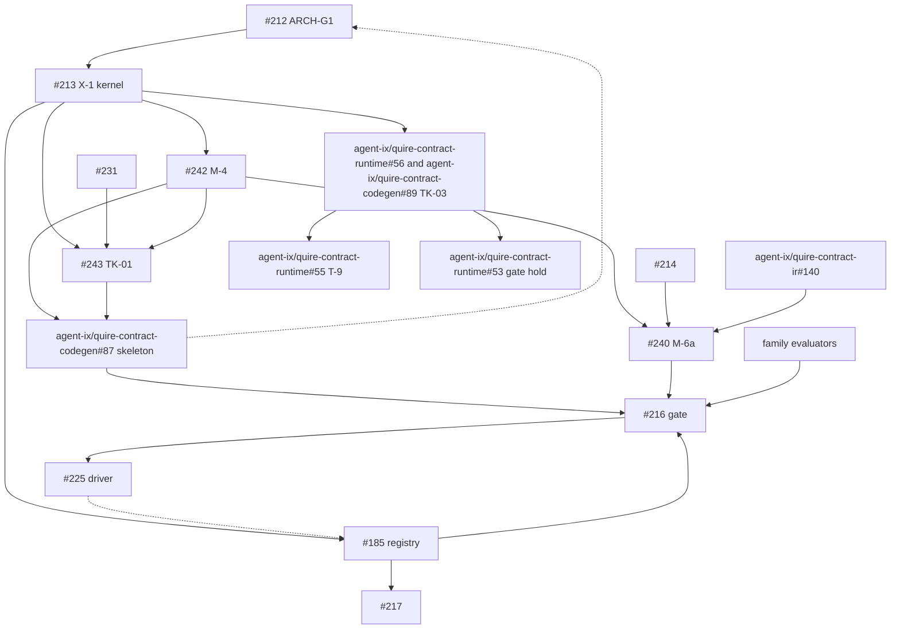

# SR-502: Dependency analysis of ADR-010 to ADR-013

## Summary

Round 1. Reviewed ADR-010, ADR-011, ADR-012 and ADR-013 together on
`task/212-arch-g1-gate` at 457a131. The working tree edits to ADR-011
(Decision 8, §2.3 rule 8, FB-10, the agent-ix/quire-contract-runtime#53 row, E3 and §10 row 8) are part of
the subject. ADR-010 is the observed baseline; it is read only for the edges it
pins.

This pass checks four things:

- The ADRs agree with each other on owners, placements and edges.
- The tickets they name form an ordering with no cycle. Issue bodies were read
  for #185, #212, #213, #216 to #225, #231, #240 to #245, agent-ix/quire-contract-ir#140 and agent-ix/quire-contract-ir#141,
  agent-ix/quire-contract-codegen#87 and agent-ix/quire-contract-codegen#89, and agent-ix/quire-contract-runtime#53, agent-ix/quire-contract-runtime#55 and agent-ix/quire-contract-runtime#56.
- The §7.1 crate DAG and the §6.1 module DAG are acyclic.
- Every cross-repository edge has a named owner and a place in the order.

The gate record SR-498 already holds MD-1, MD-2 and FND-001 to FND-007. They are
not repeated here. Where a finding below touches one, it says so.

Results:

- **§7.1 crate DAG: acyclic.** It is also acyclic at repository level once
  FND-010 is clarified.
- **§6.1 module DAG: acyclic.** One edge is missing for replay of fence-extracted
  source (FND-007).
- **Sequencing: two cycles.** Gate #212 consults a skeleton that waits on #213,
  and #213 waits on #212 (FND-001). The #185 exit test needs a harness whose only
  named home waits on #216, and #216 waits on #185 (FND-003).
- **Ownership: lane deletions sit on design tickets.** ADR-011 gives the
  evaluator lane deletions to #220 to #223. ADR-012, ADR-013 and the issue
  bodies say those tickets land no implementation (FND-002).

**Verdict: ACCEPT WITH FINDINGS.** No finding is blocking. None makes the gate
record wrong. The gate lists the skeleton as planned evidence, not as evidence
it ran (FND-001). FND-003 has the same shape as MD-1 and can be settled with it.
The rest are sequencing and placement fixes for the owning tickets.

## Findings

| ID | Severity | Summary | Refs |
|----|----------|---------|------|
| FND-001 | high | **Gate #212 and the CG skeleton wait on each other.** ADR-011 says gate #212 consults the skeleton, built in parallel with Layer 1. agent-ix/quire-contract-codegen#87 (the skeleton) waits on M-4 (#242) and TK-01 (#243). M-4 waits on #213 S-3. TK-01 waits on #231 and #213. ADR-013 §7 says #213 waits on #212. So #212 → skeleton → M-4 → #213 → #212. **Fix:** #212 consults the skeleton's placement only; the skeleton run is evidence for #216. Say the skeleton is built in parallel with Layer 2. | ADR-011:63-67, ADR-011:150-151, ADR-011:215-218, ADR-013:777-778, agent-ix/quire-contract-codegen#87, agent-ix/quire-contract-codegen#242, agent-ix/quire-contract-codegen#243 |
| FND-002 | high | **Lane deletions are assigned to design and conformance tickets.** ADR-011 gives the state and temporal lane deletions, M-6c, M-6d, M-6e, SEAM-2, SEAM-3 and T-3 exit criteria to #220, #221, #222 and #223. ADR-012 §1.1 and §14.1 make those tickets design inputs. The implementers are #120, #121 and #164 (state), #187, #188 and #189 (temporal), #218, and #191, #192 and #198. ADR-010 §7.1 calls #220, #221 and #223 Layer 4 conformance. The issue bodies list feature implementation as a non-goal. **Fix:** move each deletion to its implementer. M-6c goes to #120, #121 and #164 plus #188 and #189. M-6d goes to #218. M-6e goes to #187, #120, #121, #164, #218, #191, #192 and #198. Drop the #185 edge from #223 at ADR-011:846-850 and ADR-012:712. | ADR-011:608-609, ADR-011:646-647, ADR-011:746-748, ADR-011:846-850, ADR-011:919, ADR-012:120-127, ADR-012:712, ADR-012:883-887, ADR-010:782-813 |
| FND-003 | high | **The #185 exit test has no legal home.** ADR-012 puts the #185 and #217 end-to-end disposition test "in the test harness downstream of CG" with no #225 edge. A CG test that calls QSL `route` breaks FB-05 and T-12 check (a): CG may use only the `replay` facade. The only other home is a driver crate, which is #225's. #225 comes after #216, and #216 needs #185 closed. That is a cycle. Same shape as MD-1. **Fix:** CG tests read the candidate-set wire and v2 bytes as data, at the QSL revision the CG lock pins. They do not call `route`. Or settle the location together with MD-1. | ADR-012:454-457, ADR-012:920-921, ADR-011:418, ADR-011:698-701, ADR-011:928, #185, #216 |
| FND-004 | medium | **Routing runs before the step that decides what to route.** ADR-012 §7.1 and §7.2 step 4 route only items marked `supported`. Only CG `negotiate_*` sets `supported`, after E7. ADR-011 and ADR-012 put routing in QSL `route`, before E7. QSL never calls CG. **Fix:** routing is the single candidate fixed at the candidate step. CG generates an item only after it marks it `supported`. | ADR-011:281-284, ADR-012:465, ADR-012:486, ADR-012:503-504, ADR-012:532-534 |
| FND-005 | medium | **`ProjectionTarget` has no module.** ADR-012 keeps `ProjectionTarget` as a closed QSL enum beside the registry. ADR-011 replaces `lowering::target` with the #185 registry in `route`, and M-6b deletes the rest of `lowering`. §6.1 has no row for a surviving target enum. **Fix:** name the module that owns `ProjectionTarget` and `--target` in the §6.1 `route` row, or state that `route` replaces it. | ADR-012:670, ADR-011:631, ADR-011:849 |
| FND-006 | medium | **`CatalogCode` has two homes.** ADR-011 says `diagnostic::Code` becomes a kernel `CatalogCode`. ADR-013 T-6 puts `CatalogCode` in F `diagnostic`; O-17 says it is not a kernel type; S-1 leaves it to S-5. This changes the scope of X-1 (#213 S-1) against S-5. Also, DA-08 still places the clause kind in `value::expression`, against O-10's check core. **Fix:** ADR-011:551-552 follows ADR-013: `CatalogCode` is in F `diagnostic` and lands in S-5. DA-08 follows O-10. | ADR-011:551-552, ADR-013:410-411, ADR-013:665, ADR-013:791, ADR-013:912 |
| FND-007 | medium | **`replay` cannot reach the source it must check.** A `RawSourceRef` names the document, including fence-extracted documents (O-07, O-12, C-21). `replay` must check every `RawSourceRef` digest (O-26). The §6.1 `replay` row depends on layers 1 to 5, F and K. It does not reach I3 or quire-rs. **Fix:** add I3, under the same feature, to the `replay` row's "Depends on". Or have QC-1 carry the S0 body bytes and the body-to-document map, so `replay` needs no extraction. | ADR-011:517, ADR-011:523-524, ADR-013:210, ADR-013:281, ADR-013:637, ADR-013:697 |
| FND-008 | medium | **agent-ix/quire-contract-ir#140 is not ordered before M-6a.** M-6a (#240) deletes `NativePackage`. IR's `replay_with_native_runtime` takes `&NativePackage`. The IR root → QSL edge lives until M-6d, after #216. Without agent-ix/quire-contract-ir#140 first, the IR current-head lane goes red at M-6a. #216 requires current-head runs to pass. Partly raised as SR-469 FND-004. **Fix:** add the edge agent-ix/quire-contract-ir#140 → #240 (M-6a) to ADR-011 and to #240. | ADR-011:92, ADR-011:688, ADR-011:744, ADR-010:507-512, #240, #216 |
| FND-009 | medium | **RT and CG adoption of `quire-exact` has three claimants.** ADR-011 credits the RT and CG → `quire-exact` edges to X-1 (#213 S-1), "in one change per repository". ADR-013 TK-03 (agent-ix/quire-contract-runtime#56, agent-ix/quire-contract-codegen#89) owns that adoption. ADR-013 O-13 still says it "has no ticket". agent-ix/quire-contract-runtime#55 (T-9) also claims the RT kernel replacement. agent-ix/quire-contract-runtime#53 owns the gate "until X-1", but RT `src/exact` stays until agent-ix/quire-contract-runtime#56. **Fix:** credit both edges to TK-03. O-13 names TK-03. T-9 (agent-ix/quire-contract-runtime#55) waits on agent-ix/quire-contract-runtime#56. agent-ix/quire-contract-runtime#53 holds the gate until agent-ix/quire-contract-runtime#56. | ADR-011:91, ADR-011:401-402, ADR-011:694, ADR-011:730, ADR-011:800, ADR-013:294-295, ADR-013:890, agent-ix/quire-contract-runtime#55, agent-ix/quire-contract-runtime#56 |
| FND-010 | low | **ADR-012 lists IR model paths as kernel consumers.** Read literally, this adds an IR → `quire-exact` edge that §7.1 lacks. IR already depends on the QSL repository through CM. An edge into the QSL repository's kernel would be fine for crates. It would still conflict with M-6d's "IR has no QSL-repo edge" goal if `quire-exact` lives in that repository. **Fix:** state that those IR arms are over IR's own `ValueType` (C-05), not the kernel. | ADR-012:737, ADR-013:294-295, ADR-011:688 |
| FND-011 | low | **The K row omits the QC-15 id types.** The §6.1 K row does not list `EffectiveId`, `UniverseId`, `ObjectId`, `UnitId`, `VariantId` or `MemberId`. ADR-013 QC-15 puts them in the kernel. **Fix:** add them to the K row. | ADR-011:513, ADR-013 QC-15 |

## Acyclicity

### §7.1 crate DAG

Edges, after the §7.1 removals:

- QSL → `quire-exact`, CM, FCD; QSL → quire-rs (optional feature).
- RT → `quire-exact`.
- IR → CM.
- CG → `quire-exact`, CM, IR, RT, QSL (the `replay` facade only).
- Driver → CG and whatever #225 names.

No crate reaches itself. Order: `quire-exact`, CM, FCD, quire-rs; then QSL, RT,
IR; then CG; then the driver.

At repository level the QSL repository holds QSL, `quire-exact` and CM. IR → CM
is an IR → QSL-repo edge. There is no QSL-repo → IR edge, so the repository graph
is acyclic. FND-010 is the one reading that would blur this.

### §6.1 module DAG

Layer order: K, F, 1, 2, I3, 3, 4, 5, R, tool, 6 (`replay`), 6 (`command`, then
`cli`, then `main`), driver. Every stated "Depends on" points to an earlier
layer. No cycle. FND-007 is a missing edge, not a back edge: adding I3 to
`replay` points backward and keeps the DAG acyclic.

## Classification

| Item | Class | Rationale |
|------|-------|-----------|
| #212 ARCH-G1 gate | Enablement | Accepts the target architecture before moves start |
| #213 X-1 kernel extraction | Enablement | Creates `quire-exact`; S-1 to S-6 feed every consumer |
| #214 | Enablement | Prerequisite of M-6a |
| #231 | Enablement | Feeds TK-01 |
| #242 M-4 / T-8 | Enablement | Moves the model types agent-ix/quire-contract-codegen#87 needs |
| #243 TK-01 | Enablement | Adoption step for the skeleton |
| #240 M-6a | Enablement | Deletes `NativePackage` |
| agent-ix/quire-contract-ir#140 | Enablement | Moves IR off `NativePackage` |
| agent-ix/quire-contract-runtime#56, agent-ix/quire-contract-codegen#89 (TK-03) | Enablement | RT and CG adopt `quire-exact` |
| agent-ix/quire-contract-runtime#55 (T-9) | Enablement | Retires RT kernel parts after adoption |
| agent-ix/quire-contract-runtime#53 | Enablement | Holds the RT gate until adoption |
| agent-ix/quire-contract-codegen#87 skeleton | Enablement | First end-to-end path through CG |
| #185 target registry | Feature | Routing and dispositions users see |
| #217 | Feature | Uses the #185 registry |
| #216 gate | Enablement | Exit gate for the moves |
| #225 driver | Enablement | Places the driver crate |
| #220 to #223 | Enablement | Design and conformance inputs only |
| #120/#121/#164, #187, #188/#189, #218, #191/#192/#198 | Feature | Family evaluators that replace the lanes |

## Dependency graph

Edges as they should stand after the fixes. Dashed edges are the two cycle edges
that the fixes remove.

## Topological order

1. #212, #214, #231, agent-ix/quire-contract-ir#140 (parallel).
2. #213 (S-1 to S-6).
3. M-4 (#242), TK-03 (agent-ix/quire-contract-runtime#56, agent-ix/quire-contract-codegen#89), #185.
4. TK-01 (#243), M-6a (#240), T-9 (agent-ix/quire-contract-runtime#55), agent-ix/quire-contract-runtime#53 release, #217, family
   evaluators.
5. agent-ix/quire-contract-codegen#87 skeleton.
6. #216.
7. #225.

## Cycles

- **#212 → #213 → M-4 → agent-ix/quire-contract-codegen#87 → #212.** Broken by FND-001: #212 consults the
  skeleton's placement, not its run.
- **#185 exit → driver harness (#225) → #216 → #185 exit.** Broken by FND-003:
  the test runs in CG over pinned bytes, or its home is settled with MD-1.

## Method

- Read the four ADRs in full, plus the working tree diff of ADR-011.
- Read SR-498 (the gate record) and SR-469 (the stage DAG dependency review).
- Read each named issue body with `gh issue view` for the "waits on", exit and
  non-goal lines.
- Built the crate, module and ticket graphs from the ADR text and the issue
  bodies. Checked each for cycles by hand.

## Round 3

Dispositions after the #212 rulings, 2026-09-19 (issue #212, newest two comments).

- FND-001 is resolved (#212 rulings, 2026-09-19, SR-502 FND-001): #212 does not wait on agent-ix/quire-contract-codegen#87.
  ADR-011 Decision 12 and §1.1 make the skeleton result evidence that #212
  cites where one exists, not an edge.
- FND-002 is resolved (#212 rulings, 2026-09-19, SR-502 FND-002): each M-6 lane deletion, SEAM-2,
  SEAM-3 and the T-3 exit criteria name the implementation tickets that land
  the replacement.
- FND-003 is Remaining work: #185 and #225.
- FND-004 is resolved (#212 rulings, 2026-09-19, SR-505 FND-001): `route` computes candidates
  before E7, CG `negotiate_*` settles at E7, and `route` then routes the
  items settled `supported`.
- FND-005 is Remaining work: #185.
- FND-006 is resolved (#212 rulings, 2026-09-19, SR-501 FND-003 and FND-014): `CatalogCode` is in
  F `diagnostic`, and DA-08 names the `check` core.
- FND-007 is Remaining work: #243.
- FND-008 is Remaining work: #240.
- FND-009 is Remaining work: #213.
- FND-010 and FND-011 are Remaining work: #247.

Verdict after Round 3: ACCEPT WITH FINDINGS.

## Round 4

Dispositions after the #212 round-2 rulings, 2026-09-19 (issue #212, round-2
comment), and the #247 editorial alignments.

- FND-003 is resolved (#212 round-2 ruling): the #185 and #217 end-to-end
  disposition test runs in CG over the candidate-set wire and the v2 bytes as
  data, at the pinned QSL revision, and never calls `route`. QSL tests only
  `route`'s candidate-set output (ADR-012 §5.3).
- FND-005 is resolved (#212 round-2 ruling): `ProjectionTarget` and
  `--target` are deleted with SEAM-1. The backend is chosen only by
  `BackendId`.
- FND-010 is resolved (#247): ADR-012 §12.1 gives IR arms over IR's own
  `ValueType` (C-05), with no IR → `quire-exact` edge.
- FND-011 is resolved (#247): the K row lists the QC-15 id types.
- The orchestrating driver crate is ADR-011 T-13, implemented by #248; #225
  accepts its design.
- FND-007 (#243), FND-008 (#240) and FND-009 (#213) stay Remaining work.

Verdict after Round 4: ACCEPT WITH FINDINGS.
