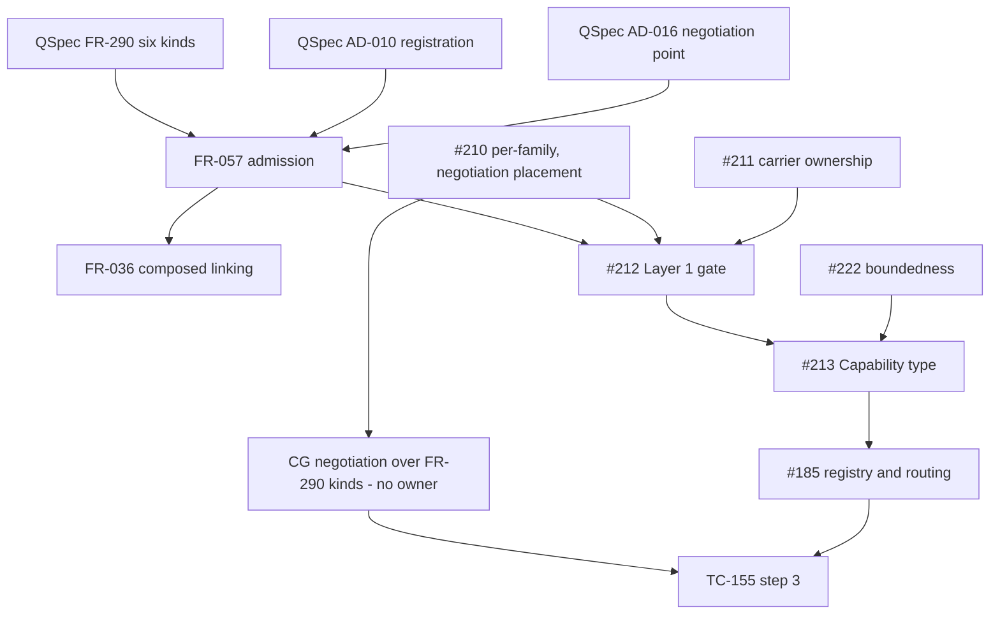

# SR-493: Dependency analysis of FR-057

## Summary

Round 1. Reviewed commit cd4f71a on `task/229-capability-spec`, the diff
against `origin/main`. The change adds FR-057, amends FR-036, TC-115,
`spec/model-linking/tests.md` and `spec/spec.md`, and adds TC-153, TC-154 and
TC-155. This pass checks the prerequisite edges of each requirement, the
enablement and feature split, cycles, and whether the evidence plan names
every prerequisite. It reads the #229 ticket and owner ruling, #185, #210,
#211, #212, #213 and #222, QSpec FR-290, AD-010, AD-016, FR-271 and FR-322,
the QSL sources, and CG `origin/main`.

The owner rulings are treated as settled: the FR-290 six kinds, `unsupported`
with a warning for solver absence, CG `negotiate_*` as the single negotiation
point, QSL `Capability` as admission only, and no path for the four-kind
vocabulary. No finding challenges them.

The ticket order is sound at the top level. #212 depends on #210, #211 and
#229, and #213 and #185 depend on #212. So the #210 and #211 decisions land
before any implementation that FR-057 defers to them.

The gaps are below that level. One high finding: FR-057 has QSL routing run
after CG negotiation, and plans the TC-155 negotiation step under #185 in QSL.
QSL has no production dependency on CG, and CG depends on QSL, so the call
cannot run in that direction. CG also has only `negotiate_kani_obligations`,
and no ticket owns negotiation over FR-290 kinds. Four medium findings: the
FR-036 aggregate needs a settlement inside the linker; the TC-115 controls
for other families lose their vocabulary; the carrier-version rule reaches
wires QSL does not own; and the new refusal code has no code entry or exit
class. Two low findings: a two-way FR-036/FR-057 edge, and an unstated
independence from #222.

Verdict: CHANGES REQUESTED. FND-001 is high and blocks.

## Findings

| ID | Severity | Summary | Refs |
|---|---|---|---|
| FND-001 | high | FR-057 "Stage ownership" says the routing #185 implements "selects a target backend only for an item that negotiation settled `supported`". Negotiation is CG `negotiate_*`, and #185 routing lives in QSL (`src/lowering/target.rs`). QSL reaches CG only as a dev dependency (`Cargo.toml:43`, under `[dev-dependencies]` at `:38`), and CG depends on QSL through IR (ADR-010 §3.2). So QSL production code cannot call CG's negotiation, and a normal QSL→CG edge would close a cycle. TC-155 step 3 ("run negotiation over the admitted pairs") is planned under #185 in QSL (`tests.md` TC-155 row and FR-057-AC-6 row). The test depends on a CG change that no ticket owns. CG `origin/main` has only `negotiate_kani_obligations` (`CG:src/kani_obligations.rs:454`), and it takes Kani obligation kinds, not FR-290 kinds. ADR-010 OBS-004 gives this gap to #210 as a decision only. #229 must leave #185 "no implementation decision" (#212 pass condition), but #185 cannot meet FR-057-AC-6 as planned. Fix: in FR-057, say that routing takes the settled dispositions as input data. It names no module that produces them and adds no QSL→CG dependency. Move the negotiation half of FR-057-AC-6 (TC-155 step 3) to an integration test owned by the repository #210 picks for negotiation. Keep only the admission half (FR-057-AC-5) under #185. Mark the FR-057-AC-6 and TC-155 rows "Planned; #210 placement, CG negotiation" instead of "#185". | FR-057 Stage ownership, FR-057-AC-6 · TC-155 step 3 · `tests.md` TC-155 and FR-057-AC-6 rows · `Cargo.toml:25,38,43` · `CG:src/kani_obligations.rs:454` · ADR-010 OBS-003, OBS-004 · #185, #210, #212 |
| FND-002 | medium | Amended FR-036-AC-6 says "when either is not settled `supported`, complete aggregate success is unavailable". TC-115 step 3 needs one pair that "settles `supported`" and one that "settles `unsupported`" inside QSL's linker report. After FR-057 the linker reads no backend state (FR-057-AC-5), and settlement happens only at CG negotiation. The QSL report therefore has no source for the settlement FR-036-AC-6 aggregates. Today the settlement comes from the caller-declared `Backend` (`src/linking/composed/requests.rs:80-89`), which FR-057 removes. AD-016 joins negotiation dispositions and results in the FR-331 accounting record on `request_index`, not in the linker. Fix: rewrite FR-036-AC-6 so that the linker retains the admitted pairs and their request indices. The aggregate is then computed over settlement records supplied as input, in the FR-331 accounting record per AD-016. Rewrite TC-115 step 3 to supply those records as test input. | FR-036-AC-6 · TC-115 step 3 · FR-057-AC-5 · `src/linking/composed/requests.rs:80-89` · AD-016 Terminal-disposition rule |
| FND-003 | medium | The six FR-290 kinds are protocol claim kinds. The four-member enum being replaced also serves predicate, state and temporal declarations: `FamilyCheck`, `StateOperation` and `TemporalProjection`, with `Capability::families()` at `src/linking/composed/requests.rs:36-64`. The FR-036-AC-5 controls build a backend over all four members (`tests/composed_admission_stages.rs:202-291`, `backend()` at `:184`). The FR-036-AC-6 family-check controls (`:570`, `:654`) request `FamilyCheck` over non-protocol declarations. Once #213 replaces the enum, these requests have no kind until #210 decides per-family applicability. The same holds for Kani's present obligations, which #185's exit requires to stay unchanged. The matrix marks only FR-036-AC-6 🚧. It leaves FR-036-AC-5 and the TC-115 summary row ✅ (`tests.md:199`, `:297`). Fix: mark the FR-036-AC-5 row and the TC-115 summary row 🚧 with "#213 replaces the request vocabulary; per-family kinds, #210". In FR-036 and FR-057 Dependencies, state that requests over predicate, state and temporal declarations, and Kani's registered kinds, are fixed by #210's per-family decision before #213 replaces the enum. | `src/linking/composed/requests.rs:36-64` · `tests/composed_admission_stages.rs:184,202-291,570,654` · `tests.md:199,297` · FR-057 Dependencies · #185 exit · #210 |
| FND-004 | medium | FR-057 says "Any serialized artifact that carries capability labels SHALL declare capability vocabulary version `quire.capability-kind/v1`". That reaches wires QSL does not own. These include QSpec FR-322's checked-package `capability_report` (whose reader refuses with `unknown_contract_version` and `unknown_required_capability`), CG `ObligationRecord`, and quire-protocol's advertised vocabulary (FR-290 Vocabulary authority). No QSL carrier of FR-290 labels exists today. So TC-154, planned under #213, has no carrier to read until #211 decides carrier ownership, and FR-057 defers that decision. #212 requires that cross-repository changes "have a named QSpec contract owner". Fix: limit the rule to a serialized carrier that the QSL compiler reads or emits. State that a cross-repository carrier gets its version field through QSpec once #211 assigns it. Mark the TC-154 and FR-057-AC-3 rows "Planned; #213, carrier per #211". | FR-057 Serialization and version, FR-057-AC-3 · TC-154 · QSpec FR-322 (`capability_report`, v2 refusal codes) · FR-290 Vocabulary authority · #211, #212 |
| FND-005 | medium | FR-057 introduces refusal code `invalid_capability` with causes `absent-kind`, `unknown-kind` and `unsupported-version`. The code is not in QSL `diagnostic::Code` (`src/diagnostic.rs:152-249`) or in QSpec FR-271. FR-057 does not place it on the FR-301 exit ladder (`Code::is_unsupported`, `src/diagnostic.rs:276-295`: unsupported 21, invalid 20). The owner ruling on #229 says four-kind and unknown kinds are "refused explicitly as unsupported, with a named diagnostic". So #213 must still decide whether the code is unsupported (21) or invalid input (20), and whether it has a catalog entry. #229 acceptance says #213 must not have to invent that. Fix: state in FR-057 that `invalid_capability` is a QSL `diagnostic::Code` member with its FR-301 class chosen per the ruling. Name its three causes as a closed set. Add a TC-153 and TC-154 expectation on the exit class. | FR-057 Outputs, refusal table · `src/diagnostic.rs:152-249,276-295` · QSpec FR-271 · #229 owner ruling comment · TC-153, TC-154 |
| FND-006 | low | FR-057 declares `specifies` FR-036 and lists FR-036 under Dependencies ("retains the requested pairs and the aggregate rule"). FR-036 declares `depends_on` FR-057. This makes a two-way prerequisite edge, which is a cycle in the requirement graph. FR-056, the precedent here, uses `traces_to` FR-036 with FR-036 `depends_on` FR-056. Fix: change FR-057's edge to FR-036 to `traces_to`. In FR-057 Dependencies, list FR-036 as the consumer of the admitted pairs, not as a prerequisite. | FR-057 frontmatter, Dependencies · FR-036 frontmatter · FR-056 frontmatter |
| FND-007 | low | #213 depends on #222, and #222 cannot be accepted before QSpec #112 and #113 merge. FR-057 binds TC-153 and TC-154 to #213, so exact-label admission, refusal, version and AC-7 inspection all wait on boundedness work. Only `requires-bound` settlement uses #222's design. Fix: state in FR-057 Dependencies that FR-057-AC-1 to AC-5 and AC-7 have no #222 prerequisite, and that only `requires-bound` settlement does. That lets #213 land the `Capability` slice first. | FR-057 Dependencies, refusal table `requires-bound` row · #213, #222 |

## Classification

| Requirement | Class | Rationale |
|---|---|---|
| FR-057 | Enablement | Fixes the shared admission vocabulary, refusal and stage split. It has no user-visible behavior by itself. #213 and #185 build on it. |
| FR-036 | Feature | Composed linking and the requested-pair report. It consumes FR-057 kinds for FR-036-AC-6. |

Outside this change, the prerequisites are QSpec FR-290 (vocabulary), AD-010
(one registration contract) and AD-016 (single negotiation point, FR-331
terminal record).

## Dependency Graph

Arrows point from prerequisite to dependent. The `CGN` node has no owning
ticket (FND-001).

## Topological Order

1. QSpec FR-290, AD-010, AD-016 (inputs, already accepted).
2. FR-057 (this change, #229).
3. #210 and #211 decisions, then the #212 gate.
4. #213 `Capability` type (TC-153, TC-154). Admission needs no #222 input
   (FND-007).
5. #185 registry and routing (TC-155 steps 1 and 2).
6. CG negotiation over FR-290 kinds, then the TC-155 step 3 integration test
   and the FR-036-AC-6 rebinding in TC-115 (FND-001, FND-002).

## Cycles

- FR-036 ⇄ FR-057 in the requirement graph (FND-006).
- The routing sentence implies QSL → CG at run time, against CG → IR → QSL
  (FND-001).

## Method

- Read the diff `origin/main...HEAD` in full at cd4f71a.
- Read #229 and its owner ruling, and #185, #210, #211, #212, #213 and #222 as
  of 2026-09-19.
- Read QSpec `origin/main` FR-290, AD-010, AD-016 (arrows 1–4, Terminal-disposition
  rule, shared-type table), FR-271 and FR-322.
- Checked `src/linking/composed/requests.rs`, `src/checking/composed.rs:320`,
  `src/diagnostic.rs`, `Cargo.toml` and `tests/composed_admission_stages.rs`
  at HEAD, and `CG:src/kani_obligations.rs` at CG `origin/main`.
- Checked every `origin/*` branch for `FR-057`, `TC-153`, `TC-154`, `TC-155`
  and `SR-493` id collisions. None were found.

## Round 2 dispositions

Checked against the current tree: cd4f71a plus the uncommitted edits. The
upstream is the widened FR-290 in the quire-specification #134 worktree.

| Finding | Disposition | Evidence |
| --- | --- | --- |
| FND-001 | resolved | Routing now takes settled dispositions as input data, and negotiation is not a QSL stage (FR-057:232-236, 249-250). TC-155 supplies settlements as fixture records shaped like `negotiate_*` output and does not run negotiation (TC-155:16-18, 37-39). No QSL→CG edge is implied. |
| FND-002 | resolved | FR-036-AC-6 aggregates over the FR-331 accounting records joined on request index (FR-036:139). TC-115 step 3 supplies the settlements as fixtures (TC-115:25-31). FR-057:286-289 places complete aggregate success in the FR-331 accounting record. |
| FND-003 | resolved | FR-290 now has ten kinds, so value, state, finite-replay and temporal declarations all have a kind (FR-057:45-56, 166-178). #210 is limited to deciding which family records which requirements (FR-057:180-182, 336). The TC-115 summary row is 🚧 (`tests.md:196`). The FR-036-AC-5 row stays ✅, which is correct: that criterion names no kind and its control passes today. `tests.md:244-247` records that the TC-115 controls use the four-member vocabulary. |
| FND-004 | resolved | The emit and read rules now apply only to carriers QSL emits or reads (FR-057:124-131). Cross-repository members belong to each format's owner; FR-331's is `capability_vocabulary`, and the QSL member is assigned under #211 (FR-057:133-137). The TC-154 row is "#211/#213" (`tests.md:222,302`). |
| FND-005 | resolved | `invalid_capability` and its causes are catalogued at `1-draft.5` (FR-057:87-91, 327-329; upstream FR-271, FR-272 and `native-diagnostics.md`). FR-057 classes the code as a refusal of the request, not an unsupported result (FR-057:89-91). The FR-301 ladder in `src/diagnostic.rs:276-294` therefore maps it to invalid (20) by default, so #213 has no exit class to invent. |
| FND-006 | resolved | FR-057 `traces_to` FR-036 (FR-057:8-9). Dependencies lists FR-036 as the consumer (FR-057:330). |
| FND-007 | resolved | FR-057:333-335 states that AC-1 to AC-5, AC-7 and AC-10 have no #222 prerequisite. |

No new dependency defects. The SR-490 FND-001 ticket mismatch on the
FR-057-AC-5 row is a matrix defect and is tracked there and in SR-496 FND-005.
The AC-10 prerequisites are recorded in SR-494 FND-008.

Round 2 verdict: ACCEPT
