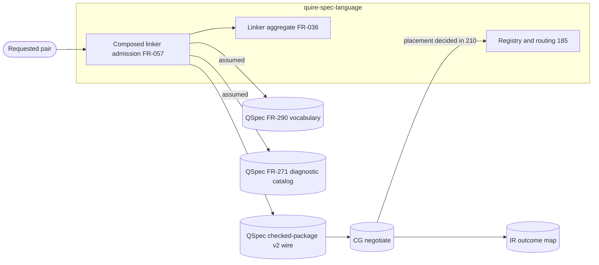

# Scope-boundary review: FR-057 shared capability kinds

## Summary

Round 1. Reviewed commit: cd4f71a (branch `task/229-capability-spec`), diff
against `origin/main`: new FR-057 and TC-153 to TC-155, and amendments to
FR-036, TC-115, `spec/model-linking/tests.md` and `spec/spec.md`.

Sources checked: the bodies of #229 (with the 2026-09-19 owner ruling), #213,
#185, #222, #210, #211 and #205. QSpec `origin/main`: FR-290, AD-010, AD-016
(System Boundary, Terminal-disposition rule, arrows 1, 2 and 4, Shared-type
table), FR-271, FR-322 and interface_013. QSL code at cd4f71a:
`src/linking/composed/requests.rs`, `src/checking/composed.rs:320`,
`src/complete/package.rs:690` and `tests/composed_admission_stages.rs`.

Settled inputs applied and not flagged: FR-290's six kinds are the vocabulary
authority. Backend absence settles `unsupported` with a warning, never a hold.
CG `negotiate_*` is the single negotiation point. QSL `Capability` is language
admission only. There is no path for the older four-kind vocabulary. Ownership
is #229 spec, #213 type and outcomes, #185 registry and routing, #222
boundedness; #210 and #211 decide per-family applicability, negotiation
placement and carrier ownership.

What holds:

- FR-057 keeps QSL on arrow 1 of AD-016. The linker admits labels and reads no
  backend state (FR-057-AC-5). This matches AD-016 arrow 1 ("negotiates
  nothing") and FR-322-AC-2.
- The vocabulary is FR-290's, byte-exact, with no alias. Four-kind labels are
  refused as `unknown-kind` (FR-057-AC-2, TC-153 step 3). No mapping or reader
  is specified.
- The absence/unsupported/refusal/timeout/hold table places each case at one
  stage. Refusal is admission-only. Backend absence is `unsupported`, warned.
- Every deferral names its owner: #213 type, #185 registry and routing, #222
  `requires-bound`, #210 applicability and negotiation placement, #211 carrier
  ownership and the other capability-named types.
- The `spec/spec.md` row and the matrix rows name #229 as specifier and
  #213/#185 as implementers.

What remains: the aggregate rule and its tests put a negotiation result inside
the QSL linker. The refusal code is minted outside the QSpec diagnostic
catalog. The version rule reaches carriers QSL does not own. The removal of the
family-check request leaves its job without an owner. One implementation step
is assigned to a ticket whose scope does not cover it.

Verdict: REVISE. Two findings are blocking (high): FND-001 and FND-002.

## Findings

| ID | Severity | Summary | Refs |
| --- | --- | --- | --- |
| FND-001 | high | The aggregate rule is placed in the QSL linker, but its input is settled downstream in CG. FR-036-AC-6 now says complete aggregate success is unavailable "when either is not settled `supported`". FR-057 says the same for required `unsupported`, `requires-bound` and `invalid-request` items. Those dispositions come from CG `negotiate_*` at AD-016 arrow 4, after QSL hands off. AD-016's Terminal-disposition rule joins them in the FR-331 accounting record on `request_index`, not in QSL. FR-036 also keeps "If a downstream checker or backend cannot admit a requested form, then the compiler SHALL retain its typed unsupported disposition", which needs a return path AD-016 does not define and which conflicts with FR-057's "SHALL NOT consult backend support". TC-115 step 3 and TC-155 step 3 then ask a QSL test to observe `supported` and `unsupported` settlements. `requests::report` can only produce those today by reading a caller-declared backend, which FR-057 removes. Fix: split the aggregate by stage. In FR-036 and FR-057, the linker aggregate covers admission results only (refused, unfinished or unknown subject, and `invalid_capability`). Aggregate success over negotiated dispositions is the FR-331 accounting record (AD-016 Terminal-disposition rule), which FR-057 cites as an external contract. Delete or rewrite the FR-036 "downstream checker or backend" sentence to match. Rewrite FR-036-AC-6 and TC-115 step 3 over admission results. Move the negotiation half of TC-155 (step 3 and the aggregate bullet) to an integration check against the negotiation owner that #210 names. | FR-036 Behavior, FR-036-AC-6; FR-057 "Absence, unsupported, refusal, timeout and hold"; TC-115 step 3; TC-155 step 3; AD-016 Terminal-disposition rule, arrow 4; `src/linking/composed/requests.rs:282` |
| FND-002 | high | FR-057 mints a new producer code, `invalid_capability`, with causes `absent-kind`, `unknown-kind` and `unsupported-version`. AD-016 arrow 1 requires QSL refusals to use `Diagnostic{Code}` from the closed catalog. QSpec FR-271 owns that code vocabulary, and FR-047-AC-2 requires every emitted code to resolve in the selected catalog. Neither FR-271, FR-272 nor `native-diagnostics.md` has `invalid_capability`. The QSL source has no such code either. #213 cannot implement a code that resolves nowhere, so #229's acceptance ("without inventing") fails. Fix: in FR-057 Dependencies, state that `invalid_capability` and its three causes are a QSpec FR-271/FR-272 catalog addition, name the QSpec issue that carries it, and mark FR-057-AC-2 and FR-057-AC-3 as blocked on it in `spec/model-linking/tests.md`. If QSL instead means a consumer-namespace code under FR-271 "Scope: producer-minted codes", say so and name the namespace. | FR-057 Outputs, AC-2, AC-3; TC-153; TC-154; AD-016 arrow 1; QSpec FR-271, FR-272, FR-047 |
| FND-003 | medium | The version rule reaches carriers QSL does not own. FR-057 says "Any serialized artifact that carries capability labels SHALL declare capability vocabulary version `quire.capability-kind/v1`", and "the compiler SHALL refuse the carrier". That covers QSpec wires (FR-322 `quire.checked-package/v2`, interface_013 requests), CG `ObligationRecord` and quire-protocol's advertised vocabulary. #211 says cross-repository wire changes are authored in QSpec, and FR-057 itself defers carrier ownership to #211. No QSpec artifact defines `quire.capability-kind/v1`. The spec also names no QSL component that reads a carrier. Fix: scope the SHALL to carriers the QSL compiler reads or emits, and name the QSL reader stage. State that the version string on a cross-repository wire is authored in QSpec under #211, as a dependency, not a QSL mandate. | FR-057 "Serialization and version", Inputs, Dependencies; TC-154; #211; QSpec FR-322 |
| FND-004 | medium | Removing the four-kind type removes `FamilyCheck`, which today decides which bodies a downstream checker may receive (`Report::admitted_bodies`, `requests.rs:233`). FR-036-AC-6 still requires that "unsupported family bodies are never represented as checked", and TC-115 step 4 still tests it. None of the six FR-290 kinds covers family-body admission. FR-057 does not say which stage or ticket now owns that job. Fix: add one sentence to FR-057 "One capability type": family-body admission is not a capability kind and stays with FR-036's family-checking stage, independent of `Capability`. Name its owner (#213 when it replaces the type, or #210 as part of per-family applicability). Keep FR-036-AC-6's family-body clause on a row that names that owner. | FR-057 "One capability type"; FR-036-AC-6; TC-115 step 4; `src/linking/composed/requests.rs:233`; #210 |
| FND-005 | medium | FR-057 Status and the FR-036 note give #185 the job of moving backend support out of `requests::report`. #185's stated scope is replacing the lowering catalog at `src/lowering/target.rs:39-46`. #213 replaces `Capability` and migrates its first consumers, and `requests.rs` is the type's only consumer. The TC-155 and FR-057-AC-5 rows are planned under #185, but the property they test (admission reads no backend) is a linker property. Fix: assign removal of `Assessment.backend` from admission to #213 in FR-057 Status and the FR-036 note, and move the FR-057-AC-5 matrix row to #213. Keep FR-057-AC-6 on #185. | FR-057 Status; FR-036 note; `spec/model-linking/tests.md` FR-057-AC-5 row, TC-155 row; #185; #213 |
| FND-006 | low | The timeout row says the FR-331 result "is set by the IR-owned outcome map (AD-016), through the structured outcome constructors of #213". AD-016 places that map in IR `src/kani/outcome.rs`. #213's outcome constructors are QSL types. The sentence makes IR depend on QSL outcome types, a direction AD-016 does not state. Fix: end the sentence at "IR-owned outcome map (AD-016)". If QSL consumes the FR-331 result, say that QSL represents it with #213's constructors. | FR-057 "Absence, unsupported, refusal, timeout and hold"; AD-016 arrow 6; #213 |

## Boundary analysis

### System context

### External dependencies

| Dependency | Type | Assumed or Guaranteed | Contract |
| --- | --- | --- | --- |
| QSpec FR-290 six kinds | Vocabulary | Guaranteed | TC-153 step 1 reads a committed copy of the FR-290 Values table |
| QSpec FR-271 diagnostic catalog | Code vocabulary | Assumed | None yet (FND-002) |
| QSpec checked-package/v2 wire | Serialized carrier | Assumed | FR-322; carrier ownership in #211 (FND-003) |
| CG `negotiate_*` | Negotiation | Assumed | AD-016 arrow 4, interface_013; TC-155 step 3 needs an owner (FND-001) |
| IR outcome map | FR-331 result | Assumed | AD-016 arrow 6 |

### Responsibility allocation

| Requirement | Owning component | Class |
| --- | --- | --- |
| FR-057 admission, spelling, identity, refusal | QSL composed linker (#213 type) | core |
| FR-057 serialization and version | QSL carrier reader, stage unnamed (FND-003) | infrastructure |
| FR-057 negotiation and absence settlement | CG `negotiate_*` (external); #185 routing | cross-cutting |
| FR-036 requested-pair retention | QSL composed linker | core |
| FR-036 aggregate over negotiated dispositions | FR-331 accounting (external), per FND-001 | cross-cutting |

## Round 2 dispositions

Checked against the current tree: cd4f71a plus the uncommitted edits.

| Finding | Disposition | Evidence |
| --- | --- | --- |
| FND-001 | resolved | Complete aggregate success over settled dispositions is now the FR-331 accounting record's result, joined on request index (FR-057:286-289; FR-036-AC-6 at FR-036:139). FR-036 now retains a family-checker refusal or a `negotiate_*` settlement as typed data and reads no backend state (FR-036:99). TC-115 and TC-155 supply settlements as fixtures (TC-115:25-31; TC-155:16-18). |
| FND-002 | resolved | `invalid_capability` is catalogued at quire-specification `1-draft.5` (FR-057:87-91, 327-329). |
| FND-003 | resolved | The version rules cover only carriers QSL emits or reads (FR-057:124-131). Cross-repository members belong to each format's owner, and QSL's member is #211's (FR-057:133-137). |
| FND-004 | resolved | The Family-body admission section gives the job to FR-036's family checker, independent of `Capability` (FR-057:184-194). #213 owns the handoff (FR-057:347-348). |
| FND-005 | resolved (SR-490) | FR-057 now gives #213 the removal of backend reading from `requests::report` (FR-057:331-333, 347-348). Three places still disagree. FR-036 Status says "#185 moves backend support into registration and routing" (FR-036:202-203), and `tests.md:246-247` repeats it. The FR-057-AC-5 row stays "Planned; #185" (`tests.md:304`), and the TC-155 row says "#185" only (`tests.md:223`). Fix: in FR-036:202-203 and `tests.md:246-247`, write "#213 removes backend reading from admission, and #185 builds registration and routing". Set the FR-057-AC-5 row to #213 and the TC-155 row to "#213 (AC-5), #185 (AC-6, AC-8, AC-9)". SR-490 FND-001 records the same matrix defect. |
| FND-006 | resolved | The timeout row now reads "A run result mapped by the IR outcome map, never a disposition" (FR-057:270). The #213 constructor dependency is gone. |

No new scope defects. The FR-057-AC-9 placement issue is recorded as SR-494
FND-007.

Round 2 verdict: ACCEPT WITH FINDINGS
