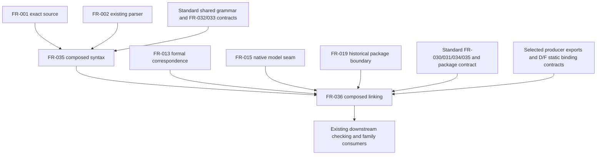

## Summary

The changed requirements form an acyclic dependency path from edition-selected
syntax to exact composed package binding. They reuse the existing source,
parser, model and package boundaries and explicitly defer type/definedness,
family execution and composed wire delivery. No missing implementation or planned
assurance is misrepresented as completed by the specification.

## Findings

| ID | Severity | Summary | Refs |
| --- | --- | --- | --- |
| FND-001 | low | No issues found in this lens. FR-035 precedes FR-036; accepted standard/model contracts precede enabling their dependent path, while runtime observations and later family/assurance completion are not template-linking prerequisites. | FR-035 Inputs/Dependencies/Status; FR-036 Inputs/Dependencies/Status; IT-009 Preconditions |

## Classification

The first two rows are the complete changed FR set; no StR or NFR is added or
changed by this slice. Remaining rows identify explicitly reused local seams,
not an expanded review of their historical implementation.

| Requirement | Class | Rationale |
| --- | --- | --- |
| FR-035 | Enablement | Supplies inspectable, located syntax for composed declarations before model/profile checking. |
| FR-036 | Enablement | Supplies exact static dependencies and binding-role requirements for downstream checkers and requests. |
| FR-001 | Enablement | Existing bounded immutable source intake. |
| FR-002 | Enablement | Existing complete parser and located syntax boundary. |
| FR-013 | Enablement | Existing formal-environment name/source correspondence. |
| FR-015 | Enablement | Existing explicit native model semantics and source-derived roles. |
| FR-019 | Enablement | Existing complete checked-package boundary that composed partial reports must preserve. |

## Dependency graph

Arrows identify hard prerequisite contracts or explicitly consumed outputs.
The package edge is a compatibility prerequisite: FR-036 cannot alter historical
atomic/checked packaging, but it does not construct a historical package first.

The standard's FR-033 reference supplies the shared predicate declaration
contract, not a requirement to execute predicates before parsing them.
Likewise, standard FR-031 supplies request/disposition meaning; it does not make
all backend implementations prerequisites for linking. No edge from concrete
observations, temporal engines, protocol engines, evidence stores or a new
canonicalizer is required to produce the specified bound template.

## Topological order

1. Select the coherent standard and affected producer contracts for enablement.
   The review input is standard commit
   `d7483f3d0abe7e71614f73ee18eb51a677ebe3d8`; its PR-15 acceptance is still pending.
   Existing compiler seams remain independently inspectable during that work.
2. Extend edition-aware token classification and structured parsing under FR-035,
   preserving the historical path and source/resource contracts; TC-113 is the
   planned syntax and compatibility discriminator.
3. Consume that syntax plus exact definitions/model exports and static binding
   contracts through FR-036. TC-114 checks identity/dependency/cycle boundaries;
   TC-115 checks static identity, partial requests and historical package exclusion.
4. Exercise IT-009 through the actual selected producer and public composed
   entry point once those implementations exist. Subsequent checking and family
   execution use the retained identities; their later qualification cannot be
   inferred from parser or linker success.

## Cycles and ownership

No prerequisite cycle is present in the changed slice. Refusing a cycle in a
user's semantic dependency graph is a required linker behavior, not a cycle in
this implementation ordering. The standard owns grammar/meaning and producer
correspondence; compiler #35 owns these two compiler requirements. US-001/002 and
the master/TM-003 changes describe that same slice rather than adding another
engine or an assurance campaign.

The inspected current `parse_source`/`ParsedUnit`, `link`/`link_native` and
`NativePackage::new`/`read_verified` interfaces establish concrete reuse and
compatibility seams. Their existing historical support does not satisfy any new
composed criterion. All new TC/IT rows remain planned; no build, runtime test or
producer adoption was performed for this review.
