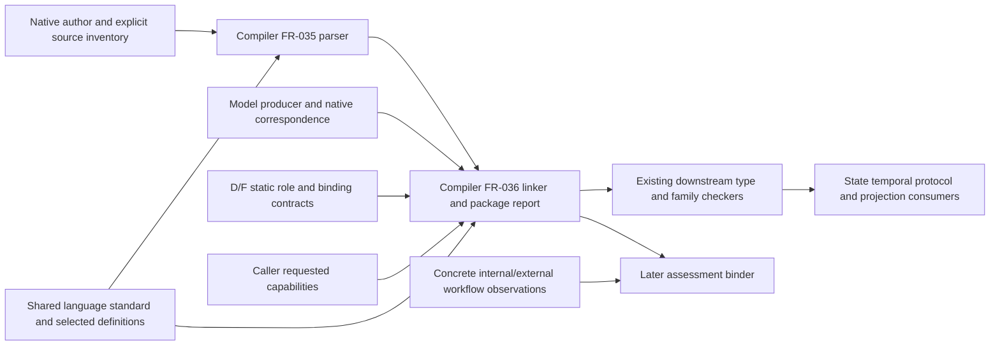

## Summary

No blocking scope or responsibility gap was found. The changed compiler contract
owns source recognition, exact static correspondence and retained request/role
requirements; the standard and model/observation producers retain semantic and
runtime authority. The explicit future acceptance and integration gates do not
make this proposed L2 path implemented or qualified.

## Findings

| ID | Severity | Summary | Refs |
| --- | --- | --- | --- |
| FND-001 | low | No issues found in this lens. The L2 boundary retains cross-system, related-instance and population-role requirements while excluding live assessment inputs, new model/evidence stores, second parsers and incidental wire changes. | FR-035 Outputs/Behavior; FR-036 Outputs/Behavior; IT-009 Target Integration/Expected Results; spec.md §2 |

## System context

## In-scope responsibilities

- Recognize the selected edition through the existing Logos/structured parser
  and preserve complete located syntax for predicate, state, temporal and
  choreography declarations. TC-113 checks that source parsing does not claim
  model admission, Boolean checking or backend execution.
- Close the explicit multi-unit namespace, resolve exact definitions/model
  exports and native dependency kinds, retain declaration-owned roles and report
  partial dependency failures without erasing independent declarations.
- Preserve the caller's requested clause/capability inventory and exact static
  selections across downstream unsupported outcomes. A partial composed report
  cannot be retagged into the historical checked-package/reader/runner boundary.

## External dependencies

`Guaranteed` means an explicit contract check is required in the planned scope,
not that it has executed. `Assumed` identifies a selected upstream authority
whose semantic contract this compiler consumes instead of redefining.

| Dependency or actor | Assumed or Guaranteed | Named contract and control |
| --- | --- | --- |
| Shared grammar and semantic definitions | Assumed meaning authority; guaranteed selection checks, planned | Standard shared grammar/package/edition contracts at d7483f3d0abe7e71614f73ee18eb51a677ebe3d8; compiler FR-035/036 and TC-113/114. An unavailable edition or conflicting closure refuses rather than choosing a backend default. |
| Source author and inventory caller | Guaranteed input checks, planned | FR-001/035/036; TC-113/114. Exact source identity/spans, namespace closure, duplicate authorities and excluded ambient files are explicit. |
| Model producer and formal/native correspondence | Guaranteed boundary checks, planned | Existing FR-013/015 seam plus FR-036 and IT-009-SC-01/03. The real producer supplies exports; foreign same-shaped owners and canonical-versus-byte digest substitution refuse. |
| D/F static binding contracts | Assumed contract meaning; guaranteed retained requirements, planned | FR-036-AC-4 and IT-009-SC-02/04. Exact model, scope, anchor and authority roles survive without requiring future observations. No compiler-owned parallel schema is authorized. |
| Downstream checker/backend and request caller | Guaranteed inventory/response preservation, planned | FR-036-AC-6, TC-115 and IT-009-SC-05. Unsupported checking/projection remains explicit; bound syntax is not presented as checked or executable. |
| Concrete internal/external workflows and observation authority | Assumed later assessment inputs, outside L2 validation | Standard IT-010/D/F consumers validate live instance identity, membership, clocks and completeness. IT-009 retains the static prerequisites enabling those checks; their absence is not a template-linking failure. |
| Historical package reader and runner | Guaranteed compatibility boundary, planned | FR-036-AC-8 and TC-115. Existing complete-package identities and atomic failures remain unchanged; composed partial reports cannot enter by profile relabelling. |

## Responsibility allocation

These are the complete newly authored FRs; no StR/NFR is added or changed in
this slice. The US/master/matrix edits trace these responsibilities without
allocating downstream engines to L2.

| Requirement | Owning component | Class |
| --- | --- | --- |
| FR-035 | Native compiler edition-aware lexer/parser and source-owned syntax | core |
| FR-036 | Native compiler exact model/declaration linker and composed package report | core |

## Grounded implementation boundaries

[ParsedUnit and ExprId](../../../src/syntax.rs) currently encode a historical
single-unit source/arena; the proposed cross-unit identity rules explicitly
prevent treating those local handles as global identities.
[parse_source](../../../src/parser.rs) and the [lexer](../../../src/lexer.rs)
provide the existing bounded path to extend. No rewrite, second expression
scanner or family text adapter is required by this specification.

[LinkedPackage, link and link_native](../../../src/linking.rs) currently return
atomic historical name correspondence. [NativeModel](../../../src/native_model.rs)
owns admitted formal declarations and explicit roles. FR-036 preserves those
authorities and leaves type/definedness judgments to the subsequent checker.
[NativePackage](../../../src/package.rs) accepts a `CheckedPackage`; its
[reader](../../../src/package/reading.rs) verifies and reconstructs historical
selections. Preserving that distinction is the concrete reason the proposed
partial report must not acquire an old package format or runner identity.

The standard's current package contract explicitly separates static selections
from concrete observations and retains producer canonical-object/native raw-byte
correspondence. IT-009 consumes those contracts rather than designing them.
Acceptance of affected standard/producer contracts remains explicit. No build,
runtime test, review campaign beyond the selected all-set, or external write was
performed here.
