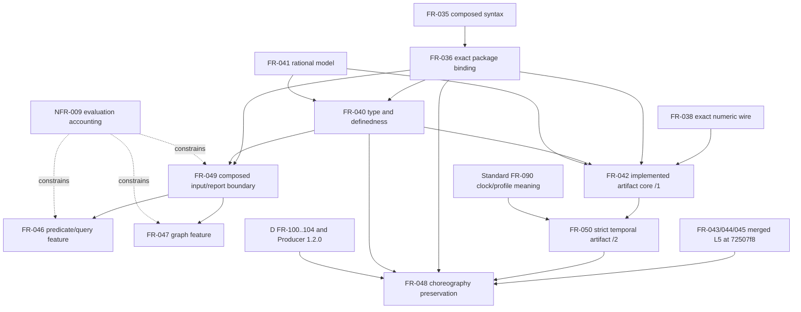
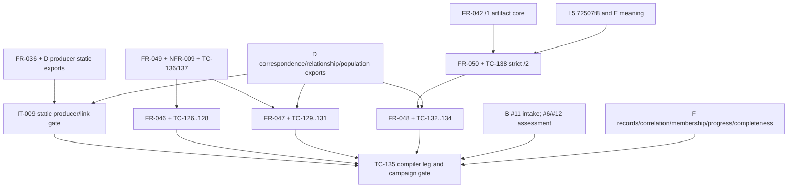

## Summary

**CONDITIONAL PASS FOR COMPILER TASKING; NOT ACCEPTANCE CLOSURE.** The expanded
FR-046–050/NFR-009 product graph is acyclic when its authored allocation is read
as written. FR-049 and NFR-009 now supply the missing composed input, outcome and
work-accounting layer before FR-046/047 runtime features. FR-050 separately owns
the narrow `quire.compiled-protocol/2` temporal-authentication extension required
by the latest compiler #40 decision after merged L5 revision
`72507f856457ba0922719bd5d9f5cadcce4058cd`; FR-048 depends on FR-050 only for
the timed choreography path. D, E, F and B retain their named authorities rather
than becoming compiler implementation.

The former FR-042 cycle is resolved. FR-046/047/048/049 now use `references`
edges and explicitly consume only FR-042's already implemented artifact core:
canonical `/1` schema/emission, strict reader and constructor-private admitted
package. FR-050 has the sole local `depends_on` edge to FR-042 because it extends
that `/1` core in a parallel strict `/2` package. Nothing in FR-042 depends on
FR-050, while FR-042 family-completeness and consumer-handoff acceptance remain
downstream evidence. Thus neither the authored graph nor the intended
artifact-core graph contains a path back from FR-050 or FR-048 to FR-042.

All seven original findings remain below with their exact original statements
and a resolution recheck. Every corrective finding is resolved and the original
acyclicity observation is confirmed. TC-138 now references the inherited FR-042
artifact core and verifies only FR-050, matching its summary and matrix rows.
All FR-046–050 rows and the NFR-009 row remain Planned, and missing D
correspondence plus the separately owned B/F campaign continue to block their
dependent positive acceptance cases.

## Findings

| ID | Severity | Summary | Refs |
| --- | --- | --- | --- |
| FND-001 | high | **Original:** FR-046/047/048 each depend on the whole FR-042, while FR-042-AC-4..6 and AC-10 require complete query/graph/choreography emission and the real consumer handoff. Read literally, FR-042 must complete before the new stages and cannot complete until their outputs exist. Split or name the already available artifact-schema/reader/emitter boundary as enablement, then place FR-042 family-completeness and handoff acceptance after the applicable new feature outputs.  **Recheck — resolved:** FR-046/047/048 and new FR-049 now `reference` FR-042 and name only its implemented artifact-core portions. FR-050 alone depends on FR-042 to extend that core; FR-048 depends on FR-050, and no FR-042 edge returns to either requirement. The latest #40 `/2` decision is therefore a forward edge, not a cycle. | FR-046/047/048 frontmatter and Dependencies; FR-042 Inputs, Behavior, AC-4..6, AC-10 and Dependencies; FR-049/050; #40 `/2` comment after `72507f8` |
| FND-002 | high | **Original:** FR-046 and FR-047 require validated immutable runtime sequences/populations/graphs, incomplete-input classification, caller-lowered evaluation limits, exact usage and fresh retry, but neither selects FR-007/FR-018/NFR-006 nor a replacement composed runtime-input contract. Static FR-040 and artifact FR-042 do not produce these runtime inputs. Select an existing compatible boundary criterion by criterion or add a separate composed runtime-intake/accounting enablement requirement before runtime implementation.  **Recheck — resolved:** FR-049 defines `AdmittedPackage` + declaration-local `EvaluationRequest` + immutable `StateView` + typed outcomes. NFR-009 defines fourteen independent input/expression/predicate/query/comparison/graph counters under `quire.state.evaluation-work/1`. FR-046/047 depend on FR-049 and are constrained by NFR-009; TC-136/137 and TM-003 cover the new seam. | FR-046 Inputs, Behavior, AC-3..7; FR-047 Inputs, Behavior, AC-2..7; TC-127–131; FR-018; NFR-006; FR-049; NFR-009; TC-136/137 |
| FND-003 | high | **Original:** Full FR-048 acceptance has hard external prerequisites that are not represented as dependency edges: authoritative producer relationship/correspondence/population/clock exports; B artifact admission and PT02 conformance; F observation, progress and completeness intake; and selected temporal settlement meaning. `references` links to B do not express must-complete-before acceptance, and no F/temporal target is linked. Separate compiler implementation dependencies from cross-repository acceptance gates and identify exact versioned interfaces/requirements.  **Recheck — resolved for compiler scope; external gates remain open:** FR-048 now depends on D FR-100–104, local L5 FR-043/044/045 and FR-050, pins Producer interface 1.2.0 at `6259d3a5b99088740df9bcc8e8d60f3720aaa603`, and allocates E/F/B semantics explicitly. AC-10 and TC-135 now limit A's result to byte-exact compilation/preservation. D research #39/#49 owns the aggregate campaign pending repository transfer, so PT02 truth, observation adequacy and campaign completion are downstream evidence rather than hidden compiler implementation edges. | FR-048 Inputs, Behavior, AC-1, AC-6, AC-8..10 and Dependencies; TC-132, TC-134, TC-135; IT-009 Preconditions and former SC-06; FR-050; local FR-043/044/045 merged at `944abdb` from `72507f8` |
| FND-004 | medium | **Original:** The master index table lists FR-046/047/048, but its frontmatter `relationships` contains no `contains` edge for any of them. They are therefore visible in prose while absent from the master relationship graph.  **Recheck — resolved:** The master frontmatter contains one edge each for FR-046/047/048 and now also FR-049/050 and NFR-009; the Requirements table lists the same expanded set. | spec/spec.md frontmatter and Requirements table |
| FND-005 | medium | **Original:** IT-009 declares requirement-wide `verifies` relationships to FR-047 and FR-048, but its procedure checks static producer correspondence, role retention and B intake. It does not execute positive-length graph traversal, query runtime, repeat progress, compensation recovery, or the A→B→F assessment campaign. Narrow the relationship to the criteria actually exercised or classify IT-009 as an integration enablement gate; do not use it as whole-requirement completion evidence.  **Recheck — resolved:** IT-009 now verifies only its actual existing FR-036 static-linking requirement and references FR-046–050/NFR-009. Its objective, five-step procedure and expected result exclude evaluation, graph traversal, conformance and F assessment. | IT-009 Objective, Test Procedure and relationships; FR-047-AC-3..7; FR-048-AC-3..10 |
| FND-006 | medium | **Original:** TC-135 explicitly verifies FR-042 and names FR-042-AC-10 in the Test Case Summary, but the FR-042-AC-10 coverage row still maps only TC-121. The terminal A→B→F gate is disconnected from the existing criterion row, so matrix reconciliation cannot use TC-135 consistently.  **Recheck — resolved:** TM-003 maps FR-042-AC-10 to both TC-121 and TC-135, while TC-135 keeps its compiler contribution distinct from the D-owned research #39/#49 campaign result. | TC-135 relationships; TM-003 Test Case Summary; TM-003 FR-042-AC-10 row |
| FND-007 | low | **Original:** After the preceding edges are made explicit, the test packet has a valid acyclic order: identity/input positives precede evaluation and adverse limits; control/identity positives precede compensation; the real producer boundary precedes the ecosystem demonstration. No TC depends on its own result and semantic source cycles remain test subjects rather than specification cycles.  **Recheck — confirmed and expanded:** TC-136/137 add the input/accounting layer before query/graph runtime evidence, and TC-138 adds the strict `/2` positive before timed TC-134/135. No evidence edge returns to an implementation prerequisite. | TC-126–138; IT-009; TM-003 L3/L4/L5/L6 sections |
| FND-008 | medium | TC-138 declares that it verifies FR-042 as well as FR-050, but its Test Case Summary row and coverage section map only FR-050. Because TC-138 exercises selected `/1` regression and inherited FR-042 accounting rather than every FR-042 criterion, either narrow that relationship to `references` or map only the exact FR-042 criteria it verifies.  **Recheck — resolved:** TC-138 now `references` FR-042 and `verifies` FR-050. Its procedure still runs the required `/1` regression without claiming requirement-wide FR-042 evidence. | TC-138 frontmatter/procedure; TM-003 TC-138 summary and FR-042/FR-050 rows |

## Classification

Every FR and NFR newly selected by this review appears exactly once. Test cases
and IT-009 are verification artifacts and are ordered under evidence rather than
misclassified as product features.

| Requirement | Class | Rationale |
| --- | --- | --- |
| FR-046 | Feature | Produces exact reusable-predicate and ordered-query values plus observable non-complete outcomes. |
| FR-047 | Feature | Produces exact dereference and positive-length reachability results over admitted finite graphs. |
| FR-048 | Enablement | Preserves the immutable choreography subject and binding requirements consumed by downstream assessment; it performs no business action or conformance decision. |
| FR-049 | Enablement | Supplies the shared admitted-artifact request, immutable state-view validation and closed evaluation report boundary. |
| FR-050 | Enablement | Extends the strict artifact transport with authenticated temporal definitions and clock configuration; it does not evaluate time. |
| NFR-009 | Enablement | Supplies the shared finite accounting contract that constrains FR-049, FR-046 and FR-047 evaluation work. |

Existing FR-035/036/038/040/041 and FR-042's implemented `/1` artifact core are
prior enablement. Merged L5 FR-043/044/045 at `72507f8` supplies the evaluator,
activation and mapping interfaces consumed by the `/2` evidence and timed
choreography. External D/E/F/B requirements remain owned prerequisites or
acceptance gates, not compiler functionality to duplicate.

## Authored prerequisite graph

Only hard implementation prerequisites are solid arrows. `references` and
verification relationships are intentionally absent. NFR-009 is shown as a
constraint into the consumers; it is co-designed with FR-049's typed boundary
rather than treated as a reverse completion dependency.

The graph is acyclic. FR-046/047/048/049 have no hard edge to the whole FR-042
requirement. FR-050's edge is specifically the forward `/1`-core-to-`/2`
extension, and FR-048's timed acceptance follows FR-050. FR-042 terminal family
and handoff evidence occurs later and is not fed back into FR-050 or FR-048.

## Acceptance and evidence graph

The compiler implementation DAG and the cross-repository acceptance DAG are
separate. This prevents downstream assessment completion from becoming a false
prerequisite for source-to-artifact implementation.

TC-135 is terminal evidence, not an input to FR-048 implementation. IT-009 now
depends only on FR-036 plus the real D producer boundary; it may execute before
FR-046/047/048 runtime and choreography acceptance because it merely references
those later requirements.

## Topological order

1. Retain the accepted shared semantic definitions, FR-035/036/038/040/041,
   FR-042's implemented strict `/1` artifact core and merged L5 FR-043/044/045 at
   `72507f856457ba0922719bd5d9f5cadcce4058cd`.
2. Establish FR-049's typed immutable input/report boundary together with
   NFR-009's independent finite counters. Their API and constraint are one
   enablement layer; neither must be declared complete before the other is
   designed or tested.
3. Implement FR-050's parallel strict `/2` producer/reader from the FR-042 `/1`
   core and standard FR-090. Frozen `/1` bytes/readers remain unchanged. This
   layer can proceed in parallel with step 2.
4. Implement FR-046 and FR-047 after the FR-049/NFR-009 layer. Static predicate
   and graph-emission reconciliation may proceed earlier, but completed runtime
   claims require the admitted evaluator boundary and its accounting.
5. Implement FR-048's untimed compiler preservation from existing binding,
   checking and D static exports; complete its timed `/2` path only after FR-050
   and merged L5 interfaces. This may overlap step 4 because FR-048 does not
   consume FR-046 or FR-047 results.
6. Exercise IT-009 when FR-036 and the real selected D producer exports are
   available. It is independent of concrete F observations and does not wait for
   new evaluator or choreography completion.
7. Run the scoped evidence in the order below. Complete TC-135's compiler leg
   after the relevant A/D/L5/B intake paths; complete the separate campaign only
   after its owner pins B #6/#11/#12, F and E contracts and records the actual
   assessment results.

## Matrix dependency and acyclicity audit

TM-003 lists all thirteen TC-126–138 cases. It maps all forty acceptance
criteria across FR-046–050 and one NFR-009 negative-abuse-testing row; every row
remains Planned. FR-042-AC-10 now maps both TC-121 and TC-135. TC-138's FR-042
relationship is reference-only and its verification mapping is limited to FR-050.

The exact evidence order is:

1. TC-126 exercises predicate identity/checking/emission; TC-132 exercises
   untimed choreography identities; TC-136 establishes the admitted evaluation
   input/outcome seam; and the `/1` regression portion of TC-138 protects the
   artifact-core base. These independent positives can proceed in parallel once
   their own prerequisites exist.
2. TC-137 establishes every NFR-009 counter and fresh retry through the FR-049
   boundary. TC-127/128 then exercise query values, stopping rules, incomplete
   inputs and limits. TC-129 establishes exact graph inputs before TC-130/131
   exercise reachability, deterministic traversal, bounds and history.
3. The strict `/2` positive in TC-138 must precede the timed portion of TC-134
   and the timed campaign fixture in TC-135. Its L5 substitution oracle uses the
   already merged evaluator at `72507f8`; it does not make L5 implementation
   depend on the new wire.
4. TC-133 follows TC-132's admitted choreography identities. TC-134 follows
   TC-132/133 for recovery/control meaning and follows TC-138 only for its timed
   `/2` cases; its untimed compensation cases do not require `/2`.
5. IT-009 exercises only the real D producer plus FR-036 static compiler-linking
   boundary. It is an independent enablement gate rather than evidence for
   FR-046–050.
6. TC-135 is terminal: the A leg consumes FR-048, FR-050, selected D exports and
   B #11 intake; the distinct campaign gate additionally consumes B #6/#12, F
   observation/progress/completeness and E temporal meaning.

No test depends on its own result. Predicate-call cycles and finite object
cycles are adverse semantic inputs in TC-126 and TC-130, not specification-DAG
cycles. Strict `/1`↔`/2` cross-version refusals are compatibility tests, not
mutual implementation dependencies.

## Blockers and disposition

- **Blocks FR-046/047 runtime acceptance:** FR-049/NFR-009 and TC-136/137 are
  authored but remain Planned; actual public evaluator implementation and
  evidence are still required.
- **Blocks timed FR-048-AC-8 and the timed TC-134/135 path:** FR-050/TC-138 and
  `docs/compiled-protocol-v2.md` are authored but the strict `/2` implementation
  and evidence remain outstanding. The merged L5 implementation is available;
  it is not the missing wire authority.
- **Blocks positive D-dependent FR-047/048 cases and IT-009:** issue #40 still
  records producer correspondence and authoritative relationship/population
  exports as unavailable on the admitted path. The exact Producer 1.2.0 and
  revision are now selected, so this is delivery work rather than an ambiguous
  dependency.
- **Blocks campaign completion, not A compiler implementation:** the campaign
  owner must pin and run accepted B #6/#11/#12, F and E revisions with actual
  observations. TC-135 explicitly forbids promoting A's local compiler leg to
  PT02 truth or observation adequacy.
- **Does not block scoped compiler tasking:** the local product DAG is acyclic,
  the former FR-042 loop and missing runtime seam are resolved, unsupported and
  incomplete outcomes remain explicit, and external acceptance gaps no longer
  masquerade as implementation prerequisites.

No plan bundle or implementation order beyond this logical DAG is authorized by
this review. Planned matrix status and open external delivery gates are retained
without converting specification completeness into implementation evidence.
