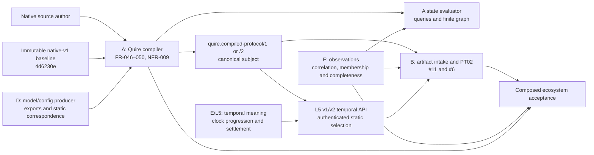

## Summary

PASS AFTER RECHECK. The original FAIL findings are preserved below as the
review record. The final packet allocates every static, runtime and campaign
authority, pins the available D and L5 interfaces, and gives the latest #40
`/2` dependency a closed A-owned wire/reader contract plus type-correct L5
consumer entry points. A remains the compiler and immutable assessment-subject
producer; it does not absorb D, E, F or B semantics.

The end-to-end campaign is deliberately not ready to claim acceptance. D owns
the version-lock manifest, Rust driver and aggregate record under
`quire-research` #39/#49, and TC-135 remains Planned because no accepted B
#6/#11/#12 plus F revision set exists. This is an explicit external delivery
gate with an owner, not an unallocated boundary or permission for A to fabricate
the missing inputs.

## Findings

| ID | Severity | Summary | Refs |
| --- | --- | --- | --- |
| FND-001 | high | D/F authority is blended rather than allocated. Split D-owned model, object type, relationship/population declaration, configuration and producer-correspondence identities from F-owned concrete observation records, occurrence correlation, membership/completeness/progress and closure evidence. Name the exact selectable Rust contracts at IT-009 and the evaluator input boundary so neither A nor F manufactures D authority and A does not create a second observation store. | FR-046 Inputs/Dependencies; FR-047 Inputs/Dependencies; FR-048 Inputs/Dependencies; IT-009 Target Integration and SC-01/02/04/06; native-v1 observation contract, “Authority and applicability” |
| FND-002 | high | L5 is correctly outside this delivery, but the consumed interface is not pinned. FR-048 names temporal declaration/clock/activation selections without a dependency on the local L5 requirements or an exact admitted-artifact/report selection. Add the merged L5 requirement identities/revision and state precisely which static handles A preserves; E remains sole owner of clock progression, deadline settlement and late evidence. | FR-048 Inputs and temporal Behavior; FR-048-AC-8/10; TC-134/135; issue #39 dependency on L5/OB02; native-v1 choreography surface, deadline rules |
| FND-003 | high | TC-135 spans three implementations but has no owner or repository for the version-lock manifest, driver and composed acceptance result. Split the evidence allocation: A owns release compilation and preservation, B owns artifact intake/PT02 batch-incremental conformance, F owns observation handoff, and the campaign integration owner owns the single pinned run and aggregate record. Narrow FR-048-AC-10 to A's observable contribution and reference the separately owned composed acceptance case instead of making A's local test imply downstream completion. | FR-048-AC-9/10; TC-135 Procedure/Expected Results; TM-003 TC-135 row; issue #39 ownership correction; quire-protocol #6/#11/#12 under EPIC #14 |
| FND-004 | high | The positive producer boundary is not guaranteed by a named contract. Issue #40 records that producer correspondence remains unsupported and manifest/lock plus relationship/component/endpoint coverage is incomplete. D must publish the authoritative export/correspondence contract, A must admit and emit it, and B must independently select it before IT-009-SC-06 or TC-135 can pass. Keep unsupported paths explicit; do not broaden A into a model/configuration producer. | FR-048 Inputs, Behavior and AC-1/2/8/9; IT-009 Preconditions and SC-01/06; TC-132/134/135; FR-042-AC-3; issue #40 post-PR-69 record |
| FND-005 | medium | FR-048's declared dependency graph stops at standard FR-050–059 and legacy `quire-protocol` FR-001/IT-001 even though issue #39 selects standard FR-049–062 and the current handoff is B #6/#11/#12. Add the omitted syntax/claim-separation/result-boundary references and current consumer tickets, while marking their meanings assumed and their handoff compatibility guaranteed by contract tests. | FR-048 frontmatter; issue #39 “Landed native specification input and delivery boundary”; native-v1 FR-049–062; quire-protocol #6/#11/#12 |

## Resolution and recheck

| Finding | Status | Recheck evidence |
| --- | --- | --- |
| FND-001 | resolved | FR-048/049 allocate D's model, type, relationship, population, configuration and correspondence authorities separately from F's concrete record admission, occurrence correlation, availability, membership, completeness, progress and closure facts. D is pinned at Producer interface 1.2.0 revision `6259d3a5b99088740df9bcc8e8d60f3720aaa603`; A consumes both domains without minting either. |
| FND-002 | resolved | FR-048 pins merged L5 revision `72507f856457ba0922719bd5d9f5cadcce4058cd`. FR-050 defines the v2 admitted-package APIs that preserve and authenticate the temporal definition and exact clock configuration, while retaining strict `/1` APIs. E remains sole owner of clock progress, settlement and late-evidence meaning. |
| FND-003 | resolved | FR-048-AC-10 and TC-135 limit local evidence to A's byte-identical compiler handoff. B #11 owns intake, B #6/#12 own conformance and temporal/observation result handling, F owns its fact handoff, and D owns the manifest, Rust driver and aggregate record under `quire-research` #39/#49 pending an approved integration-repository transfer. |
| FND-004 | resolved for specification | FR-048 pins D's real export/correspondence contract and retains typed unsupported paths; FR-049 defines composed input admission; FR-050 owns the authenticated temporal producer boundary. IT-009 remains scoped to A's producer intake, while TC-135 forbids a fabricated local success case. Implementing these contracts remains delivery work. |
| FND-005 | resolved | FR-048 now declares local FR-043/044/045 and FR-050, standard FR-049–062, and B #6/#11/#12 with their assumed meanings and guaranteed handoff boundaries. |

Additional scope risks discovered during the complete-packet recheck were
resolved before this verdict:

| ID | Severity | Status | Recheck evidence |
| --- | --- | --- | --- |
| RCK-001 | high | resolved | The #40 `/2` requirement initially lacked a formal wire owner. FR-050, TC-138 and `docs/compiled-protocol-v2.md` now allocate canonical schema, production, admission and strict version separation to A. |
| RCK-002 | high | resolved | The first `/2` draft terminated at `v2::AdmittedPackage` while L5 accepted only `/1`. FR-050 now allocates three v2-specific temporal entry points to the L5 interface and leaves existing `/1` signatures intact. |
| RCK-003 | high | resolved | TC-135 initially had no aggregate owner after splitting A/B/F evidence. D-owned `quire-research` #39/#49 now owns the manifest, driver and record until transfer. The absence of accepted B/F pins is recorded as an external readiness gate, not hidden by a branch snapshot. |
| RCK-004 | medium | resolved | The F authority pin was reconciled to immutable native-v1 revision `4d6230eb8aa9766ff3017360962f2d6368d74cb3`. |

## System context

## In-scope responsibilities

- A preserves exact source, definition, model, value/control and producer
  selections through checking, private native admission, canonical emission and
  independent reading.
- A evaluates the selected pure predicates, ordered queries and finite graph
  operations over immutable, explicitly supplied, authority-bearing inputs.
- A retains the static roles required for temporal, protocol and observation
  assessment and returns typed invalid, unsupported or resource-incomplete
  dispositions when their static prerequisites cannot be admitted.
- A's `/2` producer and strict reader authenticate temporal definition and clock
  selections. The v2-specific L5 entry points authenticate trace binding against
  that admitted package; they do not move temporal meaning into A.
- IT-009 verifies A's real producer intake and preservation boundary. It does
  not establish PT02 truth, monitoring completeness or business execution.

## External dependencies

`Guaranteed` means the packet requires a real compatibility/contract test;
`Assumed` means A consumes that owner's meaning without reimplementing it.

| Dependency or actor | Assumed or Guaranteed | Named contract and boundary |
| --- | --- | --- |
| Native author and explicit source/definition inventory | Guaranteed by A | FR-036/040/042/046–050 and TC-126–138 preserve exact selected inputs and refuse unresolved, ambiguous or foreign authorities. |
| Shared language standard | Assumed semantic authority; exact selection guaranteed by A | Immutable native-v1 baseline `4d6230eb8aa9766ff3017360962f2d6368d74cb3`, especially state-contract, state-queries, state-graph, choreography-surface and protocol-contract. A does not silently widen an installed profile. |
| D model/configuration producer | Assumed model/config meaning; handoff guaranteed by contract | Producer interface 1.2.0 at `6259d3a5b99088740df9bcc8e8d60f3720aaa603`; IT-009 and TC-132/134/135 require its real typed exports and correspondence. |
| F observation producer/consumer | Assumed observation/completeness meaning; campaign handoff pending | Native-v1 `4d6230eb8aa9766ff3017360962f2d6368d74cb3`, FR-049 admission, standard observation-binding/output-mapping contracts and B #12. F owns concrete facts; no accepted campaign revision is yet pinned. |
| E/L5 temporal subsystem | Assumed temporal meaning; static selection guaranteed | Merged revision `72507f856457ba0922719bd5d9f5cadcce4058cd`, local FR-043/044/045, FR-050 v2 entry points and B #12. E retains clock progression, settlement and late-evidence meaning. |
| B protocol subsystem | Assumed PT02/result meaning; artifact intake guaranteed | B #11 admits A's artifact; B #6 owns conformance; B #12 consumes temporal/observation facts. A must not interpret B result semantics. |
| Campaign integration owner | Guaranteed composed run, not yet executable | D owns TC-135's manifest, Rust driver and aggregate record under `quire-research` #39/#49 pending approved transfer. No accepted B #6/#11/#12 plus F revision set exists yet. |

## Responsibility allocation

| Requirement | Owning component | Class |
| --- | --- | --- |
| FR-046 | A native composed checker and state evaluator | core |
| FR-047 | A native graph input/evaluation boundary | core |
| FR-048 AC-1–9 | A native family admission and compiled-protocol producer | core |
| FR-048 AC-10 | D-owned campaign integration gate; A supplies only the compiler leg | cross-cutting |
| FR-049 | A composed input admission over D/F authority-bearing inputs | core |
| FR-050 | A strict `/2` wire, producer and reader; L5 owns the v2 evaluation entry points | cross-cutting |
| NFR-009 | A composed evaluator resource and depth bounds | core |
| IT-009 | A producer-intake and compiler-artifact integration boundary | core |

Business operations, mutable workflow execution, temporal settlement, PT02
truth/results, observation admission/replay, realizability/projection, public
release and an additional model/evidence store remain outside A's scope.
