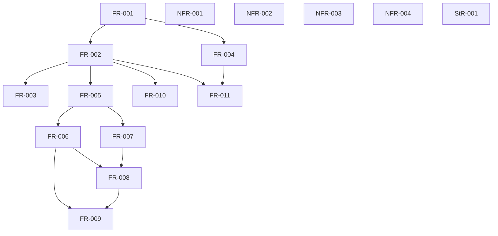

## Summary

The proposed prerequisite DAG is acyclic and classifies every FR/StR/NFR. It exposes phase order and separates final qualification dependencies from independent implementation slices.

## Verdict

**CONDITIONAL** — Findings require disposition before the affected implementation or acceptance gate. This is not owner acceptance.

## Findings

| ID | Severity | Summary | Refs |
| --- | --- | --- | --- |
| FND-001 | medium | Requirements currently link stories and design context but lack a complete explicit prerequisite graph. Incorporate the reviewed ordering into formal task planning; external contract adoption must remain a gate. | FR Dependencies sections; this review; IT-001/IT-002 |

## Scope and provenance

Reviewed `quire-spec-language@a80a17d1dd303b91712df2023fdba8aba83e89c1`. The owner selected base plus all seven Quoin analyses, and declined the optional intent↔test↔code semantic step in `/gap-analysis`. Ordinary requirements consistency, EARS conformance, and the separate current-code review remain in scope. The assignment prohibits spawning additional agents, so these analyses were performed sequentially by Agent A; no independent reviewer acceptance is implied.

The installed Quoin 0.20.0 `spec-review/SKILL.md` and its analysis skills govern these artifacts. The SpecReview authoring pack was fetched once for this repository and its process skeleton/schema was used. [Provenance](data/provenance.json), [coverage output](data/coverage.json), [advisor output](data/advice.json), and [actual method catalog](data/verification-methods.json) preserve the deterministic inputs. IDs in this report are local to this repository unless qualified.

These are new repositories. Missing formal plans, TC records, suites, and matrices are workflow setup/readiness debt. Unimplemented LC02–LC05 stages and unqualified shared consumers are known remaining work; they are not reported as regressions or hidden stubs. No completion status is fabricated.

## Classification

| Requirement | Class | Rationale |
| --- | --- | --- |
| [FR-001](../functional/FR-001-read-exact-source.md) | enablement | Provides a shared checked representation/boundary consumed by downstream behavior. |
| [FR-002](../functional/FR-002-parse-native-units.md) | feature | States observable native behavior or an operator-facing quality/acceptance guarantee. |
| [FR-003](../functional/FR-003-format-native-source.md) | feature | States observable native behavior or an operator-facing quality/acceptance guarantee. |
| [FR-004](../functional/FR-004-verify-source-maps.md) | enablement | Provides a shared checked representation/boundary consumed by downstream behavior. |
| [FR-005](../functional/FR-005-link-shared-model.md) | enablement | Provides a shared checked representation/boundary consumed by downstream behavior. |
| [FR-006](../functional/FR-006-check-defined-expressions.md) | feature | States observable native behavior or an operator-facing quality/acceptance guarantee. |
| [FR-007](../functional/FR-007-validate-runtime-inputs.md) | enablement | Provides a shared checked representation/boundary consumed by downstream behavior. |
| [FR-008](../functional/FR-008-evaluate-state-reference.md) | feature | States observable native behavior or an operator-facing quality/acceptance guarantee. |
| [FR-009](../functional/FR-009-lower-qualified-projections.md) | feature | States observable native behavior or an operator-facing quality/acceptance guarantee. |
| [FR-010](../functional/FR-010-report-native-outcomes.md) | feature | States observable native behavior or an operator-facing quality/acceptance guarantee. |
| [FR-011](../functional/FR-011-integrate-opaque-extraction.md) | feature | States observable native behavior or an operator-facing quality/acceptance guarantee. |
| [NFR-001](../non-functional/NFR-001-bound-syntax-work.md) | feature | States observable native behavior or an operator-facing quality/acceptance guarantee. |
| [NFR-002](../non-functional/NFR-002-reproduce-native-builds.md) | feature | States observable native behavior or an operator-facing quality/acceptance guarantee. |
| [NFR-003](../non-functional/NFR-003-preserve-uncertain-outcomes.md) | feature | States observable native behavior or an operator-facing quality/acceptance guarantee. |
| [NFR-004](../non-functional/NFR-004-preserve-implementation-rights.md) | feature | States observable native behavior or an operator-facing quality/acceptance guarantee. |
| [StR-001](../stakeholder/StR-001-native-assessment-trust.md) | feature | States observable native behavior or an operator-facing quality/acceptance guarantee. |

## Explicit prerequisite edges

The following is the reviewer's proposed logical ordering, derived from the requirement Inputs/Outputs and acceptance contracts. It makes those prerequisites explicit in this review; it does not pretend that the requirement frontmatter already declares a complete dependency DAG. Traceability, `constrains`, and `satisfied_by` edges are not treated as execution dependencies. StR/NFR guarantees apply throughout implementation and require final validation; their appearance as unconstrained nodes is not a claim that their evidence is complete.

| Prerequisite | Dependent | Why the contract requires it |
| --- | --- | --- |
| FR-001 | FR-002 | Parser consumes bounded immutable source. |
| FR-001 | FR-004 | Map verification consumes exact source/body objects. |
| FR-002 | FR-003 | Formatter accepts only a validated ParsedUnit. |
| FR-002 | FR-005 | Linking consumes parsed imports and clauses. |
| FR-002 | FR-010 | Current parse/format CLI reports syntax outcomes. |
| FR-005 | FR-006 | Typing requires a linked shared-model view. |
| FR-005 | FR-007 | Runtime validation needs exact linked domain types. |
| FR-006 | FR-008 | Reference evaluation consumes a reference-evaluable clause. |
| FR-007 | FR-008 | Reference evaluation consumes validated runtime inputs. |
| FR-006 | FR-009 | Qualified lowering requires a typed admitted clause. |
| FR-008 | FR-009 | The lowering parity acceptance requires reference results; implementation of an internal lowerer can be sliced earlier. |
| FR-002 | FR-011 | The extraction adapter sends opaque bodies to the native parser. |
| FR-004 | FR-011 | The adapter acceptance requires verified original-source correspondence. |

## Dependency graph

## Topological order

1. FR-001, NFR-001, NFR-002, NFR-003, NFR-004, StR-001.
2. FR-002, FR-004.
3. FR-003, FR-005, FR-010, FR-011.
4. FR-006, FR-007.
5. FR-008.
6. FR-009.

No cycles occur in the proposed graph. Every FR/StR/NFR is classified exactly once. The ordering is logical, not a schedule, and no enablement is placed after a feature that depends on it.

## External gates

FS02/FS03/FS05 definition acceptance, the existing typed-model view/binder contract, B's independent shared-reference consumer and C's opaque extraction adapter remain explicit external gates. Existing Filament production and legacy contract-IR conformance do not discharge them. Keep these gates on their existing private owning tickets; no competing model authority or binder is justified.
