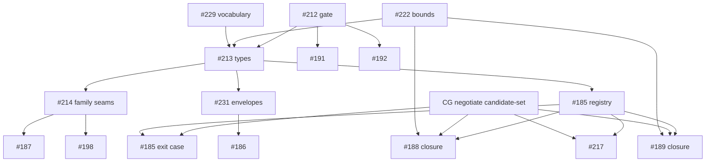

# SR-477: Dependency analysis of ADR-012

## Summary

Round 1. Reviewed commit 048deb3 on `task/210-family-extension`. This pass
checks four things: the family DAG (§1), the handoff edges to sibling and
downstream tickets (§5.3, §8, §13, §14), the L1-D1 decision (§11), and whether
enablement comes before the features that consume it.

What holds:

- The family DAG is acyclic.
- The fixed ownership is cited and not decided here: #229 vocabulary and
  absence policy, #213 `Capability` and outcome types, #185 registry and
  routing, #222 boundedness, #209 stages and crates, #211 types and identities.
- CG `negotiate_*` stays the single point that settles a disposition, as AD-016
  and QSpec PR #133 require.
- All seven L1-D1 calls are correct on the question asked, which is whether the
  ticket waits on #185.
- The `spec/spec.md` index row and `contains` relationship are present and
  correct.

There is one high finding. §1.1 says `negotiate_*` settles `requires-bound`
when a finite bound is available. But §1.1's own candidate rule, the §5.2 table
and the §7.2 table give an unbounded requirement an empty candidate set when
every registrant advertises only bounded mode, and they settle an empty set as
`unsupported`. So AD-016's `requires-bound` disposition for an unbounded
construct with an available finite bound can never be reached (FND-001).

The medium findings are dependency edges the record implies but does not state:

- #185's exit and the #188 and #189 closures need an unopened CG ticket
  (FND-002).
- The rungs relaxed off #185 are left with no edge to #212 or #214 (FND-003).
- #212 scenario 5 depends on #222, which itself depends on #212 (FND-004).
- The migration owners in §14 are wrong or missing (FND-005).
- FR-300, which links protocol and temporal, has no place in the family DAG
  (FR-300 is the control-to-temporal mapping, QSpec PR #59) (FND-006).
- The §1 row for `SumCase` leaves out #187's declared prerequisite on #121
  (FND-007).
- #229's scope overlaps DA-11 (FND-008).

Verdict: **ACCEPT WITH FINDINGS** (round 2, commit 8fb238b). Round 1 was
REJECT until FND-001 was fixed. The revision resolves FND-001 and most medium
findings. FND-002 and FND-008 are partly resolved with low residue, and one new
low finding remains; see "Round 2".

## Findings

| ID | Severity | Summary | Refs |
|---|---|---|---|
| FND-001 | high | Contradiction with AD-016 on `requires-bound`. §1.1 has two statements. Bullet 2 says a bounded-only backend "is not a candidate" for an unbounded requirement. It also says "when a finite bound is available, `negotiate_*` settles `requires-bound`". §5.2 row 3, §7.2 (empty → `unsupported`) and §7.3 ("an absent capability is an item whose candidate set is empty") settle every empty candidate set as `unsupported`. With Kani as the only registrant (bounded only), an unbounded item with an available finite bound therefore reaches `negotiate_*` with an empty set and settles `unsupported`. AD-016 "Frames and unbounded constructs" and arrow 5 require `requires-bound` in that case. The contradiction also changes what #189 and #222 scenario 3 ("claim over an unbounded collection with Kani") can observe. **Fix:** in §7.2 step 1, when no registrant advertises (capability, `Unbounded`), give `negotiate_*` the registrants that advertise (capability, `Bounded`) as a separate typed argument (bound candidates). Add a §7.2 row: "empty, with bound candidates → `requires-bound` when #222 reports an available finite bound, else `unsupported` (warned)". §7.3 then defines absent capability as "no candidates and no bound candidates". The rule that an unbounded requirement is never narrowed still holds, because `requires-bound` is not a proof. | ADR-012 §1.1, §5.2, §7.2, §7.3; AD-016 arrow 5 and "Frames and unbounded constructs"; QSpec PR #133 FR-290; #189; #222 |
| FND-002 | medium | Missing edge from the CG `negotiate_*` ticket. Under §7.2 only CG `negotiate_*` settles a disposition, and §14 leaves the CG change ("`negotiate_*` taking the candidate set") to a ticket "to be opened by the CG owner". Three exit criteria settle a disposition: #185's own exit ("corpus case for a claim with no registrant settles `unsupported` with the warning"), and the reasons §11 gives for keeping #188 and #189. Each therefore also depends on that unopened CG ticket, and on an IR form for the claim, since `negotiate_*` takes an IR form. §11's test ("waits on #185 … when it must settle the absent-capability outcome") names #185 as the settling party, which §7.2 forbids. #217, which depends on #185, needs the same CG change. **Fix:** (a) In §11, restate the test as "needs a candidate set from the #185 registry". Add a column for the second prerequisite: the CG candidate-set ticket, plus the IR form of the claim. (b) In §14, add the edges CG ticket → {#185 exit corpus case, #188 closure, #189 closure, #217}. (c) Choose one of two options for #185's exit, and state which. Option 1: its corpus case observes the empty candidate set, and the CG ticket owns the `unsupported` settlement case. Option 2: #185's exit waits on the CG ticket. Ask the CG owner to open the ticket before #212, because #212 requires that nothing is left for #185 to invent. | ADR-012 §7.2, §11, §14; #185 exit; #188; #189; #217; QSpec PR #133 |
| FND-003 | medium | Dropped transitive edges. Every ladder rung reached #212 → #213 → #185 only through the "woven in after A08" edge. Relaxing that edge (§11) leaves #187 with only #121, QSpec #115 and PR #172, and #191, #192 and #198 with only their QSpec prerequisites. None of these rungs then waits on #212 (architecture accepted) or on #214 (family seams S1–S4). #187 can then add its variants to the monolithic `infer_form` that §4.3 says #214 converts, and #221 must redo that work. §12.1's touch set assumes S1–S4 exist. #186 keeps #231, which is after #213 and so after #212. **Fix:** add a "Waits instead on" column to §11. For #187 and #198 (new family code in QSL), name #212 and #214. For #191 and #192 (xtask gates, no family hook), name #212 only. For #186, name #231 (which already implies #212). If the owner wants #187 before #214, say that explicitly and hand its migration to the `SumCase` migration owner (FND-005). | ADR-012 §4.3, §11, §12.1; ADR-010 L1-D1; #187; #191; #192; #198; #214; #221 |
| FND-004 | medium | Ordering loop through #222. #212 (scenario 5, "submit an unsupported unbounded proof request") must be decided with no ambiguity left to implementation. ADR-012 defers the mode type, the bound representation and "what counts as an available bound" to #222 (§1.1, §2), and #222 depends on #212. The distinction between `requires-bound` and `unsupported` in scenario 5 (FND-001) is therefore decided downstream of the gate that must judge it. **Fix:** state in §1.1 which mechanics #212 can check from this record alone: mode is part of the requirement, no narrowing, the bound is reported, and the FND-001 candidate rule. Name the one input scenario 5 needs from #222's exploratory design ("available finite bound" predicate), which #222 allows to proceed in parallel. Add scenario 5 to the Consequences list beside 2, 3 and 7. | ADR-012 §1.1, §2, Consequences; #212 scenario 5 and failure rule; #222 |
| FND-005 | medium | Wrong or missing migration owners. §14 assigns the `ProtocolClause` and `Relation` migrations to #223. #223's non-goals say it does no protocol/frame, #191/#192 or #198 implementation. §14 names no owner for `TemporalTrace`. §4.3's "#220 to #223" includes #222, a design ticket with no implementation. #214 says the other migrations "remain in #220–#223 and their existing feature tickets". **Fix:** in §14, name implementation owners for each family: `StateModel` #220 with #121; `SumCase` #221 with #187; `TemporalTrace` #188 and #189 under #222's decisions; `ProtocolClause` #218, with #223 supplying the decision packet; `Relation` #198 for the abstraction relation, with #223 supplying the packet. Change §4.3 to name the same owners. | ADR-012 §4.3, §14; #214 scope; #222 non-goals; #223 non-goals |
| FND-006 | medium | FR-300 (the control-to-temporal mapping) is missing from the family DAG. ADR-010 §8 defers QSpec PR #59 (FR-300 control-to-temporal mapping, still open) to #210, and QSL FR-054 holds the activation map. §1 has no edge between `ProtocolClause` and `TemporalTrace` and does not say which family owns the mapping. §9 decides the other deferred items but gives no condition that releases PR #59. **Fix:** add either `ProtocolClause → TemporalTrace` or a named mapping seam owned by one family, and keep the DAG acyclic. Add a §10 row stating what PR #59 now waits on. | ADR-012 §1, §10; ADR-010 §8 (QSpec PR #59); FR-054 |
| FND-007 | medium | The `SumCase` row leaves out #187's prerequisite on #121. §1 gives `SumCase` a dependency on `Value` only, while #187 declares a dependency on V1-A05 #121, whose family is `StateModel`. Either the #121 edge is a family dependency (variants over model types), which §1 is missing, or it is sequencing only and can be relaxed like the #185 edge. **Fix:** decide which it is in §1 or §11. If it is a family dependency, add `SumCase → StateModel`. If not, add #121 to the §11 relaxation list with its reason. | ADR-012 §1, §11; #187; ADR-010 §7.2 |
| FND-008 | medium | Two tickets can decide the same thing. #229's scope says it defines "which stage declares a requirement, which backend advertises support, and which QSL component selects a target". §6, §7.1 and the DA-11 row decide the same thing, and ADR-010 assigns DA-11 to #210 with #229 as secondary. Unless one cites the other, #229 and #210 can each decide it. **Fix:** in §10 DA-11 and §13.3, state that #229's stage/advertiser/selector scope item consumes §6 and §7.1 of this record, and add that item to the §13.3 questions so #229 confirms it. | ADR-012 §6, §7.1, §10 DA-11, §13.3; #229 scope; ADR-010 §9.3 DA-11 |
| FND-009 | low | Work handed to tickets whose bodies do not include it. §14 and §9 add scope to #185 (removing the composed-linker negotiation and turning the `--target` CLI edge into `BackendId`) and to #213 (removing the QSL `negotiate_*` copies). Neither issue body includes this work. #213's scope is shared types, and the QSL copies live in `value/`, which the `Value` family owns (#214). **Fix:** move the QSL `negotiate_*` removal to #214, since it is part of the `Value` family migration. List the scope added to #185 and #214 as ticket-body amendments the owner applies after #212. | ADR-012 §9, §10 OBS-004, §14; #185; #213 non-goals; #214 |
| FND-010 | low | `Requirements` mode is fixed in one place and left open in another. §1.1 fixes "the mode is a field of the requirement" and §2 fixes `Requirements { capabilities, mode, bound }`. §13.3 Q2 then asks #229 whether a capability requirement carries a mode, and says §7 "does not care". **Fix:** state that the mode belongs to this record's `Requirements` whatever #229 answers, and reword §13.3 Q2 to ask only whether backends advertise mode as part of the capability kind. | ADR-012 §1.1, §2, §13.3 |
| FND-011 | low | No owner for the S7 seam test. §5.3 gives #214 the S1–S4 compile-failure tests and gives S5, S6 and S8 to their repositories. S7 (capability kind: requirement derivation, registry advertisement check, absent-capability mapping) has no owner. **Fix:** assign the S7 seam test to #185, since the registry and the per-family derivation arms meet there. | ADR-012 §5.1 S7, §5.3 |
| FND-012 | low | Unmerged normative input. §7.1 and §7.2 rely on FR-290 and AD-010 "as amended by QSpec PR #133", and PR #133 is still open. The frontmatter relates to FR-290 only as `relates_to`. **Fix:** record PR #133's merge as a precondition for accepting this record at #212, and change the FR-290 relationship to `depends_on`. | ADR-012 frontmatter, §7.1; QSpec PR #133 (open) |
| FND-013 | low | Unclear request type in the #198 exit. #198's exit refuses "an unbound element referenced by an emission request". §11 relaxes #198 because the refusal happens in the checker or at export. If the emission request names a backend target, it goes through the `--target` → `BackendId` conversion that §9 gives to #185. **Fix:** in the #198 row, state that the emission request is a checked-package export request and names no `BackendId`. Otherwise keep #198 on #185 for that exit case only. | ADR-012 §9 `--target` row, §11 #198 row; #198 exit |
| FND-014 | low | Direction of the #222 edge. §1 lists #222 among the "consuming tickets" of `TemporalTrace`. #222 is a design input that feeds #213, #188 and #189. It does not consume the family. **Fix:** move #222 into a "design input" note under §1.1, and keep only #188 and later implementers in the consuming column. | ADR-012 §1, §1.1; #222 |

## Method

- Read ADR-012 at 048deb3 in full, and read the `spec/spec.md` frontmatter and
  index table at the same commit.
- Read the bodies of #205, #210, #212, #185, #213, #214, #229, #222, #217,
  #223, #186, #187, #188, #189, #191, #192 and #198 as of 2026-09-19.
- Read ADR-010 §7 and §9 (L1-D1, OBS-003, OBS-004, OBS-012, OBS-013, OBS-014,
  OBS-033, DA-11) and §8 (deferred WIP).
- Read QSpec AD-016 at `origin/main` (arrows 1–7, the terminal-disposition rule,
  "Frames and unbounded constructs", shared-type strategy) and the QSpec PR #133
  diff for FR-290 and AD-010.
- Checked the family DAG for cycles. Compared every §11 row with the rung's
  declared technical prerequisites and exit criteria. Traced each disposition
  that a kept rung needs back to the party that §7.2 lets settle it.
- Checked every §14 handoff against the receiving issue's scope and non-goals.

## Classification

| Ticket or work | Class | Rationale |
|---|---|---|
| #209, #211, #229, #222 | design (enablement input) | Decide the stage, type, vocabulary and bound inputs that this record cites |
| #213 | enablement | `Capability`, outcome, mode and bound types |
| #214 | enablement | `FamilyKind`, S1–S4, `Value` migration |
| #185 | enablement | Registry, candidate sets, routing |
| CG `negotiate_*` candidate-set ticket (unopened) | enablement | Single disposition point over candidates (FND-002) |
| IR v2 reader closed enums ticket (unopened) | enablement | Seam S6 |
| #231 | enablement | Witness and replay envelopes |
| #217 | enablement | Proof spine exemplar |
| #186, #187, #188, #189, #191, #192, #198 | feature | Ladder rungs |
| #220, #221, #223 | conformance | Layer 4 mapping over accepted interfaces |

## Dependency graph (as the findings would leave it)

## Topological order (suggested)

1. #209, #211, #229 and #222 (design; #222 in exploratory mode before #212, per FND-004), then #212.
2. #213.
3. #214, #185, #231, and the CG candidate-set ticket in parallel.
4. #186 (after #231); #187 and #198 (after #214); #191 and #192 (after #212).
5. #188 and #189 closure (after #185, the CG ticket and #222); #217.

## Cycles

The family DAG in §1 has no cycles. At the ticket level there is one loop
through deferral: #210 defers to #222, #222 depends on #212, and #212 depends
on #210. FND-004 breaks it by naming the single #222 input that #212 needs.

## Round 2

Reviewed ADR-012 at 8fb238b (diff from 048deb3). Round-1 verdict: REJECT.

| ID | Round-1 severity | Status | Note |
|---|---|---|---|
| FND-001 | high | resolved | Candidates match on capability kind alone (§7.2 step 1). §1.1 lets `negotiate_*` settle `requires-bound` for a bounded-only candidate when a finite bound is available, and `unsupported` (warned) otherwise. §5.2 and §7.3 agree. |
| FND-002 | medium | partial | §11's test now reads "needs a candidate set from the #185 registry" and adds the CG `negotiate_*` ticket to every ticket that waits on #185, #185's own exit included (option 2). §14 and §14.2 add the edge to #188, #189 and #217. Residue (low): the IR form of the claim, which `negotiate_*` takes, is not named as a prerequisite of #188 and #189 closure. Nothing asks the CG owner to open the ticket before #212, although Consequences cites CG `negotiate_*` tests as scenario 5 evidence. |
| FND-003 | medium | resolved | §11 has a "Waits instead on" column: #186 → #231, #187 and #198 → #212 and #214, #191 and #192 → #212. |
| FND-004 | medium | resolved | §1.1 lists the mechanics #212 checks from this record alone and names the single #222 input (the "available finite bound" predicate), produced in parallel. Scenario 5 is in Consequences. |
| FND-005 | medium | resolved | §1 and §14 name implementation owners per family with the #220–#223 design inputs apart. §4.3 names #120, #121 and #164 under #220. |
| FND-006 | medium | resolved | §1 adds `TemporalTrace → ProtocolClause` and gives the FR-300 mapping to `TemporalTrace`. The DAG stays acyclic. §10 has a PR #59 row: it no longer waits on #210, and its QSL consumer is #188. |
| FND-007 | medium | resolved | §1 states the #121 edge is sequencing, not a family edge, and keeps it. |
| FND-008 | medium | partial | The Context table says #229 consumes §6 and §7.1 for the selection mechanics, and DA-11 names #229 as secondary owner. Residue (low): §13.3 has no question asking #229 to confirm it consumes §6 and §7.1, so the overlap is settled on one side only. |
| FND-009 | low | resolved | §14 gives the QSL `negotiate_*` removal to #214. §14.2 lists issue-body amendments for #185 and #214 after #212. |
| FND-010 | low | resolved | `Requirements` carries extent and bound, not mode. §13.3 Q2 asks only about advertisement. |
| FND-011 | low | resolved | §14 gives the S7 registry arm and its seam probe to #185. §5.3 still groups S7 with the "S5–S9 owners" sentence (SR-478 FND-003 note). |
| FND-012 | low | resolved | PR #133 is merged (818f555), and FR-290 is `depends_on` in the frontmatter. |
| FND-013 | low | resolved | The #198 row states that the emission request is a checked-package export request and names no `BackendId`. |
| FND-014 | low | resolved | §1 moves #222 to a "Design input" column. |

New findings:

| ID | Severity | Summary | Refs |
|---|---|---|---|
| FND-015 | low | Pre-gate edges are stated in prose only. §13.3 Q3 (kinds for frame and sum/case) and §13.4 Q1 (FR-290 vocabulary for value, state and temporal claims) must be answered before #212, which makes #229 and a QSpec issue prerequisites of #212. §14.2 lists edges to add after #212 but not these. The QSpec issue for Q1, and the one for the FR-331 candidate-set field (§13.4 Q3), have no number. Fix: add to §14.2 "#212: add #229 (Q3, Q1) and the QSpec issue for Q1 as prerequisites", and ask the owner to open or name the QSpec issues before #212. | ADR-012 §13.3 Q3, §13.4 Q1 and Q3, §14.2 · #212 · #229 |

Round 2 verdict: ACCEPT WITH FINDINGS
