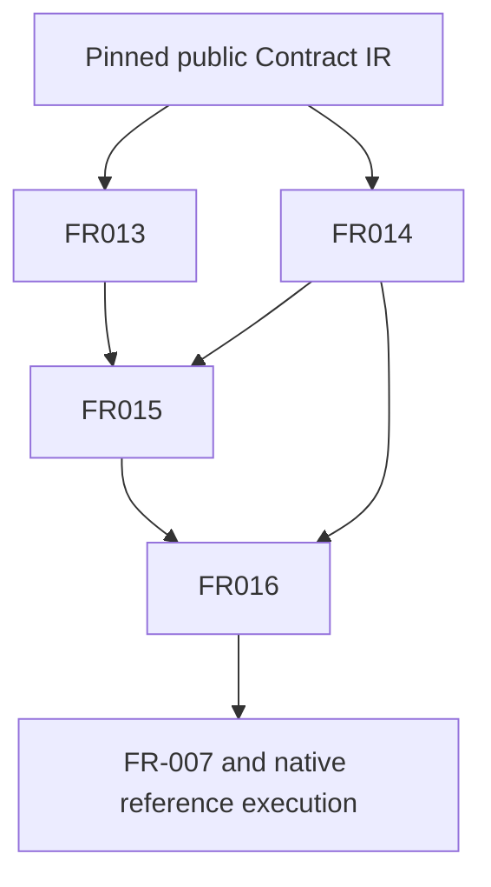

## Summary

The implementation order is native model admission and shared linkage, then checking, then qualification and handoff. Existing IR delivery is available; no external #54 blocker remains.

## Findings

| ID | Severity | Summary | Refs |
| --- | --- | --- | --- |
| FND-001 | low | No unresolved dependency cycle: runtime validation is a recorded assumption and downstream consumer of checked metadata, not a prerequisite service needed to construct static proof obligations. | FR-015; FR-016; FR-007; IT-005 |

## Classification

| Requirement | Class | Role |
| --- | --- | --- |
| StR-001 | Feature | End-to-end native workflow objective, only partly served here |
| NFR-005 | Enablement | Rust implementation and qualification policy |
| FR-013 | Enablement | Landed exact import and declaration resolution |
| FR-014 | Enablement | Landed source/IR correspondence |
| FR-015 | Enablement | Explicit source-bound native model and link profile |
| FR-006 | Feature | Existing static judgments |
| FR-016 | Feature | Concrete type/definedness checker fulfilling FR-006 |
| FR-007 | Feature | Later complete runtime input validation |

## Dependency graph

NFR-005 applies across every new implementation/qualification task; StR-001 is the owning outcome, not a cyclic implementation dependency. FR-006 is refined in executable detail by FR-016 without a prerequisite edge between two implementations.

Topological order: retain FR-013/014; implement and qualify FR-015 plus producer; implement FR-016 and unchanged FR-006 cases; run remaining qualification, actual Rust/code review and non-semantic gap reconciliation. Continue the full runtime/backend/Quire assignment afterwards. All work is serial in Agent A's compiler worktree. Contract IR pin 690bde7f2dc58662cf9ff0595c2c0e3b17107c6f provides DeclarationEnvironment and check_expression. A consumes that interface; B/C/TL and Filament changes are outside this task.

## Verdict and provenance

PASS for implementation of this specified scope. Agent A applied the actual
QUOIN base and all seven analysis skills serially, following the owner's
selected all review set. No subagents or builds were started for this review.
No applicable required AssuranceProfile was found. Catalog schema and existing
public interfaces were inspected. Implementation/test completion is not claimed.
The owner-declined optional gap-analysis semantic comparison remains excluded.

