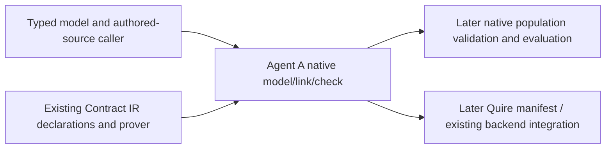

## Summary

Agent A owns the native semantic projection and checking implementation. Existing Contract IR remains the declaration/range authority; runtime validation and executable integration remain explicitly unfinished.

## Findings

| ID | Severity | Summary | Refs |
| --- | --- | --- | --- |
| FND-001 | high | Resolved by the current model contract: source models define object-ID representation, while finite populations supply instances and establish reference existence. Static checking retains those runtime obligations. | FR-015; FR-016-AC-9; FR-007 |

## Context

## Allocation

| Requirement | Owner component | Class |
| --- | --- | --- |
| StR-001 | Native workflow integration | core |
| NFR-005 | Compiler/qualification language policy | cross-cutting |
| FR-013 | Existing native linker | core |
| FR-014 | Existing FormalSource bridge | cross-cutting |
| FR-015 | Native model adapter and shared linker | core |
| FR-006 | Native static checker | core |
| FR-016 | Native static checker | core |
| FR-007 | Later native population validator | core |

## External contracts

| Dependency | Assumed or guaranteed | Boundary |
| --- | --- | --- |
| Caller-assigned source/clause authority | Assumed | Exact correspondence is checked; identity assignment is not authenticated |
| Pinned Contract IR public types/prover | Guaranteed through planned integration tests | IT-005 and TC-040–053; this review is not execution evidence |
| Independently authored rule-model source | Guaranteed through planned producer qualification | TC-040–045; no historical hypotheses relabeled as wire |
| Runtime population validity | Assumed until FR-007 | CheckedClause records observations, universe, context and frame obligations |
| Future Quire manifest ownership | Assumed until actual consumer qualification | Native names do not mint authored requirement/clause identity |

No new Filament reader, shared contract crate, evidence store or temporal system is introduced. The source-derived producer is domain-specific Rust test setup. The numeric prover is reused, while the narrowly specified native presence calculation has its own oracle. A checked package is neither a native runtime Boolean nor an executable backend package.

## Verdict and provenance

PASS for implementation of this specified scope. Agent A applied the actual
QUOIN base and all seven analysis skills serially, following the owner's
selected all review set. No subagents or builds were started for this review.
No applicable required AssuranceProfile was found. Catalog schema and existing
public interfaces were inspected. Implementation/test completion is not claimed.
The owner-declined optional gap-analysis semantic comparison remains excluded.

