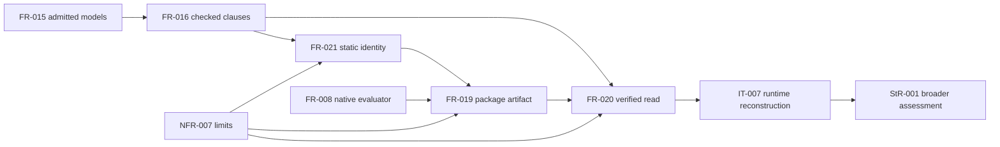

## Summary

The logical prerequisites form an acyclic graph. Static identity derives from
CheckedPackage directly; artifact emission consumes it, and read/rebind consumes
the resulting producer contract. Existing compiler/runtime prerequisites are
landed; shared consumer acceptance remains downstream.

## Findings

| ID | Severity | Summary | Refs |
| --- | --- | --- | --- |
| FND-003 | medium | Positive package setup explicitly depends on a real imported model and clause; no new producer or external prerequisite is introduced. | TC-078; TC-087; TC-090 |
| FND-001 | low | Removed a draft identity-to-artifact prerequisite: FR-021 now depends on checked inputs, avoiding an implicit construction/identity cycle. | FR-016; FR-021; FR-019 |
| FND-002 | low | No unresolved implementation prerequisite requires a new IR/Filament reader, B result envelope or shared repository change. | FR-020; IT-007 |

## Classification

| Requirement | Class | Rationale |
| --- | --- | --- |
| StR-001 | Feature | Trustworthy authored state assessment is the full outcome |
| FR-021 | Enablement | Derives the identity needed by package publication |
| FR-019 | Feature | Exposes the complete reusable checked artifact |
| FR-020 | Feature | Reconstructs a caller-selected artifact for real execution |
| NFR-007 | Enablement | Defines admission/accounting required by every package stage |

## Dependency graph

NFR edges mean constrains, not runtime calls or requirement implementation
cycles. FR-021 reads the common manifest definition from CheckedPackage; it
does not require a previously published NativePackage. FR-019 consumes this
derivation. FR-020 invokes existing parse/link/check, then the same producer
derivation; no input wire claim establishes checked success.

## Topological order

First implement bounded manifest/canonical primitives and their independent
vectors, then complete artifact publication. Next implement recognition,
closed decoding and external correspondence followed by actual reconstruction.
Finally qualify IT-007, full local regressions, code/Rust review and gap/handoff.
These are tasking boundaries, not permission to implement before this review.

The native-reference disposition depends on the landed evaluator. Executable
IR lowering/backend parity remains FR-009/LC04. A/B shared-domain registration
and independent FS05 consumption remain explicitly separate acceptance.
No current compiler dependency waits on retired contract-agent-core or on
closed IR #54. No cycles remain among the new requirements.

## Admitted source setup correction — 2026-09-09

Re-reviewed specification 2c6b9b83dc5c87c68666ebcd24c41b198f4c339b using this
installed QUOIN lens, superseding the initial review's header-only positive
fixture assumption at 41da6e5. The original PASS and its missed precondition
remain visible at 69588ad. Escape cause: wrong-requirement.

The FR-015/016 → FR-021 → FR-019 → FR-020 order is unchanged. Existing qualified model admission supplies the positive fixture; malformed source remains a downstream reader refusal.

Task-016 began under the original completed review gate. Its initial API-red
run is followed by a first implementation run with one passing nonempty case
and three parser setup failures. Further implementation paused for this
specification correction and all-eight re-review; no parser behavior was
relaxed. The initial stdout/stderr is retained in reviews/data/native-packages/.
No claim of executed full package, schema or canonical-vector qualification is
made. PASS to continue against the corrected admitted-source fixture contract.

## Verdict and provenance

PASS for planning and implementing this producer/reader slice. Agent A applied
the installed QUOIN 0.22.5 skills serially under the owner's existing all-review
selection; no required AssuranceProfile applies. This is the author's recorded
review, not independent B/C acceptance. All package cases remain planned.
Changes to the reviewed requirements or interface reopen specify/spec-review.
Full LC02/FS05 interchange, LC04 backend qualification and LC05 Quire integration
remain required. No Cargo build, additional agent or hosted CI dispatch ran.
