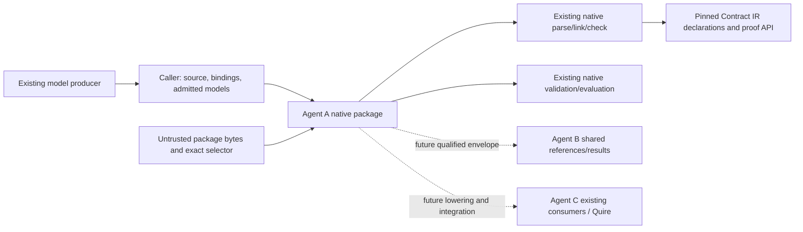

## Summary

Agent A owns the native payload, static derivation and verified read/rebind.
Existing IR declarations/proofs/binding, B's shared envelopes and C's integration
remain distinct authorities. No new repository, service or model compiler is needed.

## Findings

| ID | Severity | Summary | Refs |
| --- | --- | --- | --- |
| FND-001 | low | No ownership overlap is introduced: existing B/C/IR/Filament consumers remain read-only during this slice. | FR-019; FR-020; FR-021 |
| FND-002 | low | B's independent shared-domain registration and C's consumer integration are recorded acceptance work, not an assumed successful handoff. | IT-007; LC02/FS05 |

## System context

## Responsibility allocation

| Requirement | Owning component | Class |
| --- | --- | --- |
| StR-001 | Agent A native assessment pipeline | core |
| FR-019 | Native package producer module | core |
| FR-020 | Native package reader module | core |
| FR-021 | Native package static identity derivation | core |
| NFR-007 | Native package admission/accounting | cross-cutting |

## Dependencies and guarantees

| Dependency | Status at this boundary | Contract |
| --- | --- | --- |
| Caller source/model authority | Assumed: caller selects intended inputs; correspondence is checked | Explicit CheckBindings and admitted NativeModel |
| Native frontend and runtime | Guaranteed by planned real integration, with existing qualified baseline | FR-015/016/007/008; IT-007 |
| Contract IR at 690bde7 | Guaranteed through existing admission/checker and planned integration controls | Public declaration/proof APIs; no forged BoundPackage |
| Adopted standard e897f81 | Assumed normative owner decision; exact definition selection is checked | Both pinned definition revision/digests |
| Serde JSON recognition | Library grammar assumed; boundary behavior guaranteed by planned adverse tests | FR-020/NFR-007 |
| SHA-256 primitive | Cryptographic properties assumed; preimage/encoding guaranteed by planned vectors | FR-021/TC-090 |
| Rust schema validator | Draft implementation assumed; selected schema behavior checked by planned cases | TC-083 |
| B shared-reference interpretation | Not consumed here; independent acceptance unfulfilled | FS05 native-domain registration |
| C/Quire integration and existing model producer | Not invoked here; later compiled-workflow acceptance unfulfilled | LC04/LC05/IT-002 |

A model artifact string is checked against an admitted NativeModel rather than
decoded into a second type authority. Source AST replay avoids another expression
wire/interpreter. The existing private audit JSON policy differs; it is not
silently generalized or copied. Native code and all qualification remain Rust,
with AGPL-3.0-only for new authored artifacts and existing dependency grants.
CLI syntax commands, hosted manual-dispatch policy and publication boundaries
retain their existing scope.

## Verdict and provenance

PASS for planning and implementing this producer/reader slice. Agent A applied
the installed QUOIN 0.22.5 skills serially under the owner's existing all-review
selection; no required AssuranceProfile applies. This is the author's recorded
review, not independent B/C acceptance. All package cases remain planned.
Changes to the reviewed requirements or interface reopen specify/spec-review.
Full LC02/FS05 interchange, LC04 backend qualification and LC05 Quire integration
remain required. No Cargo build, additional agent or hosted CI dispatch ran.
