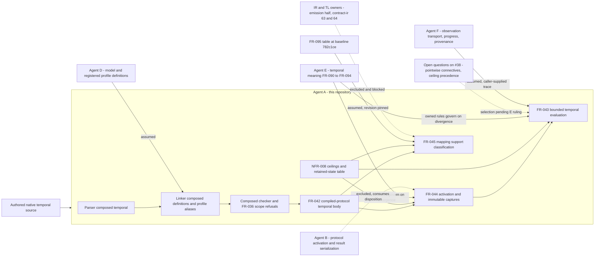

## Summary

Agent A owns native temporal compilation and the compiler-side evaluation of the
`quire.compiled-protocol/1` temporal body it already emits; agent E owns native
temporal meaning, agent B the protocol activation/participation result contract,
agent F observation transport and authority, and the existing IR/TL owners the
bridge. This is the third pass. The blocking finding against 87bc83f — a blanket
"every rule below is a restatement" clause sheltering a rule no owned requirement
states — is resolved in FR-043, and resolved properly: every row of its new
source table was checked against the cited artifact and each cited rule says what
the subsection beside it claims, while the one rule that has no owned source is
now named as a selection, not a restatement, with its visible consequence stated
and a ruling requested. FR-045's table is now keyed on the same axis its source
uses, pinned to a baseline revision and carrying TL target identities.

The same treatment did not reach FR-044. Its source table claims FR-093 rows for
two rules FR-093 does not contain, and FR-044 has no open-questions subsection to
catch them. That is the FND-011 defect class recurring one requirement to the
left, and it is recorded at the same severity for the same reason.

### Disposition

| Prior finding | Disposition at 1f0ff95 | Evidence |
| --- | --- | --- |
| FND-011 blanket restatement claim sheltering an unsourced rule | Resolved, verified row by row | FR-043 source table; "Open questions referred to agent E" naming the pointwise reading as a selection, its visible consequence, the reversed earlier revision and the #38 ruling |
| FND-012 one-axis substitution in FR-045's table | Resolved | Rows keyed on complete/open surrounding execution as FR-095 does; decision-scope closure named as separate in the boundary section and Inputs; AC-1 asserts it is not consulted. New FND-016 records the residual axis ambiguity in the source itself |
| FND-013 unpinned table, no TL target, "declaration alone" contradiction | Resolved | Baseline `782c1ce39a197cd52b8b35b50adf2e5e3ecedd0f` cited; TL target column naming `mltl.closed-trace/v1` and `mltl.online-prefix/v1`; classification stated as a total function of exactly three named inputs, two from the declaration and one from the request; AC-5 |
| FND-014 clock parameters unverifiable | Resolved | FR-043 Behavior marks the rule "retention, not checking", states FR-090-AC-2 is only partly satisfiable here and that no criterion claims otherwise; Dependencies limitation extended to the definition digest |
| FND-015 US-004 allocation asserted, not derived | Resolved | Reciprocal `exercises` edge in US-004 frontmatter and traceability list |

## Findings

| ID | Severity | Summary | Refs | Escape Cause |
| --- | --- | --- | --- | --- |
| FND-018 | high | FR-044's source table repeats the defect FR-043 just fixed, and FR-044 has no "Open questions referred to agent E" subsection to catch it. Two rules it attributes to FR-093 are not in FR-093. First, "Activation guard" cites FR-093 Inputs and a temporal-common.md "activation-scope rule"; FR-093 Inputs names only a "scope/trigger definition", and temporal-common.md mentions activation guards once, as something the expression checker covers. Neither states the dispositions FR-044 asserts and FR-044-AC-7 tests: that a guard evaluating false creates no instance and is not a refusal, and that an unestablished guard is not treated as false. Second, the conflicting-redelivery rule — two deliveries asserting one semantic trigger identity with conflicting payloads return a typed contradiction refusal — sits under "Instance identity", cited to FR-093 Behavior paragraph 1 and FR-093-AC-1/AC-2, which cover duplicate delivery and equal payloads and say nothing about conflicting ones. Both are defensible selections; neither is a restatement, and both change results. A third, smaller case is miscitation rather than invention: the whole-execution-origin instance identity rule is sourced in temporal-common.md ("Each activation has its own exact semantic trigger/origin identity and captures"), which that row does not cite. | FR-044 "Semantic authority and boundary" table; FR-044 Activation guard; FR-044 Instance identity; FR-044-AC-2; FR-044-AC-7; FR-044-AC-8; ix://agent-ix/quire-specification/FR-093; proposals/quire-v1/definitions/temporal-common.md | wrong-requirement |
| FND-016 | medium | FR-045 resolves an ambiguity in FR-095's own table unilaterally, in the direction opposite to the one FND-012 named, and does not record that it did. FR-095 keys its first supported row on "complete execution" and its second on "open prefix" — two different axis vocabularies in adjacent rows of one table. FR-045 normalizes both onto surrounding-execution closure. That is right for the first row and unsupported for the second: `mltl.online-prefix/v1` and FR-091's own "open decision scope" language both point at an open prefix being a decision-scope property, and FR-045-AC-1 now asserts that decision-scope closure is never consulted. FR-043 and FR-044 both gained an open-questions subsection for exactly this situation; FR-045 has none, so a second unilateral axis reading is now load-bearing with no ruling requested. | FR-045 Behavior table rows 3 and 4; FR-045-AC-1; ix://agent-ix/quire-specification/FR-095 support table; FR-091 Behavior | wrong-requirement |
| FND-017 | medium | FR-045's last table row cannot fire, so FR-045-AC-1 is unsatisfiable as written. The table is declared to be evaluated in order, and rows 3, 4 and 5 are keyed on "no past operator reachable", which a declaration reaching no bounded temporal operator at all satisfies. Every such declaration under either false-extension profile is therefore matched by row 3, 4 or 5 before row 6 is reached, and a timestamped one is matched by row 1. Row 6 is unreachable. AC-1 nevertheless requires that "every row of the support table is exercised by an admitted declaration and returns that row's disposition and TL target", and row 6's disposition wording differs from rows 3 to 5, so it is also ambiguous which disposition an operator-free declaration is supposed to receive. Totality is not harmed — the table covers every input combination — only reachability and the criterion that asserts it. | FR-045 Behavior table row 6; FR-045 Behavior ordering sentence; FR-045-AC-1; TC-125 group 1 | wrong-requirement |
| FND-019 | low | FR-045 is the only one of the three functional requirements in this scope with no "Open questions referred to agent E" subsection and no statement of which rules are selections rather than restatements, although it restates another owner's table in full. FND-016 is the concrete instance; the structural gap is that nothing in FR-045 would surface the next one. | FR-045 "Semantic authority and boundary"; FR-043 "Open questions referred to agent E"; FR-044 | missing-requirement |

FR-043's table was checked row by row and is honest. Profile and clock selection
does restate FR-090 Behavior and the three profile artifacts. The eight operators,
inclusive intervals and `once[1,1]` as strong previous with no weak-previous
spelling are verbatim obligations of temporal-common.md's "Temporal forms and
obligations". The lower-bound convention and the release/triggered duals are in
FR-091-AC-3, FR-092-AC-3 and temporal-common.md's until/since rule. The
order-sensitive refusal is FR-090-AC-4. Atoms, constants and boundaries — the
holds/constant distinction, false extension outside a closed complete scope,
finite-window quantification, the instant at the inclusive upper endpoint
participating, empty-existential and empty-universal truth only under
completeness, incomplete input suppressing both boundary rules, and history
against an authoritative origin — are carried by FR-091-AC-2, FR-092-AC-2 and
temporal-timestamped-window.md, all cited. Progress, closure and settlement match
FR-094 Behavior, FR-094-AC-1 to AC-8 and FR-091-AC-4. No rule in FR-043 was found
attributed to a source that does not contain it.

## Context

## Allocation

| Requirement | Owner component | Class |
| --- | --- | --- |
| FR-043 | Native temporal evaluator over the emitted compiled-protocol body | core |
| FR-044 | Native activation and immutable capture binder | core |
| FR-045 | Native-to-TL mapping support classifier, table-only | core |
| NFR-008 | Temporal work accounting and the evaluator's own retained-state table | cross-cutting |
| TC-122 | Local Rust integration suite for FR-043 | core |
| TC-123 | Local Rust integration suite for FR-044 | core |
| TC-124 | Local Rust property suite for NFR-008 | cross-cutting |
| TC-125 | Local Rust unit suite for FR-045 | core |
| TM-008 | Native temporal traceability matrix | cross-cutting |

Two decisions are allocated to agent E and held open on compiler #38 rather than
owned here: the pointwise reading of the Boolean connectives, and precedence
between a reached ceiling and an already-settled sibling obligation. Both are
recorded with the reading this scope selects and an undertaking to change to
match E's ruling, which is the correct allocation for a rule this repository must
implement but does not own. FND-018 and FND-016 identify three further decisions
of the same kind that are not yet allocated this way. The ambient `self`,
`result` and `pre(expr)` capture refusal is correctly allocated away from FR-044
to FR-036's delivered scope checking under TM-002 rather than duplicated.

## External contracts

| Dependency | Assumed or guaranteed | Boundary |
| --- | --- | --- |
| Agent E shared temporal meaning (FR-090, FR-091, FR-092, FR-094) | Assumed, normatively governing, now cited per subsection | FR-043's per-subsection source table verified accurate. FR-044's is not, which FND-018 records |
| Agent E rulings pending on compiler #38 | Assumed, explicitly unresolved | Pointwise connectives and ceiling-versus-settled-sibling precedence are declared selections, with their visible consequences stated and a commitment to conform |
| Agent F observation contract: trace content, order keys, watermark, four closure and completeness assertions, authoritative-origin claim | Assumed, explicitly trusted and not verified | Retained as premises so a later contradiction can identify dependent results. Declared clock parameters and the definition digest are retained the same way and cannot be checked against the artifact; FR-043 now states that FR-090-AC-2 is only partly satisfiable here |
| Agent F duplicate-delivery provenance and receipt identity | Assumed, opaque | A receipt identity is a caller-supplied opaque value. A deduplicates instances by semantic trigger identity. The conflicting-payload refusal built on top of that is A's own selection, which FND-018 records |
| Agent B protocol activation, participation and result serialization | Assumed, excluded in requirement text | FR-043 and FR-044 each state they produce no protocol result and no wire encoding of their own |
| Agent D model and registered profile definitions | Guaranteed in-repo through the existing linker | src/linking/composed/definition_source.rs pins the three concrete profile identities and the shared bounded facet; the shared facet is not a selectable clause profile, so FR-045's table covers every admissible profile |
| FR-042 emitted temporal body, clock binding index, activation record and closed operation graph | Guaranteed | Covered by TM-007. The body carries no declared clock parameters and no definition digest; both are recorded as remaining work on #38 |
| FR-095 reviewed correspondence support table | Assumed, revision pinned | FR-045 cites baseline `782c1ce39a197cd52b8b35b50adf2e5e3ecedd0f`, reports the TL target identity and that baseline on a supported classification, and consults no backend report, installed version, syntax match or historical result. The source table's own axis ambiguity is resolved unilaterally, which FND-016 records |
| quire-contract-ir #63 and #64, actual TL capability, FR-095 emission half | Absent, excluded and blocked | No TL formula, valuation request or correspondence record is produced. A supported classification is a statement about the table, not evidence of a mapping |
| Caller-lowered ceilings and the accounting contract | Assumed for the values, published for the rules | Counters, units, traversal rules, the ceiling table and the clamp rule are published in docs/native-temporal-evaluation.md under `quire.native.temporal-work/1`; expected charges derive from there, not from reported usage |
| Agent F observation storage, replay and lateness | Assumed, explicitly out | NFR-008 separates the evaluator's own retained-state table, which the retention ceiling bounds and whose eviction seam is named, from F's mechanisms |

Classifying mapping support without a bridge does not encroach on the IR or TL
owners, and pinning the baseline revision has closed the staleness route. FR-045
emits no TL artifact, establishes no correspondence, and names the premises an
absent bridge would still have to discharge while stating that naming them is not
discharging them. No new observation store, evidence framework, bridge crate or
shared temporal definition is introduced. `src/temporal/` and `tests/` are under
concurrent edit by another session and were deliberately not read as evidence;
nothing in this review rests on their state.

## Verdict and provenance

FAIL, on one high finding, narrower than the last. FND-018 is the FND-011 defect
class recurring in FR-044: a source table that lends agent E's authority to two
rules FR-093 does not contain — the activation-guard dispositions and the
conflicting-redelivery contradiction — with no open-questions subsection to catch
them. The remedy is the one already applied to FR-043 one requirement to the
right: give FR-044 an "Open questions referred to agent E" subsection naming both
selections and their visible consequences, request the ruling on #38, and cite
temporal-common.md beside the whole-execution-origin row that actually rests on
it. FND-016 and FND-017 are single-sentence corrections to FR-045 and should land
in the same pass; FND-019 is the structural gap behind FND-016.

The remedy applied to FR-043 is sound and was verified rather than accepted:
every row of its source table was checked against the cited artifact, and the one
rule with no owned source is now labelled a selection with its consequence,
its reversed history and its pending ruling on the record. All five findings
raised against 87bc83f are resolved, none by narrowing the claim instead of
meeting it. Nothing in scope belongs to another agent's delivery, and nothing
another agent owns has been implemented here.

Scope-and-boundary analysis only, run against the working tree at the recorded
revision. No FR, NFR, TC, matrix or documentation file was edited by this review,
and no file under `src/` or `tests/` was read or written. No subagents, builds or
hosted workflows were started. `quire validate` establishes document conformance,
not finding resolution and not test completion.
