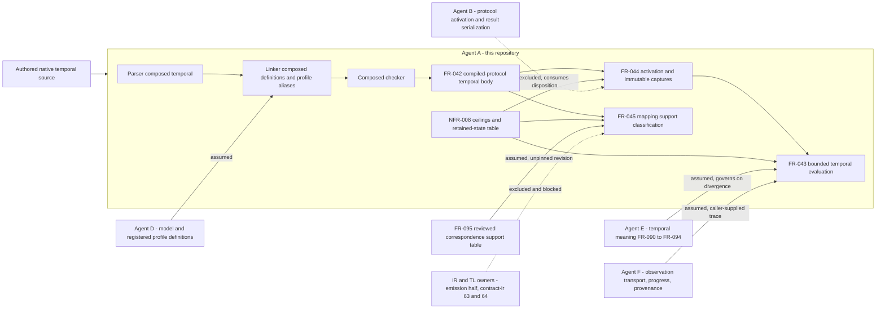

## Summary

Agent A owns native temporal compilation and the compiler-side evaluation of the
`quire.compiled-protocol/1` temporal body it already emits; agent E owns native
temporal meaning, agent B the protocol activation/participation result contract,
agent F observation transport and authority, and the existing IR/TL owners the
bridge. This revision re-runs the analysis against 87bc83f after the ten findings
raised against 4c1eee8 were dispositioned. All ten are resolved. The boundary is
now stated normatively rather than as Dependencies prose, the four closure and
completeness axes are represented, silent deadlines and the origin-versus-cutoff
discriminator have rules and controls, the bridge residue has moved off FR-044
into FR-045, and the accounting contract is published. Four new findings replace
them, one of them high: FR-043's blanket "every rule below is a restatement"
clause now shelters at least one rule that no owned shared requirement states,
which converts a divergence from E into something that reads as compliance.

### Disposition

| Prior finding | Disposition at 87bc83f | Evidence |
| --- | --- | --- |
| FND-001 E's semantics restated as local SHALLs | Resolved, with residue FND-011 | FR-043 and FR-044 "Semantic authority and boundary"; FR-091, FR-092, FR-094 now `depends_on` |
| FND-002 closed-execution axis absent | Resolved | FR-043 Inputs, "Progress, closure and settlement", AC-10, TC-122 group 10 |
| FND-003 silent deadlines unspecified | Resolved | FR-043 watermark rule, AC-11, TC-122 group 11 |
| FND-004 origin versus cutoff untested | Resolved | FR-043 past-operator boundary rule, AC-9, TC-122 group 9 |
| FND-005 unsupported-mapping oracle unowned | Resolved, with residues FND-012 and FND-013 | FR-045 total classification over FR-095's table, consulting no backend report; TC-125 |
| FND-006 bridge residue misallocated and thin | Resolved | Residue moved off FR-044 to FR-045; FR-045-AC-4 requires every unmatched dimension named |
| FND-007 F's trace schema restated unmarked | Resolved | FR-043 boundary section: trusted as supplied, not verified, retained as premises |
| FND-008 B's result contract not excluded | Resolved | FR-043 and FR-044 boundary sections; receipt identity opaque; conflicting-redelivery contradiction added |
| FND-009 charging contract dangling | Resolved | docs/native-temporal-evaluation.md, label `quire.native.temporal-work/1`, eight counters, named in NFR-008 Scope |
| FND-010 relationship declarations inconsistent | Resolved | FR-043 references FR-044 and FR-045, `depends_on` FR-094 |

## Findings

| ID | Severity | Summary | Refs | Escape Cause |
| --- | --- | --- | --- | --- |
| FND-011 | high | FR-043's boundary section asserts that "every semantic rule below is a local restatement of an owned shared rule". That universal is false. The pointwise-connective rule — `not`, `and`, `or` and `implies` evaluated at every offset the enclosing operator ranges over, explicitly "not untimed" — has no owned shared source: FR-091, FR-092 and FR-094 do not state it, and the shared definition artifact only admits "temporal Boolean connectives" without fixing their timing. The same requirement at 4c1eee8 stated the opposite reading ("untimed Boolean connectives"), so both spellings cannot be restatements of one owned rule. The fix for FND-001 therefore made this case worse: an unowned semantic decision, now tested by FR-043-AC-6, is labelled as E's and inherits E's authority. Every other checked rule does have a source — empty-window truth in FR-091 and temporal-timestamped-window.md, the five settlement bases and the missing-fact-inside-decision-support rule in FR-094-AC-7 and FR-091, the lower-bound convention in FR-091-AC-3 and FR-092-AC-3 — which is what makes the unsourced one hard to see. | FR-043 "Semantic authority and boundary"; FR-043 Operators; FR-043-AC-6; TC-122 group 6; ix://agent-ix/quire-specification/FR-091; proposals/quire-v1/definitions/temporal-common.md | wrong-requirement |
| FND-012 | medium | FR-045 substitutes one closure axis for another while restating FR-095's table. FR-095 keys its first supported row on a **complete execution**; FR-045 keys the same row on a **closed decision scope**, and keys its whole classification on "the requested decision-scope closure". FR-043-AC-10 refuses exactly this kind of one-axis substitution between decision-scope closure, surrounding-execution closure, assessment execution and input completeness, so the scope contradicts itself: the axis discipline it enforces on evaluation it abandons on classification. TC-125 group 1 inherits the substitution. | FR-045 Behavior table row 1; FR-045 "Semantic authority and boundary"; FR-043-AC-10; ix://agent-ix/quire-specification/FR-095 support table | wrong-requirement |
| FND-013 | medium | FR-045's `Supported` verdict is a durable claim about another owner's artifact with nothing pinning it. It restates FR-095's table without recording that table's revision or digest, and it drops FR-095's "Existing TL target" column, so a supported classification names no TL profile and cannot be rechecked when the TL owners revise `mltl.closed-trace/v1` or `mltl.online-prefix/v1`. Refusing to consult an installed TL version is correct and is what keeps the classification decidable here; refusing to record which reviewed revision was classified against is not, and it leaves the verdict silently stale. A second, smaller inconsistency rides along: the boundary section and TC-125's Expected Results say the classification is derived "from the admitted declaration alone", while FR-045 Inputs correctly takes the requested decision-scope closure from the mapping request, which is not a property of the declaration. | FR-045 Behavior table; FR-045 Outputs; FR-045-AC-5; TC-125 Expected Results; ix://agent-ix/quire-specification/FR-095 | wrong-requirement |
| FND-014 | medium | The declared clock parameters now have no checkable owner. FR-043-AC-3 was narrowed to profile identity, profile revision and clock binding name, because the emitted body carries no sample period, epoch, timestamp unit or sequence authority; those arrive only as caller-asserted trace premises that change result identity. The narrowing is honestly disclosed in FR-043 Dependencies and TM-008 and correctly allocated to an FR-042 wire extension. It nevertheless leaves this scope unable to satisfy FR-090-AC-2 for stale or internally inconsistent clock definitions: a trace asserting a wrong sample period is neither refused nor detectable, only recorded. Nothing in FR-042's current requirement set obliges it to emit those values. | FR-043-AC-3; FR-043 Dependencies; TM-008 Overview; FR-042; ix://agent-ix/quire-specification/FR-090-AC-2 | missing-requirement |
| FND-015 | low | FR-045 is allocated as implementing US-004 (reuse the existing toolchain) while FR-043 and FR-044 implement US-003. That is defensible, but no requirement or matrix row states why a classification that emits no TL artifact serves toolchain reuse rather than the bounded-evaluation story, and TM-008's stakeholder line asserts the mapping without argument. The allocation reads as placement rather than derivation. | FR-045 frontmatter; TM-008 "Stakeholder and User Story Coverage"; US-004 | wrong-requirement |

## Context

## Allocation

| Requirement | Owner component | Class |
| --- | --- | --- |
| FR-043 | Native temporal evaluator over the emitted compiled-protocol body | core |
| FR-044 | Native activation and immutable capture binder | core |
| FR-045 | Native-to-TL mapping support classifier, table-only | core |
| NFR-008 | Temporal work accounting and the evaluator's own retained-state table | cross-cutting |
| TC-122 | Local Rust integration suite, tests/composed_temporal_evaluation.rs | core |
| TC-123 | Local Rust integration suite, tests/composed_temporal_activation.rs | core |
| TC-124 | Local Rust property suite, tests/composed_temporal_limits.rs | cross-cutting |
| TC-125 | Local Rust unit suite, tests/composed_temporal_mapping.rs | core |
| TM-008 | Native temporal traceability matrix | cross-cutting |

The four premise axes FR-043 now carries — decision-scope closure,
surrounding-execution closure, assessment execution and input completeness — are
allocated identically: each is asserted by agent F's trace, interpreted by this
evaluator under agent E's meaning, and represented as an independent field so no
axis can close or complete another. None of the four is computed here.

## External contracts

| Dependency | Assumed or guaranteed | Boundary |
| --- | --- | --- |
| Agent E shared temporal meaning (FR-090, FR-091, FR-092, FR-094) | Assumed, and now normatively governing | FR-043 and FR-044 declare that the shared rule governs on divergence and that the local rule is then defective. Sound for every rule with a shared source; FND-011 records the one that has none |
| Agent F observation contract: trace content, order keys, watermark, four closure and completeness assertions, authoritative-origin claim | Assumed, explicitly trusted and not verified | Retained as premises so a later contradiction can identify the dependent results. Declared clock parameters are retained the same way and cannot be checked against the artifact, which FND-014 records |
| Agent F duplicate-delivery provenance and receipt identity | Assumed, opaque | A receipt identity is a caller-supplied opaque value. A deduplicates instances by semantic trigger identity and never interprets transport |
| Agent B protocol activation, participation and result serialization | Assumed, excluded in requirement text | FR-043 and FR-044 each state they produce no protocol result and no wire encoding of their own |
| Agent D model and registered profile definitions | Guaranteed in-repo through the existing linker | src/linking/composed/definition_source.rs pins the three concrete profile identities and the shared bounded facet; FR-043 refuses an asserted identity or revision that differs |
| FR-042 emitted temporal body, clock binding index, activation record and closed operation graph | Guaranteed | Already implemented in src/protocol_artifact/native/runtime.rs and wire.rs and covered by TM-007. The body carries no declared clock parameters, which is the gap in FND-014 |
| FR-095 reviewed correspondence support table | Assumed, unpinned | FR-045 restates six rows and consults no backend report, installed version, syntax match or historical result. The table revision is not recorded and the TL target column is dropped, which FND-012 and FND-013 record |
| quire-contract-ir #63 and #64, actual TL capability, FR-095 emission half | Absent, excluded and blocked | No TL formula, valuation request or correspondence record is produced. TM-008 and TC-125 both state that a supported classification is a statement about the table, not evidence of a mapping |
| Caller-lowered ceilings and the accounting contract | Assumed for the values, published for the rules | Eight counters, their units and traversal rules are published in docs/native-temporal-evaluation.md under `quire.native.temporal-work/1`; expected charges in TC-124 derive from there, not from reported usage |
| Agent F observation storage, replay and lateness | Assumed, explicitly out | NFR-008 Scope separates the evaluator's own retained-state table, which the retention ceiling bounds, from F's mechanisms, which it does not constrain |

Classifying mapping support without a bridge does not encroach on the IR or TL
owners. FR-045 emits no TL artifact, establishes no correspondence, consults no
backend capability report or installed version, and names the premises an absent
bridge would still have to discharge while stating that naming them is not
discharging them. The encroachment risk is not the classification but its
durability: an unpinned restatement of another owner's table, recorded in
FND-013. No new observation store, evidence framework, bridge crate or shared
temporal definition is introduced. The evaluator, its accounting and its controls
are domain-specific Rust driven through the public API, consistent with the
repository's Rust-only and local-checks-only directives.

## Verdict and provenance

FAIL, on one high finding with a narrow remedy. FND-011 is a boundary defect of
exactly the kind this analysis exists to catch: a blanket restatement clause that
grants E's authority to a rule E never wrote, and that reverses the same
requirement's previous reading without anyone owning the reversal. The remedy is
wording, not redesign — cite the owned source per rule or per rule group, and
move the pointwise-connective reading into an explicitly open question referred to
E rather than leaving it inside the restatement blanket. FND-012 and FND-013
should be resolved in the same pass, since both are single-sentence corrections to
FR-045. FND-014 and FND-015 are recorded, not blocking; FND-014 already carries a
named owner, a remaining-work entry on compiler #38 and an honest matrix note.

All ten findings raised against 4c1eee8 are resolved and none was resolved by
narrowing the claim rather than meeting it, with the single disclosed exception of
FR-043-AC-3, which FND-014 records in full. Nothing in scope belongs to another
agent's delivery, and nothing another agent owns has been implemented here.

Scope-and-boundary analysis only, run against the working tree at the recorded
revision. No FR, NFR, TC, matrix or documentation file was edited by this review.
No subagents, builds or hosted workflows were started. `quire validate`
establishes document conformance, not finding resolution and not test completion.
