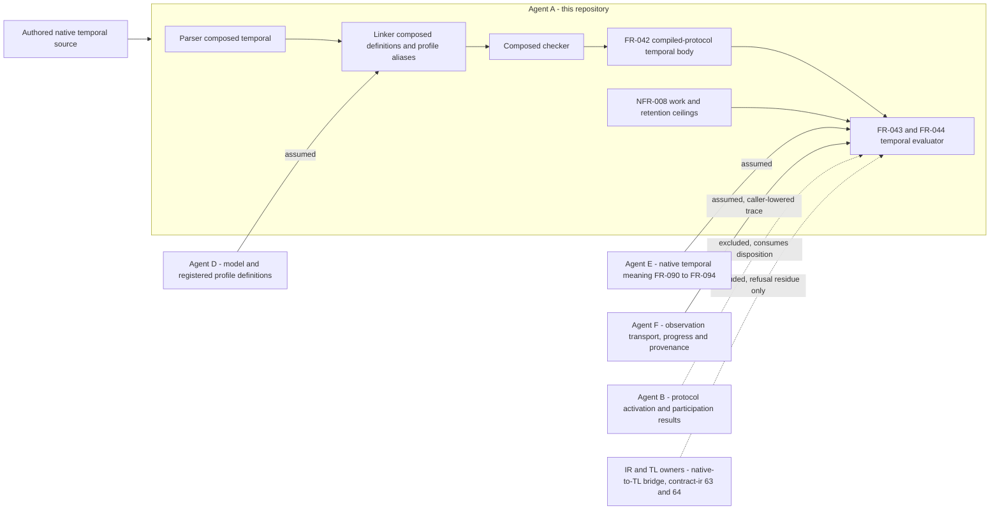

## Summary

Agent A owns native temporal compilation and the compiler-side evaluation of the
`quire.compiled-protocol/1` temporal body it already emits; agent E owns native
temporal meaning, agent B the protocol activation/participation result contract,
agent F observation transport and authority, and the existing IR/TL owners the
bridge. The scoped artifacts keep the bridge, the observation transport and the
participation result outside correctly, but FR-043 restates E's operator meaning
as its own normative rule, silently drops three dimensions the owning ticket's
acceptance names — closed executions, silent deadlines and the origin-versus-cutoff
history discriminator — and hangs the whole native-to-TL residue on an activation
requirement whose unsupported-mapping oracle has no owner in this repository.

## Findings

| ID | Severity | Summary | Refs | Escape Cause |
| --- | --- | --- | --- | --- |
| FND-001 | high | FR-043's Behavior section defines the shared temporal meaning rather than deferring to it: the eight-operator inclusive-interval reading, the false-extension atom-versus-constant rule, the finite-window no-synthetic-atom rule and the open-prefix settlement rule are authored here as local SHALLs. The only statement of the boundary is a Dependencies sentence ("The shared temporal meaning is owned by agent E"), and FR-091/FR-092 are declared `references`, not `depends_on`. A native reading that diverged from E would validate, review clean and ship, which is exactly the outcome the owning ticket forbids without reviewed correspondence and distinguishing vectors. | FR-043 Behavior; FR-043 Dependencies; ix://agent-ix/quire-specification/FR-090; FR-091; FR-092 | wrong-requirement |
| FND-002 | high | The closed-execution axis is absent. FR-043 admits one progress dimension, the trace's "decision-scope progress state (open or closed)". Surrounding-execution closure and the assessment-execution disposition are never an input, never a behavior and never an acceptance criterion, although FR-094-AC-3 requires the axes to stay independent and FR-044 already uses an "assessment-execution disposition" for triggers. TC-122 step 6 nevertheless asserts that settled cases "claim no execution closure" — a control with no requirement behind it. The owning ticket lists closed executions as acceptance. | FR-043 Inputs; FR-043-AC-6; TC-122 step 6; ix://agent-ix/quire-specification/FR-094 | missing-requirement |
| FND-003 | high | Silent deadlines are unspecified. FR-043 settles a Boolean only where an admitted continuation argument or a witness decides it; nothing states that complete fixed-sample or timestamped progress through an inclusive deadline settles a bounded obligation with no business event, nor that event-position time does not advance in that case. FR-091-AC-5 and FR-094-AC-2 both carry this rule and the owning ticket names it in acceptance. No AC in FR-043, FR-044 or NFR-008 exercises it, and TM-008 claims complete coverage of the scope. | FR-043 Behavior; FR-043-AC-6; TM-008; ix://agent-ix/quire-specification/FR-091-AC-5; FR-094-AC-2 | missing-requirement |
| FND-004 | high | Missing history is covered only as an omitted interval. FR-043-AC-7 and TC-122 step 7 remove an interior history interval, but neither the requirement nor any control exercises the decisive case: the same visible suffix yields a Boolean when its start is the authoritative execution origin and incomplete when it is merely a cutoff. FR-043 retains the authoritative origin in its premises and never makes it decide anything, so a past-operator implementation that treated every truncation as an origin would pass the whole matrix. | FR-043-AC-7; TC-122 step 7; ix://agent-ix/quire-specification/FR-092-AC-2 | missing-requirement |
| FND-005 | high | The unsupported-mapping determination has no owner inside the reviewed boundary. FR-044-AC-7 and TC-123 step 7 require a refusal "whose requested mapping reports unsupported", but the bridge is explicitly absent (quire-contract-ir #63/#64 are prerequisites, not implementations) and FR-043 forbids the evaluator from consuming a backend capability report. Nothing says whether the unsupported verdict comes from a compiler-local support table that A owns or from the bridge that the IR owners own. As written, a hand-written stub returning `unsupported` satisfies the criterion and the refusal proves nothing about the bridge. FR-095 solves the same problem with a published support table; this scope has no equivalent. | FR-044-AC-7; TC-123 step 7; FR-043 Inputs; ix://agent-ix/quire-specification/FR-095 | wrong-requirement |
| FND-006 | medium | The bridge residue is allocated to the wrong requirement. FR-044 owns activation and immutable captures, yet it carries the only native-to-TL obligation in the scope, and FR-043's Description forwards mapping refusals to "FR-044's retained native subject". A mapping request is neither an activation nor a capture. The residue is also thinner than its sources: FR-044-AC-7 requires the native subject, profile and activation record to be retained, but no criterion requires the refusal to name the unmatched semantic dimensions, which FR-095-AC-3 and FR-048-AC-8 both do. | FR-043 Description; FR-044-AC-7; TM-008 Overview; ix://agent-ix/quire-specification/FR-048-AC-8; FR-095-AC-3 | wrong-requirement |
| FND-007 | medium | The observation trace is correctly a caller-supplied input and the evaluator correctly consumes no ambient clock, default profile, file ordering or capability report. The defect is narrower: FR-043 defines the trace's per-position content — clock coordinate, total `holds` valuation, admitted order key, decision-scope progress, completeness assertion and authoritative origin — without declaring it a caller-lowered projection of agent F's observation contract, and without marking completeness and origin as trusted-not-verified. That restates F's schema under A's SHALLs and leaves the assumed-versus-guaranteed status of the authority fields unrecorded. | FR-043 Inputs; ix://agent-ix/quire-specification/FR-090 Dependencies; FR-094 Dependencies | wrong-requirement |
| FND-008 | medium | FR-044's activation disposition does not encroach on agent B. `inactive`, `unknown` and `active` are the temporal activation dimension that FR-093 defines, FR-044 produces no protocol choice or conformance verdict, and its Dependencies name B and F explicitly. Two residues remain: the disposition's serialized form will travel in B's result wire contract and FR-044 does not exclude that encoding the way FR-043 excludes transport, and FR-044-AC-2's retained receipt provenance consumes F's duplicate-delivery model as though it were local structure. TC-123's closing note disclaims wire-layer deduplication, but no requirement text does. | FR-044 Outputs; FR-044-AC-2; TC-123 Expected Results; ix://agent-ix/quire-specification/FR-093 | wrong-requirement |
| FND-009 | medium | NFR-008's oracle is dangling. TC-124 and TM-008 derive every expected charge "from the published charging contract", but NFR-008 publishes none and names none, in contrast with NFR-006, which points at docs/native-runtime-evaluation.md for its execution contract. Without a named document the property groups can only be enumerated against the implementation's own accounting, which TC-124 simultaneously forbids. | NFR-008 Scope; TC-124 Description; TM-008; NFR-006 | correct-requirement-no-evidence |
| FND-010 | low | Relationship declarations are inconsistent with the allocation the prose asserts. FR-043's frontmatter declares `depends_on` FR-044 while its Dependencies section calls FR-044 a peer, and FR-043 declares no relationship at all to FR-094 despite consuming progress, completeness and origin. No FR-043 criterion exercises the immutable capture environment it claims to depend on; that coupling is asserted only from FR-044's side. | FR-043 frontmatter; FR-043 Dependencies; FR-044 Dependencies | wrong-requirement |

## Context

## Allocation

| Requirement | Owner component | Class |
| --- | --- | --- |
| FR-043 | Native temporal evaluator over the emitted compiled-protocol body | core |
| FR-044 | Native activation and immutable capture binder | core |
| NFR-008 | Temporal evaluation work accounting and required-state retention | cross-cutting |
| TC-122 | Local Rust integration suite, tests/composed_temporal_evaluation.rs | core |
| TC-123 | Local Rust integration suite, tests/composed_temporal_activation.rs | core |
| TC-124 | Local Rust property suite, tests/composed_temporal_limits.rs | cross-cutting |
| TM-008 | Native temporal traceability matrix | cross-cutting |

## External contracts

| Dependency | Assumed or guaranteed | Boundary |
| --- | --- | --- |
| Agent E shared temporal meaning (FR-090, FR-091, FR-092, FR-094) | Assumed | Consumed by profile identity only. No correspondence record and no distinguishing vectors bind A's restated rules to E's, which FND-001 records |
| Agent F observation contract: trace content, order keys, progress, completeness, authoritative origin | Assumed, not authenticated | Caller-lowered values. A interprets them and never verifies transport, authority or replay. The projection is unnamed, which FND-007 records |
| Agent F duplicate-delivery provenance and receipt identity | Assumed | Semantic trigger identity arrives as an input. A deduplicates instances, never receipts |
| Agent B protocol activation and participation result contract | Assumed, excluded | FR-044 emits the temporal activation dimension only. The result wire encoding is B's and is not excluded in text, which FND-008 records |
| Agent D model and registered profile definitions | Guaranteed in-repo through the existing linker | src/linking/composed/definition_source.rs pins the three concrete profile identities and the shared bounded facet |
| FR-042 emitted `quire.compiled-protocol/1` temporal body, clock binding and closed operation graph | Guaranteed | Already implemented in src/protocol_artifact/native/runtime.rs and wire.rs and covered by TM-007. This scope adds no claim about emission |
| quire-contract-ir #63 and #64 native-to-TL bridge | Absent, excluded | TM-008 excludes lowering. The only residue is FR-044-AC-7, whose unsupported verdict has no owned source, which FND-005 and FND-006 record |
| TL evaluator past-time and timestamp capability | Assumed unavailable | An explicit mapping refusal with a retained native subject, never a reduced native language |
| Caller-lowered evaluation ceilings and the charging contract behind them | Assumed | Numeric ceilings are explicit inputs and NFR-008 invents no universal maximum. The contract the tests read expectations from is unpublished, which FND-009 records |
| Observation storage and replay mechanisms | Assumed, explicitly out | NFR-008 Scope defers these to agent F and defines no storage or replay |

No new observation store, evidence framework, bridge crate or shared temporal
definition is introduced by this scope. The evaluator, its accounting and its
test controls are domain-specific Rust in this repository, driven through the
public API, consistent with the repository's Rust-only and local-checks-only
directives. Parsing, linking, type admission and artifact emission for temporal
declarations are already implemented and are covered by TM-002, TM-005 and
TM-007; this review makes no completion claim about them.

## Verdict and provenance

CHANGES REQUIRED before implementation of the reviewed scope. Five high findings
stand: FND-001 leaves E's meaning restated rather than referenced, FND-002 to
FND-004 leave three named ticket acceptance dimensions — closed executions,
silent deadlines and the origin-versus-cutoff history discriminator — with no
requirement and no control, and FND-005 leaves the bridge refusal satisfiable by
a stub. The bridge itself is correctly excluded and the observation trace is
correctly a caller-supplied input; those two boundaries need wording, not
relocation. Nothing in scope belongs to another agent's delivery, and nothing
another agent owns has been implemented here.

Scope-and-boundary analysis only, run against the working tree at the recorded
revision. No FR, NFR, TC or matrix file was edited by this review. No subagents,
builds or hosted workflows were started. `quire validate` establishes document
conformance, not finding resolution and not test completion.
