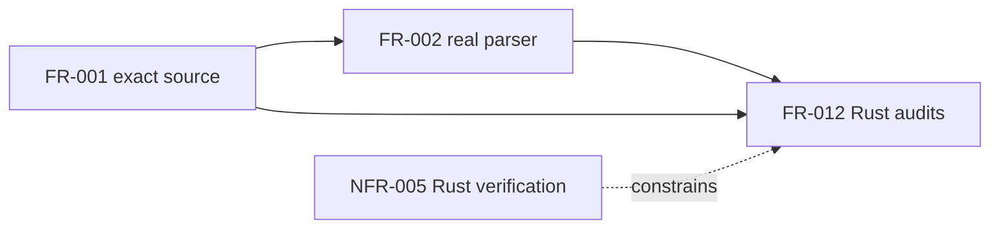

## Summary

The bounded Rust audit specification is reviewed under the owner-selected full
analysis set. Dispositions preserve original fixture evidence and explicitly
withhold fresh unapproved producer qualification.

## Verdict

**PASS** for the specified audit/refusal slice. This is the performed review
result, not an invented owner acceptance of other contracts or publication.

## Findings

| ID | Severity | Summary | Refs |
| --- | --- | --- | --- |
| FND-001 | low | No cycle or unresolved implementation prerequisite in the audit slice. Fresh producer execution is deliberately not a prerequisite to these audits. | FR-012; NFR-005 |

## Scope and provenance

This follow-up reviews FR-012/NFR-005/IT-004 and the associated NFR-002,
IT-001, US-004, StR-001 and master lineage amendments at `11a9128`. It does not
reopen or accept the remaining native evaluator/shared-interface scope.
The owner's existing selection is base plus all seven Quoin analyses; the
optional gap-analysis semantic comparison remains declined. Agent A performed
the analyses sequentially under the assignment's no-extra-agents rule.

The installed Quoin 0.20.0 specify/spec-review skills and catalog packs were
used. Quoin 0.23.1, Quire CLI 0.31.0 / engine 0.46.0 and the same manifests as
the [baseline review](../base.md) apply. The new authoring pack resolved org
agent-ix from this Git remote. The original 35 scoped documents, including
baseline reviews, were grammar-clean after this specification change. The six
known installed registry errors remain external and are not an error-free
validation signoff. No source, test or CI implementation changed before this
review.

The user's Rust-remediation direction governs owned verification logic. The
[LC01 campaign audit](https://github.com/agent-ix/quire-spec-language/issues/2#issuecomment-5579283030)
also requires a separate disposition for the existing TypeSpec/Node producer.
FR-012 explicitly refuses that mode; this review does not approve its language.
The historical producer result remains pinned evidence, not a fresh execution.

## Classification

| Requirement in changed obligation scope | Class | Reason |
| --- | --- | --- |
| FR-012 | feature | Reports observable fixture verification outcomes. |
| NFR-005 | feature | Makes the campaign's executable-language constraint observable. |

Existing consumed FR-001 is enablement and FR-002 is a feature; their reviewed
public source/parser outputs are the explicit FR-012 prerequisites. The existing
NFR-002 build and NFR-004 rights constraints apply without claiming their entire
baseline findings are resolved. StR-001/US-004 changes add lineage only.

## Prerequisite DAG and order

The solid-edge prerequisite DAG is acyclic. Reuse source/parser first; implement
the audit's shared checked I/O/JSON/error layer next; port mode checks; then
exercise real fixtures, switch CI/docs and retire Python. The NFR is a constraint,
not a cyclic execution dependency. No B/C change or accepted FS05 native wire
reader is required to inspect the historical packet honestly.
