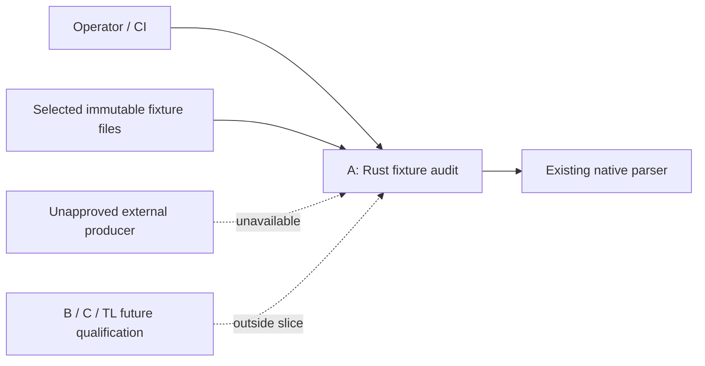

## Summary

The bounded Rust audit specification is reviewed under the owner-selected full
analysis set. Dispositions preserve original fixture evidence and explicitly
withhold fresh unapproved producer qualification.

## Verdict

**PASS** for the specified audit/refusal slice. This is the performed review
result, not an invented owner acceptance of other contracts or publication.

## Findings

| ID | Severity | Summary | Refs |
| --- | --- | --- | --- |
| FND-001 | low | No ownership or assumed-dependency gap blocks the owned audit slice; fresh external production is explicitly unavailable. | FR-012; NFR-005; IT-001/IT-004 |

## Scope and provenance

This follow-up reviews FR-012/NFR-005/IT-004 and the associated NFR-002,
IT-001, US-004, StR-001 and master lineage amendments at `11a9128`. It does not
reopen or accept the remaining native evaluator/shared-interface scope.
The owner's existing selection is base plus all seven Quoin analyses; the
optional gap-analysis semantic comparison remains declined. Agent A performed
the analyses sequentially under the assignment's no-extra-agents rule.

The installed Quoin 0.20.0 specify/spec-review skills and catalog packs were
used. Quoin 0.23.1, Quire CLI 0.31.0 / engine 0.46.0 and the same manifests as
the [baseline review](../base.md) apply. The new authoring pack resolved org
agent-ix from this Git remote. The original 35 scoped documents, including
baseline reviews, were grammar-clean after this specification change. The six
known installed registry errors remain external and are not an error-free
validation signoff. No source, test or CI implementation changed before this
review.

The user's Rust-remediation direction governs owned verification logic. The
[LC01 campaign audit](https://github.com/agent-ix/quire-spec-language/issues/2#issuecomment-5579283030)
also requires a separate disposition for the existing TypeSpec/Node producer.
FR-012 explicitly refuses that mode; this review does not approve its language.
The historical producer result remains pinned evidence, not a fresh execution.

## Responsibility allocation

| Requirement | Owner | Class |
| --- | --- | --- |
| FR-012 | Agent A: Rust fixture-audit executable/private modules | infrastructure |
| NFR-005 | Agent A: owned verification/CI inventory and producer gate | cross-cutting |

## Dependencies and actors

| Actor/dependency | Assumed or guaranteed | Contract |
| --- | --- | --- |
| Operator / CI | assumed selected immutable local fixtures | Explicit roots, modes and byte/record limits in FR-012. |
| Native source/parser | guaranteed only for existing syntax checks | FR-001/FR-002; actual library calls and traced tests. |
| Standard fixture producer | assumed authored expectations | Pin packet bytes; audit identity/correspondence only. |
| Existing TypeSpec/Node producer | assumed, unapproved for fresh execution | IT-001 owner disposition gate; FR-012 refusal. |
| B/C/TL owners | assumed future shared qualification | No workspace changes or capability approval needed for this slice. |
| Cargo dependencies | assumed published package behavior, locally tested | Pinned versions and preserved grants; no second-language verification scripts. |

The new executable reuses crate hashing/parser code but keeps fixture-specific
validation in private modules. It does not widen the public compiler API or
create a production interchange/model authority. The native default CLI command
remains unambiguous when the audit binary is added.
