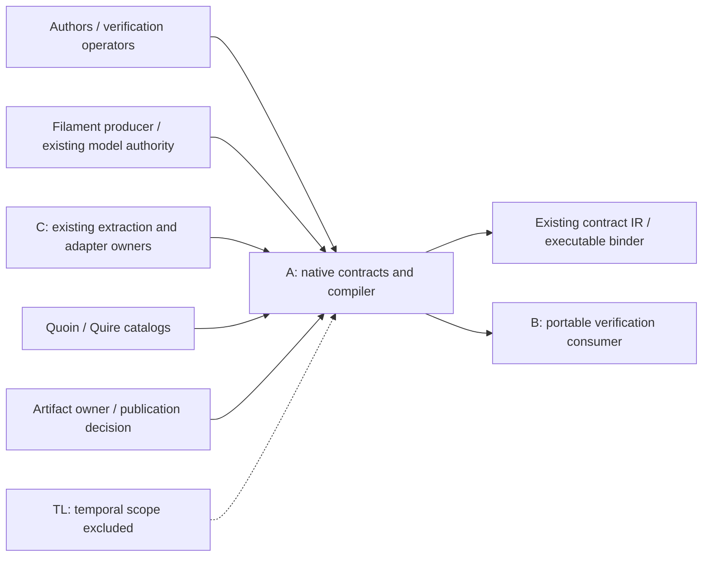

## Summary

Every FR/StR/NFR has one owning component and responsibility class. External producer regression evidence is bounded explicitly; native model, portable result and extraction qualification are still external dependencies.

## Verdict

**CONDITIONAL** — Findings require disposition before the affected implementation or acceptance gate. This is not owner acceptance.

## Findings

| ID | Severity | Summary | Refs |
| --- | --- | --- | --- |
| FND-001 | medium | B/C native shared-reference, typed-model and extraction adoption remains assumed. Preserve concrete producer/consumer qualification gates before treating these boundaries as guaranteed. | IT-001/IT-002/IT-003; external dependency table |

## Scope and provenance

Reviewed `quire-spec-language@a80a17d1dd303b91712df2023fdba8aba83e89c1`. The owner selected base plus all seven Quoin analyses, and declined the optional intent↔test↔code semantic step in `/gap-analysis`. Ordinary requirements consistency, EARS conformance, and the separate current-code review remain in scope. The assignment prohibits spawning additional agents, so these analyses were performed sequentially by Agent A; no independent reviewer acceptance is implied.

The installed Quoin 0.20.0 `spec-review/SKILL.md` and its analysis skills govern these artifacts. The SpecReview authoring pack was fetched once for this repository and its process skeleton/schema was used. [Provenance](data/provenance.json), [coverage output](data/coverage.json), [advisor output](data/advice.json), and [actual method catalog](data/verification-methods.json) preserve the deterministic inputs. IDs in this report are local to this repository unless qualified.

These are new repositories. Missing formal plans, TC records, suites, and matrices are workflow setup/readiness debt. Unimplemented LC02–LC05 stages and unqualified shared consumers are known remaining work; they are not reported as regressions or hidden stubs. No completion status is fabricated.

## In-scope responsibilities

A owns native source intake, lexer/parser/formatter, source correspondence, linking, typing, runtime validation, reference evaluation, native lowering and the native side of extraction integration. Binding/lowering remain modules unless an independently used crate boundary is justified.

## System context

## External dependencies

| Dependency / actor | Boundary | Assumed or guaranteed | Contract and limit |
| --- | --- | --- | --- |
| Specification author / verification operator | Selected source, profile, inputs and work budgets | assumed | FR-001/StR-001; inputs are validated, caller intent is not inferred. |
| Filament model producer | Existing TypeSpec process / semantic IR / manifest / lock | guaranteed for the inspected production fixture only | 3b75e01c652ba00bb07c352ff5467419401e792b, TypeSpec 1.15.0; recorded fresh/locked/stale-lock checks. Native typed binding remains assumed/unqualified. |
| Existing contract-IR owners | Typed-model view, canonicalization and executable binding | guaranteed for inspected legacy regression baseline only | decc99a430a0894de489102dbab04e83d1fb804f; 17 canonicalization/binding tests and 99 conformance rows observed in prerequisite inspection. Proposed native projection remains assumed/unqualified. |
| Agent B / portable verification consumer | Method/plan/result envelopes and independent reference joins | assumed | Standard IT-002; private verification PR6 at 4c46481 still uses the older revision/profile shape. A-v2 adoption not established. |
| Agent C / existing Quire extraction | Opaque body, selected source region/map and existing-repository adapter | assumed | Language IT-003; CO01 ownership/amendment proposal. No second Markdown expression compiler. |
| TL session / temporal work | Temporal capability and clock semantics | assumed and excluded from this profile | No temporal capability is inherited by a finite-state syntax result. |
| Quoin/Quire catalog tools | Authoring, grammar, trace and method analysis | assumed with observed limitations | Recorded versions/manifests; DuplicateArchetype/DuplicateInverseEdge remain external diagnostics. |
| Artifact owner / publication decision | Accepted review, included-file rights and standard grant | assumed, not approved by this review | LICENSE-DECISION.md and NFR-004; AGPL-3.0-only applies to new implementation, standard prose grant deferred. |

## Responsibility allocation

| Requirement | Owning component | Class |
| --- | --- | --- |
| [FR-001](../functional/FR-001-read-exact-source.md) | A: immutable source module | infrastructure |
| [FR-002](../functional/FR-002-parse-native-units.md) | A: lexer/parser modules | core |
| [FR-003](../functional/FR-003-format-native-source.md) | A: formatter module | core |
| [FR-004](../functional/FR-004-verify-source-maps.md) | A: source-map module | cross-cutting |
| [FR-005](../functional/FR-005-link-shared-model.md) | A: native linking module | core |
| [FR-006](../functional/FR-006-check-defined-expressions.md) | A: type/definedness module | core |
| [FR-007](../functional/FR-007-validate-runtime-inputs.md) | A: runtime-input validation module | core |
| [FR-008](../functional/FR-008-evaluate-state-reference.md) | A: reference evaluator module | core |
| [FR-009](../functional/FR-009-lower-qualified-projections.md) | A: native lowering module | core |
| [FR-010](../functional/FR-010-report-native-outcomes.md) | A: native CLI boundary | infrastructure |
| [FR-011](../functional/FR-011-integrate-opaque-extraction.md) | A: native side of opaque extraction adapter | infrastructure |
| [NFR-001](../non-functional/NFR-001-bound-syntax-work.md) | A: resource/diagnostic contract across phases | cross-cutting |
| [NFR-002](../non-functional/NFR-002-reproduce-native-builds.md) | A: build and integration runner | infrastructure |
| [NFR-003](../non-functional/NFR-003-preserve-uncertain-outcomes.md) | A: phase outcome propagation | cross-cutting |
| [NFR-004](../non-functional/NFR-004-preserve-implementation-rights.md) | A: implementation artifact rights inventory | cross-cutting |
| [StR-001](../stakeholder/StR-001-native-assessment-trust.md) | A: finite-state workflow acceptance | core |

## Architecture assessment

The present split is sound: one declarative token vocabulary, a parser-owned syntax tree, immutable source and source maps, then separately checked linked/evaluable representations. Keep model authority and executable binding in their existing owners. Avoid a service/event bus, plugin framework, parallel evaluator or extra crate merely to fill a diagram. Strengthen the actual seams with typed identities, standard error traits, explicit budgets and consumer contract tests. The current-code specifics are in the language code review; the unimplemented stages are planned responsibilities, not hidden capabilities.
