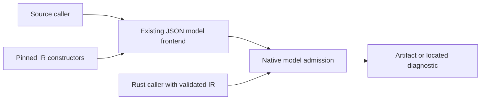

## Summary

Allocated FR-015's new admission responsibility to the native model module. Both caller routes use that owner; the shared IR's broader domain is intentionally not redefined here.

## Findings

| ID | Severity | Summary | Refs |
| --- | --- | --- | --- |
| FND-001 | low | Previously admitted declarations above 10,000 now refuse. This is the intended local compatibility change; other source-profile differences remain open. | FR-015; compiler #30 |

## Context and ownership

| Requirement | Owner | Class |
| --- | --- | --- |
| FR-015 ceiling | native_model::admission | core |
| NFR-005 | compiler repository | cross-cutting |

IR constructor behavior is directly exercised by successful construction of 10,001/u32::MAX test types before native refusal; broader IR correctness remains the consumed producer contract. Existing Serde/source correspondence is consumed through the real frontend and original-source assertions, not replaced. No B/C repository, runtime input schema, language definition pin or hosted workflow changes. Accepted model encoding retains frozen regression coverage; full profile identity and external export mappings remain FS01/FS06 work.

