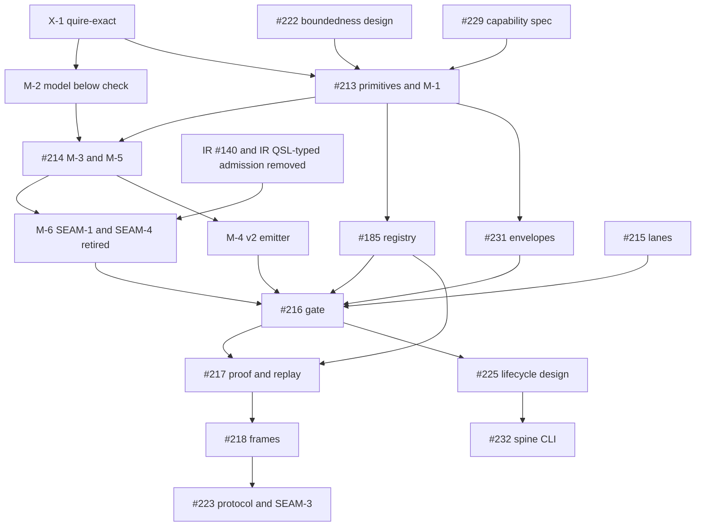

# SR-469: Dependency analysis of ADR-011

## Summary

Round 1. Reviewed ADR-011 on `task/209-stage-dag` at 944a1c8, plus the working
tree edit that adds Decision 11 (local id citation form). That edit changes no
dependency. Also reviewed the ADR-011 index row in `spec/spec.md` (line 388).

This pass checks five things:

- The §6.1 target module DAG and the §7.1 target crate DAG are acyclic.
- The retirement order of the seams (SEAM-1 to SEAM-5), the moves X-1 and M-1 to
  M-6, and the §7.1 edge removals.
- Those orders and the named owning tickets against the #205 dependency graph
  and the current bodies of #209, #212, #213, #214, #215, #216, #217, #218,
  #222, #223, #225, #226, #231 and #185.
- Consistency with the accepted QSpec AD-016. AD-016 is not reopened; only
  contradictions with it are flagged.
- Deference to the sibling tickets #210 and #211.

Results:

- **§7.1 crate DAG: acyclic.** Every normal edge points toward `quire-exact`,
  `quire-contract-model` or FCD. CG is the only crate that depends on QSL.
- **§6.1 module DAG: not acyclic as written.** Input I2 (dependency linked
  packages) is read by layer 4 `package` and consumed by layer 3 `check`
  (FND-003). The same-layer order is not defined, so the stated rule either
  forbids edges the F layer needs or leaves them unchecked (FND-007).
- **Sequencing: two circular chains.** SEAM-1 must be gone before gate #216
  passes, but part of its removal is owned by #217 (FND-001), and part depends on
  CLI work that #205 places after #216 (FND-002).
- **One ordering gap against the current-head gate.** The IR root → QSL edge is
  removed only at #218 or #223, but SEAM-1 retirement breaks IR's QSL-typed
  surfaces before #216 needs current-head green (FND-004).
- **No contradiction with AD-016's decisions.** Two surfaces need an explicit
  owner: the CG replay adapter's QSL surface (FND-008) and the #185 registry
  (FND-005).

Verdict: **REVISE.** Four high findings (FND-001 to FND-004) block acceptance.
Each has a fix that needs no compatibility layer.

## Findings

| ID | Severity | Summary | Refs |
|---|---|---|---|
| FND-001 | high | **Circular sequencing: SEAM-1 ↔ #216 ↔ #217.** §6.2 says SEAM-1 "is removed before gate #216 passes", and M-6 is ordered "before #216 passes". But the owning change for SEAM-1 is "#216 gate precondition; lowering-target removal with #217", and #205 orders `#216 + #185 → #217`. The removal cannot both finish before #216 and include work owned by a ticket after #216. SEAM-4 (IT-010) makes this worse. Its proof path runs through the SEAM-1 `lowering` executable projection (`QSL:lowering/wire.rs:51`, ADR-010 §3.2 proof-path chain). Yet SEAM-4 retires "with #217", and Consequences says "Until #217 lands, IT-010 remains the only proof-and-replay test". So M-6 before #216 either breaks IT-010 or leaves `lowering` reachable, which violates #216's "Old producer/bypass paths are unreachable". **Fix:** make M-6 one change, landing before #216, that removes all of SEAM-1 together with SEAM-4: `lowering` and its three targets, the IT-010 proof path in `tests/configversion_backends.rs`, the QSL → CG and QSL → IR-historical dev dependencies, the RT fixture crate, and the `format` retarget to the CST. Change the SEAM-4 owning change and the two §7.1 rows ("QSL → CG (dev)…", "QSL tests → RT…") from #217 to M-6. Delete the Consequence bullet on IT-010. §2.3 already says IT-010 is not proof evidence, so nothing is lost. #217 then only adds the CG replay adapter and makes CG → QSL a normal dependency. | ADR-011 §6.2 SEAM-1 and SEAM-4, §7.1 differences table, §7.3 M-6, Consequences · #205 dependency graph · #216 Required evidence · ADR-010 §3.2 · `QSL:lowering/wire.rs:51` |
| FND-002 | high | **Circular sequencing: SEAM-1 ↔ CLI.** SEAM-1 retires only when "the spine (S0 to S6a) serves `run` and `compile`". Consequences says "The CLI therefore moves to the spine within Layer 2, not in Layer 5". No ticket owns that move. #225 (CLI design) depends on #216 and #224, and #232 (CLI implementation) depends on #225 (#205: `#224 + #216 → #225 → #232 → #230`). So the chain is: #216 needs SEAM-1 gone, which needs the CLI on the spine, which needs #232, then #225, then #216. That is a cycle. **Fix:** M-6 deletes the native `run` and `compile` commands and the native half of `command`, with no replacement. The spine-backed commands arrive through #232 after #225 (prerelease; no compatibility disposition). Restate SEAM-1 "Retires when" as "M-6 lands", and delete the Consequence sentence "The CLI therefore moves to the spine within Layer 2". | ADR-011 §6.2 SEAM-1, §5, Consequences · #205 dependency graph · #225, #232 bodies |
| FND-003 | high | **Cycle in the §6.1 module DAG through I2.** §1 makes I2 (dependency linked packages) enter S3 and gives it to `package` (reader). §6.1 puts `package` in layer 4 ("S4, I2"), and it depends on layer 3. §6.2 maps `complete::package` resolution to "3 `library` / I2". Layer 3 `check` and `library` may depend only on "2, F, K", yet E3 admits "dependency linked packages (I2)", which is an S4 type. Either layer 3 imports layer 4, closing a check/library ↔ package cycle, or E3's admitted type is undefined. **Fix:** in layer 3 `library`, define the I2 import view: the dependency's checked declarations plus its verified package identity. The layer 4 `package` reader produces that view and depends only downward. Orchestration (layer 6, or the stage API) calls the reader before E3 and passes the view in. Update the §1 I2 row, the E3 admitted input and the §6.1 layer 3 and 4 rows to match. #211 still decides how the view re-establishes the checked state (§4). | ADR-011 §1 side inputs I2, §2.1 E3, §4, §6.1 layers 3 and 4, §6.2 `complete::package` row |
| FND-004 | high | **IR root → QSL is removed too late for the Layer 2 current-head gate.** §7.1 removes IR root → QSL (f1700a9) in "#218 and #223, with IR #109", which is Layer 3 and 4. Two things break before then. First, M-6 (before #216) deletes `package::NativePackage`, which IR `replay_with_native_runtime(&NativePackage)` takes (`IR:src/kani/replay.rs:3-6,80`). Second, SEAM-3 still backs IR `predicate::project` and `temporal::project` (`IR:src/predicate/admission.rs:91-92`). #216 requires "Exact-pin and recorded current-head integration runs both pass", and AD-016 heads check 6 requires one instance of each quire crate. From #217 on, CG also reaches two QSL revisions: its new normal edge, and the path CG → IR root → QSL f1700a9. **Fix:** order IR #140 (remove `replay_with_native_runtime`) before M-6. Also remove the IR root → QSL edge before #216 by deleting IR's QSL-typed predicate and temporal admission and the `bridge-qsl-consumer` fixture. The v2-form admission then arrives later with #218 and #223 and IR #109, with no bridge in between. Change the §7.1 owning change for that row to "IR #140 and an IR removal ticket, before #216". | ADR-011 §7.1 differences table, §3 FB-05, §6.2 SEAM-1 and SEAM-3 · ADR-010 §3.2 · IR #140, IR #109 · #216 Required evidence · AD-016 Current-head integration check 6 |
| FND-005 | medium | **The #185 registry has no place in the target DAG.** The Implementing tickets table gives #185 "The only capability registry and router (E7 selection)". The #185 body replaces `src/lowering/target.rs`, which is inside SEAM-1, and #185 is a prerequisite of #216 and #217. E7 negotiation belongs to CG (AD-016 arrow 4, "the single negotiation point"). FB-05 lets CG depend on QSL only through the S6a entry, so a QSL-hosted router that is consumed at E7 would breach FB-05. No §6.1 row or §7.1 node holds the registry, and M-6 deletes its present anchor. **Fix:** add to "Questions handed to #210" the registry's home (repository, module and layer) and its E7 consumer path. In §6.1, add the row #210 decides, or say the registry is not a QSL stage module. In the #185 row, state that the registry does not land in SEAM-1 `lowering`. | ADR-011 Implementing tickets, §2.1 E7, §3 FB-05 and FB-12, §6.1, §7.3 M-6 · #185 body · AD-016 arrow 4 |
| FND-006 | medium | **Ordering edges the #205 graph does not draw, with no owning ticket.** X-1 is ordered "1st (AD-016 WP5a and WP5b)" and "ahead of #213". M-2 is "after X-1", and it must come before #214 because M-5's `check` sits above `model`. Neither X-1 nor M-2 names a QSL ticket. #205 draws `#229 + #222 → #213` with no X-1 node. The RT `qsl-agreement` retarget has "RT, after `quire-exact` lands" as its owning change, which is not a ticket. **Fix:** name the QSL tickets for X-1 (AD-016 WP5a and WP5b) and M-2, or put M-2 explicitly in #214's scope. Name the RT ticket for the agreement retarget. Ask #205 to draw X-1 → #213 and M-2 → #214. | ADR-011 §7.1 differences table, §7.3 X-1 and M-2 · #205 dependency graph · #213, #214 bodies |
| FND-007 | medium | **Same-layer order is undefined, so the §6.1 rule cannot be enforced.** The rule allows a same-layer dependency only when the "Depends on" column lists that module as lower, but no row lists one. The F row says "K" only, yet the F modules depend on each other today: `source` ↔ `diagnostic` (`QSL:source.rs:3`, `QSL:diagnostic.rs:3`), and `source_map` and `located_json` depend on `source`. `located_json` also imports IR (`QSL:located_json.rs:5`, `quire_contract_ir::SourceSpan`), and layer 5 `state` imports IR (`QSL:state/evaluation.rs:15`). Neither IR import has a removal change. The order inside layers 1 (`cst`, `lexer`, `token`), 3 (`library` compared with `model` and `check`) and 5 (`evaluate`, the family evaluators, `simulation`) is not stated. The `tool` layer has no position relative to layer 6. #226 cannot check a rule that has no same-layer order. **Fix:** give every layer an explicit same-layer order. An example for F: `digest`, `json_number`, `serde_object`, `wire_format`, then `source`, then `diagnostic`, then `source_map` and `located_json`. Place `tool` below 6. Name the change that removes the IR imports from `located_json` and `state` (M-1 and M-5, or #214). | ADR-011 §6.1 · ADR-010 §3.1 SCC S1 · `QSL:located_json.rs:5` · `QSL:state/evaluation.rs:15` · #226 |
| FND-008 | medium | **The CG replay adapter's QSL surface is wider than the FB-05 exception.** E9 admits "the S4 package of the same identity", and the AD-016 arrow 7 entry is `CheckedPackage::call(&self, …)`. So CG must first obtain an in-process S4 package, either through the I2 reader from v2 bytes or through a full S0 to S4 compile. FB-05, §10 row 7 and §7.1 allow CG only "the S6a entry". That is consistent with AD-016 Owner decision 5, which admits the QSL edge the executor needs. **Fix:** widen FB-05's exception to name the S6a entry plus the one API that produces its receiver. This is either the I2 reader over v2 bytes or the #231 typed replay request, which "names the exact checked package". Add to the questions for #211 and #231 which of the two it is. | ADR-011 §2.1 E9, §3 FB-05, §7.1, §10 row 7 · AD-016 arrow 7, Owner decision 5 · #231 Scope |
| FND-009 | medium | **§10 does not cover #212's scenarios.** §10 says "#212 re-walks all seven", but #212's seven are different. #212 has "change a model-bound identity while preserving provenance" (4) and "return a nested counterexample and replay it natively" (6), and §10 places neither. §10 instead has a temporal operator (5), which is not a #212 scenario. #212 depends on #209 for these placements. **Fix:** add §10 rows for #212 scenario 6 (E8, E9 and S8; the QSL `source` source map from node id to nested span; the IR `Witness`; the CG adapter) and scenario 4 (a model-bound identity change through I1, S3 `model` and the S4 source map). Then map each §10 row to its #212 number, or say that §10 adds rows #212 does not have. | ADR-011 §10 · #212 Gate scenarios · #209 Change scenarios |
| FND-010 | low | **#222 is labelled as an implementer.** The Implementing tickets table ("#222 Boundedness on stage edges…") and §2.3 ("#222 implements boundedness on the edges") call #222 an implementation. #222 is a design ticket whose Non-goals exclude implementation. #213 implements its bound representations, and #188 and #189 are the feature owners. #222 depends on #212, so this is a labelling error and not a cycle. **Fix:** relabel #222 as the boundedness design owner, and name #213 as the implementer of the bound types on the edges. | ADR-011 Implementing tickets, §2.3 · #222, #213 bodies |
| FND-011 | low | **M-5 moves the entry path that AD-016 names verbatim.** M-5 (in #214) moves `CheckedPackage::call` from `value::expression` to `evaluate`. AD-016 arrow 7 names `quire_spec_language::value::expression::CheckedPackage::call`. §4 also hands "the canonical name" of the checked package type to #211, but AD-016 Owner decision 6 defers renames of `CheckedPackage` until the owner asks. The order is sound, since #214 comes before #216, which comes before #217. The text does not say this. **Fix:** in M-5, state that #217's adapter imports the moved `evaluate` path and that the AD-016 arrow 7 path is corrected as an editorial update. In §4, state that #211's naming is bound by Owner decision 6. | ADR-011 §4, §7.3 M-5, §9 OBS-030 and OBS-036 · AD-016 arrow 7, Owner decision 6 |
| FND-012 | low | **#216's prerequisites touch surfaces that M-6 and SEAM-3 delete.** #131 migrates the `native_*emission` tests (SEAM-1) onto domain packages. #132 mints a new compiled-protocol contract version (SEAM-3 `protocol_artifact`). Both are listed in #216's Depends on. ADR-011 does not say whether this work survives M-6. **Fix:** in §6.2, state that #131 does not migrate tests for modules that M-6 deletes. State also that #132's compiled-protocol version is SEAM-3 content, and #211 decides whether it survives. | ADR-011 §6.2 SEAM-1 and SEAM-3 · #131, #132, #216 bodies |
| FND-013 | low | **The binding input is missing from frontmatter.** The frontmatter links ADR-010 and IT-010 but not QSpec AD-016, which the Context calls binding. The repository already uses cross-repository targets, for example FR-056 → `quire-specification/AD-006`. **Fix:** add `target: ix://agent-ix/quire-specification/AD-016`, `type: depends_on`. | ADR-011 frontmatter · `spec/functional/FR-056-admit-domain-package-model-declarations.md:8` |

## Acyclicity

### §7.1 crate DAG

Normal edges as drawn:

- QSL → `quire-exact`, `quire-contract-model`, FCD, and quire-rs (optional)
- RT → `quire-exact`
- CG → `quire-exact`, `quire-contract-model`, IR root, RT and QSL
- IR root → `quire-contract-model`

A topological order exists: `quire-exact`, `quire-contract-model`, FCD and
quire-rs first, then QSL, RT and IR root, then CG. **Acyclic.**

The target also holds at the repository level once the §7.1 removals land. QSL
→ IR repository (`quire-contract-model`) remains, and IR → QSL is gone. The
transitional state is not acyclic in crate revisions until IR root → QSL is
removed (FND-004).

### §6.1 module DAG

The layer order K, F, 1, 2, 3, 4, 5, 6 is acyclic if every edge points
downward. Two edges fail that:

- I2 goes up from layer 4 to layer 3 (FND-003).
- Same-layer edges are undefined (FND-007).

The three rules that close the ADR-010 OBS-016 cycles are sound:

- `diagnostic` as foundation breaks SCC S1.
- `model` below `check`, with the kernel in `quire-exact`, breaks SCC S2.
- Wire code in `package` and not in `temporal` breaks SCC S3.

With the FND-003 and FND-007 fixes, the module DAG is acyclic.

## Classification

Enablement changes have no behaviour a user can see. Feature and gate items do.

| Change | Class | Rationale |
|---|---|---|
| X-1 `quire-exact` extraction | Enablement | Kernel leaf crate. QSL, RT and CG depend on it. |
| M-1 `diagnostic` to foundation | Enablement | Breaks SCC S1. Needs the locus type from #211. |
| M-2 `model` below `check` | Enablement | Breaks SCC S2. Needs X-1. |
| M-3 S2 `forms`, SEAM-5 retired | Enablement | Producer of the S2 input for E3 |
| M-5 `check` / `evaluate` split | Enablement | S3 and S6a entries. Needs M-2 and M-3. |
| M-4 S4 v2 emitter | Enablement | The only QSL → IR path (E5) |
| M-6 SEAM-1 retirement (with SEAM-4 after FND-001) | Enablement | Removes the second producer path |
| IR root → QSL removal (IR #140 and IR admission removal) | Enablement | Makes FB-05 hold, and current-head needs it |
| #185 registry | Enablement | Needed for E7 routing. Its home is open (FND-005). |
| #216 checked-package gate | Gate | Needs all of the enablement above |
| #217 function-application proof and replay | Feature | The exemplar through E5 to E9 |
| #218 frames through the spine | Feature | Needs #217 and IR #109 |
| SEAM-2 convergence (#214, #220, #221, #223) | Feature | Families rehomed as S3 checkers |
| SEAM-3 retirement (#223, #218) | Feature | Protocol emission moved to S4 |
| #232 spine CLI | Feature | Needs #225 |

## Dependency graph (after the fixes)

The #224 edge before #225 is left out for brevity. It does not change the order.

## Topological order (suggested)

1. X-1, #222 and #229 (enablement, can run in parallel)
2. #213 (with M-1) and M-2
3. #214 (M-3 and M-5), #185, #231 and #215
4. IR #140 and the IR QSL-typed admission removal, then M-4 and M-6
5. #216 gate
6. #217, then #218, then #223. #225, then #232 (after #224).

## Cycles

As written, the sequencing has two cycles:

- #216 → SEAM-1 → #217 → #216 (FND-001)
- #216 → SEAM-1 → CLI on the spine → #232 → #225 → #216 (FND-002)

The module DAG has one cycle, check/library ↔ package through I2 (FND-003).
The crate DAG has none. After the fixes: none detected.

## Method

- Read ADR-011 at 944a1c8 in full, and the working-tree diff that adds Decision
  11.
- Read ADR-010 §3.1 to §3.3 for today's module and cross-repository edges.
- Read QSpec AD-016 at `origin/main`: arrows 1 to 7, Replay ownership,
  Shared-type strategy, Crate graph, Current-head integration and Owner
  decisions.
- Read these issue bodies as of 2026-09-19: #205 (dependency graph), #209,
  #210, #212, #213, #214, #215, #216, #217, #218, #222, #223, #225, #226, #231,
  #185, #131, #132 and #164. Also read the titles and states of IR #140 and
  IR #109.
- Checked the IR imports in `src/` of the worktree (`located_json.rs:5`,
  `state/evaluation.rs:15`), and checked that `src/lowering/target.rs` exists.

## Round 2 (HEAD 5cbd853)

Reviewed the revised ADR-011 at 5cbd853 against the round-1 findings. Checked
module imports in `src/` of the worktree and re-read the bodies of #185 and
#212. AD-016 is not reopened. Design choices listed under the ADR's Owner
questions are not re-argued.

### Resolution of round-1 findings

| ID | Status | Reason |
|---|---|---|
| FND-001 | Resolved | §6.2 SEAM-4 now retires with SEAM-1 in M-6. §7.3 M-6 slice M-6d removes the IT-010 path and the QSL dev dependencies. The two §7.1 rows name M-6. #217 only makes CG → QSL normal. The IT-010 Consequence bullet is replaced by the skeleton spine (§1.1). |
| FND-002 | Resolved | M-6a rewires `run` and `compile` onto the spine inside M-6, with a structured refusal for constructs the spine does not cover yet. M-6 depends on nothing after #216, so the #216 → CLI → #232 → #225 → #216 cycle is gone. The missing M-6 ticket and the #205 layer amendment are Owner question 1. |
| FND-003 | Resolved | §1 I2 row: the reader is in layer-4 `package`, the view type is in layer-3 `library`, and orchestration passes the view into E3. §2.1 E3 admits layer-3 `library` import views. The I2-in-`check` alternative is rejected under Alternatives Considered. |
| FND-004 | Partly | §7.1 removes IR root → QSL before #216, and IR #140 is named for `replay_with_native_runtime`. The IR removal ticket has no number (Owner question 4). §7.3 orders M-6 "after M-4 and #185" but not after IR #140. M-6c deletes `package::NativePackage`, which IR head still calls, so current-head goes red between M-6c and the IR changes. #216 is still gated correctly. |
| FND-005 | Partly | §6.1 adds layer R `route`, the #185 row names it, and §6.2 moves `lowering::target` to `route`. The E7 consumer path is still undefined, and it breaks FB-05 (FND-015). |
| FND-006 | Partly | X-1, M-2 and the RT agreement retarget are routed to Owner question 6. No ticket is named yet, and the X-1 → #213 and M-2 → #214 edges are not asked of #205. |
| FND-007 | Resolved | §6.1 gives every layer an explicit order and adds the rule for same-layer edges. The F order matches today's imports once M-1 lands (`QSL:source.rs:3`, `QSL:diagnostic.rs:3`, `QSL:source_map.rs:3`). `tool` is below 6. The `located_json` IR import is removed by M-1, and the `state` IR import by M-6 (§6.2). Layer 5 `state` and `simulation` do not import each other today, so the order holds. |
| FND-008 | Resolved | FB-05's exception now covers the I2 reader and the S6a `CheckedPackage::call`. §2.1 E9 reads the package through the I2 reader. §7.1 labels the CG → QSL edge the same way. |
| FND-009 | Resolved | §10 adds rows 8 and 9 and a #212 column. The mapping matches the #212 body (row 4 → 3, row 6 → 5, row 8 → 4, row 9 → 6). Rows 3 and 5 are marked as not in #212. |
| FND-010 | Resolved | The Implementing tickets table labels #222 as the boundedness design and #213 as the implementer of the bound types. §2.3 says the same. |
| FND-011 | Resolved | M-5 keeps evaluation in layer-5 `value::expression`, so the AD-016 arrow 7 path stays unchanged (§4, §6.2). §4 binds renaming to AD-016 Owner decision 6. |
| FND-012 | Not resolved | #131 and #132 are still not mentioned. This is low and does not block. |
| FND-013 | Resolved | The frontmatter now has `depends_on` AD-016. |

### New findings

| ID | Severity | Summary | Refs |
|---|---|---|---|
| FND-014 | high | **The §6.1 allow-list forbids edges that §7.1 and the module map require.** §6.1 calls "Depends on" an exhaustive allow-list and lists external ecosystem crates where they are allowed (layer 4 names `quire-contract-model`). Layer 3 lists "2, F, K" only, but §7.1 admits QSL → FCD through `model::intake` (layer 3). The I3 adapter `quire_source` (`QSL:quire_source.rs:6,9`, quire-rs behind feature `quire-extraction`) is mapped to "I3" in §6.2 but has no §6.1 layer. So the quire-rs edge has no row, and Consequences says a module with no layer is a defect #226 reports. The layer 6 extraction path (`QSL:command/extraction.rs:11`) also reaches quire-rs, which no layer 6 cell admits. #226 would fail on edges the ADR approves. **Fix:** in layer 3, add "FCD, for `model::intake` only". Place `quire_source` in a layer, for example F after `source` or its own I3 row, with "quire-rs (feature `quire-extraction`)" in Depends on. In layer 6, admit quire-rs behind the same feature, or send extraction through the I3 adapter only. | ADR-011 §6.1, §6.2 `quire_source` row, §7.1 QSL → FCD row, Consequences · `QSL:quire_source.rs:6` · `QSL:command/extraction.rs:11` |
| FND-015 | high | **No legal crate path connects the `route` registry to E7.** `route` is a QSL layer-R module, and E7 admits "the targets `route` selected" (§2.1). #185 says backends populate the registry and "Kani registers as one backend", and §10 row 7 says a new backend "registers in the #185 registry". A backend registering in, or reading the selection from, a QSL Rust type breaks FB-05, whose exception covers only the I2 reader and S6a. §10 row 7 itself says the backend must not "depend on QSL types other than the replay entry". The other direction is closed as well: QSL → CG would close a cycle with the normal CG → QSL edge (FB-11). So neither registration nor the selection can cross as a Rust type, and the ADR names no data form for them. **Fix:** decide that the crossing is data, not types. Backends advertise through a capability manifest in a QSpec-authored format that `route` reads. The selection reaches CG as data in the v2 `capability_report` or in the #231 request envelope, never as a QSL type. Add the manifest format and the selection carrier to the #210 and #229 questions. Otherwise, move the registry out of QSL and update §6.1, the #185 row and §10 row 7. | ADR-011 §1 diagram (`R` → `S5`), §2.1 E7, §3 FB-05 and FB-11, §6.1 layer R, §10 row 7 · #185 body |

### Round 2 verdict

**REVISE.** All four round-1 high findings are resolved or no longer block:
FND-001, FND-002 and FND-003 are resolved, and FND-004 is partly resolved with
#216 still gated correctly. Two new high findings block acceptance, and both
are text fixes that need no compatibility layer:

- FND-014: the §6.1 allow-list omits the FCD and quire-rs edges and gives
  `quire_source` no layer.
- FND-015: nothing admitted carries `route` registration and selection to CG.

The §7.1 crate DAG stays acyclic. The §6.1 module DAG is acyclic over QSL
modules. Once FND-014 is fixed, it is also complete over the admitted external
edges.

## Round 3 (HEAD 22fa948)

Delta review f781e32 → 22fa948. §6.1 is acyclic again. `library` (layer 3)
holds `VerifiedPackage`, the §4 binding and `ImportView`, and `package` (layer
4) calls down into it, so no layer-3 module depends on layer 4. The new
layer-6 `replay` row depends on layers 1 to 5, F and K, and `command` may
depend on `replay`. The §7.1 crate graph labels CG → QSL "replay facade only".
X-1 is #213 S-1, blocked by TK-10 and QC-15. No new findings in this analysis
area. SR-467 FND-014 records the dependency-binding rule that E4 lacks.

### Round-3 verdict

ACCEPT.
