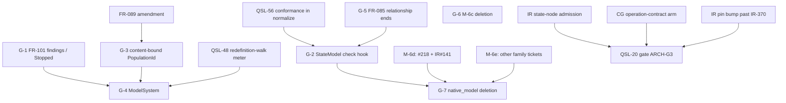

# SR-789: Dependency review of ADR-016 state, model and finite execution mapping

## Summary

Reviewed the ADR-016 gap table (G-1 to G-7), the pinned and current-head
rows (PI-1 to PI-5) and the open dependencies, on `spec/19-arch40-mapping`. The review checked four things:

- the ordering between gaps, and whether each edge is stated;
- enablement versus feature work;
- cross-repo blockers (IR-370, IR `state` node admission, the CG
  `operation-contract` arm, IR#141);
- that no gap is assigned to a closed ticket without a bounded child.

Linear was read with `linear api`, and its content is treated as data. Each
ticket-state claim below is the Linear state on 2026-09-29. Code claims were
measured on the worktree.

What holds:

- G-1, G-2, G-3 and G-5 are bounded, each with one owner and FR-level
  acceptance criteria and TCs that exist (TC-291, TC-471 to TC-474).
- No gap is assigned to QSL-57, which is Done.
- No native simulation code remains in the root crate, so G-6 does not
  depend on G-4.

What does not hold:

- One finding is high. G-7 cannot be done inside QSL-67 and QSL-68, because
  `native_model` has importers owned by other lanes and repos.
- G-6 names a Done ticket as co-owner, and its scope is smaller than the
  step it cites.
- The G-3 → G-4 and G-1 → G-4 edges are not stated, and Linear has no
  `blocks` edge between QSL-68 and QSL-67.
- FR-089's own acceptance criterion still contradicts ID-5.
- Open QSL-68 tickets are not reconciled with the gap table.
- The cross-repo rows name no IR or CG ticket for the remaining steps.
- Linear has QSL-20 blocking QSL-19, the reverse of what the ADR assumes.

## Findings

| ID | Severity | Summary | Refs |
| --- | --- | --- | --- |
| FND-001 | high | G-7 is not bounded inside QSL-67 and QSL-68. It says `native_model` is deleted "in the PR that removes its last importer (SEAM-2 `checking/composed/solver.rs`, SEAM-3 `protocol_artifact/mod.rs`)". Measured on the worktree, `native_model` has more importers. In SEAM-3 they include `protocol_artifact/v2/intake.rs`, `native/types.rs`, `models.rs`, `models/populations.rs`, `native/populations.rs` and `handoff/writer.rs`. There is also `src/temporal/formula.rs`, which is owned by #188 and #189. ADR-011 §7.3 puts the SEAM-3 handoffs in M-6d, which needs #218 and agent-ix/quire-contract-ir#141. It says M-6e's last family ticket "deletes the remainder" of SEAM-2, and the family tickets include #187, #188, #189, #191, #192, #198 and #218. So the PR that removes the last importer may belong to another lane or wait on IR. Fix: limit G-7 to what QSL-67 and QSL-68 own, which is deleting the composed `StateModel` family and the SEAM-3 reads that feed `state`. Give `native_model` removal to the last M-6e or M-6d ticket, as ADR-011 does, and state the edge to IR#141 and #218. | ADR-016 §9 G-7; ADR-011 §7.3 M-6d, M-6e, SEAM-3 row; ADR-012 §15.8 step 3; `src/protocol_artifact/**`, `src/temporal/formula.rs` |
| FND-002 | medium | G-6 names "QSL-67 (#121) with QSL-5". Linear QSL-5 is "ADR-013 TK-01: replay executor entry — the layer-6 replay facade", state Done. It came from the 2026-09-24 ruling that kept native `compile` "until QSL-5", and that condition has now passed. G-6's acceptance criterion also cites ADR-012 §15.8 step 2 but lists only part of it. Step 2 and ADR-011 M-6c also delete FR-100's `0-draft` route of CLI `run`, native `compile` and `lower`, `lowering` (with `ProjectionTarget` and `--target`), IT-010 (SEAM-4), and the QSL dev dependencies on CG, IR and the RT fixture crate. Fix: drop QSL-5 from G-6 and state that the hold it carried has lifted. List the full step 2 set in G-6's acceptance criterion, or name the ticket that deletes the rest. | ADR-016 §9 G-6; ADR-012 §15.8 step 2; ADR-011 §7.3 M-6a, M-6c; Linear QSL-5 |
| FND-003 | medium | G-4 depends on G-1 and on G-3, and neither edge is stated. FR-120-AC-6 and AC-8 need `Outcome::Stopped`, `StopReason::Stopped` and `ReplayError::FindingMismatch`/`Stopped`, which G-1 delivers. G-3 is justified because "no production path admits two bindings into one evaluation today". That stops being true when G-4 lands, because `ModelSystem` admits a binding for every state and every pre/post pair. G-3 is QSL-68 and G-4 is QSL-67. Linear has only a `related` edge between QSL-67 and QSL-68, no `blocks` edge, although the QSL-67 body says it "Depends on ... V1-A04". Fix: state G-1 → G-4 and G-3 → G-4 in §9. Add a Linear `blocks` edge from QSL-68 to QSL-67, or a bounded G-3 child that blocks QSL-67. | ADR-016 §2 ID-5, §9 G-1, G-3, G-4; FR-120-AC-6, AC-8; Linear QSL-67, QSL-68 |
| FND-004 | medium | FR-089 is amended only by a Status paragraph. Its Behavior section (lines 62-63) and FR-089-AC-1 still say the preimage is three facts, and the code doc reads FR-089 that way (`population.rs:694-705`). G-3 leaves "FR-089 amended to match" to the implementation PR. The spec-first order is reversed: a G-3 coder would build against an acceptance criterion that the ADR contradicts. Fix: amend FR-089's Behavior and AC-1 in this change, and add an AC for the `members` member and the SR-788 FND-001 cases. Or make the FR-089 amendment the first, spec-only step of G-3, before any code. | ADR-016 §9 G-3; FR-089 Behavior, FR-089-AC-1; `population.rs:694-705` |
| FND-005 | medium | Open QSL-68 tickets are missing from the gap table. §8 says QSL-67 and QSL-68 "do not yet conform in the seven places G-1 to G-7 name". Linear links these open tickets to QSL-68: QSL-48 (meter the redefinition-chain walk), QSL-56 (compose conformance checks into `normalize` phase 4), QSL-49, QSL-50, QSL-52, QSL-55 and QSL-59. QSL-56 was measured: `check_field_redefinition`, `check_operation_redefinition` and `check_subsetting` have no caller (`qsl-semantics/src/model/conformance.rs:188`, `:266`, `:345`). ARCH-40's acceptance asks for every unavailable scenario as a bounded AC. Fix: add rows for them, or state that they are existing children outside ARCH-40. Either way, name which G row depends on each: G-4 on QSL-48 (SR-788 FND-008), and G-2 and SC-2 on QSL-56 (SR-788 FND-010). | ADR-016 §8, §9; Linear QSL-48, QSL-49, QSL-50, QSL-52, QSL-55, QSL-56, QSL-59 |
| FND-006 | medium | Linear and the ADR disagree on the direction of QSL-20. Linear records QSL-20 (gate ARCH-G3, Backlog) as blocking QSL-19. The ADR treats QSL-20 as downstream: §6 and PI-5 say no state-clause evidence is claimed "toward gate QSL-20" until IR and CG land. Read together, the two form a loop, because QSL-19 feeds QSL-20 and QSL-20 blocks QSL-19. Fix: correct the Linear edge to QSL-19 → QSL-20, or state in the ADR why ARCH-40 can close while ARCH-G3 is Backlog. | ADR-016 §6, §11 PI-5, Context "Pinned blockers"; Linear QSL-19, QSL-20 |
| FND-007 | medium | The cross-repo blockers have no owning tickets for their remaining steps. PI-1 and Open dependency 1 say the I04 `read` half waits "until IR-370 lands and the pin moves". Linear IR-370 is Done. That is a Linear state; the local IR checkout's history has no matching commit, so it was not confirmed in code. The remaining step is then a QSL bump of `quire-contract-ir`, and it has no owner or ticket. PI-5 and Open dependency 2 ("IR admission of `state` nodes and a CG `operation-contract` arm") name no IR or CG ticket. Fix: name the ticket that owns the pin bump and its PI-4 heads check. Name or file the IR ticket for `state` node admission in `lower` and the CG ticket for the `operation-contract` arm, or record that none exists as an open blocker. | ADR-016 Context "Pinned blockers", §11 PI-1, PI-4, PI-5, Open dependencies; `Cargo.toml:72`; Linear IR-370 |
| FND-008 | medium | The owner tickets carry no G rows. The QSL-67 and QSL-68 bodies still say "Extend `runtime::execute`" and name the native lane. §9 says the ADR governs, but a coder reads the ticket, and neither body has a G row, AC, TC or `blocks` edge from this mapping. ARCH-40 accepts only when "every unavailable scenario is a bounded AC in #120/#121/#164". Fix: before QSL-19 closes, add G-1 to G-7 (and the FND-005 items) to the QSL-67 and QSL-68 bodies, or create one bounded child per G row with its AC, TC and edges. | ADR-016 §9 closing paragraph; Linear QSL-67, QSL-68, QSL-19 |
| FND-009 | low | OR-2 promises "a new agreement test in G-2", but G-2's acceptance-criterion and test columns name only the FR-063 seam probe and the unchanged FR-082 to FR-084 TCs. FR-082-AC-6 already has an agreement test (TC-219, TC-220). Fix: put the agreement test in G-2's acceptance criterion, or cite TC-219 and TC-220 in OR-2 and drop "new". | ADR-016 §9 G-2, §10 OR-2; FR-082-AC-6 |
| FND-010 | low | The order of G-2 and G-5 is not stated. SC-1 puts relationship-end existence in the S3 `StateModel` check, and G-2 moves the model forms behind that check. G-5 produces the `relationship_end` member it reads. Fix: state whether G-5 lands before G-2 or on its own, and which of the two adds the S3 relationship-end check. | ADR-016 §1 SC-1, §9 G-2, G-5; FR-085 |
| FND-011 | low | G-6 does not say that it is independent of G-4. No native simulation code remains (`grep -rl simulat src/` finds nothing), and spine clause execution (`run_clause`) already exists, so G-6 can land before or in parallel with G-1 to G-4. The QSL-67 exit criterion mixes the two ("ConfigVersion, state workflow and finite-simulation corpus replay"). Fix: state in §9 that G-6 has no prerequisite among G-1 to G-5, so it can be scheduled on its own. | ADR-016 §9 G-6; Linear QSL-67 |

## Classification

| Item | Class | Owner | Rationale |
| --- | --- | --- | --- |
| FR-089 amendment (ID-5) | Enablement | QSL-68 | Spec change that G-3 implements (FND-004) |
| G-1 FR-101 findings and `Stopped` | Enablement | QSL-67 | Engine API that `ModelSystem` uses; no model behavior of its own |
| G-2 `StateModel` check hook | Enablement | QSL-68 | Moves existing S3 typing behind a family contract; no new behavior |
| G-3 content-bound `PopulationId` | Enablement | QSL-68 | Identity change that multi-binding runs need |
| QSL-48 redefinition-walk meter | Enablement | QSL-68 | Bounds the frame decision that G-4 calls for every candidate |
| QSL-56 conformance in `normalize` | Enablement | QSL-68 | Makes the effective view that SC-2 walks refuse invalid redefinitions |
| IR pin bump past IR-370 | Enablement (cross-repo) | unnamed | Unblocks FR-105-AC-3 and FR-108-AC-6's `read` half |
| G-5 FR-085 relationship ends | Feature | QSL-68 | New resolution behavior |
| G-4 `ModelSystem`, `explore_model`, `sample_model` | Feature | QSL-67 | New simulation behavior over checked packages |
| G-6 M-6c state-lane deletion | Deletion | QSL-67 | Removes the replaced native lane |
| G-7 `native_model` deletion | Deletion | last M-6d or M-6e ticket (FND-001) | Removes a module that other lanes import |
| IR `state` node admission, CG `operation-contract` arm | External feature | unnamed IR and CG tickets | Needed only for state-clause proof (PI-5) |

## Dependency Graph

## Topological Order

1. FR-089 amendment, G-1, G-5, QSL-48, QSL-56 and G-6. These are
   enablement or independent work and can run in parallel.
2. G-3 after the FR-089 amendment. G-2 after QSL-56 and G-5.
3. G-4 after G-1, G-3 and QSL-48.
4. G-7 after G-2 and after the M-6d and M-6e importers are gone.
5. Gate QSL-20 after the IR pin bump, IR `state` node admission and the CG
   arm. None of these blocks G-1 to G-7.

## Cycles

The gap table itself has no cycle. There is one loop between Linear and the
ADR: Linear has QSL-20 → QSL-19, and the ADR has QSL-19 → QSL-20 (FND-006).
Correcting the Linear edge removes it.

## Disposition

Every finding above is fixed on `spec/19-arch40-mapping` in the ADR-016 rewrite and its listed amendments (ADR-011 M-6c and §8; ADR-012 §2, §3, §5.1, §13.5; ADR-013 O-13, T-6, QC-21, O-16, §6; FR-089; FR-120; `spec/tests.md`), except as noted below.

- FND-003, FND-006 and FND-008: the ADR records the Linear `blocks` edge, the QSL-20 edge relaxation and the ticket-body text as actions for the team lead on acceptance (ADR-016 §9 "Ticket text", Open dependencies). This review does not edit Linear.
- FND-007: the IR `state`-node and CG `operation-contract` tickets are recorded as open dependencies for the team lead to file.
