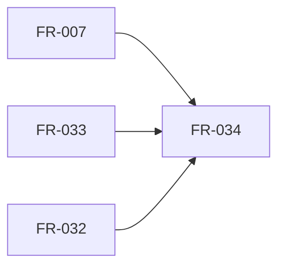

## Summary

Reviewed implementation/spec revision `b789eed`
at PR readiness, using the owner's selected all-set. No applicable AssuranceProfile.

FR-034 is a compiler feature consuming implemented lowering, native validation and the concrete model. Prerequisites are acyclic and present in the stack. C's numeric generation and deferred activation qualification are later consumers/assurance work, not implementation prerequisites for this scoped delivery.

## Findings

| ID | Severity | Summary | Refs |
| --- | --- | --- | --- |
| FND-001 | low | No unresolved engineering dependency in the compiler slice. | FR-034; FR-033; FR-007; FR-032 |

## Dependency order

| Requirement | Class | Prerequisite role |
| --- | --- | --- |
| FR-007 | Enablement for this feature | Construct completely validated contexts |
| FR-033 | Enablement for this feature | Bind bounded primitive expressions |
| FR-032 | Feature | Supply the concrete ConfigVersion workflow |
| FR-034 | Feature | Project fields and validated inputs |

