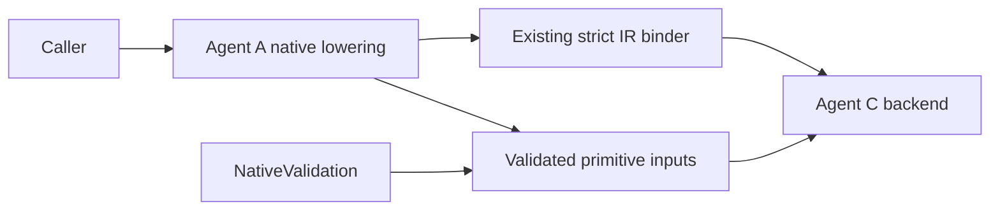

## Summary

Reviewed implementation/spec revision `b789eed`
at PR readiness, using the owner's selected all-set. No applicable AssuranceProfile.

FR-034 belongs to Agent A's compiler lowering module (core). It consumes native validation and existing IR contracts; it does not add a second model binder, runtime evaluator, evidence store or backend generator. B/C repositories and dependency pins are unchanged.

## Findings

| ID | Severity | Summary | Refs |
| --- | --- | --- | --- |
| FND-001 | low | Ownership and guaranteed-versus-deferred behavior are explicit. | FR-034; FR-007; FR-033 |

## Boundaries

| Dependency | Scope of guarantee | Evidence |
| --- | --- | --- |
| Native validation | Exact package/request and frame admission before inputs | TC-112 valid and forbidden-frame cases |
| Existing IR readers | Guaranteed reconstruction of this projected domain at the pinned revisions | TC-112 both real readers |
| Numeric codegen | Deferred; no generated execution guarantee | Existing backend refusal retained by FR-033 tests |
