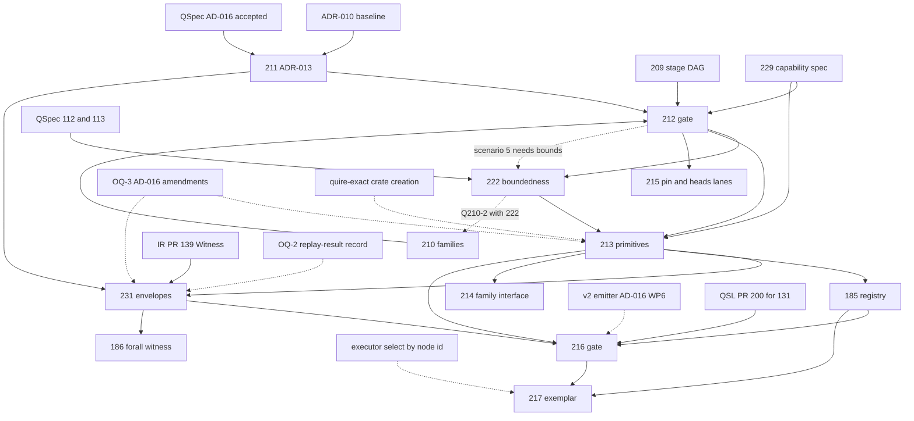

# SR-485: Dependency analysis of ADR-013

## Summary

Round 1. Reviewed commit 660aa25 on `task/211-type-ownership`: ADR-013 and its
`spec/spec.md` index row and `contains` edge. ADR-013 is the Layer 1 design for
#211. It decides the items that ADR-010 routes to #211 and hands the
implementation to #213 and #231. This pass checks four things:

- whether the enablement work is kept apart from the feature work;
- whether each decision's prerequisites are named and in the right order: QSpec
  amendments, sibling decisions #209 and #210, #222, AD-016 work packages, QSL
  PR #200 and IR PR #139;
- whether any cycle or hidden dependency blocks #212, #213 or #231;
- whether each implementing-ticket assignment falls inside the scope written in
  that ticket's body.

The ownership decisions themselves are well ordered. ADR-013 builds on AD-016
without reopening it, and it proposes no rename. It sends each open design
question to #209 or #210 with a question ID. It keeps #186 and #131 as feature
consumers of the #213 and #231 enablement types. Its capability chain matches
#229, #213 and #185, and its bounds chain matches #222 → #213. The `spec.md`
row and edge are correct.

The dependency data is not yet complete enough for #212 to place scenarios
against it, or for #213 and #231 to start without choosing owners themselves:

- Three QSpec amendments (OQ-3) and one question about which record is the
  replay result (OQ-2) have no QSpec ticket and no place in the order. Yet
  #213's kernel contents and #231's witness and replay envelopes depend on them
  (FND-001).
- Several §3 assignments to #231 are outside #231's written scope: replay
  execution, CG reconstruction and IR packet members. No other ticket owns
  that work (FND-002).
- No ticket creates the `quire-exact` crate, retargets RT and CG onto it, or
  builds the v2 emitter. #213's types live in that crate, and C-03 and O-02
  assume the emitter exists (FND-003).

There is one ordering cycle, and ADR-013 inherits it from #205. #212's scenario
5 needs the bound semantics that ADR-013 defers to #222, and #222 depends on
#212 (FND-004).

Verdict: REVISE. FND-001, FND-002 and FND-003 are high and block. Each has a
concrete fix.

## Classification

"Class" follows the dependency-analysis rule. An enablement item is a type,
contract or crate with no user-visible behaviour of its own. A feature item is
behaviour that a ticket delivers to users or to downstream consumers.

| Item | Class | Implementing ticket per ADR-013 | Rationale |
| --- | --- | --- | --- |
| R-01 to R-10, §2 equality kinds | Enablement | none (design rules) | Rules that constrain every §3 owner |
| O-01 domain-package identity | Enablement | #213 type; #131 wiring | Identity type consumed by the #131 intake feature |
| O-02 checked-package identity | Enablement | #213 | Minted by the v2 emitter, which no ticket builds (FND-003) |
| O-03 model declaration identity | Enablement | #213 (§3), #131 (§7) | Conflicting assignment (FND-007) |
| O-04 to O-07, O-11, O-12 identities, names, spans | Enablement | #213 | Shared checked identities |
| O-08 frame identity | Enablement | #213; semantics #210 | Identity only; frame semantics are feature work under #218 and #223 |
| O-09 clause and obligation identity | Enablement | #213; #231 | CG-owned obligation carried in envelopes |
| O-10 clause kind | Enablement | #213 | Layer-owned kinds with total maps |
| O-13 kernel value and rational semantics | Enablement | #213 | Needs the `quire-exact` crate (FND-003) |
| O-14 type descriptors, O-15 typestate | Enablement | #213 | Typestate primitives |
| O-16 outcomes, O-17 refusals and codes | Enablement | #213; #231; IR | IR map is AD-016 WP9 `OPEN` (FND-009) |
| O-18 digest record | Enablement | #213 | Folds `CanonicalDigest` without renaming it |
| O-19 capability values | Enablement | #229 vocabulary, #213 type, #185 routing | Matches the program chain |
| O-20 proof modes, O-21 bounds | Enablement | #222 design, #213 types | Consumed by features #188 and #189 |
| O-22 versions, O-23 pins | Enablement | #231, #213, #215, #226 | O-23 assignment to #213 is outside #213's scope (FND-006) |
| O-24 to O-27 proof result, witness, replay | Enablement | #231; IR PR #139 | Executor, reconstruction and packet members fall outside #231 (FND-002) |
| #131 / QSL PR #200 intake | Feature | #131 | Consumes O-01 and O-03 |
| #186 state `forall` witness payload | Feature | #186 | Adds a payload on top of the #231 carrier only (O-25, O-27) |
| #217 function Kani and replay exemplar | Feature (integration) | #217 | Consumes O-24 to O-27; integration and evidence only |

## Dependency Graph

Edges are the prerequisites stated in ADR-013, in the ticket bodies read on
2026-09-19, and in the #205 dependency graph. Dashed edges are prerequisites
that ADR-013 implies but that no ticket owns (FND-001 to FND-003).

## Topological Order

1. ADR-010, AD-016 (inputs, done). #209, #210, #211 and #229 run in parallel.
2. The OQ-2 and OQ-3 QSpec changes. They must be accepted before #213 and #231
   start, and they have no ticket today (FND-001).
3. #212, the gate.
4. #222 after QSpec #112 and #113 merge. #215 in parallel.
5. #213, including creation of the `quire-exact` crate, which no ticket owns
   today (FND-003). IR PR #139 merges in parallel.
6. #231, #185 and #214 in parallel.
7. #216 joins these with #131 / PR #200, the v2 emitter (no ticket today) and
   the executor selector change (no ticket today).
8. #217, then #186 and the Layer 3 and 4 features.

## Cycles

There is one cycle, and it concerns ordering: #212 → #222 → #212 through gate
scenario 5 and Q210-2 (FND-004). It is not a cycle among the ownership
decisions, and the §3 owners form no cycle. Q209-4 correctly sends the
`value` ↔ `model` module cycle (SCC S2) to #209.

## Findings

| ID | Severity | Summary | Refs |
|---|---|---|---|
| FND-001 | high | Four QSpec changes have no QSpec ticket and no place in the order, yet downstream work depends on them: OQ-3 (a) (the Replay-ownership `Witness` row stores `transcript` only), OQ-3 (b) (arrow 7 selects by checked node id), OQ-3 (c) (the kernel holds `EffectiveId` and the reference identity types) and OQ-2 (whether FR-323 or FR-352 is the replay-result record). Until they are amended, O-25's envelope invariant and O-26's selection key contradict accepted AD-016 (Replay-ownership row lists five `Witness` fields; arrow 7 executor entry is `call(&self, function: &str, …)`). O-05 and O-13 put types in the kernel that the AD-016 Shared-type row does not list. O-27 cannot name the record that #231 must build. R-02 and #231's own scope ("any missing normative wire/API contract returns to QSpec rather than being invented locally") therefore stop #231, and OQ-3 (c) stops #213's kernel work. #212's pass condition "Cross-repository changes have a named QSpec contract owner" fails as written. Fix: open QSpec issues for OQ-2 and OQ-3. Name them in §8 and in the Consequences, each with the tickets it blocks: (a) and OQ-2 block #231, (b) blocks the executor change (FND-002), (c) blocks #213. Also state whether #212 can pass while they are open or needs them accepted. | ADR-013 O-05, O-13, O-25, O-26, O-27, §8 OQ-2, OQ-3, Consequences · QSpec AD-016 Replay-ownership row, arrow 7, Shared-type row · #231 Scope · #212 Pass conditions |
| FND-002 | high | ADR-013 assigns replay work to #231 that #231's body excludes, and no other ticket owns it. (a) O-26 and C-13 assign the QSL executor behaviour to #231: recompile the locked source, recompute `package_id` and require equality, select by checked node id, and call `CheckedPackage::call`. C-13 also names "#231 stale-package test". But #231's Non-goals say "no … replay execution is implemented here", and changing the `call` selector from `function: &str` to a node id is an executor API change. #217 "owns integration and evidence only". (b) C-12 (packet → FR-323 request) is CG-owned, but its evidence is "#231 round trip". #231 is a QSL ticket, and CG reconstruction belongs to CG #50 (listed in #217). (c) O-25 says "adding a missing member [to the IR packet] is IR work under #231 and IR #137". IR #137's body covers only the FR-031 witness link (extract, reconstruct, TC-042), not `package_id`, contract version or backend identity members. Fix: limit #231 to the typed request and result, round trips and version and stale refusals at decode. Give the executor selector and recompile path to a named QSL slice that orders before #217, either #214 (function migration) or a new ticket. Give C-12 to CG #50, and open or name an IR issue for the O-25 packet members. | ADR-013 O-25, O-26, §4 C-12, C-13, §7 · #231 Non-goals · #217 Cross-repository coordination · IR #137 body |
| FND-003 | high | No ticket creates the `quire-exact` crate or implements AD-016's kernel and emitter work packages, yet #213's types depend on both. O-04 (`NodeKey`), O-13 (`Value`, rational ops), O-16 (`Outcome`) and O-21 (`Meter`) all live in `quire-exact`. O-13 says "Its crate creation and dependency direction are decided in #209; its types are built in #213" but names no ticket that creates the crate. QSL origin/main 8170101 has no `crates/` directory. DA-16 decides that "RT and QSL hold no kernel copies", but no ticket retargets RT `src/exact/` or CG oracles (AD-016 WP5a and WP5b). O-02 and C-03 assume a v2 emitter that "mints" `package_id` and a node-keyed `source_map` (O-07, O-12). QSL main has only the preimage reader (`value/package_identity.rs`), and AD-016 marks the emitter "new in WP6". §7 does not name #214, which is the Layer 2 checked-package path. Fix: in §7, map AD-016 WP5a, WP5b, WP6, WP8 and WP9 to tickets. State that #213 creates `crates/quire-exact` in the direction #209 decides, or name the ticket that does and put it before #213. Name the RT and CG tickets that remove the kernel copies before #216. Assign C-03 and the v2 `source_map` emission to #214 or another named ticket. | ADR-013 O-02, O-04, O-07, O-12, O-13, O-16, O-21, §4 C-03, §7, §9 DA-16 · QSpec AD-016 Shared-type row, arrow 2 Owner, Exit criteria · QSL origin/main 8170101 `src/value/package_identity.rs` · #214 body |
| FND-004 | medium | Ordering cycle #212 ↔ #222. #212 gate scenario 5 ("submit an unsupported unbounded proof request") must be placed against O-20 and O-21. Those items defer the absent-bound meaning, trace position, interval, horizon and the infinite-trace facet to #222, and Q210-2 sends the proof-mode vocabulary to "#210 with #222". But #222 depends on #212 and cannot be accepted before QSpec #112 and #113 merge (both open). §8 has tables for #209, #210 and the owner, but none for #222, and it never names QSpec #112 or #113 as prerequisites of #213's bound types. Fix: add a "Questions for #222" table with its QSpec #112 and #113 prerequisites. State which parts of O-20 and O-21 are decided now and are enough for #212 scenario 5: the owner per bound kind, four distinct types, no implicit narrowing, and `requires-bound` as the single predicate. State that only #213 waits on #222's semantics. Split Q210-2 so that #210 owns the mode vocabulary and #222 owns the bound semantics. | ADR-013 O-20, O-21, §8 Q210-2 · #212 scenario 5 · #222 header · #205 Dependency graph · QSpec #112, #113 |
| FND-005 | medium | Q210-1 sends "wire spelling and version of capability values" to #210, but that is #229's written scope ("Define canonical spelling, identity, ordering/non-ordering semantics, serialization authority, and version behavior"). O-19's own chain says #229 owns the vocabulary. #213 consumes #229, not #210 ("Implement the canonical Rust `Capability` value type from #229"). As routed, #213 would depend on a #210 decision that #210's scope does not cover. Fix: send the spelling and version to #229. Keep only the backend-identity carrier (packet and FR-323 request) with #210, or give it to #229 as well. | ADR-013 O-19, §8 Q210-1 · #229 Scope · #213 Scope · #210 Required design |
| FND-006 | medium | The §3 and §7 ticket assignments disagree, and some fall outside the named ticket's scope. (a) The §7 #213 row leaves out O-03, O-07, O-08, O-10, O-11 and O-14, which §3 assigns to #213. (b) O-23 says "#213 removes QSL's restated revision literals (OBS-022)", but #213's scope covers identity, typestate, outcomes, bounds and Capability, not pins. The pin lane is #215, so the §7 #215/#226 row should carry it. (c) O-23 says "CG removes its own literals (OBS-034)" and names no ticket. (d) §7 gives "FR-322 code completeness (OBS-035)" to IR #137 / PR #139, but IR #137's body is the FR-031 witness defect only. Fix: make §7 the complete inverse of §3's implementing-ticket rows. Move OBS-022 to #215 or add it to #213's scope explicitly. Name or open CG and IR issues for OBS-034 and OBS-035. | ADR-013 O-03, O-07, O-08, O-10, O-11, O-14, O-17, O-23, §7 · #213, #215 Scope · IR #137 body |
| FND-007 | medium | O-01, O-03 and the Consequences describe the state before QSL PR #200, and the order they imply puts feature work before enablement. `DomainPackageRef` is already on QSL main (`src/model/domain_package.rs:359`), with public fields and no `digest_domain`. PR #200 head 9e59dde already has `ValueTypeRef{Native, Package}`, and its doc comment rules out "a synthetic `DeclarationKey` under a made-up 'quire/native' package". So the Consequence "PR #200 must encode native references as `ValueTypeRef::Native` before it merges" is already met. It is also a merge condition set by a record that #212 accepts only after #200 is likely to merge. O-03 names #213 in §3 and #131 / PR #200 in §7. O-01 says "#213 builds the identity type". Because #131 does not depend on #213, #213 will in fact change the existing type (adding `digest_domain` and intake-only construction) after #131 lands. Fix: restate O-01 and O-03 against main and PR #200 head 9e59dde. Say that #131 is not blocked by ADR-013. Assign the `DomainPackageRef` changes and the migration of the #131 intake to #213, and drop the stale Consequence. | ADR-013 O-01, O-03, §7, Consequences · QSL origin/main `src/model/domain_package.rs:359` · PR #200 head 9e59dde `src/model/domain_package.rs:132-143`, `src/model/intake.rs:97-109` · #131 body |
| FND-008 | low | IR PR #139 is open (head 417ec86, "PR 1 of 2"), and O-25, C-10 and OQ-3 (a) are built on it. At that head, `Witness` has the single public field `transcript` (`src/kani/witness.rs:101-107`) and derived accessors (`:167-180`, `:343`), so the witness fact is correct. But §7 does not say that #139 must merge at a recorded SHA before #231. It also does not name the follow-up CG PR ("Codegen changes follow in a separate PR"), which carries the C-11 reconstruction. Fix: in §7, add "IR PR #139 merges before #231" and name the CG follow-up as the C-11 owner. | ADR-013 Context witness fact, O-25, §4 C-10, C-11, §7 · IR PR #139 head 417ec86 body and `src/kani/witness.rs` |
| FND-009 | medium | Three decisions depend on cells that AD-016 still marks `OPEN — decided in WP9`, and ADR-013 names no ticket or order for them. (a) The O-16 category table maps the `refusal` and `internal failure` proof rows "per the IR map", which is AD-016 WP9 `OPEN`. So the FR-331 category of `Refused`, `InvalidInput`, `IncompleteInput`, `Unavailable` and `Inconclusive` is undecided. #231 must nevertheless show that "outcome categories [do not] collapse", and #212 scenario 6 needs a result category. (b) O-27's parity carrier field is WP9 `OPEN`. (c) O-02 and Q209-3 rely on the WP6 module path. Fix: name the IR ticket that decides the WP9 `KaniOutcomeKind` → FR-331 map and the parity field, and place it before #231. Alternatively, decide the category of each of the five kinds in O-16 now and leave only the catalog-code table to WP9. | ADR-013 O-16, O-24, O-27, §8 Q209-3 · QSpec AD-016 arrow 6 and 7 `OPEN — decided in WP9` · #231 Acceptance · #212 scenario 6 |
| FND-010 | low | OQ-1 (does `run` keep producing `native-run-result/1`?) is open, but feature ticket #186's exit criterion already assumes that both versions are produced: "`/1` output unchanged for cases without a witness". The owner answer to OQ-1 is therefore a prerequisite of #186 that neither record states. Fix: in OQ-1, say that it must be answered before #186 starts, and that #186's exit criterion is amended if the answer is `/2` only. | ADR-013 §5, §8 OQ-1, O-27 · #186 Exit |

## Method

- Read ADR-013 at 660aa25 in full, and the diff `8170101..660aa25 -- spec/spec.md`
  (index row and `contains` edge).
- Read QSpec AD-016 at `origin/main`: Owner decisions, Shared-type row, arrows
  1–7, the `OPEN — decided in WP<n>` cells and the Exit criteria. Confirmed
  that FR-143, FR-201, FR-321, FR-322, FR-323, FR-331, FR-340, FR-351, FR-352,
  AD-014, `native-diagnostics.md` and `proposals/checked-package-v2/` exist on
  QSpec `origin/main`.
- Read the bodies and states, as of 2026-09-19, of QSL #131, #185, #186, #188,
  #189, #205 (its dependency graph), #209–#217, #222, #226, #229 and #231, IR
  #137, and QSpec #112, #113, #114 and #116 (closed).
- Checked IR PR #139 at head 417ec86 (`src/kani/witness.rs` struct and
  accessors) and QSL PR #200 at head 9e59dde (`ValueTypeRef`,
  `DomainPackageRef`, native `typeRef` prefix). Checked QSL `origin/main`
  8170101 for `DomainPackageRef`, `quire-exact`/`crates/`, a v2 emitter and
  `object_keys`.
- Classified each O-item as enablement or feature, built the prerequisite graph
  and checked it for cycles. Compared each implementing-ticket assignment with
  the Scope and Non-goals of the named ticket.
